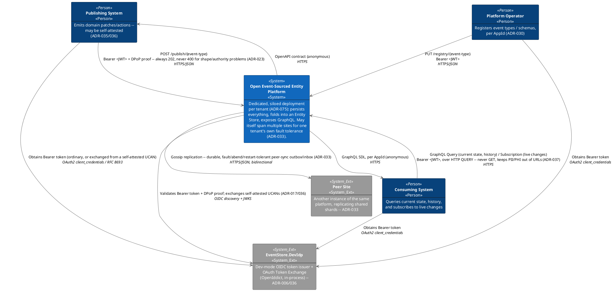
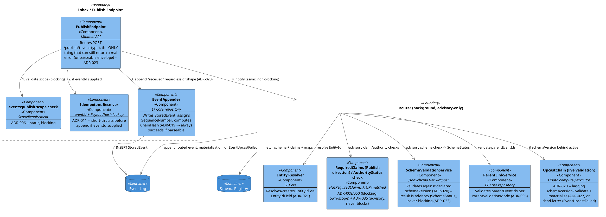
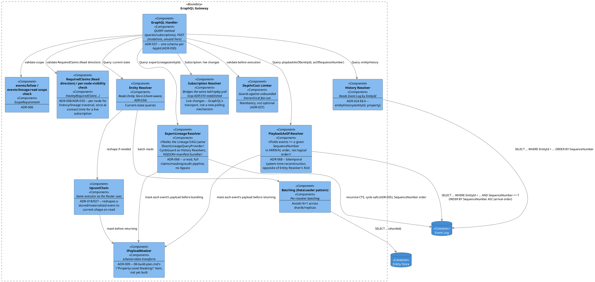
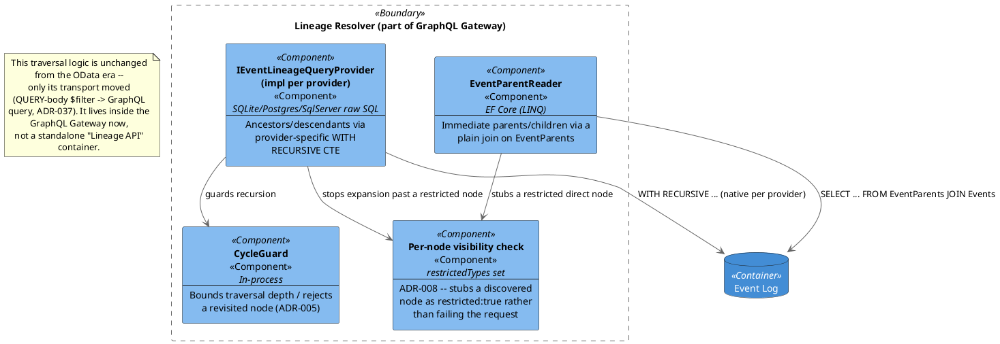
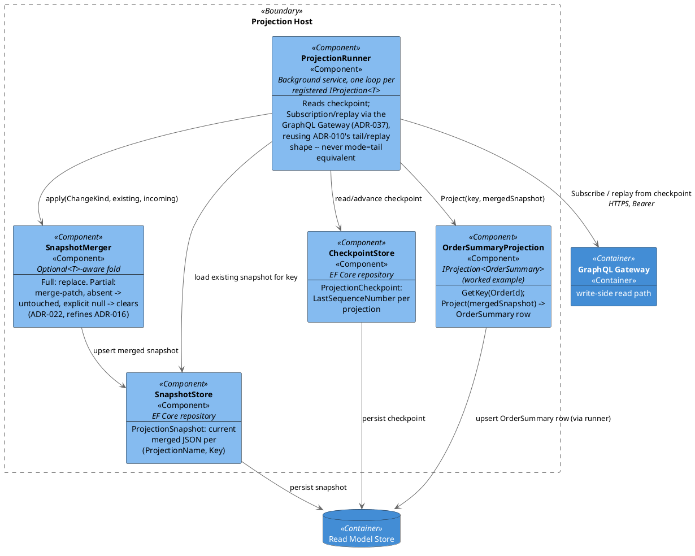
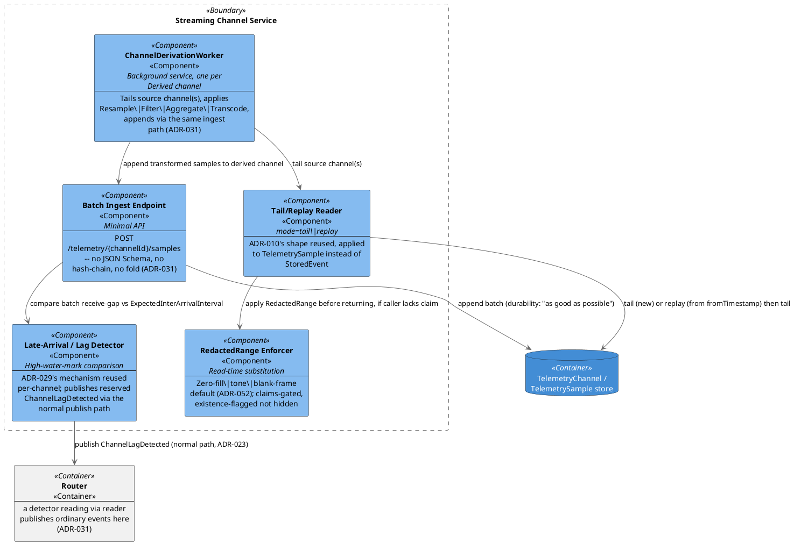
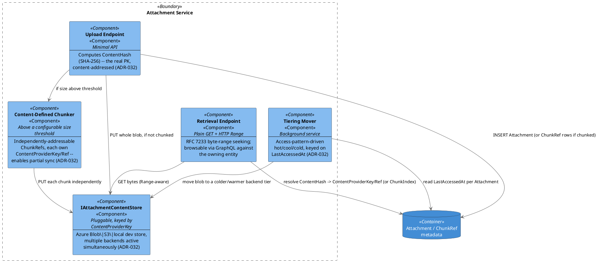
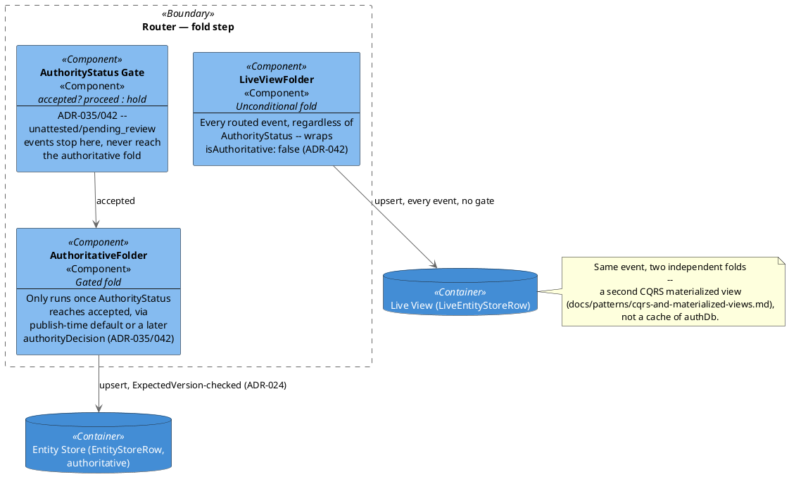

# C4 Architecture

Diagrams use **plain PlantUML, hand-styled in the C4 notation** (boxes for
Person/System/Container/Component, dashed boundary groupings, a
consistent color tier per level) — not the `C4-PlantUML` macro library.
`C4-PlantUML` requires either a live fetch of its `.puml` files from
GitHub (`!include https://raw.githubusercontent.com/...`) or a bundled
copy of the PlantUML standard library (`!include <C4/C4_Container>`);
both fail silently (a blank or broken diagram, no readable error) in any
renderer without internet access or without that stdlib path configured
— which is most local/offline PlantUML setups. Plain PlantUML has no
such dependency: every diagram below is fully self-contained and renders
anywhere PlantUML itself runs. See `references.md` for why `C4-PlantUML`
moved from adopted to reference-only over this. **This is now a standing
convention for every PlantUML diagram in this repo, not just this
file** — never reach for `C4-PlantUML` (or any other external
`!include`) again; style C4-shaped diagrams by hand instead, the same
way the diagrams below do. These are the static structural views; for the
runtime/dynamic view of a specific feature (plain PlantUML sequence
diagrams, plus the Gherkin scenarios they illustrate), see
`features/*.md`.

**This diagram reflects the post-integration shape** (`ADR-021` onward —
see `CLAUDE.md`'s "Integration status"). If you're looking for the
OData-era, single-store, reject-on-invalid picture this superseded, it's
in git history, not here.

**Deployment note**: per `ADR-001`, the Publish/Schema-Registry/Spec-
Generator/GraphQL-Gateway containers below are built as **three separate
deployables per site** — `EventStore.Host.Sqlite`/`.Postgres`/`.SqlServer`
— one per database provider, not a single artifact with a runtime switch.
Per `ADR-034`, a *site* itself holds a subset of shards (by `EntityType`);
per `ADR-033`, at least two sites replicate any given shard. C4 Container
diagrams describe logical architecture, not deployment topology, so this
is a note rather than a full multi-site deployment diagram — see
`06-solution-structure.md` for the project split and
`docs/comparisons/peer-sync-topology.md`/`sharding-strategy.md` for the
topology decisions themselves.

## Context diagram

## Container diagram

```plantuml
@startuml C4_Container
skinparam shadowing false
skinparam defaultTextAlignment center
skinparam wrapWidth 220
skinparam rectangle<<Person>> {
  BackgroundColor #08427B
  FontColor white
}
skinparam rectangle<<System_Ext>> {
  BackgroundColor #999999
  FontColor white
}
skinparam rectangle<<Container>> {
  BackgroundColor #438DD5
  FontColor white
}
skinparam database<<Container>> {
  BackgroundColor #438DD5
  FontColor white
}
skinparam rectangle<<Boundary>> {
  BackgroundColor transparent
  BorderColor #666666
  BorderStyle dashed
}
skinparam ArrowColor #666666

rectangle "**Publishing System**\n<<Person>>" <<Person>> as publisher
rectangle "**Consuming System**\n<<Person>>" <<Person>> as follower
rectangle "**Platform Operator**\n<<Person>>" <<Person>> as operator
rectangle "**EventStore.DevIdp**\n<<System_Ext>>\n--\nOIDC + Token Exchange -- ADR-006/036" <<System_Ext>> as idp
rectangle "**Peer Site(s)**\n<<System_Ext>>\n--\nADR-033" <<System_Ext>> as peerSite

rectangle "Open Event-Sourced Entity Platform (one site)" <<Boundary>> as system {
    rectangle "**Inbox / Publish Endpoint**\n<<Container>>\n//.NET (ASP.NET Core)//\n--\nPOST /publish; persists first, always 202 unless the envelope itself is unparseable (ADR-023); Idempotent Receiver (ADR-011)" <<Container>> as inbox
    rectangle "**Router**\n<<Container>>\n//Background service//\n--\nSchema validation, entity resolution (ADR-021), live upcast validation + materialization (ADR-020/027), non-authoritative claim capture (ADR-035) -- all advisory, none block Inbox's 202" <<Container>> as router
    database "**Event Log**\n<<Container>>\n//EF Core over SQLite/Postgres/SqlServer (ADR-001)//\n--\nStoredEvent, EventParent -- insert-only, hash-chained (ADR-019)" <<Container>> as eventLog
    rectangle "**Fold / Projector**\n<<Container>>\n//Background service//\n--\nLogical-order fold (OccurredAt, not arrival order -- ADR-029); optimistic-concurrency conflict flagging (ADR-024); always-on, not opt-in" <<Container>> as fold
    database "**Entity Store**\n<<Container>>\n//Mutable, versioned, hashed, sharded by EntityType (ADR-021/034)//\n--\nCurrent materialized state -- the only thing GraphQL reads read from" <<Container>> as entityStore
    rectangle "**Schema Registry Service**\n<<Container>>\n//.NET//\n--\nCRUD for named/versioned JSON Schemas, AppId-scoped (ADR-030); FilterableFields, ChangeKind, EntityIdField, upcast/downcast maps (ADR-018/028)" <<Container>> as registry
    rectangle "**GraphQL Gateway**\n<<Container>>\n//.NET (Hot Chocolate-class), QUERY method//\n--\nQuery (entity + change history), Subscription (live changes, replaces OData $filter/Follow) -- per-AppId schema (ADR-030/037); depth/cost limiting" <<Container>> as graphql
    rectangle "**Spec Generator**\n<<Container>>\n//.NET//\n--\nBuilds OpenAPI (publish) + GraphQL SDL from registry state; MaskingSchemaTransformer (ADR-002/009)" <<Container>> as specGen
    rectangle "**Streaming Channel Service**\n<<Container>>\n//.NET//\n--\nBatch ingest + tail/replay for telemetry & media channels (ADR-031) -- bypasses schema validation/hash-chain/fold entirely" <<Container>> as streaming
    database "**Streaming Channel Store**\n<<Container>>\n//Plain append-only table, v1 engine choice (ADR-031)//\n--\nTelemetryChannel, TelemetrySample" <<Container>> as streamStore
    rectangle "**Attachment Service**\n<<Container>>\n//.NET//\n--\nContent-addressed binary uploads; browse via GraphQL, fetch via GET with Range support (ADR-032)" <<Container>> as attachments
    database "**Attachment Store**\n<<Container>>\n//Content-addressed//\n--\nAttachment, AttachmentRef" <<Container>> as attachmentStore
    rectangle "**Peer Sync Outbox/Inbox**\n<<Container>>\n//Durable store + background service, gossip topology//\n--\nFault/abend/restart-tolerant (ADR-033); reuses the same durable transport as Inbox above" <<Container>> as peerSync
}

rectangle "CQRS Read Side (example) -- separate deployable and database, ADR-015" <<Boundary>> as readSide {
    rectangle "**Projection Host**\n<<Container>>\n//.NET (background service)//\n--\nOpt-in custom projections, on top of the always-on Entity Store above (ADR-015/016)" <<Container>> as projectionHost
    database "**Read Model Store**\n<<Container>>\n//EF Core, its own database//\n--\nProjectionCheckpoint, ProjectionSnapshot, OrderSummary (example)" <<Container>> as readDb
}

publisher --> inbox : Publishes patches/actions\n//HTTPS/JSON, Bearer + DPoP//
follower --> graphql : Query / Subscription\n//HTTPS (QUERY method), Bearer + DPoP//
operator --> registry : Registers schemas\n//HTTPS/JSON, Bearer//
publisher --> streaming : Batch-ingests channel samples\n//HTTPS, Bearer//
publisher --> attachments : Uploads binary content\n//HTTPS, Bearer//

inbox --> eventLog : Append "received" (Idempotent Receiver + Inbox pattern)
inbox --> router : Notify new item
router --> registry : Schema + claims + upcast/downcast maps lookup (advisory)
router --> eventLog : Append routed event; append UpcastMaterialization (ADR-027) or EventUpcastFailed (ADR-020) as needed
fold --> eventLog : Replay in OccurredAt order
fold --> entityStore : Write materialized version; ConflictFlag/LateArrivalFlag
graphql --> entityStore : Read current state (sharded, ADR-034)
graphql --> eventLog : Read change history (ADR-024 §8.4)
registry --> eventLog : n/a -- registry has its own table, shown for scope only
specGen --> registry : Read schema/event-type metadata
publisher --> specGen : GET /openapi.json (anonymous)
follower --> specGen : GraphQL SDL introspection (anonymous)
streaming --> streamStore : Batch append; tail/replay (ADR-010's shape, reused)
attachments --> attachmentStore : Content-addressed put/get; GraphQL browse, GET with Range
eventLog --> peerSync : Feeds outbound peer sync
peerSync --> eventLog : Delivers events from peers -- same path as Inbox, no special-casing
peerSync --> peerSite : Gossip exchange\n//HTTPS/JSON//

inbox --> idp : Validates Bearer + DPoP; may trigger Token Exchange (ADR-036)
graphql --> idp : Validates Bearer + DPoP
registry --> idp : Validates Bearer + DPoP

projectionHost --> graphql : Subscribes (its own client identity)\n//HTTPS, Bearer//
projectionHost --> readDb : Upsert snapshot + read-model rows\n//EF Core//

@enduml
```

## Component diagram — Inbox & Router (Publish path)

## Component diagram — GraphQL Gateway

`ExportLineage Resolver` and `PlaybackAsOf Resolver` are both new *read*
shapes over history (`ADR-068`), not a privileged bypass of anything
above — both route through the identical `IPayloadMasker` transform (and,
implicitly, the same `claimCheck` per-node visibility rule `History
Resolver`'s own traversal already applies) rather than a separate
enforcement path. See [`docs/features/lineage-export-and-playback.md`](features/lineage-export-and-playback.md)
for the full mechanism.

## Component diagram — Lineage traversal (now inside the GraphQL Gateway)

## Component diagram — Projection Host (CQRS read side)

A **full rebuild** is not a separate component or code path here — it's
`checkpointStore` reset to `0` plus `readDb`'s tables truncated, then the
exact same `runner` loop shown above runs again from scratch (`ADR-015`).

## Component diagram — Streaming Channel Service

## Component diagram — Attachment Service

## Component diagram — Live View (gated authoritative fold)

Details the fold-time split `ADR-042` decided, shown only as a single
"materialization" arrow in the Publish-path diagram above — this
diagram is that arrow's own internals, the composition already
documented in `docs/patterns/interactions/gated-authoritative-
publish.md`.

## Suggested References

- [C4 model](https://c4model.com/) — Simon Brown; the notation these diagrams follow (Context/Container/Component), hand-styled in plain PlantUML rather than rendered through the macro library below.
- [PlantUML](https://plantuml.com/) — the diagram engine these diagrams are written directly against, with no external `!include`.
- [C4-PlantUML](https://github.com/plantuml-stdlib/C4-PlantUML) — considered, not used; see `references.md` for why (unreliable rendering without network/stdlib access).

See `references.md` for the full bibliography, including the standards
behind what each container/component actually does (cross-referenced from
the docs where they're decided, e.g. `03-api-contracts.md`, `07-adrs.md`).
