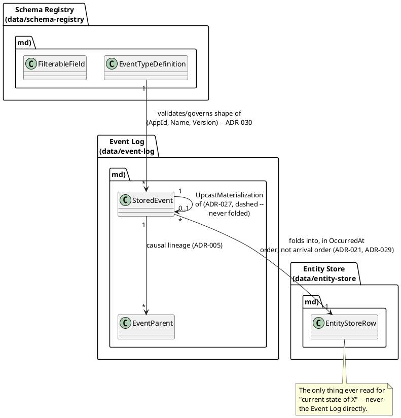

# Data Model

This model outgrew a single file — it's now organized by **entity
group**, one file per group under [`data/`](data/), following the same
split this design package already applied to ADRs
(`07-adrs.md`/`adrs/`) and patterns (`patterns/`). This file is the
**classification overview**: how the groups relate, and a table of
contents into the detail files. No entity class lives in this file
anymore — go to the linked file for the actual C# shapes.

## The core entity groups, and how they relate

The diagram below shows the original three groups' core relationships
(schema → event → entity-store fold) — `streaming-and-attachments.md`
and `access-log.md` are real, independent groups too (see the table
below), each deliberately living outside this diagram's fold-centric
relationships since neither one folds into the Entity Store at all.

| Group | File | Covers |
|---|---|---|
| **Schema Registry** | [`data/schema-registry.md`](data/schema-registry.md) | `EventTypeDefinition`, `ChangeKind`, `ParentValidationMode`, `FilterableField` — plus event-type security (required claims) and property-level masking, since both live *inside* a registered schema, not as separate tables. This group also carries every later item's own supporting tables that didn't earn a dedicated group of their own: `PeerSyncCursor`/`AppResidencyPolicy` (replication/residency), `WebhookSubscription`/`WebhookOutbox`/`WebhookDeliveryCursor`, `ViewDefinition`, `FeatureFlagState`, `LeaderLease`, `DerivationDefinition`/`DerivationCursor`/`PendingJoinState`, and `ExpectedResponseTracker` (`ADR-094`, not yet built) — see `data/schema-registry.md` itself for the full, current list |
| **Event Log** | [`data/event-log.md`](data/event-log.md) | `StoredEvent`, `EventKind`, `EventParent` — plus lineage, publish idempotency, tamper evidence (hash chain), upcasting/materialization, downcast, and the `EventUpcastFailed` dead-letter type |
| **Entity Store** | [`data/entity-store.md`](data/entity-store.md) | `EntityStoreRow` — the always-on, automatically-folded "current state" read path (`ADR-021`), including why `Version` and `LastAppliedSequenceNumber` are deliberately two different counters (`ADR-029`) |
| **DbContext & conventions** | [`data/dbcontext-and-conventions.md`](data/dbcontext-and-conventions.md) | The full `EventStoreContext`/`OnModelCreating` wiring and the portability rules that apply across all three groups above — kept separate so a cross-cutting rule isn't duplicated three times |
| **Streaming & Attachments** | [`data/streaming-and-attachments.md`](data/streaming-and-attachments.md) | `TelemetryChannel`/`TelemetrySample` (`ADR-031`), `Attachment`/`AttachmentRef` (`ADR-032`) — two data planes deliberately separate from the Event Log, each with its own storage |
| **Access Log** | [`data/access-log.md`](data/access-log.md) | `AccessLogEntry` (`ADR-045`) — a sixth, independent append-only store recording every *read*, not derived from or folded into anything above |

The **read side** (custom CQRS projections — `ProjectionCheckpoint`,
`ProjectionSnapshot`, `OrderSummary`, etc.) is deliberately **not** a
fourth group here — it lives in its own `ProjectionsDbContext`, in its
own database, documented in `09-cqrs-read-models.md`. Keeping it out of
this file entirely is itself part of demonstrating the write/read (CQRS)
split this project exists to show — see
`patterns/cqrs-and-materialized-views.md`.

## Suggested References

- [EF Core](https://learn.microsoft.com/en-us/ef/core/) — the ORM this whole model is expressed against.
- [JSON Schema (2020-12)](https://json-schema.org/specification) — what `EventTypeDefinition.JsonSchema` validates against.
- [RFC 8259](https://datatracker.ietf.org/doc/html/rfc8259) — JSON, the format `Payload`/`JsonSchema` are stored as text in.
- [FIPS 180-4](https://csrc.nist.gov/pubs/fips/180-4/final) — SHA-256, used for both `PayloadHash` (`ADR-011`) and `ChainHash` (`ADR-019`).
- [RFC 4122](https://datatracker.ietf.org/doc/html/rfc4122) — UUID, the format of `EventId`.

Kept consolidated here rather than repeated per group file, the same
choice `07-adrs.md` makes for its own split — see `references.md` for
the full bibliography.
