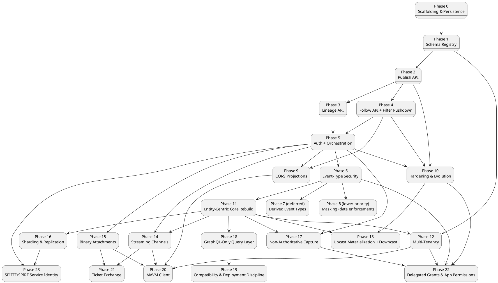

# Build Plan

This sequences the design in `01`–`07` and `features/*.md` into implementation
phases. Each phase lists its scope, what it depends on, and exit criteria
defined in terms of the Gherkin scenarios already written — a phase isn't
"done" by feel, it's done when its feature doc's scenarios pass, on every
database provider the scenario applies to.

Phases 7 and 8 are both out of the critical path, for two different
reasons: Phase 7 per the unresolved open questions in `ADR-007`; Phase 8
purely as a priority call (masking's design is complete, per `ADR-009` —
it's just scheduled after everything else, not blocked on anything). Phase
9 (CQRS projections) is independent of both 7 and 8 — it depends only on
Follow (Phase 4) and auth (Phase 5) existing, since a projection is just
another Follow caller (`ADR-015`) — but it's sequenced last in this list
because it's this project's demonstration of CQRS *on top of* the rest of
the design, not a dependency any other phase needs.

**Phases 11–20 are the design-docs integration** (`ADR-021`–`039`, see
`CLAUDE.md`'s "Integration status"). Phase 11 is the load-bearing one —
nothing in 12–20 makes sense without entities, `Optional<T>` patches, the
persist-everything posture, and conflict/ordering detection existing
first. Phases 12–17 are largely independent of each other once 11 lands
(multi-tenancy, schema-evolution extensions, streaming, attachments,
distribution, and non-authoritative capture don't depend on one another).
Phase 18 (the GraphQL-only swap) depends on 11 specifically, not on 12–17
— it could in principle run in parallel with them, though in practice
it's disruptive enough (it supersedes Phases 3/4's entire query surface)
that sequencing it deliberately, once, is likely easier than interleaving
it with five other phases touching the same codebase. Phase 20 (the MVVM
client) is sequenced near the end for the same reason `ADR-039` itself
gives: least load-bearing, composes what already exists rather than
adding new server-side mechanism. **Phase 21 (`ADR-040`'s ticket
exchange) depends on Phase 14/15 specifically** — it closes a gap those
two phases' own header-incapable callers (`<video src>` playback, WebDAV
retrieval) reopen, so it can't meaningfully start until they exist,
though it doesn't depend on Phase 18/19/20 at all and could run
alongside them.

## Dependency overview

Phases 3 and 4 both depend only on Phase 2, not on each other — they can be
built in either order, or in parallel by two people. Phase 5 fans back in
because it wraps every endpoint built in 1–4, so it can't meaningfully start
until they all exist. Phase 6 depends on Phase 5 specifically because
`RequiredPublishClaim`/`RequiredReadClaim` enforcement needs the caller's
JWT claims to already be populated — there's nothing to check against
before JWT bearer auth exists (`ADR-008`). Phases 7 and 8 both depend on
Phase 6, not on each other — like 3/4, they're independent and can run in
either order once the primary system (0–6) is stable. Phase 8 also has a
real, non-transitive dependency on Phase 4 specifically (the shared
`x-masking` node-finding helper introduced there) — already guaranteed by
the diagram's ordering (4 → 5 → 6 → 8), just called out explicitly since
it's a genuine content dependency, not only a scheduling one. Phase 9
depends only on Phase 4 (Follow must exist — a projection is a Follow
caller, `ADR-015`) and Phase 5 (it needs its own OAuth2 client to
authenticate as one) — **not** on Phase 6, because the worked example
doesn't require a claim-gated event type to demonstrate the merge rule,
though a real projection over a claim-gated type would need Phase 6's
enforcement to already exist so its client's claims mean anything. It's
independent of Phases 7 and 8 entirely. Phase 10 depends on Phase 5 (DPoP
hardens the auth model Phase 5 already built), Phase 2 (hash chaining
extends `EventAppender`, built in Phase 2), and Phase 4 (event upcasting
matters most for Follow's `mode=replay`) — it's independent of Phases 6
through 9, since none of DPoP/upcasting/hash-chaining touch event-type
security, masking, derived events, or projections.

## Phase 0 — Scaffolding & persistence

**Scope**: the project layout in `06-solution-structure.md`
(`EventStore.Domain`, `EventStore.Persistence`, the three
`*.Migrations.<Provider>` projects, `EventStore.Host.Core`, and the three
`EventStore.Host.<Provider>` deployables per `ADR-001`). Build the **full**
`EventStoreContext` model now — `EventTypeDefinition`, `FilterableField`,
`StoredEvent`, `EventParent` — even though most of it isn't used until later
phases. Laying down one coherent schema up front avoids a second wave of
migrations once Phases 1–3 start using tables that Phase 0 didn't create.
`EventStore.AppHost`/`EventStore.ServiceDefaults`/`EventStore.DevIdp` are
**not** part of this phase — see Phase 5.

**Depends on**: nothing.

**Exit criteria**:
- Solution builds; an initial migration exists and applies cleanly on
  SQLite, PostgreSQL, and SQL Server.
- `EventStore.IntegrationTests` runs one trivial round-trip test (insert +
  read back a `StoredEvent`) against all three providers (Testcontainers for
  Postgres/SQL Server, file-based SQLite) — this harness stays live for
  every phase after this one, it is not a one-time setup task.

## Phase 1 — Schema Registry

**Scope**: `PUT`/`GET /registry/{event-type}` and `QUERY /registry`
(paginated listing, `ADR-012`) per `05-schema-registry-and-spec-generation.md`
and [`features/schema-registry.md`](features/schema-registry.md): structural
JSON Schema validation, `FilterableField` path validation against the
schema, versioning (`IsActive` flip, no mutation of prior versions),
`ParentValidationMode` accepted and validated as an enum on the request.
Per-provider index/computed-column migrations for `IsIndexed = true` fields
(`04-odata-filter-pushdown.md`) are built here too, even though nothing
queries through them until Phase 4. **`x-masking` structural validation**
also belongs here: reject `strategy` other than `"FixedValue"`, reject
placement directly on an `object`-/`array`-typed property, validate
`requiredClaim`'s `"type:value"` format and that
`regulatoryClassification`/`governanceBody`/`regulationReference` are
non-empty strings if present (`ADR-009`) — this is pure data validation on
the registration payload with no claims involved, so it doesn't wait for
Phase 6/8 the way enforcement does, and Phase 4's `MaskingSchemaTransformer`
needs to be able to assume any `x-masking` it encounters is already
well-formed.

Not in scope yet: `ParentValidationMode` is stored but not *enforced*
(that's `ParentLinkService`, Phase 2); `registry:admin` scope is not
enforced (that's Phase 5) — accept requests unauthenticated for now.
`RequiredPublishClaim`/`RequiredReadClaim` (`ADR-008`) are likewise accepted
and validated for format (a well-formed `"type:value"` string) but not
enforced — that needs JWT claims to exist first, so enforcement is Phase 6.
`x-masking`'s *validation* is this phase's job (above); its *enforcement*
(`IPayloadMasker`) is still Phase 8.

**Depends on**: Phase 0.

**Exit criteria**: every scenario in
[`features/schema-registry.md`](features/schema-registry.md) passes, on all
three providers, including the index/computed-column verification and
`QUERY /registry`'s `$top`/`$skip` pagination (omitting both still
returns everything); plus the two registration-rejection scenarios in
[`features/masking.md`](features/masking.md) ("x-masking directly on an
object-typed property is rejected" and "a masking strategy other than
FixedValue is rejected") and the "regulatory metadata fields are optional"
scenario there — the rest of that doc's scenarios (actual masking/wrapping
behavior) belong to Phases 4 and 8, not this one.

## Phase 2 — Publish API

**Scope**: `POST /publish/{event-type}` per `03-api-contracts.md` and
[`features/publish-event.md`](features/publish-event.md): the `{
schemaVersion, payload, parentEventIds?, eventId? }` envelope
(`schemaVersion` required — `ADR-020`), `SchemaValidationService` against
the *declared* version (rejected `400` if that version doesn't exist, not
automatically "whichever is active"), `ParentLinkService` enforcing
`ParentValidationMode`
(`Strict`/`Permissive`, per [`features/event-chains.md`](features/event-chains.md)),
the `eventId`/`PayloadHash` idempotency short-circuit (`ADR-011`,
including the concurrent-retry race handled at the unique-constraint
level — `06-solution-structure.md`), `EventAppender` writing `StoredEvent`
+ `EventParents` in one transaction. Generate and expose `/openapi.json`
now that the publish contract exists
(`ADR-002`): `EventSchemaConverter` (parses registered `JsonSchema` text
into the shared `Microsoft.OpenApi` `OpenApiSchema`) and
`OpenApiDocumentBuilder` (native `Microsoft.OpenApi` document + writer),
`IMemoryCache`-backed per `ADR-002`.

Lineage is built here, not deferred — only the derived-event-types idea
(`ADR-007`) is deferred, not `EventParents` (`ADR-005`, already Accepted).

`ADR-020`'s live upcast-validation-on-publish and `EventUpcastFailed`
dead-letter behavior are **not** part of this phase — they depend on
`UpcastChain` (`ADR-018`), which doesn't exist until Phase 10. Until then,
a publish with `schemaVersion` behind the active version is simply
accepted and stored at the declared version, exactly as if `ADR-020`
didn't exist yet; Phase 10 is where the live-validation behavior turns on.

**Depends on**: Phase 1 (needs a registered schema to validate against).

**Exit criteria**: every scenario in
[`features/publish-event.md`](features/publish-event.md) and the
publish-side scenarios in
[`features/event-chains.md`](features/event-chains.md) pass on all three
providers, including: retrying with the same `eventId` and identical
content replays the original response with no new write; retrying with
the same `eventId` and different content is `409`; omitting `eventId`
behaves exactly as before `ADR-011`. `/openapi.json` includes
`/publish/{event-type}` with the envelope shape (including `eventId`),
served anonymously, cache-invalidated on the next registration.

## Phase 3 — Lineage API (read side)

**Scope**: `QUERY /events/{id}/parents|children|ancestors|descendants`
(`ADR-012` — replacing `GET`, adding `$top`/`$skip` pagination) per
`03-api-contracts.md` and
[`features/event-chains.md`](features/event-chains.md): `EventParentReader`
(plain LINQ join) for direct parents/children, `IEventLineageQueryProvider`
(provider-specific recursive CTE) + `CycleGuard` for ancestors/descendants,
routed via `MapMethods(..., ["QUERY"], ...)` reading `$top`/`$skip` (and,
once Phase 6 lands, the visibility check) from the request body.

**Depends on**: Phase 2 (needs published events with parent links to
traverse).

**Exit criteria**: the lineage-query and cycle-safety scenarios in
[`features/event-chains.md`](features/event-chains.md) pass on all three
providers — specifically including the scenario where a cycle exists across
two `Permissive`-mode events and traversal still terminates, returning each
node exactly once; `$top`/`$skip` correctly slice the result, and omitting
both still returns everything.

## Phase 4 — Follow API + filter pushdown

**Scope**: `QUERY /follow/{event-type}` (`ADR-012` — replacing `GET`,
`$filter`/`mode`/`fromSequenceNumber` now in the request body) per
`03-api-contracts.md`, [`features/follow-subscribe.md`](features/follow-subscribe.md),
and [`features/filter-pushdown.md`](features/filter-pushdown.md):
`ODataFilterParser`, validation against declared `FilterableFields`,
`PredicateTranslator` + `IJsonPathTranslator` per provider, the
`EventTailReader` polling loop, the `mode`/`fromSequenceNumber`
cursor-initialization logic (`ADR-010`, `06-solution-structure.md`), SSE
responses carrying the envelope headers (`eventId`, `sequenceNumber`,
`occurredAt`, `parentEventIds`). No `access_token` query parameter — browser
clients authenticate via `fetch()` with a real `Authorization` header, same
as everyone else (`ADR-012`). Generate and
expose `/asyncapi.json` now that the follow contract exists:
`AsyncApiDocumentBuilder` (hand-built JSON envelope around the same shared
`OpenApiSchema` from `EventSchemaConverter`) **and**
`MaskingSchemaTransformer` — even though masking's runtime enforcement
(`IPayloadMasker`) doesn't land until Phase 8, the schema-level `x-masking`
→ `oneOf[value,masked]` wrapper is claims-independent and must exist now so
`/asyncapi.json` never documents a maskable property's bare, unwrapped type
(`ADR-002`, `ADR-009`).

**Depends on**: Phase 2 (needs published events to tail). Independent of
Phase 3 — can be built before, after, or alongside it.

**Exit criteria**: every scenario in
[`features/follow-subscribe.md`](features/follow-subscribe.md) and
[`features/filter-pushdown.md`](features/filter-pushdown.md) passes on all
three providers, including the scenario outline that runs the same query
identically across SQLite/Postgres/SQL Server, and the 400-before-any-SQL
rejection for an undeclared filter field; `/asyncapi.json` includes the
follow channel, served anonymously, cache-invalidated on the next
registration; a maskable property (registered ahead of Phase 8) already
appears wrapped as `oneOf[value,masked]` in the generated document, even
though every event still streams it unconditionally as `{"value": ...}`
until Phase 8's enforcement lands (`features/masking.md`); `mode=replay`
delivers matching history then tails with no gap or duplicate,
`fromSequenceNumber` correctly bounds where replay starts, and supplying
`fromSequenceNumber` with `mode=tail` (or the default) is rejected `400`.

## Phase 5 — Auth (OIDC/OpenIddict) + orchestration

**Scope**: per `ADR-006` and [`features/auth.md`](features/auth.md) — JWT
bearer middleware and the four scope policies (`events:publish`,
`events:follow`, `events:lineage:read`, `registry:admin`) layered onto
every endpoint built in Phases 1–4; the custom `ScopeRequirement` handler
(space-delimited `scope` claim, not a bare `RequireClaim`); the new
`EventStore.DevIdp` project (OpenIddict, EF Core InMemory store, three
clients pre-seeded in code by `DevIdpSeeder`); `EventStore.AppHost` (Aspire)
wiring whichever single `EventStore.Host.<Provider>` it targets (`ADR-001`)
+ that provider's database container + `EventStore.DevIdp` (a project
resource, not a third-party container); the `docker-compose.yml` fallback
(two ordinary app images, no external IdP image); CORS (`ADR-014`) —
`Cors:AllowedOrigins` config, the named policy allowing `QUERY` and
`Authorization` for browser callers of Follow/Lineage/Registry (`ADR-012`).

**Depends on**: Phases 1–4 (there is nothing to authorize before they
exist).

**Exit criteria**: every scenario in
[`features/auth.md`](features/auth.md) passes — 401/403/201 paths, public
spec documents staying anonymous, a browser `fetch()` call to Follow
succeeding cross-origin once its origin is in `Cors:AllowedOrigins` and
failing closed when it isn't; `aspire run`
and `docker-compose up` each produce a working dev stack from a clean
checkout with zero manual setup (no admin console exists to configure in
the first place — the seed is code, verified via a token request).
`ADR-006` is already Accepted (confirmed) — this phase is where it gets
verified end-to-end, not where it gets decided.

## Phase 6 — Event-type security (required claims)

**Scope**: per `ADR-008` and
[`features/event-security.md`](features/event-security.md):
`RequiredPublishClaim` enforcement in `PublishEndpoint`;
`RequiredReadClaim` enforcement in `FollowEndpoint` (once, at connect time,
for its own event type — plus per-parent filtering of the
`parentEventIds` envelope header, see below); `LineageEndpoint`'s two-tier
check per "you can only see what you can see" — pass/fail `403` for the
root `{eventId}`'s own type, then an independent per-node check for every
*other* type the traversal discovers, turning a failure there into a
`restricted: true` stub rather than failing the request (the recursive CTE
from Phase 3 needs updating to stop expanding through a restricted node,
not just redact it in the output — see `06-solution-structure.md`). Both
claim checks run as plain application code after the relevant
`EventTypeDefinition` is loaded, not as a static `AddPolicy` — see
`06-solution-structure.md` for why.

Masking (`ADR-009`) is **not** part of this phase despite sharing the same
`RequiredReadClaim` machinery — see Phase 8. It's a deliberate priority
call, not a technical dependency that had to be split out.

**Depends on**: Phase 5 (needs JWT claims to already be populated — there
is nothing to check against before bearer auth exists).

**Exit criteria**: every scenario in
[`features/event-security.md`](features/event-security.md) and the new
scenarios in [`features/follow-subscribe.md`](features/follow-subscribe.md)
pass, including: publish vs. read claims enforced independently for the
same event type; a lineage query on a **restricted root** rejected
entirely (`403`); a lineage query on a **visible root** still succeeding
(`200`) with a `restricted: true` stub for any discovered node the caller
can't see, while every other node — including ones reachable only through
a different, visible path — returns normally; the `403`-vs-`404`
distinction (root restricted-but-existing vs. truly unknown) holding for
all four Lineage endpoints; and a restricted parent's ID omitted from
Follow's `parentEventIds` envelope header without blocking the event
itself from streaming.

## Phase 7 (deferred) — Derived/materialized event types

**Scope**: per `ADR-007` — not started until Phases 0–6 are complete and
stable. `POST /create/{event-type}?$from=...&$on=...&$select=...`, schema
auto-composition from the projection, the per-derived-type configurable
join-trigger (fire-once vs. continuous enrichment) and configurable
backfill-vs-from-now, and the background derivation worker (an internal
`EventTailReader` consumer that republishes through the same Phase 2
publish path). Derived events record their sources via `parentEventIds` —
reusing Phase 2/3's lineage mechanism with no schema change, per `ADR-007`'s
own consequences.

**Depends on**: Phase 6. Explicitly out of the primary build's critical
path — see `ADR-007` for the open questions (unbounded pending-join state,
n-ary `$select`, backfill over a derived source) still unresolved before
this can be scoped into its own phase plan.

## Phase 8 (lower priority) — Property-level masking (data enforcement)

**Scope**: per `ADR-009` and [`features/masking.md`](features/masking.md)
— design-complete, scheduled after Phase 6 purely as a priority call, not
because anything is unresolved (contrast with Phase 7). This is only the
**data** half — `x-masking` structural validation moved to Phase 1 and the
**schema** half (`MaskingSchemaTransformer`) moved to Phase 4, since
neither needs claims (see those phases). What's left here: the
`IPayloadMasker` pure `(schema, data, hasClaim) -> data` transform
(`06-solution-structure.md`) wired into `FollowEndpoint`'s per-event
pipeline; the per-connection masked-node set computed once at connect time
alongside `RequiredReadClaim`; the recursive wrapping rule through array
`items` (scalar: wrap each element; complex object: wrap only the masked
properties within each element) applied to actual payload *data*, reusing
the same node-finding helper `MaskingSchemaTransformer` already
established in Phase 4.

**Depends on**: Phase 6 (reuses its claim-checking primitive and the
connect-time check already happening for `RequiredReadClaim`) and Phase 4
(the shared node-finding helper). Independent of Phase 7 — neither depends
on the other.

**Exit criteria**: every scenario in
[`features/masking.md`](features/masking.md) passes: registration rejecting
`x-masking` on a non-scalar node (other than array items); a follower
without the field-specific claim receiving `{"masked": "***"}` while one
with the claim receives `{"value": <real value>}`, on the same connection,
same event type; the wrapper applied correctly to a scalar array (each
element wrapped) and to an array of complex objects (only the masked
properties within each element wrapped, the rest of each object untouched);
and a legitimately-absent field staying absent rather than gaining a
wrapper. A future richer-masking-strategies pass (`ADR-009`'s "Future:
definable masking strategies" proposal — `PartialReveal`/`Hash`, whole-
object/array masking) is not scheduled as part of this phase or any other
yet.

## Phase 9 — CQRS read-model projections (worked example)

**Scope**: per `ADR-015`, `ADR-016`, `09-cqrs-read-models.md`, and
[`features/cqrs-projections.md`](features/cqrs-projections.md):
`EventStore.Projections.Abstractions` (`IProjection<TReadModel>`);
`EventStore.Projections.Host` (`ProjectionHost`'s replay-from-checkpoint
loop against `QUERY /follow/{event-type}`, `SnapshotMerger`'s
Full-replace-vs-Partial-merge-patch logic, `ProjectionsDbContext` —
`ProjectionCheckpoint` + `ProjectionSnapshot`, its own separate database);
the required `changeKind` field on event-type registration (`ADR-016`,
already validated starting Phase 1's registry work — this phase is where
it's finally *consumed*, not where it's first accepted); a fourth seeded
OAuth2 client (`projections-client`, `events:follow` scope) in
`EventStore.DevIdp`'s `DevIdpSeeder` (`ADR-006`); the worked example itself,
`Samples.Orders.Projections`' `OrderSummaryProjection` over the four Orders
event types.

**Depends on**: Phase 4 (Follow must exist — a projection is an ordinary
Follow caller) and Phase 5 (needs its own OAuth2 client). Independent of
Phases 6, 7, and 8.

**Exit criteria**: every scenario in
[`features/cqrs-projections.md`](features/cqrs-projections.md) passes:
a `Full` event establishes a read-model row from scratch; a `Partial`
event merges onto existing state without disturbing fields it doesn't
carry; independent `Partial` events for the same key don't clobber each
other's fields; a field the projection's own client lacks the claim to see
is never overlaid as a placeholder (reusing `ADR-009`'s overlay rule,
demonstrated here rather than merely stated); registering an event type
without `changeKind` is rejected `400`; a full rebuild (truncate + reset
checkpoint to `0` + replay) reproduces the exact same end state as the
incrementally-built one; and resuming after downtime delivers no gap and
no duplicate, reusing `ADR-010`'s guarantee rather than reimplementing it.

## Phase 10 — Hardening & evolution (DPoP, event upcasting, hash-chained tamper evidence)

**Scope**: three independent hardening additions layered onto an already-
working system, per `ADR-017`, `ADR-018`, `ADR-019`:
- **DPoP** (`ADR-017`): key-pair generation per seeded OAuth2 client in
  `DevIdpSeeder`; `cnf.jkt` embedding at token issuance; the DPoP-proof
  validation middleware in `EventStore.Host.Core`, alongside the existing
  JWT-bearer validation.
- **Event upcasting** (`ADR-018`): `IEventUpcaster` + `UpcastChain`
  (`06-solution-structure.md`), wired into `FollowEndpoint` (before
  masking's transform) and `ProjectionHost` (before `SnapshotMerger`).
- **Hash-chained tamper evidence** (`ADR-019`): `ChainHash` computed in
  `EventAppender` alongside the existing `SequenceNumber`/`PayloadHash`
  assignment; the `GET /events/verify?throughSequenceNumber=<n>`
  verification endpoint (or equivalent offline tool).
- **Publish-time upcast validation** (`ADR-020`): this is where
  `PublishEndpoint` starts actually calling `UpcastChain` when
  `schemaVersion` is behind active, and where the reserved
  `EventUpcastFailed` event type and its dead-letter path are built —
  Phase 2 already accepts the required `schemaVersion` field, this phase
  is what makes it do anything beyond validate-and-store.

**Depends on**: Phase 5 (DPoP), Phase 2 (hash chaining), Phase 4 (event
upcasting). Independent of Phases 6 through 9.

**Exit criteria**: a request with a valid bearer token but a missing or
mismatched DPoP proof is rejected `401` (`dpop-proof-invalid`); a request
with both valid throughout succeeds exactly as before this phase; a
`mode=replay` burst spanning a registered upcaster's version gap presents
every event in the current schema's shape to the caller, verified against
both `FollowEndpoint` and a `ProjectionHost` consumer; and deliberately
corrupting one historical `Payload` (test-only, direct database edit) is
detected by the verification endpoint at exactly that `SequenceNumber`,
with every event before it verifying clean.

## Phase 11 — Entity-centric core rebuild

**Scope**: `ADR-021` (`EntityId`, the always-on Entity Store, folded by
`EventStore.Fold`), `ADR-022` (`Optional<T>` property-level patches,
refining `ADR-016`'s merge), `ADR-023` (the Inbox/Router split — publish
returns `202` + a status envelope; `SchemaStatus`/`AuthorityStatus`
become advisory, never `400`), `ADR-024` (`ExpectedVersion` optimistic
concurrency + `ConflictFlag`, and `ADR-029`'s `LateArrivalFlag`/logical-
order fold — see `docs/patterns/interactions/fold-ordering-and-conflict.md`
for how the two checks compose in one fold step).

**Depends on**: Phase 6 (the primary system needs to be stable and fully
auth'd before this rebuild touches every endpoint's response shape).

**Exit criteria**: [`features/entity-concept.md`](features/entity-concept.md)
passes on all its scenarios — a new `EntityId` creates an Entity Store row,
a second event for the same `EntityId` bumps `Version`, a stale
`ExpectedVersion` sets `ConflictFlag` without ever rejecting, and a
schema-invalid publish persists as `202` + `SchemaStatus: invalid`; every
existing feature-doc Gherkin scenario that asserted `400` for a schema-
invalid/unknown-version publish now asserts `202` + the right
`SchemaStatus` instead (a real rewrite of existing scenarios, not just new
ones — flagged, not yet done); a same-property concurrent-write scenario
shows `ConflictFlag`; a deliberately-reordered-delivery test (publish B,
then publish A with an earlier `OccurredAt`) shows `LateArrivalFlag` and
confirms A's change did not overwrite B's.

## Phase 12 — Multi-tenancy

**Scope**: `ADR-030` — `AppId` joins the schema registry's key; every
registry/upcast/downcast lookup across Phases 1/10/13 gets `AppId`
added.

**Depends on**: Phase 1 (schema registry must exist), Phase 11 (`AppId`
is part of `EntityId`, already there from Phase 11 — this phase makes the
*registry* side consistent with it).

**Exit criteria**: two applications registering a same-named event type
with different shapes/claims/`ChangeKind` don't collide; a caller
scoped to one `AppId` cannot resolve or read another's schema.

## Phase 13 — Upcast materialization + downcast

**Scope**: `ADR-027` (persist a successful lagging-publish upcast as an
`UpcastMaterialization` event; a background `UpcastMaterializer`
reconciles the existing backlog once a new version+mapping is
registered; fold skips materializations entirely) and `ADR-028`
(`downcastToPrevious`, read-time only, walked backward hop by hop for an
explicitly requested older version).

**Depends on**: Phase 10 (upcasting itself), Phase 11 (the fold-skip
invariant needs the Entity Store to exist).

**Exit criteria**: a materialized upcast never double-applies to the
Entity Store (a targeted regression test: fold an original, materialize
its upcast, confirm `Version` doesn't bump twice); a downcast request for
a genuinely older version returns the old shape; a version with no
`downcastToPrevious` registered fails the request rather than guessing.

## Phase 14 — Streaming channels

**Scope**: `ADR-031` — `TelemetryChannel`/`TelemetrySample` (raw signal
and media), batch ingestion, tail/replay reusing `ADR-010`'s shape,
`Derived` channels via `ChannelDerivationWorker`, playback (HTTP Range
Requests), deep-linking (Media Fragments URI), redaction, out-of-order/
slow-upload detection, and the detector→`TelemetryPointer` bridge back
into ordinary domain events.

**Depends on**: Phase 5 (auth — new `telemetry:ingest`/`telemetry:read`
scopes), Phase 11 (a detector's published event needs `EntityId`/fold to
exist meaningfully).

**Exit criteria**: a batch of samples ingests without touching schema
validation/hash-chain/fold at all; a detector publishing an event with a
`TelemetryPointer` round-trips through the normal publish pipeline
unchanged; a deliberately-reordered sample sets `LateArrivalFlag`; a
Range request against a `Media` channel returns `206 Partial Content`.

## Phase 15 — Binary attachments

**Scope**: `ADR-032` — content-addressed `Attachment`/`AttachmentRef`,
the two-step upload (`POST /attachments` then a publish carrying the
hash), WebDAV browsing.

**Depends on**: Phase 5 (auth — new `attachments:read`/`attachments:ingest`
scopes).

**Exit criteria**: uploading identical bytes twice deduplicates (one
stored object, two `AttachmentRef` rows); a WebDAV client (a real OS file
manager, not a bespoke test client) can browse and download an
attachment by mounting `/dav/{appId}/...`.

## Phase 16 — Sharding & replication

**Scope**: `ADR-034` (shard by `EntityType`) and `ADR-033` (gossip
topology, minimum 2-replica/regional-fault-tolerance requirement,
`OriginId`/`LogicalClock`, the fault/abend/restart-tolerant peer-sync
outbox/inbox, Merkle-tree catch-up) — see
`docs/comparisons/sharding-strategy.md`/`peer-sync-topology.md` for why
each won.

**Depends on**: Phase 11 (there must be an Entity Store to shard/
replicate).

**Exit criteria**: killing one site mid-write doesn't lose the write (it's
in that site's durable outbox, replayed once the site restarts); two
sites disconnected and independently written to converge, with any
genuine conflict flagged (`ADR-024`, reused) not silently dropped; a
sharded cross-`EntityType` query fans out and merges correctly.

## Phase 17 — Non-authoritative capture

**Scope**: `ADR-035` (`AuthorityStatus`, `authorityDecision` events,
`RejectionBehavior` — annotate-only default per
`docs/comparisons/authority-rejection-behavior.md`), `ADR-036`
(DID/UCAN self-attestation, server-side OAuth Token Exchange, RFC 8693),
and `ADR-042` (the gated authoritative fold + `LiveEntityStoreRow` —
revises `ADR-035`'s original "folds identically" framing).

**Depends on**: Phase 11 (the trust axis rides on `StoredEvent`, which
Phase 11 already extended for other reasons), Phase 5 (auth/token
issuance infrastructure to extend for token exchange).

**Exit criteria**: [`features/non-authoritative-capture.md`](features/non-authoritative-capture.md)
passes on all its scenarios — an event submitted with a self-attested
UCAN persists with `AuthorityStatus: unattested` even when the identity
provider is unreachable at submission time, never blocking ingestion and
independent of `SchemaStatus`; that event reaches `LiveEntityStoreRow`
immediately (wrapped `isAuthoritative: false`) but not the authoritative
Entity Store; once an `authorityDecision: accepted` event lands, the
authoritative Entity Store catches up to what the Live View already
showed; a later `authorityDecision: rejected` event leaves the original
event's `Payload` untouched on an `Annotate`-type, triggers a
compensating patch on a `Compensate`-type (only relevant for an event
already accepted and folded, per `ADR-042`'s narrowing), and either way
denormalizes `AuthorityDecisionRef` back onto the original event; two
servers disagreeing about review status resolves via `ConflictFlag`
(`ADR-024`, reused), not a new mechanism.

## Phase 18 — GraphQL-only query layer

**Scope**: `ADR-037` — the full OData-to-GraphQL swap. Retargets
`ADR-012`'s `QUERY` method to carry GraphQL query/subscription documents;
supersedes `ADR-003`/`04-odata-filter-pushdown.md`'s surface (the
per-provider pushdown mechanism survives, now driven by GraphQL resolver
arguments); moves `ADR-018`'s upcast mechanism onto JS/CEL + GraphQL SDL
directives; per-`AppId` schema composition (`ADR-030`); mandatory depth/
cost limiting and DataLoader batching.

**Depends on**: Phase 11 (GraphQL reads from the Entity Store, which this
phase assumes already exists).

**Exit criteria**: every scenario Phases 3/4 wrote for OData `$filter`/
Lineage traversal/registry listing now passes against the GraphQL
Gateway instead (a real rewrite of existing scenarios — flagged, not yet
done); a query containing PII-like content in its arguments never
appears in access logs (confirms the `QUERY`-not-`GET` requirement
actually holds); a deliberately deep/expensive query is rejected by the
depth/cost limiter rather than executing.

## Phase 19 — Compatibility & deployment discipline

**Scope**: `ADR-038` — enum unknown-value fallback contracts, version-
discovery capability negotiation, Expand/Contract migration discipline,
the N-1/N+1 compatibility window, feature flags as a faster lever than
rollback.

**Depends on**: Phase 18 (needs the final GraphQL schema shape to state
compatibility rules against).

**Exit criteria**: a rollback drill — deploy a schema version, publish an
event tagged with it, roll back to a deployment that doesn't know that
version, confirm the event sits `received` (not lost), confirm re-
forward-deploying makes it routable again with no data loss and no
database restore.

## Phase 20 — MVVM client

**Scope**: `ADR-039` — View/ViewModel/command-dispatch-to-outbox
layering, the client-local durable outbox (same fault-tolerance bar as
Phase 16's peer-sync outbox), HTML+JS entity view definitions, the
native/JS bridge, offline-first caching.

**Depends on**: Phase 9 (custom projections — a client is exactly the
kind of consumer `ADR-015` already designed for), Phase 12 (multi-
tenancy — a client is scoped to one `AppId`), Phase 14/15 (streaming/
attachment rendering in entity views).

**Exit criteria**: a command dispatched while offline queues durably and
applies once connectivity resumes with no duplicate application; an
entity with no registered view definition still renders (generic
property-list fallback); `ConflictFlag`/`LateArrivalFlag`/`AuthorityStatus`
all render via one shared generic "flag" convention, not three bespoke
ones.

## Phase 21 — Ticket exchange for header-incapable clients

**Scope**: `ADR-040` — ticket issuance via OAuth Token Exchange (RFC
8693, reusing Phase 17's exchange infrastructure with a new
`requested_token_type`), client-side HMAC signing, resolution via an
RFC 7662-shaped introspection call extended with the signature
parameter, single-use/short-lived ticket consumption.

**Depends on**: Phase 5 (auth/token issuance infrastructure — this
extends it, doesn't replace it), Phase 14 (streaming channel playback,
the first real header-incapable caller this phase serves), Phase 15
(WebDAV/attachment retrieval, the second).

**Exit criteria**: a `<video src>`-style URL carrying only a ticket +
signature (never a raw bearer token) successfully streams content; the
same ticket presented a second time is rejected; a ticket presented with
a signature computed from the wrong shared secret is rejected before any
content is served.

## Phase 22 — Delegated access grants, RBAC, federated claims & read audit logging

**Scope**: `ADR-043` (delegated, capped, time-boxed read-access grants
via UCAN delegation — "secondary opinion" access, generalized to
row-level/entity-scoped claims), `ADR-044` (application-defined
permission types via per-`AppId` `AppTrustRoot` registration, resolving
what the UCAN spec itself leaves out-of-band), `ADR-045` (`AccessLog` —
every read logged against the reader's identity and trust basis,
hash-chained independently of the Event Log), `ADR-046` (RBAC —
permissions granted to roles, roles assigned to users, plus
additive-only direct user permissions), and `ADR-047` (claims
augmentation for federated/external IdPs, reusing Token Exchange a
third time).

**Depends on**: Phase 17 (all three build directly on `ADR-036`'s UCAN
exchange infrastructure), Phase 6 (`ADR-008`'s claim-check model, which
gains the entity-scope extension here), Phase 12 (`AppTrustRoot` is
`AppId`-scoped), Phase 10 (`AccessLog`'s hash chain reuses `ADR-019`'s
primitive, built there).

**Exit criteria**: a user holding a claim can delegate a subset of it,
scoped to one specific `EntityId` and an expiration, to a named grantee;
the grantee's exchanged JWT passes `RequiredReadClaim` for that entity
only, not blanket; an attempted over-broad delegation (broader than the
granter's own claim) fails UCAN validation, not a bespoke check; a UCAN
rooted in a DID that isn't a registered `AppTrustRoot` for the target
`AppId` is rejected; a UCAN rooted in a registered `AppTrustRoot` is
accepted for that `AppId`'s own custom permission strings with no
central-IdP-side pre-registration of those strings; every read through
any surface (GraphQL, WebDAV, streaming playback, ticket-authenticated
access) writes an `AccessLogEntry` recording `ReaderActorId` and
whether `ReaderTrustBasis` is `Authoritative` or `Attested`; tampering
with a past `AccessLog` entry is detectable by replaying its
independent hash chain.

## Phase 23 — SPIFFE/SPIRE service identity & API Gateway

**Scope**: `ADR-048` — SPIFFE IDs and X.509-SVIDs for this framework's
own internal services, and `ADR-033` peer-sync mutual authentication
moved onto SPIFFE trust-bundle federation instead of a shared central
IdP; `ADR-049` — a YARP-based API Gateway as the single external entry
point, terminating external TLS/auth and routing to the right internal
service via SPIFFE-authenticated internal calls.

**Depends on**: Phase 5 (this composes with, not replaces, `ADR-006`'s
external-facing OAuth2), Phase 16 (sharding & replication — this is
specifically `ADR-033`'s peer-sync auth mechanism).

**Exit criteria**: an internal service call between two of this
framework's own components is mTLS-authenticated via SPIFFE workload
identity; two independent peer servers under different trust domains
mutually authenticate by exchanging trust bundles, with no shared
central IdP; a request bearing no valid SVID is rejected at the mTLS
handshake, before it reaches application code; an external caller
reaches every surface (GraphQL, WebDAV, streaming, ticket/OAuth
endpoints) through one gateway address, never a direct connection to an
internal service.

## Cross-cutting, every phase

- **Integration tests against all three providers** run from Phase 0
  onward — they are not a Phase 7-style afterthought. A phase that only
  passes on one provider isn't done.
- **`ADR-041`'s composition discipline applies from Phase 0 onward, not
  as its own phase**: constructor injection, an explicit composition
  root (no assembly-scanning auto-registration), `Microsoft.Extensions.
  Logging`/no third-party structured-logging framework, `System.Text.
  Json` over `Newtonsoft.Json`, no AutoMapper. A phase that introduces a
  new project or service registration is not done if it violates this —
  the same way provider-coverage is a standing bar, not a phase-specific
  one.
- **Keep ADR status current** as phases land: `ADR-001` through `ADR-006`
  and `ADR-010` are already Accepted (confirmed design decisions) — Phase 5
  is where `ADR-006` gets verified end-to-end, not where it gets decided.
  `ADR-008` and `ADR-009` are already Accepted (design decisions
  confirmed) but neither's enforcement is real until its own phase lands
  (`ADR-008` → Phase 6, `ADR-009` → Phase 8); `ADR-007` stays Deferred
  until scheduled; `ADR-009`'s "Future: definable masking strategies"
  proposal stays unscheduled/unnumbered until someone decides to build it.
  `ADR-015` and `ADR-016` are already Accepted — Phase 9 is where they get
  verified end-to-end (a real `ProjectionHost` process, a real rebuild), not
  where they get decided. `ADR-017`, `ADR-018`, `ADR-019`, and `ADR-020`
  are likewise already Accepted — Phase 10 is where each gets built and
  verified, not decided. `ADR-007` now carries no unresolved technical
  questions of its own (pending-join TTL, derivation-cycle detection,
  n-ary sources, and backfill-through-a-derived-source are all resolved in
  the ADR) — it stays Deferred purely on scheduling, same as `ADR-009`.
  `ADR-021` through `ADR-039` are likewise all already Accepted — Phases
  11–20 are where each gets built and verified, not decided (see
  `CLAUDE.md`'s "Integration status" for the full list and which propagation
  into other docs is still outstanding independent of the build plan).
  `ADR-040` is Accepted — Phase 21 is where it gets built and verified.
  `ADR-041` is Accepted and cross-cutting, not tied to any one phase — see
  above. `ADR-042` (Accepted, revises `ADR-035`) is verified in Phase 17
  alongside it, not a separate phase. `ADR-043` through `ADR-047` (all
  Accepted) are Phase 22. `ADR-048`/`ADR-049` (both Accepted, both
  reverse a prior reference-only rejection) are Phase 23.

## Suggested References

- [Cucumber — Gherkin Reference](https://cucumber.io/docs/gherkin/reference/) — the scenario format every phase's exit criteria are tied to.
- [Testcontainers](https://testcontainers.com/) — the cross-cutting "every phase" integration-test requirement.

See `references.md` for the full bibliography.
