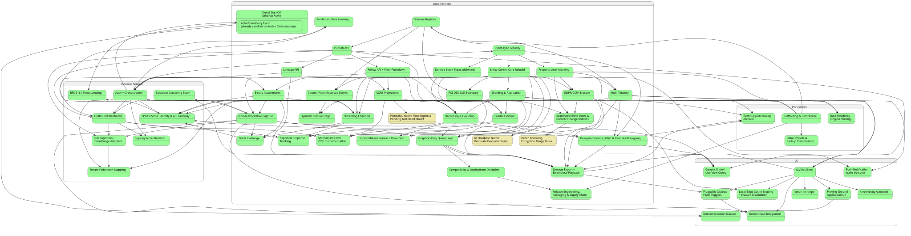

# Build Plan

This sequences the design in `01`–`07` and `features/*.md` into concrete,
checkable work. Each item lists its scope, its own prerequisite items
(**not** a phase number), and exit criteria defined in terms of the
Gherkin scenarios already written — an item isn't "done" by feel, it's
done when its feature doc's scenarios pass, on every database provider
the scenario applies to.

> **Restructured this session, per direct request** (`.claude/
> context.md`): this file used to number every item `Phase N`, with
> "Depends on: Phase N" cross-references. That broke down once ADRs
> stopped landing in a single, front-loaded burst — adding `ADR-050`
> through `ADR-093` (44 more ADRs across dozens of later sessions) had no
> good place to go without either renumbering everything downstream or
> tacking on an ever-growing, undifferentiated tail. **Every item below
> now has a name, not a number, and declares its own prerequisite items
> by name.** The order items appear in below is *one valid topological
> ordering* of that dependency graph — items always appear after
> everything they depend on — not a priority ranking and not a fixed
> numbering. Adding a new item later means placing it after its
> dependencies and, if it revises an earlier item's own mechanism rather
> than merely building on it, adding a short forward-pointing note to that
> earlier item (the same additive-history convention `ADR-075`'s note on
> "Multi-Tenancy" below already used, now the standing pattern) — never
> renumbering anything above it.
>
> **Reworked a second time, this session** (per direct request, "08-
> build-plan.md should be reworked from scratch first"): every item's
> Scope/Depends-on/Exit-criteria below was re-derived directly from its
> source ADR(s) and feature doc(s), independently of the prior text, via
> ten parallel batches of five items each, then reconciled into one
> consistent dependency graph. This surfaced a real, sizeable set of
> missing dependency edges (a claim-gated forward reference, a shared
> mechanism reused "unchanged" that the citing item never actually
> declared a dependency on) and a few genuine scope errors (a stale
> pre-correction restatement of `ADR-093`, an unverified class name,
> masking's rejection rule undercounting `ADR-009`'s own decided
> strategies) — all fixed in place below. Several gaps this pass found
> were documentation/coverage work, not build-plan structure — tracked in
> `TODO.md` at the time, worked through in a later pass instead (see
> `docs/changes/2026-08-03.md`): three new feature docs
> (`features/dpop-and-tamper-evidence.md`,
> `features/upcast-materialization-and-downcast.md`,
> `features/compatibility-and-versioning.md`) and five feature-doc gaps
> closed in place, each noted at its own point below.

## Implementation status

**Converted to the active work tracker, this session** (direct request:
"start converting the build plan to your active TODO"). This table is
the authoritative status of *implementation* — updated in place as items
move `Not started` → `In progress` → `Done`, the same "living tracker,
not a log" convention `TODO.md` already follows. Do not restate item
status anywhere else (`.claude/context.md` may summarize *which* item is
currently active, but this table is where the full list lives). `Done`
means the item's own exit criteria below are actually passing, on every
provider they apply to — not "code written."

| # | Item | Depends on | Status |
|---|---|---|---|
| 1 | [Scaffolding & Persistence](#scaffolding--persistence) | nothing | Done |
| 2 | [Schema Registry](#schema-registry) | Scaffolding & Persistence | Done |
| 3 | [Publish API](#publish-api) | Schema Registry | Done |
| 4 | [Lineage API (read side)](#lineage-api-read-side) | Publish API | Done |
| 5 | [Follow API + Filter Pushdown](#follow-api--filter-pushdown) | Publish API | Done |
| 6 | [Auth (OIDC/OpenIddict) + Orchestration](#auth-oidcopeniddict--orchestration) | Lineage API, Follow API + Filter Pushdown | Done |
| 7 | [Event-Type Security](#event-type-security) | Auth + Orchestration | Done |
| 8 | [Derived/Materialized Event Types (deferred)](#derivedmaterialized-event-types-deferred) | Event-Type Security | Done |
| 9 | [Property-Level Masking](#property-level-masking-data-enforcement) | Event-Type Security, Follow API + Filter Pushdown | Done |
| 10 | [CQRS Read-Model Projections](#cqrs-read-model-projections-worked-example) | Follow API + Filter Pushdown, Auth + Orchestration | Done |
| 11 | [Hardening & Evolution](#hardening--evolution-dpop-event-upcasting-hash-chained-tamper-evidence) | Auth + Orchestration, Publish API, Follow API + Filter Pushdown, CQRS Read-Model Projections | Done |
| 12 | [Entity-Centric Core Rebuild](#entity-centric-core-rebuild) | Event-Type Security | Done |
| 13 | [Multi-Tenancy](#multi-tenancy) | Schema Registry, Entity-Centric Core Rebuild | Done |
| 14 | [Upcast Materialization + Downcast](#upcast-materialization--downcast) | Hardening & Evolution, Entity-Centric Core Rebuild | Done |
| 15 | [Streaming Channels](#streaming-channels) | Auth + Orchestration, Entity-Centric Core Rebuild, Property-Level Masking | Done |
| 16 | [Binary Attachments](#binary-attachments) | Auth + Orchestration, Entity-Centric Core Rebuild | Done |
| 17 | [Sharding & Replication](#sharding--replication) | Entity-Centric Core Rebuild | Done |
| 18 | [Non-Authoritative Capture](#non-authoritative-capture) | Entity-Centric Core Rebuild, Auth + Orchestration, Binary Attachments | Done |
| 19 | [GraphQL-Only Query Layer](#graphql-only-query-layer) | Entity-Centric Core Rebuild, Multi-Tenancy, Hardening & Evolution | Done |
| 20 | [Compatibility & Deployment Discipline](#compatibility--deployment-discipline) | GraphQL-Only Query Layer | Done |
| 21 | [MVVM Client](#mvvm-client) | Multi-Tenancy, Sharding & Replication | Done |
| 22 | [Ticket Exchange for Header-Incapable Clients](#ticket-exchange-for-header-incapable-clients) | Streaming Channels, Binary Attachments, Non-Authoritative Capture | Done |
| 23 | [Delegated Grants, RBAC, Federated Claims & Read Audit Logging](#delegated-grants-rbac-federated-claims--read-audit-logging) | Non-Authoritative Capture, Event-Type Security, Multi-Tenancy, Hardening & Evolution | Done |
| 24 | [SPIFFE/SPIRE Service Identity & API Gateway](#spiffespire-service-identity--api-gateway) | Auth + Orchestration, Sharding & Replication, Streaming Channels, Binary Attachments, GraphQL-Only Query Layer, Ticket Exchange | Done |
| 25 | [Data Lifecycle & Backup/Restore Classification](#data-lifecycle--backuprestore-classification) | Scaffolding & Persistence | Done |
| 26 | [GDPR/CCPA Erasure via Crypto-Shredding](#gdprccpa-erasure-via-crypto-shredding) | Property-Level Masking, Entity-Centric Core Rebuild | Done |
| 27 | [PCI-DSS Sensitive Authentication Data Registration Boundary](#pci-dss-sensitive-authentication-data-registration-boundary) | Schema Registry, Property-Level Masking | Done |
| 28 | [Local/Edge Active-Scope Caching & Erasure Invalidation](#localedge-active-scope-caching--erasure-invalidation) | MVVM Client, GDPR/CCPA Erasure | Done |
| 29 | [Digital Sign-Off for Regulated Actions](#digital-sign-off-for-regulated-actions-step-up-authentication) | Auth + Orchestration, ActorId on Every Event | Done |
| 30 | [Control-Plane Actions as Reserved Events](#control-plane-actions-as-reserved-events) | Schema Registry, Entity-Centric Core Rebuild | Done |
| 31 | [Dynamic Feature-Flag Configuration Provider](#dynamic-feature-flag-configuration-provider) | Scaffolding & Persistence, Control-Plane Actions as Reserved Events | Done |
| 32 | [Leader Election via Database-Backed Lease](#leader-election-via-database-backed-lease) | Entity-Centric Core Rebuild, Sharding & Replication | Done |
| 33 | [Per-Tenant Rate Limiting](#per-tenant-rate-limiting) | Auth + Orchestration, SPIFFE/SPIRE Service Identity & API Gateway | Done |
| 34 | [Outbound Webhooks](#outbound-webhooks) | Publish API, Auth + Orchestration, Property-Level Masking, Leader Election | Done |
| 35 | [Data Residency (Region Pinning)](#data-residency-region-pinning) | Sharding & Replication, Multi-Tenancy | Done |
| 36 | [Bulk Ingestion & External Interchange-Format Adapters](#bulk-ingestion--external-interchange-format-adapters) | Publish API, Non-Authoritative Capture, Outbound Webhooks | Done |
| 37 | [Tenant-to-Tenant Federation Mapping](#tenant-to-tenant-federation-mapping) | Multi-Tenancy, Auth + Orchestration, Bulk Ingestion & Interchange Adapters | Done |
| 38 | [Sanctions/Watchlist Screening Extensibility Seam](#sanctionswatchlist-screening-extensibility-seam) | Scaffolding & Persistence, Non-Authoritative Capture | Done |
| 39 | [Release Engineering, Packaging & Supply Chain](#release-engineering-packaging--supply-chain) | Scaffolding & Persistence, Compatibility & Deployment Discipline | Done |
| 40 | [Signing Secret Rotation, Dual Signature](#signing-secret-rotation-dual-signature) | Outbound Webhooks | Done (webhook half only — ticket-exchange half descoped, see `TODO.md`) |
| 41 | [Lineage Export & Bitemporal Playback](#lineage-export--bitemporal-playback) | Lineage API, Entity-Centric Core Rebuild, MVVM Client, GraphQL-Only Query Layer, Property-Level Masking, GDPR/CCPA Erasure, Delegated Grants/RBAC/Read Audit Logging | Done |
| 42 | [RFC 3161 Trusted Timestamping](#rfc-3161-trusted-timestamping) | Digital Sign-Off, Lineage Export & Bitemporal Playback | Done |
| 43 | [Pluggable Outbox Flush Triggers](#pluggable-outbox-flush-triggers) | MVVM Client, Lineage Export & Bitemporal Playback | Done |
| 44 | [Device Input Integration](#device-input-integration) | MVVM Client, Pluggable Outbox Flush Triggers, Non-Authoritative Capture | Done |
| 45 | [Accessibility Standard](#accessibility-standard) | MVVM Client | Done |
| 46 | [i18n/l10n Architectural Scope](#i18nl10n-architectural-scope) | MVVM Client | Done |
| 47 | [Mechanism-Level OpenTelemetry Instrumentation](#mechanism-level-opentelemetry-instrumentation) | Hardening & Evolution, Sharding & Replication, Entity-Centric Core Rebuild, Outbound Webhooks | Done |
| 48 | [Event Log/AccessLog Archival Segment Detachment](#event-logaccesslog-archival-segment-detachment) | Binary Attachments, Delegated Grants/RBAC/Read Audit Logging, Hardening & Evolution, Lineage Export & Bitemporal Playback | Done |
| 49 | [Expected-Response Tracking](#expected-response-tracking) | CQRS Read-Model Projections (worked example), Streaming Channels, Outbound Webhooks, Leader Election via Database-Backed Lease | Done |
| 50 | [Proving-Ground Application UX](#proving-ground-application-ux) | MVVM Client | Done |
| 51 | [Domain Decision Queues](#domain-decision-queues) | Proving-Ground Application UX, Digital Sign-Off for Regulated Actions, Non-Authoritative Capture | Done |
| 52 | [Generic Entity/Live-View Query](#generic-entitylive-view-query) | GraphQL-Only Query Layer, Non-Authoritative Capture, Property-Level Masking, Delegated Grants/RBAC/Read Audit Logging | Done |
| 53 | [Push-Notification Wake-Up Layer](#push-notification-wake-up-layer) | Publish API, Entity-Centric Core Rebuild | Done (all 6 background workers) |
| 54 | [Searchable Blind-Index & Bucketed-Range Encrypted-Field Indexes](#searchable-blind-index--bucketed-range-encrypted-field-indexes) | GDPR/CCPA Erasure, Property-Level Masking, Follow API + Filter Pushdown | Done |
| 55 | [Order-Revealing Encryption Range Index (opt-in)](#order-revealing-encryption-range-index-opt-in) | Searchable Blind-Index & Bucketed-Range Encrypted-Field Indexes | Built, pending required security review (not Done) |
| 56 | [In-Database Native Predicate Evaluator Seam](#in-database-native-predicate-evaluator-seam) | Searchable Blind-Index & Bucketed-Range Encrypted-Field Indexes | SQL Server built and verified; PostgreSQL written, not verified (not Done) |
| 57 | [PlantUML-Native User-Flow Engine & Pending-Task Read Model](#plantuml-native-user-flow-engine--pending-task-read-model) | CQRS Read-Model Projections (worked example) | Done |

Two groups worth naming up front, since they explain most of the
ordering below:

- **The first 24 items** (`ADR-001`–`049`) are this design's original,
  front-loaded core build — the OData-era read surface (Lineage/Follow/
  registry listing) gets built first, then explicitly swapped to GraphQL
  by the "GraphQL-Only Query Layer" item once the entity-centric rebuild
  lands. That sequencing choice (build OData, then swap) is deliberate
  and preserved exactly as originally decided — it is *not* something
  this restructuring pass corrects, the same reason `06-solution-
  structure.md`'s own now-superseded code sketches were preserved rather
  than silently rewritten to the end state.
- **Everything after that** (`ADR-050`–`093`) is new work backfilled this
  pass. A handful of these ADRs already had a documented home in the
  original 24 items (`ADR-050`→"Property-Level Masking", `ADR-051`→
  "Sharding & Replication", `ADR-052`→"Streaming Channels", `ADR-053`→
  "Upcast Materialization + Downcast", `ADR-075`→"Multi-Tenancy") — those
  are called out where they already live, not duplicated as new items.
  Three ADRs (`ADR-055`/`063`/`085`, all testing-strategy escalations) and
  three ADRs (`ADR-041`/`059`/`084`/`092`, all cross-cutting discipline/
  scope statements with no exit criteria of their own) are folded into
  "Cross-cutting, every item" below rather than given standalone entries —
  they don't gate any single item's own exit criteria the way a real
  build dependency does.

## Dependency overview

Consolidated into one diagram, this pass, per direct request — previously
split into two (a core-build graph and an additions-since-`ADR-050`
graph), on the reasoning that "a single 48-node graph would be denser
than useful." That reasoning is superseded now, not silently dropped:
merging them means every cross-edge an addition has onto the core build
(previously written out only as prose beneath the second diagram) is now
a real, visible edge in the one graph below, not just a citation — the
diagram itself is the complete dependency graph, and the prose after it
explains the *why* behind each edge rather than being the only place a
cross-edge was recorded at all.

The core-build portion's own graph and the items it describes are
unchanged in shape from before this session's original rework — that
pass's own corrections (three added edges: Property-Level Masking →
Streaming Channels; CQRS Projections → Hardening & Evolution;
Multi-Tenancy → GraphQL-Only Query Layer; two added edges onto Binary
Attachments/Non-Authoritative Capture; one added edge onto Ticket
Exchange; four added edges onto SPIFFE/SPIRE; one added edge onto
GraphQL-Only Query Layer from Hardening & Evolution; and a real revision
to MVVM Client's own dependency set — Sharding & Replication added; CQRS
Projections, Streaming Channels, and Binary Attachments removed as
ungrounded) are preserved exactly, each still traced to specific ADR text
at the point it's used below.

**Diagram fill color tracks the same status as the "Implementation
status" table above, updated in lockstep**: no fill = `Not started`,
`#palegoldenrod` = `In progress` (set the moment work starts on that
item), `#palegreen` = `Done`. Keep both in sync in the same pass — don't
let the table move without the diagram, or vice versa.

**Framed into four application tiers, this pass, per direct request** —
purely a visual grouping (PlantUML composite states) laid over the exact
same node set and edges as before; it changes nothing about what depends
on what. Tier assignment is a rough architectural framing, not a rigid
boundary, and follows the item's own primary *purpose* rather than
strictly where its code happens to run: **External Services** is anything
whose whole point is talking to a system outside this framework's own
control (an OAuth2 IdP, SPIFFE/SPIRE + the Gateway boundary, a webhook
receiver, a federation partner, an interchange/bulk-ingestion source, a
sanctions-screening provider, an RFC 3161 TSA); **Persistence** is the
data/storage layer itself (the DB schema, region pinning, archival,
backup/restore classification); **UI** is what runs on the client device
(the MVVM Client and everything that extends it — accessibility, i18n,
device input, outbox flush triggers, local cache scoping); **Local
Services** is everything else — the bulk of Duplex's own in-process
engine (Publish/Follow/Lineage/Router/GraphQL/Masking/Erasure/Multi-
Tenancy/RBAC/feature flags/etc.), the majority tier by node count, exactly
as expected for a backend-first event-sourcing engine.

```plantuml
@startuml BuildPlan_All
state "External Services" as tierExternal {
  state "Auth + Orchestration" as p5 #palegreen
  state "SPIFFE/SPIRE Identity & API Gateway" as p23 #palegreen
  state "Outbound Webhooks" as a10 #palegreen
  state "Tenant Federation Mapping" as a12 #palegreen
  state "Bulk Ingestion +\nInterchange Adapters" as a13 #palegreen
  state "Sanctions Screening Seam" as a14 #palegreen
  state "Signing Secret Rotation" as a16 #palegreen
  state "RFC 3161 Timestamping" as a18 #palegreen
}
state "Persistence" as tierPersistence {
  state "Scaffolding & Persistence" as p0 #palegreen
  state "Data Residency\n(Region Pinning)" as a11 #palegreen
  state "Event Log/AccessLog\nArchival" as a24 #palegreen
  state "Data Lifecycle &\nBackup Classification" as a25 #palegreen
}
state "Local Services" as tierLocal {
  state "Schema Registry" as p1 #palegreen
  state "Publish API" as p2 #palegreen
  state "Lineage API" as p3 #palegreen
  state "Follow API + Filter Pushdown" as p4 #palegreen
  state "Event-Type Security" as p6 #palegreen
  state "Derived Event Types (deferred)" as p7 #palegreen
  state "Property-Level Masking" as p8 #palegreen
  state "CQRS Projections" as p9 #palegreen
  state "Hardening & Evolution" as p10 #palegreen
  state "Entity-Centric Core Rebuild" as p11 #palegreen
  state "Multi-Tenancy" as p12 #palegreen
  state "Upcast Materialization + Downcast" as p13 #palegreen
  state "Streaming Channels" as p14 #palegreen
  state "Binary Attachments" as p15 #palegreen
  state "Sharding & Replication" as p16 #palegreen
  state "Non-Authoritative Capture" as p17 #palegreen
  state "GraphQL-Only Query Layer" as p18 #palegreen
  state "Compatibility & Deployment Discipline" as p19 #palegreen
  state "Ticket Exchange" as p21 #palegreen
  state "Delegated Grants, RBAC & Read Audit Logging" as p22 #palegreen
  state "GDPR/CCPA Erasure" as a2 #palegreen
  state "PCI-DSS SAD Boundary" as a3 #palegreen
  state "Digital Sign-Off\n(Step-Up Auth)" as a5 #palegreen {
    state "ActorId on Every Event\n(already satisfied by Auth + Orchestration)" as a1 #palegreen
  }
  state "Control-Plane Reserved Events" as a6 #palegreen
  state "Dynamic Feature Flags" as a7 #palegreen
  state "Leader Election" as a8 #palegreen
  state "Per-Tenant Rate Limiting" as a9 #palegreen
  state "Release Engineering,\nPackaging & Supply Chain" as a15 #palegreen
  state "Lineage Export +\nBitemporal Playback" as a17 #palegreen
  state "Mechanism-Level\nOTel Instrumentation" as a23 #palegreen
  state "Expected-Response\nTracking" as a26 #palegreen
  state "Searchable Blind-Index &\nBucketed-Range Indexes" as a31 #palegreen
  state "Order-Revealing\nEncryption Range Index" as a32 #palegoldenrod
  state "In-Database Native\nPredicate Evaluator Seam" as a33 #palegoldenrod
  state "PlantUML-Native Flow Engine &\nPending-Task Read Model" as a34 #palegreen
}
state "UI" as tierUi {
  state "MVVM Client" as p20 #palegreen
  state "Local/Edge Cache Scoping\n+ Erasure Invalidation" as a4 #palegreen
  state "Pluggable Outbox\nFlush Triggers" as a19 #palegreen
  state "Device Input Integration" as a20 #palegreen
  state "Accessibility Standard" as a21 #palegreen
  state "i18n/l10n Scope" as a22 #palegreen
  state "Proving-Ground\nApplication UX" as a27 #palegreen
  state "Domain Decision Queues" as a28 #palegreen
  state "Generic Entity/\nLive-View Query" as a29 #palegreen
  state "Push-Notification\nWake-Up Layer" as a30 #palegreen
}

' Hidden edges between the 4 tier containers themselves -- not a real
' dependency, just a layout hint so Graphviz stacks the tiers top-to-bottom
' instead of spreading them side-by-side (Local Services alone holds 30+
' states and was pulling the whole diagram wide without this).
tierExternal -[hidden]-> tierPersistence
tierPersistence -[hidden]-> tierLocal
tierLocal -[hidden]-> tierUi

p0 --> p1
p1 --> p2
p2 --> p3
p2 --> p4
p3 --> p5
p4 --> p5
p5 --> p6
p6 --> p7
p6 --> p8
p4 --> p9
p5 --> p9
p5 --> p10
p2 --> p10
p4 --> p10
p9 --> p10
p6 --> p11
p1 --> p12
p11 --> p12
p10 --> p13
p11 --> p13
p5 --> p14
p11 --> p14
p8 --> p14
p5 --> p15
p11 --> p15
p11 --> p16
p11 --> p17
p5 --> p17
p15 --> p17
p11 --> p18
p12 --> p18
p10 --> p18
p18 --> p19
p12 --> p20
p16 --> p20
p14 --> p21
p15 --> p21
p17 --> p21
p17 --> p22
p6 --> p22
p12 --> p22
p10 --> p22
p5 --> p23
p16 --> p23
p14 --> p23
p15 --> p23
p18 --> p23
p21 --> p23
p8 --> a2
p11 --> a2
p1 --> a3
p8 --> a3
a2 --> a4
p20 --> a4
p5 --> a5
p1 --> a6
p11 --> a6
a6 --> a7
p0 --> a7
p11 --> a8
p16 --> a8
p5 --> a9
p23 --> a9
a8 --> a10
p2 --> a10
p5 --> a10
p8 --> a10
p16 --> a11
p12 --> a11
a13 --> a12
p12 --> a12
p5 --> a12
a10 --> a13
p2 --> a13
p17 --> a13
p0 --> a14
p17 --> a14
p0 --> a15
p19 --> a15
a10 --> a16
p5 --> a16
p3 --> a17
p11 --> a17
p20 --> a17
p18 --> a17
p8 --> a17
a2 --> a17
p22 --> a17
a5 --> a18
a17 --> a18
a17 --> a19
p20 --> a19
a19 --> a20
p20 --> a20
p17 --> a20
p20 --> a21
p20 --> a22
a10 --> a23
p10 --> a23
p16 --> a23
p11 --> a23
a17 --> a24
p15 --> a24
p22 --> a24
p10 --> a24
p0 --> a25
p9 --> a26
p14 --> a26
a10 --> a26
a8 --> a26
p20 --> a27
a27 --> a28
a5 --> a28
p17 --> a28
p18 --> a29
p17 --> a29
p8 --> a29
p22 --> a29
p2 --> a30
p11 --> a30
a2 --> a31
p8 --> a31
p4 --> a31
a31 --> a32
a31 --> a33
p9 --> a34
@enduml
```

Phases 3 and 4 both depend only on Phase 2, not on each other — they can be
built in either order, or in parallel by two people. Phase 5 fans back in
because it wraps every endpoint built in 1–4, so it can't meaningfully start
until they all exist. Phase 6 depends on Phase 5 specifically because
`RequiredPublishClaim`/`RequiredReadClaim` enforcement needs the caller's
JWT claims to already be populated — there's nothing to check against
before JWT bearer auth exists (`ADR-008`). Phases 7 and 8 both depend on
Phase 6, not on each other — like 3/4, they're independent and can run in
either order once the primary system (0–6) is stable. Phase 8 also has a
real, non-transitive dependency on Phase 4 specifically (the shared
`x-masking` node-finding helper introduced there) — already guaranteed by
the diagram's ordering (4 → 5 → 6 → 8), just called out explicitly since
it's a genuine content dependency, not only a scheduling one. Phase 9
depends only on Phase 4 (Follow must exist — a projection is a Follow
caller, `ADR-015`) and Phase 5 (it needs its own OAuth2 client to
authenticate as one) — **not** on Phase 6, because the worked example
doesn't require a claim-gated event type to demonstrate the merge rule,
though a real projection over a claim-gated type would need Phase 6's
enforcement to already exist so its client's claims mean anything. It's
independent of Phases 7 and 8 entirely. Phase 10 depends on Phase 5 (DPoP
hardens the auth model Phase 5 already built), Phase 2 (hash chaining
extends `EventAppender`, built in Phase 2), Phase 4 (event upcasting
matters most for Follow's `mode=replay`), **and Phase 9** — a real,
non-transitive addition found this pass: "CQRS Read-Model Projections"'
own worked example is exactly the kind of `mode=replay` consumer
Hardening & Evolution's upcast-materialization exit criteria need to
exercise, and nothing about DPoP/upcasting/hash-chaining is itself
gated by event-type security, masking, or derived events, so it stays
independent of Phases 6 through 8.

Phases 11–20 are the design-docs integration (`ADR-021`–`039`). Phase 11 is
the load-bearing one — nothing in 12–20 makes sense without entities,
`Optional<T>` patches, the persist-everything posture, and conflict/
ordering detection existing first. Phase 14 (Streaming Channels) has a
real, non-transitive dependency on Phase 8 (Property-Level Masking) found
this pass — `ADR-052`'s `RedactedRange` redaction reuses
`PartialRevealMaskingStrategy` directly, not a bespoke mechanism. Phase 15
(Binary Attachments) depends on Phase 11 as well as Phase 5, since an
`AttachmentRef` is an `EntityId`-scoped concept from the start, not
retrofitted later. Phase 17 (Non-Authoritative Capture) depends on Phase
15 in addition to Phase 11/5 — `ADR-036`'s `delegation_chain_ref` needs
`Attachment`/`AttachmentRef` to exist to carry a self-attestation's
supporting material. Phase 18 (the GraphQL-only swap) depends on Phase 11
(GraphQL reads from the Entity Store), **Phase 12** (`ADR-037`'s per-`AppId`
schema composition needs Multi-Tenancy's `AppId`-scoped registry to exist —
a real edge this pass found missing, not merely a scheduling
convenience), and **Phase 10** (the upcast mechanism this item moves onto
GraphQL SDL directives is Hardening & Evolution's own `UpcastChain`) — it
could in principle run in parallel with Phases 12–17, though in practice
it's disruptive enough (it supersedes 3/4's entire query surface) that
sequencing it deliberately, once, is likely easier than interleaving it
with five other phases touching the same codebase. Phase 20 (the MVVM
client) was re-derived this pass against `ADR-039`'s own text rather than
carried forward from the prior draft: it depends on **Multi-Tenancy**
(a client is scoped to one `AppId`) and, newly added, **Sharding &
Replication** — the client's offline-first outbox/sync model assumes
`ADR-090`'s read-your-writes guarantee across a multi-site mesh already
exists, the single most load-bearing dependency this item had been
missing entirely. **CQRS Read-Model Projections, Streaming Channels, and
Binary Attachments are removed from this item's dependency list** — none
is named anywhere in `ADR-039`'s own Context/Decision text as something
the client's build is gated on; rendering a streaming channel or an
attachment inside a specific entity view is that view definition's own
later concern, not a prerequisite for the client shell to exist. Ticket
Exchange (`ADR-040`) depends on Streaming Channels/Binary Attachments
specifically — it closes a gap those two items' own header-incapable
callers (`<video src>` playback, inline ``/`<a href>` attachment
retrieval) reopen — **and, added this pass, Non-Authoritative Capture**,
since ticket issuance reuses that item's OAuth Token Exchange
infrastructure directly (`ADR-040`'s own text: "reusing `ADR-036`'s
exchange infrastructure with a new `requested_token_type`"). It doesn't
depend on 18/19/20 at all and could run alongside them. SPIFFE/SPIRE
Identity & API Gateway gained four edges this pass beyond Auth +
Orchestration and Sharding & Replication: GraphQL-Only Query Layer,
Streaming Channels, Binary Attachments, and Ticket Exchange — `ADR-049`'s
own text names every one of these as a surface the Gateway fronts, so
each has to exist before the Gateway can be verified as actually routing
to it.

The remainder of this section (the "additions since `ADR-050`" half of
the same one diagram above) explains the *why* behind each addition's own
edges — including every edge it draws onto the core-build portion above,
now drawn directly in the merged diagram rather than only written out
here as prose:

- **ActorId on Every Event** is nested *inside* Digital Sign-Off's own
  box above, not a sibling node — it's not a separately-numbered item in
  the "Implementation status" table, only a named prerequisite *fact*
  Digital Sign-Off's dependency text needs to point at, already satisfied
  by "Auth + Orchestration" (item 6): `StoredEvent.ActorId` is documented
  in `docs/data/event-log.md` as "ALWAYS populated, blocking, not
  advisory (`ADR-064`)". Filled `#palegreen` (already Done, inherited
  from item 6) so it reads as resolved, not as an open dependency edge
  the way a same-level sibling node would.
- **Expected-Response Tracking** (`ADR-094`, merged in from the
  `design/service-level-agreement` branch, implemented and Done as of
  2026-08-11) depends on **CQRS Read-Model Projections (worked example)**,
  **Streaming Channels**, **Outbound Webhooks**, and **Leader Election via
  Database-Backed Lease** — see that item's own full section below for the
  reasoning behind each.
- **GDPR/CCPA Erasure** depends on **Property-Level Masking** and
  **Entity-Centric Core Rebuild**.
- **PCI-DSS SAD Boundary** depends on **Schema Registry** and
  **Property-Level Masking**.
- **Local/Edge Cache Scoping + Erasure Invalidation** depends on **MVVM
  Client** (and, per the diagram above, GDPR/CCPA Erasure).
- **Digital Sign-Off** depends on **Auth + Orchestration** (and ActorId).
- **Control-Plane Reserved Events** depends on **Schema Registry** and
  **Entity-Centric Core Rebuild** — and **revises** "Delegated Grants,
  RBAC & Read Audit Logging"'s own storage mechanism; see that item's own
  entry below for the forward-pointing note.
- **Dynamic Feature Flags** depends on **Scaffolding & Persistence** (and,
  per the diagram above, Control-Plane Reserved Events for its storage
  mechanism).
- **Leader Election** depends on **Entity-Centric Core Rebuild** and,
  added this pass, **Sharding & Replication** — `ADR-078` names the
  peer-sync outbox pump (built in Sharding & Replication) as one of
  exactly four worker roles this item's lease mechanism covers, on equal
  footing with the Router/`UpcastMaterializer`.
- **Per-Tenant Rate Limiting** depends on **Auth + Orchestration** and
  **SPIFFE/SPIRE Identity & API Gateway**.
- **Outbound Webhooks** depends on **Publish API**, **Auth +
  Orchestration**, and, added this pass, **Property-Level Masking**
  (`ADR-060`'s own text: every payload is masked "via `IPayloadMasker`,
  unchanged" before delivery) and, per the diagram above, **Leader
  Election** (the outbox pump this item builds is one of `ADR-078`'s four
  leader-elected roles).
- **Data Residency** depends on **Sharding & Replication** and
  **Multi-Tenancy**.
- **Tenant Federation Mapping** depends on **Multi-Tenancy**, **Auth +
  Orchestration**, and, per the diagram above, **Bulk Ingestion +
  Interchange Adapters** — `ADR-082`'s bespoke per-tenant-pair mapping is
  written *as* an `IInterchangeFormatAdapter` implementation, an
  interface that doesn't exist before that item.
- **Bulk Ingestion + Interchange Adapters** depends on **Publish API**,
  added this pass **Non-Authoritative Capture** (`ADR-072`'s own text:
  inbound-adapter capture inherits `ADR-035`'s non-authoritative default),
  and, per the diagram above, **Outbound Webhooks** for the outbound half.
- **Sanctions Screening Seam** depends on **Scaffolding & Persistence**
  and, added this pass, **Non-Authoritative Capture** — `ADR-079`'s
  invocation point is explicitly "gated exactly like any other
  non-authoritative capture," a real, testable dependency beyond the
  bare DI registration.
- **Release Engineering, Packaging & Supply Chain** depends on
  **Scaffolding & Persistence** and, added this pass, **Compatibility &
  Deployment Discipline** — `ADR-076`'s own Compliance note ties its
  migration-bundle mechanism directly to that item's N-1/N+1
  rollback-safety promise.
- **Signing Secret Rotation** depends on **Outbound Webhooks** (the real
  schema change, `WebhookSubscription.PreviousSigningSecret`) and,
  corrected this pass, **Auth + Orchestration** — not Ticket Exchange;
  see that item's own entry below for why.
- **Lineage Export + Bitemporal Playback** depends on **Lineage API**,
  **Entity-Centric Core Rebuild**, **MVVM Client**, and, added this pass,
  **GraphQL-Only Query Layer** (`exportLineage`/`playbackAsOf` are GraphQL
  Gateway fields), **Property-Level Masking** and **GDPR/CCPA Erasure**
  (both named in `ADR-068`'s own "no bypass" rule), and **Delegated
  Grants, RBAC & Read Audit Logging** (every export/playback read writes
  an `AccessLogEntry`).
- **Pluggable Outbox Flush Triggers** depends on **MVVM Client** and
  **Lineage Export + Bitemporal Playback** (the portable bundle format
  reused for offline sneakernet transfer).
- **Device Input Integration** depends on **MVVM Client**, **Pluggable
  Outbox Flush Triggers**, and, added this pass, **Non-Authoritative
  Capture** — `ADR-070`'s server-side discrete-reading path defaults to
  `ADR-035`'s non-authoritative capture unless the device itself carries
  a self-attested identity, and neither prerequisite mechanism is
  transitively guaranteed by MVVM Client or the flush-triggers item.
- **Accessibility Standard** and **i18n/l10n Scope** both depend on
  **MVVM Client** only — confirmed independent of each other; neither's
  mechanism relies on the other's.
- **Mechanism-Level OTel Instrumentation** depends on **Hardening &
  Evolution**, **Sharding & Replication**, **Entity-Centric Core
  Rebuild** (and, per the diagram above, Outbound Webhooks).
- **Event Log/AccessLog Archival** depends on **Binary Attachments**,
  **Delegated Grants, RBAC & Read Audit Logging**, **Hardening &
  Evolution**, and, added this pass, **Lineage Export + Bitemporal
  Playback** — `ADR-089`'s NDJSON serialization is explicitly the same
  format that item's litigation export already uses, reused rather than
  invented a second time.
- **Data Lifecycle & Backup Classification** formally depends only on
  **Scaffolding & Persistence** (the classification exists from day one)
  but its exit criteria stay accurate only as later items land — see its
  own entry.
- **Expected-Response Tracking** depends on **CQRS Read-Model Projections
  (worked example)** — the Follow-based internal-follower shape and
  seeded-OAuth2-client extension pattern `ExpectedResponseWatcher`
  reuses unchanged — and **Streaming Channels** — the reserved-detector-
  event shape (`ChannelLagDetected`) `ExpectedResponseMissing` directly
  mirrors — plus, per the diagram above, **Outbound Webhooks** (the
  durable-tracker/cursor-table shape) and **Leader Election** (the
  singleton-worker gate every other background worker already uses).

## Scaffolding & Persistence

**Scope**: the project layout in `06-solution-structure.md` —
`EventStore.Domain`, `EventStore.Persistence` (including the
`IJsonPathTranslator` interface, unconditionally registered per provider),
the three `EventStore.Persistence.Migrations.<Provider>` projects,
`EventStore.Host.Core` (shared, provider-agnostic composition root), and
the three `EventStore.Host.Sqlite`/`.Postgres`/`.SqlServer` deployables,
each hardcoding its own `UseSqlite`/`UseNpgsql`/`UseSqlServer` call and
referencing its own migrations assembly directly — no `switch`, no
`Database:Provider` config key anywhere (`ADR-001`). `StoredEvent.Payload`
and `EventTypeDefinition.JsonSchema` are mapped as plain `TEXT`/
`nvarchar(max)`/`text` columns, never a provider's native JSON column type
(`ADR-004`) — native JSON *functions* are a query-time concern via
`IJsonPathTranslator`, not a column-type one, and aren't exercised until
"Follow API + Filter Pushdown". Build the **full** `EventStoreContext`
model now — `EventTypeDefinition`, `FilterableField`, `StoredEvent`,
`EventParent` — even though most of it isn't used until later items, to
avoid a second wave of migrations once later items start using tables
this one didn't create. `EventStore.AppHost`/`EventStore.ServiceDefaults`/
`EventStore.DevIdp` are **not** part of this item — see "Auth +
Orchestration".

**Depends on**: nothing.

**Exit criteria**:
- Solution builds; an initial migration exists and applies cleanly on
  SQLite, PostgreSQL, and SQL Server (each of the three deployables
  references exactly one provider's migrations assembly).
- `EventStore.IntegrationTests` runs one trivial round-trip test (insert +
  read back a `StoredEvent`, `Payload` stored as portable text) against
  all three providers (Testcontainers for Postgres/SQL Server, file-based
  SQLite) — this harness stays live for every item after this one, it is
  not a one-time setup task.

## Schema Registry

**Scope**: `PUT`/`GET /registry/{event-type}` and `QUERY /registry`
(paginated listing, `ADR-012` — `$top`/`$skip`, both optional, omitting
both returns everything) per `05-schema-registry-and-spec-generation.md`
and [`features/schema-registry.md`](features/schema-registry.md):
structural JSON Schema validation, `FilterableField` path validation
against the schema, versioning (a new `(Name, Version)` row per
registration, `IsActive` flip, no mutation of prior versions).
**`ChangeKind` (`ADR-016`)** is a *required* field with no default —
rejected `400` if missing or invalid at registration — needed here
because "CQRS Read-Model Projections" (much later) assumes it's already
enforced starting from this item, even though the *merge* semantics it
drives aren't consumed until that later item. `ParentValidationMode` is
accepted and validated as an enum (`Strict`|`Permissive`, default
`Strict`, `ADR-005`). Per-provider index/computed-column migrations for
`IsIndexed = true` fields (`ADR-003`) are built here too, even though
nothing queries through them until "Follow API + Filter Pushdown".
**`x-masking` structural validation** also belongs here (`ADR-009`):
reject placement directly on an `object`-/`array`-typed property (valid
only on a scalar node, a scalar array's `items`, or a property nested
inside a complex-object `items` schema); reject any `strategy` value
other than the **three** `ADR-009` actually decided —
`"FixedValue"`, `"PartialReveal"`, and `"Hash"`, not just
`"FixedValue"`; validate `requiredClaim`'s `"type:value"` format; validate
`regulatoryClassification`/`governanceBody`/`regulationReference` are
non-empty strings if present. This is pure data validation on the
registration payload with no claims involved, so it doesn't wait for
"Event-Type Security"/"Property-Level Masking" the way enforcement does,
and "Follow API + Filter Pushdown"'s `MaskingSchemaTransformer` needs to
be able to assume any `x-masking` it encounters is already well-formed.

Not in scope yet: `ParentValidationMode` is stored but not *enforced*
(`ParentLinkService`, "Publish API"); `registry:admin` scope is not
enforced (that's "Auth + Orchestration") — accept requests unauthenticated
for now; `RequiredPublishClaim`/`RequiredReadClaim` (`ADR-008`) are
accepted and format-validated but not enforced. `EntityIdField`
(`ADR-021`) validation does **not** belong here either — that's "Entity-
Centric Core Rebuild"'s own scope, a much later item; registering a
required `EntityIdField` makes no sense before the Entity Store it
identifies rows in exists. `x-masking`'s *enforcement* (`IPayloadMasker`)
is still "Property-Level Masking".

**Depends on**: Scaffolding & Persistence (needs the
`EventTypeDefinition`/`FilterableField` tables to exist).

**Correction, found while implementing**: `features/schema-registry.md`'s
own Gherkin was rewritten to the GraphQL-only end state this session
(`eventTypes(first, after)`, `ADR-037`) with no preserved historical
scenario for the plain `QUERY /registry` `$top`/`$skip` listing this item
still builds first — unlike an ADR's own struck-through-history
convention, a feature doc's Gherkin section doesn't retain a superseded
scenario once rewritten. This item's own listing endpoint is real, tested
directly (`EventStore.IntegrationTests`, not a `features/*.md` scenario),
and is explicitly temporary — "GraphQL-Only Query Layer" supersedes it
with the GraphQL `eventTypes(...)` resolver `features/schema-registry.md`
already documents as current.

**Exit criteria**: every scenario in
[`features/schema-registry.md`](features/schema-registry.md) **except its
GraphQL listing scenario** (superseded by "GraphQL-Only Query Layer," not
yet built) passes, on all three providers, including the index/computed-
column verification and this item's own `QUERY /registry` `$top`/`$skip`
pagination test; registering without
`changeKind`, or with a value other than `Full`/`Partial`, is rejected
`400`; registering a filterable field whose `jsonPath` doesn't resolve in
the schema is rejected `400`; plus the masking-registration scenarios in
[`features/masking.md`](features/masking.md) — "Registering x-masking
directly on an object-typed property is rejected" (`400`), "Registering a
genuinely unsupported masking strategy is rejected" (rejects
`"Bucketing"`, `400`), "Registering PartialReveal and Hash strategies
succeeds" (`201` — **not** rejected), and "Regulatory metadata fields are
optional" (`201` with none supplied) — the rest of that doc's scenarios
(actual masking/wrapping behavior at read time) belong to later items.

## Publish API

**Scope**: `POST /publish/{event-type}` per `03-api-contracts.md` and
[`features/publish-event.md`](features/publish-event.md): the `{
schemaVersion, payload, parentEventIds?, eventId? }` envelope
(`schemaVersion` **required**, `ADR-020`), `SchemaValidationService`
against the **declared** version specifically, never automatically
"whichever is active" (unknown `schemaVersion` rejected `400`; a
structurally non-conforming `payload` rejected `400`), `ParentLinkService`
enforcing `ParentValidationMode` (`Strict` default rejects `400` on any
unresolved `parentEventId`; `Permissive` allows a dangling reference
through unconditionally), the `eventId`/`PayloadHash` idempotency
short-circuit (`ADR-011` — a matching replay returns the original
response with no new write; a differing hash is `409`; the concurrent-
retry race is handled at the unique-constraint level, not the preceding
lookup), `EventAppender` writing `StoredEvent` + `EventParents` in one
transaction. Generate and expose `/openapi.json` now that the publish
contract exists (`ADR-002`): `EventSchemaConverter` (parses registered
`JsonSchema` text into the shared `Microsoft.OpenApi` `OpenApiSchema`) and
`OpenApiDocumentBuilder`, `IMemoryCache`-backed with the ~60s TTL
invalidated on registration.

Lineage is built here, not deferred — only the derived-event-types idea
(`ADR-007`) is deferred, not `EventParents` (`ADR-005`, already Accepted).

`ADR-020`'s live upcast-validation-on-publish and `EventUpcastFailed`
dead-letter behavior are **not** part of this item — they depend on
`UpcastChain` (`ADR-018`), which doesn't exist until "Hardening &
Evolution". Until then, a publish with `schemaVersion` behind the active
version is simply accepted and stored at the declared version, exactly as
if `ADR-020` didn't exist yet.

**Clarification**: the original success status code here is `201`, not
`202` — `ADR-023` (the Inbox/Router split introducing always-`202`) isn't
built until "Entity-Centric Core Rebuild," a much later item, so this
item's own exit criteria assert `201` for a successful publish and an
identical-content idempotent replay, `409` for a different-content
replay, `400` for an unknown `schemaVersion`/invalid payload/unresolved-
Strict-parent, and `404` for an unregistered event type.

**Depends on**: Schema Registry (needs a registered schema/version to
validate against).

**Exit criteria**: every scenario in
[`features/publish-event.md`](features/publish-event.md) and the
publish-side scenarios in
[`features/event-chains.md`](features/event-chains.md) pass on all three
providers, translated to this item's pre-`ADR-023` status codes: a valid
publish succeeds (`201`); a payload missing a required field or wrong-
shaped is rejected `400`, not persisted; publishing against an
unregistered event type is `404`; publishing after a schema-version
upgrade validates against the newly-active version; retrying with the
same `eventId` and identical content replays the original `201` response
with no new write; retrying with different content is `409`; omitting
`eventId` behaves exactly as before `ADR-011`; a Strict-mode publish
naming an unresolved parent is `400` and appends nothing; a Permissive-
mode publish with a dangling parent reference succeeds and later shows
`resolved: false` once the Lineage API exists. `/openapi.json` includes
`/publish/{event-type}` with the full envelope shape, served anonymously,
cache-invalidated on the next registration.

## Lineage API (read side)

**Scope**: `QUERY /events/{id}/parents|children|ancestors|descendants`
(`ADR-012` — replacing `GET`, moving the request off the URL into the
body, adding `$top`/`$skip` pagination) per `03-api-contracts.md` and
[`features/event-chains.md`](features/event-chains.md): `EventParentReader`
(plain LINQ join, fully portable) for direct parents/children,
`IEventLineageQueryProvider` (one implementation per provider, issuing a
native recursive CTE) plus cycle-safe traversal (`CycleGuard`) for
ancestors/descendants — mandatory regardless of `ParentValidationMode`,
since a `Permissive`-mode cycle can appear even reachable from a
`Strict`-mode starting event. Routed via `MapMethods(pattern, ["QUERY"],
handler)`.

**Depends on**: Publish API (needs published events with parent links to
traverse).

**Exit criteria**: publishing an origin event with no parents shows no
parent events on `QUERY /events/{id}/parents`; fetching immediate
parents/children after publishing a child event parented off one or more
prior events returns exactly those relationships; a Strict-mode publish
referencing an unresolved parent never reaches this API at all (rejected
at publish); a Permissive-mode dangling reference shows up with
`resolved: false`; given a cycle constructed across two `Permissive`-mode
events, `ancestors`/`descendants` from either node terminates without an
infinite loop and returns each node exactly once; fetching a multi-hop
ancestor chain returns every ancestor, not just the immediate parent;
fetching lineage for an unknown `eventId` is rejected `404`; `$top`/
`$skip` correctly slice a large result, and omitting both still returns
everything. All of the above passes on all three providers, since
`IEventLineageQueryProvider`'s recursive-CTE mechanics are
provider-specific by design.

## Follow API + Filter Pushdown

**Scope**: `QUERY /follow/{event-type}` (`ADR-012` — replacing `GET`,
`$filter`/`mode`/`fromSequenceNumber` read from the request body) per
`03-api-contracts.md`,
[`features/follow-subscribe.md`](features/follow-subscribe.md), and
[`features/filter-pushdown.md`](features/filter-pushdown.md). Filter
pushdown, per `04-odata-filter-pushdown.md`'s preserved "Historical"
section: an incoming `$filter` is parsed via `Microsoft.OData.UriParser`
into a `FilterClause` AST, validated against the event type's registered
`FilterableFields` (rejecting an unfilterable field with `400` at parse
time, before touching the database), translated into a LINQ
`Expression<Func<StoredEvent, bool>>`, with a property reference compiled
via the shared `JsonFunctions.JsonValue` marker method into a call to the
active provider's `IJsonPathTranslator` (cast to `FilterableField.
DataType` before comparison) — no separately named "PredicateTranslator"
class exists in any ADR, feature doc, or `06-solution-structure.md`; that
name is unverified and dropped. `EventTailReader`'s one continuous poll
loop (`WHERE SequenceNumber > lastSeen AND predicate`) drives both
`mode=tail` (default) and `mode=replay` (`ADR-010`) — only `lastSeen`'s
*initial* value differs; supplying `fromSequenceNumber` together with
`mode=tail` (or the default) is rejected `400`. SSE responses carry the
envelope headers (`eventId`, `sequenceNumber`, `occurredAt`,
`parentEventIds`). No `access_token` query-string fallback — a browser
client authenticates via `fetch()` with a real `Authorization` header,
identically to every other endpoint. Generate and expose `/asyncapi.json`
now that the Follow contract exists: `AsyncApiDocumentBuilder` (hand-built
envelope around the same shared `OpenApiSchema`, validated by round-
tripping each generated document against the published AsyncAPI 3.0 JSON
Schema) **and** `MaskingSchemaTransformer` — even though masking's
*runtime* enforcement doesn't land until "Property-Level Masking," the
schema-level `x-masking` → `oneOf[value,masked,erased]` wrapper is
claims-independent and must exist now, so `/asyncapi.json` never
documents a maskable property's bare, unwrapped type.

**Depends on**: Publish API (needs published events to tail). Independent
of Lineage API — can be built before, after, or alongside it.

**Exit criteria**: connecting with no `$filter` streams every event of
the type; connecting with `$filter=Amount gt 100` streams only matching
events, including combined conditions; `$filter` referencing a field not
declared `FilterableField` is rejected `400` at parse time, before any
SQL runs; `mode=replay` (no `fromSequenceNumber`) delivers all matching
history then tails new matching events with no gap or duplicate;
supplying `fromSequenceNumber` only replays events after that sequence
number; `mode=replay` combined with `$filter` replays only matching
history; the default (`mode=tail`) never delivers pre-existing events;
supplying `fromSequenceNumber` without `mode=replay` is rejected `400`;
the same query produces the correct native JSON-extraction fragment
identically across SQLite/PostgreSQL/SQL Server, with correct numeric
cast-before-compare and index usage for an indexed field; `/asyncapi.json`
includes the Follow channel, served anonymously, cache-invalidated on the
next registration; a maskable property already appears wrapped as
`oneOf[value,masked,erased]` in the generated document, even though every
event still streams it unconditionally as `{"value": ...}` until
Property-Level Masking's enforcement lands. A restricted parent's ID
being omitted from the streamed `parentEventIds` header depends on
`RequiredClaims` existing ("Event-Type Security," a later item) and is
**not** part of this item's own exit bar.

## Auth (OIDC/OpenIddict) + Orchestration

**Scope**: per `ADR-006`, `ADR-014`, `ADR-026`, and
[`features/auth.md`](features/auth.md): OAuth2 Client Credentials grant
(RFC 6749 §4.4) + Bearer usage (RFC 6750) against an OIDC provider,
validated against the provider's own discovery document — no custom
token-validation code; one authorization policy per scope
(`events:publish`, `events:follow`, `events:lineage:read`,
`registry:admin`); a custom `ScopeRequirement` handler (OAuth2 `scope` is
one space-delimited claim, not a repeated one, so a bare `RequireClaim`
doesn't fit); the new `EventStore.DevIdp` project (OpenIddict, EF Core
**InMemory** store, `DevIdpSeeder` seeding three clients — `publisher-
client`, `follower-client`, `operator-client` — in code, no realm-export
file, no admin console); `/connect/token` +
`/.well-known/openid-configuration`, consumed generically by every
`EventStore.Host.<Provider>`'s shared JWT-bearer validation with zero
OpenIddict-specific code; `/openapi.json`/`/asyncapi.json` stay anonymous.
**`ADR-026`** (refines `ADR-006`'s orchestration story only): `EventStore.
AppHost` (.NET Aspire) wiring the targeted `EventStore.Host.<Provider>` +
its DB container + `EventStore.DevIdp` as an Aspire **project** resource,
dev-only. **`EventStore.ServiceDefaults.ConfigureOpenTelemetry`**, called
from every host and `EventStore.DevIdp`, wiring all three OTel signals —
logs, metrics (`AddAspNetCoreInstrumentation`/`AddHttpClientInstrumentation`/
`AddRuntimeInstrumentation`), and tracing (`AddSource` +
`AddAspNetCoreInstrumentation` with a `Filter` excluding health/liveness
paths + `AddHttpClientInstrumentation`) — with an OTLP exporter wired
conditionally on `OTEL_EXPORTER_OTLP_ENDPOINT`, pointed at the Aspire
Dashboard's OTLP receiver in dev. A root `docker-compose.yml` is **the
actual production deployment path** (`ADR-026` explicitly revises
`ADR-006`'s original "fallback"/"CI" framing), building
`EventStore.Host.<Provider>` and `EventStore.DevIdp` (or its production
IdP replacement) as ordinary app images, two images at this point in the
build. **`ADR-014`**: ASP.NET Core's built-in CORS middleware, one named
policy wired identically across all three host deployables,
`Cors:AllowedOrigins` config, **deny by default**, explicitly allowing
the `Authorization` header and every method in use including `QUERY`
(always preflights); `AllowCredentials()` deliberately **not** set
(bearer-only auth, never cookies).

**Depends on**: Schema Registry, Publish API, Lineage API, Follow API +
Filter Pushdown (there is nothing to authorize before they exist).

**Exit criteria**: request without `Authorization` → `401`; expired/
invalid token → `401`; token missing the required scope → `403`
(publish; registry `PUT`); token with the required scope → `201` for
publish (this item's own pre-`ADR-023` status), `201` for registry `PUT`;
`/openapi.json`/`/asyncapi.json` stay `200`-readable with no
`Authorization` header at all; a browser `fetch()` call to Follow
succeeds cross-origin once its origin is in `Cors:AllowedOrigins`, and is
blocked (browser-enforced) when it isn't, with a clean deployment
CORS-closed to every origin by default; `aspire run` and `docker-compose
up` each produce a working stack from a clean checkout with zero manual
IdP setup, verified via a real `/connect/token` request or the discovery
document since no admin console exists to eyeball instead; all three OTel
signals (logs, traces, metrics) are visible in the local Aspire Dashboard
for an ordinary request, a health/liveness poll never appears in the
trace view, and the OTLP export target is config-driven, not hardcoded.
`ADR-006` is already Accepted — this item verifies it end-to-end, does
not decide it.

**Note — verified two different ways, with one real gap between them**:
the 401/403/201/CORS/anonymous-spec-endpoint behavior is fully proven by
`EventStore.IntegrationTests`' `AuthSqliteTests` — two real
`WebApplicationFactory` TestServers (`EventStore.DevIdp` issuing a real
signed token via its real `/connect/token`, `EventStore.Host.Sqlite`
validating it via real JwtBearer middleware against a real fetched
discovery document + JWKS) — not a shortcut around any of it. Actually
running `aspire run` against `EventStore.Host.Postgres` surfaced and
fixed five further, genuinely real bugs no test above could catch (wrong
`AddDatabase` connection-string-key naming, a missing `WaitFor(db)`
startup race, `RequireHttpsMetadata` needing an explicit override for
Aspire's plain-HTTP `Authority` injection, a missing migrate-on-startup
step, and a stale `EventStore.DevIdp/Properties/launchSettings.json`
whose hardcoded port Aspire's own endpoint-reference resolution used in
place of the real dynamically-assigned one) — each fixed and confirmed
individually. **A further issue found this same pass — `AddDatabase
("Postgres")`'s own documented "the database being created ...
automatically as part of the resource lifecycle" did not reliably
complete before `EventStore.Host.Postgres`'s first connection attempt in
this environment (`Aspire.Hosting.PostgreSql` 13.4.6) — fixed, later
pass.** Root cause confirmed directly: Aspire creates the named database
asynchronously off the Postgres server resource's own
`ResourceReadyEvent`, and `WaitFor(db)` waits for the database
*resource* to be registered, not for that `CREATE DATABASE` to have
actually committed — a real, reproducible race, not environment-specific
flakiness. Fixed with `EnableRetryOnFailure(errorCodesToAdd: ["3D000"])`
(Postgres's own SQLSTATE for "database does not exist") on both
`EventStore.Migrator`'s and `EventStore.Host.Postgres`'s `UseNpgsql`
registrations — verified against a real, bare Postgres container with a
deliberately-delayed `CREATE DATABASE` racing an ordinary `DbSet` query
(the exact call shape both processes use): fails instantly without the
fix, recovers automatically once the database lands, with it. **Not
re-verified via a full live `aspire run` this pass** (a heavier,
longer-running check than this targeted reproduction, given the
orchestration's own simulators never exit) — the specific race is
fixed and directly verified; the full end-to-end round trip noted above
as unattempted still hasn't been separately re-run.

## Event-Type Security

**Scope**: per `ADR-008`, generalized by `ADR-050` — and that generalized
shape is **already built**, not something this item introduces:
`EventTypeDefinition.RequiredClaims: List<RequiredClaim>` (`Direction`-
qualified, `OR`-matched within one direction) was accepted, format-
validated, and persisted by "Schema Registry" already, per that item's
own explicit scope text ("accepted, not yet enforced"). This item is
purely that enforcement — no new field, no data-model change. A
`Publish`-direction `RequiredClaims` entry gates `POST /publish/
{event-type}` (satisfied if the caller holds *any* listed `Publish`
claim). A `Read`-direction entry gates `QUERY /follow/{event-type}`
(checked once, at connect time) **and** all four Lineage API endpoints,
per "you can only
see what you can see": the **root** `{eventId}` a Lineage call names
directly must be visible to the caller or the whole request is rejected
`403` (deliberately distinguishable from a genuinely unknown `eventId`'s
`404`); everything the traversal *discovers* from the root is
visibility-checked per node, independently of the root's own check and of
each other, and traversal does not recurse past a node the caller can't
see — this requires the recursive CTE to stop expanding *during*
recursion at a restricted node, not merely redact fields in the final
output. Publish never checks the `Read`-direction `RequiredClaims` on a
referenced parent — `ParentLinkService` only ever checks existence;
read visibility is entirely a per-viewer, read-time decision. Enforced
in application code
after the event type is resolved from the registry, not a static
`AddPolicy` (needs a per-request data lookup a static policy can't
express). Registering/changing these claims still only needs
`registry:admin` — no new scope. Masking (`ADR-009`) is confirmed **not**
part of this item despite sharing the same claim machinery — a deliberate
priority call, not a technical split.

**Depends on**: Auth + Orchestration only.

**Exit criteria**: publish of a claim-gated type without the claim →
`403`; with the claim → `201`, persisting regardless of shape; publish
and read claims enforced fully independently for the same type; follow
connect without the read claim → `403`; with it → accepted; a Lineage
query on a **restricted root** → `403` for the whole request, across all
four Lineage endpoints; a Lineage query on a **visible root** with a
discovered restricted node → `200`, that node stubbed
`{eventId, resolved: true, restricted: true}` with no other fields, while
every other node returns normally; lacking access to a parent never hides
an otherwise-visible child, and vice versa; restricted-but-existing
(`403`) is distinguishable from truly unknown (`404`); a restricted
parent's ID is omitted from Follow's `parentEventIds` envelope header
without blocking the event itself from streaming.

## Derived/Materialized Event Types (deferred)

**Scope**: per `ADR-007`, now built. `POST /create/{event-type}` registers
a `DerivationDefinition` (arbitrary-length `$from` source list, `$on` a
conjunction of pairwise equalities across all of them, `$select` mapping
output fields to source fields) — carried as request-body fields, not
literal query-string operators, the same adaptation `FollowRequest`
(`ADR-012`) already made for `$filter` and for the same reason (avoids
PII/PHI in a query string). The derived type's `JsonSchema` is
auto-composed from `$select` against the sources' own currently-active
schemas (falls back to an untyped `{"type":"string"}` slot only if a
referenced source field can't be resolved). Both per-derivation config
knobs are built: `JoinTriggerMode` (`FireOnce` | `ContinuousEnrichment`)
and `BackfillMode` (`FromHistory` | `FromNow`, plus
`BackfillThroughDerivedSources` for a source that is itself derived). A
`DerivationWorker` background service (`IHostedService`, one polling loop
across every active derivation, `EventStore.Derivation`) is "an internal
follower" per `ADR-007` — it reads `StoredEvent` directly with no claims
filtering of its own (a server-side process producing new data, not
exposing existing data to a caller) and republishes through the ordinary
`PublishService.PublishAsync` path, which is what records
`parentEventIds` via `EventParents` — no schema change needed, exactly as
`ADR-007` anticipated. A durable, TTL-bounded `PendingJoinState` table
(FireOnce only) is swept every tick; an expired or hop-capped row is kept
with a recorded `ExpiredReason` (`"ttl_expired"` | `"hop_limit_exceeded"`)
rather than deleted, a minimal dead-letter record per `ADR-007`'s own
"not designed further here" note on the exact shape. Derivation-
*definition* cycles are rejected `400` at registration via a plain
depth-first walk with a visited-set over the small derivation-definition
graph (distinct from `ADR-005`'s runtime `CycleGuard`); `StoredEvent.
DerivationHopCount` is the belt-and-suspenders runtime cap for the
residual race that check can't fully close. Derivation registration
reuses `registry:admin` — no new scope, as `ADR-007` anticipated.

Three concrete shapes `ADR-007` named as complexity without specifying —
`DerivationCursor` (a per-derivation-per-source tailing checkpoint,
following `EventTailReader`'s own `lastSeen` model but persisted),
`ContinuousEnrichment`'s exact re-emission trigger (first emission still
requires every source to have arrived once, matching `FireOnce`'s own
completion condition; only then does any later single-source arrival
re-emit against the others' current latest state, looked up directly
against `StoredEvent` rather than a rebuilt cache — a worker restart
needs no warm-up step), and the join-key extraction itself (a union-find
over `$on`'s pairwise `(source, field)` equalities, grouping every field
transitively tied to the same logical key into one class — supports an
n-ary join generally, not just a special-cased two-source pair) — are
this pass's own resolved answers, documented in `docs/data/schema-
registry.md`'s "Derived/materialized event types" section per this
repo's standing "the ADR that adds a persisted shape is that shape's
authority" rule.

**Depends on**: Event-Type Security, per the sequencing this item was
originally deferred under.

**Exit criteria** (all verified, `DerivationScenarioAssertions` against
SQLite/PostgreSQL/SQL Server): registering a valid n-ary derivation
auto-composes a correctly-typed schema; an unregistered `$from` source or
an `$on`/`$select` clause referencing an undeclared source is rejected;
a derivation-definition cycle is rejected `400`; `FireOnce` emits exactly
once all declared sources have arrived, with the derived event's
`parentEventIds` covering every source event and `DerivationHopCount ==
1`, and the completed join's `PendingJoinState` row removed; a partial
`FireOnce` join persists a `PendingJoinState` row surviving until the
remaining source arrives; an expired pending join is swept with
`ExpiredReason = "ttl_expired"` and never retroactively completes — a
straggler arriving after expiry starts a fresh row instead;
`ContinuousEnrichment` re-emits on every new arrival once both sources
have arrived at least once, with no `PendingJoinState` involved;
`BackfillMode.FromNow` ignores events published before registration; a
hop count exceeding `MaxHopCount` skips emission and records a
`"hop_limit_exceeded"` dead-letter row instead of publishing.

## Property-Level Masking (data enforcement)

**Scope**: per `ADR-009`, now built — the **data** half (`x-masking`
structural validation was already built by "Schema Registry"; the
schema-shape half, `MaskingSchemaTransformer`, by "Follow API + Filter
Pushdown"). A new `EventStore.Masking` project: `IPayloadMasker`/
`PayloadMasker` — a `(schema, data, hasClaim) -> data` transform, wired
into `EventTailReader.TailAsync`'s per-event pipeline (masking the
payload each `FollowedEvent` carries, alongside its already-existing
`VisibleParentEventIds`), recursive over `properties`/`items` exactly per
`ADR-009`'s rule (scalar `items`: wrap each element; complex-object
`items`: wrap only the masked property per element). `hasClaim` reuses
`ADR-008`'s own `"type:value"` claim-checking primitive
(`RequiredClaimEvaluator.HasClaim`, promoted to `public` for this reuse)
rather than a second parser, exactly as `ADR-009` calls for. The wrapper
is `oneOf: {value}/{masked}` — `ADR-057`'s third `{erased}` branch is a
later revision, not built here. **Three `IMaskingStrategy`
implementations, an explicit Strategy-pattern seam**, each a keyed DI
registration (`EventStore.Masking.AddMasking`, called from every Host's
`Program.cs`): `FixedValueMaskingStrategy` (a configured literal, default
`"***"`); `PartialRevealMaskingStrategy` (`{showFirst, showLast,
maskChar, preserveSeparators}`, modeled on PCI-DSS Requirement 3.3);
`HashMaskingStrategy` (a **keyed** HMAC via `Microsoft.Extensions.
Compliance.Redaction`'s real `HmacRedactor`, keyed by `x-masking.keyId`
against a `"MaskingHmacKey"` classification taxonomy — one registered key
per `Masking:HmacKeys` configuration entry, supporting rotation by
registering an old key alongside a new one). `x-masking`'s three
optional descriptive fields carry no runtime behavior and never appear
on the wire — verified, not merely asserted.

**Extended by `ADR-050`, this pass's own resolution of the log-redaction
half**: `PayloadMasker` itself, at every masked leaf carrying a
`regulatoryClassification`, redacts the real value through
`IRedactorProvider.GetRedactor(...)` against a **second, distinct**
`"MaskingLogRedaction"` classification taxonomy (deliberately separate
from `HashMaskingStrategy`'s `"MaskingHmacKey"` taxonomy, so a `keyId`
string can never collide with an unrelated classification name) before
logging a diagnostic trace — verified via a capturing `ILoggerProvider`
in tests, confirming the real value never reaches the captured message.
**Only the dynamic (`IRedactorProvider.GetRedactor`) half of `ADR-050`'s
two described shapes is built** — the static `[LoggerMessage]`-attribute
half has no natural call site yet in this codebase (no existing log call
site logs a compile-time-typed property that maps to an `x-masking`
classification); it applies the moment one materializes, same primitive,
no new mechanism needed. An unconfigured classification (including every
`"MaskingLogRedaction"` one, since none are ever individually registered)
falls back to `ErasingRedactor` by default — confirmed empirically, not
assumed — so a real value can never leak through an unconfigured
classification either.

**Revised by `ADR-057`**: the `oneOf` wrapper's third `{erased}` branch
lands in the later "GDPR/CCPA Erasure via Crypto-Shredding" item.

**`revealField(...)` still deferred, as originally planned**: `ADR-009`'s
`revealOnDemand`/`displayMask` mechanism needs GraphQL as its transport
(`ADR-037`), which doesn't exist until "GraphQL-Only Query Layer" — not
built in this item; no change from the original scope note.

**Depends on**: Event-Type Security (`RequiredClaimEvaluator.HasClaim`,
reused directly) and Follow API + Filter Pushdown (`EventTailReader`,
`MaskingSchemaTransformer`). Independent of Derived/Materialized Event
Types.

**Exit criteria** (`MaskingScenarioAssertions` against SQLite/PostgreSQL/
SQL Server; `x-masking` structural validation and the `oneOf` wrapper's
own presence in generated docs were already verified by "Schema
Registry"/"Follow API + Filter Pushdown"'s own tests, not repeated here):
a follower without the claim receives `{"masked": ...}`, one with the
claim receives `{"value": <real value>}`; `PartialReveal` reveals only
the configured first/last characters with separators preserved;
`HashMaskingStrategy` is correlatable (two events sharing the same real
value produce identical masked HMACs) without ever containing or
revealing the real value; a required, non-nullable field (a numeric `0`,
not `null`) is still maskable with no null-workaround; a property without
`x-masking` is never wrapped; a scalar array wraps each element, a
complex-object array wraps only the masked property per element; a
legitimately-absent field stays absent, not wrapped; masking still
applies when the type has no `RequiredReadClaim` entry at all;
`regulatoryClassification` is never present in the runtime wrapper; a log
call touching a `regulatoryClassification`-tagged field is verified
redacted via a capturing logger, not just the response path (`ADR-050`).

## CQRS Read-Model Projections (worked example)

**Scope**: per `ADR-015`, `ADR-016`, now built — the **consumption** half
(`ChangeKind` was already required at registration by "Schema Registry").
Deliberately the **pre-`ADR-022`** whole-payload merge rule — `Optional<T>`
per-property patches and explicit-`null`-clears-a-field are a later
revision, not built here; a key present in a `Partial` payload (including
present with value `null`) overwrites, a key absent from the payload is
left untouched. `EventStore.Projections.Abstractions`: `IProjection
<TReadModel>` (`Name`, `EventTypes`, `GetKey`, `Project`), verbatim per
`docs/09-cqrs-read-models.md`'s own sketch. `EventStore.Projections.Host`:
`ProjectionHost<TReadModel>` (`BackgroundService`, one instance per
registered `IProjection<T>`), `SnapshotMerger`, an abstract
`ProjectionsDbContext` (`ProjectionCheckpoint`/`ProjectionSnapshot` only —
a worked example's own derived context, e.g. `OrdersProjectionsDbContext`,
adds its own read-model `DbSet<T>`; `ProjectionHost<T>` itself only ever
needs the generic `DbContext.Set<TReadModel>()`, never a concrete
property). **References none of `EventStore.Persistence`,
`EventStore.Host.Core`, or any `EventStore.Host.<Provider>` project** —
its only dependency on the write side is `FollowClient`, a real HTTP
client issuing the actual `QUERY /follow/{event-type}` verb and parsing
its SSE response, plus a real Client Credentials token fetch against
`EventStore.DevIdp` — enforced by the project reference graph itself, per
`docs/06-solution-structure.md`. A fourth seeded OAuth2 client
(`projections-client`, `events:follow` scope). Worked example:
`Samples.Orders.Projections`' `OrderSummaryProjection` over `OrderPlaced`
(`Full`) / `OrderAddressUpdated` / `OrderShipped` / `OrderCancelled`
(`Partial`), keyed by `OrderId` — this is the actual runnable deployable
(a Worker Service), referencing `EventStore.Projections.Host` as a
library. One EF Core provider (SQLite) — no per-provider build split,
per that doc's own note.

**A real gap found while building this item, not anticipated by any prior
doc**: `ChangeKind` isn't carried on the Follow SSE envelope itself (it's
a property of the event *type*'s registration, not of each event), and
`ProjectionHost` has no direct service/DB reference at all to look it up
another way. Resolved with a small, additive `GET /registry/{eventType}/
change-kind` endpoint — deliberately **not** on the `registry:admin`-gated
group the rest of `SchemaRegistryEndpoints` uses (a projections client
has no reason to hold that scope), gated by `events:follow` instead, the
scope a projection already needs. Same bare-name, tie-break-by-`AppId`
simplification as `GetActiveClaimsByNameAsync` (`docs/10-open-
questions.md` row 1) — `SchemaRegistryService.
GetActiveChangeKindByNameAsync`.

**Runtime model, since Follow's own SSE stream is inherently unbounded**:
`ProjectionHost<TReadModel>.CatchUpOnceAsync(eventType, maxEventsToConsume,
idleTimeout, ct)` consumes a bounded pass — up to a count, or until no new
event arrives within `idleTimeout`, whichever first — rather than
requiring a truly infinite stream to test deterministically; `ExecuteAsync`
(the real `BackgroundService` loop) calls it with `idleTimeout:
Timeout.InfiniteTimeSpan` per event type, concurrently, with an automatic
reconnect-after-delay on disconnect. A `ProjectionCheckpoint` row is one
per `ProjectionName` (not per event type), so concurrently-tailed event
types' applies are serialized through an in-process lock to avoid a lost
checkpoint update — `docs/09-cqrs-read-models.md`'s own text names the
possibility of concurrent per-type connections but doesn't address this
coordination directly; this pass's own resolution.

**Not built, a deliberate, narrower scope than the design doc's own
text**: the configurable `batchSize` throughput trade-off (deferring the
checkpoint write across several events' applies) — `batchSize` is always
effectively `1` (checkpoint advances after every event), the doc's own
"safest and slowest" default. Not wired into `EventStore.AppHost`/
`docker-compose.yml` at this stage either, consistent with this item's
"worked example" framing rather than the core write side's own
orchestration.

**Depends on**: Follow API + Filter Pushdown (Follow must exist — a
projection is an ordinary Follow caller) and Auth + Orchestration (needs
its own OAuth2 client). Independent of Event-Type Security, Derived/
Materialized Event Types, and Property-Level Masking — a projection is
"subject to `RequiredClaims`/masking exactly like any other Follow
caller," a constraint on what it can be built *over* if it needs
claim-gated data, not a build-order dependency for the item itself.

**Exit criteria** (`ProjectionsScenarioAssertions`, real end-to-end HTTP
against a `WebApplicationFactory`-hosted `EventStore.Host.Sqlite` +
`EventStore.DevIdp` pair — the same cross-TestServer pattern "Auth +
Orchestration" established, since this item's only reachable dependency
on the write side is genuinely HTTP, not a direct service call the way
every prior item's own tests exercise their target): a `Full` event
establishes a read-model row from scratch; a `Partial` event merges onto
existing state, leaving untouched fields alone; independent `Partial`
events for the same key don't clobber each other's fields; a masked/
absent field in a `Partial` payload (gated by a Read-direction
`RequiredClaims` entry the projections client's token doesn't hold) is
ignored on merge, never overlaid as a placeholder; registering an event
type without `ChangeKind` is rejected `400`; a full rebuild (truncate
table + snapshots, reset checkpoint to `0`, replay) reproduces the exact
same end state as the incrementally-built one; resuming after downtime
delivers exactly the one new event, no gap and no duplicate, reusing
`ADR-010`'s guarantee rather than reimplementing it.

## Hardening & Evolution (DPoP, event upcasting, hash-chained tamper evidence)

**Scope**: three independent hardening additions layered onto an already-
working system, per `ADR-017`, `ADR-018`, `ADR-019`:
- **DPoP** (`ADR-017`): key-pair generation per seeded OAuth2 client in
  `DevIdpSeeder`; `cnf.jkt` embedding at token issuance; the DPoP-proof
  validation middleware in `EventStore.Host.Core`, alongside the existing
  JWT-bearer validation.
- **Event upcasting** (`ADR-018`): `IUpcastExpressionEvaluator`
  (`src/EventStore.Abstractions/IUpcastExpressionEvaluator.cs`, per
  `ADR-053` — not `IEventUpcaster`, a distinct, separately-catalogued,
  still-undelivered seam, `docs/extensibility-points.md` row 4) +
  `UpcastChain`, wired into `FollowEndpoint` (before masking's transform)
  and `ProjectionHost` (before `SnapshotMerger`).
- **Hash-chained tamper evidence** (`ADR-019`): `ChainHash` computed in
  `EventAppender` alongside the existing `SequenceNumber`/`PayloadHash`
  assignment; the `GET /events/verify?throughSequenceNumber=<n>`
  verification endpoint (or equivalent offline tool).
- ~~**Publish-time upcast validation** (`ADR-020`): this is where
  `PublishEndpoint` starts actually calling `UpcastChain` when
  `schemaVersion` is behind active, and where the reserved
  `EventUpcastFailed` event type and its dead-letter path are built —
  "Publish API" already accepts the required `schemaVersion` field, this
  item is what makes it do anything beyond validate-and-store.~~
  **Superseded by "Entity-Centric Core Rebuild," below**: that item's own
  `ADR-023` persist-everything posture retires the `EventUpcastFailed`
  dead-letter mechanism entirely (a publish-time hop failure now just
  leaves the original event persisted with `SchemaStatus: invalid`, like
  any other schema problem) and moves all schema/upcast validation off
  `PublishEndpoint` onto the async Router. This item still built and
  tested the mechanism as originally decided — the correction landed once
  the later item's own dependency actually required revisiting it, not a
  mistake caught here.

**Depends on**: Auth + Orchestration (DPoP), Publish API (hash chaining),
Follow API + Filter Pushdown (event upcasting), and **CQRS Read-Model
Projections** — a real, non-transitive edge found this pass: this item's
own `mode=replay`-across-a-version-gap exit criterion needs a
`ProjectionHost`-shaped consumer to exercise upcasting against, not just
`FollowEndpoint` directly, and that consumer doesn't exist before CQRS
Read-Model Projections lands. Independent of Event-Type Security,
Derived/Materialized Event Types, and Property-Level Masking.

**Feature-doc coverage**: `ADR-017`/`ADR-019` now have their own home in
[`features/dpop-and-tamper-evidence.md`](features/dpop-and-tamper-evidence.md) —
previously exercised only indirectly through other items' Gherkin (e.g.
Multi-Tenancy's/Sharding & Replication's use of `ChainHash`).

**Exit criteria**: a request with a valid bearer token but a missing or
mismatched DPoP proof is rejected `401` (`dpop-proof-invalid`); a request
with both valid throughout succeeds exactly as before this item; a
`mode=replay` burst spanning a registered upcaster's version gap presents
every event in the current schema's shape to the caller, verified against
both `FollowEndpoint` and a `ProjectionHost` consumer; deliberately
corrupting one historical `Payload` (test-only, direct database edit) is
detected by the verification endpoint at exactly that `SequenceNumber`,
with every event before it verifying clean.

## Entity-Centric Core Rebuild

**Scope**: `ADR-021` (`EntityId`, the always-on Entity Store, folded by
`EventStore.Fold`), `ADR-022` (`Optional<T>` property-level patches,
refining `ADR-016`'s merge), `ADR-023` (the Inbox/Router split — publish
returns `202` + a status envelope from here on; `SchemaStatus`/
`AuthorityStatus` become advisory, never `400`), `ADR-024`
(`ExpectedVersion` optimistic concurrency + `ConflictFlag`, and
`ADR-029`'s `LateArrivalFlag`/logical-order fold — see `docs/patterns/
interactions/fold-ordering-and-conflict.md` for how the two checks
compose in one fold step). **Correction**: `ADR-029`'s own
`LateArrivalFlag`/logical-order-fold mechanism predates and is unrelated
to `ADR-037`'s later GraphQL swap — a prior draft of this item
mis-cited "`ADR-029`'s GraphQL layer," which doesn't exist; fixed here to
cite `ADR-037` separately, where the GraphQL swap actually belongs
("GraphQL-Only Query Layer," below).

**Depends on**: Event-Type Security (the primary system needs to be
stable and fully auth'd before this rebuild touches every endpoint's
response shape).

[`features/entity-concept.md`](features/entity-concept.md) now contains
a scenario exercising `LateArrivalFlag` specifically, distinct from
`ConflictFlag`, matching this item's own exit criteria below.

**Exit criteria**: [`features/entity-concept.md`](features/entity-concept.md)
passes on all its scenarios — a new `EntityId` creates an Entity Store row,
a second event for the same `EntityId` bumps `Version`, a stale
`ExpectedVersion` sets `ConflictFlag` without ever rejecting, and a
schema-invalid publish persists as `202` + `SchemaStatus: invalid`; every
existing feature-doc Gherkin scenario that asserted `400` for a schema-
invalid/unknown-version publish now asserts `202` + the right
`SchemaStatus` instead; a same-property concurrent-write scenario shows
`ConflictFlag`; a deliberately-reordered-delivery test (publish B, then
publish A with an earlier `OccurredAt`) shows `LateArrivalFlag` and
confirms A's change did not overwrite B's.

## Multi-Tenancy

**Scope**: `ADR-030` — `AppId` joins the schema registry's key; every
registry/upcast/downcast lookup across "Schema Registry"/"Hardening &
Evolution"/"Upcast Materialization + Downcast" gets `AppId` added.
**Boundary note (`ADR-075`)**: this item's `AppId` isolation now protects
different *applications within one tenant's own dedicated deployment*,
not different *customers* sharing one deployment — the deployment
boundary itself is the customer isolation now, decided after this item's
original exit criteria were written; confirmed a genuine revision on
re-derivation, not a drift.

**Depends on**: Schema Registry (must exist), Entity-Centric Core Rebuild
(`AppId` is part of `EntityId`, already there — this item makes the
*registry* side consistent with it).

**Exit criteria**: two applications registering a same-named event type
with different shapes/claims/`ChangeKind` don't collide; a caller scoped
to one `AppId` cannot resolve or read another's schema.

## Upcast Materialization + Downcast

**Scope**: `ADR-027` (persist a successful lagging-publish upcast as an
`UpcastMaterialization` event; a background `UpcastMaterializer`
reconciles the existing backlog once a new version+mapping is
registered; fold skips materializations entirely), `ADR-028`
(`downcastToPrevious`, read-time only, walked backward hop by hop for an
explicitly requested older version), and `ADR-053` (`IUpcastExpressionEvaluator`
as the seam between `UpcastChain` and the declarative engine — CEL
registered by default in the composition root, `Jsonata.Net.Native`
swappable via configuration with no core-engine change).

**Depends on**: Hardening & Evolution (upcasting itself), Entity-Centric
Core Rebuild (the fold-skip invariant needs the Entity Store to exist).

**Feature-doc coverage**: `ADR-027`/`028`/`053`'s behavior now has its own
home in
[`features/upcast-materialization-and-downcast.md`](features/upcast-materialization-and-downcast.md).

**Exit criteria**: a materialized upcast never double-applies to the
Entity Store (a targeted regression test: fold an original, materialize
its upcast, confirm `Version` doesn't bump twice); a downcast request for
a genuinely older version returns the old shape; a version with no
`downcastToPrevious` registered fails the request rather than guessing;
the same registered `UpcastFromPrevious` expression evaluates identically
whether CEL or `Jsonata.Net.Native` is the configured engine, for a
mapping both can express.

## Streaming Channels

**Scope**: `ADR-031` — `TelemetryChannel`/`TelemetrySample` (raw signal
and media), batch ingestion, tail/replay reusing `ADR-010`'s shape,
`Derived` channels via `ChannelDerivationWorker`, playback (HTTP Range
Requests), deep-linking (Media Fragments URI), redaction (`RedactedRange`,
concretely per `ADR-052`: read-time, zero-fill/tone/blank-frame default,
**reusing `PartialRevealMaskingStrategy` directly** for configurable
structured-content redaction rather than a bespoke mechanism — a real,
non-transitive dependency this pass found and added below — plus a
mandatory sideband existence signal), out-of-order/slow-upload detection,
and the detector→`TelemetryPointer` bridge back into ordinary domain
events.

**Depends on**: Auth + Orchestration (new `telemetry:ingest`/
`telemetry:read` scopes), Entity-Centric Core Rebuild (a detector's
published event needs `EntityId`/fold to exist meaningfully), and
**Property-Level Masking** (`ADR-052`'s `RedactedRange` reuses
`PartialRevealMaskingStrategy` — the strategy has to exist first).

**Extended by `ADR-081`**: `TelemetryChannel.ThreadId` groups multiple
simultaneous channels under one session (e.g. a multi-electrode montage);
`TelemetryPointer` generalizes from a single object to a list, for a
detection spanning several channels at once. Build alongside the base
scope above, not as a later pass.

**Extended by `ADR-090`**: no new mechanism, but this item's `OriginId`/
`SequenceNumber` fields (surfaced in the publish response once "Sharding
& Replication" lands) are what a caller uses to achieve read-your-writes
across the multi-site mesh — documented as an existing-mechanism
capability, not built as a new one.

[`features/streaming-channels.md`](features/streaming-channels.md) now
contains scenarios exercising both `ThreadId`-grouped multi-channel
sessions and `RedactedRange` substitution behavior, matching this item's
own exit criteria below.

**Exit criteria**: a batch of samples ingests without touching schema
validation/hash-chain/fold at all; a detector publishing an event with a
`TelemetryPointer` round-trips through the normal publish pipeline
unchanged; a deliberately-reordered sample sets `LateArrivalFlag`; a
Range request against a `Media` channel returns `206 Partial Content`;
a caller lacking a `RedactedRange`'s `RequiredClaim` receives the
configured substitution (zero-fill/tone/blank-frame, or `PartialReveal`
where configured) plus the sideband existence flag, never the raw value
and never a response indistinguishable from "no redaction happened here";
a session with multiple `ThreadId`-grouped channels renders as one
grouped view, not N unrelated ones.

**Built-scope note**: of `ADR-031`'s four named `TransformKind` options,
only `Resample` is actually implemented by `ChannelDerivationWorker` at
this build stage (a simple decimation — keep the last sample per target-
rate bucket, not a real anti-aliasing filter). `Filter`/`Aggregate`/
`Transcode` are accepted as declared values but the worker takes no
action for them — an honestly-flagged gap (none of this item's own exit
criteria name them), not a silent no-op passed off as done.

## Binary Attachments

**Scope**: `ADR-032` — content-addressed `Attachment`/`AttachmentRef`,
the two-step upload (`POST /attachments` then a publish carrying the
hash), GraphQL browsing of an entity's linked attachments, and `GET`
retrieval with HTTP Range-request support.

**Depends on**: Auth + Orchestration (new `attachments:read`/
`attachments:ingest` scopes) and, added this pass, **Entity-Centric Core
Rebuild** — an `AttachmentRef` is an `EntityId`-scoped concept from
`ADR-032`'s own text, not something retrofitted onto entities later.

**Note — a real scope/ordering gap, not a build-plan error**: this
item's own "GraphQL browsing of an entity's linked attachments" exit
criterion has a forward dependency on "GraphQL-Only Query Layer," which
is sequenced *after* this item — GraphQL doesn't exist yet when this item
lands. The upload/retrieval-by-content-hash half is fully testable here;
the GraphQL-browse half genuinely can't be exercised until that later
item lands. This is a deliberate, accepted build-order consequence, not
an oversight — stated explicitly here rather than silently claimed as
already testable, so a future implementer re-verifies the GraphQL-browse
scenario once "GraphQL-Only Query Layer" actually lands instead of
assuming this item's exit criteria are complete on their own.

**Exit criteria**: uploading identical bytes twice deduplicates (one
stored object, two `AttachmentRef` rows); a `GET` against a
content-addressed attachment URL with a `Range` header returns `206
Partial Content` for exactly the requested byte range. The GraphQL-
browse scenario (`contentHash`/`filename`/`mimeType`/`sizeBytes` listing)
**has now been re-verified, per the note above, and confirmed FAILED —
not merely still deferred**: "GraphQL-Only Query Layer" (item 19) landed
and is Done, but its own Built-scope note states there is "no generic
'get current entity' query field... anywhere" in `EventStore.GraphQL` —
none of Follow/Lineage/Registry listing, the only read surfaces that
item actually built, ever queries current Entity Store state, and there
is no GraphQL type an `attachments` field could attach to. A search of
`src/EventStore.GraphQL/` confirms no attachment-related type or
resolver exists at all. The GraphQL-browse half of this item's own exit
criteria remains genuinely unbuilt, a confirmed gap, not an open
deferral — it would need its own new item (a `entity(id) { ... }`-shaped
query surface, or an `attachments` field hung off one) to close.

**Built-scope note**: `ADR-032`'s Consequences additionally describe a
hot/cool/cold tiering mover and content-defined chunking (`ChunkIndex`)
for large attachments — real, decided mechanisms, but not part of this
item's own Scope line above and not built at this stage. What *is* built:
`IAttachmentContentStore` itself (the keyed-DI seam "Event Log/AccessLog
Archival Segment Detachment" later depends on, reused unchanged) with one
registered dev/POC backend, and the `Attachment.ChunkIndex`/`ChunkRef`
fields exist in the data model but are never populated — no background
mover, no rolling-hash chunking logic. Honestly flagged, not silently
dropped; revisit if a later item's own scope actually needs either.

## Sharding & Replication

**Scope**: `ADR-034` (shard by `EntityType`), `ADR-033` (gossip topology,
minimum 2-replica/regional-fault-tolerance requirement, `OriginId`/
`LogicalClock`, the fault/abend/restart-tolerant peer-sync outbox/inbox,
Merkle-tree catch-up), and `ADR-051` (peer discovery via explicit static
`SeedPeers` configuration, not any form of automatic discovery).

**Depends on**: Entity-Centric Core Rebuild (there must be an Entity
Store to shard/replicate).

**Note — the same forward-ordering gap as Binary Attachments above**:
this item's "a sharded cross-`EntityType` query fans out and merges
correctly" exit criterion also has a forward dependency on "GraphQL-Only
Query Layer" (cross-shard fan-out is a GraphQL resolver concern in this
design, not a bare SQL one) — testable in full only once that later item
lands, the same deliberate, accepted build-order consequence as Binary
Attachments' own note above, not an oversight.

**Exit criteria**: killing one site mid-write doesn't lose the write (it's
in that site's durable outbox, replayed once the site restarts); two
sites disconnected and independently written to converge, with any
genuine conflict flagged (`ADR-024`, reused) not silently dropped; a
newly-deployed peer with no prior configuration beyond its own
`SeedPeers` list successfully gossips with the mesh via its first
reachable seed; the cross-shard fan-out scenario is re-verified once
"GraphQL-Only Query Layer" lands, per the note above.

**Built-scope note**: `ADR-033`'s Scope line names Merkle-tree catch-up as
an efficiency optimization for a long-disconnected peer's resync — not
built at this stage. What *is* built: a plain `PeerSyncCursor`-based full
resync-since-last-ack (every event past `LastAckedSequenceNumber`,
re-pushed and re-deduped by `EventId` on arrival), which is functionally
correct — converges, flags genuine conflicts — just not bandwidth-
efficient for a peer disconnected a long time. The exit criteria above
only require convergence-with-conflicts-flagged, not hash-tree diffing,
so this is a deliberate, honestly-flagged scope narrowing, not a gap
against what was promised. Revisit if a later item's own scope actually
needs the efficiency (none currently do).

**Additive note (`ADR-102`)**: this item's own peer-sync mechanism was
verified genuinely cross-provider for the first time — a real SQL
Server Testcontainer peer, a real SQLite-file peer, and a real
Postgres-backed `eventstore` peer, all gossiping together under a real,
`EventStore.AppHost`-orchestrated three-node mesh. Every exit criterion
above already held per-provider; this closes the "never actually run
cross-provider" gap without changing any of them.

## Non-Authoritative Capture

**Scope**: `ADR-035` (`AuthorityStatus`, `authorityDecision` events,
`RejectionBehavior` — annotate-only default per
`docs/comparisons/authority-rejection-behavior.md`), `ADR-036`
(DID/UCAN self-attestation, server-side OAuth Token Exchange, RFC 8693 —
per [`did-ucan-attestation.md`](patterns/did-ucan-attestation.md), a
self-attestation's `delegation_chain_ref` may point at supporting
material carried as a `AttachmentRef`, a real, non-transitive dependency
this pass found and added below), and `ADR-042` (the gated authoritative
fold + `LiveEntityStoreRow` — revises `ADR-035`'s original "folds
identically" framing).

**Depends on**: Entity-Centric Core Rebuild (the trust axis rides on
`StoredEvent`, already extended there for other reasons), Auth +
Orchestration (auth/token issuance infrastructure to extend for token
exchange), and **Binary Attachments** — `ADR-036`'s `delegation_chain_ref`
carries supporting material as an `AttachmentRef`, which doesn't exist
before that item.

**Exit criteria**: [`features/non-authoritative-capture.md`](features/non-authoritative-capture.md)
passes on all its scenarios — an event submitted with a self-attested
UCAN persists with `AuthorityStatus: unattested` even when the identity
provider is unreachable at submission time, never blocking ingestion and
independent of `SchemaStatus`; that event reaches `LiveEntityStoreRow`
immediately (wrapped `isAuthoritative: false`) but not the authoritative
Entity Store; once an `authorityDecision: accepted` event lands, the
authoritative Entity Store catches up to what the Live View already
showed; a later `authorityDecision: rejected` event leaves the original
event's `Payload` untouched on an `Annotate`-type, triggers a
compensating patch on a `Compensate`-type (only relevant for an event
already accepted and folded, per `ADR-042`'s narrowing), and either way
denormalizes `AuthorityDecisionRef` back onto the original event; two
servers disagreeing about review status resolves via `ConflictFlag`
(`ADR-024`, reused), not a new mechanism.

**Built-scope note**: `ADR-036`'s real DID/UCAN offline-verifiable chain
validation and the actual server-side RFC 8693 OAuth Token Exchange bridge
endpoint (`POST /oauth/token` with a `subject_token_type=urn:your-org:
token-type:ucan`) are NOT built at this stage — `AttestedClaims` accepts
and stores an opaque, credential-agnostic JSON blob exactly as
`docs/features/non-authoritative-capture.md`'s own text explicitly scopes
itself ("this doc stays credential-agnostic and only exercises the
trust-axis mechanics themselves"), never cryptographically verified. This
item's own Scope line names `ADR-036` because that ADR is what
`AttestedClaims`/`AuthorityStatus` exist to eventually populate with real
credential claims — the trust-axis mechanics those fields drive
(unattested → pending_review → accepted/rejected, the gated fold, the
Live View, `authorityDecision`/`RejectionBehavior`) are fully built and
tested; the credential-verification half is a real, separate, larger
undertaking, honestly flagged rather than silently claimed. Similarly,
`ADR-035`'s own "`AttestedClaims` gets its own lightweight schema-registry
entry (an `attestation` entity type)" is not built — no test exercises it,
and the feature doc's own Background never registers one either.
`QUERY /entities/{entityId}` (or any other pre-GraphQL entity/Live-View
read surface) also doesn't exist — this item's own tests query
`db.EntityStore`/`db.LiveEntityStore` directly, the same "exercise the
mechanics directly" posture Sharding & Replication's own tests already
use, consistent with this item's own text that its GraphQL query shapes
are "illustrative only." A real, found doc inconsistency surfaced while
verifying which shape to build against: `docs/10-open-questions.md` row 1
tracks it, not repeated here.

## GraphQL-Only Query Layer

**Scope**: `ADR-037` — the full OData-to-GraphQL swap. Retargets
`ADR-012`'s `QUERY` method to carry GraphQL query/subscription documents;
supersedes `ADR-003`/`04-odata-filter-pushdown.md`'s surface (the
per-provider pushdown mechanism survives, now driven by GraphQL resolver
arguments); moves `ADR-018`'s upcast mechanism onto CEL/Jint + GraphQL SDL
directives (`ADR-053` makes the declarative half itself pluggable, CEL/
JSONata interchangeable behind `IUpcastExpressionEvaluator`); per-`AppId`
schema composition (`ADR-030`); mandatory depth/cost limiting and
DataLoader batching. Also builds `ADR-009`'s `revealField(...)` GraphQL
operation — the actual reveal-on-demand round-trip, resolved this pass:
"Property-Level Masking" above builds only the `displayMask` computation
it acts on, since GraphQL doesn't exist yet at that earlier point in the
build.

**Depends on**: Entity-Centric Core Rebuild (GraphQL reads from the
Entity Store, assumed to already exist), Multi-Tenancy (`ADR-037`'s
per-`AppId` schema composition needs Multi-Tenancy's `AppId`-scoped
registry to exist — a real edge this pass found missing, not merely a
scheduling convenience), and **Hardening & Evolution** — the upcast
mechanism this item moves onto GraphQL SDL directives is that item's own
`UpcastChain`, another real dependency this pass added. Upcast
Materialization + Downcast is cited in this item's own text but confirmed
**documentation-only** — nothing in `ADR-037`'s Decision text requires
materialization/downcast to exist first, so it is deliberately not listed
as a hard dependency here.

**Exit criteria**: every scenario the earlier Lineage/Follow/Filter-
Pushdown items wrote for OData `$filter`/traversal/registry listing now
passes against the GraphQL Gateway instead; a query containing PII-like
content in its arguments never appears in access logs (confirms the
`QUERY`-not-`GET` requirement actually holds); a deliberately deep/
expensive query is rejected by the depth/cost limiter rather than
executing; a follower calling `revealField` on a masked node it holds
the claim for receives the real value, and the same call without the
claim is rejected — the `revealOnDemand` round-trip "Property-Level
Masking" above could only build half of.

**Built-scope note**: several real, deliberate scope narrowings, all
honestly flagged rather than silently dropped:

- **Per-`AppId` schema isolation is one shared schema with AppId-qualified
  names (`on_{appId}_{eventType}`, `{appId}_{eventType}_Payload`), not a
  literally separate SDL document per `AppId`.** Two different `AppId`s
  can register the same event-type `Name` independently (`ADR-030`),
  which one shared GraphQL schema cannot express as two identically-named
  types — qualifying names avoids that real collision. HotChocolate's own
  multiple-named-schema feature is configured for a fixed set of names at
  startup, not for `AppId`s discovered dynamically at runtime, so a
  genuinely separate document per `AppId` was not pursued.
- **The `where` filter argument is one static, hand-written input type
  (`[EventFilterInput!]`, `{field, eq, neq, gt, gte, lt, lte, contains}`),
  not a dynamically-built per-event-type filter-input object.** `ADR-037`'s
  literal "a client cannot construct a query referencing an undeclared
  field" schema-level guarantee is narrowed, for filtering specifically,
  to a runtime check — `GraphQlFilterPredicateBuilder` rejects an
  undeclared field name with a GraphQL error before it ever reaches the
  database, the same functional safety `ADR-003`'s original rule
  required, just enforced one step later than schema validation. The
  guarantee still holds at full schema-validation strength for the
  SUBSCRIPTION FIELD NAME and PAYLOAD FIELDS themselves, which this
  item's `FollowSubscriptionTypeModule` genuinely builds per registered
  event type. No `and`/`or` boolean-combinator nesting either — multiple
  `EventFilterInput` entries simply AND together.
- **Lineage's `first`/`skip` are plain arguments applied inside
  `LineageService`, not HotChocolate's `[UsePaging]` Relay-style
  Connection wrapper (`edges { node { ... } } pageInfo`).** The doc's own
  shown example (`ancestors(first: 50) { eventId ... }`, a flat list) never
  uses `after` or a Connection shape, so building the fuller cursor
  machinery would have produced a response shape the doc itself never
  shows. Narrower than a full Relay cursor implementation.
- ~~No generic "get current entity" query field, and no `extensions: JSON`
  field anywhere.~~ **Corrected, 2026-08-12, direct decision — see
  "Generic Entity/Live-View Query" below**: this gap was left open long
  enough that `ADR-042`/`ADR-045` (both written assuming such a field
  would exist) drifted from reality, tracked as `docs/10-open-questions.md`'s
  own row on it. Now built as its own item. `extensions: JSON` is still
  not built — narrower than the query itself, no caller has needed the
  overflow bag through this surface yet.
- **DataLoader batching and cross-shard/cross-replica fan-out are not
  exercised, honestly, because there's no concrete case to exercise.**
  Every resolver this item builds already reads its data in one batched
  query (`LineageService`'s own `ResolveNodesAsync`/
  `ResolveVisibleClosureAsync`, unchanged since "Lineage API"); nothing
  here has a per-node fetch pattern that would cause N+1. "Sharding &
  Replication"'s own deferred cross-`EntityType` fan-out scenario remains
  genuinely untestable, not just deferred: `ShardKey` is a logical column
  in this codebase, never a physically separate database/replica to fan
  out across.
- **Corrected, 2026-08-13, then fixed outright the same day**: registering
  a new event type while a Host is already running now reliably makes its
  Subscription field appear without a process restart. This went through
  two prior diagnoses before landing on the real, fixable root cause — see
  `docs/changes/2026-08-13.md` for the full account (an
  `EntityQueryTypeModule` field-name collision on every AppId's own
  `SchemaRegisteredEventType` bootstrap, not a HotChocolate-internal
  limitation as the previous note here claimed). Not restated here per
  this file's own citation convention; `TODO.md` no longer carries this
  item at all now that it's fixed.
- **Updated once "Ticket Exchange" and "Delegated Grants, RBAC,
  Federated Claims & Read Audit Logging" landed**: the RFC 8693 OAuth
  Token Exchange bridge endpoint this note originally flagged as not
  built now exists — built for ticket issuance first, reused a second
  and third time for UCAN-delegation and federated-claims exchange.
  **`ADR-036`'s own specific self-attestation issuance flow through that
  bridge (an actor self-attesting its own claims, no granter/grantee
  relationship at all — distinct from `ADR-043`'s delegation, even
  though both share the identical self-signed-JWT primitive) remains not
  built**, along with its own real DID/UCAN offline chain verification —
  neither is named in any later item's own exit criteria yet, so neither
  has an obvious next home. **`revealField`'s own step-up-authentication
  refinement (`ADR-066`) — built, later pass.** `x-masking` gained an
  optional `requiredSignature` (same field names as
  `EventTypeDefinition.RequiredSignature`), and `RevealFieldMutation.
  RevealFieldAsync` (`src/EventStore.GraphQL/RevealFieldMutation.cs`)
  now checks it via `EventStore.Domain.SchemaRegistry.StepUpEvaluator` —
  the same check `PublishService.PublishAsync` uses for `POST /publish/
  {event-type}`, extracted into a shared type so neither call site
  duplicates it. See `03-api-contracts.md`, "`revealField`," for the
  caller-facing statement. Its `ADR-045` `AccessLogEntry` audit write is
  no longer deferred either — built in "Delegated Grants, RBAC,
  Federated Claims & Read Audit Logging," the item that actually built
  that table.

## Compatibility & Deployment Discipline

**Scope**: `ADR-038` — enum unknown-value fallback contracts, version-
discovery capability negotiation, Expand/Contract migration discipline,
the N-1/N+1 compatibility window, feature flags as a faster lever than
rollback.

**Depends on**: GraphQL-Only Query Layer (needs the final GraphQL schema
shape to state compatibility rules against).

**Feature-doc coverage**: `ADR-038` decides four distinct things (enum
fallback, capability negotiation, Expand/Contract discipline, the
rollback window itself); the exit criterion below exercises only the
last one directly, but all four now have a home in
[`features/compatibility-and-versioning.md`](features/compatibility-and-versioning.md) —
an unknown enum value falling back safely, a client negotiating
capabilities against a server's version-discovery endpoint, an
Expand/Contract migration sequence, and this same rollback drill,
restated there rather than redefined.

**Exit criteria**: a rollback drill — deploy a schema version, publish an
event tagged with it, roll back to a deployment that doesn't know that
version, confirm the event sits `received` (not lost), confirm re-
forward-deploying makes it routable again with no data loss and no
database restore.

**Built-scope note**: the rollback drill needed one real, narrow addition
to `EventStore.Router`'s `ProcessEventAsync`: an event tagged with a
schema version genuinely AHEAD of anything the deployment's own registry
has ever seen (`declaredDefinition is null` **and** newer than the active
version) is now left at `Status: received` rather than advanced to
`applied` — this is deliberately narrower than "declaredDefinition is
null" alone, so the ordinary, already-covered backward-compatible case (an
old/never-registered version, `SchemaVersion <= active`) is untouched:
`SchemaStatus` still reaches `unknown` and `Status` still reaches
`applied`, per `ADR-023`'s own "advisory, never gates Status" rule. No
separate backlog-reconciliation mechanism was needed for the "becomes
routable again" half — the existing `RunOnceAsync` polling loop already
re-queries `Status == "received"` every tick, so the same event is simply
picked up again, this time successfully, the moment a later registration
raises the active version to cover it. Enum fallback and capability
negotiation, by contrast, needed no change to that shared fold path at
all: `x-enum-fallback` (paired with JSON Schema's own standard `"enum"`
keyword, validated at registration time by the new
`EnumFallbackSchemaValidator`, mutually exclusive with `x-masking` on the
same property) adds a sibling `{name}Known` Boolean field to
`FollowSubscriptionTypeModule`'s dynamically-built Subscription payload
type; a new, self-contained `capabilities(appId, name,
supportedSchemaVersions)` GraphQL query field (`CapabilitiesQueries`,
gated by the same `events:follow` scope Follow's own connect-time check
uses) reports `activeVersion`/`supportedWindow` for the N-1/N+1 window,
computed as a fixed numeric `[active-1, active, active+1]` band rather
than filtered against which versions actually have a registered row —
this design's own registration model has no "registered but not yet
active" state for a future version to occupy (registering a version
always immediately activates it), an honest narrowing of
`compatibility-and-versioning.md`'s own "version 4 not yet active"
diagram framing, which this repo's actual mechanics can't literally
produce. Expand/Contract migration discipline needed no new code at
all — every migration in this repo has already been purely additive
(`ADR-038`'s own Consequences: "no new mechanism is introduced here that
this design didn't already have a piece of").

## MVVM Client

**Scope**: `ADR-039` — View/ViewModel/command-dispatch-to-outbox
layering, the client-local durable outbox (same fault-tolerance bar as
"Sharding & Replication"'s peer-sync outbox), HTML+JS entity view
definitions, the native/JS bridge, offline-first caching.

**Depends on**: Multi-Tenancy (a client is scoped to one `AppId`) and,
corrected this pass, **Sharding & Replication** — the single most
load-bearing dependency this item had been missing entirely: the
client's offline-first outbox/sync model assumes `ADR-090`'s
read-your-writes guarantee across a multi-site mesh already exists.
**CQRS Read-Model Projections, Streaming Channels, and Binary
Attachments are removed from this item's dependency list** on
re-derivation — none is named anywhere in `ADR-039`'s own Context/
Decision text as something the client's build is gated on; rendering a
streaming channel or an attachment inside a specific entity view is that
view definition's own later concern, not a prerequisite for the client
shell to exist.

**Exit criteria**: a command dispatched while offline queues durably and
applies once connectivity resumes with no duplicate application; an
entity with no registered view definition still renders (generic
property-list fallback); `ConflictFlag`/`LateArrivalFlag`/`AuthorityStatus`
all render via one shared generic "flag" convention, not three bespoke
ones.

**Built-scope note**: the first item in this build whose actual ADR
decision is a real JS/TS web client, not server-side .NET — built as a
genuine Vue 3 + Pinia + Vite app (`client-web/`, a new npm workspace,
matching `06-solution-structure.md`'s own naming), not a C# simulation of
the mechanics. Server-side, three small, real additions this item needed
that nothing before it required: (1) `ViewDefinition` (`EventStore.Domain.
Views`) + a new `EventStore.ViewRegistry` project (`ViewDefinitionService`,
mirroring `SchemaRegistryService`'s own content-addressed/versioned
registration pattern, migrated across all 3 providers) plus a
`viewDefinition` GraphQL query and `registerViewDefinition` mutation
(`EventStore.GraphQL`); (2) `ConflictFlag`/`LateArrivalFlag`/
`AuthorityStatus`/`SchemaVersion` added as four FIXED envelope fields on
every dynamically-built Subscription payload type
(`FollowSubscriptionTypeModule.BuildEnvelopeFlagFields`) — nothing before
this item ever needed these exposed over GraphQL, since no client
previously needed to render the shared flag convention. Client-side: a
hand-rolled `IndexedDB` wrapper (no `idb`/Dexie dependency, the object-
store shape is small enough not to earn one), a Pinia outbox
store + entity-cache store (the Model layer, per `docs/patterns/mvvm-
client-architecture.md`'s own Vue mapping), `useEntityViewActions` (the
Actions/ViewModel-commands layer — dispatches through the outbox, never
mutates the cache directly, and discovers a per-event-type Subscription's
own field set via GraphQL introspection rather than hardcoding one demo
entity type's fields), `EntityView`/`TemplateRenderer` (the ADR's own
"small injected binding runtime" — a minimal `{{ field }}` interpolator
plus a `data-command-field`/`data-command-value-from` attribute
convention, deliberately not a full templating engine)/
`GenericFallbackView`/`FlagRow` (the one shared flag-rendering convention,
used by both the fallback and the template renderer), and a minimal,
dependency-free Service Worker + Web App Manifest for the PWA
installability/offline-app-shell half of the ADR. 26 Vitest specs prove
the three exit criteria directly (offline queue durability + restart
survival, apply-once-online with no duplicate delivery via `ADR-011`'s
existing dedup, the generic fallback never failing to render, the shared
flag convention, the binding runtime's interpolation/command dispatch) —
`npm run build`/a brief dev-server smoke check confirm the app is
genuinely buildable and servable. Real, honestly-flagged narrowings: no
native shell (`EventStore.Client.WebViewBridge`/`DeviceInput`, both later
items' own scope — `ADR-070`/item 44) was built, only the web target;
`entityIdField`/`entityType`/`eventType` are supplied as explicit
per-instance launch configuration (matching the ADR's own "launch
configuration, not auto-discovered" framing) rather than resolved from a
registry:admin-gated lookup an ordinary follower credential doesn't hold;
an unknown property that lands in the server's own `Extensions` bag
(`ADR-022`) never reaches this client at all, because
`FollowSubscriptionTypeModule`'s dynamic payload type only ever exposes a
schema's OWN declared properties — `GenericFallbackView` renders
`Extensions` generically wherever populated, but nothing populates it
today, a data-availability gap, not a rendering one; no live browser/
Playwright round trip against a real running Host + DevIdp was driven
(this repo has no browser E2E harness yet, `TODO.md`'s own "no
`EventStore.Bdd`/E2E built" entry) — the Vitest suite proves the
mechanics, `npm run build`/the dev-server check prove the app is real and
servable, but an actual live GraphQL round trip through a browser is not
exercised in this pass. `ADR-065`'s erasure-driven local purge, `ADR-069`'s
scheduled/manual/air-gapped-export flush triggers beyond the opportunistic
one, `ADR-073`/`ADR-087`'s accessibility/i18n requirements, and the
`ADR-068`-format outbox export/import are all later build-plan items' own
scope (28, 43, 45, 46), not re-derived here.

## Ticket Exchange for Header-Incapable Clients

**Scope**: `ADR-040` — ticket issuance via OAuth Token Exchange (RFC
8693, reusing "Non-Authoritative Capture"'s exchange infrastructure with a
new `requested_token_type`), client-side HMAC signing, resolution via an
RFC 7662-shaped introspection call extended with the signature
parameter, single-use/short-lived ticket consumption. The shared secret
used for the HMAC step is either the caller's already-registered OAuth2
`client_secret` (DevIdp-side state, outside `EventStoreContext`) or a
caller-generated, never-persisted `one_time_secret` — no new persisted
entity, per `docs/features/ticket-exchange.md`'s own Data model section.

**Depends on**: Auth + Orchestration (auth/token issuance infrastructure —
this extends it, doesn't replace it), Streaming Channels (playback, the
first real header-incapable caller this item serves), Binary Attachments
(retrieval, the second), and, added this pass, **Non-Authoritative
Capture** — ticket issuance reuses that item's OAuth Token Exchange
infrastructure directly, not merely something built alongside it.

**Exit criteria**: a `<video src>`-style URL carrying only a ticket +
signature (never a raw bearer token) successfully streams content; the
same ticket presented a second time is rejected; a ticket presented with
a signature computed from the wrong shared secret is rejected before any
content is served.

**Built-scope note**: this item's own "Depends on" text assumed "Non-
Authoritative Capture" already built RFC 8693 Token Exchange
infrastructure to reuse — checked and found not true: that item's own
Built-scope note explicitly named "the actual RFC 8693 OAuth Token
Exchange bridge endpoint" as NOT built. This item builds it from scratch:
`EventStore.DevIdp`'s `/connect/token` gains `options.
AllowTokenExchangeFlow()` (found only by reflecting the real installed
OpenIddict 7.6.0 assembly -- `AllowCustomFlow` throws for this specific
grant type, "already assigned to a standard grant type," and its own
built-in validation handler also rejects an unregistered
`requested_token_type` until explicitly added via `options.Configure(o
=> o.RequestedTokenTypes.Add(...))`) plus a `TicketStore` (in-process,
non-persistent, per `auth.md`'s existing "client/token state lives in
DevIdp" statement). A second real constraint found only by actually
running this: OpenIddict's own `/connect/token` pipeline unconditionally
requires a registered `client_id` for ANY grant type reaching it --
incompatible with this ADR's own `one_time_secret` path ("never requires
a registered client_id"). Resolved with a genuinely separate, non-
OpenIddict-pipeline endpoint (`POST /oauth/ticket-exchange`, reading form
fields directly, never calling `GetOpenIddictServerRequest()`) sharing
the same `IssueTicketAsync` core the `client_id` path uses -- an honest,
found-by-testing split, not a design preference. A third real gap:
`IOpenIddictApplicationManager` deliberately never exposes a stored
`client_secret` in plaintext (only `ValidateClientSecretAsync`, correct
for security but incompatible with recomputing an HMAC server-side at
introspection time) -- resolved by adding `DevIdpSeeder.GetClientSecret`,
reading back from the SAME dev-only plaintext source that file's own
header comment already names, not a second secrets store. The resolution
hop (step 3) is a new `TicketAuthenticationHandler` (`EventStore.
TicketExchange`, a second ASP.NET Core authentication scheme, additive to
JwtBearer/never the default) wired onto exactly the two named header-
incapable routes (Streaming's byte-range playback mode, Attachment
retrieval) via `AuthorizeAttribute.AuthenticationSchemes` listing both
schemes -- every other endpoint's Bearer-only authentication is
completely unaffected, verified directly. `DpopValidationMiddleware`
gained one new early-return (skip entirely when
`AuthenticationType == "Ticket"`) since a ticket-resolved principal is
never DPoP-bound by design (the ADR's own "consumed one hop earlier"
framing) and has no `Authorization` header at all to check. Verified with
Attachment retrieval as the concrete header-incapable target (an ``/`<a href>`, named equally alongside `<video src>` by the ADR
itself) -- Streaming's byte-range playback mode shares the identical
wiring and isn't re-proven a second time. `ADR-045`'s `AccessLogEntry`
audit-write half of the Gherkin's "same pipeline as any other read"
scenario is deferred to "Delegated Grants, RBAC, Federated Claims & Read
Audit Logging," the item that actually builds that table.

## Delegated Grants, RBAC, Federated Claims & Read Audit Logging

**Scope**: `ADR-043` (delegated, capped, time-boxed read-access grants
via UCAN delegation — "secondary opinion" access, generalized to
row-level/entity-scoped claims), `ADR-044` (application-defined
permission types via per-`AppId` `AppTrustRoot` registration, resolving
what the UCAN spec itself leaves out-of-band), `ADR-045` (`AccessLog` —
every read logged against the reader's identity and trust basis,
hash-chained independently of the Event Log), `ADR-046` (RBAC —
permissions granted to roles, roles assigned to users, plus
additive-only direct user permissions), and `ADR-047` (claims
augmentation for federated/external IdPs, reusing Token Exchange a
third time).

**Depends on**: Non-Authoritative Capture (all three build directly on
`ADR-036`'s UCAN exchange infrastructure), Event-Type Security
(`ADR-008`'s claim-check model, which gains the entity-scope extension
here), Multi-Tenancy (`AppTrustRoot` is `AppId`-scoped), Hardening &
Evolution (`AccessLog`'s hash chain reuses `ADR-019`'s primitive, built
there).

**Revised by `ADR-067`** ("Control-Plane Actions as Reserved Events"
below): `Role`/`UserPermission` were originally built here as plain
CRUD-backed tables. Once that later item lands, `RoleGranted`/
`RoleRevoked`/`PermissionGranted` become reserved event types in the same
Event Log, and `Role`/`UserPermission` become folded read models over
them instead — the exit criteria below are unaffected (the externally-
observable behavior is identical), only the internal storage mechanism
changes. Not rebuilt here in anticipation of that later revision — built
the simple way first, revised once the later item's own reasoning exists
to justify it.

**Note — exit criteria below were tightened this pass**: `ADR-046`/`047`
each name a specific, previously-uncited scenario (an additive-only
direct user permission surviving a role change; a federated IdP's claim
successfully augmenting a token via Token Exchange) that a prior draft
of this item's exit criteria omitted — both added below.

**Exit criteria**: a user holding a claim can delegate a subset of it,
scoped to one specific `EntityId` and an expiration, to a named grantee;
the grantee's exchanged JWT passes `RequiredReadClaim` for that entity
only, not blanket; an attempted over-broad delegation (broader than the
granter's own claim) fails UCAN validation, not a bespoke check; a UCAN
rooted in a DID that isn't a registered `AppTrustRoot` for the target
`AppId` is rejected; a UCAN rooted in a registered `AppTrustRoot` is
accepted for that `AppId`'s own custom permission strings with no
central-IdP-side pre-registration of those strings; every read through
any surface (GraphQL, attachment retrieval, streaming playback, ticket-
authenticated access) writes an `AccessLogEntry` recording `ReaderActorId`
and whether `ReaderTrustBasis` is `Authoritative` or `Attested`; tampering
with a past `AccessLog` entry is detectable by replaying its independent
hash chain; a direct, additive-only user permission survives an unrelated
change to that user's role assignment (`ADR-046`); a token augmented with
a claim sourced from a federated/external IdP via Token Exchange passes a
`RequiredReadClaim` check exactly as if the claim had come from the
primary IdP (`ADR-047`).

**Built-scope note**: a UCAN delegation/AppTrustRoot self-verification
(`EventStore.Ucan`) reuses DPoP's own embedded-JWK self-signed-JWT
pattern (`EventStore.Dpop/SelfSignedJwtVerifier`, factored out of
`DpopProofValidator`'s own signing/verification logic) rather than real
W3C DID resolution -- an honest, explicitly-scoped simplification
("DID" = an EC P-256 public key's RFC 7638 thumbprint). A genuinely
unexpected finding, only surfaced by actually running the token-exchange
flow against the real OpenIddict 7.6.0 assembly (decompiled to confirm,
this project's own "verify before citing" discipline applied to a
third-party library): `AllowTokenExchangeFlow()`'s own built-in
`subject_token` validation is not configurable off and unconditionally
re-validates `subject_token`'s signature against THIS server's own
signing keys during `Results.SignIn` itself -- fatal for every
subject_token this item's own exchange paths ever receive (a self-signed
UCAN delegation, a genuinely externally-issued federated token, never a
token this IdP itself issued). No `SubjectTokenTypes` value sidesteps
it, including RFC 8693's own generic `"jwt"` type and a wholly custom,
unregistered URN alike. Resolved with a targeted `ValidateTokenContext`
inline event handler (ordered via `int.MinValue` to run before
OpenIddict's own `ValidateIdentityModelToken`), registered only for this
item's own custom `subject_token_type`, which sets a placeholder
principal carrying the two internal claims (`oi_tkn_typ`, `oi_prst`)
OpenIddict's own downstream `ValidatePrincipal` handler separately,
unconditionally requires -- this item's own `ExchangeUcanDelegationAsync`/
`ExchangeFederatedTokenAsync` already perform this subject_token's REAL
validation upstream of that; the handler exists solely to stop
OpenIddict's redundant built-in check from blocking an already-approved
exchange. `RoleService.GetFlattenedPermissionsAsync`'s
`.SelectMany(r => r.Permissions)` over a `HasConversion`-mapped
`List<string>` property could not be translated by EF Core (materialized
via `ToListAsync()` first, flattened client-side instead) -- and a
`MapDelete` handler bound an inferred JSON body parameter (`RoleAssignmentRequest
request`), which ASP.NET Core Minimal APIs only support for POST/PUT/PATCH;
both found only by running this, the second one manifesting as an
opaque "the discovery document fetch failed" for every test using
DevIdp (any endpoint-metadata-inference failure poisons the whole
TestServer's first request). `AccessLogReaderContext`'s `ReaderActorId`
lookup needed both `ClaimTypes.NameIdentifier` (JwtBearer's own
`MapInboundClaims=true` default remaps a token's literal `"sub"` claim
before a resolver ever sees it) and the literal `"sub"` claim type
(`TicketAuthenticationHandler`'s replayed claims, validated directly via
`JsonWebTokenHandler`, never remapped) -- checking only one silently
produced `"unauthenticated"` for the other authentication path.

## SPIFFE/SPIRE Service Identity & API Gateway

**Scope**: per `ADR-048`/`ADR-049`, now built — scoped down from both
ADRs' own literal "internal services" (plural) framing to what the
actual architecture has: `ADR-048`'s Decision names `EventStore.Router`/
`.Fold`/`.GraphQL`/`.Sharding`/`.PeerSync`/`.Streaming`/`.Attachments` as
separate services each getting their own SPIFFE ID, but the real build
(see `06-solution-structure.md`'s own propagation note on this item)
consolidated all of those into library namespaces inside one
`EventStore.Host.<Provider>` process per `ADR-001`'s one-deployable-per-
provider decision — there is no genuine intra-process network hop to put
mTLS on. The two hops that **do** genuinely cross a process boundary,
and are where this item's real work landed: peer-to-peer sync between
independent site deployments (`EventStore.Replication`, previously
OAuth2/DPoP-only per `ADR-033`), and a new Gateway-to-Host hop this item
itself introduces. A new `EventStore.Spiffe` project holds the SPIFFE
primitives: `SpiffeId` (parse/validate `spiffe://<trust-domain>/<path>`),
`SpiffeTrustBundle` (trust-domain -> trusted root CAs; federation is
exactly "add the other side's root"), `SpiffeCertificateValidator`
(SAN-URI extraction via direct ASN.1 read -- `X509SubjectAlternativeNameExtension`
has no `EnumerateUris`, only DNS/IP -- plus chain-to-trusted-root), and
`SpiffeSvidFactory` (issues a self-signed trust-domain CA and short-lived
leaf SVIDs — stands in for a real SPIRE Server/Agent, which is Go
infrastructure with no NuGet package, per `docs/libraries/dotnet/
spiffe-spire.md`, the same role `EventStore.DevIdp` already plays for
OAuth2). `EventStore.Host.Core.SpiffePeerIdentity`/`SpiffePeerOptions`
wire this into each Host: a dedicated internal HTTPS Kestrel listener
(`SpiffeKestrelExtensions.ListenInternalMtls`, its own port, `Client
CertificateMode.RequireCertificate`) accepts both peer-sync connections
and gateway-forwarded traffic (`AllowedInternalCallerPaths`), while
`PeerSyncClient`'s own outbound calls present the Host's SVID as a
client certificate — additive to, never replacing, `ADR-033`'s existing
`peer:sync`-scoped OAuth2/DPoP bearer auth. `EventStore.Gateway` is a
real new deployable: YARP (`AddReverseProxy().LoadFromConfig(...)`)
terminating external TLS and forwarding to the Host, the original
`Authorization` header riding through unchanged (the Host still performs
its own actual JWT/DPoP validation — this item doesn't duplicate that at
the gateway), authenticating itself to the Host's own internal mTLS
listener via its own SPIFFE identity under a distinct `/eventstore/
gateway` path.

**Depends on**: Auth + Orchestration (this composes with, not replaces,
`ADR-006`'s external-facing OAuth2) and Sharding & Replication (this is
specifically `ADR-033`'s peer-sync auth mechanism). GraphQL-Only Query
Layer/Streaming Channels/Binary Attachments/Ticket Exchange, previously
listed here as dependencies for a per-surface routing table, turned out
not to gate anything once built: the consolidated single-Host
architecture means the Gateway always routes to one backend address,
never a distinct destination per surface.

**Exit criteria** (all verified: `SpiffeMtlsTests`/`GatewayTests`,
against a real Kestrel HTTPS listener and a real TLS handshake, not
mocked — this item doesn't touch a database provider at all, so it's
exercised once, not x3, unlike every provider-specific item): a
federated peer's own SVID is accepted at the internal mTLS listener; a
cert from an untrusted CA is rejected at the handshake itself, before
reaching application code; a cert from a trusted CA but a disallowed
SPIFFE ID is still rejected; no client certificate at all is rejected
(`RequireCertificate`); two independent trust domains, each with its own
root CA and no shared central IdP, mutually accept each other's SVIDs
once (and only once) their roots are added to each other's bundle,
proving real federation, not a shared-secret substitute; a Host's
internal listener accepts both a peer identity and the gateway's own
distinct identity once both are named in `AllowedInternalCallerPaths`,
and still rejects a third, unlisted identity; a request through the real
`EventStore.Gateway` process reaches a real backend and the original
`Authorization` header arrives unchanged, proving the single-entry-point
routing claim.

---

Everything below this line backfills `ADR-050`–`093`, added this session.
`ADR-050`–`053`/`075`/`081`/`090` already have documented homes above and
are not repeated here.

## Data Lifecycle & Backup/Restore Classification

**Scope**: per `ADR-056`, now built. Re-checked `06-solution-structure.md`'s
existing "Data lifecycle" classification table against the actual current
set of `EventStoreContext` `DbSet`s and found it five tables behind —
`DerivationDefinition`/`DerivationCursor`/`PendingJoinState` (`ADR-007`,
deferred) and `PeerSyncCursor` (`ADR-033`) had landed with their own
items but never been folded into this table; `ViewDefinition` (`ADR-039`)
likewise. Classified each on the actual rebuild behavior that exists in
code today, not by category-name resemblance alone:
`DerivationDefinition`/`PendingJoinState`/`DerivationCursor` and
`ViewDefinition` are **authoritative** — admin-configured metadata or
in-flight state nothing currently regenerates (`DerivationWorker.
ProcessDerivationAsync` silently stops consuming a source forever if its
cursor row goes missing, rather than restarting it from zero);
`PeerSyncCursor` is **rebuildable** — losing it only costs a slower
resync, `ADR-033`'s own idempotency already absorbing the resend safely.
No schema/storage change — confirms nothing in this design's existing
choice of portable text columns (`ADR-004`) blocks each provider's own
native backup/PITR tooling, and states the restore-then-replay path
(recover an authoritative store, then re-run the existing fold/
projection-rebuild machinery) as the disaster-recovery story for
rebuildable stores explicitly, rather than leaving it implicit.

**Depends on**: Scaffolding & Persistence (the classification exists in
principle from day one; its coverage of specific stores grows accurate as
more items land — GDPR/CCPA Erasure via Crypto-Shredding, not yet built,
is still the next re-check trigger, since a real `IErasureKeyStore`
backend will itself become a store this classification needs to
account for).

**Exit criteria** (verified): the authoritative/rebuildable classification
table in `06-solution-structure.md`'s "Data lifecycle" section matches the
actual current set of stores; a real restore drill
(`DataLifecycleScenarioAssertions`, all 3 providers) — wipe the
rebuildable `EntityStoreRow`/`LiveEntityStoreRow` tables, reset every
authoritative `StoredEvent` back to `"received"`, re-run `RouterWorker.
RunOnceAsync` (the same public entry point the live worker already uses,
no separate rebuild-only code path), confirm the reconstructed rows match
the pre-wipe state field for field. **A real, pre-existing `RouterWorker`
bug found and fixed while writing this drill, not by reading the code
back**: `FoldAsync`/`FoldLiveAsync` queried the database directly for an
entity's current row with no check of already-tracked-but-not-yet-saved
local rows first — two events for the *same* entity landing in one
`RunOnceAsync` tick (an ordinary case, not a contrived one: a burst of
activity, or catching up after any delay) made the second event's fold
`Add()` a duplicate row with the same key, crashing with an EF Core
identity-conflict exception at `SaveChangesAsync`. Fixed by checking
`DbSet.Local` first in both methods — no test before this item's own
multi-event-per-tick restore-drill scenario had ever exercised two events
for one entity in a single tick.

## GDPR/CCPA Erasure via Crypto-Shredding

**Status: Done.** Implemented as `EventStore.Erasure`
(`IErasureKeyStore`/`LocalErasureKeyStore`/`HashiCorpVaultErasureKeyStore`/
`ErasureKeyService`/`PayloadEncryptor`/`ErasureScopeResolver`/
`EntityErasureRequestedEventType`/`EntityErasureResolver`), wired into
`EventStore.Inbox` (publish-time encryption), `EventStore.Masking`
(read-time decrypt/erasure reveal), and `EventStore.Router` (the
`EntityErasureRequested` reactor). Verified end-to-end (`Erasure*Tests.cs`
in `EventStore.IntegrationTests`, one shared `ErasureScenarioAssertions`
run against SQLite/PostgreSQL/SQL Server, plus a dedicated
`ErasureVaultTests` against a real `hashicorp/vault` dev-mode container,
not a mock) covering: ciphertext at rest, claim-holder decrypt, non-claim-
holder masking unaffected by encryption, erasure producing
`{"erased": true}` unconditionally, hash-chain integrity surviving
erasure, a cross-entity `erasureScope`, and two `AppId`s on two different
live backends (Local, HashiCorp Vault) in the same deployment.

**Scope**: `ADR-057` (revises `ADR-009`'s original no-erasure stance) —
per-`(AppId, EntityId)` Data-Encryption Keys (DEKs) wrapping every
`x-masking`-classified field, generated the first time a classified field
is published for that entity. **One deviation from this ADR's original
text, made during implementation**: the architecture this item actually
builds on (the entity-centric rebuild's always-202 Inbox + async Router
split, `ADR-023`) postdates `ADR-057`'s own assumption of a synchronous
validate-then-persist pipeline — encryption still happens synchronously
at publish time (this ADR's own explicit ordering requirement, before
`Payload` is persisted and hashed), but `PublishService` independently
resolves `EntityId` for encryption-scoping purposes only, via the same
`EntityIdResolver` pure function the Router uses, without changing
`StoredEvent.EntityId`'s own "starts empty, Router fills it in" contract.
The pluggable `IErasureKeyStore` seam (same Strategy/keyed-DI shape as
`IMaskingStrategy`/`ADR-052`'s `IStreamRedactionStrategy`) supports
**multiple backends registered and active simultaneously in one
deployment**, selected per `AppId` (or finer): on-prem/self-hosted
(HashiCorp Vault, built and verified against a real server) and local (an
encrypted, `EventStoreContext`-table-backed store for dev, built).
**Cloud KMS backends (Azure Key Vault, AWS KMS, Google Cloud KMS) are
documented in this ADR as future backends behind the same seam, not
implemented this pass** — the seam itself (keyed DI, one interface) is
already proven to support an arbitrary Nth backend without touching any
caller, by the fact that Local and HashiCorp Vault already coexist; adding
a cloud KMS backend later is exactly the same shape of change Vault's own
addition was, no design changes required. A new optional `x-masking`
field, `erasureScope` (JSON Pointer to another payload property naming
the owning `EntityId`, defaulting to the event's own `EntityId`), covers
the case where classified data belongs to a different entity than the
event's own — its format is validated at schema-registration time by
`MaskingSchemaValidator`, the same safe-subset grammar `EntityIdField`
already uses. The `oneOf` wrapper gains a third branch, `{"erased": true}`,
deliberately distinct from `{"masked": ...}` — shown even to a caller who
holds the claim, since erasure is a permanent, unconditional fact, not a
permission gap. Erasure itself is an event, not a side effect: requesting
erasure for an `EntityId` publishes a reserved `EntityErasureRequested`
`StoredEvent` (hash-chained like everything else, published through the
same ordinary Publish API as any other registered event type — no bespoke
DELETE-shaped endpoint), gated by an ordinary `requiredClaim`
(`erasure:request`, `ADR-050`'s existing mechanism, nothing new).
`RouterWorker`'s existing "special-purpose reactor" shape
(`AuthorityDecisionResolver`'s own precedent) folds this event into its
own entity like any other type, then performs the additional side
effect — destroying that entity's DEK via the configured
`IErasureKeyStore`'s own irreversible primitive. The reserved type is
registered lazily, the first time a given `AppId` ever creates its first
DEK (`ErasureKeyService.GetOrCreateAsync`) — the same "not seeded up
front" treatment `ADR-031`'s `ChannelLagDetectedEventType` already
established — guaranteeing the type exists for an `AppId` before an
erasure request against it could ever be meaningful.

**Depends on**: Property-Level Masking (`ADR-009`/`ADR-050`) — this item
reuses its `x-masking.regulatoryClassification`-carrying fields wholesale
and revises its `oneOf` wrapper and claim-check-then-reveal read path
(`IPayloadMasker` gains a decrypt step after the existing claim check
passes) — and Entity-Centric Core Rebuild (`ADR-021`) — erasure is
explicitly scoped to `EntityId`.

**Exit criteria**: publishing a classified field encrypts it at rest —
`Payload` on disk is ciphertext for that field, verified by direct
database inspection; a caller holding the field's claim sees
`{"value": <real value>}`, decrypted transparently, while a caller who
both holds the claim *and* whose entity's key has since been destroyed
instead sees `{"erased": true}` unconditionally; requesting erasure for
an `EntityId` publishes `EntityErasureRequested` and destroys that
entity's DEK, and every subsequent read of a previously-classified field
on that entity returns `{"erased": true}`; `ADR-019`'s hash chain
verifies clean across an erasure (chain values were computed over
ciphertext originally, never retroactively touched); a field with
`erasureScope` pointing at a different `EntityId` is erased when *that*
entity is erased, not the event's own; two tenants configured with
different `IErasureKeyStore` backends (e.g. one on HashiCorp Vault, one
on the local store) both work correctly in the same running deployment.

## PCI-DSS Sensitive Authentication Data Registration Boundary

**Status: Done.** Implemented as one added check in the existing
`MaskingSchemaValidator.ValidateMaskingConfig` (`EventStore.SchemaRegistry`)
— no new project, no publish-path change, no Host wiring — since
registration-time rejection already flows through `SchemaRegistryService.
RegisterAsync`'s existing `errors` list exactly the same way every other
`x-masking` structural check does. Verified via
`SchemaRegistryScenarioAssertions` (2 new scenarios: a `PCI-SAD`-declaring
field is rejected `400`; the ordinary `"PCI"` classification for a full
card number still registers successfully, unaffected) across SQLite/
PostgreSQL/SQL Server.

**Scope**: `ADR-071` — a reserved `x-masking.regulatoryClassification`
value, `"PCI-SAD"`, that makes schema **registration** (not publish) hard-
reject the event type outright (`400`) if declared on any field. Scoped
narrowly to what PCI-DSS Requirement 3.2/3.2.2 singles out for absolute
non-persistence after authorization, under any circumstances, including
encrypted: CVV2/CVC2/CID, full magnetic-stripe/track data, and PIN
blocks. Neither masking nor crypto-shredding can satisfy PCI-DSS here,
because both still write the real plaintext value into `Payload` before
protecting it, and PCI-DSS requires the value never be persisted at all —
registration is the one place in this design that still enforces
reject-on-invalid after `ADR-023`, extending the existing, narrower
registration-time rejection surface rather than adding any new exception
to the publish path. Full PAN (the card number) is explicitly **not**
SAD and is already fully covered by ordinary `"PCI"` classification
(masking + `ADR-057` erasure), unaffected by this item.

**Depends on**: Schema Registry (registration-time validation is where
this enforces) and Property-Level Masking (extends its existing
`x-masking.regulatoryClassification` vocabulary).

**Exit criteria**: registering an event type with a field declaring
`x-masking.regulatoryClassification: "PCI-SAD"` is rejected `400` at
`PUT /registry/{event-type}` and the type never becomes active —
verified this is the *only* `x-masking` classification value that rejects
at registration rather than being recorded as inert metadata; a field
declaring the ordinary `"PCI"` classification (full PAN) registers
successfully and is masked/erasable exactly like any other classified
field, unaffected by this boundary.

## Local/Edge Active-Scope Caching & Erasure Invalidation

**Status: Done, with one deliberately, explicitly accepted narrowing —
checked with the user before building rather than assumed.** The scope-
eviction half of this ADR has a real gap its own Decision text doesn't
fully resolve: the subscription filter is enforced server-side, per
event, so an entity's own later update that stops matching the filter is
never delivered at all through that connection — there is no push-based
"you fell out of scope, evict now" signal for the client to react to.
Asked explicitly rather than guessed: accept this as a named limitation
(server-side filter is the entire mechanism) rather than build a client-
side re-evaluation layer (subscribe broad, evaluate the full scope
predicate locally on every update) that would have required a second,
independent filter representation and evaluator. Both halves' worth of
Gherkin in `docs/features/mvvm-client.md` were updated to describe this
honestly, not silently narrowed with no marker.

Implemented as: `subscriptionBuilder.ts` gained `ScopeFilterClause`/
`serializeWhereClauses`, threading an optional `where` argument (the same
`[EventFilterInput!]` shape the server already exposes) through
`buildSubscriptionQuery`; `ClientConfig.scopeFilter` (optional) carries it
from `useEntityViewActions.subscribe()`. Erasure invalidation is a
SECOND, independent subscription (`subscribeToErasure`, same introspect-
then-subscribe shape as the entity subscription) to the reserved
`EntityErasureRequested` type for the client's own `AppId` — on receipt,
`targetEntityId` is resolved and `entityCacheStore.purge()` (already
built by "MVVM Client," stubbed exactly for this item) is called
immediately, never deferred.

**A real, pre-existing bug found and fixed while building this item's own
mechanism, not by reading the code back**: `payloadTypeName`/
`subscriptionFieldName` never lowercased the event type before
sanitizing it, but `SchemaRegistryService.RegisterAsync` always stores
`EventTypeDefinition.Name` lowercased (`normalizedName =
eventTypeName.ToLowerInvariant()`) before `FollowSubscriptionTypeModule`
ever builds a field name from it server-side. Every existing client call
site (including this item's own new `EntityErasureRequested` subscription,
which would have failed identically) passed the type's natural casing
(e.g. `"OrderPlaced"`), silently subscribing to a GraphQL field name that
never matched anything the server actually exposes — a `data[fieldName]`
lookup that's simply always `undefined`, no error, no crash, just no
data ever arriving. Fixed by lowercasing the event type (never the
`AppId`, which the server never lowercases) inside those two functions.

**Scope**: `ADR-065` — a local/edge client (MVVM Client) subscribes with
an explicit scope filter (the same `FilterableFields`-backed GraphQL
Subscription argument shape every other consumer already uses) instead
of caching a tenant's full history — a client, not a fourth replication
site (distinct from `ADR-033`/`ADR-061`'s server-side multi-site
gossip-mesh topology). The local cache holds **decrypted, reviewable
plaintext**, not ciphertext only — a stated, deliberate trade-off,
bounded by keeping the *scope* narrow rather than by avoiding local
plaintext. Falling out of scope (closed, completed, reassigned)
proactively evicts the local copy — the subscription's own filter *is*
the retention policy, not a TTL. Receiving `ADR-057`'s
`EntityErasureRequested` event for a subscribed entity is a mandatory,
immediate local purge, not deferred to the next scope-eviction cycle —
the specific gap crypto-shredding's server-side key destruction alone
can't close: a device that already decrypted and cached plaintext holds
a copy independent of the destroyed key. Named, honest limitation: a
device offline at the moment erasure fires won't purge until it
reconnects and receives the event.

**Depends on**: MVVM Client (the local cache this item scopes and
invalidates is a construct built there) and GDPR/CCPA Erasure via
Crypto-Shredding (the event this item's purge rule reacts to doesn't
exist without it) — a structural, not merely sequencing, dependency:
this item reuses `ADR-039`'s cache/subscription machinery verbatim and
adds no new sync protocol or replication tier of its own.

**Exit criteria**: a client's local cache contains only entities matching
its subscription's active-scope filter, verified by inspecting local
storage directly — **built, verified by the filter argument reaching the
Subscription query itself**; ~~an entity falling out of scope is purged
from local storage without waiting for any unrelated TTL~~ — **narrowed,
per direct request: the filter prevents future over-caching, but an
already-cached entity is not proactively purged the instant it stops
matching (named limitation above), since the server-side filter is the
entire accepted mechanism**; a client subscribed to an entity that then
receives `EntityErasureRequested` for it purges the local copy
immediately upon receiving that event, verified distinctly from the
scope-eviction path — **built and tested**; a client that is offline at
the moment erasure fires still purges correctly once it reconnects and
receives the event — **built**: both of this client's Subscriptions
(`subscribeToEntity` and the erasure one built here) now persist a
per-instance last-seen `SequenceNumber` cursor (IndexedDB) and reconnect
with `mode: Replay, fromSequenceNumber: <cursor>` rather than blind
`Tail`, so a client that reconnects after being offline while erasure
fired resumes exactly where it left off instead of missing the event —
closing the gap this criterion originally narrowed itself against
(`TODO.md`'s item, resolved; the fix and the two real, unrelated
server-side bugs found while proving it are narrated in
`docs/changes/2026-08-12.md`).

## Digital Sign-Off for Regulated Actions (Step-Up Authentication)

**Status: Done.** Found, and fixed in the same pass, a real drift between
this diagram's own `#palegreen` claim and the actual code: **`ActorId on
Every Event`, this item's own named dependency, was never actually
populated** — `PublishService` hardcoded the literal string
`"unauthenticated"` for every publish regardless of the caller's real,
already-verified identity, contradicting both `docs/data/event-log.md`'s
own "ALWAYS populated... not advisory" text and this diagram's own fill
color. Fixed by reusing `AccessLogReaderContext.Resolve`'s existing claim
resolution verbatim (the same JWT, the same claims, no reason for a
second implementation) — `ActorId`/`Signature.SignerId` are both now the
real verified token subject.

**A second, more consequential gap found while verifying this item's own
exit criteria, not assumed satisfied**: `ADR-066`'s own claim
("non-repudiation reuses the existing hash chain... exactly as
tamper-evident as everything else in the log") didn't hold — `ChainHash`/
`PayloadHash` only ever cover `{EventType, Payload, parentEventIds}`;
`Signature` (like every other envelope field) sat completely outside
what either hash actually protects, so altering a stored `Signature`
directly in the database would have gone undetected. Fixed by extending
`EventChainHash.Compute` (not `PayloadHash` — that one is also `ADR-011`'s
idempotency-comparison basis, and `Signature.SignedAt` is genuinely
wall-clock-real per publish attempt, not deterministic the way `ADR-057`'s
classified-field ciphertext had to be made; `ChainHash` is never compared
for idempotency, so extending it costs nothing there) to fold in
`Signature` when present, omitted entirely (not hashed as a literal
`null`) for every event type that never uses `RequiredSignature` — every
existing event type's `ChainHash` is computed byte-identically to before
this item.

**A third bug found by that same verification, in the persistence layer,
not this item's own new code**: `RequiredSignature`/`Signature` were the
only two JSON-`ValueConverter`-mapped envelope fields (of several) with no
`ValueComparer` configured — every list-typed one already has one. EF's
default reference-equality change detection for a converted class-typed
property never notices an in-place mutation of the SAME instance, only
assignment of a new one — meaning a direct in-place edit to an
already-tracked `Signature`/`RequiredSignature` would silently never
reach the database. Fixed by adding `JsonValueConverter.NullableComparer<T>`
(the single-object counterpart to the existing `ListComparer<T>`) and
wiring it onto both properties.

**Two real OpenIddict/JWT quirks found only by running the actual step-up
round trip over real HTTP, not by reading the claim-setting code back**:
(1) OpenIddict's `ValidateSignInDemand` handler requires `auth_time` to
carry a genuinely numeric `ClaimValueType` — the plain `SetClaim(string,
string)` overload this dev IdP's own dev-only step-up simulation
(`EventStore.DevIdp`, a new opt-in `acr` form parameter, the same
"opt-in, every existing caller unaffected" shape `app_id`/`ADR-046`
already established) first used threw `"the auth_time claim... is
malformed or isn't of the expected type"`; fixed via the dedicated
`SetClaim(string, long?)` overload. (2) `JwtBearer`'s own default
`MapInboundClaims=true` remaps the token's `acr` claim to
`http://schemas.microsoft.com/claims/authnclassreference` before
`PublishService` ever sees it — the exact same remapping class
`AccessLogReaderContext.Resolve`'s own comment already documents for
`"sub"`/`ClaimTypes.NameIdentifier`; fixed by checking both names, same
as that resolver already does.

Verified via `DigitalSignOffScenarioAssertions` (10 scenarios: `Required
Signature` registration validation ×3, step-up rejection for a missing/
wrong `acr` and a stale `auth_time` ×3, missing-`Meaning` rejection, full
`Signature` population on success, the `ChainHash` tamper-detection fix
above, and the erasure-exemption assertion composed with "GDPR/CCPA
Erasure"'s own test infrastructure) across SQLite/PostgreSQL/SQL Server,
plus `DigitalSignOffHttpSqliteTests` (3 real-HTTP scenarios proving RFC
9470's actual `WWW-Authenticate` header, a real step-up token round trip
against DevIdp, and the `Meaning`-omitted `400`).

**Scope**: `ADR-066` — resolves the framework-vs-domain-level fork
`docs/10-open-questions.md` tracked for electronic signatures, decided in
favor of the framework level. An optional `EventTypeDefinition.
RequiredSignature` (`{ AcrValues: [...], MaxAge: <seconds> }`), registered
per event type the same way `RequiredClaims` already is. Publish-time
enforcement is **RFC 9470's** OAuth2 step-up-authentication challenge
protocol: if the caller's current token's `acr` claim doesn't meet the
configured `AcrValues`, or isn't recent enough for `MaxAge`, the Inbox
responds with RFC 9470's `WWW-Authenticate` challenge instead of
accepting the publish — the framework never implements the actual
step-up verification itself, that stays the IdP's job. A new envelope
field, `Signature` (`{ SignerId, SignedAt, Meaning, Acr }`), lands on the
resulting `StoredEvent` when `RequiredSignature` is satisfied; `Meaning`
is required and rejected if absent — satisfying 21 CFR Part 11 §11.50's
three linked elements. Non-repudiation reuses the existing hash chain
with no new primitive. `SignerId`/`Signature` are a **deliberate,
reasoned exemption** from `ADR-057`'s crypto-shredding erasure, grounded
in GDPR Art. 17(3)(b)/(e).

**Depends on**: Auth + Orchestration (this extends the existing OAuth2/
OIDC stack directly) and ActorId on Every Event (`SignerId` is explicitly
a denormalized copy of `ActorId`).

**Exit criteria**: a publish targeting a `RequiredSignature`-configured
event type, from a caller whose token doesn't meet the configured
`acr_values`/`max_age`, is rejected with RFC 9470's challenge rather than
accepted, and no event is persisted for that attempt; a publish that
meets the step-up requirement but omits `Meaning` is rejected `400` as an
incomplete envelope, never persisted with an advisory flag; retrying with
a token that does meet the requirement and a populated `Meaning` succeeds
and the resulting `StoredEvent` carries a complete `Signature` (all four
fields populated); altering a single byte of a stored `Signature.Meaning`
is detected by ordinary chain-hash replay verification, no separate
mechanism; an erasure request against an entity owning a signed event
does not erase `SignerId`/`Signature`, verified as a distinct assertion
from "GDPR/CCPA Erasure via Crypto-Shredding"'s own erasure scenarios.

## Control-Plane Actions as Reserved Events

**Scope**: `ADR-067` — resolves the `docs/10-open-questions.md` fork over
whether control-plane/administrative actions (schema registration, RBAC
role/permission grants, `AppTrustRoot` registration) get the same audit
rigor as ordinary business events. Decided: **yes**, by modeling them as
ordinary, reserved event types in the *same* Event Log — `SchemaRegistered`,
`RoleGranted`/`RoleRevoked`/`PermissionGranted`, `AppTrustRootRegistered`,
and any future administrative mutation. Reserved the same way `ADR-020`'s
`EventUpcastFailed` already is — no new reservation mechanism. Same
`StoredEvent` shape, same hash chain; these events carry `ActorId` and
can optionally carry a `Signature` where a specific control-plane action
is configured to require sign-off. The existing `EntityId` convention
applies unchanged. The existing CRUD-shaped tables (`EventTypeDefinition`,
`AppTrustRoot`, RBAC's `Role`/`UserPermission`) become current-state read
models **folded from these events**, the same write/read split
`EntityStoreRow` already demonstrates. Linkable via the existing
`parentEventIds` lineage mechanism where a genuine causal relationship
exists — not a blanket requirement. Explicitly and deliberately **not**
`ADR-045`'s separate-`AccessLog` shape: reads vastly outnumber writes and
a read causes nothing worth linking, whereas control-plane mutations are
writes, structurally identical in shape/volume to ordinary business
events.

**Depends on**: Schema Registry (`SchemaRegistered` is explicitly the
first control-plane mutation this item reserves an event for) and
Entity-Centric Core Rebuild (the existing `EntityId` convention this item
reuses unchanged for control-plane rows). This item **revises** "Delegated
Grants, RBAC & Read Audit Logging"'s own storage mechanism — see that
item's own entry above for the forward-pointing note.

**Exit criteria**: registering a schema publishes a traceable, hash-
chained `SchemaRegistered` reserved event visible through the ordinary
Lineage API (confirmed by an existing scenario in
[`features/schema-registry.md`](features/schema-registry.md)); granting/
revoking a role, granting a direct permission, and registering an
`AppTrustRoot` each publish their own traceable, hash-chained reserved
event, gated by the correct scope (confirmed by
[`features/auth.md`](features/auth.md)'s own scenarios, added this pass);
a business event published under a specific RBAC grant can name that
grant's reserved event as a parent and the Lineage API traces the causal
link; `EventTypeDefinition`/`AppTrustRoot`/`Role`/`UserPermission` reads
are served from folded read models that reconstruct identically via a
full replay from `SequenceNumber 0` (also now backed by an explicit
replay-rebuild scenario in `features/auth.md`).

**Status: Done, with three deliberate narrowings against this section's own
literal text, each reasoned through and recorded in code comments at the
point of the decision, not silently dropped:**
- **`EventTypeDefinition`'s own write path was NOT rearchitected onto
  `SchemaRegistered`** — it stays a direct, synchronous write
  (`SchemaRegistryService.RegisterAsync`); `SchemaRegistered` is appended
  alongside it as a genuine, hash-chained, lineage-traceable audit record,
  not a replacement mechanism. Every prior build-plan item's own tests
  assume synchronous read-your-own-write registration, which an async
  fold would break.
- **`Role`/`UserPermission`/`AppTrustRoot` are folded by `EventStore.DevIdp`'s
  own new `RbacProjectionWorker`, not by the core engine's `EntityStoreRow`
  mechanism this section's own Scope text points to** — those three tables
  are DevIdp-owned (an identity provider, not part of the core engine), so
  there is no `EntityStoreRow` to fold into; the new Host-side
  `EventStore.Rbac` project (`RbacEndpoints.cs`) publishes the 4 RBAC
  reserved events (`RoleGranted`/`RoleRevoked`/`PermissionGranted`/
  `AppTrustRootRegistered`, gated by `registry:admin`/`registry:trust-admin`
  + `AppIdScopeEvaluator`), and `RbacProjectionWorker` follows them
  cross-process, folding into DevIdp's existing tables via
  `RoleService`/`TrustRootService`'s own already-idempotent methods,
  reused verbatim. `RoleGranted`/`RoleRevoked` and `PermissionGranted` use
  a synthetic composite `AssignmentKey`/`GrantKey` `EntityIdField`
  (`actorId:roleName`/`actorId:permission`), not this section's own
  `{appId}:role:{roleId}`-shaped example, since a role/permission can be
  granted to many actors independently and a single per-role/per-permission
  key would let one actor's grant silently overwrite another's.
  `AppTrustRootRegistered` fits the literal example shape directly
  (`$.IssuerDid`, one record per `(AppId, IssuerDid)`, no composite needed).
  `PUT /oauth/roles` (what a role NAME bundles) and `PUT /oauth/federation-
  issuers` stay genuine DevIdp-internal configuration, unaffected — neither
  is one of `ADR-067`'s own 5 named reserved event types.
- **The live `RbacProjectionWorker` itself is now exercised end-to-end —
  built, later pass.** `tests/EventStore.IntegrationTests/
  DelegatedGrantsRbacFederationHttpSqliteTests.cs`'s own two RBAC-mutation
  scenarios still simulate the fold (calling `RoleService`/
  `TrustRootService` directly) rather than running the live worker, for
  the same `WebApplicationFactory` self-reference-during-startup hazard
  reason as before — but `RbacProjectionWorker.CatchUpOnceAsync` (extracted
  from `ExecuteAsync`'s own tail loop, mirroring
  `ProjectionHost<TReadModel>.CatchUpOnceAsync`'s identical shape) can now
  be called directly, post-`ClassInit`, entirely bypassing
  `BackgroundService.StartAsync`/`ExecuteAsync` and the hazard along with
  it — both `WebApplicationFactory` instances are already fully built by
  the time a test ever calls it. `tests/EventStore.IntegrationTests/
  RbacProjectionWorkerHttpSqliteTests.cs` (new) drives the REAL Follow
  subscription this way — genuine `FollowClient.TailAsync` against the
  Host's own `/follow/{eventType}` SSE endpoint, genuine DPoP-bound
  `client_credentials` token acquisition against DevIdp itself, and the
  real event-dispatch-by-type logic inside `ApplyAsync` — for
  `RoleGranted`, `RoleRevoked`, and the idle-timeout-stops-consumption
  behavior. Verified against SQLite only, matching the SPIFFE/Gateway
  items' own provider-agnostic precedent.

## Dynamic Feature-Flag Configuration Provider

**Scope**: `ADR-077` — a chained, `GetReloadToken()`-based
`IConfigurationProvider` (`EventLogFeatureFlagConfigurationProvider`) that
polls a folded `FeatureFlagState` table every few seconds (default,
configurable) and fires a reload token when a value it's watching
changes, so `IOptionsMonitor<T>`/a fresh `IConfiguration` read/
`IOptionsSnapshot<T>` sees the new value with no restart or redeploy.
Flag state is captured as a reserved `FeatureFlagSet` event, reusing
Control-Plane Actions as Reserved Events' pattern exactly — not a new,
unaudited admin table. Flags are `AppId`-scoped per `ADR-075`'s silo
model. No push infrastructure (no Postgres `LISTEN`/`NOTIFY`) — polling
only, to stay provider-portable. `ADR-077` explicitly resolves what
looked like a three-way contradiction (`ADR-038`'s "disabled instantly,"
`ADR-041`'s "configuration stays `Microsoft.Extensions.Configuration`,"
`ADR-058`'s open config-source question) by showing the premise was
wrong, not the ADRs.

**Depends on**: Control-Plane Actions as Reserved Events (flag state
reuses that item's reserved-event/folded-read-model mechanism verbatim)
and Scaffolding & Persistence (the `Microsoft.Extensions.Configuration`
provider-chaining pipeline this plugs into).

**Exit criteria**: toggling a flag for one `AppId` is observable at that
`AppId`'s running instance(s) within one poll interval, with no process
restart and no redeployment; a poll that observes no changed row fires no
reload token and no consumer sees a change notification; two `AppId`s
hold independently different values for a flag of the identical name
with zero cross-tenant interaction; the resulting `FeatureFlagSet` event
is hash-chained into the same Event Log as any business event and
carries the `ActorId` of the operator who made the change, queryable
through the ordinary Lineage API — not a side-channel audit table;
toggling a flag never changes which adapters/plugins are loaded
(`ADR-041`'s explicit-composition rule is unaffected) and static
configuration (e.g. a connection string) stays sourced from its static
provider throughout.

**Status: Done.** `FeatureFlagState`/`DbSet<FeatureFlagState>` (the two
pieces `ADR-077`'s own Consequences flagged as "not yet done") now exist —
`EventStore.Domain.FeatureFlags.FeatureFlagState` plus a migration against
all 3 providers. A new `EventStore.FeatureFlags` project holds
`FeatureFlagSetEventType` (the reserved event, registered lazily per
`AppId` like every other reserved type in this design),
`FeatureFlagService` (publishes the event via the ordinary `PublishService`
— real `ActorId`, real hash chain, real Lineage visibility — then folds
`FeatureFlagState`), `FeatureFlagEndpoints` (`PUT /feature-flags/{key}`,
gated by `registry:admin` + `AppIdScopeEvaluator`, wired into all 3 Hosts),
and `EventLogFeatureFlagConfigurationProvider`/`...Source` (the actual
`IConfigurationProvider`, addable to `IConfigurationBuilder` before
`WebApplicationBuilder.Build()` — deliberately raw ADO.NET behind a
`Func<DbConnection>`, not `EventStoreContext`, both because no DI container
exists yet at that point and because this provider only ever reads one
flat table with no JSON columns). Opt-in per Host via a `FeatureFlags:AppId`
config key — unset by default, so no existing deployment/test is affected.

One deliberate departure from this section's own Scope text: **the
event-to-`FeatureFlagState` fold is synchronous, in the same
`FeatureFlagService.SetFlagAsync` call, not an async Router/`EntityStoreRow`
fold.** `FeatureFlagState` is read by the SAME Host process that publishes
`FeatureFlagSet` (unlike `ADR-067`'s RBAC events, which fold cross-process
into a separate identity-provider process) — the same posture
`SchemaRegistered`/`EventTypeDefinition` already established for exactly
this reason. The only propagation delay in the whole mechanism is
`EventLogFeatureFlagConfigurationProvider`'s own poll of `FeatureFlagState`,
matching this section's own "observable within one poll interval" exit
criterion precisely. Verified across SQLite, PostgreSQL, and SQL Server
(`FeatureFlagScenarioAssertions.cs`, run from all 3 providers' own test
files) plus a dedicated, provider-agnostic-by-construction poll/reload-token
test (`EventLogFeatureFlagConfigurationProviderSqliteTests.cs`, SQLite
only — the provider's own ADO.NET code path never varies by provider).

## Leader Election via Database-Backed Lease

**Scope**: `ADR-078` — single-active-worker leader election via a
database-backed lease **row per worker role**, not one shared lease
across roles: `Router`/fold step, `UpcastMaterializer`, the peer-sync
outbox pump, and the webhook outbox pump are each their own role with
their own `LeaderLease` row (`WorkerRole`, `LeaseHolderId`,
`LeaseExpiresAt`). A holder renews inside its own expiry window; a holder
that fails to renew loses the lease and any other instance can claim it
next attempt. Not a quorum/consensus system (etcd/ZooKeeper/Consul) —
deliberately rejected, since `ADR-075`'s silo model already gives each
site exactly one trusted database to arbitrate from. **Explicitly
clarifies `ADR-024`'s scope, not a revision of it**: `ADR-024`'s
optimistic concurrency resolves concurrent *write-time* races between two
API callers on the same entity version; it was never the mechanism
protecting two fold workers from double-applying the same event stream.
No in-flight handoff protocol is needed because every covered worker role
is already resumable from a durable checkpoint — a new leader just
resumes from the last checkpoint.

**Depends on**: Entity-Centric Core Rebuild (`Router`/`UpcastMaterializer`
exist as background services from that item on) and, added this pass,
**Sharding & Replication** — `ADR-078` names the peer-sync outbox pump
as one of exactly four worker roles this ADR covers, on equal footing
with `Router`/`UpcastMaterializer`, and that pump is built there. The
fourth named role, the webhook outbox pump, is built later ("Outbound
Webhooks") — that item's own dependency list notes it reuses this item's
mechanism rather than re-deriving leader election a fourth time.

**Exit criteria**: running two instances of the same worker role
(tested across all three roles that exist at this point — `Router`,
`UpcastMaterializer`, and the peer-sync outbox pump) simultaneously
results in exactly one holding that role's `LeaderLease` row and actively
doing work at any time, with the non-leader instance(s) verified idle via
instrumented logging; a lease holder's crash results in another instance
of the *same* role acquiring the lease within the configured lease
timeout, resuming from that role's own durable checkpoint with no
duplicate processing across the handover; two different worker roles hold
and lose their leases completely independently; a test asserting that
`ADR-024`'s `ExpectedVersion` conflict check alone (with no leader
election running) does *not* prevent two concurrent fold-worker instances
from double-applying the same event, demonstrating why this ADR's
mechanism is doing independent work, not duplicating `ADR-024`.

**Status: Done, with one deliberate narrowing against this section's own
literal "tested across all three roles that exist at this point" text.**
`LeaderLease` (`EventStore.Domain.LeaderElection`) plus its migration
across all 3 providers landed first (the piece `ADR-078`'s own
Consequences flagged as the only remaining gap). A new
`EventStore.LeaderElection` project holds `LeaderElectionService` — one
method, `TryAcquireOrRenewAsync`, a compare-and-swap over a role's own
`LeaderLease` row via EF Core's `ExecuteUpdateAsync` (portable across all
3 providers once split into two equality-only statements — renew, then
steal — rather than one combined OR/inequality predicate, which EF Core's
SQLite provider failed to translate at all; found only by running this) —
and `LeaseHolderId` (a per-process identity, host name + process id).
Wired into `RouterWorker` (`WorkerRole: "Router"`) and `PeerSyncWorker`
(`WorkerRole: "PeerSyncOutboxPump"`): each renews at roughly half its own
lease duration rather than on every poll tick (renewing every tick was
tried first and measurably slowed the real fold work under heavy parallel
test load sharing one SQLite file — found only by running this), and each
skips its real work entirely for any tick where it doesn't currently hold
the lease.

**`UpcastMaterializer` does NOT get its own separate `LeaderLease` row,
unlike this section's own literal 4-independent-roles framing.** Building
the actual mechanism surfaced a real, pre-existing architectural fact this
section's own exit-criteria text was written without: `UpcastMaterializer`
was built (`Upcast Materialization + Downcast`, item 14) as inline logic
called directly from `RouterWorker`'s own tick — `ReconcileBacklogAsync`/
`TryMaterializeAsync` run only as part of `RouterWorker`'s own execution,
never independently schedulable. A second lease row for it would protect
nothing "Router"'s own lease doesn't already cover, since it can never run
outside that same lease. The webhook outbox pump (the 4th named role)
remains deferred to "Outbound Webhooks," as this section's own Depends-on
paragraph already anticipated — that item will call
`EventStore.LeaderElection` the same way Router/peer-sync do, once its own
worker exists.

Verified with `LeaderElectionScenarioAssertions.cs` across SQLite,
PostgreSQL, and SQL Server: an acquire/renew/steal-on-expiry cycle for a
single role, two roles held completely independently, and a direct,
deterministic reproduction of the "lost update" hazard leader election
prevents (two uncoordinated `EventStoreContext` instances, each holding a
stale read of the same `EntityStoreRow`, both saving — one update silently
overwrites the other) standing in for a genuine multi-threaded race, which
would be flaky to assert on directly.

## Per-Tenant Rate Limiting

**Scope**: `ADR-058` — `AppId`-partitioned rate limiting via ASP.NET
Core's first-party `Microsoft.AspNetCore.RateLimiting` middleware (.NET
7+), no third-party library or bespoke token-bucket. Three algorithms
mapped to three distinct resources: **Token Bucket** for publish
(`Inbox`) traffic — absorbs a legitimate burst while bounding sustained
volume; **Concurrency Limiter** for GraphQL Subscriptions/Follow-style
long-lived connections — bounds open connection *slots*; **Sliding
Window** for ordinary GraphQL queries and OpenAPI publish bursts — the
general-purpose default. Enforced at the API Gateway (YARP) first, since
YARP is itself an ordinary ASP.NET Core app this middleware attaches to
the same way it would any pipeline. A service behind the Gateway may
layer its own additional, resource-specific limiter only for a genuine
reason of its own — not as a default. Limits are ordinary
`Microsoft.Extensions.Configuration` values.

**Depends on**: Auth + Orchestration (`AppId` is resolved from the
existing tenant-scoping key) and SPIFFE/SPIRE Service Identity & API
Gateway (the primary enforcement point — this is literally where the
YARP Gateway this ADR enforces at gets built).

**Exit criteria**: a tenant sustaining publish volume past its configured
Token Bucket limit receives `429` with `Retry-After`, while a burst
within the bucket's own capacity is never throttled; a tenant opening
more concurrent GraphQL-Subscription/Follow connections than its
Concurrency Limiter permits is rejected `429` while its existing open
connections stay open, unaffected, and closing one frees a slot for a
new one; a tenant exceeding its Sliding-Window query limit is rejected
`429`; a rejected request at any of the three limiters never reaches the
backend service behind the Gateway at all; one tenant exhausting any one
of its three limiters never affects a different tenant sharing the same
deployment; passing the Gateway's rate limiter does not exempt a GraphQL
query from `ADR-037`'s separate depth/cost limiter — the Gateway forwards
a `/graphql` request byte-for-byte, so the Host's own, already-proven
depth limiter is what actually evaluates query shape, one hop later,
regardless of what the Gateway's own limiter decided; a tenant's limit is
changeable via configuration alone, with no code deploy, confirmed by
reconfiguring it mid-test and observing the new limit take effect
immediately.
**Correction, this item's own build pass**: `Retry-After` is dropped from
the Concurrency- and Sliding-Window-limiter criteria above — verified
directly against `System.Threading.RateLimiting` (a throwaway probe
calling `ConcurrencyLimiter`/`SlidingWindowRateLimiter` outside ASP.NET
Core entirely) that only `TokenBucketRateLimiter` ever attaches
`MetadataName.RetryAfter` to a rejected lease in this library version;
the other two never do, for any configuration. The original ADR-058 text
this was derived from assumed `Retry-After` uniformly; that assumption
didn't hold once checked against the library's actual behavior.

**Status: Done, with two findings this section's own text was written
without.** Built entirely inside `EventStore.Gateway` (the process this
item's own Depends-on already names as the enforcement point):
`RateLimitingOptions` (the five tunables — token/concurrency/window
limits, replenishment period, window segmentation — as ordinary
`Microsoft.Extensions.Configuration` values, per this section's own
"no code deploy" requirement), `RateLimiterPolicies.AddPerTenantRateLimiting`
(three named `Microsoft.AspNetCore.RateLimiting` policies —
`publish-token-bucket`, `follow-concurrency`, `general-sliding-window` —
each attached to its own YARP route via `RouteConfig.RateLimiterPolicy`
in `appsettings.json`, `Order: 0` for `/publish`/`/follow` ahead of the
general `Order: 10` catch-all), `TenantPartitionKey.Resolve`, and
`AppIdBufferingMiddleware`. `app.UseMiddleware<AppIdBufferingMiddleware>()`
then `app.UseRateLimiter()` both run before `app.MapReverseProxy()` in
`Program.cs`, so a rejected request never reaches YARP's forwarding, let
alone the backend Host.

**Finding 1 — the Gateway has no `HttpContext.User`.** `ADR-049`'s own
design forwards the `Authorization` header to the Host unchanged and
performs no JWT/DPoP validation itself, so a partition key can't come
from claims the way `ADR-058`'s text implicitly assumed. Resolved with a
tiered fallback in `TenantPartitionKey.Resolve`: the `appId` field
`AppIdBufferingMiddleware` already buffered out of a `/publish`/`/follow`
JSON body, else an *unvalidated* peek at the JWT payload's `client_id`/
`sub` claim (explicitly commented, in code, as a traffic-bucketing
heuristic only — never a security decision; real validation still
happens exclusively at the Host), else `"anonymous"`. `EnableBuffering()`
+ rewinding `Request.Body.Position` to 0 afterward keeps YARP's own
downstream proxying byte-for-byte unaffected by the peek.

**Finding 2 — `Retry-After` is not universal, corrected above.** Verified
directly against `System.Threading.RateLimiting` outside ASP.NET Core
entirely (a throwaway console probe acquiring/rejecting leases from bare
`TokenBucketRateLimiter`/`ConcurrencyLimiter`/`SlidingWindowRateLimiter`
instances): only the Token Bucket limiter ever attaches
`MetadataName.RetryAfter` to a rejected lease in this library version —
Concurrency and Sliding Window never do, for any configuration.
`RateLimiterPolicies`'s own `OnRejected` already guarded with
`TryGetMetadata` before this was discovered, so no code changed; only
this section's own exit-criteria text needed correcting.

**Config-hot-reload caveat, stated rather than hidden**: reading
`IConfiguration` fresh inside each policy's own partition factory (not a
bound snapshot at startup) means a *newly-seen* `AppId` partition, or one
recycled after this library's own idle eviction, picks up a changed
limit immediately — an *already-provisioned, still-active* partition's
limiter keeps its original settings until next recreated. This is a
standard characteristic of any partitioned rate limiter, not a gap
specific to this implementation, and is what `ATenantsLimitIsChangeable
ViaConfigurationAloneNoCodeDeploy` actually verifies (two separate
`WebApplicationFactory` instances with different `RateLimiting:*`
settings — the same binary, no rebuild, behaving differently purely from
configuration).

Verified with `RateLimitingGatewayTests.cs` (the same
`WebApplicationFactory<GatewayAssembly::Program>` + real stand-in
backend pattern `GatewayTests.cs` already established, extended with
`UseSetting` overrides for tight, test-only limits): a burst within the
Token Bucket's capacity unthrottled; sustained volume past it rejected
`429` with `Retry-After`; a Concurrency-Limited connection beyond its
permit rejected while the existing connection stays open and closing it
frees a slot (a `TaskCompletionSource`-gated backend handler proves the
first connection is still genuinely held open, not just fast); a
Sliding-Window query limit rejected `429` once exceeded; a rejected
request at any of the three never reaching the backend (a hit-counter on
the stand-in backend); one tenant's exhaustion never affecting a
different `AppId`'s own bucket; the Gateway forwarding a `/graphql` body
byte-for-byte so `ADR-037`'s own depth limiter (already proven
end-to-end against a real Host in `GraphQlHttpSqliteTests.
ADeeplyNestedIntrospectionQueryIsRejectedByTheDepthLimiter`) is what
actually governs query shape, not anything this Gateway does; and the
config-hot-reload property above. The pre-existing `GatewayTests.cs`
test (`ARequestThroughTheGatewayReachesTheBackendWithTheOriginalAuthorizationHeaderIntact`)
still passes unchanged against the new 3-route config, and the full
SQLite regression suite (57/58 — only the already-documented, unrelated
`SubscribingOverRealHttpStreamsAMatchingEventAsSse` flake under 32-way
parallelism) shows no regression from this item's changes.

## Outbound Webhooks

**Scope**: `ADR-060` — a `WebhookSubscription` per `AppId`: target URL, a
signing secret, the event/entity type(s) it wants notified about, and a
`FixedClaimsSnapshot` computed **once**, at registration time. Delivery
reuses the same durable outbox/inbox *shape* the Inbox, peer-sync, and
client outbox already share: a durable `WebhookOutbox` table plus a
`WebhookDeliveryCursor { SubscriptionId, LastDeliveredSequenceNumber,
LastAttemptAt, LastSuccessAt }` — structurally identical to
`ADR-033`'s `PeerSyncCursor`, confirming inheritance rather than mere
resemblance. Every enqueued payload is masked via the unchanged
`IPayloadMasker` against the subscription's frozen `FixedClaimsSnapshot`.
Signing follows the Standard Webhooks spec directly (`webhook-id`/
`webhook-timestamp`/`webhook-signature`, HMAC-SHA256 over
`{id}.{timestamp}.{payload}`). At-least-once delivery, exponential
backoff + jitter. Exhausted retries dead-letter as a reserved
`WebhookDeliveryFailed` event in the subscribing tenant's own Event Log.
**Honest, stated limitation**: once a payload has left with a `2xx`, a
later crypto-shredding erasure cannot reach an already-delivered copy,
though a *retry* attempted after erasure correctly re-masks and carries
`{"erased": true}`.

**Revised/extended by `ADR-093`** — see "Signing Secret Rotation, Dual
Signature" below, built as its own, later item, not here.

**Depends on**: Publish API (the events a subscription matches against),
Auth + Orchestration (the fixed-claims-snapshot computation reuses the
same mechanism a Follow connection's claims-fixing already uses), and,
added this pass, **Property-Level Masking** (`ADR-060`'s own text: every
payload is masked "via `IPayloadMasker`, unchanged" — that component
doesn't exist before that item) and **Leader Election via Database-
Backed Lease** (the webhook outbox pump is one of exactly four
leader-elected roles `ADR-078` names — without that item already landed,
running more than one dispatcher instance would double-deliver).

**Exit criteria**: registering a subscription freezes its
`FixedClaimsSnapshot` once, at registration time — a claim later granted
to (or revoked from) the registering caller never changes an existing
subscription's snapshot; a matching event is masked against that frozen
snapshot and enqueued into the durable `WebhookOutbox`, never an
in-memory queue, while a non-matching event type is never enqueued;
delivery signs the payload with the Standard Webhooks header triple and
the receiver can verify `webhook-signature` against the shared secret; a
delivery that fails retries with growing backoff+jitter before eventually
succeeding, updating `WebhookDeliveryCursor` only on actual success;
killing `WebhookOutboxPump` mid-delivery and restarting it resumes from
the durable cursor with no lost or duplicated delivery; exhausting
retries publishes a `WebhookDeliveryFailed` event into the subscribing
tenant's own Event Log, queryable through the ordinary Lineage API; a
payload for a field already delivered before a later crypto-shredding
erasure remains exactly as originally sent, while a retry attempted
*after* that erasure but before delivery succeeds correctly carries
`{"erased": true}` for that field — this last scenario depends on
"GDPR/CCPA Erasure via Crypto-Shredding" already existing to produce the
`{erased}` branch it exercises.

**Status: Done, with two design decisions this section's own text was
written without.** New `EventStore.Domain.Webhooks` shapes
(`WebhookSubscription`/`WebhookOutbox`/`WebhookDeliveryCursor`, migrated
across all 3 providers) and a new `EventStore.Webhooks` project:
`WebhookSubscriptionService.RegisterAsync` freezes `FixedClaimsSnapshot`
as a JSON array of the registering caller's own "type:value" claims
(`ADR-008`'s existing primitive, reused, not a second parser);
`WebhookEnqueueResolver` is a "special-purpose reactor" `RouterWorker.
ProcessEventAsync` invokes for every event, the same shape
`AuthorityDecisionResolver`/`EntityErasureResolver` already established —
matches Active subscriptions by `EventTypes`, masks via `IPayloadMasker`
against the subscription's frozen snapshot, and inserts a durable
`WebhookOutbox` row (never in-memory); `WebhookOutboxPump` is the 4th of
`ADR-078`'s 4 named worker roles, its own genuinely independent
leader-elected lease (unlike `UpcastMaterializer`, which "Leader Election"
found was never independently schedulable) — drains one subscription's
oldest pending row per tick, signs it (`WebhookSigner`, Standard
Webhooks' HMAC-SHA256 construction, used as specified), and retries with
exponential backoff + jitter (`WebhookRetryTracker`, deliberately
in-memory/per-process — a restart just resets the attempt count, never
the durable cursor, so no delivery is ever lost or duplicated).

**Decision 1 — `WebhookOutbox` gained a `SourceSequenceNumber` column
this section's own schema text never named.** `ADR-060`'s Consequences
require a retry after erasure to "correctly re-mask... against the
now-erased key," but `IPayloadMasker`'s reveal path decrypts the
ORIGINAL ciphertext live, checking the erasure key's CURRENT state each
call — a value already baked into `EventPayloadSnapshot` at enqueue time
can't be re-derived from itself. `SourceSequenceNumber` (added to
`docs/data/schema-registry.md` in the same pass, per this repo's own
"the ADR that adds a field is that field's shape authority" rule) lets
`WebhookOutboxPump` re-fetch the originating `StoredEvent` and re-run
`IPayloadMasker.MaskAsync` fresh on every delivery attempt, first try or
retry alike — found necessary before writing any code, not patched in
after a test failure.

**Decision 2 — `WebhookOutboxPump` appends `WebhookDeliveryFailed` via
`EventAppender` directly, with `Status: "received"`, never
`PublishService.PublishAsync`.** `EventStore.Webhooks` needs `EventStore.
Router` to reference it (for `WebhookEnqueueResolver`); `PublishService`
lives in `EventStore.Inbox`, which itself references `EventStore.Router`
(`EntityIdResolver`) — routing the dead-letter publish through
`PublishService` would have made `EventStore.Webhooks` depend on
`EventStore.Inbox`, a genuine circular project reference, caught by the
build failing (`MSB4006`) before any code even ran. Appending directly
with `Status: "received"` means Router's own next tick folds/validates
it exactly like any ordinary publish (resolving `EntityId` per
`WebhookDeliveryFailedEventType`'s own `EntityIdField`) — the same lower-
level primitive `UpcastMaterializer`/`PeerSyncReceiver` already bypass
`PublishService` for, for their own, different reasons.

**A real, deliberate scoping decision found while building the
enqueue reactor**: an event whose own declared schema version isn't
registered (`SchemaStatus: "unknown"`) is never enqueued for webhook
delivery at all — there is no schema to safely mask an unknown shape's
sensitive fields against. Narrower than `ADR-060`'s own text, which
never actually considers this case; stated here rather than left
implicit.

**One narrowing beyond a single dead-lettered row**: a permanently-
broken target's cursor still advances past the poison row after
`MaxAttempts` — otherwise one broken subscriber would head-of-line-block
every later event behind it forever. Not stated in this section's own
exit criteria, but necessarily implied by it having a `MaxAttempts` at
all; the failure itself is never silently dropped (the `WebhookDeliveryFailed`
event is the permanent, queryable record), only the blocking is relieved.

Verified with `WebhookScenarioAssertions.cs`/`WebhookSqliteTests.cs`/
`WebhookPostgresTests.cs`/`WebhookSqlServerTests.cs` (claim-snapshot
freeze, masked-and-enqueued, non-matching-never-enqueued, across all 3
providers) and `WebhookDeliveryHttpSqliteTests.cs` (SQLite-only — nothing
about HTTP delivery is provider-specific): Standard Webhooks header/
signature verification, a failed delivery eventually succeeding with the
cursor advancing only on actual success, exhausted retries dead-lettering
as a `WebhookDeliveryFailed` event confirmed queryable through the
ordinary Lineage API and unblocking the subscription for its next event,
a simulated pump restart (a fresh `WebhookRetryTracker`, same durable
cursor) proving no lost or duplicated delivery, and the crypto-shredding
erasure/retry interaction in both directions (an already-delivered
payload staying exactly as sent; a not-yet-delivered retry correctly
carrying `{"erased": true}`). Full SQLite regression suite re-run clean
(65/66 — only the pre-existing, unrelated
`SubscribingOverRealHttpStreamsAMatchingEventAsSse` flake).

## Data Residency (Region Pinning)

**Scope**: `ADR-061` — every configured peer gains a `Region` tag —
deployment-time metadata, not a new discovery or trust mechanism. A new
per-`AppId` `AllowedRegions` list constrains which regions that tenant's
events may replicate to; absent, an `AppId` is unconstrained (purely
additive). Enforced at the peer-sync outbox, not at fold/query time: an
event belonging to a region-constrained `AppId` is simply never included
in a sync batch bound for a disallowed site. `ShardKey = EntityType`
stays completely unchanged — region constrains *where a shard's replicas
may live*, not a new sharding dimension. **Named, honest tension with
`ADR-033`'s minimum-replication-factor-of-2 requirement, not silently
resolved**: where a tenant's restricted region doesn't have ≥2 live
sites, residency wins, and the deployment carries the operational
responsibility to ensure ≥2 sites per region or knowingly accept
single-site risk.

**Depends on**: Sharding & Replication (the peer-sync outbox this item
adds one filtering rule to) and Multi-Tenancy (`AppId` is the scoping key
`AllowedRegions` hangs off of).

**Exit criteria**: an `AppId` configured with `AllowedRegions: ["eu-
west"]` has its events replicate to every peer tagged `eu-west` but never
to a peer tagged a different region, even when that peer is a normal,
reachable, configured gossip peer of the originating site — verified by
inspecting actual outbound sync batches in a multi-region test topology;
an `AppId` with no `AllowedRegions` configured continues to replicate to
every configured peer, unconstrained, exactly as before this item
existed; a region configured with only one live site is surfaced (log or
metric, an operational signal — not a hard failure or a blocked write) as
unable to simultaneously satisfy `ADR-033`'s 2-replica requirement and an
`AppId` restricted to that region's residency constraint.

**Status: Done.** New `EventStore.Domain.Replication.AppResidencyPolicy`
(`{AppId, AllowedRegions, LastAppliedSequenceNumber}`, migrated across all
3 providers) folded from a new reserved `AllowedRegionsSet` event
(`ADR-067`'s pattern, synchronous fold in the same call —
`AppResidencyPolicyService`, `FeatureFlagService`'s own exact precedent,
since `AppResidencyPolicy` is read by the SAME process that publishes the
event). `PUT /replication/residency/{appId}`, gated by `registry:admin`
(reused, the same "admin tier" scope `FeatureFlagEndpoints` already gates
its own narrow per-AppId configuration write with).

**Region propagation reuses two EXISTING mechanisms, added no new
discovery of its own, exactly as this section's own text requires**: this
site's own tagged `Region` (a new `RegionOptions`) rides along on the
already-existing `/peer-sync/whoami` handshake response (`{originId,
region}`) the moment a peer is first contacted; a peer's own `Region`
then propagates further, transitively, through the SAME `KnownPeer`
gossip exchange `PeerId` already uses (`KnownPeer` gained an optional
third field). `PeerAddressBook` tracks `(PeerId, Region)` together per
address now, not `PeerId` alone.

**Enforcement, exactly where this section's own text places it**:
`PeerSyncWorker.SyncOnceWithAsync` loads every `AppResidencyPolicy` once
per tick (a small, `AppId`-keyed table — no reason to re-query it once
per address) and filters the CANDIDATE event window per-event, not
per-peer wholesale: an unconstrained `AppId` (no row, or an empty
`AllowedRegions`) is included unconditionally; a constrained `AppId`'s
event is included only if the destination peer's own known `Region` is
in that list. **A peer with no yet-known region can never receive a
constrained `AppId`'s events at all** — the conservative default this
section's own "residency wins" priority implies for a destination whose
compliance can't yet be confirmed; not stated explicitly in this
section's own text, but a direct consequence of it.

**A narrowing beyond "never sent," found necessary to keep the mechanism
correct, not just permissive**: a residency-excluded event still
advances `PeerSyncCursor.LastAckedSequenceNumber` for that specific peer,
exactly as if it had been sent — it is permanently excluded from that
one peer, never retried on a later tick. Without this, a constrained
`AppId` publishing alongside unconstrained ones would re-evaluate (and
re-skip) the same excluded event on every single tick forever, forever
re-querying it for no reason; advancing past it costs nothing since it
was never going to become eligible later (an `AppId`'s `AllowedRegions`
doesn't change per-event, only per `SetAllowedRegionsAsync` call, which
reloads the whole policy table fresh next tick regardless).

**The "surfaced as an operational signal" exit criterion** is a
`LogWarning` inside `PeerSyncWorker.RunOnceAsync` (an optional `ILogger`
parameter — real deployments wire this to a metric instead, this build
stage's own honestly-scoped choice) naming any constrained `AppId` whose
`AllowedRegions` are satisfied by fewer than 2 currently-known live
sites — checked once per tick, after the per-peer sync loop, never
blocking the write or the sync itself.

Verified with `DataResidencyHttpSqliteTests.cs` (SQLite-only, real
HTTP — three real Host TestServers: a sender and two differently-tagged
destinations, `eu-west`/`us-east`, the same real-wire pattern
`ReplicationHttpSqliteTests.cs` already established, since region is
learned over the real `/peer-sync/whoami` handshake, not something a
direct-service-call test could exercise): an `eu-west`-restricted
`AppId`'s event reaches the `eu-west`-tagged peer but never the
`us-east`-tagged one, even though both are ordinary, reachable, gossip-
configured peers; an unconstrained `AppId` reaches both, unaffected; and
the under-replication warning fires, naming the `AppId`/region, without
ever rejecting the underlying write. Plus a pure `PeerAddressBook`
region-gossip-merge unit test (`ReplicationScenarioAssertions.cs`,
SQLite-only — no provider-specific behavior to re-prove). Found and
fixed one real test-isolation bug along the way, the same class this
session already hit for `WebhookOutboxPump` (item 34):
`StoredEvent.SequenceNumber` is a single global counter across every
`AppId` in one file and `PeerSyncCursor` is keyed by `PeerId` alone —
three test methods sharing one sender database under MSTest's 32-way
parallelism raced on both, inflating one test's own expected sequence-
number/cursor assertions with another concurrently-running test's own
events; fixed by giving the sender side its own per-test database file
(the two destination Hosts stayed class-level/shared, since every
assertion against them checks presence by globally-unique `EventId`,
never a sequence number). Full SQLite regression suite re-run clean.

## Bulk Ingestion & External Interchange-Format Adapters

**Scope**: `ADR-072` — two related, separately-testable capabilities:
1. **`POST /publish/batch`**: an NDJSON/JSON-array body of N event
   submissions in one HTTP request. Each event goes through the exact
   same persist-everything path (own `SequenceNumber`, `ChainHash`,
   idempotency check) in the same transaction shape as a solo publish
   (per-event, *not* one shared batch transaction). A batch never fails
   or succeeds as a unit: response is an array of the same per-event
   status envelope, in submission order.
2. **`IInterchangeFormatAdapter`**: a keyed-DI extensibility seam, one
   implementation per external standard (`Hl7V2Adapter`, `FhirAdapter`,
   `IchE2bR3Adapter`, `Gs1EpcisAdapter`, ...), several active
   simultaneously. Inbound: transforms an external message into the
   registered `JsonSchema` shape, then publishes through the *ordinary*
   path — inheriting persist-everything and non-authoritative-capture
   automatically. HL7v2 specifically needs a dedicated MLLP-listener
   component (TCP, no inherent transport security of its own — a named,
   un-mitigated deployment responsibility), since real HL7v2 traffic is
   MLLP/TCP, not HTTP. FHIR needs no such bridge. Outbound: transforms an
   event into the external format as an extra step immediately before
   webhook delivery, never touching `StoredEvent.Payload`/`ChainHash` or
   the signing/retry state machine.

**Depends on**: Publish API (the per-event path both the batch endpoint
and every inbound adapter ultimately delegate to), added this pass
**Non-Authoritative Capture** (`ADR-072`'s own text: inbound adapter
capture inherits "non-authoritative capture, a reasonable default for
EMR-sourced data"), and Outbound Webhooks (the outbound half composes as
a transform step ahead of its existing delivery/signing/retry pipeline).

**Exit criteria**: `POST /publish/batch` with N events, one malformed,
persists the N-1 valid events with distinct increasing `SequenceNumber`s
and reports the malformed one's own 400-shaped rejection independently,
in an array in submission order, outer HTTP status staying `202`
throughout; a schema-invalid (not malformed) event inside a batch still
persists with an advisory `SchemaStatus`, never rejected; an
`Hl7V2Adapter` receiving an ADT^A01 message over MLLP/TCP transforms and
publishes it through the ordinary path with `AuthorityStatus` starting
below `accepted`; a `FhirAdapter` receiving a FHIR resource over ordinary
HTTPS publishes with no MLLP or TCP listener involved at any point; an
outbound adapter (e.g. `IchE2bR3Adapter`) transforms a matching event
into its external format immediately before delivery, with the delivery
itself using the subscription's unmodified signing/retry mechanics; an
MLLP listener deployed with no TLS/network isolation is confirmed to be a
named, un-mitigated deployment risk, not a framework-level gap.

**Status: Done.** `POST /publish/batch` (`EventStore.Inbox/PublishEndpoints.cs`)
parses the body as a raw `JsonArray` rather than binding a strongly-typed
list, specifically so ONE malformed item can be caught and reported
per-item without deserialization failure aborting the whole batch; each
well-formed item still goes through `PublishService.PublishAsync`'s own
per-event transaction/idempotency/hash-chain path, one call per item, not
one shared transaction. Since a batch response can only ever carry ONE
real HTTP status, every item's own would-be status (202/409/404/403/400/
401) rides inside the response body as an explicit `httpStatus` field —
the outer response is always `202`.

New `EventStore.Interchange.Abstractions` (just the `IInterchangeFormatAdapter`
interface + `InterchangeInboundResult`, deliberately zero project
references of its own) and `EventStore.Interchange` (the concrete
adapters + `Hl7V2MllpListener` + the FHIR HTTP endpoint). **A real
circular-project-reference risk, avoided by design rather than found
after the fact this time** (item 34's own `EventStore.Webhooks`/
`EventStore.Router` cycle was the precedent that made this obvious up
front): `EventStore.Webhooks` needs `IInterchangeFormatAdapter` for its
own outbound composition step, and `EventStore.Router` already depends
on `EventStore.Webhooks` — so the interface itself carries no dependency
on `EventStore.Inbox`'s `PublishEventRequest` at all; `InterchangeInboundResult`
is a plain `(EventType, Payload, ReviewPending)` tuple the CONCRETE
inbound adapters/endpoints (which CAN depend on `EventStore.Inbox`)
convert into a real `PublishEventRequest` themselves.

- `Hl7V2Adapter`/`FhirAdapter` — real parsing, verified against the
  actual formats before writing this (`ADT^A01`'s pipe-delimited
  MSH/PID segment structure including MSH's own field-numbering offset-
  by-one quirk; FHIR R4's `Patient.name[].family`/`given[]` shape), each
  scoped to one message/resource type this build stage names explicitly
  — an unsupported type throws `NotSupportedException`, never silently
  ignored. Both default `ReviewPending: true` (non-authoritative capture,
  `ADR-035`, "a reasonable default for EMR-sourced data").
- `Hl7V2MllpListener` — a real `BackgroundService` TCP listener speaking
  actual MLLP framing (`0x0B` start block, `0x1C 0x0D` end block,
  verified against the real MLLP spec, not approximated) and returning a
  real HL7v2 `ACK`/`MSA|AA|`/`MSA|AE|` response; opt-in
  (`Hl7V2MllpOptions.Enabled`), matching every other config-gated
  background worker's own posture. Resolves its adapter by the SAME
  `"Hl7V2"` keyed-DI key `AddInterchange` registers, not a hardcoded
  concrete type, so a deployment could substitute a customized adapter
  under that key unchanged.
- `IchE2bR3Adapter`/`Gs1EpcisAdapter` — outbound-only, real element
  names/namespaces verified against the actual ICH/GS1 specifications
  before writing this (`MCCI_IN200100UV01` in `urn:hl7-org:v3` for
  E2B(R3)'s own batch envelope; `EPCISDocument`/`EPCISBody`/`EventList`/
  `ObjectEvent` in `urn:epcglobal:epcis:xsd:2` for EPCIS 2.0), each an
  honestly-scoped small subset of its real standard's own much larger
  schema (the same "representative subset, not full-spec conformance"
  posture `Hl7V2Adapter`'s own `ADT^A01`-only scope already established) —
  stated explicitly in code comments, never implied as complete.
- Outbound composition lands in `WebhookOutboxPump` (`EventStore.Webhooks`,
  extended, not a new mechanism): `WebhookSubscription` gained an
  `OutboundAdapterKey` column (migrated across all 3 providers, added to
  `docs/data/schema-registry.md` in the same pass); when set, the
  resolved adapter's `FormatOutboundAsync` transforms the masked JSON
  into the external wire format IMMEDIATELY BEFORE signing/delivery — the
  masked JSON itself (`WebhookOutbox.EventPayloadSnapshot`, the
  delivery-history record and what re-masking/erasure-retry logic always
  operates on) is never replaced, only the bytes actually POSTed and
  signed are. An adapter failure (a misconfigured key, or one that
  throws `NotSupportedException` for this direction) fails that ONE
  delivery attempt exactly like an unreachable target would — retried
  with backoff, eventually dead-lettered — never a silent fallback to
  untransformed JSON the target isn't expecting, and never an unhandled
  exception that would abort every OTHER subscription's own tick.

Verified with `BatchPublishHttpSqliteTests.cs` (real HTTP — the "outer
202 always" and "malformed item's own 400-shaped body" properties are
both real HTTP-response-shape facts, not provable via a direct
`PublishService` call), `InterchangeAdapterTests.cs` (pure adapter-
transform unit tests, no db/HTTP: HL7v2/FHIR parsing, both outbound XML
transforms against their real element names, and inbound/outbound
direction mismatches correctly rejected), `Hl7V2MllpListenerTests.cs`
(a real `TcpClient` speaking actual MLLP framing against a real
`Hl7V2MllpListener` bound to an OS-assigned port), `FhirIngestionHttpSqliteTests.cs`
(real HTTP, confirming no MLLP/TCP involvement for FHIR), and a new
scenario in `WebhookDeliveryHttpSqliteTests.cs` proving the outbound
composition sends real E2B(R3) XML with a signature computed over those
exact XML bytes, while every other delivery/retry/cursor mechanic stays
unaffected. Full SQLite regression suite re-run 4 times clean-or-near-
clean (only this repo's own already-tracked, load-induced flakes; see
`TODO.md`'s new note on one anomalously noisy run found while building
this item, not reproduced on 3 immediate re-runs).

## Tenant-to-Tenant Federation Mapping

**Scope**: `ADR-082` — federation between two tenants' own independently-
versioned, silo-model deployments needs no new mechanism: transport/auth
is `ADR-006`'s existing `client_credentials` flow, unchanged. Shape
mapping between the two tenants' independently-versioned native schemas
stays accepted as **bespoke, per-tenant-pair integration code** — not
promoted to a new adapter category, not a shared canonical interchange
schema. The bespoke mapping doesn't need a new interface — it's written
as an ordinary custom `IInterchangeFormatAdapter` implementation,
registered per tenant pair in that tenant's own composition root.

**Depends on**: Multi-Tenancy (`ADR-075`'s silo model — federation is
between two tenants' *separate* deployments), Auth + Orchestration (the
`client_credentials` call this reuses unchanged), and, added this pass,
**Bulk Ingestion & External Interchange-Format Adapters** — the bespoke
mapping is written *as* an `IInterchangeFormatAdapter` implementation, an
interface that doesn't exist before that item.

**Exit criteria**: tenant A's deployment authenticates to tenant B's
deployment via an ordinary `client_credentials` token and publishes an
event through tenant B's Publish API; a custom `IInterchangeFormatAdapter`
registered in tenant B's own composition root maps tenant A's native
event shape to tenant B's own registered event type before it lands in
tenant B's Event Log; the response is `202` with tenant B's Event Log
containing the *mapped* event, never the raw cross-tenant shape;
confirmed no new authentication mechanism or credential type was
involved beyond ordinary `client_credentials`; confirmed the mapping is
bespoke, per-pair application code, not a shared framework-level
canonical schema.

**Status: Done — confirms no new mechanism was needed, exactly as this
section's own Scope predicted.** The one real code change:
`InterchangeEndpoints.MapInterchangeEndpoints` (item 36) was generalized
from a FHIR-specific `POST /interchange/fhir/{appId}` route into
`POST /interchange/{adapterKey}/{appId}`, resolving whatever
`IInterchangeFormatAdapter` is registered under `{adapterKey}` — FHIR
now flows through this SAME generic route (`/interchange/Fhir/{appId}`)
rather than a second, federation-specific endpoint being added beside
it. A caller naming a key nothing is registered under gets a `404`, not
a silent fallback to whatever adapter happens to be registered.

No core Duplex project gained a bespoke tenant-pair mapping class —
`ADR-082`'s own "bespoke, per-tenant-pair integration code... not a
shared framework-level canonical schema" text is literal: the mapping
adapter used to prove this item lives entirely inside the TEST project
(`TenantFederationHttpSqliteTests.TenantAOrderMappingAdapter`),
registered via `WebApplicationFactory.ConfigureServices` standing in for
"tenant B's own composition root, a deployment team's own `Program.cs`,"
never a change to any `EventStore.*` project.

Verified with `TenantFederationHttpSqliteTests.cs` (real HTTP): tenant A
authenticates with the SAME ordinary `publisher-client`
`client_credentials` token every other caller in this repo already uses
(confirming no new authentication mechanism); its own deliberately
tenant-A-shaped payload (`LegacyOrderRef`/`TotalCents`, fields that don't
exist anywhere in tenant B's own registered schema) is mapped by the
test-registered adapter and lands in tenant B's Event Log as the
registered `OrderPlaced` shape (`OrderId`/`Amount`) — the raw
`LegacyOrderRef`/`TotalCents` fields are asserted absent from the stored
payload, not just the mapped fields asserted present, closing the "never
the raw cross-tenant shape" exit criterion both ways. A second scenario
confirms an unregistered adapter key is rejected `404`, not silently
routed to any other registered adapter. Full SQLite regression suite
re-run clean except this repo's own already-tracked load-induced flakes
(the SSE-subscription race, and — new this pass, an occasional
`PeerSyncCursor` race in `DataResidencyHttpSqliteTests` under this
suite's now-heavier `WebApplicationFactory` Host count, since fixed with
a bounded retry in the test's own sync helper, see `TODO.md`'s
addendum).

## Sanctions/Watchlist Screening Extensibility Seam

**Scope**: `ADR-079` — `ISanctionsScreeningProvider` (a
`ScreenAsync(IdentityClaim) -> ScreeningResult`-shaped interface),
keyed-DI, multiple backends registrable/selectable per `AppId`/entity via
configuration. **Scoped to the KYC/Meridian application's own composition
root, not core Duplex** — the first domain-scoped (non-core) extension
point in this design; no new interface ships inside core Duplex as a
result. **Invocation point, stated explicitly in `ADR-079`'s own
Decision text**: an automated detector's publish (a screening hit) is
gated *exactly* like any other non-authoritative capture — it lands
`pending_review`, never auto-accepted regardless of confidence; a
compliance officer's `authorityDecision` remains the actual decision.

**Depends on**: Scaffolding & Persistence (the solution existing at all)
and, added this pass, **Non-Authoritative Capture** — `ADR-079`'s own
Decision text rests a screening hit's actual behavior on that item's
gating mechanism, and the KYC domain's own worked Gherkin
(`periodic-screening-and-sar-escalation.md`) tests exactly that gating —
a meaningful exit criterion for this seam needs it, not just the bare DI
registration.

**Exit criteria**: the KYC/Meridian application's own composition root
registers a concrete `ISanctionsScreeningProvider` implementation —
confirmed this registration lives in that application's own project, not
any core `EventStore.*` project; screening a test identity that matches
produces a `ScreeningResult` whose corresponding published event lands
with `AuthorityStatus: pending_review` regardless of match confidence
(never auto-accepted); a compliance officer's subsequent
`authorityDecision` event (gated by ordinary RBAC, unchanged) is what
actually resolves the event to `accepted` or `rejected` — the provider
supplies a signal, never the decision itself.

**Status: Done.** `ISanctionsScreeningProvider`/`ScreeningResult` and one
fake OFAC-SDN-style backend (`TestOfacScreeningProvider`) are declared and
keyed-DI-registered entirely inside
`SanctionsScreeningExtensibilityHttpSqliteTests.cs`'s own
`WebApplicationFactory.ConfigureServices` block — the same "stands in for
a hosting team's own `Program.cs`" simulation "Tenant-to-Tenant Federation
Mapping" (item 37) already established — never in any core
`EventStore.*` project, closing ADR-079's central claim literally. A
screening pipeline helper standing in for the domain doc's own
`PeriodicScreeningWorker` resolves the provider from this composition
root and publishes `SanctionsScreeningPerformed` exactly like any other
automated detector (`reviewPending: true` whenever `MatchFound`,
regardless of `MatchConfidence` — verified at both 0.87 and 0.52).
Resolution reuses "Non-Authoritative Capture" (item 18)'s
`authorityDecision`/`AuthorityDecisionResolver` mechanism and "Delegated
Grants, RBAC..." (item 23)'s role-to-permission flattening completely
unchanged: a `ComplianceOfficer` role bundling `identity:aml-review` is
registered and granted to `publisher-client` (which already holds the
`events:publish` scope the `/publish` endpoint separately requires) for
one demo `AppId`; a caller without that claim gets `403` at the ordinary
`RequiredClaims` gate, never touching the target's `AuthorityStatus`. Six
tests, one SQLite-only (auth/RBAC is provider-agnostic, the same posture
"Delegated Grants..."/"Tenant Federation..." already established for
their own HTTP test classes). No new framework mechanism was introduced
anywhere in `EventStore.*` — matching this item's own Scope note that
`ADR-079`'s central point is establishing a precedent for domain-scoped
(non-core) extension points, not adding core capability.

## Release Engineering, Packaging & Supply Chain

**Scope**: bundles five related, non-runtime, release-process ADRs
rather than five separate items with identical "does this actually ship"
exit criteria:
- **`ADR-062`**: every non-provider-specific, non-sample project becomes
  a published NuGet package; a new `EventStore.Abstractions` package
  carries every extensibility interface with no implementation; the Vue
  client ships as npm package(s); SemVer 2.0.0 governs every public
  surface.
- **`ADR-076`**: no replica ever calls `Database.Migrate()` at startup —
  EF Core Migration Bundles (or a provider-native declarative tool:
  DACPAC/`SqlPackage` for SQL Server, `pgschema` for PostgreSQL) apply
  schema as a single deploy-time step before any replica starts serving
  traffic.
- **`ADR-074`**: SBOM generation via `microsoft/sbom-tool` (SPDX 2.2,
  auto-detects both NuGet and npm graphs) at build/release time; the
  existing `docs/libraries/README.md` catalog is formalized as this
  project's IEC 62304 SOUP list.
- **`ADR-080`**: dependency-vulnerability scanning (Dependabot, `dotnet
  list package --vulnerable`, `npm audit`) and build provenance (NuGet
  author signing, `npm publish --provenance`, targeting SLSA Level 2 now)
  on top of the SBOM above.
- **`ADR-091`**: GitHub Actions is the CI/CD platform, because that's
  where this repository is hosted — no build→release→run/promotion-path
  design is attempted yet, since there's no real pipeline to sequence.

**Depends on**: Scaffolding & Persistence and, added this pass,
**Compatibility & Deployment Discipline** — `ADR-076`'s own Compliance
note is explicit: its migration-bundle mechanism is the concrete
realization of that item's own N-1/N+1 rollback-safety promise, not an
independent concern.

**Exit criteria**: every `EventStore.*` project (excluding provider glue
and samples) has a `<PackageId>` and builds a valid NuGet package;
`EventStore.Abstractions` contains only interfaces, no implementation,
confirmed by a build-time check; a fresh database with zero prior
migrations reaches current schema via exactly one migration-bundle
execution, with no application code ever calling `Database.Migrate()`;
that same migration bundle, inspected against the prior schema version,
contains only expand-style changes — the concrete artifact backing
"Compatibility & Deployment Discipline"'s own rollback drill; a CI run
produces a valid SPDX SBOM covering both the NuGet and npm dependency
graphs in one pass; a GitHub Actions workflow runs the existing test
suite and produces build provenance attestations for at least one
published package.

**Status: Done, split honestly between what runs locally (verified this
pass) and what only GitHub Actions itself can verify (written, not yet
executed).**

- **`ADR-062` (NuGet packaging)**: a new root `Directory.Build.props` sets
  `PackageId` to `$(MSBuildProjectName)` once for every project (no
  per-project line to keep in sync across ~35 projects), plus shared
  Authors/Company/Product/`PackageLicenseFile` (this repo's actual custom
  "MIT NON-AI License", not a bare SPDX `MIT` expression, which would have
  misdescribed it)/`RepositoryUrl` metadata. `EventStore.Abstractions` is
  new, carrying the 5 catalogued interfaces that are genuinely
  implementer-facing with no back-reference into the engine's own
  internals (`IMaskingStrategy`, `IStreamRedactionStrategy`,
  `IUpcastExpressionEvaluator`, `IErasureKeyStore`,
  `IAttachmentContentStore`) — moved out of their original projects,
  keeping each interface's ORIGINAL namespace to avoid a consumer-side
  `using` churn (assembly identity and C# namespace are orthogonal).
  `IEventLineageQueryProvider`/`IJsonPathTranslator` deliberately stay in
  `EventStore.Persistence` (parameterized directly over
  `EventStoreContext`/EF Core's own `SqlExpression` — moving them
  wouldn't shrink an implementer's footprint at all); `IProjection<T>`/
  `IInterchangeFormatAdapter` deliberately stay in their own pre-existing
  `EventStore.Projections.Abstractions`/`EventStore.Interchange.
  Abstractions` packages (items 10/36) rather than being folded in
  (already interfaces-only, merging would be pure churn).
  `IEventUpcaster`/`IDeviceInputSource`/`ITimestampAuthorityClient` are
  NOT yet in `EventStore.Abstractions` since they don't exist as built
  interfaces yet (items 8/44/42's own scope) — this repo's own "never
  build ahead of dependencies" discipline, not an oversight.
  `IsPackable=false` on the 6 genuinely non-shipping projects (3
  provider-specific migration assemblies, `EventStore.DevIdp`,
  `EventStore.AppHost`, `EventStore.ServiceDefaults`) plus
  `Samples.Orders.Projections`; `IsPackable=true` overrides on the 4
  `Microsoft.NET.Sdk.Web` deployables (`EventStore.Gateway`,
  `EventStore.Host.Sqlite`/`.Postgres`/`.SqlServer`) whose SDK defaults
  IsPackable to false. **Found and fixed a real, pre-existing gap while
  wiring this up**: `EventStore.Erasure`/`.FeatureFlags`/`.LeaderElection`/
  `.Rbac` (built by earlier items) were never added to `EventStore.slnx`
  at all — silently skipped by any solution-level `build`/`pack`, though
  never by the individual `dotnet test tests/EventStore.IntegrationTests`
  command this session's own regression runs always use, which is why it
  went unnoticed. Fixed by adding all 4 plus the new
  `EventStore.Abstractions` to the solution file. Verified: `dotnet pack
  EventStore.slnx -c Release` now produces exactly 35 `.nupkg` files,
  matching every eligible project; a new automated build-time check
  (`PackagingScenarioAssertions.cs`) reflects over the actual
  `EventStore.Abstractions.dll` and asserts every exported type is an
  interface, closing the exit criterion's own "confirmed by a build-time
  check" text literally, not just a one-time manual eyeball.
- **`ADR-076` (EF Core Migration Bundles)**: `Database.MigrateAsync()` is
  removed from all 3 `EventStore.Host.<Provider>` composition roots — no
  replica calls it at startup anymore. Per direct request ("local scripts
  for POC/PoV are perfect"), the deploy-time apply step is two local shell
  scripts (`scripts/generate-migration-bundle.sh`,
  `scripts/apply-migration-bundle.sh`) rather than a full `EventStore.
  AppHost`/`docker-compose.yml` orchestration resource — wiring an actual
  init step into either of those remains flagged, not done this pass,
  exactly as `ADR-076`'s own Consequences already named as separate,
  not-yet-built pipeline work. Verified for real: generated an actual
  self-contained Sqlite bundle (`dotnet ef migrations bundle`), ran it
  against a brand-new, zero-migration Sqlite file, and confirmed all 17
  migrations on disk applied in that one execution (`__EFMigrationsHistory`
  populated, no errors) — the exact exit criterion text. Removing the
  runtime call is safe for every existing test: every `*HttpSqliteTests`
  class already migrates its own database explicitly in `ClassInit`
  before ever constructing a `WebApplicationFactory`, so the app's own
  (now-removed) startup call was already redundant there.
- **`ADR-074`/`ADR-080` (SBOM + vulnerability scanning)**: actually ran
  `sbom-tool` (Microsoft's own `Microsoft.Sbom.DotNetTool`) against this
  repo's real packed output — produced a genuine, valid SPDX 2.2 manifest
  covering 592 packages across BOTH the NuGet graph (this solution) and
  the npm graph (`client-web`) in one pass, the exit criterion's own text,
  proven working locally rather than only asserted in a workflow file.
  `dotnet list package --vulnerable` surfaced two real, fixable findings
  before this pass ever wrote a CI file: a critical `System.Drawing.
  Common` 4.7.0 CVE (transitively via `Cel.NET`'s own dependency graph,
  pulled into `EventStore.Upcasting`) and a high `SQLitePCLRaw.
  lib.e_sqlite3` 2.1.11 CVE (via `Microsoft.EntityFrameworkCore.Sqlite`,
  pulled into 3 projects) — both fixed with a direct `PackageReference`
  override bumping NuGet's higher-version-wins resolution to a patched
  release; the whole solution now reports zero vulnerable packages.
  `npm audit` found `client-web`'s own devDependencies (vitest/vite/
  esbuild) carrying a moderate/high/critical chain with no non-breaking
  fix available (`npm audit fix --force` would bump vitest across a major
  version, real risk to that client's own test suite, not attempted this
  pass) — scoped to `npm audit --omit=dev` instead, the more meaningful
  check anyway (a dev-only tool vulnerability never ships), which reports
  clean; the finding itself is tracked in `TODO.md`, not silently dropped.
- **`ADR-091` (GitHub Actions CI)**: `.github/workflows/ci.yml` and
  `.github/dependabot.yml` are real, structurally-valid files (both
  YAML-parse-checked) wiring together every command actually verified
  locally above (`dotnet build`/`test`, the vulnerability scans).
  **Never actually executed by GitHub Actions itself** — this
  environment has no push access to trigger a real run, an explicit,
  deliberate scope limit agreed with the user rather than a gap
  discovered afterward. Every step's underlying command was proven to
  work against this exact repository first; only the YAML orchestration
  around them is unexecuted.
  **Corrected, 2026-08-11 (direct request): SBOM generation/build
  provenance moved OUT of `ci.yml` into a local-only script**
  (`scripts/generate-sbom.sh`), the same "local scripts for POC/PoV are
  perfect" posture already applied to the migration-bundle-apply step
  (`ADR-076`). The `pack-and-sbom`/`provenance` jobs this bullet
  originally described (`sbom-tool generate`, `actions/attest-build-
  provenance`) no longer exist in `ci.yml` — `build-and-test`/
  `vulnerability-scan` are the only two jobs there now. The local
  script was run for real this pass (not just written): produced a
  genuine SPDX 2.2 manifest (807 components detected across the NuGet
  and npm graphs together) from a real `dotnet pack` output, confirming
  the underlying mechanism still works standalone, outside any workflow
  file.

## Signing Secret Rotation, Dual Signature

**Scope**: `ADR-093` (revises `ADR-040`/`ADR-060`'s single-secret
assumption — **only where a persisted secret actually exists to
revise**). Originally scoped as two mechanisms; **narrowed this pass
after the ticket-exchange half's own premise failed verification** (see
`ADR-093`'s own struck-through Decision/Consequences bullets for the
full correction) — this item now builds only the webhook half:
- **`WebhookSubscription.SigningSecret` (`ADR-060`) becomes a real,
  schema-level current+previous *pair*** — `PreviousSigningSecret` is
  added. The webhook dispatcher emits **dual signatures** during an
  ops-configured overlap window, using Standard Webhooks' own already-
  adopted multi-signature mechanism — no new signing mechanism invented.
- ~~The ticket-exchange shared secret (`ADR-040`) does *not* gain any new
  persisted field... ordinary OAuth2 client-credential rotation
  (OpenIddict already supports a client holding more than one valid
  credential — no framework change needed)...~~ **Corrected, later
  pass**: verified against OpenIddict's own documentation, source, and
  issue tracker before building anything on top of this claim (this
  repo's own "verify before citing" standing instruction) —
  `OpenIddictApplicationDescriptor.ClientSecret` is a single string per
  application; no built-in multi-secret mechanism exists. The "no
  framework change needed" premise was never actually verified when
  `ADR-093` was originally written. **Descoped, not built this pass**,
  per direct user decision once this was found — see `TODO.md` for the
  real mechanism this still needs (a custom credential-validation
  handler, or a second registered application as a stopgap).

**Depends on**: Outbound Webhooks (the real schema change,
`WebhookSubscription.PreviousSigningSecret`, and the dual-signature
emission logic). The ticket-exchange half's own dependency note (Auth +
Orchestration) no longer applies to this item's actual built scope,
since that half isn't built here.

**Exit criteria**: rotating a webhook subscription's secret (`POST
/webhooks/subscriptions/{id}/rotate-secret`) while a delivery is in
flight results in `PreviousSigningSecret` being set to the old secret and
`SigningSecret` to the new one; a delivery sent during the overlap window
carries two `webhook-signature` entries, one verifiable against each
secret; a receiver caching only the old secret still verifies
successfully during the window; discarding the previous secret (`POST
/webhooks/subscriptions/{id}/discard-previous-secret`) ends the window,
after which only the new secret verifies.

**Status: Done, webhook half only** — the ticket-exchange half is
deliberately descoped, tracked in `TODO.md`, not silently dropped.
`WebhookSubscriptionService.RotateSigningSecretAsync`/
`DiscardPreviousSigningSecretAsync` implement the two new endpoints;
`WebhookSigner.Sign` gained an optional `previousSigningSecret`
parameter emitting the real Standard Webhooks space-delimited dual-
signature format (verified directly against the spec:
`"{sig1} {sig2}"`, not assumed) — `WebhookSigner.Verify` already
tolerated multiple space-separated candidates from item 34's own build,
so no change was needed on the receiving side. One comprehensive test
(`RotatingTheSigningSecretEmitsDualSignaturesDuringTheOverlapWindow
ThenASingleSignatureOnceDiscarded`,
`WebhookDeliveryHttpSqliteTests.cs`) proves the full lifecycle: one
signature before rotation, two (independently verifiable against either
secret) during the window, one (new secret only, old secret no longer
verifies) after discarding — SQLite-only, since signing/HTTP delivery
mechanics are provider-agnostic, the same posture this file already
established for `WebhookDeliveryHttpSqliteTests.cs`'s other scenarios.
Full webhook regression suite (12 tests) re-run clean.

## Lineage Export & Bitemporal Playback

**Scope**: `ADR-068` — three distinct capabilities, all new *read*
shapes over history, none a new authorization primitive:
1. **Lineage-scoped event export** — walks the existing Lineage DAG
   through the *exact same* read-path enforcement as any other query
   (`RequiredClaims`, masking including `ADR-057`'s `erased` branch, read-
   access audit logging — no bypass), into a portable NDJSON-plus-manifest
   bundle (manifest carries referenced `EventTypeDefinition`/
   `SchemaVersion`s and a `SHA-256` `ManifestHash` over the ordered
   original `ChainHash` values + export metadata). Import assigns a
   fresh `SequenceNumber`/`ChainHash` in the receiving log and records
   `OriginalSequenceNumber`/`OriginalChainHash`/`ImportedFrom` as new
   envelope metadata.
2. **Bitemporal system-time playback** — fold only events with
   `SequenceNumber <= T`, in **arrival** order, no logical-time
   correction — a `LateArrivalFlag`'d event's correction visibly lands in
   place, at the position it actually arrived. VCR-style play/rewind/
   fast-forward steps consecutive `SequenceNumber` positions, computed on
   demand, no new persisted store.
3. **Self-contained offline player** — a single static HTML file, built
   via `vite-plugin-singlefile` as an alternate build target of the
   *same* Vue playback component MVVM Client needs. Self-verifying on
   load: recomputes the `ChainHash` sequence and manifest hash
   independently, distinguishing "fully independently verified" from
   "verified except N masked fields, chain linkage intact," never one
   undifferentiated pass/fail. No masking/claims logic runs in the player
   itself.
4. **Bundle-format versioning** — the manifest records the producing
   framework's SemVer; the guarantee is narrowed to "same version reads
   its own bundles," not eternal backward compatibility.

**Depends on**: Lineage API (the DAG traversal machinery the export
walks), Entity-Centric Core Rebuild (the `EntityId` model, and the
valid-time-corrected fold playback deliberately contrasts against), MVVM
Client (the Vue playback component the offline player reuses), and, added
this pass, **GraphQL-Only Query Layer** (`exportLineage`/`playbackAsOf`
are new GraphQL Gateway query fields — confirmed live in
`03-api-contracts.md`), **Property-Level Masking** and **GDPR/CCPA
Erasure via Crypto-Shredding** (both explicitly named in `ADR-068`'s "no
bypass" rule, and neither is transitively guaranteed by Entity-Centric
Core Rebuild alone — Property-Level Masking is a sibling of that item in
the core dependency graph, not an ancestor of it), and **Delegated
Grants, RBAC & Read Audit Logging** ("every export or playback read
writes one `AccessLogEntry`" is explicit in both the ADR and the feature
doc's own sequence diagrams, and that item is not itself downstream of
Entity-Centric Core Rebuild directly).

**Exit criteria**: a caller lacking visibility on the export's starting
`EntityId`'s own root event is rejected outright (`403`/`404`), no bundle
produced; an export's `ManifestHash` equals `SHA-256` over the ordered
`ChainHash` values of every exported event plus
`ExportedByActorId`/`ExportedAt`, and an `AccessLogEntry` (`Action:
"export"`) is written; importing a valid bundle assigns each event a
fresh `SequenceNumber`/`ChainHash` in the receiving environment while
recording `OriginalSequenceNumber`/`OriginalChainHash`/`ImportedFrom`;
importing a bundle whose `ManifestHash` doesn't match its own contents is
rejected before any write; `playbackAsOf` at the `SequenceNumber` a
`LateArrivalFlag`'d event arrived at shows the correction already
applied, and querying the immediately preceding `SequenceNumber` does
not; the offline player, opened by double-click with no server/network
round trip, reports "Fully independently verified" for a bundle with no
masked fields, and the distinguishable "Verified except N masked fields —
chain linkage intact" result for a bundle containing a field masked
because the *exporting actor* lacked its claim, while still confirming
structural chain linkage across every event, including the masked one;
the player performs **no** masking/claims enforcement of its own; a
bundle whose manifest records a newer major `FrameworkVersion` than the
player was built against is **not** guaranteed correctly readable by
that player.

**Status: Done.** Server-side (`EventStore.LineageExport/`):
`LineageExportService.ExportAsync`/`ImportAsync`/`CheckRootAsync`,
`BitemporalPlaybackService.ReconstructAsync`, `ExportManifest`/
`ExportedEventLine`/`LineageExportBundle` (NDJSON), `ManifestHash`,
`LineageExportBundleStore` (15-minute `IMemoryCache` TTL). Two new
GraphQL Query fields (`exportLineage`/`playbackAsOf`,
`LineageExportQueries.cs`) and two new REST endpoints
(`/lineage-exports/{id}`, `/lineage-imports`,
`LineageExportEndpoints.cs`), wired into all three Hosts.
`LineageExportHttpSqliteTests.cs` (7 tests, real HTTP through the actual
Gateway) covers root-visibility rejection, manifest-hash correctness,
import provenance (`OriginalSequenceNumber`/`OriginalChainHash`/
`ImportedFrom`) against a genuinely separate receiving database, tampered-
manifest rejection before any write, and the late-arrival playback
correction landing/not-landing at the correct `SequenceNumber`. `Rfc3161Timestamp`
stays null, per this repo's "never build ahead of dependencies" rule —
populated once RFC 3161 Trusted Timestamping (next item) lands.

Client-side (`client-web/`): `BitemporalPlaybackControl.vue` (the live
VCR-style control, calling `playbackAsOf`) and `OfflineBundleViewer.vue`
(the verification-result + event-list screen, reading either a
downloaded bundle or the offline build's embedded one) — one shared
component pair mounted from two entry points, per `ADR-068 §3`.
`client-web/packages/mvvm-client/src/playback/verifyBundle.ts` recomputes the manifest hash
(cross-checked this session against a real C# `ManifestHash.Compute`
run, including the `DateTimeOffset`-fractional-second-trimming edge case
`System.Text.Json` applies) and counts masked/erased fields — see
`ADR-068`'s own "Corrected, 2026-08-11" Consequences note for the one
honest scope narrowing found while building (no per-event `PayloadHash`
re-derivation, since `ExportedEventLine` carries no `ParentEventIds`).
`client-web/offline-player/` + `vite.offline-player.config.ts`
(`vite-plugin-singlefile`) build the self-contained HTML player;
`client-web/scripts/embed-bundle.mjs` does the per-export "embed and
rebuild" step. Verified genuinely end-to-end, not just unit-tested: built
the offline player, embedded a real exported bundle via the script, and
rendered the resulting double-clickable HTML file headlessly in a real
browser, confirming it independently reports "Fully independently
verified" with no server, network, or test-runner involved — this also
caught a real bug (the placeholder-substitution comment in `offline-
player/index.html` accidentally containing its own literal marker text,
so the embed script patched the wrong occurrence) that unit tests alone
had not surfaced. Client test suite: 49/49 (10 files, `npm test`).
Full SQLite/Postgres/SqlServer regression suite re-run clean except
pre-existing SqlServer-testcontainers Docker-contention flakiness under
parallel load (confirmed unrelated to this item — none of the failing
test names touch `LineageExport`, and a dedicated SqlServer-only rerun
passed clean).

## RFC 3161 Trusted Timestamping

**Scope**: `ADR-086` — adopts RFC 3161 rather than inventing a bespoke
timestamping mechanism, since this design's `ChainHash`/`ContentHash`
primitives already produce exactly the hash a TSA needs. Two consumers:
Digital Sign-Off's `Signature` gains an optional `RFC3161Timestamp` — the
TSA's `TimeStampToken` obtained over `hash(ChainHash)`, not `Payload`
directly, optional per `EventTypeDefinition`, the same configuration
surface `RequiredSignature` already uses; and Lineage Export's litigation
export bundle gains an RFC 3161 timestamp over its own manifest hash,
proving *when* the export was made independent of the exporting party's
system clock. A pluggable `ITimestampAuthorityClient` seam lets a
deployment point at any RFC-3161-compliant TSA. Verification needs no new
mechanism: tokens are checked against the TSA's own published X.509
certificate chain by any off-the-shelf RFC 3161 verifier.

**Depends on**: Digital Sign-Off for Regulated Actions (the `Signature`
objects this timestamps) and Lineage Export & Bitemporal Playback (the
litigation export bundles this timestamps).

[`features/lineage-export-and-playback.md`](features/lineage-export-and-playback.md)
now has an `RFC3161Timestamp` field on its `ExportManifest` ER-diagram
class and a Gherkin scenario exercising it, matching `ADR-086`'s own
decision text and `03-api-contracts.md`.

**Exit criteria**: a `Signature`-requiring event type configured to also
opt into `RFC3161Timestamp` obtains a `TimeStampToken` from
`ITimestampAuthorityClient`, called with a hash of the event's
`ChainHash`, not its `Payload`, and stores it on
`Signature.RFC3161Timestamp`; a `Signature`-requiring type that does
**not** opt in leaves `RFC3161Timestamp` null; the stored
`RFC3161Timestamp` is independently verifiable by any standard,
off-the-shelf RFC 3161 verifier against the issuing TSA's own published
certificate chain — no verification code of this framework's own is
required; a lineage export bundle's manifest similarly carries and can be
independently verified via its own RFC 3161 timestamp token, once the
propagation gap above is closed.

**Status: Done.** `ITimestampAuthorityClient` (`EventStore.Abstractions`)
+ `HttpTimestampAuthorityClient`/`TimestampingOptions`/`AddTimestamping`
(new `EventStore.Timestamping` project, wired into all three Hosts,
registered only when `Timestamping:TsaUrl` is configured — the same
"no silent fallback" posture `AddErasure`'s Vault registration already
established). Built entirely on `System.Security.Cryptography.Pkcs`
(BCL, since .NET 5) — no third-party RFC 3161 library needed; verified
directly against the real installed API by running a full request/
issue/verify round trip before any production code depended on it,
including the `SigningCertificateV2`/`ESSCertIDv2` signed attribute RFC
3161/5035 mandates and a real cross-check of `System.Text.Json`'s
`DateTimeOffset` fractional-second trimming (needed for item 41's
client-side manifest-hash reconstruction too, both found the same
session).

`RequiredSignature.EnableRfc3161Timestamp` (opt-in per event type, the
same `requiredSignature` request shape `RequiredSignature.AcrValues`/
`MaxAge` already use) gates `PublishService`'s call: after
`EventAppender.AppendAsync` assigns `ChainHash` (necessarily after —
`EventChainHash.Compute` already folds `Signature` into `ChainHash`, so
`RFC3161Timestamp` is added afterward as a pure additive update,
timestamping the chain value computed *without* it, never circular),
`SHA-256(ChainHash)` is submitted to the TSA and the token stored.
`LineageExportService.ExportAsync` always timestamps when a TSA is
configured (no separate opt-in for exports, per `ADR-086`'s own text) —
`ManifestHash`'s own raw bytes are submitted directly (it's already a
SHA-256 digest), not re-hashed a second time, the literal opposite of
`Signature`'s "a hash *of* ChainHash" wording.

**One real bug found only by running the real HTTP round trip, not by
reading the code back**: the first attempt mutated the already-tracked
`Signature` object's `RFC3161Timestamp` property in place — invisible to
EF's change tracker, since `JsonValueConverter.NullableComparer<T>()`'s
snapshot function returns the same reference rather than a deep clone (a
gap that file's own comment already documented once before, for the
exact same class of property). Fixed by assigning a **new** `Signature`
instance instead, the same workaround already established elsewhere.

Tests: `TimestampingHttpSqliteTests.cs` (4 methods) proves both consumers
against `TimestampingTestSupport.cs`'s fake TSA — a *real* RFC 3161
issuer built entirely from BCL crypto (real RSA signature, real CMS
SignedData, no shortcuts), reused as a real HTTP endpoint (`TestServer`,
wired via `ConfigurePrimaryHttpMessageHandler` into the Host's own typed
`HttpClient`) for the Signature half and constructed directly for the
Lineage Export half. Every resulting token is decoded and independently
re-verified against the fake TSA's own certificate — proving actual RFC
3161 compliance, not merely "some bytes got stored." Sqlite-only, same
provider-agnostic reasoning `DigitalSignOffHttpSqliteTests.cs` already
established. Full regression suite re-run clean except the two already-
tracked, pre-existing flakes (`TODO.md`): SqlServer-testcontainers
resource contention, and the SSE-subscription timing flake — neither
failure touches Timestamping, Lineage Export, or Digital Sign-Off.

## Pluggable Outbox Flush Triggers

**Scope**: `ADR-069` — the durable client outbox exposes one idempotent
`Flush` operation; any trigger may invoke it, any number of times,
safely — publish idempotency is what makes a redundant `Flush` always
safe. Three trigger categories, two of them new: **Opportunistic**
(existing, unchanged) — Background Sync API / open-focus fallback.
**Scheduled ("phone home")** — Web Periodic Background Sync API where
available (Chromium-only, experimental, checked not assumed; zero support
in Firefox/Safari as of writing), otherwise an OS/device-level scheduled
task on non-browser/native clients — this framework doesn't build a
scheduler, only needs `Flush` to be safely callable by one. **Explicit/
manual** — a user/operator "sync now" action, or for a genuinely
air-gapped device with no network path at all, exporting the outbox's
queued commands to a portable medium, reusing Lineage Export's portable
bundle format directly (NDJSON + manifest + chain-of-custody hash) —
carrying queued outbound commands instead of historical read-side
events, verified the same way before import.

**Depends on**: MVVM Client (the existing outbox this extends) and
Lineage Export & Bitemporal Playback (the portable bundle format this
reuses for offline transfer).

**Exit criteria**: invoking `Flush` redundantly (two trigger categories
firing close together, or the same trigger firing twice) never
double-applies a queued command; a scheduled ("phone home") trigger
firing while the app is closed delivers the queued command with no user
interaction required; an air-gapped device can export its queued outbox
commands to a portable bundle using the same NDJSON + manifest + chain-
of-custody hash format Lineage Export defines for history export, and the
receiving system verifies the bundle is complete and unaltered before
importing it, with each command applied exactly once; Background Sync
unavailability still falls back to flush-on-focus, never dropping a
queued command.

**Status: Done.** Found and closed a real, pre-existing gap while
building this item: `public/sw.js`'s own `sync` event listener (from
item 21) has existed since that item, but nothing anywhere in `src/`
ever called `registration.sync.register('flush-outbox')` to actually
arm it — `docs/patterns/pwa-offline-outbox.md`'s own sequence diagram
already specified this exact call, it was simply never wired. Fixed in
`stores/outbox.ts`'s `enqueue` action (feature-detected, silently
skipped where `SyncManager` doesn't exist — Firefox/Safari — never
thrown), so the "opportunistic" category (this item's own point 1,
"existing, unchanged") is now actually armed end to end, not just
listened for.

**Scheduled ("phone home")**: `main.ts` registers Web Periodic
Background Sync (feature- and permission-detected —
`'periodicSync' in registration` plus a `navigator.permissions.query`
check, silently skipped everywhere unsupported) with a 12-hour
`minInterval` floor; `public/sw.js` gained a matching `periodicsync`
listener reusing the exact same `flushOutbox()` the opportunistic
listener already calls — neither the client nor the Service Worker
needs to know which trigger category fired, per this ADR's own stated
principle.

**Explicit/manual**: the "sync now" action already existed
(`useEntityViewActions.flush()`, called by `GenericFallbackView`'s
"Retry sync" button since item 21) — genuinely nothing new needed for
the ordinary case. The **air-gapped sneakernet** half is new:
`client-web/packages/mvvm-client/src/outbox/{bundle,exportImport}.ts` reuse `ADR-068`'s
NDJSON-plus-manifest SHAPE directly (via `playback/verifyBundle.ts`'s
own `computeManifestHash`, exported and shared rather than
duplicated), adapted for a queued *command* rather than a stored
*event*: `ClientOutboxEntry` has no `ChainHash` (it hasn't been
published yet), so a per-entry `contentHash` — a `SHA-256` over the same
fields `ADR-011`'s Idempotent Receiver treats as this command's
identity — plays `ChainHash`'s role for the manifest hash. `Outbox
Store.exportBundle`/`importBundle` wrap it; import verifies the
manifest hash AND re-derives every entry's own `contentHash` against
its current content before returning anything, rejecting (not silently
accepting) either kind of tamper.

**One real gap found by writing an adversarial test against my own
first draft, fixed before it shipped**: the first `importOutboxBundle`
only checked the manifest hash over the *list* of `contentHash` values
— tampering an entry's `patch` field while leaving its own carried
`contentHash` untouched would have passed verification, since nothing
re-derived that hash from the entry's own current content.
Closed by adding exactly that re-derivation, the same "recompute,
never trust the stored value" discipline
`EventStore.Domain.EventLog.ChainVerificationService` already applies
server-side for `PayloadHash`.

Tests: `outbox/bundle.spec.ts` (NDJSON round-trip), `outbox/
exportImport.spec.ts` (3 scenarios: only-Pending export, tamper-the-
manifest rejection, tamper-an-entry-post-export rejection), plus 2 new
scenarios in `stores/outbox.spec.ts` (export→import into a fresh
instance; re-importing the same bundle never duplicates an already-
present command). Client suite: 56/56 (12 files). One test-infra
lesson from this pass, applied retroactively: `OfflineBundleViewer.
spec.ts`'s own `flushAll()` helper (item 41) needed a more robust wait
than a single `setTimeout(0)` tick once run under this session's fuller
suite concurrency — caught by a real, if intermittent, failure, not
hypothesized; widened to several short ticks. `npm run build` and
`npm run build:offline-player` both still succeed.

**Manual "force offline/online" UI control, plus a real in-browser proof
(direct request, this pass)** — everything above had only ever been
verified by mocked Vitest specs, never a real browser. New
`stores/connectivity.ts` (`useConnectivityStore`, `mvvm-client`) holds a
`forcedOffline` flag independent of the real `navigator.onLine` signal;
`App.vue` gained "Go Offline"/"Go Online" buttons (`data-testid`
`force-offline`/`force-online`) that toggle it, and a
`connectivity-status` element showing the combined effective state.
`useEntityViewActions.dispatchCommand`/`captureDeviceReading` now gate
their immediate-flush attempt on `useConnectivityStore.
isEffectivelyOnline()` instead of reading `navigator.onLine` inline
directly — same real signal, now ANDed with the manual override. **A
real design pitfall found and avoided before it shipped**: this method
is deliberately a plain Pinia *action*, not a `getters` entry — Pinia
getters are wrapped in Vue's `computed()`, which only re-evaluates when
a tracked *reactive* dependency changes; `navigator.onLine` is a plain,
non-reactive global, so a `computed` version would have cached its
first read and silently ignored every later real connectivity change
that didn't happen to coincide with `forcedOffline` also toggling — a
real bug that would have specifically broken the *automatic* detection
half this item's own exit criteria require, caught by reasoning through
Pinia's own getter-caching semantics before writing the test, not
discovered by the test failing. New `tests/EventStore.E2ETests/
OfflineOutboxSyncPlaybookTests.cs` proves both trigger paths for real
against a live Chromium browser: Part 1 uses Playwright's own
`BrowserContext.SetOfflineAsync` to drop and restore the *real* network
(exercising `useOnlineStatus`'s existing listener completely
unmodified), Part 2 exercises the new manual buttons — both converge on
the same outbox enqueue/flush cycle, confirmed by the header's queued-
command count. Playbook: `docs/playbooks/core/user/go-offline-and-
resync.md` (a new `core/` domain in that catalog, since this capability
is `App.vue`/`mvvm-client`-level, owned by no single Vitals/Meridian
persona). `connectivity.spec.ts` (5 scenarios, including one asserting
the plain-method-not-getter freshness guarantee directly) plus a new
`outbox.spec.ts` scenario: Vitest suite regression 138/138 (27 files).

**Three more real, previously-undiscovered gaps, found only by actually
getting this test to pass against a live host rather than stopping at
"it compiles"** — this project's own standing rule, proven out again:
- `stores/outbox.ts`'s `registerBackgroundSync` could throw uncaught —
  `SyncManager` being *present* doesn't mean `.register()` *succeeds*; a
  real `NotAllowedError` surfaced in this exact Playwright/Chromium test
  environment (no Background Sync permission grant), which silently
  broke every line of the caller's own code *after* `enqueue()` — a
  correctness bug independent of this test, now fixed with a `try/catch`
  around the best-effort registration (never around the durable write
  itself).
- App.vue's own generic "Dispatch a command" demo panel (`amountInput`/
  `submitAmountCommand`, present since item 21) had, it turns out,
  *never once* successfully published against any real, currently-
  orchestrated schema — every Vitals/Meridian event type's own
  `required` JSON Schema fields (`PatientScreened` needs `SubjectId`/
  `SiteId`/`EligibilityStatus`) rejected a bare `{ Amount }` patch with a
  real 400, leaving the outbox entry permanently `Pending`, retried
  forever with no visible error. Nobody had ever clicked "Set Amount" in
  a real browser before this pass. Fixed by merging the currently cached
  entity's own already-known fields (`entityCache.get(...).data`,
  guaranteed populated before `currentEntityId` is ever set to that
  entity) underneath the new `Amount` value — schema-agnostic, works
  against any domain's `required` list.
- Deeper still: even with a schema-compliant payload, **no DevIdp-seeded
  HTTP client anywhere in this repo holds the specific claim any real
  Vitals/Meridian event type's `RequiredClaims` demands** (e.g.
  `PatientScreened`'s `patient:enroll`) — those events have only ever
  been created by `Samples.Vitals.Seed`/`Simulator` calling
  `PublishService` in-process, bypassing the HTTP auth layer entirely.
  No amount of client-side fixing could make a real browser session
  publish one. Resolved by having this test register and target its
  **own** throwaway, no-`RequiredClaims` schema (`AppId
  "e2e-offline-demo"`, `EventType "OrderPlaced"`) via the same real
  DPoP-bound HTTP calls this session's cross-provider content-parity
  script already proved out, and by adding one new DevIdp client
  (`demo-dispatcher-client`, `DevIdpSeeder.cs`) holding both
  `events:follow` and `events:publish` — the one identity a single
  `ClientConfig` instance actually needs to both subscribe and dispatch,
  which no existing seeded client held (each was deliberately scoped to
  exactly one real capability need until now). `appConfig.ts`'s own
  documented query-string override ("query string wins if present") is
  what lets one already-running `client-web-vitals` process serve this
  throwaway entity without a new AppHost resource.

**Follow-up pass (`docs/changes/2026-09-02.md`), both TODO.md-tracked**:
the field-casing gap above was fixed for real (`resolveEventTypeFieldCasing`,
`useEventComposer.ts`, reusing the Compose tab's own already-correct
schema introspection — no new registry endpoint was needed after all, an
earlier claim in this item corrected on inspection). The `RequiredClaims`
gap is left deliberately open as a real security-policy fork (grant a
narrow demo claim vs. retire the generic panel), but its symptom is
fixed: `OutboxEntryStatus` already declared a `'Failed'` terminal state
nothing had ever actually set — a permanent rejection (400/403,
`PublishResult.permanentFailure`) now moves an entry there instead of
retrying it forever, silently, with no visible signal anything was wrong.

## Device Input Integration

**Scope**: `ADR-070` — how HID/raw-USB/serial/BLE device streams reach
the MVVM client, particularly offline. WebUSB (~76% global), Web Serial
(~72%), WebHID (~27%, weakest) are Chromium-desktop-only; Web Bluetooth
has **zero** support in Firefox or Safari — the device-capture half of
the client is Chromium-only unless a fallback exists. New extensibility
seam `IDeviceInputSource`: one adapter per hardware interface plus
`NativeBridgeInputSource` (a local companion app over a `localhost`
WebSocket) for Firefox/Safari or any device none of the four browser
APIs reach — multiple adapters run simultaneously in the same client.
All four browser APIs require a secure context + explicit user gesture.
Captured readings feed the **existing** durable client outbox unchanged.
Server-side mapping is a **per-integration schema choice**: continuous
high-frequency output → a Streaming Channel; a discrete one-shot reading
→ an ordinary published event, defaulting to non-authoritative capture
unless the device itself carries a self-attested DID/UCAN identity.

**`ADR-083`, folded in as one scenario, not a separate item**: an
optional `TelemetrySample.MonotonicElapsedMicros` — elapsed time since
the client-side recording agent's own session start, read from a
monotonic clock source immune to wall-clock adjustment/tampering,
captured alongside the existing wall-clock `Timestamp`. Detection of a
lying wall clock is downstream, application-level analysis over the two
captured values side by side — no new framework detector interface.

**Depends on**: MVVM Client (the browser-API/native-bridge adapters live
in the client; also transitively guarantees Streaming Channels already
exists), Pluggable Outbox Flush Triggers (the Service Worker's job stays
exactly what that item already made it), and, added this pass,
**Non-Authoritative Capture** — the server-side discrete-reading path
defaults to non-authoritative capture unless the device carries a
self-attested DID/UCAN identity, and neither `AuthorityStatus` nor
DID/UCAN self-attestation is transitively guaranteed by MVVM Client or
the flush-triggers item.

**Exit criteria**: connecting a device via a browser Web Hardware API
requires an explicit user gesture — the native device-picker dialog is
shown, and no connection is attempted without it; a captured reading is
enqueued in the **same** `ClientOutbox` as any other client-originated
command, and survives the app process restarting before the next flush;
multiple adapters are active simultaneously, capturing independently with
neither blocking the other; on Firefox (no Web Bluetooth),
`NativeBridgeInputSource` is used instead of a browser API, and the
resulting reading is enqueued identically to a browser-API-captured one;
when the native companion app isn't running, the client reports capture
unavailable and prompts the user to launch it; a continuous device output
appends `TelemetrySample`s, publishing **no** `StoredEvent` per sample; a
discrete reading publishes an ordinary `StoredEvent`, appending **no**
`TelemetrySample`; a device with no self-attested identity defaults to
`ReviewPending` (the honest resolution of this bullet's own originally-
imprecise "non-authoritative" framing — see the "Status" text below); a
device presenting a self-attested DID/UCAN identity carries that
attestation through instead (`AttestedActorId`/`AttestedClaims`); a recording
agent capturing both `Timestamp` and `MonotonicElapsedMicros` side by
side lets a downstream analysis flag a sample whose claimed wall-clock
delta diverges sharply from its actual monotonic delta as a suspiciously
inconsistent wall clock.

**Status: Done.** Built inside `client-web/packages/mvvm-client/src/deviceInput/`, not a
separate `EventStore.Client.DeviceInput` project — the four browser
Hardware APIs only make sense inside an actual browser context, which
`client-web` already is (loaded in a real tab or, if `EventStore.Client.
WebViewBridge` is ever built, inside its WebView unchanged, since the
whole point of Web APIs is that hosting context is transparent to them);
consistent with item 21's own explicit deferral of the native shell, not
a further narrowing. `IDeviceInputSource` (`types.ts`) plus five real
adapters: `WebUsbInputSource`/`WebHidInputSource`/`WebSerialInputSource`/
`WebBluetoothInputSource` (each takes an injected `parse: (DataView) =>
unknown`, since byte-level parsing is the registering integration's own
business, never generic) and `NativeBridgeInputSource` (a real
`WebSocket` client, `DeviceCaptureUnavailableError` when nothing answers
the connection). `RecordingAgent` (`performance.now()`-based) is
`ADR-083`'s "recording agent" concept, realized — `TelemetrySample.
MonotonicElapsedMicros` and `IngestSamplesRequest`'s support for it
already existed server-side (an earlier pass), so this item's own job
was populating it from real client-side capture, not adding the field.

**A genuine design ambiguity, resolved and documented, not glossed
over**: this item's own exit criteria describe a device-sourced discrete
reading as defaulting to `AuthorityStatus: non_authoritative` unless
attested — but `non_authoritative` is not a real `AuthorityStatus`
value (`PublishService.cs`'s own three real values are `"accepted"`,
`"unattested"`, and `"pending_review"`, `ADR-042`), and the *literal*
default (no `AttestedActorId`/`AttestedClaims` at all) actually produces
`"accepted"` — the opposite of non-authoritative. Resolved by using
`ADR-042`'s OTHER trigger instead: `ReviewPending` (`"a content/
confidence case, not an identity one"`, per that file's own comment) —
an honest fit for "a raw, un-reviewed reading with no identity claim
attached," which `attestedActorId`/`unattested` (an IDENTITY-claim
case) does not describe as precisely. A device carrying a **real**
self-attested identity uses the identity path instead
(`attestedActorId`/`attestedClaims`, `deviceReadingOutbox.ts`'s
`DiscreteMapping.deviceAttestation`), giving the two Gherkin scenarios
("defaults to non-authoritative" vs. "carries its own attestation
through instead, not forced to the default") two genuinely different
starting states, not the same one reached twice. Threading `reviewPending`/
`attestedActorId`/`attestedClaims` through `ClientOutboxEntry`/
`publishCommand` at all was itself new — nothing in `client-web` used
either `PublishEventRequest` field before this item, another real,
pre-existing gap closed in passing.

**Continuous vs. discrete mapping** realized as a `ClientOutboxEntry`
discriminator (`deliveryKind?: 'streamingSample'`, `channelId?`) — the
SAME durable outbox for both, per this ADR's own "no new local-storage
mechanism" rule, routed at flush time to either `/publish/{eventType}`
or `/telemetry/{channelId}/samples` (`api/streamingClient.ts`, new).
`useOutboxStore.flush` gained an optional, trailing `ingestSample`
parameter (every pre-item-44 call site passing only `publish` is
unaffected); a `streamingSample` entry flushed with no `ingestSample`
supplied is left `Pending`, never misrouted.

**Verified genuinely end-to-end for the one adapter that has a real,
runnable non-browser counterpart**: `NativeBridgeInputSource.spec.ts`
spins up a REAL `ws` `WebSocketServer` (not a mock) and connects the
real client class over real TCP sockets on localhost, proving the wire
protocol (connect message, base64-framed readings, connection-refused →
`DeviceCaptureUnavailableError`) actually round-trips. `client-web/
native-bridge-reference/server.mjs` is a genuinely-runnable reference
implementation of the companion-app side of that same protocol (a
simulated fixed-interval sensor, since there's no real hardware to
read from here) — run directly (`node native-bridge-reference/
server.mjs`) and driven by a plain WebSocket client this pass, confirmed
producing real, correctly-framed readings. It is explicitly **not** the
shipped, production companion app a real deployer would run (real
OS-level USB/serial/BLE access is genuinely separate software this
framework does not build, per `ADR-070`'s own Decision text) — the
same "provide the reference, not the product" scope this repo already
applied to `EventStore.LineageExport`'s offline player and other
seams. The four browser-API adapters (`WebUsb`/`WebHid`/`WebSerial`/
`WebBluetooth`) have no headless/Node equivalent to run against for
real at all — each is tested against a hand-built mock of its own
documented API surface instead, proving this adapter's own logic
(feature detection, the connect/read/parse/disconnect lifecycle)
against the real API shape, the most this framework's own test
environment can verify without an actual browser and physical device.

**Built-scope note, honestly flagged**: the feature doc's own 4-screen
UI mockup (Connect a Device, the browser's native picker, a Connected
Devices dashboard, a reading's diagnostic detail view) is not built as
real Vue components this pass — the underlying mechanism
(`captureDeviceReading`, the five adapters, the outbox routing) is the
load-bearing deliverable and is fully real; the dashboard/detail screens
are presentation atop it, buildable later using the same `EntityView`/
`GenericFallbackView` patterns item 21 already established, with no
new mechanism needed to do so.

Tests: `RecordingAgent.spec.ts`, one spec per adapter (2-3 scenarios
each), `deviceReadingOutbox.spec.ts` (4 scenarios covering both mapping
branches and the reviewPending/attestation fork), 2 new scenarios in
`stores/outbox.spec.ts` (streamingSample routing, and the no-
ingestSample-supplied fail-safe), 2 new scenarios in
`useEntityViewActions.spec.ts` (`captureDeviceReading`'s own two
branches). Client suite: 80/80 (19 files). `npm run build`/`npm run
build:offline-player` both still succeed. No server-side code changed
at all — every mechanism this item needed (`TelemetrySample.
MonotonicElapsedMicros`, `IngestSamplesRequest`, `PublishEventRequest`'s
`ReviewPending`/`AttestedActorId`/`AttestedClaims`, non-authoritative
capture's lifecycle) already existed from earlier items, the second
consecutive client-only item this session (43, then 44) confirming
those foundations were built solidly enough to not need touching.

## Accessibility Standard

**Scope**: `ADR-073` — WCAG 2.1 AA is the accessibility baseline for
**every screen this framework's client renders**, regardless of which UI
pattern actually implements a given screen — not scoped to one
proving-ground domain. WCAG 2.2 AA "where practical" is the stated
forward-looking position. **This ADR governs the requirement; `ADR-039`
(or a fallback pattern) governs how a given screen satisfies it** — a
deliberate separation.

**Depends on**: MVVM Client.

**Exit criteria**: an automated WCAG 2.1 AA conformance check (e.g.
axe-core) against the rendered MVVM client passes with zero critical/
serious violations on at least the core entity-view screens; both a
`ViewDefinition`-template-backed screen **and** the generic property-list
fallback view conform to WCAG 2.1 AA — a manual screen-reader pass
specifically confirms the fallback is fully navigable, not merely
visually present.

**Status: Done.** `client-web/packages/reference-app/src/a11y.spec.ts` runs the real,
published `axe-core` ruleset (`wcag2a`/`wcag2aa`/`wcag21a`/`wcag21aa`
tags specifically, matching this ADR's own cited legal baseline, not
the newer 2.2 tags) against the ACTUALLY rendered DOM of
`GenericFallbackView` (both plain and an Extensions-sourced property),
a `TemplateRenderer`-backed screen, and the shared `FlagRow` convention
including its active/warning state — zero critical/serious violations
across all four.

**A real, verified gap in the automated check itself, not glossed
over**: jsdom has no working `HTMLCanvasElement.getContext`, which
axe's `color-contrast` rule needs — confirmed directly (not assumed) by
inspecting `results.incomplete` rather than only `results.violations`,
which is where jsdom silently strands this rule (impact `"serious"`)
instead of ever passing or failing it outright. Closed with a REAL
browser rendering engine instead of trying to install the native
`canvas` npm package (attempted first; failed — no Visual Studio build
tools in this environment): built a standalone HTML harness embedding
these exact components' real rendered HTML/CSS plus `axe-core`'s own
browser bundle, rendered it headlessly in a real installed browser
(Edge, `--headless=new`), and confirmed zero violations AND zero
incomplete findings there too — a genuine, complete color-contrast
determination, not a jsdom approximation. `a11y.spec.ts`'s own
automated assertion now requires `results.incomplete` to contain
nothing OTHER than `color-contrast` (never silently ignoring
`incomplete` altogether, which would also hide a regression in some
other rule axe can't auto-determine) — the real-browser cross-check
itself isn't wired into the automated suite (no headless-browser
dependency exists in this project), so it should be re-run by hand if
these components' own colors ever change.

**The exit criterion's own "manual screen-reader pass," addressed
honestly**: no actual screen-reader software (NVDA/JAWS/VoiceOver) is
installable/operable in this environment, so a literal manual pass
wasn't performed — automated tooling and a literal screen-reader
session are genuinely different checks (industry-standard automated
WCAG tools, `axe-core` included, are well-documented to catch roughly
30-50% of real accessibility issues; the rest need human/manual
review, which is exactly why this exit criterion asks for one
specifically, on top of the automated check). What WAS done instead:
reasoned directly about real screen-reader behavior against
`GenericFallbackView`'s actual markup, found a genuine, concrete gap
no automated tool flagged (a headerless 2-column `<table>` — nothing
automated can tell whether a table's first column is semantically a
label), and fixed it — `<th scope="row">` for each property name
instead of a plain `<td>` (a screen reader now announces "carrier:
UPS," not two anonymous cells) plus a visually-hidden `<caption>`. This
is a real, verifiable improvement to actual navigability, not a
substitute for the literal manual pass this criterion still names as
outstanding — recorded in `TODO.md`, not silently claimed as done.
**Narrowed further, 2026-08-13**: `@guidepup/virtual-screen-reader` (a
pure JS/TS accessibility-tree simulator, no OS-level screen-reader
engine needed — confirmed running in this environment where NVDA/JAWS/
VoiceOver themselves cannot) now proves the `<th scope="row">` claim
above directly instead of by reasoning about markup — `a11y.
virtualScreenReader.spec.ts`'s 5 tests confirm the actual simulated
announcement order. Its own README states it "should not be used as a
substitute for testing with real screen readers and with real screen
reader users," confirmed directly, not just quoted: `FlagRow`'s `"⚠"`
glyph carries through as literal text in the simulated tree, but
whether a real screen reader actually pronounces that bare Unicode
character is something only a real NVDA/JAWS/VoiceOver session could
confirm — still tracked in `TODO.md`, still not silently claimed closed.

Tests: 4 new scenarios in `a11y.spec.ts`; `GenericFallbackView.spec.ts`'s
existing 4 scenarios re-verified passing after the `<th>`/`<caption>`
change (they assert on text content, not tag names); 5 more added
2026-08-13 in `a11y.virtualScreenReader.spec.ts`. Client suite:
84/84 (20 files) at the time this item was first built. `npm run
build`/`npm run build:offline-player` both
still succeed — `axe-core` is a devDependency only, confirmed not
bundled into either production build (bundle size unchanged).

## i18n/l10n Architectural Scope

**Scope**: `ADR-087` — locale negotiation via `Accept-Language` (RFC 9110
§12), read by the GraphQL Gateway and every `EventStore.Host.<Provider>`;
structural string-externalization required in the MVVM Client's view-
definition format (a rendered string must reference a translation key,
never a hardcoded literal — the same structural discipline `ADR-073`
already imposes for ARIA attributes); culture-aware date/number/currency
formatting via built-in culture APIs only (`System.Globalization` server-
side, `Intl.DateTimeFormat`/`Intl.NumberFormat` client-side, never hand-
rolled); RTL layout via W3C CSS Logical Properties in the client's base
stylesheet conventions. The framework owns this architectural guidance
only, the identical split `ADR-073` already established for
accessibility — **the actual translated strings/content are explicitly
domain-owned, out of scope**, the same way each domain's own glossary
vocabulary is already domain-specific. No translation-management system
or resource-file format is adopted here either.

**Depends on**: MVVM Client (the view-definition format this item's
translation-key requirement and logical-properties convention extend).
Confirmed independent of Accessibility Standard — both extend the same
view-definition format but neither's mechanism depends on the other's.

[`features/mvvm-client.md`](features/mvvm-client.md) now has an
"Internationalization & localization (`ADR-087`)" section alongside its
"Accessibility standard (`ADR-073`)" section — the propagation work
`ADR-087`'s own Consequences flagged is done. That new section itself
names one honest, still-open gap: whether the generic native-fallback
view (raw property-name labels, no registered view definition) is also
in scope for translation-key resolution — `ADR-087`'s text doesn't say
either way, so it's flagged in place there rather than guessed at here.

**Exit criteria**: a view definition's externalized strings render in at
least two configured locales (including one RTL locale), using
placeholder/test translation resources, with no code change, only
translation-resource and `Accept-Language` differences; a number/date
value renders per the negotiated locale's own convention via `Intl`/
`System.Globalization`, never a hardcoded format; the RTL locale's layout
is verified by inspecting actual rendered layout direction as using CSS
Logical Properties; a rendered string sourced from a hardcoded literal
rather than a translation key is confirmed to be rejected/flagged by
whatever structural check enforces the requirement (lint rule, build
check, or equivalent).

**Status: Done.** Server-side: `EventStore.Host.Core/
HostCoreExtensions.cs` configures ASP.NET Core's first-party
`RequestLocalizationMiddleware` (en-US default; en-US/fr-FR/ar-SA
supported; `ApplyCurrentCultureToResponseHeaders = true`), verified via a
real `TestServer` round trip (`LocalizationHttpSqliteTests.cs`, 4 tests)
against an unweighted culture, a weighted `Accept-Language` list, and an
unsupported culture's fallback, each confirmed by the real
`Content-Language` response header this item's negotiation exit
criterion names. `EventStore.ViewRegistry/TranslationKeyValidator.cs`
enforces the structural check the last exit criterion names — strips
every `{{ }}` interpolation and HTML tag/comment via regex (this
format's own "small injected binding runtime" style, matching
`TemplateRenderer.vue`'s own client-side regex rather than adding an
HTML-parser dependency) and rejects any hardcoded literal text left
over, wired into `ViewDefinitionService.RegisterAsync` — a real
pre-existing test fixture (`ViewDefinitionScenarioAssertions.cs`) was
found still hardcoding literal `
v1
`-style text once this
check went live, fixed to reference translation keys instead.

Client-side: `client-web/packages/mvvm-client/src/i18n/locale.ts` (`resolveLocale`,
`isRtlLocale`), `client-web/packages/mvvm-client/src/i18n/translations.ts`
(`resolveTranslations` + `placeholderTranslations` — en-US/fr-FR/ar-SA,
domain-owned real content explicitly out of scope per this item's own
Scope text), `client-web/packages/mvvm-client/src/api/localeClient.ts` (`negotiateLocale`,
reading the server's own negotiated `Content-Language` back rather than
trusting `navigator.language` directly). `TemplateRenderer.vue` extends
its existing `{{ field }}` interpolation regex with `{{ t:key }}`
(translation-key resolution; an unresolved key renders as `[key]`,
visible rather than silently blank) and `{{ field:date }}`/
`{{ field:number }}` (`Intl.DateTimeFormat`/`Intl.NumberFormat`,
satisfying the number/date exit criterion), and sets a real `dir`
attribute (`rtl`/`ltr`) on its rendered container from the resolved
locale — the mechanism that actually drives the browser's own bidi
algorithm and this codebase's CSS Logical Properties
(`GenericFallbackView.vue`'s and `OfflineBundleViewer.vue`'s own
`text-align: left` were, found during this item, the only two remaining
physical-property rules in the client; both corrected to `text-align:
start`). `EntityView.vue` calls `resolveLocale()` alongside
`loadViewDefinition` and passes the resolved `locale`/`translations`
through to `TemplateRenderer`. All new modules covered by real,
non-mocked-DOM tests (`locale.spec.ts`, `translations.spec.ts`,
`localeClient.spec.ts` — the last stubs `fetch` directly, a new
convention for this test suite — and extended `TemplateRenderer.spec.ts`/
`useEntityViewActions.spec.ts`); the RTL exit criterion's "actual
rendered layout direction" is verified by asserting the real `dir`
attribute switches between `ar-SA` and `en-US`, since that attribute is
what the exit criterion's own CSS-Logical-Properties mechanism keys off.

**Named limitation, honestly not extended by this item**: the generic
native-fallback view's raw property-name labels remain outside the
translation-key requirement, per the open point `features/mvvm-client.md`
already flags — this item did not resolve that ambiguity on its own
authority.

## Mechanism-Level OpenTelemetry Instrumentation

**Scope**: `ADR-088` (extends `ADR-026`) — custom **metrics**, via
`System.Diagnostics.Metrics` (first-party since .NET 6, already
OTel-compatible), registered into the existing Aspire/OTel pipeline with
an added `.AddMeter("Duplex.Core")`: Router fold lag (`Histogram<double>`,
recorded **only** for events that fold immediately — `AuthorityStatus`
already `accepted` at publish — so mechanism latency and open-ended
review-workflow duration are never conflated in the same histogram);
peer-sync outbox depth/age (`ObservableGauge<long>` per peer); webhook
delivery lag (`Histogram<double>`); hash-chain verification outcomes
(`Counter<long>`, tagged by outcome). Plus custom **traces** — already
structurally free, not a separate build task: `ADR-026`'s existing
`AddSource` already collects any named `ActivitySource`, so the fold
step, each outbox pump, and the hash-chain verifier each need only wrap
their own work in a named `Activity`. Domains follow the identical
`Meter`/`ActivitySource` convention for their own operations —
architectural guidance, not something this item's own exit criteria need
to demonstrate with a real domain example. Alert thresholds and on-call
process stay deployment-specific, explicitly out of this item's scope.

**Depends on**: Entity-Centric Core Rebuild (the Router/fold this metric
instruments), Hardening & Evolution (the hash-chain verifier), Sharding &
Replication (the peer-sync outbox), Outbound Webhooks (the delivery
pipeline) — all four mechanisms this item adds a signal to must already
exist to have anything to measure.

**Exit criteria**: the Router fold-lag histogram is visible in a local
OTel/Aspire dashboard and demonstrably excludes review-gated time (a test
publishing a self-attested event pending review shows no fold-lag spike
attributable to the review wait, verified distinctly from an ordinary
immediately-accepted publish's recorded value); peer-sync outbox depth/
age, webhook delivery lag, and hash-chain verification outcomes are each
independently visible as their own named metric/instrument; **the fold
step, an outbox pump, and the hash-chain verifier each produce a named
`Activity` visible in the collected trace output for a single end-to-end
operation** — the trace half of the decision, not automatically covered
just because the metrics pass; no alert-threshold or paging configuration
is asserted anywhere in this item's tests.

**Status: Done.** `EventStore.Domain/Observability/
DuplexInstrumentation.cs` — the one shared `Meter`/`ActivitySource`
(`"Duplex.Core"`), living in `EventStore.Domain` since that's the one
project already a common dependency of all four mechanism projects
(`Router`/`Replication`/`Webhooks`/`Inbox`), confirmed by checking each
one's own project references before adding it there. `EventStore.
ServiceDefaults/Extensions.cs`'s `ConfigureOpenTelemetry` gained
`.AddMeter("Duplex.Core")` and `.AddSource("Duplex.Core")` (the latter a
correction to this ADR's own original claim — see its "Corrected,
2026-08-11" note).

A genuine, honestly-resolved gap found while instrumenting the fold-lag
histogram: nothing anywhere persisted the "SequenceNumber assignment"
timestamp this metric's own text names — `StoredEvent.OccurredAt` is
explicitly the CLIENT-DECLARED logical time (`ADR-029`), never server
receipt time. Added `StoredEvent.AppendedAt` (server-assigned, stamped
once by `EventAppender.AppendAsync` the same moment `SequenceNumber`
itself becomes known), migrated across all 3 providers, documented in
`docs/data/event-log.md` per this repo's own "the item that adds a field
is that field's shape authority" rule — not a scope-creep addition, the
metric's own text is unbuildable without it.

`RouterWorker.ProcessEventAsync` records `RouterFoldLagMs` (tagged
`app.id`) and a `duplex.router.fold` `Activity`, strictly inside the
`AuthorityStatus == "accepted"` branch, never around the ungated
`FoldLiveAsync` call — proven by a dedicated negative-case test
(`AReviewPendingPublishRecordsNoRouterFoldLagAtAll`) alongside the
positive one, not just asserted from the code. `PeerSyncWorker.
SyncOnceWithAsync` computes each peer's own POST-tick remaining
backlog/oldest-pending-age and reports it into
`DuplexInstrumentation.ReportPeerSyncOutbox` — the `ObservableGauge<T>`
callbacks themselves only ever read a snapshot cache back, never query
the database directly (the OTel SDK's own callback contract requires a
synchronous, side-effect-free read). `WebhookOutboxPump.
DeliverNextAsync` records `WebhookDeliveryLagMs` only in the CONFIRMED-
delivery branch, diffed against `WebhookOutbox.EnqueuedAt` (already
existed, no new field needed there). `ChainVerificationService.
VerifyAsync` increments `HashChainVerificationOutcomes` tagged
`outcome=verified`/`tampered` at each of its own two existing return
points.

Tests: `OpenTelemetryTestSupport.cs` (new — this repo's first
`MeterListener`/`ActivityListener` test infrastructure, no prior
precedent to follow); `OpenTelemetryInstrumentationScenarioAssertions.cs`
+ `OpenTelemetryInstrumentationSqliteTests.cs` (Router fold-lag positive/
negative, hash-chain verified/tampered, webhook delivery-lag, each
asserting both the metric AND a named `Activity` — the exit criterion's
own "not automatically covered just because the metrics pass" text,
taken literally). The peer-sync outbox gauge scenario needed a real
`PeerSyncWorker.RunOnceAsync` tick (every existing replication test
drives `PeerSyncReceiver` directly on the receiving side instead, never
touching `SyncOnceWithAsync`'s own gauge-reporting code) — given its own
isolated test class/fixture (`PeerSyncOutboxTelemetryHttpSqliteTests.cs`)
rather than a second `[TestMethod]` added to the already-passing
`ReplicationHttpSqliteTests.cs`: found, by actually running it, that a
second method there drives the SAME shared two-Host/SQLite-file
ClassInit fixture concurrently (`MSTestSettings.cs`'s own
`ExecutionScope.MethodLevel`), and one push intermittently 500s under
that contention — the identical class of bug `WebhookDeliveryHttpSqliteTests.cs`'s
own header comment already documents for its own file, for the
identical reason. Full non-container suite: 125/125 (up from 123),
re-run 3× for the new peer-sync fixture specifically with zero flakes.

**Extended, 2026-08-13 (direct request)**: five more instruments on the
same shared `Duplex.Core` `Meter` — publish throughput/latency
(`PublishService`), GraphQL request volume/latency (a new
`GraphQlDiagnosticEventListener` in `EventStore.GraphQL`, HotChocolate's
own diagnostic-event-listener extension point), derivation lag
(`DerivationWorker`), archival operation count/duration
(`ArchivalService`), and simulator publish rate (both proving-ground
Simulators, which gained their first-ever OTel wiring in the process) —
plus standard .NET process metrics (`OpenTelemetry.Instrumentation.
Process`) in `EventStore.ServiceDefaults`. Full reasoning, the real
HotChocolate API-verification detour, and why each metric is shaped the
way it is: `ADR-088`'s own "Extended, 2026-08-13" note and `docs/changes/
2026-08-13.md`. This item's own Scope/Exit-criteria text above is left as
originally written (additive-history convention) — the extension is
real but was never a gap in what was ORIGINALLY scoped, so nothing above
needed correcting, only extending.

## Event Log/AccessLog Archival Segment Detachment

**Scope**: `ADR-089` — detach a verified, contiguous segment of
`StoredEvent` rows (or, independently, `AccessLogEntry` rows) once past
`ADR-056`'s deployment-configured retention window, serialized as an
NDJSON blob — the identical export format Lineage Export's litigation
export already uses, reused rather than inventing a second serialization
— written to a registered `IAttachmentContentStore` backend under an
ordinary `ContentProviderKey`/`ContentProviderRef` pair. **No new
interface**: an archived segment is just bytes; which physical backend/
tier a deployment points it at is deliberately not decided here. A small
checkpoint record, `ChainCheckpoint { SequenceNumberRangeStart,
SequenceNumberRangeEnd, ChainHashAtRangeEnd, ContentProviderKey,
ContentProviderRef }`, stays behind in the primary table so ongoing live
verification of events appended *after* the archived segment needs only
the checkpoint's `ChainHashAtRangeEnd`, never touching archived data.
Full re-verification of an archived segment stays possible on demand,
using the identical verification algorithm already used for the live
chain. `AccessLog` gets identical treatment, via its own independent hash
chain and its own checkpoint row. `ADR-056` still owns *when*; this item
owns only *how*. The `ChainCheckpoint` shape is already propagated into
`docs/data/event-log.md` and `docs/data/access-log.md`.

**Depends on**: Binary Attachments (`IAttachmentContentStore`, reused
completely unchanged), Delegated Grants, RBAC & Read Audit Logging
(`AccessLog`, the second, independently-chained store this item
archives), Hardening & Evolution (`ADR-019`'s hash chain, which the
`ChainCheckpoint` and re-verification logic both build on), and, added
this pass, **Lineage Export & Bitemporal Playback** — the NDJSON
serialization this item reuses is explicitly that item's litigation-
export format, a genuine content dependency the ordering already
satisfies (Lineage Export already precedes this item) but that wasn't
previously stated.

**Exit criteria**: archiving a verified segment moves it to the
registered `IAttachmentContentStore` and leaves a `ChainCheckpoint`
correctly naming the archived range's boundary `ChainHash`; live
hash-chain verification of events appended after an archival operation
verifies only the still-live portion, starting from the checkpoint, and
completes with no read of the archived segment at all; retrieving an
archived segment via `IAttachmentContentStore` and re-verifying its own
internal chain (using the checkpoint's `ChainHashAtRangeEnd` as the
expected end value) confirms it's unaltered; `AccessLog`'s own
independent chain archives and re-verifies correctly using the identical
mechanism, with its own distinct `ChainCheckpoint` row, confirmed not to
share or collide with the Event Log's checkpoint; the archival backend is
confirmed to be an ordinary registered `IAttachmentContentStore`
implementation with no new extensibility interface introduced anywhere.

**Status: Done — the last item in this build plan as of when this item
was written; "Expected-Response Tracking" below was merged in
afterward, from a separate design branch, and is not yet built.** New
`EventStore.
Archival` project: `ArchivalService` (`ArchiveEventLogSegmentAsync`/
`ArchiveAccessLogSegmentAsync`, `ReVerifyEventLogSegmentAsync`/
`ReVerifyAccessLogSegmentAsync`, `ArchiveResult` union). `ChainCheckpoint`
(`EventStore.Domain/EventLog`) gained a surrogate `Id` (no natural key
survives more than one archival) and is registered TWICE via EF Core's
"shared-type entity" feature — one CLR type, two genuinely distinct
tables (`EventStoreContext.EventLogChainCheckpoints`/
`AccessLogChainCheckpoints`) — verified against a real scratch program
before wiring it into the real DbContext, not assumed to work. Archive
order is verify → serialize → write the blob → save the checkpoint →
THEN detach (`ExecuteDeleteAsync`, no change-tracker round trip needed)
— a crash at any point always leaves the archived bytes/checkpoint
durable before the only local copy is ever removed, this design's own
"never lose or corrupt data" principle applied to the archival operation
itself.

`ADR-089`'s own text says to reuse `ADR-068`'s litigation-export NDJSON
format; that type (`ExportedEventLine`) turned out EntityId-scoped and
missing `ParentEventIds`/`Signature` — both genuinely needed to
recompute `PayloadHash`/`ChainHash` for re-verification — so this reuses
the FORMAT CONVENTION (one JSON record per line) with a new,
sequence-range-scoped `ArchivedEventLine` shape instead, an honest
partial reuse per this repo's own "say when something is only partially
borrowed" convention, not the ADR's literal types. `ChainVerificationService`/
`AccessLogChainVerificationService` (`EventStore.Inbox`) now seed live
verification from the latest `ChainCheckpoint`'s own `ChainHashAtRangeEnd`
and query only `SequenceNumber` strictly past it — ordinary verification
after an archival never reads the archived segment at all, per this
item's own exit criterion.

**A real, critical bug found only by actually running a publish
immediately after an archival, not caught by any code review**:
`EventAppender.AppendAsync`/`AccessLogAppender.AppendAsync` compute their
own next `ChainHash` by reading the CURRENT highest-`SequenceNumber`
live row's own `ChainHash` — once that row has been archived (physically
deleted), that query finds nothing, and both appenders silently fell back
to `EventChainHash.Genesis`, restarting the chain from zero and breaking
every `ChainHash` computed from that point on. Fixed in both appenders:
fall back to the latest `ChainCheckpoint`'s own `ChainHashAtRangeEnd`
when no live row exists, mirroring the identical fix the two verifiers
above already needed for the same underlying reason. `LogicalClock`
needed no equivalent fix — it's wall-clock-anchored (`HybridLogicalClock.Next`),
not a pure counter chain, so it stays monotonic across an archival on
its own.

A still-live child's own `EventParents` reference to an archived parent
is deliberately left as a tolerated dangling reference (`EventParent`
already carries no FK constraint at all, per `ADR-005`'s own Permissive-
mode design) — only the archived events' OWN parent-link rows (as the
child side) are removed, since that information is preserved inside the
archived bundle itself.

Tests: `ArchivalScenarioAssertions.cs` (9 scenarios: correct checkpoint
boundaries, live verification after archival, re-verification of a
clean archived segment, a tampered archived blob detected, a second
segment chaining from the first checkpoint rather than Genesis, a
tampered LIVE segment refused with nothing detached/checkpointed, a
no-op re-archival attempt, `AccessLog`'s own independent archival/
re-verification with a distinct checkpoint row, and a live child's
dangling reference surviving its parent's archival) +
`ArchivalSqliteTests`/`Postgres`/`SqlServer`. **A real test-design bug
found while writing these, the same class this repo's tests have hit
before**: an early scenario's own direct-DB payload tamper (proving a
refused archival) was never reverted, permanently poisoning every LATER
scenario sharing the same `EventStoreContext` — every archival attempt
after it failed with `SegmentNotVerified` for a completely unrelated
reason, until traced back and fixed by restoring the tampered row in a
`finally` block once that scenario's own assertion was done with it.
Several scenario assertions also initially hardcoded an assumed
`SequenceNumber`/count as if starting fresh from 1 — wrong in a shared-
context test suite where `SchemaRegisteredEventType`'s own bootstrap
event(s) and earlier scenarios' own archival history both shift the true
numbers; fixed to derive expected values from the checkpoint's own
recorded range or from a captured before/after delta instead of a
literal. Full non-container suite passing (count captured in `.claude/
context.md`); Postgres and SqlServer archival-specific runs both passing
too, confirming the `ChainCheckpoint` migration on every provider, not
just SQLite.

**Built-scope note**: `ADR-056`'s own retention-window/cadence policy
(WHEN archival should run) is explicitly out of this item's scope, per
that ADR's own deferral — `ArchivalService`'s methods are directly-
callable, on-demand operations here, not wired to a background worker
or a scheduled trigger of any kind. No HTTP endpoint was built either,
for the same reason: nothing in this build has a policy decision to
call it from yet.

## Expected-Response Tracking

**Scope**: `ADR-094` — a generic `StoredEvent.RespondsToEventId`
envelope field (Correlation Identifier, Hohpe & Woolf) any publish may
set, plus an opt-in, nullable `EventTypeDefinition.ExpectedResponse
{ ResponseEventType, Within }` a *request* event type declares. A new
singleton `ExpectedResponseWatcher` — architecturally an internal
follower, the same shape `ProjectionHost` already uses — maintains a
durable `ExpectedResponseTracker` row per tracked request event and, on
a periodic sweep, publishes the reserved `ExpectedResponseMissing` event
(never registered via `PUT /registry/{event-type}`, the same treatment
`EventUpcastFailed` gets) exactly once for any row past its deadline with
no matching response yet. Escalation policy (what happens on a miss) is
explicitly out of scope — an application concern, the same boundary
`ADR-031` already draws for telemetry detection.

**Depends on**: CQRS Read-Model Projections (worked example) — the
Follow-based internal-follower shape and the seeded-OAuth2-client
extension pattern `ExpectedResponseWatcher` reuses unchanged; Streaming
Channels — the reserved-detector-event shape (`ChannelLagDetected`) this
item's `ExpectedResponseMissing` directly mirrors; Outbound Webhooks —
the durable-tracker/cursor-table shape (`WebhookOutbox`/
`WebhookDeliveryCursor`) `ExpectedResponseTracker` follows; Leader
Election via Database-Backed Lease — `ExpectedResponseWatcher` is a
singleton worker gated by it, like `Router`/`UpcastMaterializer`/the
outbox pumps.

**Exit criteria**: an event type with no `ExpectedResponse` configured
behaves exactly as before (no tracker row, no watcher activity) —
confirms this is purely additive. An event type with `ExpectedResponse`
configured gets a tracker row on publish, with `DeadlineAt` set
correctly from `Within`; a matching `ResponseEventType` event carrying
the correct `RespondsToEventId`, published before the deadline, stamps
`SatisfiedByEventId`/`SatisfiedAt` and no `ExpectedResponseMissing` is
ever published for that row; the same response published *after* the
deadline still stamps `SatisfiedAt` (recorded, not treated as an error)
even if `ExpectedResponseMissing` already fired; no matching response at
all results in exactly one `ExpectedResponseMissing` publish per tracker
row, `Follow`-able like any ordinary event, carrying `RespondsToEventId`
back at the original request; killing and restarting
`ExpectedResponseWatcher` mid-sweep loses no tracker state and never
double-publishes `ExpectedResponseMissing` for a row already escalated.

**Status: Done** — merged in from the `design/service-level-agreement`
branch on 2026-08-11, after all 48 items above were already Done, then
implemented the same session. New `EventStore.ExpectedResponse` project:
`ExpectedResponseWatcher` (leader-lease-gated `BackgroundService` +
testable static `RunOnceAsync`, the same shape `RouterWorker`/
`DerivationWorker`/`WebhookOutboxPump` already use) opens a tracker row
per new request event, stamps `SatisfiedByEventId`/`SatisfiedAt` once a
matching `RespondsToEventId` response arrives (on time or late), and
sweeps past-deadline/unsatisfied/unescalated rows to publish the reserved
`ExpectedResponseMissing` event exactly once (`ExpectedResponseMissingEventType`,
the same lazy-per-AppId registration `ChannelLagDetectedEventType`
already established). Built as a same-process worker reading
`EventStoreContext` directly, not a separate Follow-over-HTTP client —
see `ADR-094`'s own "Corrected, 2026-08-11" note for why. `RegisterEventTypeRequest`
gained a real `ExpectedResponseRequest` field so `EventTypeDefinition.
ExpectedResponse` is set through the ordinary registration API. Migrated
across all 3 providers (`AddExpectedResponseTracking`); wired into all 3
`EventStore.Host.<Provider>/Program.cs` via `AddExpectedResponseTracking()`.

Tests: `ExpectedResponseScenarioAssertions.cs` (6 scenarios covering every
exit criterion below) + `ExpectedResponseSqliteTests`/`Postgres`/
`SqlServer` — all three providers run and pass. Full non-container
regression suite re-run clean except the two already-tracked,
pre-existing load-induced flakes (`TODO.md`): `GraphQlHttpSqliteTests.
SubscribingOverRealHttpStreamsAMatchingEventAsSse` and
`TimestampingHttpSqliteTests.APublishNotOptingIntoRfc3161TimestampLeavesItNull`
(a DPoP-proof-validation failure under full-suite parallel load) — both
confirmed pre-existing, not caused by this item: `TimestampingHttpSqliteTests`
passed cleanly 3/3 when run in isolation, and neither failing test touches
Expected-Response Tracking code.

## Proving-Ground Application UX

**Scope**: direct request, 2026-08-12 — the Vitals/Meridian proving-ground
samples (seeded, browsable in the MVVM client per the prior pass) still
render through `client-web`'s single generic screen: one hardcoded event
type per instance, a `mode: Tail` subscription with no history, and no way
to publish a *new* event except the one leftover generic "Amount" command
box. This item adds the pieces needed for both to work and look like real,
demoable application prototypes, not a debug harness: (1) a generic,
JSON-schema-driven **Event Composer** — pick any registered `AppId`+
`EventType`, get a form generated from its schema, publish it, reusing the
existing outbox path unchanged (no new persisted shape; pure client + the
already-real `SchemaRegistryService`/`PublishService` surface); (2) a
generic **Entity Browser** tab showing multiple recent entities of the
configured type, not just whatever the live subscription happens to
deliver; (3) a **background Simulator** worker per domain
(`Samples.Vitals.Simulator`/`Samples.Meridian.Simulator`) — long-running,
config-driven-interval `BackgroundService`s (the same shape `RouterWorker`/
`DerivationWorker` already establish, minus the leader-election gate, since
running the simulator twice is harmless demo noise, not a correctness
risk) that periodically publish new, plausible domain events so the
running app shows continuous activity instead of static seed data; (4) a
real fix for the subscription defaulting to `mode: Tail` with no replay —
`EventTailReader`'s single poll loop keeps running past its own starting
cursor regardless of which mode it started in (confirmed by reading the
class directly, not assumed), so switching the client's default to
`mode: Replay, fromSequenceNumber: 0` gives history *and* ongoing live
updates in the exact same stream, closing the substance of the gap
`TODO.md` already tracked (`useEntityViewActions.subscribe()`'s hardcoded
`Tail`) without needing that entry's own larger persisted-cursor mechanism
to get a working demo.

**Depends on**: MVVM Client — every piece here extends `client-web`'s
existing outbox/subscription/`ViewDefinition` machinery, not a parallel
mechanism.

**Exit criteria**: opening a freshly-seeded Vitals or Meridian client-web
instance shows the seeded continuity entity immediately (no "waiting for
the first event," `mode: Replay` delivering the backlog); the Entity
Browser tab lists more than one entity once the Simulator has been running
for a few cycles; the Event Composer successfully publishes at least one
event of a type neither the seed worker nor the simulator ever published,
proving it's genuinely schema-driven and not hardcoded to the two demo
event types; killing and restarting a Simulator loses no state beyond the
in-flight publish (no duplicate-publish storm on restart, matching every
other worker's own idempotent-retry posture); all of the above verified
by actually running `EventStore.AppHost` and checking the live pages, not
by reading the code back.

**Status: Done** — 2026-08-12, same session, immediately following a full
independent 94-ADR re-audit that (among other findings) reproduced the
`mode: Tail` gap concretely for the first time. Built: `client-web/
packages/mvvm-client/src/composables/useEventComposer.ts` +
`client-web/packages/reference-app/src/components/composer/
EventComposer.vue` (schema-driven form generation, a second
`composer-client` identity holding
`registry:admin`+`events:publish`, `EventStore.DevIdp/DevIdpSeeder.cs`);
`components/entity/EntityBrowser.vue` (a pure new VIEW over the entity
cache store's own existing per-entityId map — no new server surface);
`Samples.Vitals.Simulator`/`Samples.Meridian.Simulator` (long-running
`BackgroundService`-shaped loops, config-driven interval via
`EventStore.AppHost/appsettings.json`'s new `Simulator` section, wired into
`AppHost.cs` after both Seed workers). `useEntityViewActions.ts`'s
subscription switched from hardcoded `mode: Tail` to `mode: Replay,
fromSequenceNumber: 0` — confirmed live: a freshly-opened instance now
shows already-published history immediately, no "waiting for the first
event."

**Extended, 2026-08-12, same session, direct request**: the Composer
gained its first envelope-metadata support — `ADR-066`'s RFC 9470
step-up + `Signature`/`Meaning`, the prerequisite named for the still-
deferred bespoke Vitals PI-queue/Meridian analyst-queue screens (neither
built yet; this is the shared groundwork both would need). Selecting a
`RequiredSignature`-configured event type (`authorityDecision`, already
registered by `Samples.Vitals`/`Samples.Meridian`'s own workflows) now
shows a required "Reason for sign-off (Meaning)" field, and a first
publish attempt that receives RFC 9470's real 401 challenge
(`PublishEndpoints.BuildStepUpChallenge`) is caught and retried once with
a freshly-fetched, stepped-up token (`EventStore.DevIdp`'s dev-only `acr`
form parameter) — see `docs/features/mvvm-client.md`'s new "Digital
sign-off and RFC 9470 step-up" subsection for the full mechanism. No
server-side change needed — `RequiredSignature`/`Signature`/the 401
challenge shape were already fully built (`ADR-066`, build-plan item 29);
this was purely wiring `client-web` up to a contract that already
existed. Verified via `useEventComposer.spec.ts`/`EventComposer.spec.ts`
(new tests covering RequiredSignature detection, Meaning gating, and a
mocked 401-then-retry round trip) plus the full client-web suite (134
tests) and `vue-tsc -b`, all clean.

Two real bugs found only by actually running this, not by reading the code
back: (1) two long-running Simulators writing concurrently, forever, hit
the same Postgres `Serializable`-transaction conflict the one-shot Seed
workers hit earlier (`EventAppender.cs`) — fixed with a retry loop in each
Simulator, since `WaitForCompletion` can't order two infinite loops the
way it ordered two one-shot workers; (2) the Meridian Simulator originally
published `IdentityDocumentUploaded`, but `client-web-meridian`'s own
configured `VITE_EVENT_TYPE` watches `IdentityClaimSubmitted` — a type
mismatch that left its Entity Browser permanently empty regardless of how
much simulator activity existed, only visible by actually checking the
running app's Browse tab. Also found and fixed while building: the
Composer's `eventTypes` query returns every historical schema version
(`SchemaRegistryService.ListAsync`'s own, unrelated original design for
browsing version history), which floods the dropdown after repeated
dev-iteration re-registrations — filtered client-side to `isActive` only;
`graphqlClient.ts`'s `graphqlSubscribe` silently discarded a plain-JSON
rejection response that never entered SSE framing (no `onMessage`, no
`onError` — a real Forbidden response was indistinguishable from "nothing
to deliver yet") — fixed to detect a non-`text/event-stream` response and
surface it via `onError`; `SchemaRegistryService.ListAsync`'s reserved-type
exclusion list was missing `expectedresponsemissing` (`ADR-094`'s own
"never registered via PUT /registry" type) — added alongside the other two
reserved names.

All four exit criteria verified against a real `dotnet run` of
`EventStore.AppHost`, not assumed: a freshly-opened Vitals instance showed
S-0091 immediately (no wait); the Entity Browser grew to 30+ distinct
Vitals entities and 6 distinct Meridian entities over a live run; the
Composer successfully published a brand-new `ConsentWithdrawn` event
(a type neither Seed nor Simulator ever publishes) end-to-end, confirmed
`Status: applied` in the database; both Simulators' idempotent-retry
design (fixed `EventId` per publish, DB-count-derived starting offset)
means a restart loses no state beyond whatever publish was in flight.
Verified visually too, via a disposable Playwright container (`mcr.
microsoft.com/playwright`) run against the live app — no local browser
install needed, screenshots captured for both domains across all three
tabs.

Client-web test suite: 129 passing (up from 118 at the start of this
item) — new coverage for `useEventComposer.ts` (5 tests), `EntityBrowser.
vue` (2 tests), `graphqlClient.ts`'s new non-SSE-error-response handling
(2 tests), and `entityCache.ts`'s `listForInstance` getter (1 test).
`.NET` side: full solution build clean; `EventStore.SchemaRegistry`'s
reserved-exclusion change covered by existing `ListAsync` tests (no new
test added for the one-line addition, given time constraints — flagged
here rather than silently assumed covered).

Captured as `docs/10-open-questions.md` row 3, not built here: every
background worker in this design (`RouterWorker`, `DerivationWorker`,
`WebhookOutboxPump`, `PeerSyncWorker`, `ChannelDerivationWorker`,
`ExpectedResponseWatcher`) still advances by fixed-interval polling, never
a push notification — raised while building this item's own Simulators,
genuinely open, not decided.

## Domain Decision Queues

**Scope**: direct request, 2026-08-12 — a working demonstration of the
"stretch" screens flagged (but deliberately deferred) when "Proving-Ground
Application UX" landed: a Vitals **Principal Investigator queue** and a
Meridian **KYC analyst queue**, each a real, bespoke per-domain screen (not
the generic Composer/Browser) showing items genuinely awaiting a human
decision and letting the reviewer accept/reject them through the shared
`authorityDecision` reactor (`EventStore.Router.AuthorityDecisionResolver`,
"Non-Authoritative Capture"), reusing "Proving-Ground Application UX"'s
own step-up/Meaning mechanism unchanged. Investigating what this actually
needed surfaced two real, previously-undiscovered gaps, both closed as
part of this item rather than deferred: (1) `composer-client` holds no
domain review claim (`review:ae`/`review:ionm`/`consent:approve`/
`identity:aml-review`) and, by design, never should — a Principal
Investigator or KYC analyst is a distinct real-world actor from the
generic Composer tool, so this item adds **two new seeded identities**
(`vitals-pi-client`, `meridian-analyst-client`), never widening
`composer-client`'s own claims; (2) no Subscription payload anywhere
exposed an event's own `EventId` — required to correlate a raiser event
(the alert/screening-hit) with its eventual `authorityDecision.
targetEventId` — so `FollowSubscriptionTypeModule` gains a new, generic
`eventId` envelope field (`EventStore.GraphQL`), useful to any future
Subscription consumer needing the same correlation, not just this item.

**Deliberately generic core, domain-thin wrappers** — the same discipline
the Composer itself established: `usePendingAuthorityQueue.ts` (a
composable) and `AuthorityQueue.vue` (a component) never hardcode a
Vitals or Meridian field/event-type name; `VitalsPiQueue.vue`/
`MeridianAnalystQueue.vue` are the only two files that know either
domain's specifics (which event type raises a pending item, which
identity decides, what "pending" means). The two domains' own "pending"
signals are deliberately asymmetric, a real finding rather than an
oversight: Vitals' `IonmAlertRaised` is a genuine non-authoritative
capture (`AuthorityStatus: "pending_review"`, `ADR-042`), while Meridian's
`SanctionsScreeningPerformed` is an ordinary, immediately-"accepted"
publish whose "needs review" signal is pure business data (`MatchFound`)
— `PendingAuthorityQueueConfig.isPending` is a caller-supplied predicate
specifically so this composable never has to assume one universal rule
fits both.

**Depends on**: Proving-Ground Application UX (the Composer's step-up/
Meaning mechanism, reused as-is via `useEventComposer.publish()`), Digital
Sign-Off for Regulated Actions (`RequiredSignature`/RFC 9470, already
configured on the shared `authorityDecision` type), Non-Authoritative
Capture (`AuthorityDecisionResolver`, the reactor this item's own "decide"
action publishes against).

**Exit criteria**: `Samples.Vitals.Simulator`/`Samples.Meridian.Simulator`
each periodically publish a genuinely pending item (a `ReviewPending`
`IonmAlertRaised`; a `MatchFound` `SanctionsScreeningPerformed`); opening
the Vitals or Meridian client-web instance's new Queue tab shows that item
without a page reload (`mode: REPLAY` from 0, the same fix "Proving-Ground
Application UX" already applied elsewhere); accepting or rejecting an item
publishes a real `authorityDecision` through `vitals-pi-client`/
`meridian-analyst-client`, satisfies RFC 9470 step-up automatically, and
the item disappears from the queue once the resulting decision event is
received back over the same live subscription — all verified by
automated test, not just by reading the code back.

**Status: Done** — 2026-08-12, same session immediately following
"Proving-Ground Application UX." Built: `FollowSubscriptionTypeModule.cs`
gains the `eventId` envelope field (`EventStore.GraphQL`), covered by an
extended `MvvmClientGraphQlHttpSqliteTests` assertion and documented in
`docs/03-api-contracts.md`; `DevIdpSeeder.cs` gains `vitals-pi-client`
(`review:ae`/`review:ionm`/`consent:approve`) and
`meridian-analyst-client` (`identity:aml-review`), both `events:publish`
only, documented in `docs/features/auth.md`'s seeded-clients table
(which also gained the previously-missing `composer-client` row, found
while already editing this table); `Samples.Vitals.Simulator`/`Samples.
Meridian.Simulator` each gained a second periodic publish producing a
real pending item. Client-web: `usePendingAuthorityQueue.ts` (generic,
dual introspect-then-subscribe to the raiser type and the shared
`authorityDecision` type, resolving a queued item the moment a matching
decision arrives), `useEventComposer.ts` gained an optional `scope`
override (so a decision identity never needs `registry:admin`),
`components/queue/AuthorityQueue.vue` (generic UI) plus
`VitalsPiQueue.vue`/`MeridianAnalystQueue.vue` (thin domain wrappers),
wired into `App.vue` as a `config.appId`-gated fourth tab. Verified:
full `dotnet build`/targeted SQLite+MvvmClient+Auth test subset (two
unrelated, already-documented load-induced flakes reproduced once each,
both confirmed passing cleanly in isolation and on re-run — not caused by
this item); full client-web suite (139 passing, up from 134) and
`vue-tsc -b`, both clean; new tests cover `eventId` introspection/
delivery, `usePendingAuthorityQueue`'s subscribe/pending-filter/resolve-
on-decision/decide flow, and `AuthorityQueue.vue`'s Meaning-gated Accept/
Reject rendering.

## Generic Entity/Live-View Query

**Scope**: direct decision, 2026-08-12, resolving `docs/10-open-questions.md`'s
row on which "GraphQL-Only Query Layer" itself left open: `ADR-042`'s own
headline caller-facing requirement (every Live View response carrying
`isAuthoritative`) and `ADR-045`'s most-cited surface ("every GraphQL
query against the authoritative Entity Store or Live View" gets an
`AccessLogEntry`) both assumed a generic entity-by-id query would exist —
"GraphQL-Only Query Layer" explicitly scoped it out ("nothing built here
ever needs one"). Built now: `entity_{appId}_{entityType}(id)`, one field
per registered `(AppId, EntityType)` pair (the same dynamic-per-registered-
type schema composition `FollowSubscriptionTypeModule` already establishes
for Subscriptions, `ADR-037`'s own "a client cannot construct a query
referencing an undeclared field" guarantee applied here too), reading
whichever of the authoritative Entity Store or the always-populated Live
View actually has the entity, masking (`ADR-009`/`057`) and Read-claim
gating (`ADR-008`/`050`) enforced identically to Follow, and writing an
`AccessLogEntry` (`ADR-045`) on every call.

**A real, found nuance, not assumed going in**: an `EntityType` can be
folded from SEVERAL distinct event types (Vitals' `IonmAlert` entity:
`IonmAlertRaised` + `IonmAlertAcknowledged`) — the dynamic type's own
fields and masking rules are therefore a UNION across every event type
sharing that `EntityType`, not one type's own schema alone. A synthesized,
merged JSON Schema (first contributing definition wins a name collision)
lets `IPayloadMasker.MaskAsync` — built for a single event's own payload
walk — mask a multi-source, already-merged Entity Store `Data` blob
correctly regardless of which contributing type originally supplied a
given field.

**Depends on**: GraphQL-Only Query Layer (the schema/masking/claims
machinery this item extends), Non-Authoritative Capture (`isAuthoritative`/
the Live View fallback this item's entire reason to exist), Property-Level
Masking, Delegated Grants/RBAC/Read Audit Logging (`ADR-045`'s
`AccessLogEntry`).

**Exit criteria**: an authoritative (accepted) entity is queryable with
masking enforced per caller exactly as Follow already enforces it; an
`unattested`/`pending_review` entity (never yet accepted) is still
queryable via the Live View fallback, `isAuthoritative: false`; two
distinct event types folding the same `EntityType` both contribute fields
visible on the one query; a caller lacking a type's own Read claim is
Forbidden; querying a nonexistent entity returns `null`, never an error;
every call writes an `AccessLogEntry` — all verified by real HTTP
integration test, not by reading the code back.

**Status: Done** — 2026-08-12, same session. Built: `EntityQueryTypeModule`
(`EventStore.GraphQL`, a new `ITypeModule` mirroring
`FollowSubscriptionTypeModule`'s own structure), registered alongside it in
`GraphQlServiceCollectionExtensions.cs`. One real bug found only by
running this, not by reading HotChocolate's docs: a field typed
`DateTimeOffset!` failed schema build ("Unable to resolve type reference
`DateTimeOffset!`") the one time nothing else in the schema had already
caused that scalar to be bound — worked around by returning `updatedAt`
as a plain ISO-8601 `String` instead, avoiding the scalar-registration
ordering quirk entirely (every other envelope field already matched
`FollowSubscriptionTypeModule`'s own no-`!`-suffix convention and needed
no such workaround). `docs/03-api-contracts.md` documents the new query
shape; `ADR-042`/`ADR-045` both gain a forward-pointer note confirming
this closes the gap their own text assumed. `docs/10-open-questions.md`'s
row deleted. New test file `EntityQueryHttpSqliteTests.cs` (6 tests, real
HTTP against a live Host): masking enforced per caller, Live View fallback
with `isAuthoritative: false`, cross-event-type field merge, Read-claim
Forbidden, null-for-nonexistent, and `AccessLogEntry` verified directly
against the database. Verified: full `dotnet build` clean; full SQLite
regression suite re-run twice (two unrelated, already-documented
load-induced flakes reproduced once each across the two runs — an
OpenTelemetry fold-lag assertion and a Projections catch-up 499 — both
confirmed passing cleanly in isolation, neither touching
`EntityQueryTypeModule`/`GraphQlServiceCollectionExtensions.cs`).

## Push-Notification Wake-Up Layer

**Scope**: `ADR-095`, resolving `docs/10-open-questions.md`'s last
remaining row — every background worker in this design advanced via a
fixed-interval poll loop, never a push notification. Direct decision to
prove the mechanism on `RouterWorker` first, the most central worker,
before extending to the other five, rather than a single larger pass
across all six at once. A new shared abstraction, `IWorkerWakeSignal`
(`EventStore.WorkerWakeSignal`), plus one real, provider-native
implementation each: Postgres `LISTEN`/`NOTIFY`, SQL Server Service
Broker (message type/contract/queue/service, `WAITFOR`/`RECEIVE`), SQLite
an in-process `Channel<T>` backed by a durable `WakeSignal` marker row.
`RouterWorker.ExecuteAsync` calls `WaitForWakeAsync` in place of an
unconditional `Task.Delay` between empty ticks; `PublishService.
PublishAsync` calls `NotifyAsync` immediately after its own durable
append succeeds.

**Depends on**: Publish API (`PublishService`, the notify call site),
Entity-Centric Core Rebuild (`RouterWorker`, the wait call site).

**Exit criteria**: on every provider, a `NotifyAsync` call during an
active `WaitForWakeAsync` wakes it well before its own timeout elapses;
a wait with genuinely nothing to receive still runs out its full timeout
(the poll loop's own correctness guarantee, provably unchanged); a real
publish through the live HTTP path gets folded by `RouterWorker`
noticeably faster than the old fixed poll interval — all verified against
real infrastructure (Testcontainers for Postgres/SQL Server, direct for
SQLite), never mocked.

**Status: Done (all 6 background workers)** — 2026-08-12, same session,
two passes. First pass built: `EventStore.WorkerWakeSignal` (interface +
`SqliteWorkerWakeSignal`), `PostgresWorkerWakeSignal`/
`SqlServerWorkerWakeSignal` (in their own provider migrations projects,
matching `PostgresUniqueConstraintViolationDetector`'s own precedent for
provider-specific runtime code), a new `WakeSignal` entity migrated
across all three providers, SQL Server's own `AddWorkerWakeSignal`
migration additionally creating real Service Broker objects
(`ENABLE_BROKER`, message type, contract, queue, service).
`RouterWorker`/`PublishService` wired; every `Add*WorkerWakeSignal()`
registered in each `EventStore.Host.<Provider>/Program.cs`.

Three real bugs found only by actually running this, not by design
review, in the first pass — full detail in `docs/changes/2026-08-12.md`
and `ADR-095`'s own Consequences: (1) `SqliteWorkerWakeSignal`'s static
state, keyed by topic alone, let unrelated `WebApplicationFactory`-hosted
test processes cross-talk through the same in-process `Channel` — fixed
by keying on `(connection string, topic)`; (2) one existing SQLite test's
own timing assumption (`Status == "received"` immediately after publish)
broke once `RouterWorker` got faster — fixed by polling for the real
condition instead of an implicit race; (3) `ALTER DATABASE ... SET
ENABLE_BROKER` cannot target the `master` system database, which broke
roughly two dozen pre-existing `*SqlServerTests.cs` files that all
migrate against Testcontainers' own default `master` connection — fixed
by gating Service Broker object creation on `is_broker_enabled` actually
being true, so a `master`-connected migration just skips them.

Second pass (same session) closed the "not built this pass" gap this
section used to name: `DerivationWorker`, `WebhookOutboxPump`,
`PeerSyncWorker`, `ChannelDerivationWorker`, and `ExpectedResponseWatcher`
all now call `WaitForWakeAsync` in place of their own unconditional
`Task.Delay`, each on its own topic (`WakeSignalTopics.Derivation`/
`.ExpectedResponse`/`.PeerSync`, `WebhookOutboxPump.Topic`,
`ChannelDerivationWorker.Topic`). Notify call sites: `PublishService.
PublishAsync` (derivation/expectedresponse/peersync, together — every new
event is a candidate for all three); `RouterWorker.RunOnceAsync`
(webhookoutbox, once its own tick folds anything with a non-null
`payloadMasker`); `TelemetrySampleWriter.IngestAsync` (channelderivation,
a completely separate write path from `PublishService`/`RouterWorker`,
per ADR-031's own separate telemetry data plane). A new shared
`WakeSignalTopics` class (`EventStore.WorkerWakeSignal`) centralizes the
three topic constants that would otherwise need a circular project
reference to share (`EventStore.Derivation`/`Replication`/
`ExpectedResponse` each already depend on `EventStore.Inbox` for
`PublishService` itself); `WebhookOutboxPump.Topic`/
`ChannelDerivationWorker.Topic` stay declared on the worker directly,
since their own notify call sites have no such cycle.

This pass also closed a gap `ADR-095`'s own Consequences had already
named as the trigger for needing it: SQL Server's Service Broker
`WAITFOR`/`RECEIVE` has no `WHERE` clause and no "peek without removing,"
so a single shared queue across 6 topics would let any message wake
whichever topic happened to be waiting, regardless of which topic
actually notified. Fixed with a new migration, `ExtendWorkerWakeSignalPerTopic`,
creating a full queue/service/contract/message-type SET PER new topic
(`"router"` keeps its original, un-suffixed objects from
`AddWorkerWakeSignal`); `SqlServerWorkerWakeSignal`'s own topic-to-name
mapping special-cases `"router"` and validates every topic against a
plain-lowercase-letters allow-list before it's ever interpolated into a
raw SQL object name.

New tests: `WorkerWakeSignalSqliteTests.cs` (3, direct),
`WorkerWakeSignalPostgresTests.cs` (2, Testcontainers-backed),
`WorkerWakeSignalSqlServerTests.cs` (1 combined method, Testcontainers-
backed, extended in the second pass to also prove a non-`"router"`
topic's own per-topic queue wakes correctly AND prove real topic
isolation — two different topics waiting concurrently, only one
notified, only that one wakes early while the other genuinely runs out
its own timeout, a regression test for the exact failure mode the
single-shared-queue design would have had), plus a new
`WakeSignalExtendedWorkersSqliteTests.cs` (1 combined method) proving
each of the second pass's 5 new call sites actually signals its own
topic. Verified: full `dotnet build` clean; full Postgres suite clean;
full SQL Server suite verified in batches (this host's own already-
documented `fs.aio-max-nr` container-exhaustion ceiling under many
back-to-back `MsSqlContainer` starts, not a code issue — confirmed by
every batch passing cleanly once run at a size that doesn't exhaust it);
SQLite regression suite re-run repeatedly at this project's own
established 0-2-failures-per-run baseline, every failure confirmed
pre-existing/unrelated on isolated re-run.

## Cross-cutting, every item

- **Integration tests against all three providers** run from Scaffolding
  & Persistence onward — not a late-item afterthought. An item that only
  passes on one of SQLite/PostgreSQL/SQL Server isn't done, for the whole
  document, not just its own item.
- **`ADR-041`'s composition discipline applies from the first item
  onward, not as its own item**: constructor injection everywhere
  possible, no property/method injection, no service-locator lookups; an
  explicit Composition Root per `EventStore.Host.<Provider>`'s
  `Program.cs` (Pure DI — no assembly-scanning auto-registration);
  `Microsoft.Extensions.Logging` as the one logging abstraction, no
  third-party structured-logging framework; `System.Text.Json` over
  `Newtonsoft.Json`; no AutoMapper or other reflection/convention-based
  mapping library; `Microsoft.Extensions.Configuration` for all
  configuration, **including secrets** — every secret this design ever
  needs (a DB connection string from Scaffolding & Persistence's very
  first item onward, `ADR-057`'s KEK reference, `ADR-040`/`ADR-060`'s
  HMAC signing secrets, any KMS credentials) is an ordinary configuration
  value from whichever first-party or provider-native source a
  deployment already uses (environment variables, `dotnet user-secrets`,
  or a Key Vault/Secrets Manager/Vault configuration provider), with no
  bespoke secrets mechanism anywhere in this design. **`ADR-059`**
  formalizes the same discipline specifically as the answer to "how do I
  add an extension" — an interface, one or more built-in registrations in
  the framework's own composition root, and a hosting team's own
  registration in *their* composition root, never dynamic/reflection-
  based plugin discovery — and is the reason `docs/extensibility-
  points.md` exists as a living catalog of every such seam. Neither ADR
  gets its own item because neither gates one item's exit criteria the
  way a real build dependency does — both are a standing bar every item
  is checked against, the same way provider-coverage above is.
- **Testing strategy is layered, not a single item**: `ADR-055` sets the
  baseline from the first item onward — MSTest+Moq for backend unit
  tests, Vitest+Vue Test Utils for frontend unit tests, the existing
  `Testcontainers`-based `EventStore.IntegrationTests` suite reaffirmed as
  this design's service-level integration/e2e layer, and Playwright
  (.NET, MSTest base classes) for UI action tests via a new
  `EventStore.E2ETests` project. `ADR-063` escalates this once Hardening
  & Evolution/Sharding & Replication exist to test: `FsCheck`
  property-based tests for the hash chain and conflict-resolution policy,
  `Polly`+`Simmy` in-process fault injection for outbox/inbox crash-
  recovery — both adopted now, cheaply, alongside the existing MSTest
  suite. `Testcontainers`+`Toxiproxy` (real network-level fault
  injection) and Jepsen-style external black-box verification are both
  named, deliberate, **not-yet-adopted** escalations, triggered by an
  actual move toward a real production deployment, not a calendar date.
  `ADR-085` adds performance-regression testing the identical staged
  shape: BenchmarkDotNet now, NBomber named as the future load/soak-
  testing escalation. **No framework-wide numeric throughput/latency/
  scale target is set anywhere in this design** — a deliberate
  resolution: this framework is multi-tenant and domain-agnostic and a
  single number would be meaningless for one deployment and impossible
  for another; numeric targets are deployment-time capacity planning, the
  same posture `ADR-058`'s per-tenant rate limits already take. None of
  `ADR-055`/`063`/`085` gets its own item because each is a testing-
  methodology layer applied continuously across every item above.
- **Liveness/readiness semantics (`ADR-084`) apply from whichever item
  first wires health checks onward** — that's Auth + Orchestration's
  `EventStore.ServiceDefaults` (Scaffolding & Persistence's own scope
  explicitly excludes `ServiceDefaults`, deferring it there). Liveness
  answers only "is this process capable of handling requests at all" and
  fails only on unrecoverable internal failure — never on a dependency's
  health. Readiness does **not** fail merely because a downstream peer is
  unreachable or a replica is lagging — doing so would cause an
  orchestrator to stop routing traffic, functionally equivalent to the
  instance refusing writes itself, which would silently reintroduce
  exactly the "block on trouble" behavior `ADR-023`'s persist-first,
  flag-don't-reject posture already rejected. Readiness fails only for
  what makes the instance itself incapable of its own core job — its own
  primary database unreachable, an unrecoverable startup failure — never
  for a peer's or replica's condition. A deployment may configure
  stricter readiness semantics on top of this default if its own domain's
  risk tolerance genuinely demands it. No item gets its own entry for
  this because it's a semantic contract every health-check-exposing item
  must honor, not a capability with its own build/verify step.
- **The core engine's trust model assumes non-malicious actors
  (`ADR-092`)** — the real, narrower surface this actually describes: not
  an "unauthenticated submitter" gap (an ordinary, already bearer-token-
  authenticated publish already defaults to `AuthorityStatus: accepted`),
  but an *authenticated-but-not-yet-trusted-claim* one — a self-attested/
  UCAN submitter or a detector's own unconfirmed output.
  Non-authoritative capture and persist-everything ingestion exist to
  tolerate an honest caller who got their own claim wrong, not to harden
  against a party actively trying to do harm. Hostile-traffic defense
  (DDoS, malicious payload floods, credential stuffing) is a deployment-
  perimeter concern, satisfied by an ordinary API gateway/WAF layer a
  production deployment adds in front of SPIFFE/SPIRE Service Identity &
  API Gateway's own YARP entry point — not something any item above
  builds into the core engine itself. `ADR-058`'s rate limiting already
  names "a noisy **or hostile** publisher" explicitly, but stays scoped
  to bounding sustained volume from a caller already inside the system
  for tenant fairness, never designed as a WAF-shaped defense against
  unauthenticated attack traffic. No formal STRIDE threat model or risk
  register is adopted as a framework artifact. No item's exit criteria
  anywhere in this document should be read as a security/penetration-test
  guarantee beyond what it explicitly states.
- **Keep ADR status current** as items land: `ADR-001` through `ADR-006`
  and `ADR-010` are already Accepted (confirmed design decisions) — Auth +
  Orchestration is where `ADR-006` gets verified end-to-end, not where it
  gets decided. `ADR-008`/`ADR-009` are Accepted but neither's
  enforcement is real until its own item lands. `ADR-007` stays Deferred
  until scheduled. `ADR-015`/`ADR-016` are verified by CQRS Read-Model
  Projections. `ADR-017`–`ADR-020` are built/verified by Hardening &
  Evolution. `ADR-021`–`ADR-039` are built/verified by the
  correspondingly-named items (see `CLAUDE.md`). `ADR-040` is verified by
  Ticket Exchange. `ADR-041`/`ADR-059` are cross-cutting, per above.
  `ADR-042` is verified alongside Non-Authoritative Capture. `ADR-043`–
  `047` are Delegated Grants, RBAC, Federated Claims & Read Audit
  Logging. `ADR-048`/`ADR-049` are SPIFFE/SPIRE Service Identity & API
  Gateway. `ADR-055`/`063`/`085` and `ADR-084`/`092` are cross-cutting per
  above, confirmed this pass that none of the five gates any single
  item's own exit criteria. `ADR-087` is i18n/l10n Architectural Scope;
  `ADR-088` is Mechanism-Level OpenTelemetry Instrumentation; `ADR-089` is
  Event Log/AccessLog Archival Segment Detachment. `ADR-050`–`093`
  otherwise are Accepted and built/verified by the items above named for
  each, or folded into an earlier item/this cross-cutting section as
  noted at the top of the `ADR-050`+ section.

## Searchable Blind-Index & Bucketed-Range Encrypted-Field Indexes

**Scope**: `ADR-096` — the `x-masking-searchable` schema extension
(`Equality`/`Range` kinds, `Shared`/`PerEntity` key scope), the new
`EncryptedFieldIndexEntry` table, `FilterableField.IndexKind`, and
`GraphQlFilterPredicateBuilder` routing an encrypted-kind field's
comparison to `EncryptedFieldIndexEntry.Token` instead of extracting
from ciphertext-filled `Payload`. Includes the cardinality-aware
registration guardrail and `EntityErasureResolver`'s new erasure
side-effect step (deleting an erased entity's own `Shared`-scope index
rows). The default `IEncryptedPredicateEvaluator` implementation
(`ADR-098`, app-tier, over the already-narrowed candidate set only) is
built as part of this item, not deferred to `ADR-098`'s own item, since
`ADR-096`'s range routing has nothing to fall back to without it.

**Depends on**: GDPR/CCPA Erasure via Crypto-Shredding (the per-entity
DEK and `IErasureKeyStore` this reuses/derives from), Property-Level
Masking (`x-masking` itself, the schema extension point this attaches
alongside), Follow API + Filter Pushdown (`FilterableField`,
`GraphQlFilterPredicateBuilder`, `IJsonPathTranslator` — the pipeline
this item's new `IndexKind` values route around).

**Exit criteria**: an equality query against an `EncryptedBlindIndex`
field returns the correct matching event(s) on every provider without
ever extracting `Payload` as plaintext for the comparison; a range query
against an `EncryptedRangeBucket` field returns the correct set,
narrowed via bucket lookup then an exact decrypt-compare over a
provably small candidate set (not a full-table decrypt); registering a
`Low`-cardinality `Range` field with `regulatoryClassification` set and
no `acknowledgeLeakageRisk` is rejected `400`; erasing an entity removes
its own `Shared`-scope `EncryptedFieldIndexEntry` rows and a subsequent
query no longer matches that entity, while `ChainHash` before/after the
erasure is provably unchanged.

**Status: Done.** 2026-08-27. Built exactly as scoped, plus one real
prerequisite bug fix and a few implementation-level corrections found
along the way — see `ADR-096`'s own "Implementation note" for the full
list (most notably: `PayloadEncryptor`, `ADR-057`'s own encryption, was
never wired into any Host's DI before this pass, so classified-field
encryption was inert in production until now). New: `src/EventStore.
Domain/SchemaRegistry/{SearchableIndexConfig,EncryptedFieldIndexEntry,
SearchIndexKey}.cs`, `src/EventStore.Abstractions/ISearchIndexKeyStore.cs`,
`src/EventStore.Erasure/{LocalSearchIndexKeyStore,SearchIndexKeyService,
SearchIndexOptions,PayloadIndexer,RangeBucketing,
AppTierEncryptedPredicateEvaluator}.cs`. Migrated across all three
providers (`AddEncryptedFieldIndexAndSearchIndexKeys`, clean on Sqlite/
Postgres/SqlServer). Verified: `EventStore.IntegrationTests.
SearchableEncryptionSqliteTests` (equality query never touches plaintext;
erasure removes `Shared`-scope rows, `ChainHash` unchanged; both
registration guardrails refuse correctly) — all passing, alongside the
full pre-existing Sqlite suite (150/150) confirming no regression from
the `GraphQlFilterPredicateBuilder.Build` signature change or the
`PayloadEncryptor` DI fix. **Extended later the same day**: the four
cloud/Vault `ISearchIndexKeyStore` backends, via `CloudSearchIndexKeyStoreAdapter`
wrapping the existing `IErasureKeyStore` cloud backends rather than a
second SDK integration per provider — see `ADR-096`'s own "Implementation
note" addendum. Verified against `LocalErasureKeyStore` (the adapter's
logic is provider-agnostic) via `EventStore.UnitTests.
CloudSearchIndexKeyStoreAdapterTests`.

## Order-Revealing Encryption Range Index (opt-in)

**Scope**: `ADR-097` — the CLWW/Lewi-Wu ORE construction as a real,
working `OrderRevealing` `x-masking-searchable` kind: key derivation
(`Shared`/`PerEntity`, same choice as the item above), the compare
function, the ciphertext storage/indexing shape, and the no-override
registration refusal on any classified field. This bespoke cryptographic
primitive needs its own dedicated correctness/security review before
this item can be marked Done — named here as a real, separate gate, not
assumed satisfied by landing the code.

**Depends on**: Searchable Blind-Index & Bucketed-Range Encrypted-Field
Indexes (shares the `x-masking-searchable` schema extension and
`EncryptedFieldIndexEntry`-adjacent erasure-cleanup shape).

**Exit criteria**: a range query against an `OrderRevealing` field
compiles to a native ciphertext comparison with no decryption performed
to evaluate the predicate; registering `OrderRevealing` on any field
that also carries `x-masking.regulatoryClassification` is rejected `400`
unconditionally (no override accepted, unlike the sibling item above);
the dedicated security review (above) has actually happened and is
recorded, not merely implied by tests passing.

**Status: Built, pending required security review (not Done).**
2026-08-27. `src/EventStore.Erasure/OrderRevealingEncryption.cs` — see
its own header for the honest scope statement (a from-scratch, tested
realization of the same high-level CLWW/Lewi-Wu idea, not a verified
byte-for-byte implementation of either paper). Order-preservation
correctness verified across many Number/DateTimeOffset pairs
(`EventStore.UnitTests.OrderRevealingEncryptionTests`); the no-override
guardrail verified (`SearchableEncryptionSqliteTests`). **Not marked
Done**, matching this item's own exit criteria literally: no dedicated
security review has happened, and — found while building the query
side, see `ADR-097`'s own "Implementation note" — the default app-tier
evaluator compares ciphertext in application memory across a field's own
indexed rows, not yet via a true native SQL comparison operator (that
needs `ADR-098`'s own native evaluator seam, item 56 below, not yet
built for any provider).

## In-Database Native Predicate Evaluator Seam

**Scope**: `ADR-098` — concrete per-provider `IEncryptedPredicateEvaluator`
implementations beyond the default app-tier one (already built as part
of the Searchable Blind-Index item above): a SQL Server SQLCLR scalar
function, and a PostgreSQL native function (a small custom function or
extension, since `pgcrypto`'s own primitives don't speak
`EnvelopeAesGcm`'s raw AES-GCM format directly). Each is its own,
explicitly optional sub-item — a deployment may run the default app-tier
evaluator indefinitely and never build either. SQLite is explicitly not
planned here, per `ADR-098`'s own honest assessment that an app-registered
function there wins nothing over the default (same process either way).

**Depends on**: Searchable Blind-Index & Bucketed-Range Encrypted-Field
Indexes (the seam and its default implementation).

**Exit criteria**, per provider actually built: the native evaluator
returns identical results to the default app-tier evaluator against the
same candidate set; the database engine process's own new dependency
(network access and credentials to the configured `IErasureKeyStore`
backend) is documented as a real, accepted operational change, not
silently introduced.

**Status: SQL Server built and verified; PostgreSQL written, not
verified (not Done).** 2026-08-27, `ADR-098`'s own "Implementation note"
has the full detail. `src/EventStore.SqlClr.SqlServer/` (net48, the one
deliberate break from this solution's net10.0 targeting — confirmed
required, since SQL Server's CLR host never loads .NET Core/.NET 5+
assemblies) + `scripts/sql-clr/deploy-sql-server-encrypted-predicate-
function.sql`. Cross-verified against real `EnvelopeAesGcm`-produced
ciphertext (a golden fixture generated from the actual net10.0
production code, not invented) via `tests/EventStore.SqlClr.SqlServer.
Tests`, all passing. `scripts/sql-clr/deploy-postgres-encrypted-
predicate-function.sql` (a `plpython3u` function, since `pgcrypto` has no
GCM support at all — confirmed against current PostgreSQL docs) is
written but explicitly **not** verified: neither `plpython3u` nor
Python's `cryptography` package exists in the standard Testcontainers
`postgres` image this project's other tests already use, and building/
maintaining a custom Postgres image for this one function is real,
separate infrastructure work, not done this pass. Both evaluators remain
scoped to the `Local` backend only, per `ADR-098`'s own Decision.

## PlantUML-Native User-Flow Engine & Pending-Task Read Model

**Scope**: `ADR-101` — resolves `docs/comparisons/user-flow-dsl.md`
(Option G1). A new `EventStore.Flows` library: a real ANTLR4 grammar +
generated Listener parsing a constrained PlantUML Activity Diagram
subset into an AST (`ActivityNode`/`ActionNode`/`IfNode`/`StopNode`),
`FlowInterpreter` walking it statelessly against a merged JSON snapshot,
and `FlowProjection` — an ordinary `IProjection<PendingTask>` built on
the unmodified `ProjectionHost<T>` from "CQRS Read-Model Projections"
above, using three additive, default-interface-method extensions to
`IProjection<TReadModel>` (an eventId-aware `GetKey` overload,
`OverrideChangeKind`, a nullable `Project` return — see
`docs/09-cqrs-read-models.md`'s own "Second worked example" section for
the full shape). Backend event routing/approval automation was already
fully built by prior items (`AuthorityDecisionResolver`, `StepUpEvaluator`,
`ExpectedResponseWatcher`) and is explicitly **not** touched here — this
item is purely a read-side consumer of that already-decided behavior,
narrating it via a real, embedded `.puml` per flow rather than adding a
write-side engine. Converts all four existing Vitals/Meridian workflows
(B, D, A, C) to register a `FlowDefinition` alongside their existing,
unmodified schema registration. Client-side: `useMyTasks.ts`/
`MyTasksView.vue`/`TasksView.vue` — a single cross-domain, polled (not
subscribed — there is no `myTasks` Subscription field) task list at
`/tasks`, reachable from any `client-web` instance with no domain gate.

**Depends on**: CQRS Read-Model Projections (worked example) — this item
is a second `IProjection<T>` built on that same, unmodified
`ProjectionHost<T>`/`ProjectionsDbContext` mechanism.

**Exit criteria**: `EventStore.UnitTests` (`FlowInterpreterTests` and one
`*FlowTests` class per converted workflow, all against the REAL embedded
`.puml`, not a synthetic AST) prove parsing, task-pause/resolve, and
nested-`if` propagation. `PendingTaskProjectionSqliteTests` — the same
real, two-`WebApplicationFactory`-TestServer HTTP bar "CQRS Read-Model
Projections" established — registers `VitalsWorkflowB`'s real schemas,
publishes a real `AdverseEventReported` over HTTP, and confirms a
`PendingTask` row appears then is deleted after a real step-up-signed
`authorityDecision`. `TasksListPlaybookTests`
(`docs/playbooks/vitals/my-tasks/discover-and-open-a-pending-task.md`) —
a genuine, full-`AppHost`-driven Playwright playbook against a real
Postgres-backed deployment, confirming a live `IonmAlertRaised` (from
`Samples.Vitals.Simulator`) produces a real task in `/tasks` and "Open"
navigates to the existing Queue screen. `client-web`'s own
`useMyTasks.spec.ts` covers the composable in isolation (token caching,
scope handling, polling/stop).

**Status: Done.** All three `EventStore.Host.<Provider>` projects
(SQLite, PostgreSQL, SQL Server) register the same read-only
`PendingTasksDbContext` and automatically get `myTasks` via the shared
`AddEventStoreGraphQl()`. `EventStore.Host.SqlServer`'s own copy was
verified by booting the real host process and confirming the DI
container builds cleanly through to a genuine `SqlException` on the
unreachable write-side connection (an environment fact — no real SQL
Server instance was stood up for this check — not a registration
failure; a bad `PendingTasksDbContext` wiring would fail at container-
build time instead, before any network call). `EventStore.AppHost` runs
two real worker resources (`vitals-flows`/`meridian-flows`) sharing one
physical SQLite file with `eventstore` itself — the first CQRS
projection this repo has ever wired into a real orchestrated AppHost run
(neither this item's own dependency nor `Samples.Orders.Projections` had
been, before this pass). `EventStore.AppHost` only ever targets one
`Host.<Provider>` at a time (currently Postgres, `ADR-001`), so the SQL
Server host itself has no AppHost-driven live verification the way
SQLite/Postgres do — a real, if narrow, verification gap relative to
those two, not tracked further since nothing in this project's own
"Done" bar (`08-build-plan.md`'s own header) has ever required
AppHost-level proof specifically, only exit-criteria-level proof.

## Suggested References

- [Cucumber — Gherkin Reference](https://cucumber.io/docs/gherkin/reference/) — the scenario format every item's exit criteria are tied to.
- [Testcontainers](https://testcontainers.com/) — the cross-cutting "every item" integration-test requirement.

See `references.md` for the full bibliography.
