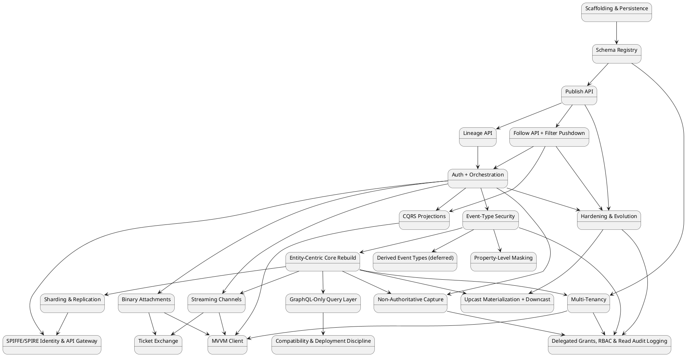
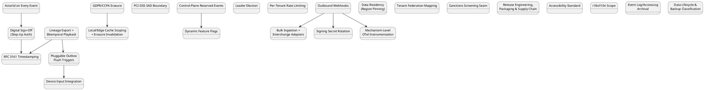

# Build Plan

This sequences the design in `01`–`07` and `features/*.md` into concrete,
checkable work. Each item lists its scope, its own prerequisite items
(**not** a phase number), and exit criteria defined in terms of the
Gherkin scenarios already written — an item isn't "done" by feel, it's
done when its feature doc's scenarios pass, on every database provider
the scenario applies to.

> **Restructured this session, per direct request** (`.claude/
> context.md`): this file used to number every item `Phase N`, with
> "Depends on: Phase N" cross-references. That broke down once ADRs
> stopped landing in a single, front-loaded burst — adding `ADR-050`
> through `ADR-093` (44 more ADRs across dozens of later sessions) had no
> good place to go without either renumbering everything downstream or
> tacking on an ever-growing, undifferentiated tail. **Every item below
> now has a name, not a number, and declares its own prerequisite items
> by name.** The order items appear in below is *one valid topological
> ordering* of that dependency graph — items always appear after
> everything they depend on — not a priority ranking and not a fixed
> numbering. Adding a new item later means placing it after its
> dependencies and, if it revises an earlier item's own mechanism rather
> than merely building on it, adding a short forward-pointing note to that
> earlier item (the same additive-history convention `ADR-075`'s note on
> "Multi-Tenancy" below already used, now the standing pattern) — never
> renumbering anything above it.

Two groups worth naming up front, since they explain most of the
ordering below:

- **The first 24 items** (`ADR-001`–`049`) are this design's original,
  front-loaded core build — the OData-era read surface (Lineage/Follow/
  registry listing) gets built first, then explicitly swapped to GraphQL
  by the "GraphQL-Only Query Layer" item once the entity-centric rebuild
  lands. That sequencing choice (build OData, then swap) is deliberate
  and preserved exactly as originally decided — it is *not* something
  this restructuring pass corrects, the same reason `06-solution-
  structure.md`'s own now-superseded code sketches were preserved rather
  than silently rewritten to the end state.
- **Everything after that** (`ADR-050`–`093`) is new work backfilled this
  pass. A handful of these ADRs already had a documented home in the
  original 24 items (`ADR-050`→"Property-Level Masking", `ADR-051`→
  "Sharding & Replication", `ADR-052`→"Streaming Channels", `ADR-053`→
  "Upcast Materialization + Downcast", `ADR-075`→"Multi-Tenancy") — those
  are called out where they already live, not duplicated as new items.
  Three ADRs (`ADR-055`/`063`/`085`, all testing-strategy escalations) and
  two ADRs (`ADR-059`/`084`/`092`, all cross-cutting discipline/scope
  statements with no exit criteria of their own) are folded into
  "Cross-cutting, every item" below rather than given standalone entries —
  they don't gate any single item's own exit criteria the way a real
  build dependency does.

## Dependency overview — original core build (`ADR-001`–`049`)

Unchanged from before this restructuring pass except state labels
dropping their old `Phase N` prefix — the graph itself, and the items
it describes, are identical.

Phases 3 and 4 both depend only on Phase 2, not on each other — they can be
built in either order, or in parallel by two people. Phase 5 fans back in
because it wraps every endpoint built in 1–4, so it can't meaningfully start
until they all exist. Phase 6 depends on Phase 5 specifically because
`RequiredPublishClaim`/`RequiredReadClaim` enforcement needs the caller's
JWT claims to already be populated — there's nothing to check against
before JWT bearer auth exists (`ADR-008`). Phases 7 and 8 both depend on
Phase 6, not on each other — like 3/4, they're independent and can run in
either order once the primary system (0–6) is stable. Phase 8 also has a
real, non-transitive dependency on Phase 4 specifically (the shared
`x-masking` node-finding helper introduced there) — already guaranteed by
the diagram's ordering (4 → 5 → 6 → 8), just called out explicitly since
it's a genuine content dependency, not only a scheduling one. Phase 9
depends only on Phase 4 (Follow must exist — a projection is a Follow
caller, `ADR-015`) and Phase 5 (it needs its own OAuth2 client to
authenticate as one) — **not** on Phase 6, because the worked example
doesn't require a claim-gated event type to demonstrate the merge rule,
though a real projection over a claim-gated type would need Phase 6's
enforcement to already exist so its client's claims mean anything. It's
independent of Phases 7 and 8 entirely. Phase 10 depends on Phase 5 (DPoP
hardens the auth model Phase 5 already built), Phase 2 (hash chaining
extends `EventAppender`, built in Phase 2), and Phase 4 (event upcasting
matters most for Follow's `mode=replay`) — it's independent of Phases 6
through 9, since none of DPoP/upcasting/hash-chaining touch event-type
security, masking, derived events, or projections.

Phases 11–20 are the design-docs integration (`ADR-021`–`039`). Phase 11 is
the load-bearing one — nothing in 12–20 makes sense without entities,
`Optional<T>` patches, the persist-everything posture, and conflict/
ordering detection existing first. Phases 12–17 are largely independent of
each other once 11 lands (multi-tenancy, schema-evolution extensions,
streaming, attachments, distribution, and non-authoritative capture don't
depend on one another). Phase 18 (the GraphQL-only swap) depends on 11
specifically, not on 12–17 — it could in principle run in parallel with
them, though in practice it's disruptive enough (it supersedes 3/4's
entire query surface) that sequencing it deliberately, once, is likely
easier than interleaving it with five other phases touching the same
codebase. Phase 20 (the MVVM client) is sequenced near the end for the
same reason `ADR-039` itself gives: least load-bearing, composes what
already exists rather than adding new server-side mechanism. Ticket
Exchange (`ADR-040`) depends on Streaming Channels/Binary Attachments
specifically — it closes a gap those two items' own header-incapable
callers (`<video src>` playback, inline ``/`<a href>` attachment
retrieval) reopen, so it can't meaningfully start until they exist, though
it doesn't depend on 18/19/20 at all and could run alongside them.

## Dependency overview — additions since `ADR-050`

Split into its own diagram deliberately, not merged into the one above —
a single 48-node graph would be denser than useful. Every edge crossing
into the diagram above (e.g. an addition depending on "Auth +
Orchestration") is written as plain text below the diagram rather than
duplicating the whole core graph's nodes here.

Every edge into the core diagram, written out (the authoritative source —
the diagram above only shows addition-to-addition edges):

- **ActorId on Every Event** depends on **Publish API** and **Auth +
  Orchestration**.
- **GDPR/CCPA Erasure** depends on **Property-Level Masking** and
  **Entity-Centric Core Rebuild**.
- **PCI-DSS SAD Boundary** depends on **Schema Registry** and
  **Property-Level Masking**.
- **Local/Edge Cache Scoping + Erasure Invalidation** depends on **MVVM
  Client** (and, per the diagram above, GDPR/CCPA Erasure).
- **Digital Sign-Off** depends on **Auth + Orchestration** (and ActorId).
- **Control-Plane Reserved Events** depends on **Schema Registry** and
  **Entity-Centric Core Rebuild** — and **revises** "Delegated Grants,
  RBAC & Read Audit Logging"'s own storage mechanism; see that item's own
  entry below for the forward-pointing note.
- **Leader Election** depends on **Entity-Centric Core Rebuild** (Router/
  UpcastMaterializer exist as background services from that item on).
- **Per-Tenant Rate Limiting** depends on **Auth + Orchestration** and
  **SPIFFE/SPIRE Identity & API Gateway**.
- **Outbound Webhooks** depends on **Publish API** and **Auth +
  Orchestration**.
- **Data Residency** depends on **Sharding & Replication** and
  **Multi-Tenancy**.
- **Tenant Federation Mapping** depends on **Multi-Tenancy** and **Auth +
  Orchestration**.
- **Bulk Ingestion + Interchange Adapters** depends on **Publish API**
  (and, per the diagram above, Outbound Webhooks for the outbound half).
- **Sanctions Screening Seam** depends on **Scaffolding & Persistence**
  only — it's an application-scoped (KYC/Meridian) extension, not core.
- **Release Engineering, Packaging & Supply Chain** depends on
  **Scaffolding & Persistence** only.
- **Lineage Export + Bitemporal Playback** depends on **Lineage API**,
  **Entity-Centric Core Rebuild**, and **MVVM Client**.
- **Accessibility Standard** and **i18n/l10n Scope** both depend on
  **MVVM Client** only.
- **Mechanism-Level OTel Instrumentation** depends on **Hardening &
  Evolution**, **Sharding & Replication**, **Entity-Centric Core
  Rebuild** (and, per the diagram above, Outbound Webhooks).
- **Event Log/AccessLog Archival** depends on **Binary Attachments**,
  **Delegated Grants, RBAC & Read Audit Logging**, and **Hardening &
  Evolution**.
- **Data Lifecycle & Backup Classification** formally depends only on
  **Scaffolding & Persistence** (the classification exists from day one)
  but its exit criteria stay accurate only as later items land — see its
  own entry.

## Scaffolding & Persistence

**Scope**: the project layout in `06-solution-structure.md`
(`EventStore.Domain`, `EventStore.Persistence`, the three
`*.Migrations.<Provider>` projects, `EventStore.Host.Core`, and the three
`EventStore.Host.<Provider>` deployables per `ADR-001`). Build the **full**
`EventStoreContext` model now — `EventTypeDefinition`, `FilterableField`,
`StoredEvent`, `EventParent` — even though most of it isn't used until later
items. Laying down one coherent schema up front avoids a second wave of
migrations once later items start using tables this one didn't create.
`EventStore.AppHost`/`EventStore.ServiceDefaults`/`EventStore.DevIdp` are
**not** part of this item — see "Auth + Orchestration".

**Depends on**: nothing.

**Exit criteria**:
- Solution builds; an initial migration exists and applies cleanly on
  SQLite, PostgreSQL, and SQL Server.
- `EventStore.IntegrationTests` runs one trivial round-trip test (insert +
  read back a `StoredEvent`) against all three providers (Testcontainers for
  Postgres/SQL Server, file-based SQLite) — this harness stays live for
  every item after this one, it is not a one-time setup task.

## Schema Registry

**Scope**: `PUT`/`GET /registry/{event-type}` and `QUERY /registry`
(paginated listing, `ADR-012`) per `05-schema-registry-and-spec-generation.md`
and [`features/schema-registry.md`](features/schema-registry.md): structural
JSON Schema validation, `FilterableField` path validation against the
schema, versioning (`IsActive` flip, no mutation of prior versions),
`ParentValidationMode` accepted and validated as an enum on the request.
Per-provider index/computed-column migrations for `IsIndexed = true` fields
(`04-odata-filter-pushdown.md`) are built here too, even though nothing
queries through them until "Follow API + Filter Pushdown". **`x-masking`
structural validation** also belongs here: reject `strategy` other than
`"FixedValue"`, reject placement directly on an `object`-/`array`-typed
property, validate `requiredClaim`'s `"type:value"` format and that
`regulatoryClassification`/`governanceBody`/`regulationReference` are
non-empty strings if present (`ADR-009`) — this is pure data validation on
the registration payload with no claims involved, so it doesn't wait for
"Event-Type Security"/"Property-Level Masking" the way enforcement does,
and "Follow API + Filter Pushdown"'s `MaskingSchemaTransformer` needs to be
able to assume any `x-masking` it encounters is already well-formed.

Not in scope yet: `ParentValidationMode` is stored but not *enforced*
(that's `ParentLinkService`, "Publish API"); `registry:admin` scope is not
enforced (that's "Auth + Orchestration") — accept requests unauthenticated
for now. `RequiredPublishClaim`/`RequiredReadClaim` (`ADR-008`) are likewise
accepted and validated for format (a well-formed `"type:value"` string) but
not enforced — that needs JWT claims to exist first, so enforcement is
"Event-Type Security". `x-masking`'s *validation* is this item's job
(above); its *enforcement* (`IPayloadMasker`) is still "Property-Level
Masking".

**Depends on**: Scaffolding & Persistence.

**Exit criteria**: every scenario in
[`features/schema-registry.md`](features/schema-registry.md) passes, on all
three providers, including the index/computed-column verification and
`QUERY /registry`'s `$top`/`$skip` pagination (omitting both still
returns everything); plus the two registration-rejection scenarios in
[`features/masking.md`](features/masking.md) ("x-masking directly on an
object-typed property is rejected" and "a masking strategy other than
FixedValue is rejected") and the "regulatory metadata fields are optional"
scenario there — the rest of that doc's scenarios (actual masking/wrapping
behavior) belong to later items, not this one.

## Publish API

**Scope**: `POST /publish/{event-type}` per `03-api-contracts.md` and
[`features/publish-event.md`](features/publish-event.md): the `{
schemaVersion, payload, parentEventIds?, eventId? }` envelope
(`schemaVersion` required — `ADR-020`), `SchemaValidationService` against
the *declared* version (rejected `400` if that version doesn't exist, not
automatically "whichever is active"), `ParentLinkService` enforcing
`ParentValidationMode`
(`Strict`/`Permissive`, per [`features/event-chains.md`](features/event-chains.md)),
the `eventId`/`PayloadHash` idempotency short-circuit (`ADR-011`,
including the concurrent-retry race handled at the unique-constraint
level — `06-solution-structure.md`), `EventAppender` writing `StoredEvent`
+ `EventParents` in one transaction. Generate and expose `/openapi.json`
now that the publish contract exists
(`ADR-002`): `EventSchemaConverter` (parses registered `JsonSchema` text
into the shared `Microsoft.OpenApi` `OpenApiSchema`) and
`OpenApiDocumentBuilder` (native `Microsoft.OpenApi` document + writer),
`IMemoryCache`-backed per `ADR-002`.

Lineage is built here, not deferred — only the derived-event-types idea
(`ADR-007`) is deferred, not `EventParents` (`ADR-005`, already Accepted).

`ADR-020`'s live upcast-validation-on-publish and `EventUpcastFailed`
dead-letter behavior are **not** part of this item — they depend on
`UpcastChain` (`ADR-018`), which doesn't exist until "Hardening &
Evolution". Until then, a publish with `schemaVersion` behind the active
version is simply accepted and stored at the declared version, exactly as
if `ADR-020` didn't exist yet; "Hardening & Evolution" is where the
live-validation behavior turns on.

**Depends on**: Schema Registry (needs a registered schema to validate
against).

**Exit criteria**: every scenario in
[`features/publish-event.md`](features/publish-event.md) and the
publish-side scenarios in
[`features/event-chains.md`](features/event-chains.md) pass on all three
providers, including: retrying with the same `eventId` and identical
content replays the original response with no new write; retrying with
the same `eventId` and different content is `409`; omitting `eventId`
behaves exactly as before `ADR-011`. `/openapi.json` includes
`/publish/{event-type}` with the envelope shape (including `eventId`),
served anonymously, cache-invalidated on the next registration.

## Lineage API (read side)

**Scope**: `QUERY /events/{id}/parents|children|ancestors|descendants`
(`ADR-012` — replacing `GET`, adding `$top`/`$skip` pagination) per
`03-api-contracts.md` and
[`features/event-chains.md`](features/event-chains.md): `EventParentReader`
(plain LINQ join) for direct parents/children, `IEventLineageQueryProvider`
(provider-specific recursive CTE) + `CycleGuard` for ancestors/descendants,
routed via `MapMethods(..., ["QUERY"], ...)` reading `$top`/`$skip` (and,
once "Event-Type Security" lands, the visibility check) from the request
body.

**Depends on**: Publish API (needs published events with parent links to
traverse).

**Exit criteria**: the lineage-query and cycle-safety scenarios in
[`features/event-chains.md`](features/event-chains.md) pass on all three
providers — specifically including the scenario where a cycle exists across
two `Permissive`-mode events and traversal still terminates, returning each
node exactly once; `$top`/`$skip` correctly slice the result, and omitting
both still returns everything.

## Follow API + Filter Pushdown

**Scope**: `QUERY /follow/{event-type}` (`ADR-012` — replacing `GET`,
`$filter`/`mode`/`fromSequenceNumber` now in the request body) per
`03-api-contracts.md`, [`features/follow-subscribe.md`](features/follow-subscribe.md),
and [`features/filter-pushdown.md`](features/filter-pushdown.md):
`ODataFilterParser`, validation against declared `FilterableFields`,
`PredicateTranslator` + `IJsonPathTranslator` per provider, the
`EventTailReader` polling loop, the `mode`/`fromSequenceNumber`
cursor-initialization logic (`ADR-010`, `06-solution-structure.md`), SSE
responses carrying the envelope headers (`eventId`, `sequenceNumber`,
`occurredAt`, `parentEventIds`). No `access_token` query parameter — browser
clients authenticate via `fetch()` with a real `Authorization` header, same
as everyone else (`ADR-012`). Generate and
expose `/asyncapi.json` now that the follow contract exists:
`AsyncApiDocumentBuilder` (hand-built JSON envelope around the same shared
`OpenApiSchema` from `EventSchemaConverter`) **and**
`MaskingSchemaTransformer` — even though masking's runtime enforcement
(`IPayloadMasker`) doesn't land until "Property-Level Masking", the
schema-level `x-masking` → `oneOf[value,masked,erased]` (`ADR-057`) wrapper
is claims-independent and must exist now so `/asyncapi.json` never
documents a maskable property's bare, unwrapped type (`ADR-002`, `ADR-009`).

**Depends on**: Publish API (needs published events to tail). Independent
of Lineage API — can be built before, after, or alongside it.

**Exit criteria**: every scenario in
[`features/follow-subscribe.md`](features/follow-subscribe.md) and
[`features/filter-pushdown.md`](features/filter-pushdown.md) passes on all
three providers, including the scenario outline that runs the same query
identically across SQLite/Postgres/SQL Server, and the 400-before-any-SQL
rejection for an undeclared filter field; `/asyncapi.json` includes the
follow channel, served anonymously, cache-invalidated on the next
registration; a maskable property (registered ahead of "Property-Level
Masking") already appears wrapped as `oneOf[value,masked,erased]` in the
generated document, even though every event still streams it
unconditionally as `{"value": ...}` until that item's enforcement lands
(`features/masking.md`); `mode=replay` delivers matching history then
tails with no gap or duplicate, `fromSequenceNumber` correctly bounds where
replay starts, and supplying `fromSequenceNumber` with `mode=tail` (or the
default) is rejected `400`.

## Auth (OIDC/OpenIddict) + Orchestration

**Scope**: per `ADR-006` and [`features/auth.md`](features/auth.md) — JWT
bearer middleware and the four scope policies (`events:publish`,
`events:follow`, `events:lineage:read`, `registry:admin`) layered onto
every endpoint built so far; the custom `ScopeRequirement` handler
(space-delimited `scope` claim, not a bare `RequireClaim`); the new
`EventStore.DevIdp` project (OpenIddict, EF Core InMemory store, three
clients pre-seeded in code by `DevIdpSeeder`); `EventStore.AppHost` (Aspire)
wiring whichever single `EventStore.Host.<Provider>` it targets (`ADR-001`)
+ that provider's database container + `EventStore.DevIdp` (a project
resource, not a third-party container); the `docker-compose.yml` fallback
(two ordinary app images, no external IdP image); CORS (`ADR-014`) —
`Cors:AllowedOrigins` config, the named policy allowing `QUERY` and
`Authorization` for browser callers of Follow/Lineage/Registry (`ADR-012`).

**Depends on**: Schema Registry, Publish API, Lineage API, Follow API +
Filter Pushdown (there is nothing to authorize before they exist).

**Exit criteria**: every scenario in
[`features/auth.md`](features/auth.md) passes — 401/403/202 paths, public
spec documents staying anonymous, a browser `fetch()` call to Follow
succeeding cross-origin once its origin is in `Cors:AllowedOrigins` and
failing closed when it isn't; `aspire run`
and `docker-compose up` each produce a working dev stack from a clean
checkout with zero manual setup (no admin console exists to configure in
the first place — the seed is code, verified via a token request).
`ADR-006` is already Accepted (confirmed) — this item is where it gets
verified end-to-end, not where it gets decided.

## Event-Type Security

**Scope**: per `ADR-008` and
[`features/event-security.md`](features/event-security.md):
`RequiredPublishClaim` enforcement in `PublishEndpoint`;
`RequiredReadClaim` enforcement in `FollowEndpoint` (once, at connect time,
for its own event type — plus per-parent filtering of the
`parentEventIds` envelope header, see below); `LineageEndpoint`'s two-tier
check per "you can only see what you can see" — pass/fail `403` for the
root `{eventId}`'s own type, then an independent per-node check for every
*other* type the traversal discovers, turning a failure there into a
`restricted: true` stub rather than failing the request (the recursive CTE
from "Lineage API" needs updating to stop expanding through a restricted
node, not just redact it in the output — see `06-solution-structure.md`).
Both claim checks run as plain application code after the relevant
`EventTypeDefinition` is loaded, not as a static `AddPolicy` — see
`06-solution-structure.md` for why.

Masking (`ADR-009`) is **not** part of this item despite sharing the same
`RequiredReadClaim` machinery — see "Property-Level Masking". It's a
deliberate priority call, not a technical dependency that had to be split
out.

**Depends on**: Auth + Orchestration (needs JWT claims to already be
populated — there is nothing to check against before bearer auth exists).

**Exit criteria**: every scenario in
[`features/event-security.md`](features/event-security.md) and the new
scenarios in [`features/follow-subscribe.md`](features/follow-subscribe.md)
pass, including: publish vs. read claims enforced independently for the
same event type; a lineage query on a **restricted root** rejected
entirely (`403`); a lineage query on a **visible root** still succeeding
(`200`) with a `restricted: true` stub for any discovered node the caller
can't see, while every other node — including ones reachable only through
a different, visible path — returns normally; the `403`-vs-`404`
distinction (root restricted-but-existing vs. truly unknown) holding for
all four Lineage endpoints; and a restricted parent's ID omitted from
Follow's `parentEventIds` envelope header without blocking the event
itself from streaming.

## Derived/Materialized Event Types (deferred)

**Scope**: per `ADR-007` — not started until the primary system is
complete and stable. `POST /create/{event-type}?$from=...&$on=...&$select=...`,
schema auto-composition from the projection, the per-derived-type
configurable join-trigger (fire-once vs. continuous enrichment) and
configurable backfill-vs-from-now, and the background derivation worker
(an internal `EventTailReader` consumer that republishes through the same
Publish API path). Derived events record their sources via
`parentEventIds` — reusing the Publish/Lineage API's mechanism with no
schema change, per `ADR-007`'s own consequences.

**Depends on**: Event-Type Security. Explicitly out of the primary build's
critical path — see `ADR-007` for the open questions (unbounded
pending-join state, n-ary `$select`, backfill over a derived source), all
resolved in the ADR itself; this item stays deferred purely on scheduling.

## Property-Level Masking (data enforcement)

**Scope**: per `ADR-009` and [`features/masking.md`](features/masking.md)
— design-complete, scheduled after "Event-Type Security" purely as a
priority call, not because anything is unresolved (contrast with "Derived/
Materialized Event Types"). This is only the **data** half — `x-masking`
structural validation moved to "Schema Registry" and the **schema** half
(`MaskingSchemaTransformer`) moved to "Follow API + Filter Pushdown",
since neither needs claims (see those items). What's left here: the
`IPayloadMasker` pure `(schema, data, hasClaim) -> data` transform
(`06-solution-structure.md`) wired into `FollowEndpoint`'s per-event
pipeline; the per-connection masked-node set computed once at connect time
alongside `RequiredReadClaim`; the recursive wrapping rule through array
`items` (scalar: wrap each element; complex object: wrap only the masked
properties within each element) applied to actual payload *data*, reusing
the same node-finding helper `MaskingSchemaTransformer` already
established in "Follow API + Filter Pushdown".

**Depends on**: Event-Type Security (reuses its claim-checking primitive
and the connect-time check already happening for `RequiredReadClaim`) and
Follow API + Filter Pushdown (the shared node-finding helper). Independent
of "Derived/Materialized Event Types" — neither depends on the other.

**Extended by `ADR-050`** (same item, not a new one): `x-masking` and
the generalized `RequiredClaims` list both guaranteed to appear in
generated OpenAPI/AsyncAPI docs as `x-*` Specification Extensions
(the `OpenApiDocumentBuilder`/`AsyncApiDocumentBuilder` from "Publish API"/
"Follow API + Filter Pushdown" gain this here, once masking metadata
exists to emit); `Microsoft.Extensions.Compliance.Redaction` wired into
logging so classified `Payload` values never reach log output — exit
criterion: a log statement touching a `clearance:phi`-classified field is
verified redacted, not just the API response path.

**Revised by `ADR-057`** ("GDPR/CCPA Erasure" below): the `oneOf` wrapper
this item builds (`{value}`/`{masked}`) gains a third `{erased}` branch
once that item lands — not built here, since erasure doesn't exist yet at
this point in the build.

**Exit criteria**: every scenario in
[`features/masking.md`](features/masking.md) passes: registration rejecting
`x-masking` on a non-scalar node (other than array items); a follower
without the field-specific claim receiving `{"masked": "***"}` while one
with the claim receives `{"value": <real value>}`, on the same connection,
same event type; the wrapper applied correctly to a scalar array (each
element wrapped) and to an array of complex objects (only the masked
properties within each element wrapped, the rest of each object untouched);
and a legitimately-absent field staying absent rather than gaining a
wrapper.

## CQRS Read-Model Projections (worked example)

**Scope**: per `ADR-015`, `ADR-016`, `09-cqrs-read-models.md`, and
[`features/cqrs-projections.md`](features/cqrs-projections.md):
`EventStore.Projections.Abstractions` (`IProjection<TReadModel>`);
`EventStore.Projections.Host` (`ProjectionHost`'s replay-from-checkpoint
loop against `QUERY /follow/{event-type}`, `SnapshotMerger`'s
Full-replace-vs-Partial-merge-patch logic, `ProjectionsDbContext` —
`ProjectionCheckpoint` + `ProjectionSnapshot`, its own separate database);
the required `changeKind` field on event-type registration (`ADR-016`,
already validated starting "Schema Registry" — this item is where it's
finally *consumed*, not where it's first accepted); a fourth seeded
OAuth2 client (`projections-client`, `events:follow` scope) in
`EventStore.DevIdp`'s `DevIdpSeeder` (`ADR-006`); the worked example itself,
`Samples.Orders.Projections`' `OrderSummaryProjection` over the four Orders
event types.

**Depends on**: Follow API + Filter Pushdown (Follow must exist — a
projection is an ordinary Follow caller) and Auth + Orchestration (needs
its own OAuth2 client). Independent of Event-Type Security, Derived/
Materialized Event Types, and Property-Level Masking.

**Exit criteria**: every scenario in
[`features/cqrs-projections.md`](features/cqrs-projections.md) passes:
a `Full` event establishes a read-model row from scratch; a `Partial`
event merges onto existing state without disturbing fields it doesn't
carry; independent `Partial` events for the same key don't clobber each
other's fields; a field the projection's own client lacks the claim to see
is never overlaid as a placeholder (reusing `ADR-009`'s overlay rule,
demonstrated here rather than merely stated); registering an event type
without `changeKind` is rejected `400`; a full rebuild (truncate + reset
checkpoint to `0` + replay) reproduces the exact same end state as the
incrementally-built one; and resuming after downtime delivers no gap and
no duplicate, reusing `ADR-010`'s guarantee rather than reimplementing it.

## Hardening & Evolution (DPoP, event upcasting, hash-chained tamper evidence)

**Scope**: three independent hardening additions layered onto an already-
working system, per `ADR-017`, `ADR-018`, `ADR-019`:
- **DPoP** (`ADR-017`): key-pair generation per seeded OAuth2 client in
  `DevIdpSeeder`; `cnf.jkt` embedding at token issuance; the DPoP-proof
  validation middleware in `EventStore.Host.Core`, alongside the existing
  JWT-bearer validation.
- **Event upcasting** (`ADR-018`): `IEventUpcaster` + `UpcastChain`
  (`06-solution-structure.md`), wired into `FollowEndpoint` (before
  masking's transform) and `ProjectionHost` (before `SnapshotMerger`).
- **Hash-chained tamper evidence** (`ADR-019`): `ChainHash` computed in
  `EventAppender` alongside the existing `SequenceNumber`/`PayloadHash`
  assignment; the `GET /events/verify?throughSequenceNumber=<n>`
  verification endpoint (or equivalent offline tool).
- **Publish-time upcast validation** (`ADR-020`): this is where
  `PublishEndpoint` starts actually calling `UpcastChain` when
  `schemaVersion` is behind active, and where the reserved
  `EventUpcastFailed` event type and its dead-letter path are built —
  "Publish API" already accepts the required `schemaVersion` field, this
  item is what makes it do anything beyond validate-and-store.

**Depends on**: Auth + Orchestration (DPoP), Publish API (hash chaining),
Follow API + Filter Pushdown (event upcasting). Independent of Event-Type
Security through CQRS Read-Model Projections.

**Exit criteria**: a request with a valid bearer token but a missing or
mismatched DPoP proof is rejected `401` (`dpop-proof-invalid`); a request
with both valid throughout succeeds exactly as before this item; a
`mode=replay` burst spanning a registered upcaster's version gap presents
every event in the current schema's shape to the caller, verified against
both `FollowEndpoint` and a `ProjectionHost` consumer; and deliberately
corrupting one historical `Payload` (test-only, direct database edit) is
detected by the verification endpoint at exactly that `SequenceNumber`,
with every event before it verifying clean.

## Entity-Centric Core Rebuild

**Scope**: `ADR-021` (`EntityId`, the always-on Entity Store, folded by
`EventStore.Fold`), `ADR-022` (`Optional<T>` property-level patches,
refining `ADR-016`'s merge), `ADR-023` (the Inbox/Router split — publish
returns `202` + a status envelope; `SchemaStatus`/`AuthorityStatus`
become advisory, never `400`), `ADR-024` (`ExpectedVersion` optimistic
concurrency + `ConflictFlag`, and `ADR-029`'s `LateArrivalFlag`/logical-
order fold — see `docs/patterns/interactions/fold-ordering-and-conflict.md`
for how the two checks compose in one fold step).

**Depends on**: Event-Type Security (the primary system needs to be
stable and fully auth'd before this rebuild touches every endpoint's
response shape).

**Exit criteria**: [`features/entity-concept.md`](features/entity-concept.md)
passes on all its scenarios — a new `EntityId` creates an Entity Store row,
a second event for the same `EntityId` bumps `Version`, a stale
`ExpectedVersion` sets `ConflictFlag` without ever rejecting, and a
schema-invalid publish persists as `202` + `SchemaStatus: invalid`; every
existing feature-doc Gherkin scenario that asserted `400` for a schema-
invalid/unknown-version publish now asserts `202` + the right
`SchemaStatus` instead (a real rewrite of existing scenarios, done as part
of this session's `docs/features/*.md` sweep — see `docs/changes/
2026-08-01.md`); a same-property concurrent-write scenario shows
`ConflictFlag`; a deliberately-reordered-delivery test (publish B, then
publish A with an earlier `OccurredAt`) shows `LateArrivalFlag` and
confirms A's change did not overwrite B's.

## Multi-Tenancy

**Scope**: `ADR-030` — `AppId` joins the schema registry's key; every
registry/upcast/downcast lookup across "Schema Registry"/"Hardening &
Evolution"/"Upcast Materialization + Downcast" gets `AppId` added.
**Boundary note, added this session (`ADR-075`)**: this item's `AppId`
isolation now protects different *applications within one tenant's own
dedicated deployment*, not different *customers* sharing one deployment —
the deployment boundary itself is the customer isolation now, decided
after this item's original exit criteria were written.

**Depends on**: Schema Registry (must exist), Entity-Centric Core Rebuild
(`AppId` is part of `EntityId`, already there — this item makes the
*registry* side consistent with it).

**Exit criteria**: two applications registering a same-named event type
with different shapes/claims/`ChangeKind` don't collide; a caller
scoped to one `AppId` cannot resolve or read another's schema.

## Upcast Materialization + Downcast

**Scope**: `ADR-027` (persist a successful lagging-publish upcast as an
`UpcastMaterialization` event; a background `UpcastMaterializer`
reconciles the existing backlog once a new version+mapping is
registered; fold skips materializations entirely), `ADR-028`
(`downcastToPrevious`, read-time only, walked backward hop by hop for an
explicitly requested older version), and `ADR-053` (`IUpcastExpressionEvaluator`
as the seam between `UpcastChain` and the declarative engine — CEL
registered by default in the composition root, `Jsonata.Net.Native`
swappable via configuration with no core-engine change).

**Depends on**: Hardening & Evolution (upcasting itself), Entity-Centric
Core Rebuild (the fold-skip invariant needs the Entity Store to exist).

**Exit criteria**: a materialized upcast never double-applies to the
Entity Store (a targeted regression test: fold an original, materialize
its upcast, confirm `Version` doesn't bump twice); a downcast request for
a genuinely older version returns the old shape; a version with no
`downcastToPrevious` registered fails the request rather than guessing;
the same registered `UpcastFromPrevious` expression evaluates
identically whether CEL or `Jsonata.Net.Native` is the configured
engine, for a mapping both can express.

## Streaming Channels

**Scope**: `ADR-031` — `TelemetryChannel`/`TelemetrySample` (raw signal
and media), batch ingestion, tail/replay reusing `ADR-010`'s shape,
`Derived` channels via `ChannelDerivationWorker`, playback (HTTP Range
Requests), deep-linking (Media Fragments URI), redaction (`RedactedRange`,
concretely per `ADR-052`: read-time, zero-fill/tone/blank-frame default,
configurable `PartialReveal` for structured content, mandatory sideband
existence signal), out-of-order/slow-upload detection, and the
detector→`TelemetryPointer` bridge back into ordinary domain events.

**Depends on**: Auth + Orchestration (new `telemetry:ingest`/
`telemetry:read` scopes), Entity-Centric Core Rebuild (a detector's
published event needs `EntityId`/fold to exist meaningfully).

**Extended by `ADR-081`**: `TelemetryChannel.ThreadId` groups multiple
simultaneous channels under one session (e.g. a multi-electrode montage);
`TelemetryPointer` generalizes from a single object to a list, for a
detection spanning several channels at once. Build alongside the base
scope above, not as a later pass — the field shapes are already revised
in `docs/data/streaming-and-attachments.md`.

**Extended by `ADR-090`**: no new mechanism, but this item's `OriginId`/
`SequenceNumber` fields (surfaced in the publish response once "Sharding
& Replication" lands) are what a caller uses to achieve read-your-writes
across the multi-site mesh — documented as an existing-mechanism
capability, not built as a new one.

**Exit criteria**: a batch of samples ingests without touching schema
validation/hash-chain/fold at all; a detector publishing an event with a
`TelemetryPointer` round-trips through the normal publish pipeline
unchanged; a deliberately-reordered sample sets `LateArrivalFlag`; a
Range request against a `Media` channel returns `206 Partial Content`;
a caller lacking a `RedactedRange`'s `RequiredClaim` receives the
configured substitution (zero-fill/tone/blank-frame, or `PartialReveal`
where configured) plus the sideband existence flag, never the raw value
and never a response indistinguishable from "no redaction happened here";
a session with multiple `ThreadId`-grouped channels renders as one
grouped view, not N unrelated ones.

## Binary Attachments

**Scope**: `ADR-032` — content-addressed `Attachment`/`AttachmentRef`,
the two-step upload (`POST /attachments` then a publish carrying the
hash), GraphQL browsing of an entity's linked attachments, and `GET`
retrieval with HTTP Range-request support.

**Depends on**: Auth + Orchestration (new `attachments:read`/
`attachments:ingest` scopes).

**Exit criteria**: uploading identical bytes twice deduplicates (one
stored object, two `AttachmentRef` rows); a GraphQL query against an
entity lists its linked attachments (`contentHash`, `filename`,
`mimeType`, `sizeBytes`); a `GET` against a content-addressed attachment
URL with a `Range` header returns `206 Partial Content` for exactly the
requested byte range.

## Sharding & Replication

**Scope**: `ADR-034` (shard by `EntityType`), `ADR-033` (gossip
topology, minimum 2-replica/regional-fault-tolerance requirement,
`OriginId`/`LogicalClock`, the fault/abend/restart-tolerant peer-sync
outbox/inbox, Merkle-tree catch-up), and `ADR-051` (peer discovery via
explicit static `SeedPeers` configuration, not any form of automatic
discovery) — see `docs/comparisons/sharding-strategy.md`/
`peer-sync-topology.md`/`peer-discovery.md` for why each won.

**Depends on**: Entity-Centric Core Rebuild (there must be an Entity Store
to shard/replicate).

**Exit criteria**: killing one site mid-write doesn't lose the write (it's
in that site's durable outbox, replayed once the site restarts); two
sites disconnected and independently written to converge, with any
genuine conflict flagged (`ADR-024`, reused) not silently dropped; a
sharded cross-`EntityType` query fans out and merges correctly; a
newly-deployed peer with no prior configuration beyond its own
`SeedPeers` list successfully gossips with the mesh via its first
reachable seed.

## Non-Authoritative Capture

**Scope**: `ADR-035` (`AuthorityStatus`, `authorityDecision` events,
`RejectionBehavior` — annotate-only default per
`docs/comparisons/authority-rejection-behavior.md`), `ADR-036`
(DID/UCAN self-attestation, server-side OAuth Token Exchange, RFC 8693),
and `ADR-042` (the gated authoritative fold + `LiveEntityStoreRow` —
revises `ADR-035`'s original "folds identically" framing).

**Depends on**: Entity-Centric Core Rebuild (the trust axis rides on
`StoredEvent`, already extended there for other reasons), Auth +
Orchestration (auth/token issuance infrastructure to extend for token
exchange).

**Exit criteria**: [`features/non-authoritative-capture.md`](features/non-authoritative-capture.md)
passes on all its scenarios — an event submitted with a self-attested
UCAN persists with `AuthorityStatus: unattested` even when the identity
provider is unreachable at submission time, never blocking ingestion and
independent of `SchemaStatus`; that event reaches `LiveEntityStoreRow`
immediately (wrapped `isAuthoritative: false`) but not the authoritative
Entity Store; once an `authorityDecision: accepted` event lands, the
authoritative Entity Store catches up to what the Live View already
showed; a later `authorityDecision: rejected` event leaves the original
event's `Payload` untouched on an `Annotate`-type, triggers a
compensating patch on a `Compensate`-type (only relevant for an event
already accepted and folded, per `ADR-042`'s narrowing), and either way
denormalizes `AuthorityDecisionRef` back onto the original event; two
servers disagreeing about review status resolves via `ConflictFlag`
(`ADR-024`, reused), not a new mechanism.

## GraphQL-Only Query Layer

**Scope**: `ADR-037` — the full OData-to-GraphQL swap. Retargets
`ADR-012`'s `QUERY` method to carry GraphQL query/subscription documents;
supersedes `ADR-003`/`04-odata-filter-pushdown.md`'s surface (the
per-provider pushdown mechanism survives, now driven by GraphQL resolver
arguments); moves `ADR-018`'s upcast mechanism onto CEL/Jint + GraphQL SDL
directives (`ADR-053` makes the declarative half itself pluggable, CEL/
JSONata interchangeable behind `IUpcastExpressionEvaluator`); per-`AppId`
schema composition (`ADR-030`); mandatory depth/cost limiting and
DataLoader batching.

**Depends on**: Entity-Centric Core Rebuild (GraphQL reads from the Entity
Store, assumed to already exist).

**Exit criteria**: every scenario the earlier Lineage/Follow/Filter-
Pushdown items wrote for OData `$filter`/traversal/registry listing now
passes against the GraphQL Gateway instead (a real rewrite of existing
scenarios — done this session, see `docs/changes/2026-08-01.md`'s
`docs/features/*.md` sweep); a query containing PII-like content in its
arguments never appears in access logs (confirms the `QUERY`-not-`GET`
requirement actually holds); a deliberately deep/expensive query is
rejected by the depth/cost limiter rather than executing.

## Compatibility & Deployment Discipline

**Scope**: `ADR-038` — enum unknown-value fallback contracts, version-
discovery capability negotiation, Expand/Contract migration discipline,
the N-1/N+1 compatibility window, feature flags as a faster lever than
rollback.

**Depends on**: GraphQL-Only Query Layer (needs the final GraphQL schema
shape to state compatibility rules against).

**Exit criteria**: a rollback drill — deploy a schema version, publish an
event tagged with it, roll back to a deployment that doesn't know that
version, confirm the event sits `received` (not lost), confirm re-
forward-deploying makes it routable again with no data loss and no
database restore.

## MVVM Client

**Scope**: `ADR-039` — View/ViewModel/command-dispatch-to-outbox
layering, the client-local durable outbox (same fault-tolerance bar as
"Sharding & Replication"'s peer-sync outbox), HTML+JS entity view
definitions, the native/JS bridge, offline-first caching.

**Depends on**: CQRS Read-Model Projections (custom projections — a
client is exactly the kind of consumer `ADR-015` already designed for),
Multi-Tenancy (a client is scoped to one `AppId`), Streaming Channels/
Binary Attachments (streaming/attachment rendering in entity views).

**Exit criteria**: a command dispatched while offline queues durably and
applies once connectivity resumes with no duplicate application; an
entity with no registered view definition still renders (generic
property-list fallback); `ConflictFlag`/`LateArrivalFlag`/`AuthorityStatus`
all render via one shared generic "flag" convention, not three bespoke
ones.

## Ticket Exchange for Header-Incapable Clients

**Scope**: `ADR-040` — ticket issuance via OAuth Token Exchange (RFC
8693, reusing "Non-Authoritative Capture"'s exchange infrastructure with a
new `requested_token_type`), client-side HMAC signing, resolution via an
RFC 7662-shaped introspection call extended with the signature
parameter, single-use/short-lived ticket consumption.

**Depends on**: Auth + Orchestration (auth/token issuance infrastructure —
this extends it, doesn't replace it), Streaming Channels (playback, the
first real header-incapable caller this item serves), Binary Attachments
(retrieval, the second).

**Exit criteria**: a `<video src>`-style URL carrying only a ticket +
signature (never a raw bearer token) successfully streams content; the
same ticket presented a second time is rejected; a ticket presented with
a signature computed from the wrong shared secret is rejected before any
content is served.

## Delegated Grants, RBAC, Federated Claims & Read Audit Logging

**Scope**: `ADR-043` (delegated, capped, time-boxed read-access grants
via UCAN delegation — "secondary opinion" access, generalized to
row-level/entity-scoped claims), `ADR-044` (application-defined
permission types via per-`AppId` `AppTrustRoot` registration, resolving
what the UCAN spec itself leaves out-of-band), `ADR-045` (`AccessLog` —
every read logged against the reader's identity and trust basis,
hash-chained independently of the Event Log), `ADR-046` (RBAC —
permissions granted to roles, roles assigned to users, plus
additive-only direct user permissions), and `ADR-047` (claims
augmentation for federated/external IdPs, reusing Token Exchange a
third time).

**Depends on**: Non-Authoritative Capture (all three build directly on
`ADR-036`'s UCAN exchange infrastructure), Event-Type Security
(`ADR-008`'s claim-check model, which gains the entity-scope extension
here), Multi-Tenancy (`AppTrustRoot` is `AppId`-scoped), Hardening &
Evolution (`AccessLog`'s hash chain reuses `ADR-019`'s primitive, built
there).

**Revised by `ADR-067`** ("Control-Plane Reserved Events" below): `Role`/
`UserPermission` were originally built here as plain CRUD-backed tables.
Once that later item lands, `RoleGranted`/`RoleRevoked`/
`PermissionGranted` become reserved event types in the same Event Log, and
`Role`/`UserPermission` become folded read models over them instead — the
exit criteria below are unaffected (the externally-observable behavior is
identical), only the internal storage mechanism changes. Not rebuilt here
in anticipation of that later revision — built the simple way first,
revised once the later item's own reasoning exists to justify it.

**Exit criteria**: a user holding a claim can delegate a subset of it,
scoped to one specific `EntityId` and an expiration, to a named grantee;
the grantee's exchanged JWT passes `RequiredReadClaim` for that entity
only, not blanket; an attempted over-broad delegation (broader than the
granter's own claim) fails UCAN validation, not a bespoke check; a UCAN
rooted in a DID that isn't a registered `AppTrustRoot` for the target
`AppId` is rejected; a UCAN rooted in a registered `AppTrustRoot` is
accepted for that `AppId`'s own custom permission strings with no
central-IdP-side pre-registration of those strings; every read through
any surface (GraphQL, attachment retrieval, streaming playback, ticket-authenticated
access) writes an `AccessLogEntry` recording `ReaderActorId` and
whether `ReaderTrustBasis` is `Authoritative` or `Attested`; tampering
with a past `AccessLog` entry is detectable by replaying its
independent hash chain.

## SPIFFE/SPIRE Service Identity & API Gateway

**Scope**: `ADR-048` — SPIFFE IDs and X.509-SVIDs for this framework's
own internal services, and `ADR-033` peer-sync mutual authentication
moved onto SPIFFE trust-bundle federation instead of a shared central
IdP; `ADR-049` — a YARP-based API Gateway as the single external entry
point, terminating external TLS/auth and routing to the right internal
service via SPIFFE-authenticated internal calls.

**Depends on**: Auth + Orchestration (this composes with, not replaces,
`ADR-006`'s external-facing OAuth2), Sharding & Replication (this is
specifically `ADR-033`'s peer-sync auth mechanism).

**Exit criteria**: an internal service call between two of this
framework's own components is mTLS-authenticated via SPIFFE workload
identity; two independent peer servers under different trust domains
mutually authenticate by exchanging trust bundles, with no shared
central IdP; a request bearing no valid SVID is rejected at the mTLS
handshake, before it reaches application code; an external caller
reaches every surface (GraphQL, attachments, streaming, ticket/OAuth
endpoints) through one gateway address, never a direct connection to an
internal service.

---

Everything below this line backfills `ADR-050`–`093`, added this session.
`ADR-050`–`053`/`075`/`081`/`090` already have documented homes above and
are not repeated here.

## Data Lifecycle & Backup/Restore Classification

**Scope**: `ADR-056` — classify every store as authoritative (must be
backed up: Event Log/`EventParent`, Schema Registry, Streaming Channel
Store, Attachment Store, and once "Delegated Grants, RBAC & Read Audit
Logging" lands, `AccessLog`) or rebuildable (backup optional, pure RTO
optimization: Entity Store, every CQRS snapshot, materialized upcasts).
No schema/storage change — confirms nothing in this design's existing
choice of portable text columns (`ADR-004`) blocks each provider's own
native backup/PITR tooling, and states the restore-then-replay path
(recover an authoritative store, then re-run the existing fold/
projection-rebuild machinery) as the disaster-recovery story for
rebuildable stores explicitly, rather than leaving it implicit.

**Depends on**: Scaffolding & Persistence (the classification exists in
principle from day one; its coverage of specific stores grows accurate as
Streaming Channels, Binary Attachments, and Delegated Grants/RBAC/Read
Audit Logging each land — this item's exit criteria should be re-checked
against the classification table each time one of those lands, not just
once).

**Exit criteria**: the authoritative/rebuildable classification table in
`06-solution-structure.md`'s "Data lifecycle" section matches the actual
set of stores that exist at the time it's checked; a real restore drill —
take a native backup of an authoritative store, restore it to a fresh
instance, re-run fold/projection-rebuild against it, confirm the
rebuildable stores reconstruct identically to the pre-backup state.

## GDPR/CCPA Erasure via Crypto-Shredding

**Scope**: `ADR-057` — per-`(AppId, EntityId)` Data-Encryption Keys (DEKs)
wrapping every `x-masking`-classified field, generated on first classified
publish for that entity; the pluggable `IErasureKeyStore` seam (cloud —
Azure Key Vault/AWS KMS/Google Cloud KMS; on-prem/self-hosted — HashiCorp
Vault; local — an encrypted file/DB-backed store for dev), multiple
backends registered and active simultaneously, selected per `AppId`; the
new `erasureScope` `x-masking` field (JSON Pointer to the owning entity
when it differs from the event's own); the `oneOf` wrapper's third
`{"erased": true}` branch, distinct from `{"masked": ...}`; the reserved
`EntityErasureRequested` event, and irreversible key destruction via the
configured `IErasureKeyStore`'s own primitive.

**Depends on**: Property-Level Masking (this item revises its `oneOf`
wrapper and reuses its claim-check-then-reveal read path), Entity-Centric
Core Rebuild (erasure is scoped to `EntityId`).

**Exit criteria**: publishing a classified field encrypts it at rest
(`Payload` on disk is ciphertext for that field, verified by direct
database inspection in a test); a caller holding the field's claim still
sees `{"value": <real value>}` (decrypted transparently); requesting
erasure for an `EntityId` publishes `EntityErasureRequested`, destroys
that entity's DEK, and every subsequent read of a previously-classified
field on that entity returns `{"erased": true}` **even for a caller who
holds every relevant claim**; `ADR-019`'s hash chain verifies clean across
an erasure (chain values were computed over ciphertext originally and are
never retroactively touched); a field with `erasureScope` pointing at a
different `EntityId` is erased when *that* entity is erased, not the
event's own; two tenants configured with different `IErasureKeyStore`
backends (e.g. one on HashiCorp Vault, one on the local store) both work
correctly in the same running deployment.

## PCI-DSS Sensitive Authentication Data Registration Boundary

**Scope**: `ADR-071` — a reserved `x-masking.regulatoryClassification`
value, `"PCI-SAD"`, that makes schema *registration* (not publish) hard-
reject an event type outright (`400`) if declared on a field. Scoped
narrowly to what PCI-DSS Requirement 3.2/3.2.2 singles out for absolute
non-persistence (CVV2/CVC2/CID, full track/magnetic-stripe data, PIN
blocks) — full PAN is not SAD and is already fully covered by ordinary
masking/erasure, unaffected by this item.

**Depends on**: Schema Registry (registration-time validation is where
this enforces), Property-Level Masking (extends the existing
`regulatoryClassification` metadata vocabulary).

**Exit criteria**: registering an event type with a field declaring
`x-masking.regulatoryClassification: "PCI-SAD"` is rejected `400` at
`PUT /registry/{event-type}`, before the type is ever active — verified
this is the *only* `x-masking` classification value that rejects at
registration rather than just being recorded as metadata; a field
declaring the ordinary `"PCI"` classification (full PAN) registers
successfully and is masked/erasable exactly like any other classified
field.

## Local/Edge Active-Scope Caching & Erasure Invalidation

**Scope**: `ADR-065` — a local/edge client (MVVM Client) subscribes with
an explicit scope filter (the same `FilterableFields`-backed GraphQL
Subscription argument shape every other consumer already uses) rather
than caching a tenant's full history; the local cache holds decrypted,
reviewable plaintext for genuine offline review, a stated trade-off
bounded by keeping the *scope* narrow; falling out of scope (closed,
completed, reassigned) proactively evicts the local copy; receiving an
`EntityErasureRequested` event for a subscribed entity is a mandatory,
immediate local purge instruction, not just the next scope-eviction cycle.

**Depends on**: MVVM Client (the local cache this item scopes and
invalidates), GDPR/CCPA Erasure via Crypto-Shredding (the event this item
reacts to).

**Exit criteria**: a client's local cache contains only entities matching
its subscription's active-scope filter, verified by inspecting local
storage directly in a test; an entity falling out of scope is purged from
local storage without waiting for any unrelated TTL; a client subscribed
to an entity that then receives `EntityErasureRequested` for it purges the
local copy immediately upon receiving that event, verified distinctly from
the scope-eviction path; a client that is offline at the moment erasure
fires still purges correctly once it reconnects and receives the event (no
special-cased "already offline" exemption).

## Digital Sign-Off for Regulated Actions (Step-Up Authentication)

**Scope**: `ADR-066` — an optional `EventTypeDefinition.RequiredSignature`
(`{ AcrValues, MaxAge }`); publish-time enforcement via RFC 9470's
step-up challenge (`WWW-Authenticate` naming the required `acr_values`/
`max_age` instead of accepting the publish) when the caller's token
doesn't meet it; a new envelope `Signature` field (`{ SignerId, SignedAt,
Meaning, Acr }`, `Meaning` required, rejected if absent) on the resulting
`StoredEvent`, exempt from crypto-shredding by deliberate legal reasoning
(GDPR Art. 17(3)(b)/(e)).

**Depends on**: Auth + Orchestration (this extends the existing OAuth2/
OIDC stack — the framework never implements the actual step-up
verification itself, that's the IdP's job), ActorId on Every Event
(`SignerId` denormalizes `ActorId`).

**Exit criteria**: a publish targeting a `RequiredSignature`-configured
event type, from a caller whose token doesn't meet the configured
`acr_values`/`max_age`, is rejected with RFC 9470's challenge rather than
accepted — the one new legitimately-rejectable case since the
persist-everything posture, distinguishable from the always-accepted
data-shape case; retrying with a token that does meet the requirement
succeeds and the resulting `StoredEvent` carries a complete `Signature`
(all four fields populated, `Meaning` non-empty); an attempt to erase the
entity that owns a signed event does not erase `SignerId`/`Signature`,
verified explicitly as a distinct assertion from the ordinary erasure
scenarios in "GDPR/CCPA Erasure via Crypto-Shredding".

## Control-Plane Actions as Reserved Events

**Scope**: `ADR-067` — every control-plane mutation (`SchemaRegistered`,
`RoleGranted`/`RoleRevoked`/`PermissionGranted`, `AppTrustRootRegistered`,
and any future administrative mutation) publishes as a reserved,
platform-level event in the same Event Log, same `StoredEvent` shape,
same hash chain, capturing `ActorId` and optionally a `Signature` — no new
store, no new tamper-evidence primitive. The existing CRUD-shaped tables
(`EventTypeDefinition`, `AppTrustRoot`, RBAC's `Role`/`UserPermission`)
become current-state read models folded from these events, the same
write/read split the Entity Store already demonstrates for tenant
business data.

**Depends on**: Schema Registry (the first control-plane mutation this
item reserves an event for), Entity-Centric Core Rebuild (the existing
`EntityId` convention this item reuses unchanged for control-plane rows).

**Exit criteria**: registering a schema, granting a role, and registering
an `AppTrustRoot` each publish a corresponding reserved event visible
through the ordinary Lineage API, hash-chained alongside business events;
a business event published under a specific RBAC grant can name that
grant's reserved event as a parent, and the Lineage API traces the causal
link; `EventTypeDefinition`/`AppTrustRoot`/`Role`/`UserPermission` reads
are served from folded read models that reconstruct identically via a
full replay from `SequenceNumber 0`, the same rebuild guarantee the Entity
Store already provides.

## Dynamic Feature-Flag Configuration Provider

**Scope**: `ADR-077` — instant feature-flag toggles via a chained,
reload-token-based `IConfigurationProvider`; flag state as a reserved
Event Log event (per Control-Plane Actions as Reserved Events' pattern),
polled every few seconds, `AppId`-scoped.

**Depends on**: Control-Plane Actions as Reserved Events (flag state is a
reserved event, not a new storage mechanism), Scaffolding & Persistence
(the configuration system this chains into).

**Exit criteria**: toggling a feature flag takes effect across a running
deployment within the poll interval, with no restart/redeploy; two
`AppId`s with different flag states for the same flag name behave
independently in the same running instance; `ADR-041`'s explicit-
composition and `ADR-058`'s per-tenant rate-limit-value posture are both
confirmed unaffected (flags are a configuration *value*, not a runtime
plugin-discovery mechanism).

## Leader Election via Database-Backed Lease

**Scope**: `ADR-078` — a single-active-worker lease per worker role
(Router, `UpcastMaterializer`, each outbox pump), backed by the existing
trusted per-site database, not a quorum system (etcd/ZooKeeper).

**Depends on**: Entity-Centric Core Rebuild (Router and `UpcastMaterializer`
exist as background services from this item on).

**Exit criteria**: running two instances of the same worker role
simultaneously results in exactly one holding the lease and doing work at
any time, verified by instrumented logging showing the non-leader idle; a
lease-holder crash results in another instance acquiring the lease within
the configured lease timeout, with no duplicate processing of the same
work item across the handover.

## Per-Tenant Rate Limiting

**Scope**: `ADR-058` — `AppId`-partitioned ASP.NET Core `RateLimiting`
middleware: Token Bucket for publish (bursts allowed, sustained volume
bounded), Concurrency Limiter for GraphQL Subscriptions/Follow-style
long-lived connections, Sliding Window for ordinary GraphQL queries/
OpenAPI publish bursts — enforced at the API Gateway first, since it's an
ASP.NET Core app the middleware attaches to like any other.

**Depends on**: Auth + Orchestration (`AppId` is resolved from the
existing tenant-scoping key), SPIFFE/SPIRE Service Identity & API Gateway
(this is the first, primary enforcement point).

**Exit criteria**: a tenant sustaining publish volume past its configured
Token Bucket limit receives `429` with `Retry-After`, while a different
tenant sharing the same deployment is completely unaffected (verified with
two tenants under load in the same test); a burst within the bucket's
capacity is never throttled; a tenant's limit is changeable via
configuration alone, with no code deploy, confirmed by changing it
mid-test and observing the new limit take effect.

## Outbound Webhooks

**Scope**: `ADR-060` — `WebhookSubscription` (target URL, signing secret,
event/entity-type filter, a fixed claim set computed once at registration
time); delivery via the same durable outbox/inbox primitive Sharding &
Replication's peer-sync and MVVM Client's client outbox already use
(`WebhookOutbox`/`WebhookDeliveryCursor`); Standard Webhooks-shaped
signing (`webhook-id`/`webhook-timestamp`/`webhook-signature`); at-least-
once delivery with exponential backoff + jitter; exhausted retries
dead-letter as a reserved `WebhookDeliveryFailed` event.

**Depends on**: Publish API (the events a subscription matches against),
Auth + Orchestration (a subscription's fixed claim set is computed the
same way a Follow connection's is).

**Exit criteria**: registering a subscription and publishing a matching
event results in a signed HTTP delivery to the target URL, with a
signature the receiver can verify against the shared secret; killing the
webhook dispatcher mid-delivery and restarting it resumes from the durable
`WebhookDeliveryCursor` with no lost or duplicated delivery (the same
fault/abend/restart-tolerance bar as every other outbox in this design); a
payload field outside the subscription's fixed claim set is masked/erased
in the delivered payload exactly as it would be for a live Follow
connection with the same claims; exhausting retries publishes
`WebhookDeliveryFailed`, queryable through the ordinary Lineage API.

## Data Residency (Region Pinning)

**Scope**: `ADR-061` — a `Region` tag per configured peer; a new
per-`AppId` `AllowedRegions` list; enforcement at the peer-sync outbox
(a region-constrained `AppId`'s event is simply never included in a sync
batch bound for a disallowed site) — `ShardKey = EntityType` stays
unchanged, region constrains *where a shard's replicas may live*, not a
new sharding dimension.

**Depends on**: Sharding & Replication (the peer-sync outbox this item
adds a filter to), Multi-Tenancy (`AppId` is the scoping key for
`AllowedRegions`).

**Exit criteria**: an `AppId` with `AllowedRegions: ["eu-west"]` never
replicates to a peer tagged with a different region, verified by
inspecting actual sync batches in a multi-region test topology; an `AppId`
with no `AllowedRegions` configured replicates unconstrained, exactly as
before this item existed; a region configured with only one live site is
flagged (log/metric, not a hard failure) as unable to simultaneously
satisfy `ADR-033`'s 2-replica requirement and residency — the documented,
accepted tension, not silently ignored.

## Tenant-to-Tenant Federation Mapping

**Scope**: `ADR-082` — tenant-to-tenant federation as an ordinary
`client_credentials`-authenticated API call between two tenants' own
deployments (`ADR-006`, no new auth mechanism); the actual event-shape
mapping accepted as bespoke per tenant pair, optionally via a custom
`IInterchangeFormatAdapter` implementation.

**Depends on**: Multi-Tenancy (federation is between two tenants' own
siloed deployments, `ADR-075`), Auth + Orchestration (the `client_
credentials` call this reuses unchanged).

**Exit criteria**: tenant A's deployment successfully authenticates to
tenant B's deployment via an ordinary `client_credentials` token and
publishes a mapped event into B's Event Log; the mapping logic for a
specific tenant pair is confirmed to be bespoke application code (an
`IInterchangeFormatAdapter` or equivalent), not a shared, framework-level
schema — verified there is no attempt to force two independently-evolved
tenants' schemas into one canonical shape.

## Bulk Ingestion & External Interchange-Format Adapters

**Scope**: `ADR-072` — `POST /publish/batch` (NDJSON/JSON-array body,
each event independently persist-everything, response is an array of the
same per-event status envelope, in submission order); the
`IInterchangeFormatAdapter` extensibility seam (`Hl7V2Adapter`,
`FhirAdapter`, `IchE2bR3Adapter`, `Gs1EpcisAdapter`, ...), inbound
transforming an external message into the registered `JsonSchema` shape
before publishing through the ordinary path, outbound transforming before
webhook delivery; a dedicated MLLP-listener component for HL7v2
specifically (HL7v2's real transport is TCP/MLLP, not HTTP).

**Depends on**: Publish API (both the batch endpoint and every adapter's
eventual publish target), Outbound Webhooks (the outbound half composes
with webhook delivery as an extra transform step).

**Exit criteria**: `POST /publish/batch` with N events, one of which is
malformed, persists the N-1 valid events and reports the malformed one's
own status independently — a batch never fails or succeeds as a unit; an
`Hl7V2Adapter` receiving a message over MLLP/TCP transforms and publishes
it through the ordinary path, indistinguishable downstream from a directly
published event; an outbound adapter transforms an event into an external
format before a webhook fires, verified against a real target schema
(e.g. GS1/EPCIS) for at least one configured integration.

## Sanctions/Watchlist Screening Extensibility Seam

**Scope**: `ADR-079` — `ISanctionsScreeningProvider`, an application-
scoped (KYC/Meridian, not core Duplex) extension point shaped like
`ADR-057`'s `IErasureKeyStore`, registered in the *application's* own
composition root, not the framework's.

**Depends on**: Scaffolding & Persistence only — this is application-
scoped, not gated by any core-engine capability beyond the solution
existing at all.

**Exit criteria**: the KYC/Meridian application's own composition root
registers a concrete `ISanctionsScreeningProvider` implementation and
successfully screens a test identity against it; confirmed this
registration lives in the application's project, not any core `EventStore.*`
project — a second, unrelated application using core Duplex has no
dependency on this seam at all.

## Release Engineering, Packaging & Supply Chain

**Scope**: bundles five related, non-runtime, release-process ADRs rather
than five separate items with identical "does this actually ship" exit
criteria:
- **`ADR-062`**: every non-provider-specific, non-sample project becomes a
  published NuGet package; a new `EventStore.Abstractions` package
  carries every extensibility interface with no implementation; the Vue
  client ships as npm package(s); SemVer 2.0.0 governs every public
  surface.
- **`ADR-076`**: no replica ever calls `Database.Migrate()` at startup —
  EF Core Migration Bundles (or a provider-native declarative tool: DACPAC/
  `SqlPackage` for SQL Server, `pgschema` for PostgreSQL) apply schema as a
  single deploy-time step before any replica starts serving traffic.
- **`ADR-074`**: SBOM generation via `microsoft/sbom-tool` (SPDX 2.2,
  auto-detects both NuGet and npm graphs) at build/release time; the
  existing `docs/libraries/README.md` catalog is formalized as this
  project's IEC 62304 SOUP list.
- **`ADR-080`**: dependency-vulnerability scanning (Dependabot, `dotnet
  list package --vulnerable`, `npm audit`) and build provenance (NuGet
  author signing, `npm publish --provenance`, targeting SLSA Level 2 now)
  on top of the SBOM above.
- **`ADR-091`**: GitHub Actions is the CI/CD platform, because that's
  where this repository is hosted — no build→release→run/promotion-path
  design is attempted yet, since there's no real pipeline to sequence.

**Depends on**: Scaffolding & Persistence only.

**Exit criteria**: every `EventStore.*` project (excluding provider glue
and samples) has a `<PackageId>` and builds a valid NuGet package;
`EventStore.Abstractions` contains only interfaces, no implementation,
confirmed by a build-time check; a fresh database with zero prior
migrations reaches current schema via exactly one migration-bundle
execution, with no application code ever calling `Database.Migrate()`; a
CI run produces a valid SPDX SBOM covering both the NuGet and npm
dependency graphs in one pass; a GitHub Actions workflow runs the existing
test suite and produces build provenance attestations for at least one
published package.

## Signing Secret Rotation, Dual Signature

**Scope**: `ADR-093` — the ticket-signing secret (`ADR-040`) and the
webhook-signing secret (`ADR-060`) each become a current+previous pair;
the webhook dispatcher emits dual signatures (Standard Webhooks' own
mechanism) during a rotation-overlap window; the ticket-exchange verifier
accepts either secret during that window; rotation cadence itself stays
ops-configurable.

**Depends on**: Ticket Exchange for Header-Incapable Clients, Outbound
Webhooks (this item revises both items' single-secret assumption).

**Exit criteria**: rotating a webhook subscription's secret while a
delivery is in flight results in the receiver being able to verify against
either the old or new secret during the configured overlap window; after
the overlap window ends, only the new secret verifies; the same
current+previous acceptance holds for a ticket signed just before a
rotation and presented just after.

## Lineage Export & Bitemporal Playback

**Scope**: `ADR-068` — lineage-scoped event export (walks the existing
Lineage DAG, portable NDJSON + manifest + manifest-hash bundle, full
read-path enforcement including masking/erasure/audit logging — no
bypass); bitemporal system-time playback (fold only events with
`SequenceNumber <= T` in arrival order, no logical-time correction — VCR-
style play/rewind/fast-forward over consecutive `SequenceNumber`
positions, computed on demand); a self-contained, self-verifying offline
static-HTML player (shares the MVVM Client's Vue playback component via a
`vite-plugin-singlefile` build target) that independently recomputes the
hash chain/manifest hash on load; bundle-format versioning (the manifest
records the producing framework's SemVer; a version reads only its own or
compatible bundles, no eternal-backward-compatibility promise).

**Depends on**: Lineage API (the DAG this walks), Entity-Centric Core
Rebuild (the valid-time-corrected fold this contrasts against), MVVM
Client (the shared playback component).

**Exit criteria**: exporting a lineage graph for a test `EntityId`
produces a bundle whose manifest hash verifies against the exported
events; an actor lacking a claim for one exported event's type sees that
event `restricted: true` in the export, identical to what a live query
would show — the "no bypass" rule holds; system-time playback of an
entity with a `LateArrivalFlag`'d event shows the correction landing
visibly at that position in playback, not smoothed away; the offline
player, opened by double-click with no server and no network request,
independently re-verifies the hash chain and reports pass for an unmasked
bundle and a distinguishable "verified except N masked fields, chain
linkage intact" result for one containing masked fields.

## RFC 3161 Trusted Timestamping

**Scope**: `ADR-086` — a pluggable `ITimestampAuthorityClient` obtaining
an RFC 3161 `TimeStampToken` over an event's `ChainHash`, for Digital
Sign-Off's `Signature` objects and Lineage Export's litigation bundles.

**Depends on**: Digital Sign-Off for Regulated Actions (the signatures
this timestamps), Lineage Export & Bitemporal Playback (the litigation
export bundles this timestamps).

**Exit criteria**: a signed event configured to require trusted
timestamping obtains and stores a valid `TimeStampToken` from a
configured TSA; independently verifying that token against the event's
`ChainHash` (using an off-the-shelf RFC 3161 verifier, not this
framework's own code) confirms the timestamp; a lineage export bundle
similarly carries and can be independently verified via its own
timestamp token.

## Pluggable Outbox Flush Triggers

**Scope**: `ADR-069` — the durable client outbox exposes one idempotent
`Flush` operation any trigger may invoke safely, any number of times;
three trigger categories — opportunistic (existing, unchanged), scheduled/
"phone home" (Web Periodic Background Sync where available — Chromium-
only, checked not assumed; an OS/device-level scheduled task otherwise),
and explicit/manual (a "sync now" action, or for a genuinely air-gapped
device, exporting queued commands to Lineage Export's portable bundle
format for physical transport and later import).

**Depends on**: MVVM Client (the existing outbox this extends), Lineage
Export & Bitemporal Playback (the portable bundle format this reuses for
offline transfer).

**Exit criteria**: invoking `Flush` redundantly (simulating two trigger
categories firing close together) never double-applies a queued command,
confirmed via `ADR-011`'s existing idempotency; a scheduled trigger firing
while the app is closed (where the platform supports it) flushes without
user interaction; exporting a queued-command bundle from an offline
device and importing it on a connected system applies every command
exactly once, with the same chain-of-custody verification Lineage Export's
bundle already provides.

## Device Input Integration

**Scope**: `ADR-070` (with `ADR-083` folded in) — `IDeviceInputSource`,
one adapter per hardware interface (`WebUsbInputSource`/
`WebHidInputSource`/`WebSerialInputSource`/`WebBluetoothInputSource`,
Chromium-only per-API, checked not assumed) plus `NativeBridgeInputSource`
(a local companion app over `localhost` WebSocket) for Firefox/Safari or
any device none of the four browser APIs reach; captured readings feed
the existing client outbox unchanged; server-side mapping to a Streaming
Channel (continuous) or an ordinary event (discrete reading) is a
per-integration schema choice, defaulting to non-authoritative capture.
**`ADR-083`**: an optional `TelemetrySample.MonotonicElapsedMicros`,
captured alongside wall-clock `Timestamp`, for detecting a lying device
clock specifically on this capture path.

**Depends on**: MVVM Client (the browser-API/native-bridge adapters live
in the client), Pluggable Outbox Flush Triggers (captured readings feed
the outbox this item's triggers flush).

**Exit criteria**: at least one of the four browser-API adapters
(`WebUsbInputSource` is the recommended one to build first — widest
Chromium support) captures a reading from a real or simulated device and
queues it into the existing outbox; `NativeBridgeInputSource` successfully
relays a reading from a companion app over a `localhost` WebSocket,
verified specifically on a browser lacking the relevant native API
(Firefox or Safari); a captured reading with a deliberately-skewed device
wall-clock but a consistent `MonotonicElapsedMicros` is detectable as a
clock-lie by comparing the two, in a test that deliberately desyncs them.

## Accessibility Standard

**Scope**: `ADR-073` — WCAG 2.1 AA baseline for every screen this
framework's client renders, WCAG 2.2 AA where practical, regardless of
which UI pattern (MVVM primary, or a named fallback) implements a given
screen. This item states the requirement; how each screen satisfies it is
that screen's own implementation detail.

**Depends on**: MVVM Client.

**Exit criteria**: an automated WCAG 2.1 AA conformance check (e.g. axe-
core against the rendered MVVM client) passes with zero critical/serious
violations on at least the core entity-view screens; a manual screen-
reader pass confirms the generic property-list fallback view (MVVM
Client's own exit criterion for an entity with no registered view
definition) is fully navigable, not just visually present.

## i18n/l10n Architectural Scope

**Scope**: `ADR-087` — locale negotiation via `Accept-Language` (RFC 9110
§12); structural string-externalization in the MVVM Client's view-
definition format; culture-aware formatting via built-in `System.
Globalization`/`Intl` APIs; RTL layout via W3C CSS Logical Properties.
Translated *content* itself is domain-owned, out of this item's scope,
the same way domain vocabulary/glossaries already are.

**Depends on**: MVVM Client.

**Exit criteria**: a view definition's externalized strings render in at
least two configured locales (including one RTL locale) with no code
change, only translation-resource and `Accept-Language` differences; a
number/date value renders per the negotiated locale's own convention via
`Intl`/`System.Globalization`, not a hardcoded format; the RTL locale's
layout uses CSS Logical Properties, verified by inspecting rendered
layout direction rather than assuming the stylesheet is correct.

## Mechanism-Level OpenTelemetry Instrumentation

**Scope**: `ADR-088` — detailed custom OTel metrics/traces for this
framework's own async mechanisms (Router fold lag — explicitly excluding
time spent in `ADR-042`'s review-gating, so ordinary processing latency
and open-ended human-review duration are never conflated in the same
histogram; peer-sync outbox depth/age; webhook delivery lag; hash-chain
verification outcomes), extending the existing Aspire/OTel scaffolding
with additional `.AddMeter` calls. Alert thresholds and on-call process
stay deployment-specific, explicitly out of this item's scope.

**Depends on**: Hardening & Evolution (hash-chain verification), Sharding
& Replication (peer-sync outbox), Entity-Centric Core Rebuild (Router
fold), Outbound Webhooks (delivery lag).

**Exit criteria**: the Router fold-lag metric is visible in a local
OTel/Aspire dashboard and demonstrably excludes review-gated time (a test
publishing a self-attested event pending review shows no fold-lag spike
attributable to the review wait); peer-sync outbox depth/age, webhook
delivery lag, and hash-chain verification outcomes are each independently
visible as their own metrics, not folded into one generic counter.

## Event Log/AccessLog Archival Segment Detachment

**Scope**: `ADR-089` — detach a verified, contiguous segment of the Event
Log (or `AccessLog`, independently) to the existing pluggable
`IAttachmentContentStore` (serialized as the same NDJSON shape Lineage
Export's bundle format already uses), leaving a small `ChainCheckpoint`
(`{SequenceNumberRangeStart, SequenceNumberRangeEnd, ChainHashAtRangeEnd,
ContentProviderKey, ContentProviderRef}`) behind so live verification never
touches archived data. No new interface — table partitioning is one valid
backend implementation, not a framework-mandated one.

**Depends on**: Binary Attachments (`IAttachmentContentStore`, reused
unchanged), Delegated Grants, RBAC & Read Audit Logging (`AccessLog`, the
second store this archives independently), Hardening & Evolution (the
hash chain a `ChainCheckpoint` picks up from).

**Exit criteria**: archiving a verified segment moves it to the
`IAttachmentContentStore` and leaves a `ChainCheckpoint` correctly naming
the archived range's boundary `ChainHash`; live hash-chain verification
after an archival operation verifies only the still-live portion, starting
from the checkpoint, and completes without needing to touch the archived
segment; retrieving an archived segment via the `IAttachmentContentStore`
and re-verifying its own internal chain (using the checkpoint's
`ChainHashAtRangeEnd` as the expected end value) confirms it's unaltered.

## Cross-cutting, every item

- **Integration tests against all three providers** run from Scaffolding
  & Persistence onward — they are not a late-item afterthought. An item
  that only passes on one provider isn't done.
- **`ADR-041`'s composition discipline applies from the first item
  onward, not as its own item**: constructor injection, an explicit
  composition root (no assembly-scanning auto-registration),
  `Microsoft.Extensions.Logging`/no third-party structured-logging
  framework, `System.Text.Json` over `Newtonsoft.Json`, no AutoMapper. An
  item that introduces a new project or service registration is not done
  if it violates this — the same way provider-coverage is a standing bar,
  not an item-specific one. **`ADR-059`** formalizes this specifically as
  the answer to "how do I add an extension" (an interface, a built-in
  registration, a hosting team's own registration in *their* composition
  root — never dynamic plugin discovery) and is the reason
  `docs/extensibility-points.md` exists as a living catalog; not a build
  item with exit criteria of its own.
- **Testing strategy is layered, not a single item**: `ADR-055` sets the
  baseline (MSTest+Moq unit, Vitest+Vue Test Utils frontend unit,
  Testcontainers integration, Playwright E2E) from the first item onward.
  `ADR-063` adds `FsCheck` property-based tests (the hash chain, conflict-
  resolution policy) and `Polly`+`Simmy` in-process fault injection
  (outbox/inbox crash-recovery) once Hardening & Evolution/Sharding &
  Replication exist to test, with `Testcontainers`+`Toxiproxy` (real
  network-level fault injection) and Jepsen-style external verification
  both named, deliberate, **not-yet-adopted** escalations, triggered by
  an actual move toward production, not a calendar date. `ADR-085` adds
  performance-regression testing the same staged way — BenchmarkDotNet
  now, NBomber named as the future escalation — with no framework-wide
  numeric throughput/latency target set (deployment-specific capacity
  planning, the same posture `ADR-058`'s rate limits already take).
- **Liveness/readiness semantics (`ADR-084`) apply from whichever item
  first wires health checks (Auth + Orchestration's `EventStore.
  ServiceDefaults`) onward**: liveness fails only on unrecoverable
  internal failure; readiness does **not** fail merely because a peer is
  unreachable or a replica is lagging (that would silently reintroduce
  the "block on trouble" behavior `ADR-023` already rejected) — only for
  what makes the instance itself incapable (its own database unreachable,
  an unrecoverable startup failure). A deployment may configure stricter
  semantics on top if its own risk tolerance demands it.
- **The core engine's trust model assumes non-malicious actors
  (`ADR-092`)** — `ADR-035`'s non-authoritative capture and `ADR-023`'s
  persist-everything exist to tolerate an honest-but-wrong claim, not to
  harden against an adversary. Hostile-traffic defense (DDoS, credential
  stuffing, a WAF) is a deployment-perimeter concern layered in front of
  SPIFFE/SPIRE Service Identity & API Gateway's own gateway, not something
  any item above builds into the core engine itself. No item's exit
  criteria should be read as a security/penetration-test guarantee beyond
  what it explicitly states.
- **Keep ADR status current** as items land: `ADR-001` through `ADR-006`
  and `ADR-010` are already Accepted (confirmed design decisions) — Auth +
  Orchestration is where `ADR-006` gets verified end-to-end, not where it
  gets decided. `ADR-008` and `ADR-009` are already Accepted but neither's
  enforcement is real until its own item lands (`ADR-008` → Event-Type
  Security, `ADR-009` → Property-Level Masking); `ADR-007` stays Deferred
  until scheduled, with no unresolved technical questions of its own
  left. `ADR-015`/`ADR-016` are verified end-to-end by CQRS Read-Model
  Projections. `ADR-017`–`ADR-020` are built and verified by Hardening &
  Evolution. `ADR-021`–`ADR-039` are built and verified by the
  correspondingly-named items above (see `CLAUDE.md` for which). `ADR-040`
  is verified by Ticket Exchange. `ADR-041` is cross-cutting, see above.
  `ADR-042` (revises `ADR-035`) is verified alongside Non-Authoritative
  Capture. `ADR-043`–`ADR-047` are Delegated Grants, RBAC, Federated
  Claims & Read Audit Logging. `ADR-048`/`ADR-049` are SPIFFE/SPIRE
  Service Identity & API Gateway. `ADR-050`–`093` are Accepted and built/
  verified by the items above named for each, or folded into an earlier
  item/this cross-cutting section as noted at the top of the `ADR-050`+
  section.

## Suggested References

- [Cucumber — Gherkin Reference](https://cucumber.io/docs/gherkin/reference/) — the scenario format every item's exit criteria are tied to.
- [Testcontainers](https://testcontainers.com/) — the cross-cutting "every item" integration-test requirement.

See `references.md` for the full bibliography.
