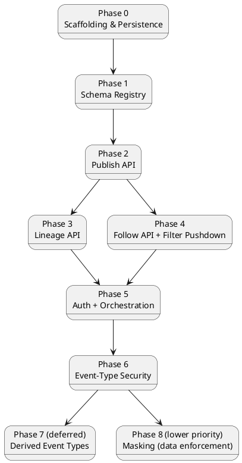

# Build Plan

This sequences the design in `01`–`07` and `features/*.md` into implementation
phases. Each phase lists its scope, what it depends on, and exit criteria
defined in terms of the Gherkin scenarios already written — a phase isn't
"done" by feel, it's done when its feature doc's scenarios pass, on every
database provider the scenario applies to.

Phases 7 and 8 are both out of the critical path, for two different
reasons: Phase 7 per the unresolved open questions in `ADR-007`; Phase 8
purely as a priority call (masking's design is complete, per `ADR-009` —
it's just scheduled after everything else, not blocked on anything).

## Dependency overview

Phases 3 and 4 both depend only on Phase 2, not on each other — they can be
built in either order, or in parallel by two people. Phase 5 fans back in
because it wraps every endpoint built in 1–4, so it can't meaningfully start
until they all exist. Phase 6 depends on Phase 5 specifically because
`RequiredPublishClaim`/`RequiredReadClaim` enforcement needs the caller's
JWT claims to already be populated — there's nothing to check against
before JWT bearer auth exists (`ADR-008`). Phases 7 and 8 both depend on
Phase 6, not on each other — like 3/4, they're independent and can run in
either order once the primary system (0–6) is stable. Phase 8 also has a
real, non-transitive dependency on Phase 4 specifically (the shared
`x-masking` node-finding helper introduced there) — already guaranteed by
the diagram's ordering (4 → 5 → 6 → 8), just called out explicitly since
it's a genuine content dependency, not only a scheduling one.

## Phase 0 — Scaffolding & persistence

**Scope**: the project layout in `06-solution-structure.md`
(`EventStore.Domain`, `EventStore.Persistence`, the three
`*.Migrations.<Provider>` projects, `EventStore.Host.Core`, and the three
`EventStore.Host.<Provider>` deployables per `ADR-001`). Build the **full**
`EventStoreContext` model now — `EventTypeDefinition`, `FilterableField`,
`StoredEvent`, `EventParent` — even though most of it isn't used until later
phases. Laying down one coherent schema up front avoids a second wave of
migrations once Phases 1–3 start using tables that Phase 0 didn't create.
`EventStore.AppHost`/`EventStore.ServiceDefaults`/`EventStore.DevIdp` are
**not** part of this phase — see Phase 5.

**Depends on**: nothing.

**Exit criteria**:
- Solution builds; an initial migration exists and applies cleanly on
  SQLite, PostgreSQL, and SQL Server.
- `EventStore.IntegrationTests` runs one trivial round-trip test (insert +
  read back a `StoredEvent`) against all three providers (Testcontainers for
  Postgres/SQL Server, file-based SQLite) — this harness stays live for
  every phase after this one, it is not a one-time setup task.

## Phase 1 — Schema Registry

**Scope**: `PUT`/`GET /registry/{event-type}` per
`05-schema-registry-and-spec-generation.md` and
[`features/schema-registry.md`](features/schema-registry.md): structural
JSON Schema validation, `FilterableField` path validation against the
schema, versioning (`IsActive` flip, no mutation of prior versions),
`ParentValidationMode` accepted and validated as an enum on the request.
Per-provider index/computed-column migrations for `IsIndexed = true` fields
(`04-odata-filter-pushdown.md`) are built here too, even though nothing
queries through them until Phase 4. **`x-masking` structural validation**
also belongs here: reject `strategy` other than `"FixedValue"`, reject
placement directly on an `object`-/`array`-typed property, validate
`requiredClaim`'s `"type:value"` format and that
`regulatoryClassification`/`governanceBody`/`regulationReference` are
non-empty strings if present (`ADR-009`) — this is pure data validation on
the registration payload with no claims involved, so it doesn't wait for
Phase 6/8 the way enforcement does, and Phase 4's `MaskingSchemaTransformer`
needs to be able to assume any `x-masking` it encounters is already
well-formed.

Not in scope yet: `ParentValidationMode` is stored but not *enforced*
(that's `ParentLinkService`, Phase 2); `registry:admin` scope is not
enforced (that's Phase 5) — accept requests unauthenticated for now.
`RequiredPublishClaim`/`RequiredReadClaim` (`ADR-008`) are likewise accepted
and validated for format (a well-formed `"type:value"` string) but not
enforced — that needs JWT claims to exist first, so enforcement is Phase 6.
`x-masking`'s *validation* is this phase's job (above); its *enforcement*
(`IPayloadMasker`) is still Phase 8.

**Depends on**: Phase 0.

**Exit criteria**: every scenario in
[`features/schema-registry.md`](features/schema-registry.md) passes, on all
three providers, including the index/computed-column verification; plus
the two registration-rejection scenarios in
[`features/masking.md`](features/masking.md) ("x-masking directly on an
object-typed property is rejected" and "a masking strategy other than
FixedValue is rejected") and the "regulatory metadata fields are optional"
scenario there — the rest of that doc's scenarios (actual masking/wrapping
behavior) belong to Phases 4 and 8, not this one.

## Phase 2 — Publish API

**Scope**: `POST /publish/{event-type}` per `03-api-contracts.md` and
[`features/publish-event.md`](features/publish-event.md): the `{ payload,
parentEventIds?, eventId? }` envelope, `SchemaValidationService` against
the active version, `ParentLinkService` enforcing `ParentValidationMode`
(`Strict`/`Permissive`, per [`features/event-chains.md`](features/event-chains.md)),
the `eventId`/`PayloadHash` idempotency short-circuit (`ADR-011`,
including the concurrent-retry race handled at the unique-constraint
level — `06-solution-structure.md`), `EventAppender` writing `StoredEvent`
+ `EventParents` in one transaction. Generate and expose `/openapi.json`
now that the publish contract exists
(`ADR-002`): `EventSchemaConverter` (parses registered `JsonSchema` text
into the shared `Microsoft.OpenApi` `OpenApiSchema`) and
`OpenApiDocumentBuilder` (native `Microsoft.OpenApi` document + writer),
`IMemoryCache`-backed per `ADR-002`.

Lineage is built here, not deferred — only the derived-event-types idea
(`ADR-007`) is deferred, not `EventParents` (`ADR-005`, already Accepted).

**Depends on**: Phase 1 (needs a registered schema to validate against).

**Exit criteria**: every scenario in
[`features/publish-event.md`](features/publish-event.md) and the
publish-side scenarios in
[`features/event-chains.md`](features/event-chains.md) pass on all three
providers, including: retrying with the same `eventId` and identical
content replays the original response with no new write; retrying with
the same `eventId` and different content is `409`; omitting `eventId`
behaves exactly as before `ADR-011`. `/openapi.json` includes
`/publish/{event-type}` with the envelope shape (including `eventId`),
served anonymously, cache-invalidated on the next registration.

## Phase 3 — Lineage API (read side)

**Scope**: `GET /events/{id}/parents|children|ancestors|descendants` per
`03-api-contracts.md` and
[`features/event-chains.md`](features/event-chains.md): `EventParentReader`
(plain LINQ join) for direct parents/children, `IEventLineageQueryProvider`
(provider-specific recursive CTE) + `CycleGuard` for ancestors/descendants.

**Depends on**: Phase 2 (needs published events with parent links to
traverse).

**Exit criteria**: the lineage-query and cycle-safety scenarios in
[`features/event-chains.md`](features/event-chains.md) pass on all three
providers — specifically including the scenario where a cycle exists across
two `Permissive`-mode events and traversal still terminates, returning each
node exactly once.

## Phase 4 — Follow API + filter pushdown

**Scope**: `GET /follow/{event-type}?$filter=...&mode=tail|replay` per
`03-api-contracts.md`, [`features/follow-subscribe.md`](features/follow-subscribe.md),
and [`features/filter-pushdown.md`](features/filter-pushdown.md):
`ODataFilterParser`, validation against declared `FilterableFields`,
`PredicateTranslator` + `IJsonPathTranslator` per provider, the
`EventTailReader` polling loop, the `mode`/`fromSequenceNumber`
cursor-initialization logic (`ADR-010`, `06-solution-structure.md`), SSE
responses carrying the envelope headers (`eventId`, `sequenceNumber`,
`occurredAt`, `parentEventIds`). Generate and
expose `/asyncapi.json` now that the follow contract exists:
`AsyncApiDocumentBuilder` (hand-built JSON envelope around the same shared
`OpenApiSchema` from `EventSchemaConverter`) **and**
`MaskingSchemaTransformer` — even though masking's runtime enforcement
(`IPayloadMasker`) doesn't land until Phase 8, the schema-level `x-masking`
→ `oneOf[value,masked]` wrapper is claims-independent and must exist now so
`/asyncapi.json` never documents a maskable property's bare, unwrapped type
(`ADR-002`, `ADR-009`).

**Depends on**: Phase 2 (needs published events to tail). Independent of
Phase 3 — can be built before, after, or alongside it.

**Exit criteria**: every scenario in
[`features/follow-subscribe.md`](features/follow-subscribe.md) and
[`features/filter-pushdown.md`](features/filter-pushdown.md) passes on all
three providers, including the scenario outline that runs the same query
identically across SQLite/Postgres/SQL Server, and the 400-before-any-SQL
rejection for an undeclared filter field; `/asyncapi.json` includes the
follow channel, served anonymously, cache-invalidated on the next
registration; a maskable property (registered ahead of Phase 8) already
appears wrapped as `oneOf[value,masked]` in the generated document, even
though every event still streams it unconditionally as `{"value": ...}`
until Phase 8's enforcement lands (`features/masking.md`); `mode=replay`
delivers matching history then tails with no gap or duplicate,
`fromSequenceNumber` correctly bounds where replay starts, and supplying
`fromSequenceNumber` with `mode=tail` (or the default) is rejected `400`.

## Phase 5 — Auth (OIDC/OpenIddict) + orchestration

**Scope**: per `ADR-006` and [`features/auth.md`](features/auth.md) — JWT
bearer middleware and the four scope policies (`events:publish`,
`events:follow`, `events:lineage:read`, `registry:admin`) layered onto
every endpoint built in Phases 1–4; the custom `ScopeRequirement` handler
(space-delimited `scope` claim, not a bare `RequireClaim`); the new
`EventStore.DevIdp` project (OpenIddict, EF Core InMemory store, three
clients pre-seeded in code by `DevIdpSeeder`); `EventStore.AppHost` (Aspire)
wiring whichever single `EventStore.Host.<Provider>` it targets (`ADR-001`)
+ that provider's database container + `EventStore.DevIdp` (a project
resource, not a third-party container); the `docker-compose.yml` fallback
(two ordinary app images, no external IdP image); the
browser-`EventSource` `access_token` query-string path on Follow.

**Depends on**: Phases 1–4 (there is nothing to authorize before they
exist).

**Exit criteria**: every scenario in
[`features/auth.md`](features/auth.md) passes — 401/403/201 paths, public
spec documents staying anonymous, the SSE `access_token` path; `aspire run`
and `docker-compose up` each produce a working dev stack from a clean
checkout with zero manual setup (no admin console exists to configure in
the first place — the seed is code, verified via a token request).
`ADR-006` is already Accepted (confirmed) — this phase is where it gets
verified end-to-end, not where it gets decided.

## Phase 6 — Event-type security (required claims)

**Scope**: per `ADR-008` and
[`features/event-security.md`](features/event-security.md):
`RequiredPublishClaim` enforcement in `PublishEndpoint`;
`RequiredReadClaim` enforcement in `FollowEndpoint` (once, at connect time,
for its own event type — plus per-parent filtering of the
`parentEventIds` envelope header, see below); `LineageEndpoint`'s two-tier
check per "you can only see what you can see" — pass/fail `403` for the
root `{eventId}`'s own type, then an independent per-node check for every
*other* type the traversal discovers, turning a failure there into a
`restricted: true` stub rather than failing the request (the recursive CTE
from Phase 3 needs updating to stop expanding through a restricted node,
not just redact it in the output — see `06-solution-structure.md`). Both
claim checks run as plain application code after the relevant
`EventTypeDefinition` is loaded, not as a static `AddPolicy` — see
`06-solution-structure.md` for why.

Masking (`ADR-009`) is **not** part of this phase despite sharing the same
`RequiredReadClaim` machinery — see Phase 8. It's a deliberate priority
call, not a technical dependency that had to be split out.

**Depends on**: Phase 5 (needs JWT claims to already be populated — there
is nothing to check against before bearer auth exists).

**Exit criteria**: every scenario in
[`features/event-security.md`](features/event-security.md) and the new
scenarios in [`features/follow-subscribe.md`](features/follow-subscribe.md)
pass, including: publish vs. read claims enforced independently for the
same event type; a lineage query on a **restricted root** rejected
entirely (`403`); a lineage query on a **visible root** still succeeding
(`200`) with a `restricted: true` stub for any discovered node the caller
can't see, while every other node — including ones reachable only through
a different, visible path — returns normally; the `403`-vs-`404`
distinction (root restricted-but-existing vs. truly unknown) holding for
all four Lineage endpoints; and a restricted parent's ID omitted from
Follow's `parentEventIds` envelope header without blocking the event
itself from streaming.

## Phase 7 (deferred) — Derived/materialized event types

**Scope**: per `ADR-007` — not started until Phases 0–6 are complete and
stable. `POST /create/{event-type}?$from=...&$on=...&$select=...`, schema
auto-composition from the projection, the per-derived-type configurable
join-trigger (fire-once vs. continuous enrichment) and configurable
backfill-vs-from-now, and the background derivation worker (an internal
`EventTailReader` consumer that republishes through the same Phase 2
publish path). Derived events record their sources via `parentEventIds` —
reusing Phase 2/3's lineage mechanism with no schema change, per `ADR-007`'s
own consequences.

**Depends on**: Phase 6. Explicitly out of the primary build's critical
path — see `ADR-007` for the open questions (unbounded pending-join state,
n-ary `$select`, backfill over a derived source) still unresolved before
this can be scoped into its own phase plan.

## Phase 8 (lower priority) — Property-level masking (data enforcement)

**Scope**: per `ADR-009` and [`features/masking.md`](features/masking.md)
— design-complete, scheduled after Phase 6 purely as a priority call, not
because anything is unresolved (contrast with Phase 7). This is only the
**data** half — `x-masking` structural validation moved to Phase 1 and the
**schema** half (`MaskingSchemaTransformer`) moved to Phase 4, since
neither needs claims (see those phases). What's left here: the
`IPayloadMasker` pure `(schema, data, hasClaim) -> data` transform
(`06-solution-structure.md`) wired into `FollowEndpoint`'s per-event
pipeline; the per-connection masked-node set computed once at connect time
alongside `RequiredReadClaim`; the recursive wrapping rule through array
`items` (scalar: wrap each element; complex object: wrap only the masked
properties within each element) applied to actual payload *data*, reusing
the same node-finding helper `MaskingSchemaTransformer` already
established in Phase 4.

**Depends on**: Phase 6 (reuses its claim-checking primitive and the
connect-time check already happening for `RequiredReadClaim`) and Phase 4
(the shared node-finding helper). Independent of Phase 7 — neither depends
on the other.

**Exit criteria**: every scenario in
[`features/masking.md`](features/masking.md) passes: registration rejecting
`x-masking` on a non-scalar node (other than array items); a follower
without the field-specific claim receiving `{"masked": "***"}` while one
with the claim receives `{"value": <real value>}`, on the same connection,
same event type; the wrapper applied correctly to a scalar array (each
element wrapped) and to an array of complex objects (only the masked
properties within each element wrapped, the rest of each object untouched);
and a legitimately-absent field staying absent rather than gaining a
wrapper. A future richer-masking-strategies pass (`ADR-009`'s "Future:
definable masking strategies" proposal — `PartialReveal`/`Hash`, whole-
object/array masking) is not scheduled as part of this phase or any other
yet.

## Cross-cutting, every phase

- **Integration tests against all three providers** run from Phase 0
  onward — they are not a Phase 7-style afterthought. A phase that only
  passes on one provider isn't done.
- **Keep ADR status current** as phases land: `ADR-001` through `ADR-006`
  and `ADR-010` are already Accepted (confirmed design decisions) — Phase 5
  is where `ADR-006` gets verified end-to-end, not where it gets decided.
  `ADR-008` and `ADR-009` are already Accepted (design decisions
  confirmed) but neither's enforcement is real until its own phase lands
  (`ADR-008` → Phase 6, `ADR-009` → Phase 8); `ADR-007` stays Deferred
  until scheduled; `ADR-009`'s "Future: definable masking strategies"
  proposal stays unscheduled/unnumbered until someone decides to build it.
