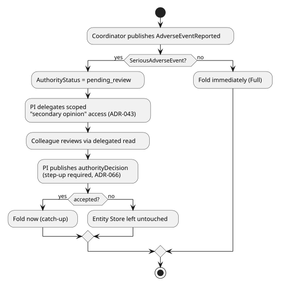
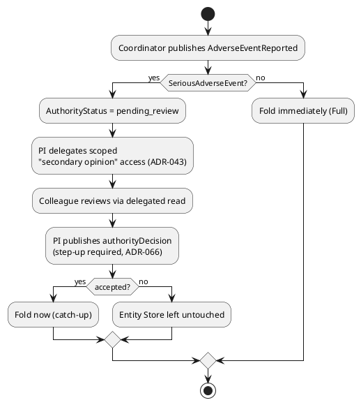

[← Comparisons index](README.md)

# Should user flows/validations/approvals move to a general-purpose DSL, or keep composing this project's existing bespoke mechanisms?

**Raised by:** `docs/10-open-questions.md` row 1 — direct request
("searching for good DSLs to use to define user flows, validations,
approvals and so on"). **Not yet decided** — written for the user to
compare side by side and choose from directly, not to argue toward a
predetermined pick.

**A stated preference that shapes this comparison directly, given this
session**: the user favors UML/BPMN/C4/Markdown+PlantUML+Salt — this
repo's own existing documentation notation — and is indifferent to
Gherkin. That is added below as an explicit evaluation axis ("does this
option's own definition have a real visual notation consistent with how
this repo already documents everything else"), not left implicit.

## The common worked example

Every option below is shown against the **same real scenario**, already
built and documented in this repo — Vitals' Workflow B, "Adverse Event
Capture and Review" (`docs/features/adverse-event-capture-and-review.md`
in `docs/domains/clinical-trials-device-telemetry/`,
`VitalsWorkflowBAdverseEventPlaybookTests`):

1. A site coordinator publishes `AdverseEventReported`.
2. If `SeriousAdverseEvent: true`, the event is captured but not yet
   authoritative (`AuthorityStatus: "pending_review"`, `ADR-035`/`042`).
3. The Principal Investigator delegates a scoped, entity-limited
   "secondary opinion" read to a colleague (`ADR-043`).
4. The colleague reviews the pending finding via that delegated access.
5. The PI publishes an `authorityDecision` (accept/reject) — this
   specific decision requires **step-up authentication** (`ADR-066`,
   RFC 9470) and a `RequiredClaims: "review:ae"` check.
6. Accepted → the Entity Store folds the finding now (catch-up);
   rejected → it stays untouched.

This is genuinely representative of "user flows/validations/approvals"
all at once: conditional branching, a human decision gate, delegated
access, and an authentication-strength requirement on the approval step
itself.

## Evaluation criteria

Beyond the obvious ("does it work"), four axes this project's own
history this session makes concrete, not abstract:

- **Visual notation consistent with this repo's own conventions**
  (direct preference, stated above) — can the flow itself be read as a
  diagram (BPMN, a UML activity/state diagram, PlantUML), or does it
  only exist as code/JSON with no diagrammatic form at all?
- **Textual *and* genuinely diff-friendly in source control** (direct
  preference, stated explicitly: "something textual instead of binary
  so it versions and diffs easier... that's one reason I really like
  PlantUML") — this is a **separate** question from "has a visual
  notation at all." A format can be textual and still diff badly: real,
  verified, not assumed — BPMN 2.0's own XML Schema embeds Diagram
  Interchange (`BPMNDI`: shape bounds, waypoints, coordinates) in the
  *same file* as the logical process model, and this is a well-known,
  documented pain point independent of this project — one real,
  verified account found a single name-attribute change (`"yes"` →
  `"Yes"`) producing a 257-line diff (82 removed/86 added) purely from
  DI noise, serious enough that they built and now run a dedicated
  diff-filtering tool in front of every BPMN review specifically to
  strip that noise back out before comparing
  ([Sonalake — "Smart Tools, Faster Teams: How We Fixed BPMN
  Diffs"](https://sonalake.com/latest/smart-tools-faster-teams-how-we-fixed-bpmn-diffs/) —
  fetched and confirmed as a genuine, serious engineering account, not
  satire; an earlier draft of this citation also listed a bpmn.io post
  that turned out, on the same direct check, to be an April Fools' joke
  with an explicit notice saying so — caught and removed before this
  version, not left in on the strength of a search summary alone).
  PlantUML avoids this by construction: layout is *computed at render
  time*, never stored in the source text, so a hand-written `.puml` file
  never carries GUI-authored position noise to begin with — precisely
  the property this repo's own diagram pipeline
  (`scripts/extract-diagrams.mjs`/`render-diagrams.mjs`, built this same
  session) depends on.
- **.NET-native and embeddable vs. a separate always-on service** — this
  project's own dev/POC orchestration (`ADR-026`) and "no unexamined
  extra infrastructure" stance (this session's own Polly removal is the
  freshest example) both weigh against adding a new server cluster this
  design doesn't already need for an unrelated reason.
- **License/maintenance-fee exposure** — checked directly, not assumed,
  the same lesson this session's own Polly Open Source Maintenance Fee
  finding just taught: a dependency's terms can change under a
  long-lived reference framework, and a downstream adopter inherits
  whatever's chosen here.
- **Fit with this project's own already-established conventions** — this
  repo already represents "known outcome, not exception" as a
  discriminated result everywhere (`PublishResult`, `FollowResult`, …,
  `docs/patterns/known-outcomes-are-not-exceptions.md`); an engine whose
  own idioms fight that convention costs more than one whose don't.
- **Understandable without being a developer** (direct preference,
  stated explicitly) — a genuinely separate question from "has a visual
  notation." BPMN's *diagram* is non-developer-readable, but its `.bpmn`
  *source* (raw XML with embedded DI coordinates) is not something a
  business reviewer would ever open directly — they read the rendered
  picture, produced by a tool, not the text. C# (Options A/C/E) is
  developer-only at the source level regardless of how clean its
  diffs are. PlantUML's own Activity Diagram syntax is unusual among
  all of these: verified directly, PlantUML is explicitly described
  (by its own project and third-party guides alike) as a
  ["diagram-as-code"](https://plantuml.com/) tool whose *source text
  itself* reads close to plain English (`:Coordinator publishes
  AdverseEventReported;`, `if (SeriousAdverseEvent?) then (yes)`) — the
  same file a business reviewer reads *is* the file that renders,
  with nothing lost translating between the two.

## The fork

### Option A — Keep composing bespoke mechanisms (status quo)

The real, already-built mechanism for step 5 above
(`src/EventStore.Inbox/PublishService.cs`):

```csharp
string? acr = null;
if (activeDefinition.RequiredSignature is { } requiredSignature)
{
    acr = StepUpEvaluator.ResolveAcr(user);
    if (!StepUpEvaluator.IsSatisfied(user, requiredSignature, acr))
    {
        logger?.PublishRejected(normalizedName, actorId, "insufficient step-up authentication");
        return new PublishResult.StepUpRequired(requiredSignature.AcrValues, requiredSignature.MaxAge);
    }
    if (string.IsNullOrWhiteSpace(request.Meaning))
        return new PublishResult.MissingSignatureMeaning();
}
```

Steps 2–4 (pending-review capture, delegated secondary-opinion access)
are each their own named, already-built mechanism the same way
(`ADR-035`/`042` for the fold gate, `ADR-043` for the delegation) — the
"flow" is the composition of several single-purpose primitives, not one
engine interpreting one flow definition.

| | |
|---|---|
| **Pros** | Already built, tested, and running in production-shaped code; zero new dependency, zero new infrastructure, zero new license to track; each primitive (step-up, non-authoritative capture, delegated access) is independently reusable outside any one "flow," and each is a real, standardized mechanism in its own right (RFC 9470, UCAN) rather than a bespoke workflow-engine DSL; fits this project's own discriminated-result convention exactly (`PublishResult.StepUpRequired`, not a thrown exception, matching `docs/patterns/known-outcomes-are-not-exceptions.md`) |
| **Cons** | **No visual notation at all** — the flow above exists only as C# spread across `PublishService`/`PublishEndpoints`/three ADRs; a new reviewer has to read code and prose to reconstruct the sequence (this comparison's own worked-example section had to be written by hand, not generated from a flow definition). Every new flow-shaped requirement needs its own new primitive and its own ADR — there is no single place "the flow" lives as one artifact, and no runtime flow-history/audit view beyond the Event Log itself (which does record everything, just not as a flow-shaped view) |

### Option B — Elsa Workflows (.NET-native, embeddable)

**Actually built and run end to end** (`spikes/user-flow-dsl/ElsaSpike/`,
see its own README for the full account) — this section's own code
below is corrected to match, not the originally-quoted docs page. That
first quote came from `docs.elsaworkflows.io`'s "Blocking Activities &
Triggers" page and turned out, once actually installed and run, to be
**stale against the real, currently-installable package** (`Elsa`
3.7.1, via `dotnet add package Elsa` — not confirmed as the "v4" version
this doc's own Cons row below still separately flags): the real
`CreateBookmarkArgs` has no `Payload` property (it's `Stimulus`), and
`ActivityExecutionContext` has no `GetWorkflowInput<T>()`/`SetResult()`.
Corrected here after verifying directly against the installed assembly,
the same standard this project applies to every other citation:

```csharp
// Pausing: a blocking activity creates a bookmark and returns control.
// Writes into a workflow-level Variable<bool>, not the activity's own
// Output<bool> -- found only by actually resuming a real bookmark: an
// Output-based reference between two activities throws
// InputEvaluationException ("Could not find a descriptor for
// expression type \"Output\"") after a real state round trip; a
// Variable<T> (Elsa's own designed-for-persistence storage) doesn't.
public sealed class WaitForAuthorityDecisionActivity(Variable<bool> acceptedVariable) : Activity
{
    protected override void Execute(ActivityExecutionContext context)
    {
        context.CreateBookmark(new CreateBookmarkArgs
        {
            BookmarkName = "WaitForAuthorityDecision",
            Callback = OnResumeAsync,
        });
    }

    private async ValueTask OnResumeAsync(ActivityExecutionContext context)
    {
        var accepted = context.WorkflowInput.TryGetValue("accepted", out var value) && value is true;
        context.Set(acceptedVariable, accepted);
        await context.CompleteActivityAsync();
    }
}

// Resuming: found only by actually running this, not assumed --
// RunAsync(workflow, workflowState, options) alone does NOT resume from
// the paused activity; it silently re-executes the ENTIRE workflow from
// the start, with no error at all. options.BookmarkId must be set
// explicitly, naming exactly which bookmark to continue from.
var bookmarkId = firstRun.WorkflowState.Bookmarks.Single().Id;
await runner.RunAsync(firstRun.Workflow, firstRun.WorkflowState, new RunWorkflowOptions
{
    BookmarkId = bookmarkId,
    Input = new Dictionary<string, object> { ["accepted"] = accepted },
});
```

| | |
|---|---|
| **Pros** | **.NET-native, embeds directly in-process** — no separate server, matching `ADR-026`'s own "no unexamined extra infrastructure" posture exactly; the bookmark/resume shape maps cleanly onto this scenario's own "capture now, decide later" split; a real Blazor designer UI ships with it for authoring/inspecting flows |
| **Cons** | **BPMN support is version-gated and easy to overclaim** — verified directly rather than assumed: Elsa 3's own designer supports only Flowchart activities (real BPMN 2.0 import/export was explicitly deferred to "a separate module, priority not yet determined"); genuine BPMN 2.0 import/export is a claimed **Elsa v4** feature specifically, but the actual, currently-installable NuGet package (`dotnet add package Elsa`) resolves to **3.7.1** — v4's BPMN claim is not confirmed against anything actually installable this pass. **Its visual designer has the same class of diff problem as BPMN's** — verified, not assumed: Elsa's own JSON workflow-definition format stores designer position/size metadata inline alongside the actual logic. A code-first (fluent C#/`WorkflowBase`) definition sidesteps that — diffs like ordinary code — but then carries no visual diagram of its own at all, the same trade-off as Option C below. **Real, substantial integration friction found only by actually building and running this scenario end to end** (`spikes/user-flow-dsl/ElsaSpike/`, its own README has the full account) — worse than either this comparison's own research or Elsa's own official docs suggested: the docs page originally quoted here turned out stale against the installed 3.7.1 API; `Input<T>` lives in a different namespace than the core activity types with no obvious signal why; resuming without explicitly setting `RunWorkflowOptions.BookmarkId` doesn't error, it **silently re-executes the entire workflow from the start**; and passing a resumed decision through an activity's own `Output<T>` (rather than a workflow `Variable<T>`) fails only after a real bookmark/resume round trip, with an unhelpful `InputEvaluationException`. All fixable once known — but "once known" took real, hands-on debugging none of the research alone surfaced. Its own idiom (throw-or-bookmark, `CreateBookmarkArgs`/callback) is also a different shape from this project's own discriminated-result convention, not a drop-in fit |

### Option C — Temporal (durable execution platform)

Real Temporal .NET SDK Signal-based approval:

```csharp
[Workflow]
public class AdverseEventReviewWorkflow
{
    private bool decisionReceived;
    private bool approved;

    [WorkflowRun]
    public async Task<string> RunAsync()
    {
        await Workflow.WaitConditionAsync(() => decisionReceived);
        return approved ? "Approved" : "Rejected";
    }

    [WorkflowSignal]
    public async Task ReceiveDecisionAsync(bool isApproved)
    {
        approved = isApproved;
        decisionReceived = true;
    }
}

// Client side -- the PI's authorityDecision publish becomes this call:
await workflowHandle.SignalAsync(wf => wf.ReceiveDecisionAsync(isApproved: true));
```

**Actually built and run end to end** (`spikes/user-flow-dsl/
TemporalSpike/`, its own README has the full account) — the full eight
actions as real `[Activity]`-attributed methods (Temporal's own
designated place for side effects; nothing runs directly inside
workflow code), a `[Workflow]` class with the branching logic above, and
`Temporalio.Testing.WorkflowEnvironment.StartLocalAsync()` running a
real, current Temporal Server as a local subprocess with **no manual
Docker/cluster setup at all** — it lazily downloads the actual server
binary on first use and tears it down on disposal. All three scenarios
pass, including a genuine signal-based pause/resume round trip (not
simulated) for the two `SeriousAdverseEvent` cases. **Every real API
guess compiled and ran correctly on the first try** — no reflection
probing against the installed assembly was needed here, unlike Option B
(Elsa) and Option E (the DMN engine) in this same document, a real,
worth-naming data point in this SDK's favor. The dev server's own
startup logs did print a few `ERROR`-level "shard status unknown" lines
during its first few hundred milliseconds of shard initialization —
transient startup noise, not a real failure; the workflow completed
correctly regardless, but worth flagging per this project's own "no
false Error-level noise" convention if this were ever run inside a
long-lived service rather than a short-lived spike process.

| | |
|---|---|
| **Pros** | Genuinely durable execution — a workflow survives a process crash mid-wait with no extra code, which this project's own hand-rolled mechanisms don't get for free; real, current .NET SDK, and — confirmed now, not assumed — a notably *smoother* real integration experience than Option B's Elsa spike needed, with the installed package's real API matching its own documented shape exactly; signals map cleanly onto "an external decision arrives later," durably, across a real dev-server process boundary, not just an in-memory await |
| **Cons** | **A separate, always-on server cluster in production** (the Temporal Server + a persistence store of its own) — the heaviest infrastructure addition of every option here, for a project whose own orchestration (`ADR-026`) is deliberately dev/POC-scoped; the embedded dev server this spike uses is a testing/local convenience, not a substitute for that real operational cost. **Zero visual notation** — a workflow is pure C# with no diagrammatic form at all, directly against the stated preference for BPMN/UML/PlantUML-style visibility; step-up authentication/delegated access (steps 3 and 5) still need to be built as ordinary application code calling into this project's existing `ADR-043`/`ADR-066` mechanisms from inside an Activity — Temporal replaces the "wait for later" shape, not the security/delegation primitives underneath it |

### Option D — Camunda 8 / Zeebe (real BPMN 2.0 engine)

Real Zeebe C# job-worker code:

```csharp
var client = ZeebeClient.Builder()
    .UseGatewayAddress("0.0.0.0:26500")
    .UsePlainText()
    .Build();

client.NewWorker()
    .JobType("authority-decision")
    .Handler(HandleAuthorityDecision)
    .MaxJobsActive(5)
    .Open();

private static void HandleAuthorityDecision(IJobClient jobClient, IJob job)
{
    var approved = EvaluateDecision(job); // calls this project's own step-up/claims checks
    jobClient.NewCompleteJobCommand(job.Key)
        .Variables(approved ? "{\"decision\":\"approved\"}" : "{\"decision\":\"rejected\"}")
        .Send().GetAwaiter().GetResult();
}
```

**Actually built and run end to end** (`spikes/user-flow-dsl/
ZeebeSpike/`, its own README has the full account), against a real,
standalone `camunda/zeebe:8.8.0` broker in Docker (not the deprecated-
successor `camunda/camunda` unified image) — a real `.bpmn` file with
the full eight-step branching shape, a `bpmn:message`/
`intermediateCatchEvent` pair for the "wait for the PI's real decision"
step, and FEEL `conditionExpression`s on the exclusive gateways for both
branch points. All three scenarios pass, including a genuine message-
correlation pause/resume round trip. **This was, by a wide margin, the
most operationally friction-heavy spike in this entire document** — not
because of the BPMN authoring (that went cleanly once two ordinary BPMN
validation rules were satisfied: `xsi:type` must be namespace-qualified
as `bpmn:tFormalExpression`, and an exclusive gateway with only one
conditioned outgoing flow needs the other marked `default=` explicitly)
but because of the *broker* itself: 8.8's own unified security model
now defaults to requiring authentication and fine-grained resource
authorizations even for a bare local single-broker container with no
Identity/Keycloak anywhere in the picture, requiring three separate,
individually-discovered environment variables just to reach the
"plaintext, anyone can call it" baseline every other engine in this
document defaults to — `CAMUNDA_DATA_SECONDARY_STORAGE_TYPE=none`
(else it retries against an Elasticsearch that was never started),
`CAMUNDA_SECURITY_AUTHENTICATION_UNPROTECTEDAPI=true`, and
`CAMUNDA_SECURITY_AUTHORIZATIONS_ENABLED=false`. Separately, and more
surprisingly: `zb-client`'s own high-level `NewWorker()...Open()`
builder **never activated a single job**, silently, with no exception
anywhere, across a full container restart and multiple builder-option
combinations tried; a manual `NewActivateJobsCommand`/
`NewCompleteJobCommand` polling loop against the exact same broker
worked immediately and reliably. The spike ships the working manual
loop, not the high-level wrapper — a real, unresolved gap in this
specific client/broker version combination worth treating as a known
risk, not a one-off fluke, since it reproduced identically after a
clean broker restart.

| | |
|---|---|
| **Pros** | **The most genuine BPMN 2.0 fit of any option here** — the flow above is authored as a real `.bpmn` file in Camunda Modeler (the reference visual BPMN tool), directly matching the stated UML/BPMN/C4 preference: a reviewer reads the *diagram*, not C#, to understand the flow. BPMN 2.0 is a real OMG standard, not a vendor-specific notation. Message correlation (`bpmn:message` + `intermediateCatchEvent`) is a clean, standard-notation way to express "pause for outside input," genuinely visible in the diagram itself, unlike Option C's signal (invisible in any diagram) |
| **Cons** | **The heaviest operational cost of every option here, now confirmed rather than assumed** — a real, separate Java/Go engine cluster (Zeebe brokers/gateway) to run and operate, well beyond this project's own dev/POC AppHost orchestration scope, and — new finding — a materially heavier *first-run* cost too: three non-obvious environment variables just to reach an unauthenticated baseline, and a high-level client API (`NewWorker`) that silently didn't work at all, discovered only by building and running the real thing, not by reading either project's docs. The C# client is community-maintained (`camunda-community-hub`), not first-party; step-up/delegation still has to be plumbed in as custom job-worker code exactly like Temporal above — Camunda supplies the *visual flow*, not this project's own security mechanisms. **The `.bpmn` file itself diffs badly** — see the "textual and diff-friendly" evaluation criterion above; the same real, documented BPMN-DI-noise problem applies to every `.bpmn` file this tool produces, not a hypothetical edge case |

### Option E — NRules + DMN (rules/decision engines — answers "validations," not "flows/approvals")

Named separately, deliberately: neither of these is a workflow engine —
they answer the **validations** third of the original question, and
would need pairing with A, B, or D above for the flow/approval halves,
not substitute for them.

Real NRules rule + session (`nrules.net`):

```csharp
public class RequiresSecondOpinionRule : Rule
{
    public override void Define()
    {
        AdverseEvent ae = default!;
        When().Match(() => ae, a => a.SeriousAdverseEvent);
        Then().Do(ctx => ae.RequireSecondOpinion());
    }
}

var session = new RuleRepository().Load(x => x.From(typeof(RequiresSecondOpinionRule).Assembly)).Compile().CreateSession();
session.Insert(adverseEvent);
session.Fire();
```

Real DMN decision table shape (`Common.DMN.Engine`, OMG's own DMN
standard):

```csharp
var def = DmnParser.Parse("adverse-event-severity.dmn");
var ctx = DmnExecutionContextFactory.CreateExecutionContext(def);
ctx.WithInputParameter("SeriousAdverseEvent", true);
var result = ctx.ExecuteDecision("RequiresReview");
```

**Actually built and run end to end** (`spikes/user-flow-dsl/NRulesDmnSpike/`,
its own README has the full account), and taken further than this
section's own original sketch above: rather than one standalone rule and
one standalone decision shown in isolation, the spike composes them the
way a real integration would — NRules' RETE engine drives the *whole*
eight-step sequence as eight small forward-chaining rules matched purely
against accumulating facts (no AST, no interpreter loop, unlike every
other option in this document), and DMN is invoked from *inside* one of
those rules (`ClassifyEventRule`, via NRules' own dependency-injection
seam) to make the one genuinely multi-factor decision (severity score
*and* event type both bearing on the outcome) rather than an inline C#
condition. All three scenarios pass. One finding worth calling out on
its own: **NRules' forward-chaining naturally pauses waiting for outside
input, for free** — `session.Fire()` simply runs out of rules whose
preconditions are satisfied once it reaches the step needing the PI's
real decision, with no purpose-built blocking/bookmark API of the kind
Option B's Elsa spike needed to build for the exact same "pause for a
human" requirement. Two real, worth-naming friction points, both from
the DMN engine specifically, neither from NRules: (1) `ExecuteDecision`
is keyed by the DMN `<decision>`'s `name` attribute, not its `id` —
undocumented in the package's own README, found only by running it and
reading the real exception; (2) the DMN engine pulls a stale,
high-severity-CVE `Newtonsoft.Json 12.0.2` transitively (via
`DynamicExpresso.Core`, confirmed via `dotnet list package
--include-transitive`) — a real dependency-hygiene concern this
project's own Polly/OSMF-era license-and-dependency checking habit
exists to catch, flagged here rather than silently accepted.

| | |
|---|---|
| **Pros** | `DMN`'s decision-table notation is itself a real, visual, OMG-standardized diagram (pairs with BPMN specifically — the two specs are designed to compose), matching the stated preference the same way BPMN does; `NRules`' RETE engine handles genuinely complex multi-fact rule interaction this project's own hand-written `if` chains (`JsonSchemaInstanceValidator`) don't attempt. The spike's own finding that a "pause for human input" point falls out of forward-chaining for free, with no dedicated blocking API, is a genuine, unexpected structural advantage over Option B for exactly the shape this scenario needs |
| **Cons** | Neither covers "flows/approvals" at all — this project's own real validation needs (`JsonSchemaInstanceValidator`'s `dependentRequired`/`if`/`then`/`else`, already built and JSON-Schema-standard) already cover single-event structural/conditional validation without a new dependency; a RETE engine's real value (`NRules`) is multi-fact inference across many objects at once, which nothing in this project's current validation needs actually requires yet. Modeling a *sequential* flow as a set of forward-chaining rules matched against accumulating facts is a real inversion of control worth naming honestly — there is no single place that reads top-to-bottom as "the flow"; the sequence only emerges from which facts unlock which rules, a genuinely harder mental model for a non-developer than any diagram-based option here. `net.adamec.lib.common.dmn.engine`'s stale transitive `Newtonsoft.Json` dependency is a real, unresolved supply-chain concern specific to this DMN library choice, separate from NRules itself |

### Option F — Hand-authored PlantUML Activity Diagrams documenting Option A (no new engine at all)

Not a workflow *engine* — a documentation discipline, made explicit as
its own option because it's the only one that satisfies every stated
preference simultaneously. Option A's mechanism is unchanged; every flow
gets a real UML Activity Diagram (one of the four notations named as a
preference directly), hand-written in PlantUML, checked in as `.puml`
source and rendered via this repo's own already-built pipeline
(`scripts/extract-diagrams.mjs`/`render-diagrams.mjs`):





| | |
|---|---|
| **Pros** | Zero new dependency, zero new infrastructure, zero new license to track — the strongest possible answer to every non-visual evaluation criterion above, since nothing about `Option A`'s actual mechanism changes. **Perfect diff behavior by construction** — PlantUML computes layout at render time and never stores it in source, so there is no GUI-position noise to strip, the exact property the "textual and diff-friendly" criterion above is naming. Genuinely UML (Activity Diagram is a real UML 2 diagram type, not a PlantUML-specific invention) — matches the stated preference exactly, using a notation already fluent in this repo. Composes with *any* later decision on A/B/C/D — documenting a flow this way is never wasted work even if an engine is adopted later |
| **Cons** | The diagram is documentation, not an executable artifact — nothing enforces that the `.puml` file stays accurate as the underlying C# changes (the same risk this repo's own feature docs already carry generally, mitigated here the same way: review discipline, not tooling). Doesn't gain a runtime flow-history/audit view, a visual *designer* for building new flows by dragging shapes, or any of the durability guarantees Option C's real engine provides — it documents the flow, it doesn't run it |

### Option G — Make the flow diagram *itself* the executable source (Option F, taken one step further)

Directly answers "if there is a way to use something like PlantUML to
render out the diagrams and such, that would be awesome" and "I could
also do a custom DSL using G4 with ANTLR" — Option F's `.puml` file is
*documentation of* the flow; this option makes a real grammar *drive*
it, via a small, in-house parser/interpreter this project would own. No
off-the-shelf tool does this — verified this pass, not assumed: nothing
found combines "renders via PlantUML specifically" with "is itself
executable" (Gherkin-to-diagram tools exist, but generate diagrams from
*test scenarios*, not from a flow definition, and don't execute the
diagram itself either). This is real new software, not a library
adoption — the one option here that is unambiguously **build**, not
**buy**, named as such rather than dressed up as anything else. Two real
sub-approaches, not one, differing in exactly *how much* is built:

**G1 — parse real PlantUML Activity Diagram syntax directly.** A
**constrained subset** — `start`/`stop`, `:action label;`,
`if (condition?) then (yes) ... else (no) ... endif` — hand-parsed (the
subset is small enough that a full parser generator is arguably
overkill), resolving each `action label`/`condition` string against a
small, explicit registry of already-existing C# delegates (Option A's
own primitives: `StepUpEvaluator.IsSatisfied`, the `ADR-043` delegation
check, …), the same "explicit registration, no reflection scanning"
discipline this project already uses everywhere (`docs/patterns/
composition-root-and-pure-di.md`). Zero translation step to render —
the exact same file that executes is fed straight to PlantUML, because
it already *is* valid PlantUML.

**G2 — a wholly custom grammar, authored as a real ANTLR4 `.g4` file,
parsed via the real ANTLR4 C# runtime** (`Antlr4.Runtime.Standard`,
BSD-3-Clause — fully permissive, no revenue-gate concern of the kind
this session's own Polly/ApexCharts findings specifically taught to
check for; verified directly, not assumed). This buys the genuinely
hard, easy-to-get-subtly-wrong part (lexing/parsing, grammar
ambiguity, error recovery, incremental grammar evolution) from a real,
mature toolchain — the same "buy the infrastructure, keep the domain
semantics your own" reasoning this project already applied adopting
`Polly`+`Simmy` originally and `CEL` for upcast expressions — while the
grammar's own *vocabulary* stays fully custom, not constrained to
PlantUML's existing keyword set (e.g. `WHEN AdverseEventReported IS
SeriousAdverseEvent THEN REQUIRE APPROVAL FROM PrincipalInvestigator`
reads closer to plain English than any activity-diagram keyword ever
will). The trade: since a custom grammar isn't PlantUML source, an
extra code-generation step is needed to *emit* real PlantUML text from
the parsed AST as a companion diagram — genuinely "render out the
diagrams via PlantUML" (the exact ask), just via a generation step
rather than G1's zero-translation identity.

G1's input is the identical `.puml` text already shown under Option F
above, unchanged — the whole point being that nothing needs
translating.

**G1 actually built and run end to end** (`spikes/user-flow-dsl/
PlantUmlNativeSpike/`, its own README has the full account) — a ~150-
line parser/interpreter with zero NuGet dependencies, genuinely parsing
the exact, unmodified `.puml` file above and executing all three real
scenarios (accepted, rejected, non-serious) correctly on the second try.
The one real bug found — a C# `"\n"` string literal is an actual newline
character, not the `.puml` file's own literal two-character `\n`
escape — is real, but categorically smaller than the friction Option B
below turned out to need (a stale doc, a silent-wrong-behavior resume
trap, an `Output`-vs-`Variable` persistence gotcha, none of it visible
without actually building and running a real bookmark/resume round
trip). This is a genuine, measured data point, not just an abstract
"build is riskier than buy" assumption: for this specific scenario, the
"buy" option (Elsa) needed substantially more real debugging than the
"build" option (G1) did.

**G2 also actually built and run end to end** (`spikes/user-flow-dsl/
AntlrCustomDslSpike/`, its own README has the full account) — a real
ANTLR4 `.g4` grammar (`flow`/`step`/`action`/`ifStep`), compiled by the
real ANTLR4 Java tool via the `Antlr4BuildTasks` NuGet package (MIT,
downloads its own JRE, no manual Java/Docker setup needed) into a
Visitor-pattern parser (not Listener), executing the same three
scenarios correctly. Grammar named for the DSL itself
(`UserFlowDsl.g4`), not for the one scenario it's demonstrated with —
the scenario lives in a separate `.flow` instance file, the same
schema/instance split a JSON Schema has to a JSON document. Worked on
the first real run once the grammar was correct, with **no runtime
API-mismatch surprises of the kind Option B's spike hit** — a
hand-written grammar has no upstream library whose documented API can
drift from what's actually installed. The real, worth-naming cost sits
upfront instead: unlike G1 (parses an already-designed notation) or
Option B (adopts an already-built engine), every construct — `if`/
`then`/`else`, string-quoted labels, the token set itself — had to be
designed and implemented by hand. One concrete grammar-design gotcha
worth recording: without labeling the `then`/`else` step lists
separately (`thenSteps+=step+` / `elseSteps+=step+`), ANTLR merges both
branches' steps into one flat, unmarked array in the generated parse
tree — the labels are what make `FlowAstBuilderVisitor` able to tell
the branches apart at all.

| | |
|---|---|
| **Pros** | **The only option that fully satisfies every stated preference at once**: textual, diffs perfectly (identical file, identical reasoning as Option F), non-developer-readable at the *source* level (not just the rendered picture), and renders via PlantUML directly — because it *is* PlantUML, not a lookalike syntax needing its own separate renderer. One file is simultaneously the documentation, the diagram source, and the executable definition — nothing can drift between "what the diagram says" and "what actually runs," the exact failure mode Option F's own Cons section names as its one real risk. (G2 shares the first three of these — textual, diffs perfectly, non-developer-readable — but not the fourth: its source isn't PlantUML itself, so rendering the diagram is a separate generation step, not an identity.) |
| **Cons** | **Real, new, custom-built software** — a parser and an interpreter this project writes and maintains forever, the one option here that's unambiguously build-not-buy, cutting directly against this project's own repeatedly-demonstrated buy-over-build instinct (this session's own Polly removal, `references.md`'s own standing convention). A constrained activity-diagram subset (G1) or custom grammar (G2) can't express everything a full engine can (timers, retries, parallel gateways, durable persistence across a process crash mid-flow — Option C's genuine strength) without the interpreter growing to cover each one; scope creep here is a real, foreseeable risk, not hypothetical. `if (condition?)`'s condition string and `:action;`'s label (G1), or `ifStep`'s quoted condition and `action`'s quoted label (G2), are free text to a human but must resolve to something exact for the interpreter — a typo'd label is a silent no-op or a runtime error depending on how strictly the registry is built, a real design detail to get right, not hand-waved. G2 specifically still owes a code-generation step to emit real PlantUML from its AST (not built this pass) before it actually satisfies "render out the diagrams via PlantUML" the way G1 does by construction |

### Option H — Author clean PlantUML text, compile it to real BPMN XML, execute on a real engine

Directly answers "at least a custom visualizer/markdown builder over
existing files... like an XSLT over BPMN files to PlantUML diagrams" —
checked which direction real prior art actually goes, not assumed: a
converter already exists, but the **opposite** direction from "BPMN to
PlantUML for readability." **PlantBPMN**
([codeberg.org/Some1/PlantBPMN](https://codeberg.org/Some1/PlantBPMN))
converts a PlantUML Activity Diagram **into** a real BPMN 2.0 `.bpmn`
XML file — meaning the actual real prior art points at authoring the
*source* as clean PlantUML text (this option's whole goal) and
*compiling* it to the format a real engine executes, not generating a
read-only diagram from an engine's own native format after the fact.
This would pair PlantUML-as-source (same clean, diff-friendly text as
Options F/G1) with **Option D's real, standards-based BPMN 2.0 engine**
(Zeebe) as the actual runtime — the only option here that gets a real,
external, durable execution engine *and* a clean, non-developer-
readable, perfectly-diffing textual source, at the cost of neither
building a custom interpreter (Option G) nor hand-editing BPMN XML/using
Camunda Modeler directly (Option D as originally scoped).

| | |
|---|---|
| **Pros** | The only option combining a real, standards-based execution engine with a genuinely clean, diff-friendly, non-developer-readable textual source — PlantUML text stays the thing anyone actually reads or edits; BPMN XML becomes a build artifact, the same way a compiled binary is never what a developer reviews by hand |
| **Cons** | `PlantBPMN` is small, single-maintainer, Go-based (introduces a Go toolchain dependency into a .NET-first repo purely for this conversion step) — real, but nowhere near as mature/maintained as `Antlr4.Runtime.Standard` or the engines in Options B/D themselves; not independently verified this pass against this project's own real scenario (whether it round-trips *this* worked example's branching/human-task shape correctly is unconfirmed, not assumed working). Still needs Option D's own full operational cost (a real Zeebe cluster) — this option only changes *how the `.bpmn` file is authored*, not whether one has to be run |

## Recommendation

**Updated after actually building and running both Option G1 and
Option B end to end as a head-to-head shootout** (direct request —
`spikes/user-flow-dsl/`, both spikes' own README has the full account).
The empirical result changes the weight of this recommendation, not
just its theory: G1's one real bug (a C# vs. PlantUML escaping
mismatch) was minor and immediately obvious; Option B needed real,
substantial debugging across five separate issues — including a docs
page that turned out stale against the actually-installed package, and
a resume call that silently re-executes the whole workflow with no
error at all unless one specific option is set correctly. That doesn't
make Option B wrong (it works, correctly, once all five are known,
and it still offers real capabilities — an actual visual designer,
durable persistence — that G1 doesn't), but it does mean this
comparison's own earlier abstract "build is inherently riskier than
buy" framing didn't hold up against what actually happened for this
scenario.

**Do Option F now, unconditionally — it's a no-regrets move regardless
of everything below.** It costs nothing (no dependency, no
infrastructure, no license), it's the only *documentation* format that
fully satisfies "textual and genuinely diff-friendly" (every
visual-designer-backed format — BPMN, Elsa's own designer — fails it,
verified above), and it directly uses a notation already named as a
preference through a pipeline this repo already built and operates. A
hand-written `.puml` Activity Diagram for each flow is never wasted
work, whatever gets decided next.

The real decision is what happens **beyond** documentation — three
genuinely different answers, each honest about its own cost:

1. **Option G (a small, in-house PlantUML-activity-diagram
   interpreter)** is the only option that satisfies *every single
   preference stated this pass* at once — textual, diffs perfectly,
   readable by a non-developer at the source level (not just the
   rendered picture), and renders via PlantUML because it *is*
   PlantUML. It is also the one option here that is unambiguously
   **build, not buy** — real, new, permanently-owned software, cutting
   directly against this project's own repeatedly-demonstrated
   buy-over-build instinct (this session's own Polly removal is the
   freshest example). Right if the "one file is the diagram, the
   documentation, and the execution, nothing can drift between them"
   property is worth building and maintaining a real (if small and
   scope-bounded) interpreter for.
2. **Option D (Camunda 8) or Option B (Elsa v4)** buy a *real, existing*
   engine instead of building one — genuine durable execution
   (Camunda/Zeebe) or a genuine embeddable .NET-native engine (Elsa),
   plus an actual interactive visual *designer* for building new flows
   by hand, which neither Option F nor Option G provide (both are
   authored as text, by someone comfortable writing PlantUML, not
   dragged-and-dropped by an arbitrary non-technical user). The price:
   neither's own definition format diffs as cleanly as PlantUML text
   (verified above — both embed designer-authored layout metadata
   inline with logic), and neither is genuinely readable by a
   non-developer at the *source* level, only via the rendered/designed
   picture. Camunda for the more faithful BPMN fit at real operational
   cost (a separate engine cluster); Elsa v4 for the .NET-native,
   no-new-infrastructure fit (confirm its BPMN 2.0 claim directly
   against the installed version first, not the 3.x line's
   Flowchart-only designer).
3. **Option H (PlantUML text compiled to real BPMN via `PlantBPMN`,
   executed on Camunda 8/Zeebe)** sits deliberately between 1 and 2 —
   real, external, standards-based execution (buying Option D's engine,
   not building one), *and* a genuinely clean, diff-friendly,
   non-developer-readable textual source (the same PlantUML text as
   Options F/G1, not hand-edited BPMN XML). The honest cost: it depends
   on a small, single-maintainer, Go-based converter this pass could
   verify exists but not independently verify actually round-trips this
   project's own real scenario correctly — real prior art, but the
   least battle-tested piece in this whole comparison, worth a genuine
   spike (does `PlantBPMN` actually handle this scenario's branching and
   human-task shape) before leaning on it for real.
4. **Stop at Option F, keep Option A's mechanism exactly as-is.** A
   complete, defensible answer on its own — every primitive Option A
   composes is already a real standard in its own right (RFC 9470,
   UCAN), and Option F closes the one real gap that mechanism had (no
   single diagram a reviewer could read instead of C#). No new
   dependency, no new maintenance burden, ever.

Given how much weight "textual, non-developer-readable, PlantUML-
rendered" carried across this session's own stated preferences, **Options
G and H are the two that actually answer the question as asked** — G
by owning a small interpreter forever (real, bounded, in-house), H by
depending on a real but unproven-for-this-use-case third-party converter
in exchange for a genuine standards-based engine underneath. Both are a
different kind of commitment than adopting B/D as originally scoped or
merely documenting (option F alone). That trade-off, and which of G/H's
two different risk profiles is more acceptable, is real enough that it's
the user's call to make, not argued past here.

`NRules`/`DMN` (Option E) is not really competing with A/B/D/F/G/H — if a
real multi-fact validation need shows up that `JsonSchemaInstanceValidator`
genuinely can't express, it's worth adding *alongside* whichever
flow/approval answer is chosen, not instead of it. If it's ever added,
DMN's own decision-table XML carries the identical diff-noise
consideration as BPMN's — worth checking directly against whatever DMN
authoring tool is actually used, not assumed clean by association with
"it's XML, like everything else here."
