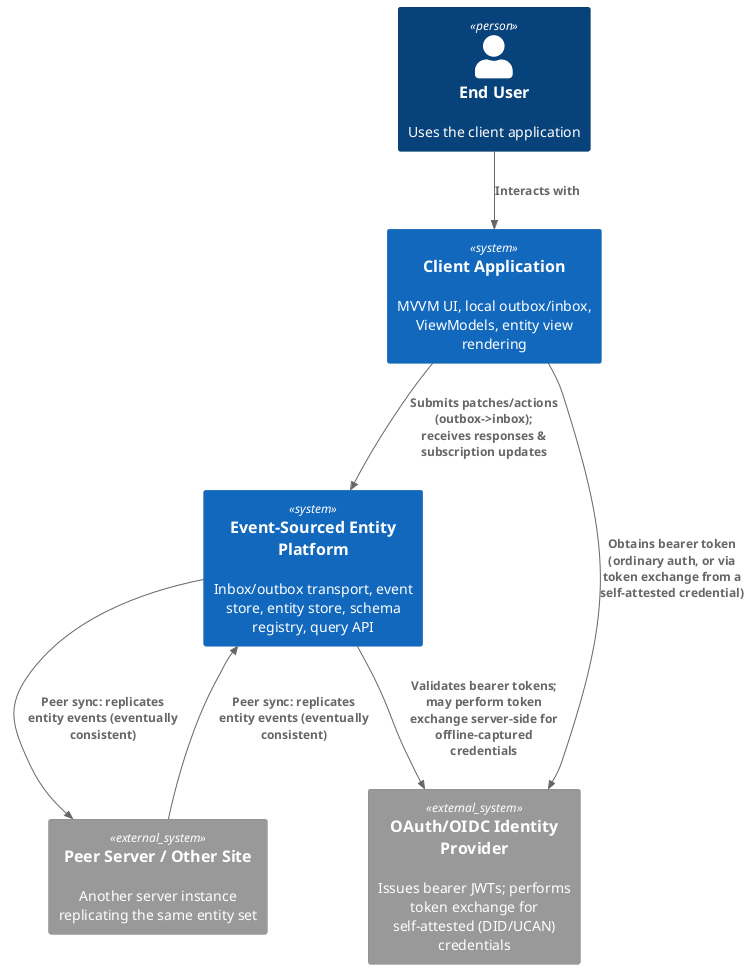
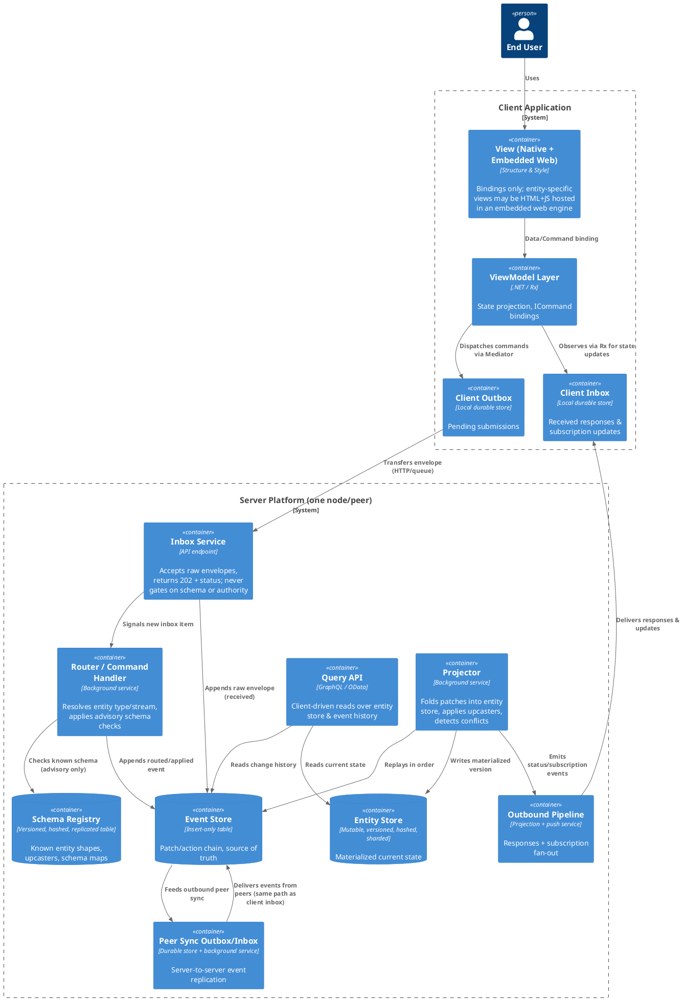

# 02 — Architecture Context

See 01 for terminology and governing philosophy.

## 2.1 System Context

## 2.2 Container View

## 2.3 Design Reading Guide

- **04** expands the Inbox Service / Router / Outbound Pipeline containers above.
- **05** defines the Event Store / Entity Store / Schema Registry table shapes.
- **09** expands the Peer Sync container and multi-server topology.
- **10** expands the Query API container.
- **12** adds identity/attestation concerns to the Inbox Service.

No container in this diagram is permitted to synchronously block on another remote
container's availability or agreement before making local progress — see 01 §1.2.
