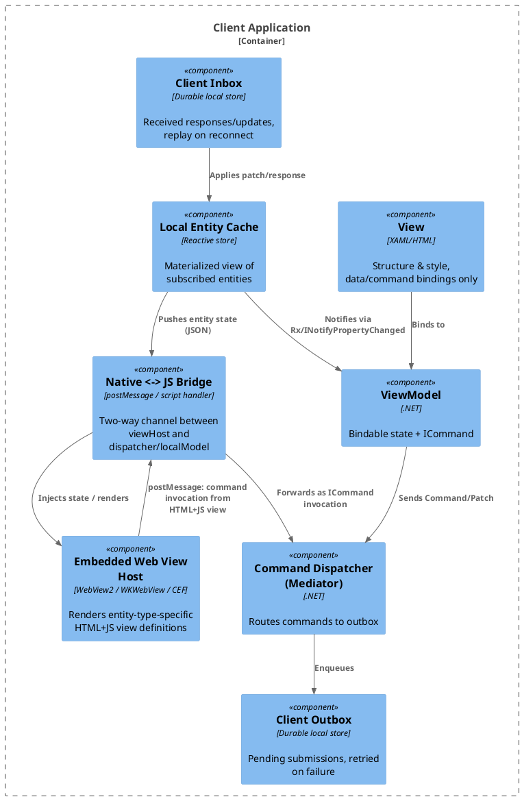

# 03 — Client Architecture (MVVM)

## 3.1 Layering

- **View**: structure + style only (XAML/HTML templates, ResourceDictionaries). No logic.
- **ViewModel**: exposes bindable properties and `ICommand`s (`RelayCommand`/`DelegateCommand`). ViewModels never mutate local state directly — commands are dispatched through a `Mediator`/`ICommandDispatcher` into the client outbox. The "real" state change only happens once the corresponding event/patch round-trips back through the entity store and into the client inbox.
- **Model**: the client's local materialized entity store — a reactive cache kept in sync via the client inbox (subscription updates), exposed to ViewModels through observables (`INotifyPropertyChanged` + Rx).



## 3.2 Entity View Definitions (HTML+JS)

Rather than requiring a native view per entity type, entity types may declare a **view
definition** — HTML+JS rendered inside an embedded web engine (WebView2 on Windows,
WKWebView on macOS/iOS, CEF elsewhere, or a real browser for web clients). This lets a
single rendering implementation work across desktop, mobile, and web without N native
implementations, and lets presentation evolve independently of client app deployment.

### 3.2.1 View Definition Registry (table shape)

Same content-addressed, versioned, hashed pattern used for the Schema Registry (05 §5.3) and Schema Map (07 §7.3):

| Column | Notes |
|---|---|
| `EntityType` | Composite key with `Version` |
| `Version` | Monotonic per `EntityType` |
| `ViewKind` | `list` \| `detail` \| `edit` \| custom — multiple views per type, independently versioned |
| `CompatibleSchemaVersions` | Declares which schema version(s) this view is written against |
| `TemplateContent` | Raw HTML+JS |
| `Hash` | Hash of canonicalized `TemplateContent`, for integrity/drift detection |
| `EffectiveFrom` / `DeprecatedAt` | Same lifecycle discipline as schema versions |

### 3.2.2 Native/Web Bridge Contract

- **Data in**: ViewModel serializes current entity state (already JSON-shaped, since the entity store is JSON — 05 §5.2) and injects/postMessages it into the web view. Because the platform already emits `Optional<T>`-aware partial updates (06), the web view can be treated as just another subscriber and receive incremental updates the same way the entity store does.
- **Commands out**: the HTML+JS view calls back into native via the bridge (`window.chrome.webview.postMessage` / `WKScriptMessageHandler` / CEF JS binding). That message maps directly onto the existing `Command Dispatcher`, so a button click in the HTML view produces the exact same `ICommand`-shaped action as a native control would — actions flow through the same event path regardless of UI origin.
- **Sandboxing**: view definitions are versioned data, potentially updated independently of app deployment — treat them as untrusted-ish content: CSP headers, no arbitrary native API surface exposed beyond the bridge, sanitize/validate before rendering if authorship is ever opened beyond the core team.

### 3.2.3 Fallback and Tolerance

Consistent with the platform's overall tolerant-reader posture (11):

- **No view definition for an entity type/version** → render a generic property-list view (native, not web-based) rather than failing to display the entity at all.
- **Properties present that no field in the view template accounts for** (e.g., landed in the entity's `extensions` bag — 07/10) → the view renders known fields normally and either ignores or generically lists the unknown/extension properties. It never fails to render the whole entity because one property arrived from a schema version it hasn't seen yet.
- **Authority/conflict indicators** (08, 12) — views should be able to render a visual indicator for `ConflictFlag` or `AuthorityStatus: unattested/pending_review`, reusing one generic "flag" rendering convention rather than a bespoke one per concern.

### 3.2.4 Sample Wireframes (Salt)

```salt
@startsalt
{
  Entity Detail View
  ==
  Correlation ID: | "018f2a1e-..." | { Status: Applied }
  --
  First Name | "Jane"
  Last Name  | "Smith" ^conflict flag
  --
  { Change History } | { Subscribe } | { Refresh }
}
@endsalt
```

```salt
@startsalt
{+
  {T
   + Field | Value | Last Changed | Origin
   Last Name | Smith | 2026-07-29T14:32Z | ClientB
   Last Name | Jones | 2026-07-29T14:32Z | ClientA ^conflict
   First Name | Jane | 2026-07-28T09:10Z | ClientA
  }
  [Close]
}
@endsalt
```

```salt
@startsalt
{
  Widget (unattested capture)
  ==
  ! Unverified — pending authority review
  --
  Field | Value
  Serial | "SN-88213"
  Location | "Site 4, Bay B"
  Extensions | { type, notes, ... } (unknown to current schema)
  --
  [ Mark Reviewed ] | [ Reject ]
}
@endsalt
```

## 3.3 Caching and Offline

- View definitions should be cached client-side, mirroring the local entity cache, so rendering doesn't require a network round trip every time an entity is opened.
- The client outbox/inbox pair (3.1) already assumes disconnected operation is normal, not exceptional — view rendering should follow the same assumption: render from last-known-good cached view + cached entity data when offline, and apply queued updates once connectivity resumes.

## 3.4 Open Items Specific to Client Architecture

- One view per entity type, or multiple views per type (list/detail/edit) — resolved above as multiple, independently versioned (`ViewKind`), but worth confirming against actual UX needs.
- Template engine choice: raw HTML+JS with a small injected binding runtime (simplest, chosen here) vs. a lightweight templating syntax compiled client-side (more structure, more moving parts).
