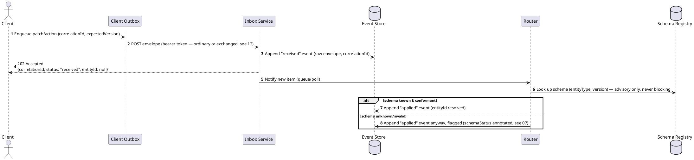
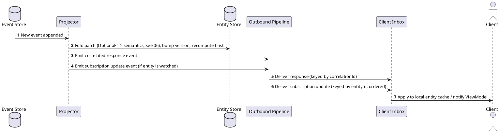

# 04 — Inbound & Outbound Pipelines

## 4.1 Inbound Pipeline

Client outbox items are transferred to the server inbox as a pure transport handoff —
no domain logic, no routing, no validation, no authority check occurs at this step
(see 01 §1.2, 07, 12). The same pattern is reused for server-to-server peer sync (09).



### 4.1.1 Status Envelope

```json
{
  "correlationId": "018f2a1e-...",
  "status": "received",
  "entityId": null,
  "schemaStatus": null,
  "authorityStatus": "unattested",
  "reason": null,
  "timestamp": "2026-07-29T14:32:00Z"
}
```

**Status values**

| Status | Terminal? | Meaning |
|---|---|---|
| `received` | No | Persisted to inbox/event store, not yet routed |
| `processing` | No | Picked up by router, in flight (optional — only if meaningfully slow) |
| `applied` | Yes | Routed, folded into entity store, `entityId` populated |
| `rejected` | Yes | Transport/structurally unusable (not the same as schema-invalid or unattested — see 07, 12 for why those are never `rejected` at this layer) |

Note: schema conformance and authority/attestation are **separate advisory axes**
(`schemaStatus`, `authorityStatus`) that ride alongside `status` — neither ever forces
`status` to `rejected`. See 07 §7.1 and 12 §12.1.

## 4.2 Outbound Pipeline

Two distinct flows share transport but differ in routing key and cardinality:

- **Responses** — keyed by `correlationId → clientId`, one-shot, terminal once resolved.
- **Subscription updates** — keyed by `entityId/streamId → [subscriberIds]`, ongoing, ordered per entity.



## 4.3 Reliability Guarantees

- **Idempotent inbox insert** — unique constraint on `CorrelationId` (client-facing) or `(OriginId, SequenceNumber)` (peer sync — 09). Duplicate transfer returns the existing status rather than reprocessing.
- **Client inbox mirrors server inbox** — same durability/replay/ack semantics, just direction-reversed, so the client can reconnect and resume from a checkpoint rather than requiring a persistent connection.
- **Persist-before-route** (01 §1.2) — `received` is always achievable regardless of downstream router/schema/authority state; this is what makes rollback (11) and advisory schema resolution (07) safe.
