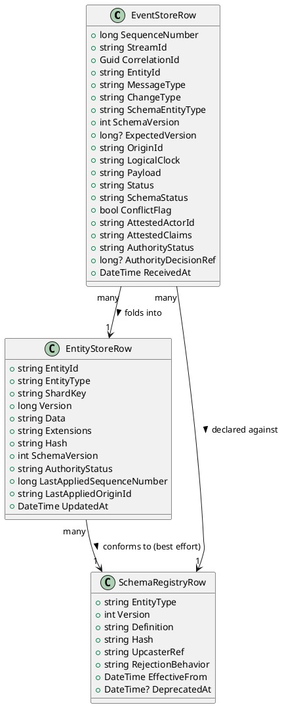

# 05 — Data Model

All core stores are modeled here as simple relational tables. Physical storage (SQL
Server, SQLite, or a log-oriented store) can vary; the shapes below are
storage-agnostic. Several tables share a common pattern — **content-addressed,
versioned, hashed definitions** — noted at the end (§5.6).

## 5.1 Event Store (insert-only)

| Column | Type | Notes |
|---|---|---|
| `SequenceNumber` | BIGINT, PK, identity | Global append order; authoritative ordering within a single origin |
| `StreamId` | VARCHAR | Usually equals `EntityId` once resolved; null/placeholder before routing |
| `CorrelationId` | UNIQUEIDENTIFIER | Client-supplied; unique+idempotency key for inbound submissions |
| `EntityId` | VARCHAR, NULLABLE | `{appId}:{entityType}:{uniqueId}`; null until routed |
| `MessageType` | VARCHAR | `patch` \| `action` |
| `ChangeType` | VARCHAR, NULLABLE | `full` \| `partial` (patches only) |
| `SchemaEntityType` | VARCHAR | As declared by sender |
| `SchemaVersion` | INT | As declared by sender |
| `ExpectedVersion` | BIGINT, NULLABLE | Entity version this patch was based on (optimistic concurrency, see 08) |
| `OriginId` | VARCHAR | Site/server/replica that originated the event (see 09) |
| `LogicalClock` | VARCHAR | Vector clock / HLC value for cross-origin causality (see 09) |
| `Payload` | JSON/NVARCHAR(MAX) | Raw patch/action content, `Optional<T>` fields serialized per 06 |
| `Status` | VARCHAR | `received` \| `applied` \| `rejected` (transport-level only — see 04) |
| `SchemaStatus` | VARCHAR, NULLABLE | `unknown` \| `invalid` \| `conformant` — advisory only, see 07 |
| `ConflictFlag` | BIT, DEFAULT 0 | Set by projector if a concurrent conflicting patch was detected (08) |
| `AttestedActorId` | VARCHAR, NULLABLE | Self-declared identifier (see 12) |
| `AttestedClaims` | JSON, NULLABLE | Free-form or DID/UCAN-derived claims (see 12) |
| `AuthorityStatus` | VARCHAR | `unattested` \| `pending_review` \| `accepted` \| `rejected` — advisory only, see 12 |
| `AuthorityDecisionRef` | BIGINT, NULLABLE | `SequenceNumber` of the event that recorded an accept/reject decision (see 12) |
| `ReceivedAt` | DATETIME2 | Server receipt timestamp |

**Constraints:** `UNIQUE(CorrelationId)` for idempotent inbox insert. Append-only — no
`UPDATE`/`DELETE` by application code; corrections, decisions, and conflict resolutions
are always new rows.

## 5.2 Entity Store (mutable, versioned, hashed)

| Column | Type | Notes |
|---|---|---|
| `EntityId` | VARCHAR, PK | `{appId}:{entityType}:{uniqueId}` |
| `EntityType` | VARCHAR | Denormalized for query/shard routing |
| `ShardKey` | VARCHAR | Computed from `EntityId`/`EntityType` for application-level shard routing (09) |
| `Version` | BIGINT | Monotonically incremented on each fold |
| `Data` | JSON/NVARCHAR(MAX) | Current materialized full snapshot (typed properties) |
| `Extensions` | JSON/NVARCHAR(MAX) | Overflow bag for properties not in the current known schema shape (07, 10) |
| `Hash` | VARCHAR(64) | SHA-256 (or similar) of canonicalized `Data`, for integrity/dedup/quick-diff checks |
| `SchemaVersion` | INT | Schema version the current materialized shape conforms to (post-upcasting, best-effort — see 07) |
| `AuthorityStatus` | VARCHAR | Rolled up from contributing events — advisory display value, see 12 |
| `LastAppliedSequenceNumber` | BIGINT | Last event-store `SequenceNumber` folded into this row — replay checkpoint |
| `LastAppliedOriginId` | VARCHAR | Origin of the most recent fold, for replication diagnostics (09) |
| `UpdatedAt` | DATETIME2 | Last fold timestamp |

**Constraints:** Row is fully mutable — replaced on every fold. `Version`/`Hash`
together let clients/queries detect staleness cheaply (e.g., `If-Match` semantics on
the query API).

## 5.3 Schema Registry (versioned, hashed, itself replicated — see 07)

| Column | Type | Notes |
|---|---|---|
| `EntityType` | VARCHAR, PK (composite) | e.g. `person` |
| `Version` | INT, PK (composite) | Monotonic per `EntityType` |
| `Definition` | JSON/NVARCHAR(MAX) | Property list: name, data type, required, nullable, deprecated-in-version, default/"unknown" fallback for enum-like fields (11) |
| `Hash` | VARCHAR(64) | Hash of canonicalized `Definition`, to detect drift/duplicate registrations |
| `UpcasterRef` | VARCHAR, NULLABLE | Identifier of the transform used to upcast from `Version - 1` (see 07) |
| `RejectionBehavior` | VARCHAR | `annotate` \| `compensate` — how authority rejection affects materialized state (see 12) |
| `EffectiveFrom` | DATETIME2 | When this version became active |
| `DeprecatedAt` | DATETIME2, NULLABLE | Null if still current |

## 5.4 Schema Map (forward/backward transforms — see 07)

| Column | Type | Notes |
|---|---|---|
| `EntityType`, `FromVersion`, `ToVersion` | Composite key | |
| `Direction` | VARCHAR | `forward` (upcast, old→current) \| `backward` (downcast, current→old) |
| `TransformFunction` | TEXT | JS function body, or a CEL expression (see 07 §7.4) |
| `TransformKind` | VARCHAR | `js` \| `cel` |
| `Hash` | VARCHAR(64) | Integrity/immutability check — never mutated once referenced by a replay |
| `EffectiveFrom` | DATETIME2 | |

## 5.5 View Definition Registry (see 03 §3.2.1)

| Column | Type | Notes |
|---|---|---|
| `EntityType`, `Version` | Composite key | |
| `ViewKind` | VARCHAR | `list` \| `detail` \| `edit` \| custom |
| `CompatibleSchemaVersions` | JSON array | Declares which schema version(s) this view understands |
| `TemplateContent` | TEXT | Raw HTML+JS |
| `Hash` | VARCHAR(64) | |
| `EffectiveFrom` / `DeprecatedAt` | DATETIME2 | |

## 5.6 Peer Sync Cursor (see 09)

| Column | Type | Notes |
|---|---|---|
| `PeerId` | VARCHAR, PK (composite) | Which server this cursor tracks |
| `LastReceivedSequenceNumber` | BIGINT | Highest sequence number received from that peer's own origin stream |
| `LastAckedSequenceNumber` | BIGINT | Highest sequence number that peer has confirmed receiving from us |
| `LastSyncAttemptAt` / `LastSyncSuccessAt` | DATETIME2 | Health/staleness observability |

## 5.7 Class Diagram (core three)

## 5.8 The Shared Pattern

Schema Registry (5.3), Schema Map (5.4), and View Definition Registry (5.5) all follow
one underlying shape: **content-addressed, versioned definitions**, keyed by
`(EntityType, Version[, sub-key])`, carrying a `Hash` for integrity/drift detection and
an `EffectiveFrom`/`DeprecatedAt` lifecycle. Treat this as one general pattern with
three applications rather than three bespoke designs — a new "kind of definition" in
the future (e.g., a validation rule set) should reuse the same shape.

All three of these registries are themselves eventually-consistent, replicated data —
see 07 §7.2 for why the Schema Registry specifically must not be treated as globally
synchronous, authoritative infrastructure.
