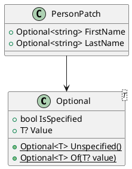

# 06 — Partial Updates & `Optional<T>`

## 6.1 The Problem

Patches must distinguish three states per property:

1. **Unspecified** — the property wasn't part of this patch at all; leave whatever the entity currently has.
2. **Specified as null** — the sender explicitly wants this property cleared.
3. **Specified with a value** — overwrite.

Plain nullable types can't express this: both "absent" and "explicit null" collapse to
the same JSON (`{"lastName": null}` vs. key omitted looks identical to many naive
deserializers unless handled deliberately).

## 6.2 `Optional<T>` Wrapper



```csharp
public readonly struct Optional<T>
{
    public bool IsSpecified { get; }
    public T? Value { get; }

    public static Optional<T> Unspecified => default;
    public static Optional<T> Of(T? value) => new(true, value);
}
```

A custom `JsonConverter<Optional<T>>` only runs when the property is present in the
JSON payload at all — `System.Text.Json` never invokes a property's converter for a key
that's missing, so "unspecified" is captured automatically by omission. The
converter's only real job is correctly capturing an explicit `null` as *specified*
rather than conflating it with "absent."

## 6.3 Fold Rule

Applied in event-store order, per property, by the projector (04 §4.2):

| Patch value | Effect on Entity Store |
|---|---|
| `Unspecified` | Leave current value untouched |
| `Specified(null)` | Clear property (explicit null overwrites prior value) |
| `Specified(value)` | Overwrite with value |

Last-write-wins per property across the whole chain — which is naturally what event
sourcing gives you for free if you fold left-to-right in stream order (see 08 for what
happens when two concurrent patches touch the same property).

## 6.4 Unknown Properties Are Just Another "Specified" State

Per the platform's advisory schema philosophy (07), a property the receiving node's
registry doesn't recognize isn't an error — it's folded the same way as any other
`Specified(value)`, just routed to the entity's `Extensions` bag (05 §5.2) instead of a
typed slot. This is a **partial, not all-or-nothing, fold**: known properties in a
patch apply normally; unknown properties in the *same* patch still apply, just to
`Extensions`.

## 6.5 Wire Format Alternatives Considered

Three general approaches exist for this problem; `Optional<T>` (chosen) is one of them:

1. **Field mask + full nullable payload** (protobuf-style) — a `changedProperties: []` list alongside a full nullable object; simple, slightly redundant on the wire.
2. **`Optional<T>` wrapper type** (chosen) — cleaner C# ergonomics, composes well with strongly-typed event/entity POCOs, one-time cost of a custom JSON converter.
3. **JSON Patch (RFC 6902)** — standardized operation list (`add`/`remove`/`replace` with paths); unambiguous but verbose, arguably overkill without a need for arbitrary nested patches.

`Optional<T>` was chosen because the platform is already strongly-typed C# throughout
(event store payloads, entity store projections, BDD test fixtures), and it avoids
maintaining a parallel field-mask list in sync with the payload.
