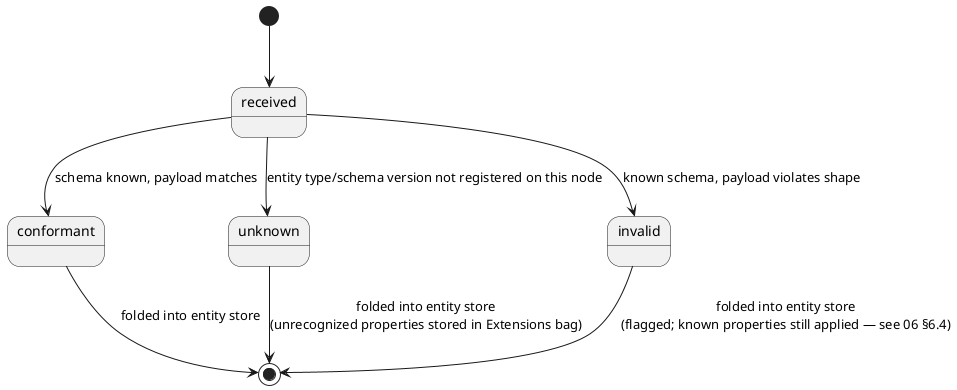

# 07 — Schema Evolution & Advisory Schema Resolution

## 7.1 Schema Validation Is Advisory, Not a Gate

Consistent with 01 §1.2, schema validation never blocks ingestion, folding,
replication, or querying. Unknown types, unknown properties, and type mismatches are
all persisted and flagged — never dropped, never rejected at the transport layer (04).



**Rule, stated explicitly:** no code path anywhere is permitted to branch on
`SchemaStatus` to defer, retry, or reject a fold, a replication transfer, or a query
result. `SchemaStatus` is diagnostic metadata — its only permitted consumers are
dashboards, audit queries, and UI indicators (03 §3.2.3).

## 7.2 The Schema Registry Is Discovered, Not Authorized

A stronger and more precise framing than "soft schema" alone: **a schema definition
being absent, or newer than what a given node currently knows, is an unremarkable,
expected steady-state condition** in a multi-writer, mixed-deployment system — not an
edge case to special-case around.

Concretely:

- **No node blocks on schema availability, ever, for any reason.** A server that
  receives an event for `EntityType: "widget", SchemaVersion: 7` and has never heard of
  that version still persists it (7.1), attempts to fold using whatever generic/
  positional logic it can (typed properties it recognizes get typed treatment;
  everything else lands in `Extensions` — 06 §6.4), and moves on. No retry loop
  waiting for the registry to catch up, no backpressure applied to the sender.
- **One server/client being ahead must never degrade or stall a server/client that's
  behind.** The lagging node just has a fuzzier picture of that one entity type until
  it catches up — everything else in the system is unaffected.
- **The Schema Registry itself propagates the same way entity data does** — written at
  one origin, replicated eventually (09), readable-with-possible-staleness everywhere.
  A client emitting v7 events doesn't wait for the registry write to replicate before
  its events are usable; the events carry their own version tag and are self-sufficient
  regardless of whether any given reader's local registry copy has caught up. The
  registry should be modeled as just another entity type in the same replicated system
  (an entity-store row per `{EntityType, Version}`), not separately-consistent side
  infrastructure.

### 7.2.1 Reconciliation of Unresolved-Schema History

Open decision, worth stating explicitly rather than defaulting silently: once a node
later learns a previously-unknown schema version or upcaster, does it retroactively
re-fold entities that were previously only partially understood?

- **(a) Background reconciliation pass** — a reconciler periodically reprocesses
  entities with unresolved-schema history once new registry info arrives, from their
  last-good checkpoint. More consistent with "nothing is ever silently wrong forever."
- **(b) Forward-only** — the gap is accepted as permanent unless a *new* event
  corrects it.

**(a)** is recommended as the default, given the platform's general stance elsewhere
(nothing blocks, but nothing is left permanently degraded either), but is not yet
finalized (see 14).

## 7.3 Upcast / Downcast Maps

Two genuinely different directions, worth distinguishing precisely (terminology
borrowed from Avro/Confluent Schema Registry convention, noted as prior art below,
though the platform's own "forward/backward" naming is the reverse of Confluent's
"backward/forward compatibility" terms — pick one convention and note it explicitly):

- **Forward map (upcast)** — an old event, authored against schema vN, needs to be
  folded against the *current* schema during replay. Direction: old → current. This is
  what the projector needs (05 §5.4 `UpcasterRef`/Schema Map `forward`).
- **Backward map (downcast)** — a current entity needs to be *served* to a consumer
  that only understands an older schema version (legacy client, external integration
  pinned to v1). Direction: current → old. This is a query-time content-negotiation
  concern (10), not a replay concern.

### 7.3.1 Schema Map Table

See 05 §5.4 for the full column list. Most version-to-version changes are mechanical —
rename, drop, default, or a simple derived expression.

### 7.3.2 Transform Implementation: Raw JS Functions

Rather than maintaining a bespoke declarative operations DSL *and* a code escape hatch,
transforms are stored as raw JS function bodies (`TransformKind: js`):

```js
function upcast(v1) {
  return {
    firstName: v1.given_name,
    lastName: v1.family_name,
    fullName: `${v1.given_name} ${v1.family_name}`.trim()
  };
}
```

This is a deliberate simplification: the platform already needs a JS execution
environment for entity view definitions (03 §3.2), so reusing one JS runtime for both
concerns avoids standardizing on two different sandboxes.

**Constraints, mandatory given the replay requirement:**

1. **Determinism.** Replay must produce identical output every time, across every node/
   replica. Transform functions must be pure — no `Date.now()`, no `Math.random()`, no
   network/filesystem access, no closures over external mutable state. A
   non-deterministic upcast would silently corrupt replay consistency across replicas.
   Lint for this; document it as an authoring rule.
2. **Sandboxing.** Execute as untrusted-ish code regardless of authorship, since
   replicated data from multiple origins flows through these functions.
   - **Jint** (pure managed C# JS interpreter) — recommended: no native binary per
     platform, easy to constrain (step-count limits, timeouts, no I/O surface exposed
     at all — Jint has no ambient filesystem/network/process access to begin with).
   - **ClearScript (V8)** — faster, real V8 engine, but pulls in native binaries per
     platform; more capable, more operational overhead.
   - Whitelisting in Jint is done by construction, not a config flag: start from a
     stripped global object, inject only named functions that have been vetted (e.g. a
     deterministic `now()` if genuinely needed), and explicitly strip/never-inject
     anything nondeterministic (`Math.random`) — the engine simply never has ambient
     capability it wasn't given.
   - Enforce `LimitRecursion`, `MaxStatements`, and a `TimeoutInterval`/`CancellationToken`
     unconditionally — a single bad transform must not stall a projector replaying
     thousands of events.
3. **Immutability once referenced.** A transform function is versioned and hashed
   (05 §5.4 `Hash`) and never mutated once any historical replay has depended on it —
   fixing a bad transform means registering a new version and re-pointing forward, not
   editing in place (this would silently rewrite the meaning of history).

### 7.3.3 Restricted Expression Alternative: CEL

For the common/declarative case (rename, default, simple derive), **CEL (Common
Expression Language)** is a strong alternative or complement to raw JS:

- Fixed, curated standard library — no arbitrary method dispatch, no reflection, no
  I/O, not Turing-complete (no unbounded loops/recursion), guaranteed termination.
- Used in production for exactly this "let policy/transform authors write expressions
  safely" case (Envoy, Kubernetes admission policies, Firebase security rules).
- Whitelisting is by design, not by removing capability from something bigger — e.g.
  `timestamp()` can be exposed as a built-in without `Math.random()`-equivalent ever
  existing at all, unless explicitly registered as a custom function.
- .NET support exists (`Cel.NET`) but is less mature than the Go/Java/C++
  implementations — evaluate maturity before committing.

**Recommended split:** CEL for the common/declarative transform case; Jint (sandboxed
per 7.3.2) reserved for the rare complex transform needing full JS semantics (loops,
intermediate variables). Same two-tier structure already used elsewhere in this
platform (declarative for the common case, escape hatch for the rest).

### 7.3.4 Prior Art Considered (no single web standard covers this)

No RFC or W3C standard directly addresses upcast/downcast schema mapping. Prior art
considered and explicitly not adopted wholesale:

- **Avro schema resolution rules** — closest conceptual match (reader/writer schema
  reconciliation, field aliasing, default values, type widening); not a web standard.
- **Confluent Schema Registry compatibility modes** (`BACKWARD`/`FORWARD`/`FULL`) —
  industry convention, not a standards-body spec; source of the backward/forward
  terminology noted in 7.3 above.
- **Protobuf field evolution rules** — similar idea (reserved field numbers,
  safe-to-add/remove rules); a project convention, not an RFC.
- **JSON-LD `@context`** (W3C Recommendation) — solves property/vocabulary renaming
  between semantic contexts; doesn't cover general type coercion, defaulting, or
  derived-field transforms.
- **JSON Patch (RFC 6902) / JSON Merge Patch (RFC 7386)** — standardize *how to
  describe a diff*, not *how to migrate between schema versions*.
- **Media-type versioning** (`application/vnd.myapp.v2+json`, RFC 6838) — signals which
  version is wanted; says nothing about mapping between versions.

## 7.4 GraphQL Schema Directives as Self-Describing Mapping Metadata

Where GraphQL is the query layer (10), SDL custom directives can double as both
documentation and the source data for generating Schema Map rows:

```graphql
type Person @schemaVersion(current: 3) {
  firstName: String @renamedFrom(version: 1, name: "given_name")
  lastName: String  @renamedFrom(version: 1, name: "family_name")
  fullName: String  @derivedFrom(version: 1, expr: "given_name + ' ' + family_name")
}
```

A schema-directive visitor reads these at build time and can generate Schema Map
entries automatically or apply the transform live in the resolver based on a requested
version. This keeps the SDL as a single source of truth for both current field naming
and historical migration — the schema and its migration map can't silently drift apart.

OData's EDM vocabulary annotations could theoretically carry similar metadata, but
OData's rigid CSDL type system isn't designed to project one shape into another at
query time — a thin translation middleware in front of OData is the more honest
approach if OData is used (see 10).

## 7.5 Interaction with View Definitions

View definitions (03 §3.2) declare `CompatibleSchemaVersions`. A view rendering an
entity whose materialized `SchemaVersion` (05 §5.2) doesn't match should fall back to
the generic property-list renderer rather than assume field compatibility — the same
tolerant/fallback posture used throughout.
