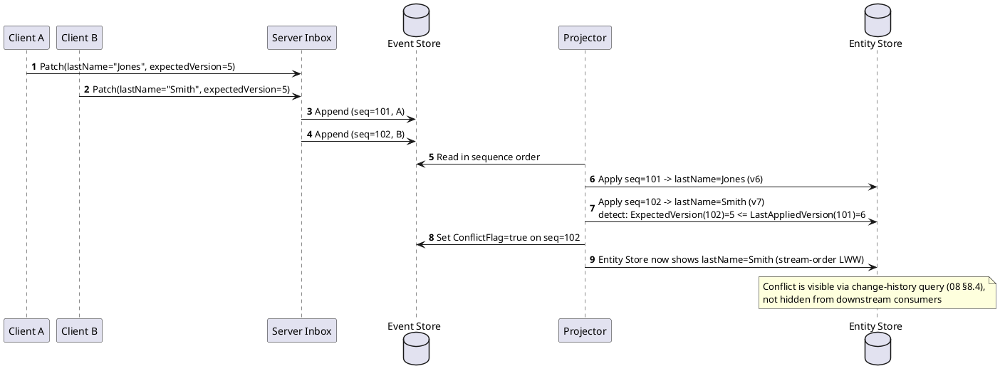

# 08 — Concurrency & Conflict Handling

## 8.1 There Is No True Order Between Causally Concurrent Writes

When two patches are both based on the same `ExpectedVersion` and touch the same
property from different origins, there is no "true" order to discover — they are
causally concurrent (in the Lamport/vector-clock sense). Any order imposed (arrival
time, priority, random) is a **policy decision**, not a fact being uncovered. This is a
property of distributed systems generally, not a gap in this design.

## 8.2 Default Policy: Stream Order, With Conflict Detection

- **Default:** event-store append order (05 §5.1 `SequenceNumber`) is authoritative —
  last-write-wins. Simple, deterministic, explainable.
- **Layered on top:** the projector *detects and flags* conflicts without blocking or
  rejecting either event. Detection is cheap: compare a patch's `ExpectedVersion` to
  the entity's `LastAppliedSequenceNumber`/version at fold time — if another patch
  touching the same property was applied in between, flag `ConflictFlag = true` (05
  §5.1) on the later-applied event.



## 8.3 Why Most Concurrent Edits Aren't Real Conflicts

Because patches are property-level, not whole-entity replacements, most concurrent
edits from different clients aren't collisions at all — if client A changes `lastName`
and client B changes `email`, both based on version N, both patches fold cleanly
regardless of arrival order. A real conflict is narrow: two patches specifying the
*same* property with *different* values, based on the *same* prior version. Detect
that narrowly rather than treating any concurrent submission as suspect.

## 8.4 Entity Change History Query

Since the event store is keyed by (eventually) `EntityId`, "all events for entity X" is
a stream read from position 0 — no new storage, only a query surface (10).

```graphql
query EntityHistory {
  entityHistory(entityId: "app1:person:123", property: "lastName") {
    sequenceNumber
    originId
    expectedVersion
    changeType
    conflictFlag
    payload
    receivedAt
  }
}
```

This supports:

- **Auditability of contested writes** without altering resolution policy — a user or
  support engineer can see both concurrent values and understand this was a genuine
  concurrent edit, not a bug.
- **Manual conflict resolution as a new patch** — history stays immutable; a correction
  is additive, not a rewrite (same principle used for authority decisions, 12).
- **Debugging** — "why does this entity look like this" is answerable by replaying its
  visible chain.

## 8.5 Levels of Sophistication (Escalate Only Where Needed)

1. **Arrival-order LWW, no conflict detection** — simplest; fine for fields where
   staleness doesn't matter (e.g., cosmetic settings, free-text notes).
2. **Optimistic concurrency + conflict flagging** (chosen default, 8.2) — visible
   without blocking the pipeline.
3. **Field-level conflict policy table** — for fields where LWW is genuinely wrong
   (e.g., a monetary balance summing deltas instead of overwriting, a status enum with
   explicit precedence). This is where CRDTs live if ever needed, but is reserved for
   specifically contentious fields rather than applied system-wide.

## 8.6 Interaction with Replication

Cross-server divergence via replication (09) is resolved by the **same mechanism**
described here — §8.2's conflict flag isn't only a same-server concern; it's the
identical mechanism that resolves cross-server divergence once sync delivers events a
node hadn't yet seen. No new resolution logic is needed for the distributed case, only
a new trigger source for the existing one.
