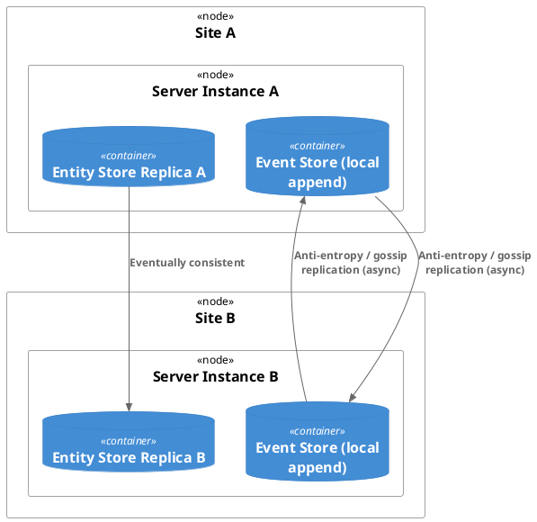
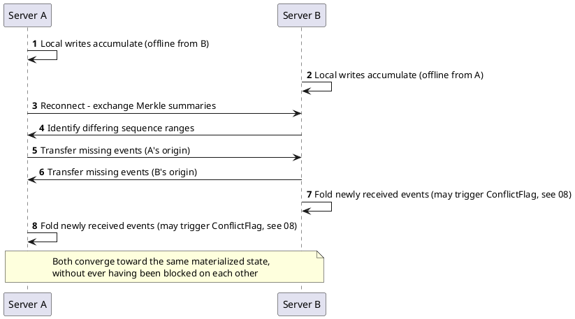

# 09 — Sharding & Replication

## 9.1 Sharding vs. Replication — Distinct Concerns

- **Sharding**: each partition holds *different* data (partitioned by key); routing
  decides *which shard has this entity*. No two shards hold the same entity.
- **Replication**: each replica holds *copies of the same* (or overlapping) data,
  potentially originated at different sites; routing decides *which replica* to
  read/write for freshness/locality, and conflict resolution (08) is required when
  replicas diverge.

This platform wants both, for different reasons: shard by entity type/tenant for
scale; replicate each shard geographically for availability/locality, with **no
guarantee any two replicas are in the same state at any given time.**

## 9.2 Application-Level Sharding

- `ShardKey` (05 §5.2) derived from `EntityId`/`EntityType`.
- **Shard Resolver / Partition Router** maps `EntityId → ShardKey → physical
  store/connection`.
- **Consistent hashing** — if shard count may change over time (scaling out),
  consistent hashing minimizes reshuffling versus naive `hash % N`.
- **Shard-per-entity-type** — a simpler alternative to hash-sharding: since `EntityId`
  already encodes `EntityType`, shard by type instead of hash — easier to reason about
  and set up for BDD tests, at the cost of less even load distribution. Not yet
  finalized as the default (see 14).
- The **event store** may remain a single append log (or partitioned per stream, e.g.
  EventStoreDB-style) independently of how the **entity store** is sharded — don't
  conflate "partitioning the log" with "sharding the projection"; they have different
  consistency implications.
- **Cross-shard queries** need a query coordinator that fans out and merges (10).

## 9.3 Multi-Origin Replication

Each origin (server/site) can write; conflicts are expected, not prevented (08).

- **`OriginId` + `LogicalClock`** (vector clock / HLC, 05 §5.1) travel with every
  event for cross-site causality reasoning — wall-clock timestamps alone are
  insufficient once writes can originate at multiple independent sites.
- **Anti-entropy/gossip repair** reconciles divergent replicas in the background.
- **Consistency guarantee exposed to clients** should be explicit — at minimum,
  session/read-your-writes consistency for the originating client, with eventual
  convergence otherwise for data written elsewhere.

## 9.4 Peer Sync as the Same Outbox/Inbox Primitive, Applied Peer-to-Peer

Server-to-server sync is not a new mechanism — it is the same durable
outbox → durable inbox pattern used for client↔server (04), reused for server↔server.
One transport primitive, three relationships: client→server, server→server,
server→client.

- **Sync Outbox** — every event a server originates or receives is queued for
  transmission to each known peer. Distinct from the client-facing outbound pipeline
  (04 §4.2), because peers need *everything* (full replication) while clients only
  need what they've subscribed to.
- **Sync Inbox** — mirrors the client-facing server inbox exactly: peer sends an
  event, receiving server durably persists it, deduplicates on
  `(OriginId, SequenceNumber)`, and only then acks. Same "persist first, reconcile
  later" philosophy (01 §1.2).
- **Per-peer sync cursor** (05 §5.6) — since there's no guaranteed shared state at any
  point in time, each server tracks, per peer, how far it's gotten
  (`LastReceivedSequenceNumber`, `LastAckedSequenceNumber`).

### 9.4.1 Topology Options

| Topology | Characteristics |
|---|---|
| **Gossip / full mesh** | Every server periodically exchanges with every other. Most resilient to any single node/link failure; O(n²) connections and redundant transfer as node count grows. Matches "no guarantee of same state at any time, eventually converges" most directly — the model gossip/anti-entropy protocols (Dynamo-style) were built for. **Recommended default**, most consistent with this platform's stated tolerance for divergence. |
| **Hub-and-spoke** | One or a few relay nodes every server syncs through. Simpler, cheaper on connections; hub becomes a single point of *delay* (not necessarily failure, since each server retains its own durable inbox/outbox and can catch up whenever the hub is reachable again). |
| **Leaderless peer pull** | Each server periodically asks each known peer "give me everything after sequence N" rather than peers pushing. Simpler failure handling (a down peer just means no new data yet — no dead-letter/retry queue needed on the sender side). Fits the existing pull-oriented dispatcher pattern (04 §4.1). |

### 9.4.2 Efficient Catch-Up: Merkle Tree Comparison

For a server rejoining after a long disconnection, full event-by-event replay from zero
is correct but potentially expensive. Standard technique (as used in Dynamo/Cassandra
anti-entropy): both peers exchange hash-tree summaries of their event ranges, quickly
identify which sub-ranges actually differ, and transfer only the delta. This extends the
same hashing discipline already used for entity integrity (05 §5.2 `Hash`) to ranges of
the event store specifically for this purpose (e.g. a periodic `SequenceRangeHash`).

### 9.4.3 What Sync Does Not Do

Sync transports raw events between servers' event stores — it does **not** perform
routing, schema validation, or projection. A synced event lands in the receiving
server's event store exactly as if it arrived from its own client inbox, and only then
goes through that server's own local router/projector (04) using whatever
schema/registry knowledge that server currently has (07 §7.2). This keeps sync itself
dumb, safe, and replayable.

### 9.4.4 Divergent Local Projections

Because two servers can each fold events into their own entity store independently
before sync catches them up, their rows for the same `EntityId` can genuinely disagree
for a while — not just be "behind," but reflect different applied orders if both
received conflicting local writes before sync exchanged them. This is the same
conflict-flag mechanism from 08 §8.2/§8.6, just triggered by sync-driven convergence
rather than same-server concurrent submissions.

## 9.5 Non-Goals for This Version

- Strong consistency or quorum-based writes across replicas.
- Automatic conflict resolution beyond the default LWW + flag policy (08 §8.5) — per-
  field merge strategies remain a targeted, not general, mechanism.
