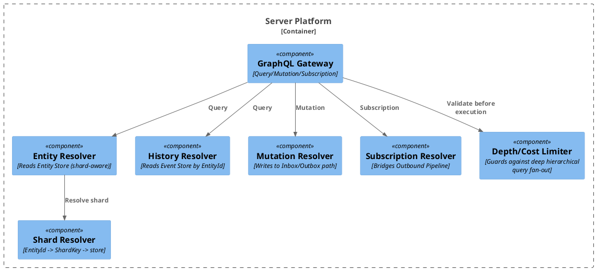

# 10 — Query API (GraphQL / OData)

## 10.1 GraphQL vs. OData

The query layer reads from the entity store (current state) and event store (history,
08 §8.4) — never bypassing the projector to read raw, un-folded events as "current"
data.

| Concern | GraphQL | OData |
|---|---|---|
| Client-shaped reads | Native (client selects fields) | Via `$select`/`$expand` |
| Hierarchical/nested queries | Native, unbounded depth — this is GraphQL's core reason for existing | Bolt-on (`$expand=Orders($expand=LineItems)`); clunkier, practical depth limits common |
| Filtering/sorting | Custom schema convention | Standardized (`$filter`, `$orderby`) — free grammar |
| Subscriptions (watch) | Native (GraphQL Subscriptions) — unifies with outbound pipeline (04 §4.2) | Not standardized; needs bolt-on (SignalR/webhooks) |
| Mutations (submit patch/action) | Native (Mutation type) — same schema as reads | Supported but less idiomatic |
| Graph-shaped domain fit | Natural — entities reference other entities by ID, matches this platform's model directly | More naturally tabular/relational; fights hierarchical traversal |
| .NET tooling | Hot Chocolate / GraphQL.NET | `Microsoft.AspNetCore.OData` (very mature) |
| Best fit | Custom frontend needing one unified contract for query+mutate+subscribe | Enterprise/tooling consumers (Power BI, generic OData clients) |

**Recommendation:** GraphQL as the primary contract — Query, Mutation, and Subscription
under one schema map directly onto this platform's three existing pipelines (reads,
patch/action submission, watch/notify), and GraphQL's hierarchical query model is a
better fit for a graph-shaped entity domain than OData's tabular/entity-set model.
OData is retained as a secondary option for enterprise tooling consumers if needed, at
its own separate endpoint (see 10.4 on why these are not unified at the transport
level).

## 10.2 Loose Schema: Invalid Projection → Null, Not Error

Consistent with the platform's advisory-schema philosophy (07), a client requesting a
property that doesn't exist for a given entity's current version should get `null` or
a missing value — never a request failure.

- **Nullable fields by default**, especially anything sourced from the `Extensions`
  bag (05 §5.2) or fields that may not exist on older schema versions. A client
  requesting `middleName` on an entity whose schema/version never defined it gets
  `null` — no error.
- **GraphQL's partial-success execution model already supports this** — if a resolver
  returns `null` for a nullable field, the rest of the query still succeeds
  (`data` + separate `errors` array). This mirrors the platform's "always persist, flag
  rather than reject" stance elsewhere (01 §1.2).
- **Failure mode to avoid: non-nullable fields (`String!`)** for properties that might
  not exist for older/looser entities. A non-null field resolving to `null` nulls out
  the *entire parent object* per GraphQL spec — the classic gotcha, and it would
  directly undermine "invalid projection → null property, not blown-up response."
  Audit the schema for `!` and reserve it only for properties guaranteed across every
  schema version.
- **Requesting a field that doesn't exist in the schema at all** (typo, or a field from
  a newer schema version the gateway hasn't picked up yet) is a *query validation*
  error at the GraphQL layer, not a null — a different case from "field exists in
  schema but absent on this entity." If this case should also degrade gracefully rather
  than error, two options: (a) a permissive/dynamic schema with a generic `properties:
  JSON` catch-all alongside typed fields (recommended — see 10.3), or (b) a fully
  custom resolver layer bypassing strict GraphQL schema validation entirely in favor of
  arbitrary field-path lookups against the entity's JSON blob (a bigger architectural
  commitment, only worth it if unknown-field requests are frequent rather than an edge
  case).

## 10.3 The `extensions` Escape Hatch

Every entity type exposes a generic `extensions: JSON` field alongside its typed
fields, backed directly by the entity store's `Extensions` column (05 §5.2). This keeps
strict GraphQL validation for the common case (typed fields → null when absent) while
still making unknown-but-present data queryable rather than invisible — consistent with
the soft-schema stance throughout this document set.

## 10.4 Why Not Select GraphQL vs. OData by Content Negotiation

HTTP content negotiation (`Accept`/`Content-Type`) is designed to select between
different *representations of the same resource*. GraphQL and OData aren't
representations of the same resource — they're different query protocols with
different request shapes and semantics (GraphQL: single endpoint, query document in
POST body; OData: resource-addressed URLs with `$filter`/`$expand`). There's no clean
"same resource, different format" relationship to negotiate over.

If a gateway needs to dispatch between them, real options (none are true content
negotiation) are: distinct paths (`/graphql` vs `/odata/v1/...` — what virtually every
system does), custom media-type sniffing (loses tooling compatibility on both sides),
or body-sniffing (fragile, fights both ecosystems' tooling assumptions). **Recommended:
distinct paths, GraphQL primary, OData secondary and separate** — routing is a
build-time/deployment decision, not a runtime negotiation.

## 10.5 Schema Mapping via GraphQL Directives

See 07 §7.4 — SDL custom directives (`@renamedFrom`, `@derivedFrom`) can serve as both
schema documentation and the source data for Schema Map generation, keeping the schema
and its migration history from drifting apart.

## 10.6 Query-Time Consistency Hints

Given multi-origin replication (09), the query layer needs a per-query or per-field
routing decision: read from a local replica (fast, possibly stale) vs. a designated
primary/quorum read (slower, fresher). Some fields (a status flag) tolerate staleness
fine; others (a balance) might not — this should be a field-level or query-argument
hint, not a single global setting.

## 10.7 Cost Control for Hierarchical Queries

As hierarchy depth increases, unbounded nested queries risk a fan-out explosion.
Required guardrails: query-depth limiting (e.g. `graphql-depth-limit`) and complexity/
cost scoring middleware, combined with per-resolver batching (DataLoader pattern) to
avoid N+1 queries across shards/replicas.
