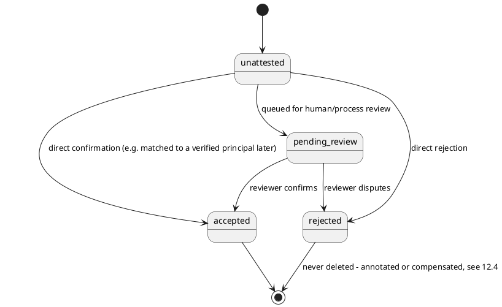
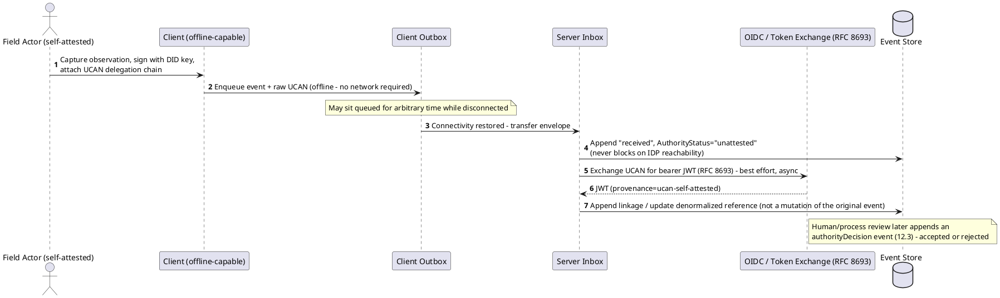

# 12 — Non-Authoritative Capture & Attestation

## 12.1 Authority Status Is a Distinct Trust Axis

Schema status (07) answers "do we understand the shape of this data?" **Authority
status** answers "do we trust who submitted it and what they claim to be doing?" Both
are advisory, non-blocking, and travel with the event rather than gating it — same
philosophy (01 §1.2), different question. The system must be able to capture data even
when it cannot prove, at the time of capture, that the submitting user has been
granted permission to submit it.

## 12.2 Self-Attestation as First-Class, Typed Data

Self-attested identity/authority is itself schema-shaped data that can evolve — model
it as its own claim structure rather than metadata bolted onto the envelope. See 05
§5.1 for the Event Store columns (`AttestedActorId`, `AttestedClaims`,
`AuthorityStatus`, `AuthorityDecisionRef`) and 05 §5.2 for the rolled-up
`AuthorityStatus` on the Entity Store.



**Rule, identical in spirit to `SchemaStatus` (07 §7.1):** `AuthorityStatus` never
gates ingestion, folding, or replication. An `unattested` event is persisted, folded
into the entity store, replicated to peers, and queryable — identically to an
`accepted` one. The only difference is a label available to consumers who care (a
reviewer dashboard, a view definition rendering an "unverified" watermark — 03 §3.2.4,
a query filter). No code path branches on it to defer or reject processing.

## 12.3 Accept/Reject Decisions Are New Events, Never Mutations

Consistent with the platform's "never delete, corrections are additive" principle
(schema corrections, conflict resolution, rollback — 07, 08, 11), authority decisions
are appended as their own event:

```json
{
  "messageType": "action",
  "actionType": "authorityDecision",
  "targetSequenceNumber": 4821,
  "decision": "accepted",
  "decidingActorId": "reviewer:jsmith",
  "reason": "Confirmed via field supervisor log"
}
```

The original event-store row is never touched; `AuthorityDecisionRef` on it (if used as
a denormalized back-pointer) is set once, by the projector, as an index convenience —
not a correction of history.

## 12.4 Does Rejection Undo the Fold?

A genuine design decision, deliberately not defaulted silently:

- **(a) Rejection is annotation-only** (recommended default) — the entity store still
  reflects whatever the data said; `AuthorityStatus: rejected` is a flag consumers can
  filter on or views can grey out. Nothing is un-applied. More consistent with the
  platform's "never delete" stance, and matches how `ConflictFlag` already works
  (flagged, not reversed).
- **(b) Rejection triggers a compensating patch** — the projector, on seeing a
  rejection decision, generates a corrective event reverting affected properties to
  their pre-rejected-event state (or null/unspecified). Keeps the *current* entity
  "clean" of unauthoritative data, at the cost of more complex replay logic (requires
  replaying to the point immediately before the rejected event).

Given the rest of the platform's posture, (a) is the more consistent default, but some
domains (e.g. anything with legal/evidentiary weight) may specifically need (b). This
is configured per-entity-type via `RejectionBehavior` on the Schema Registry (05 §5.3),
not fixed system-wide.

## 12.5 DID + UCAN for Offline, Self-Attested Capture

### 12.5.1 Why These Fit

- **DID (Decentralized Identifier)** proves *cryptographic control of an identifier* —
  "the holder of this key says they are `did:key:z6Mk...`." It does **not** prove that
  identifier corresponds to a real-world vetted identity, employee, or authorized role
  — exactly the self-attestation distinction drawn in 12.1.
- **UCAN (User Controlled Authorization Network)** proves a *chain of delegated
  capability* — "the holder of this key was granted capability X by someone who held
  capability X (or the ability to delegate it), all the way back to a root issuer" —
  entirely offline-verifiable, no central authority needs to be reachable at invocation
  time. A UCAN invocation is exactly "I attest I have this capability, here's the
  delegation chain as proof of my claim" — matching the `unattested → pending_review →
  accepted/rejected` lifecycle (12.2) precisely.

A UCAN invocation can serve directly as an `AttestedClaims` payload — cryptographically
structured rather than free-text — and the delegation chain becomes evidence attached
to the event for later review, rather than something trusted blindly at ingest time.

### 12.5.2 Token Exchange: RFC 8693

```
POST /oauth/token
grant_type=urn:ietf:params:oauth:grant-type:token-exchange
subject_token=<UCAN invocation, or DID-signed proof>
subject_token_type=urn:your-org:token-type:ucan
requested_token_type=urn:ietf:params:oauth:token-type:jwt
```

The OIDC provider (or a small bridge service in front of it) validates the UCAN
chain/DID signature, then mints a normal bearer JWT — same issuer, same signing key,
same shape every other endpoint already expects. **This is the encapsulation goal:
every downstream endpoint only ever has to understand "bearer JWT, validate signature,
read claims."** No downstream service needs to know what a UCAN or DID even is.

### 12.5.3 JWT Claim Shape

```json
{
  "iss": "https://your-idp/",
  "sub": "did:key:z6Mk...",
  "aud": "your-api",
  "provenance": "ucan-self-attested",
  "authority_status": "unattested",
  "delegation_chain_ref": "sha256:...",
  "claimed_capability": "capture:field-observation",
  "exp": 1234567890
}
```

- `provenance`/`authority_status` claims flow directly into the event's
  `AttestedClaims`/`AuthorityStatus` columns (05 §5.1) — the JWT *is* the attestation
  artifact, not a separate thing built alongside it.
- `delegation_chain_ref` — store a hash/reference to the full UCAN chain (blob storage
  or alongside the event payload), not the whole chain inline in every JWT — keeps
  tokens small while giving the later human-review step something concrete to inspect.
- **Important non-goal:** the JWT's existence and valid signature only proves the
  exchange happened correctly (a syntactically/cryptographically valid UCAN was
  presented) — it does **not** upgrade `authority_status` to `accepted`. That upgrade
  only happens via the explicit review event (12.3). Cryptographic validity and
  authoritative approval are easy to conflate; keep them explicitly separate.

### 12.5.4 Where Validation Happens

- UCAN chain validation happens once, at the token-exchange step — not at every
  downstream service. The inbox/router/projector never touch UCAN or DID semantics at
  all; they see a bearer JWT like any other, read `authority_status` off its claims (or
  off the event, once persisted), and proceed per the non-blocking rules (12.2).
- **This also solves an offline/replication problem:** UCANs are self-verifying (the
  chain carries its own proof), so a receiving peer server — or even an offline/
  disconnected node — can validate a captured event's attestation chain **without
  calling back to the OIDC provider at all**, consistent with "no guaranteed
  connectivity, no central authority reachable at capture time" (09). The token
  exchange serves the *online, connected* API surface; the raw UCAN (or its hash
  reference) traveling with the event preserves verifiability even in disconnected
  capture scenarios, which a plain OAuth token alone would not provide.

### 12.5.5 Where the Exchange Happens

Given the offline-capture requirement, **server-side exchange at ingestion** is
preferred over client-side pre-exchange: a client capturing data offline can't reach
the OIDC provider to exchange anything until connectivity returns, so the client
submits the raw self-attested UCAN alongside the event immediately (matching "capture
now, adjudicate later," 12.1), with the token exchange/JWT minting happening
server-side once the event actually reaches an inbox that can talk to the IdP.



## 12.6 Interaction With Other Documents

- **View definitions (03)** should render `unattested`/`pending_review` data with a
  visual indicator — reusing the same generic "flag" rendering convention as
  `ConflictFlag` (08).
- **Replication (09)** — an unattested event from one origin is a full peer-sync
  citizen; authority review is a downstream, per-server (or centrally reviewed) concern,
  not a precondition for sync. Two servers can independently disagree about whether
  something's been reviewed, resolved the same way as any other divergence — the
  decision event itself propagates like any other event.
- **Schema mapping (07)** — `AttestedClaims` being free-form JSON likely wants its own
  lightweight schema entry (an `attestation` entity type in the registry) so claims can
  evolve the same additive, versioned way as everything else, rather than remaining an
  untyped blob forever.
- **Query API (10)** — `authorityStatus` is a standard filterable/nullable field on
  every entity type, same treatment as `extensions` — visible, queryable, never hidden.

## 12.7 Rationale Worth Stating Explicitly

This is a form of the **Reservation/Provisional pattern** combined with
**non-repudiation logging** — the system deliberately chooses "capture now, adjudicate
later" over "authenticate then capture," which is the right call for domains where the
*cost of a missed observation* exceeds the *cost of a later-discarded false one*. Worth
stating this tradeoff explicitly as rationale, since it's a real policy choice a
reviewer might otherwise question.
