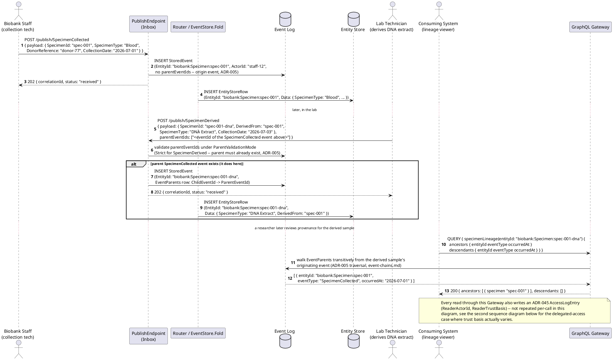
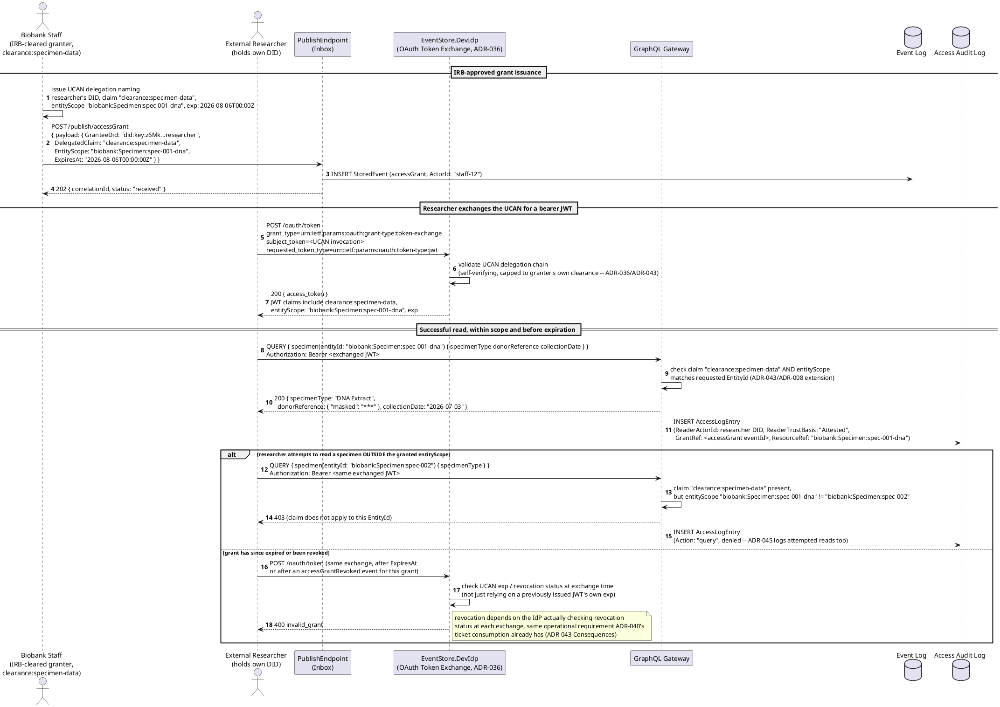
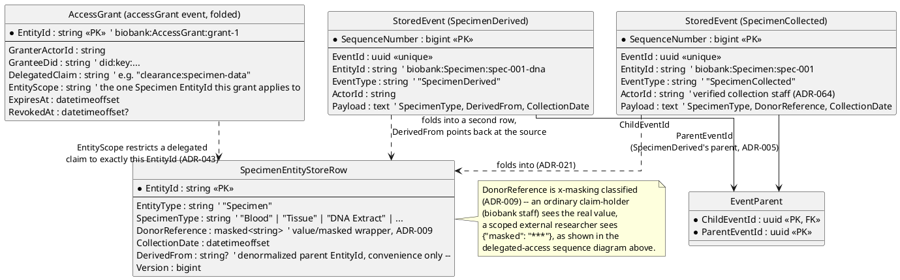
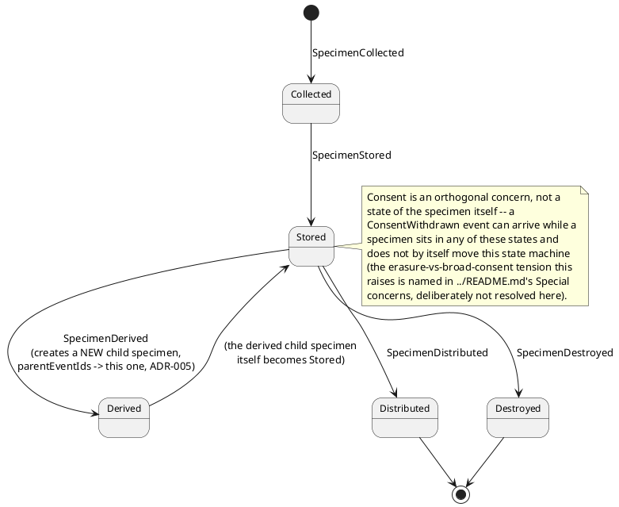
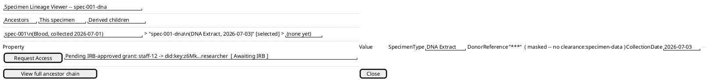

# Feature: Specimen Collection, Derivation, and Lineage

Context: this doc exercises the mechanisms `../README.md`'s "Applicable
ADRs" section already names as biobanking's primary fits: `ADR-005`
(event lineage/DAG — named there as "the cleanest lineage fit found
across every candidate," a derived sample tracing back to its source
specimen as a literal DAG, not an analogy for one), `ADR-043`/`ADR-044`
(delegated, capped, time-boxed access grants — the domain README quotes
`ADR-043`'s own Compliance note naming "biobanking's IRB/biobank-
committee-reviewed researcher access requests" as one of its two
real-world standout fits), `ADR-036` (UCAN delegation/OAuth Token
Exchange, the mechanism `ADR-043` reuses rather than reinventing), and
`ADR-045` (the read access audit log every one of those reads also
writes to). Persist-everything ingestion and `EntityId` resolution are
`ADR-023`/`ADR-021`; the specimen and derived-sample rows this doc
folds into are ordinary `EntityStoreRow`s per
[`../../../data/entity-store.md`](../../../data/entity-store.md); the
event envelope fields used below (`EntityId`, `parentEventIds`,
`ActorId`, `AttestedClaims`) are defined in
[`../../../data/event-log.md`](../../../data/event-log.md).

This doc deliberately does **not** re-derive:
- The general `parentEventIds`/lineage DAG mechanics (`ParentValidationMode`,
  cycle-safety, the Lineage API's traversal shape) — those are
  `ADR-005`, covered end-to-end in
  [`../../../features/event-chains.md`](../../../features/event-chains.md).
  This doc shows the same mechanism landing on a *literal* physical-specimen
  DAG rather than re-explaining how traversal works.
- The general UCAN delegation / DID / OAuth Token Exchange mechanics
  (issuance, self-verifying signature chains, the `POST /oauth/token`
  exchange shape) — those are `ADR-036`, covered end-to-end in
  [`../../../features/did-ucan-attestation.md`](../../../features/did-ucan-attestation.md).
  This doc shows that same exchange used for `ADR-043`'s entity-scoped
  grant case, not a second attestation mechanism.
- `ADR-045`'s `AccessLogEntry` mechanics themselves (hash-chain shape,
  independent sequence) — this doc only notes *that* a delegated read
  writes one, per [`../../../data/access-log.md`](../../../data/access-log.md).
- The GDPR erasure-vs-broad-consent tension the domain README's "Special
  concerns" section already names as "the sharpest erasure-vs-retention
  tension of any candidate considered" — that tension exists and is
  real, but resolving it is out of scope here; this doc's scenarios
  never attempt an erasure request against an active specimen.

## Sequence diagram — collecting a specimen, deriving a sample, and querying lineage

Collection is an origin event (no `parentEventIds`); deriving a secondary
sample is a *child* event that declares the source specimen as its
parent, exactly the literal DAG shape the domain README calls out. The
Lineage query at the end is the same GraphQL-transported traversal
`event-chains.md` already documents (`ADR-037` moved it off the old
`QUERY /events/...` REST shape onto GraphQL) — shown here against real
specimen data rather than re-derived.



## Sequence diagram — IRB-authorized delegated access for a collaborating researcher

The granter here is biobank staff holding a real clearance claim over
specimen data (`ADR-046`); the grant itself is scoped to exactly one
`EntityId` (one specimen), not blanket access — the actual shape of an
IRB-approved external-researcher request the domain README and
`ADR-043`'s Compliance note both name directly. Grant issuance/
revocation are ordinary registered event types (`accessGrant`/
`accessGrantRevoked`, per `ADR-043`), folded and audited like any other
event.



## Data model (ER diagram)



Full column lists live in
[`../../../data/event-log.md`](../../../data/event-log.md),
[`../../../data/entity-store.md`](../../../data/entity-store.md), and
[`../../../data/access-log.md`](../../../data/access-log.md) — this
diagram shows only the columns this doc's scenarios actually touch.

```csharp
// Illustrative only -- SpecimenCollected/SpecimenDerived are ordinary
// registered event types, not new StoredEvent subclasses; shown here as
// the resolved shape of Payload plus the envelope fields these scenarios
// exercise (../../../data/event-log.md defines StoredEvent itself).

public class SpecimenCollectedPayload
{
    public string SpecimenId { get; set; } = default!;   // resolves EntityId via EntityIdField "$.SpecimenId"
    public string SpecimenType { get; set; } = default!; // "Blood" | "Tissue" | "DNA Extract" | ...
    public string DonorReference { get; set; } = default!; // x-masking classified (ADR-009) -- masked by default
    public DateTimeOffset CollectionDate { get; set; }
}

public class SpecimenDerivedPayload
{
    public string SpecimenId { get; set; } = default!;   // the NEW derived specimen's own id
    public string DerivedFrom { get; set; } = default!;  // denormalized convenience copy of the source SpecimenId --
                                                            // parentEventIds (ADR-005) is the actual causal DAG edge, this
                                                            // field never substitutes for it
    public string SpecimenType { get; set; } = default!;
    public DateTimeOffset CollectionDate { get; set; }
    // parentEventIds is envelope metadata on the publish request, not a
    // Payload field -- see event-log.md's "Event lineage" section.
}

public class SpecimenEntityStoreRow
{
    public string EntityId { get; set; } = default!;     // biobank:Specimen:{specimenId}, PK
    public string EntityType { get; set; } = default!;   // "Specimen"
    public string SpecimenType { get; set; } = default!;
    public string DonorReference { get; set; } = default!; // wrapped value/masked at query time (ADR-009), stored plaintext
    public DateTimeOffset CollectionDate { get; set; }
    public string? DerivedFrom { get; set; }               // denormalized parent EntityId, null for an origin specimen
    public long Version { get; set; }
}

public class AccessGrant
{
    public string EntityId { get; set; } = default!;      // biobank:AccessGrant:{grantId}, PK -- an ordinary folded entity
    public string GranterActorId { get; set; } = default!; // must hold DelegatedClaim already (ADR-043's UCAN cap invariant)
    public string GranteeDid { get; set; } = default!;      // did:key:... (ADR-036)
    public string DelegatedClaim { get; set; } = default!;  // e.g. "clearance:specimen-data"
    public string EntityScope { get; set; } = default!;      // the ONE Specimen EntityId this grant applies to (ADR-043/ADR-008)
    public DateTimeOffset ExpiresAt { get; set; }
    public DateTimeOffset? RevokedAt { get; set; }           // set by a later accessGrantRevoked event, never deletes this row
}
```

## State machine — one specimen's lifecycle



## Salt (UI mockup)



The lineage tree, masked `DonorReference`, and "Request Access"/pending-
grant indicator all read directly off the mechanisms shown in this doc's
sequence diagrams — the tree from the Lineage query, the mask from
`ADR-009` applied to a caller without `clearance:specimen-data`, and the
pending-grant row from an issued-but-not-yet-IRB-approved `accessGrant`.
Which UI architecture actually renders this screen (`ADR-039`'s MVVM, or
a named fallback) is out of scope here — see
[`../../../features/mvvm-client.md`](../../../features/mvvm-client.md).

## Gherkin

```gherkin
Feature: Specimen Collection, Derivation, and Lineage
  As a biobank operator
  I want a collected specimen's derived samples to carry a real, queryable lineage,
  and IRB-approved external access to be scoped to exactly one specimen and time-boxed
  So that provenance is never lost and researcher access never exceeds what was approved

  # Every request in this file carries a Bearer token with sufficient scope
  # (events:publish for collection/derivation staff, a delegated
  # clearance:specimen-data claim for the researcher scenarios below) unless
  # a scenario says otherwise. See ../../../features/auth.md for
  # authentication/authorization itself, ../../../features/did-ucan-attestation.md
  # for the UCAN/Token Exchange mechanics, and ../../../features/event-chains.md
  # for the general parentEventIds/lineage traversal mechanics -- none of the
  # three are re-derived here.

  Background:
    Given the event type "SpecimenCollected" version 1 is registered with EntityIdField "$.SpecimenId" and schema:
      """
      {
        "type": "object",
        "properties": {
          "SpecimenId": { "type": "string" },
          "SpecimenType": { "type": "string" },
          "DonorReference": { "type": "string" },
          "CollectionDate": { "type": "string", "format": "date-time" }
        },
        "required": ["SpecimenId", "SpecimenType", "DonorReference", "CollectionDate"]
      }
      """
    And "DonorReference" on "SpecimenCollected" is x-masking classified with requiredClaim "clearance:specimen-data" (ADR-009)
    And the event type "SpecimenDerived" version 1 is registered with EntityIdField "$.SpecimenId", ParentValidationMode "Strict", and schema:
      """
      {
        "type": "object",
        "properties": {
          "SpecimenId": { "type": "string" },
          "DerivedFrom": { "type": "string" },
          "SpecimenType": { "type": "string" },
          "CollectionDate": { "type": "string", "format": "date-time" }
        },
        "required": ["SpecimenId", "DerivedFrom", "SpecimenType", "CollectionDate"]
      }
      """
    And the event type "accessGrant" version 1 is registered per ADR-043

  Scenario: Collecting a specimen creates an origin EntityStoreRow with no parents
    When "staff-12" POSTs to "/publish/SpecimenCollected" with body:
      """
      { "payload": { "SpecimenId": "spec-001", "SpecimenType": "Blood", "DonorReference": "donor-77", "CollectionDate": "2026-07-01T00:00:00Z" } }
      """
    Then the response status should be 202 with status "received"
    And eventually an EntityStoreRow for "biobank:Specimen:spec-001" should exist with SpecimenType "Blood"
    And the stored event should have no parent events

  Scenario: Deriving a sample records parentEventIds, and the lineage query returns both specimens
    Given a "SpecimenCollected" event "evt-collect-1" was published and folded for "spec-001"
    When "lab-tech-3" POSTs to "/publish/SpecimenDerived" with body:
      """
      { "payload": { "SpecimenId": "spec-001-dna", "DerivedFrom": "spec-001", "SpecimenType": "DNA Extract", "CollectionDate": "2026-07-03T00:00:00Z" }, "parentEventIds": ["evt-collect-1"] }
      """
    Then the response status should be 202 with status "received"
    And the stored event's parents should be exactly ["evt-collect-1"]
    And eventually an EntityStoreRow for "biobank:Specimen:spec-001-dna" should exist with DerivedFrom "spec-001"
    When I query specimenLineage(entityId: "biobank:Specimen:spec-001-dna")
    Then the ancestors list should include "biobank:Specimen:spec-001"
    # ADR-005's Strict mode requires the parent to already exist with a lower
    # SequenceNumber -- evt-collect-1 is published and folded before this scenario's
    # SpecimenDerived publish, satisfying that ordering.

  Scenario: An IRB-authorized grant is issued and successfully used within scope and before expiration
    Given a "SpecimenCollected" event was published and folded for "spec-001"
    And a "SpecimenDerived" event was published and folded for "spec-001-dna", parented off "spec-001"
    And "staff-12" holds the claim "clearance:specimen-data"
    When "staff-12" POSTs to "/publish/accessGrant" with body:
      """
      { "payload": { "GranteeDid": "did:key:z6Mk...researcher", "DelegatedClaim": "clearance:specimen-data", "EntityScope": "biobank:Specimen:spec-001-dna", "ExpiresAt": "2026-08-06T00:00:00Z" } }
      """
    Then the response status should be 202
    When "did:key:z6Mk...researcher" exchanges the delegated UCAN for a bearer JWT via "/oauth/token"
    Then the exchange should succeed with a JWT carrying claim "clearance:specimen-data" and entityScope "biobank:Specimen:spec-001-dna"
    When the researcher queries specimen(entityId: "biobank:Specimen:spec-001-dna") using that JWT, before 2026-08-06T00:00:00Z
    Then the response status should be 200 with SpecimenType "DNA Extract"
    And an AccessLogEntry should be recorded with ReaderTrustBasis "Attested" and GrantRef pointing at the accessGrant event
    # This is the exact "collaborating lab's temporary, scoped access to a specific
    # specimen" fit ../README.md's Applicable ADRs section and ADR-043's own
    # Compliance note both name directly.

  Scenario: Access is denied for a specimen outside the granted entityScope
    Given "did:key:z6Mk...researcher" holds a bearer JWT with claim "clearance:specimen-data" and entityScope "biobank:Specimen:spec-001-dna", per above
    And a separate, unrelated specimen "biobank:Specimen:spec-002" exists
    When the researcher queries specimen(entityId: "biobank:Specimen:spec-002") using that JWT
    Then the response status should be 403
    And an AccessLogEntry should still be recorded for the attempted read
    # The claim is present but entityScope doesn't match -- ADR-043's extension to
    # ADR-008's claim model checks both, not a bare HasClaim boolean.

  Scenario: Access is denied once the grant has expired
    Given "did:key:z6Mk...researcher" was issued a grant for "biobank:Specimen:spec-001-dna" with ExpiresAt "2026-08-06T00:00:00Z", per above
    And the current time is now 2026-08-07T00:00:00Z
    When the researcher attempts to exchange the same UCAN for a fresh bearer JWT via "/oauth/token"
    Then the exchange should fail with "invalid_grant"
    # Revocation/expiration is checked at exchange time by the IdP, not solely by a
    # previously issued JWT's own exp claim -- ADR-043's Consequences, same
    # operational requirement as ADR-040's ticket consumption.

  Scenario: Access is denied once the grant has been explicitly revoked, even before its natural expiration
    Given "did:key:z6Mk...researcher" was issued a grant for "biobank:Specimen:spec-001-dna" with ExpiresAt "2026-08-06T00:00:00Z", per above
    And "staff-12" published an "accessGrantRevoked" event targeting that grant on "2026-07-15T00:00:00Z"
    When the researcher attempts to exchange the UCAN for a fresh bearer JWT via "/oauth/token" on "2026-07-16T00:00:00Z"
    Then the exchange should fail with "invalid_grant"
    # Revocation is an ordinary registered event (accessGrantRevoked), folded and
    # auditable like any other -- ADR-043 -- and checked at exchange time.
```
