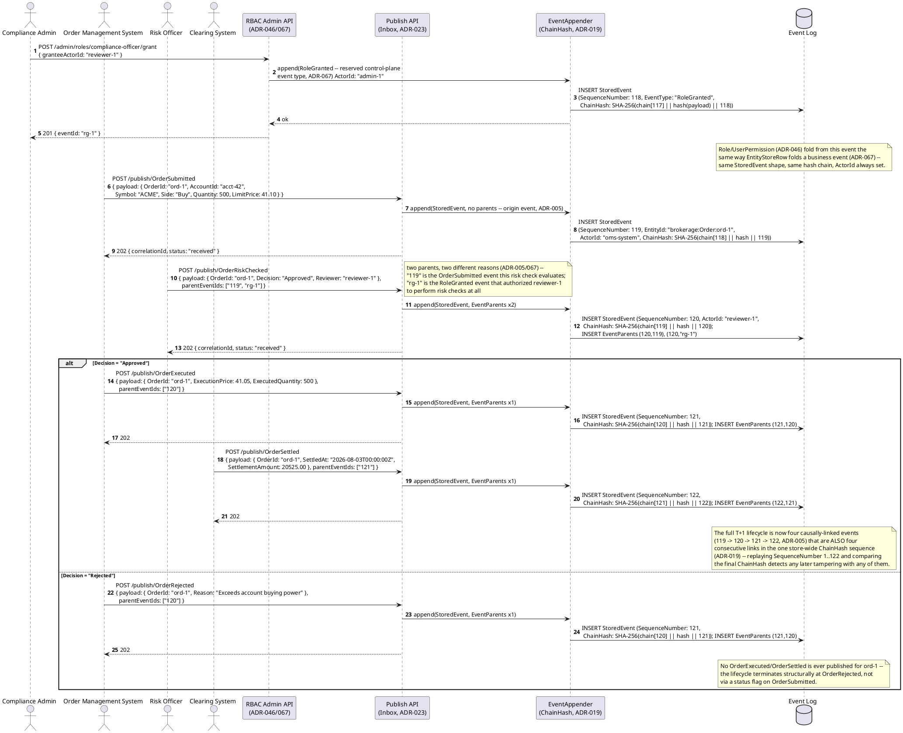
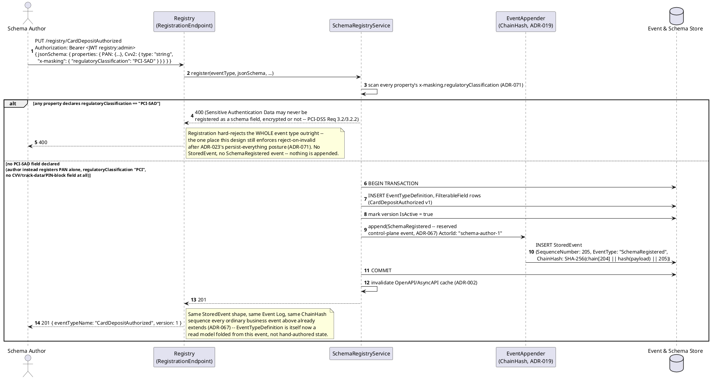
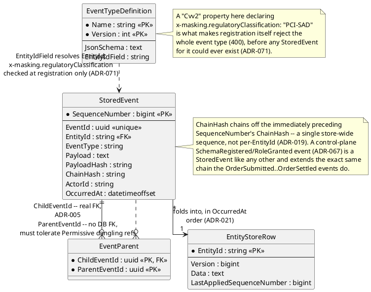
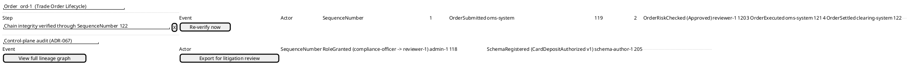

# Feature: Trade Order Lifecycle and Recordkeeping

Context: this doc exercises three ADRs together against one worked
example — a trade order moving `Submitted` → `RiskChecked` →
`Executed` → `Settled`. `ADR-019`
([`../../../adrs/adr-019-hash-chained-tamper-evidence.md`](../../../adrs/adr-019-hash-chained-tamper-evidence.md))
gives the store-wide `ChainHash` every one of this order's events
participates in, already confirmed (`ADR-071`) to satisfy SEC Rule
17a-4's broker-dealer recordkeeping audit-trail alternative with no new
mechanism. `ADR-071`
([`../../../adrs/adr-071-pci-sad-registration-boundary.md`](../../../adrs/adr-071-pci-sad-registration-boundary.md))
is exercised via a card-funded deposit schema registration that either
hard-rejects (a declared `PCI-SAD` field) or succeeds (an ordinary
masked PAN field only). `ADR-067`
([`../../../adrs/adr-067-control-plane-actions-as-reserved-events.md`](../../../adrs/adr-067-control-plane-actions-as-reserved-events.md))
supplies the reserved `RoleGranted`/`SchemaRegistered` control-plane
events, both landing in the *same* Event Log and hash chain as the
order's own business events. `ADR-005`
([`../../../adrs/adr-005-event-parenting-dag.md`](../../../adrs/adr-005-event-parenting-dag.md))'s
`parentEventIds` mechanism is what causally links each lifecycle step
to the one before it, and — per `ADR-067`'s own named example — links
a business event to the specific control-plane grant that authorized
the actor performing it. The full `StoredEvent` envelope shape is in
[`../../../data/event-log.md`](../../../data/event-log.md); the
`x-masking`/`regulatoryClassification` schema shape (including the
reserved `"PCI-SAD"` value) is in
[`../../../data/schema-registry.md`](../../../data/schema-registry.md).
This domain's own applicability of every ADR cited here is recorded in
[`../README.md`](../README.md)'s "Applicable ADRs" section — nothing
below invents a mechanism that section doesn't already list.

This doc deliberately does **not** re-derive:
- Ordinary property-level masking or `ADR-057` crypto-shredding
  mechanics for a full PAN (card number) field — that's `ADR-009`/
  `ADR-057`, already covered in
  [`../../../data/schema-registry.md`](../../../data/schema-registry.md)'s
  "Event-type security" section. A full PAN is **not** Sensitive
  Authentication Data and is unaffected by `ADR-071` — this doc only
  exercises the narrower SAD boundary itself.
- Row-level security / claims-check mechanics for traders, compliance,
  and back-office roles (`ADR-046`/`ADR-043`) — this doc's compliance
  officer scenario shows a role being *granted*, not the read-time
  claim check that role later satisfies.
- `ADR-045`'s separate `AccessLog` entity shape — mentioned only to
  contrast why control-plane *writes* (this doc) land in the same
  Event Log while access *reads* deliberately don't (`ADR-067`'s own
  stated reasoning, restated briefly below, not re-derived in depth).
- The general publish/schema-registration request/response mechanics
  already shown in `../../../features/publish-event.md` and
  `../../../features/schema-registry.md` — this doc only adds what's
  specific to a trade order's own event types and the `PCI-SAD`
  registration boundary.

Everywhere below uses the illustrative `AppId` `"brokerage"`, so
`EntityId`s look like `brokerage:Order:ord-1` (`ADR-021`'s
`{appId}:{entityType}:{uniqueId}` format).

## Sequence diagram — order lifecycle, causally linked and hash-chained end to end

Two mechanisms are deliberately in play at once here, and they answer
different questions (see `ADR-019`'s and `ADR-005`'s own
disambiguation): `ChainHash` is a single, store-wide sequential chain —
*every* `StoredEvent` ever appended extends it, business or
control-plane, regardless of `EntityId` — while `parentEventIds` is a
per-event, causal DAG scoped to whatever a specific event actually
derives from. This diagram shows both: a compliance officer's role
grant (`ADR-067`, reserved event) lands earlier in the *same* global
chain the order's own events extend, and the risk-check step names
*both* the order it evaluates and that role grant as parents — two
different parents, two different reasons, per `ADR-005`.



## Sequence diagram — schema registration and the PCI-SAD boundary

Registering `CardDepositAuthorized` (a card-funded account deposit)
is where `ADR-071`'s boundary bites: a schema author who declares a
`Cvv2` field with `x-masking.regulatoryClassification: "PCI-SAD"` gets
a hard `400` at registration — before any `StoredEvent` for that type
could ever exist — while the same event type registered *without* a
SAD field succeeds normally and, per `ADR-067`, also appends a
reserved `SchemaRegistered` control-plane event into the same Event
Log and hash chain the order lifecycle above extends.



Full PAN remains fully covered by ordinary masking (`ADR-009`) and
crypto-shredding (`ADR-057`) — not re-derived here (see Context).
`ADR-045`'s separate `AccessLog` is the opposite storage choice from
`SchemaRegistered` above deliberately, not inconsistently: reads
vastly outnumber writes and don't causally cause anything, so they get
their own store, while this control-plane write is structurally
identical to any other event and benefits from participating in the
same lineage DAG (`ADR-067`'s own stated reasoning).

## Data model (ER diagram)



Full column lists are in
[`../../../data/event-log.md`](../../../data/event-log.md) (`StoredEvent`,
`EventParent`) and
[`../../../data/schema-registry.md`](../../../data/schema-registry.md)
(`EntityStoreRow`, `EventTypeDefinition`) — this diagram, and the
sketch below, show only the fields this doc's scenarios actually
touch:

```csharp
// Subset only -- canonical definitions in ../../../data/event-log.md
// and ../../../data/schema-registry.md; not redefined here.
public class StoredEvent
{
    public long SequenceNumber { get; set; }             // global arrival order -- the ONE sequence ChainHash chains across, not per-EntityId (ADR-019)
    public string EntityId { get; set; } = default!;      // "brokerage:Order:ord-1" -- {appId}:{entityType}:{uniqueId} (ADR-021)
    public string EventType { get; set; } = default!;      // "OrderSubmitted" | "OrderRiskChecked" | "OrderExecuted" | "OrderRejected" | "OrderSettled" | "RoleGranted" | "SchemaRegistered" (ADR-067's reserved control-plane types)
    public string PayloadHash { get; set; } = default!;     // ADR-011
    public string ChainHash { get; set; } = default!;       // SHA-256(prior ChainHash || PayloadHash || SequenceNumber) (ADR-019)
    public string ActorId { get; set; } = default!;          // verified caller identity, ALWAYS populated (ADR-064) -- "reviewer-1", "schema-author-1", "admin-1", "oms-system", ...
}

public class EventParent
{
    public Guid ChildEventId { get; set; }    // e.g. OrderExecuted's EventId
    public Guid ParentEventId { get; set; }   // e.g. OrderRiskChecked's EventId, or a RoleGranted control-plane event's EventId (ADR-067)
}
```

## Salt (UI mockup)

A compliance/back-office order-history screen: the lifecycle timeline
with a chain-integrity badge, plus a control-plane audit panel showing
the reserved events from both sequence diagrams above landing in the
same log.



The chain-integrity badge is a display of `GET /events/verify` (`ADR-019`)
re-run through this order's own `SequenceNumber` range, not a
per-entity mechanism of its own. "Export for litigation review" reuses
`ADR-068`'s lineage export/manifest mechanism unchanged — not built out
further in this doc (see Context).

## Gherkin

```gherkin
Feature: Trade Order Lifecycle and Recordkeeping
  As a broker-dealer's compliance/back-office function
  I want a trade order's Submitted/RiskChecked/Executed/Settled steps causally
    linked and hash-chained end to end, and PCI-SAD payment data kept out of
    the log entirely
  So that SEC Rule 17a-4 recordkeeping is satisfiable from the Event Log alone,
    and a card-funded deposit's authentication secrets can never be persisted

  # Every request below carries a Bearer token with sufficient scope
  # (events:publish for order events, registry:admin for schema registration,
  # a narrow RBAC-admin scope for role grants) unless a scenario says
  # otherwise. See ../../../features/auth.md for authentication/authorization
  # behavior itself -- not re-derived here.

  Background:
    Given the event type "OrderSubmitted" version 1 is registered with ChangeKind "Full" and EntityIdField "$.OrderId" and schema:
      """
      {
        "type": "object",
        "properties": { "OrderId": { "type": "string" }, "AccountId": { "type": "string" }, "Symbol": { "type": "string" }, "Side": { "type": "string" }, "Quantity": { "type": "number" }, "LimitPrice": { "type": "number" } },
        "required": ["OrderId", "AccountId", "Symbol", "Side", "Quantity"]
      }
      """
    And the event type "OrderRiskChecked" version 1 is registered with ChangeKind "Partial" and EntityIdField "$.OrderId" and schema:
      """
      {
        "type": "object",
        "properties": { "OrderId": { "type": "string" }, "Decision": { "type": "string" }, "Reviewer": { "type": "string" } },
        "required": ["OrderId", "Decision"]
      }
      """
    And the event type "OrderExecuted" version 1 is registered with ChangeKind "Partial" and EntityIdField "$.OrderId" and schema:
      """
      { "type": "object", "properties": { "OrderId": { "type": "string" }, "ExecutionPrice": { "type": "number" }, "ExecutedQuantity": { "type": "number" } }, "required": ["OrderId"] }
      """
    And the event type "OrderRejected" version 1 is registered with ChangeKind "Partial" and EntityIdField "$.OrderId" and schema:
      """
      { "type": "object", "properties": { "OrderId": { "type": "string" }, "Reason": { "type": "string" } }, "required": ["OrderId", "Reason"] }
      """
    And the event type "OrderSettled" version 1 is registered with ChangeKind "Partial" and EntityIdField "$.OrderId" and schema:
      """
      { "type": "object", "properties": { "OrderId": { "type": "string" }, "SettledAt": { "type": "string" }, "SettlementAmount": { "type": "number" } }, "required": ["OrderId"] }
      """
    And the role "compliance-officer" is granted to actor "reviewer-1", recorded as a "RoleGranted" event "rg-1"
      # RoleGranted is a reserved, platform-level event type (ADR-067) -- no
      # operator registers it via PUT /registry/{event-type}; it exists the
      # same way EventUpcastFailed (ADR-020) already does.

  Scenario: A trade order's full lifecycle is causally linked and lands in the one hash chain
    When I POST to "/publish/OrderSubmitted" for AppId "brokerage" with body:
      """
      { "payload": { "OrderId": "ord-1", "AccountId": "acct-42", "Symbol": "ACME", "Side": "Buy", "Quantity": 500, "LimitPrice": 41.10 } }
      """
    Then the response status should be 202 with EntityId "brokerage:Order:ord-1"
    When actor "reviewer-1" POSTs to "/publish/OrderRiskChecked" with body:
      """
      { "payload": { "OrderId": "ord-1", "Decision": "Approved", "Reviewer": "reviewer-1" }, "parentEventIds": ["<OrderSubmitted eventId>", "rg-1"] }
      """
    Then the response status should be 202
    And the stored event's parents should be exactly ["<OrderSubmitted eventId>", "rg-1"]
    # Two parents, two different reasons (ADR-005): the order this risk check
    # evaluates, and the RoleGranted event that authorized reviewer-1 to
    # perform the check at all -- ADR-067's own named example of linking a
    # business event to the control-plane grant that authorized it.
    When I POST to "/publish/OrderExecuted" with body:
      """
      { "payload": { "OrderId": "ord-1", "ExecutionPrice": 41.05, "ExecutedQuantity": 500 }, "parentEventIds": ["<OrderRiskChecked eventId>"] }
      """
    And I POST to "/publish/OrderSettled" with body:
      """
      { "payload": { "OrderId": "ord-1", "SettledAt": "2026-08-03T00:00:00Z", "SettlementAmount": 20525.00 }, "parentEventIds": ["<OrderExecuted eventId>"] }
      """
    Then all four events (OrderSubmitted, OrderRiskChecked, OrderExecuted, OrderSettled) should be ancestors/descendants of each other per the Lineage API
    And GET "/events/verify?throughSequenceNumber=<OrderSettled's SequenceNumber>" should report no divergence
    # ChainHash is a single, store-wide sequence (ADR-019) -- the same
    # verification call already covers every event in the store, business or
    # control-plane, not just this one order. This is the mechanism ADR-071
    # confirms already satisfies SEC Rule 17a-4's audit-trail alternative.

  Scenario: A risk-check rejection stops the lifecycle before execution, structurally
    Given an "OrderSubmitted" event was published for "ord-2" with body { "OrderId": "ord-2", "AccountId": "acct-42", "Symbol": "ACME", "Side": "Buy", "Quantity": 50000, "LimitPrice": 41.10 }
    When actor "reviewer-1" POSTs to "/publish/OrderRiskChecked" with body:
      """
      { "payload": { "OrderId": "ord-2", "Decision": "Rejected", "Reviewer": "reviewer-1" }, "parentEventIds": ["<OrderSubmitted eventId>", "rg-1"] }
      """
    And I POST to "/publish/OrderRejected" with body:
      """
      { "payload": { "OrderId": "ord-2", "Reason": "Exceeds account buying power" }, "parentEventIds": ["<OrderRiskChecked eventId>"] }
      """
    Then the response status should be 202
    And no "OrderExecuted" or "OrderSettled" event should ever exist for "ord-2"
    # ADR-023's persist-everything posture means OrderRejected is never
    # blocked or retried -- it terminates the lifecycle by simply being the
    # last event ord-2 ever receives, not by flipping a status flag.

  Scenario: Registering an event type with a field declared PCI-SAD is hard-rejected at registration
    When I PUT "/registry/CardDepositAuthorized" with body:
      """
      {
        "jsonSchema": {
          "type": "object",
          "properties": {
            "PAN": { "type": "string", "x-masking": { "requiredClaim": "clearance:pci", "strategy": "PartialReveal", "regulatoryClassification": "PCI" } },
            "Cvv2": { "type": "string", "x-masking": { "regulatoryClassification": "PCI-SAD" } }
          },
          "required": ["PAN", "Cvv2"]
        }
      }
      """
    Then the response status should be 400
    And "CardDepositAuthorized" should not exist as a registered event type at any version
    And no "SchemaRegistered" event should be appended to the Event Log
    # PCI-DSS Requirement 3.2/3.2.2 bars persisting SAD after authorization
    # even encrypted -- ADR-009's masking and ADR-057's crypto-shredding both
    # still write the real value to Payload first, which this rule already
    # prohibits regardless of what happens afterward (ADR-071). This is the
    # one place after ADR-023 that registration still rejects outright.

  Scenario: Registering the same event type without a PCI-SAD field succeeds and emits a reserved control-plane event
    When I PUT "/registry/CardDepositAuthorized" with body:
      """
      {
        "jsonSchema": {
          "type": "object",
          "properties": {
            "PAN": { "type": "string", "x-masking": { "requiredClaim": "clearance:pci", "strategy": "PartialReveal", "regulatoryClassification": "PCI" } }
          },
          "required": ["PAN"]
        },
        "filterableFields": []
      }
      """
    Then the response status should be 201
    And "CardDepositAuthorized" version 1 should be the active version
    And a "SchemaRegistered" event should be appended to the Event Log with ActorId equal to the registering caller's identity
    And that event's ChainHash should extend the same chain sequence the trade order's own events extend
    # Full PAN is not SAD -- ordinary masking/crypto-shredding (ADR-009/057)
    # covers it exactly like any other classified field. SchemaRegistered
    # lands in the SAME Event Log as OrderSubmitted et al. (ADR-067),
    # deliberately unlike ADR-045's separate AccessLog for reads.

  Scenario: A role grant is itself a reserved event, foldable and linkable like any other
    When actor "admin-1" POSTs to "/admin/roles/compliance-officer/grant" with body:
      """
      { "granteeActorId": "reviewer-2" }
      """
    Then the response status should be 201
    And a "RoleGranted" event should be appended to the Event Log with ActorId "admin-1"
    And a "Role" read model row for "compliance-officer" should list "reviewer-2" among its grantees
    # Role/UserPermission fold from this event the same way EntityStoreRow
    # folds a business event (ADR-067) -- no separate RBAC-state table
    # exists outside what this event produces.
```
