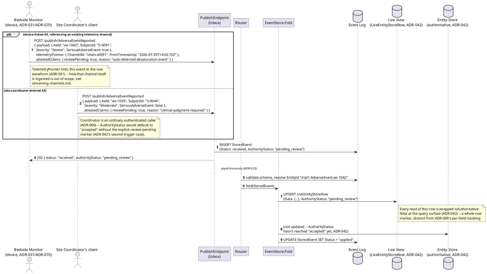
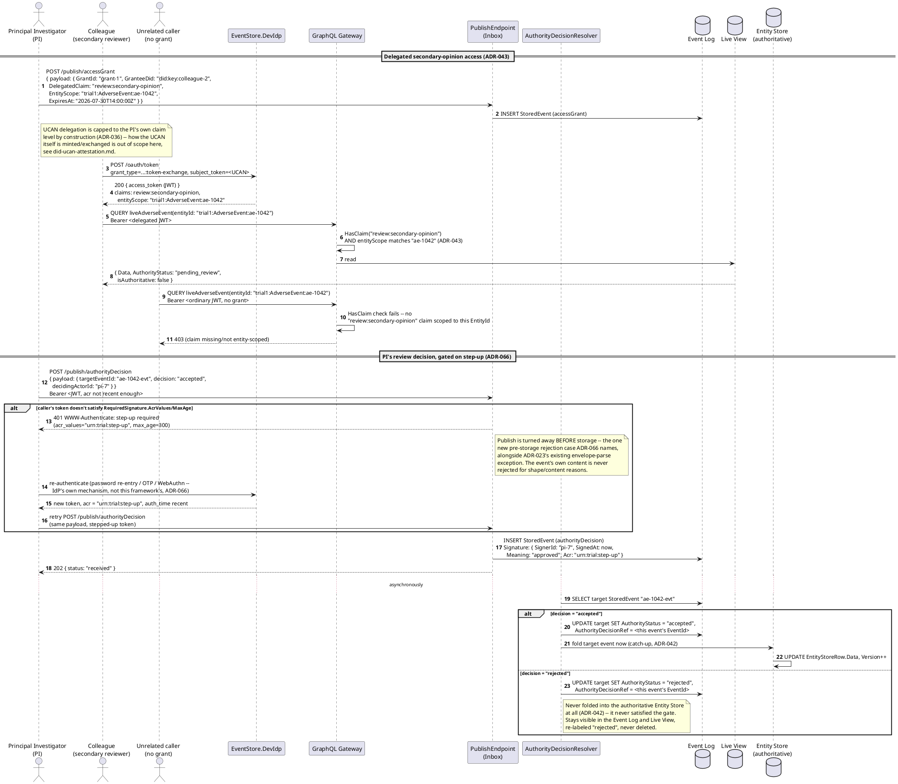
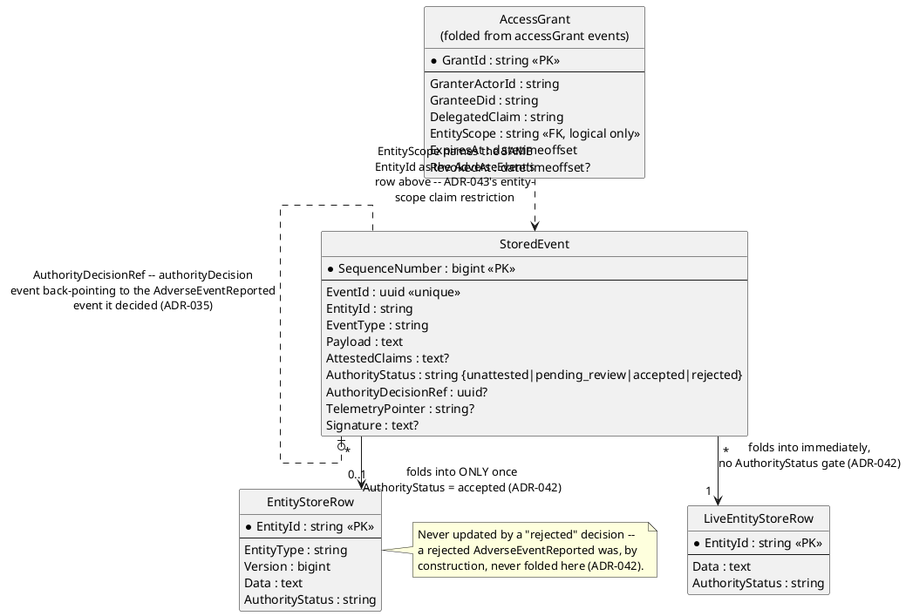
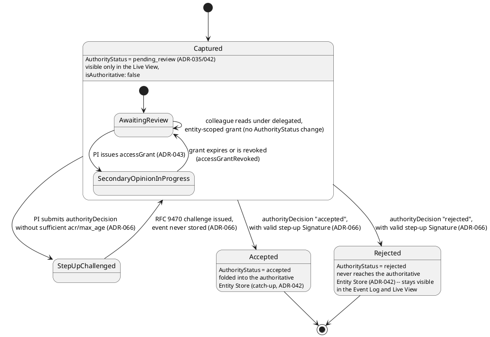
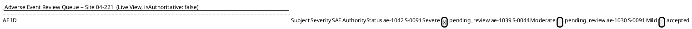
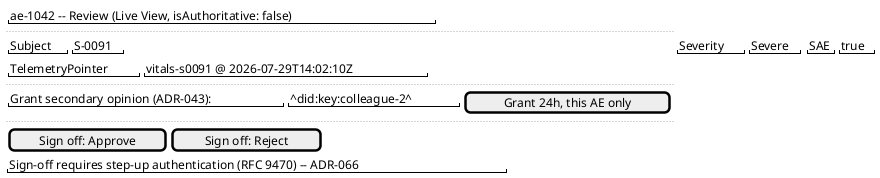
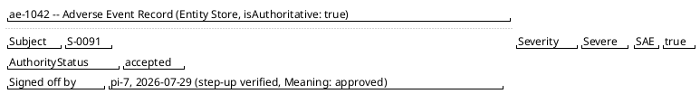

# Feature: Adverse Event Capture and Review

Context: this doc exercises four ADRs together against one concrete
workflow — a device reading or site-entered adverse-event (AE) result
flowing from capture to an accepted, signed-off record. `ADR-035`/
`ADR-042` govern the capture-then-review trust axis (`AuthorityStatus`,
the gated authoritative Entity Store vs. the ungated Live View);
`ADR-043` governs the Principal Investigator (PI) delegating capped,
entity-scoped, time-boxed "secondary opinion" read access to a
colleague — this domain's own `../README.md` ("Applicable ADRs") names
this exact scenario; `ADR-066` governs the PI's Case Report Form (CRF)
sign-off decision, gated behind an RFC 9470 step-up challenge and
recorded as an envelope `Signature`. `ADR-031` (device telemetry via
`TelemetryPointer`) and `ADR-009` (PHI masking) are exercised where the
AE originates from a connected monitor or carries subject-identifying
data, per this domain's secondary-fit ADR list. Envelope/entity shapes
are defined in [`../../../data/event-log.md`](../../../data/event-log.md)
(`StoredEvent`, `Signature`), [`../../../data/entity-store.md`](../../../data/entity-store.md)
(`EntityStoreRow`, `LiveEntityStoreRow`), and
[`../../../data/schema-registry.md`](../../../data/schema-registry.md)
(`EventTypeDefinition.RequiredSignature`, `RequiredReadClaim`'s
entity-scope extension).

This doc deliberately does **not** re-derive:
- **UCAN/DID delegation and Token Exchange mechanics themselves**
  (`ADR-036`) — how a delegated capability is issued, self-verified, and
  exchanged for a bearer JWT via `POST /oauth/token` is covered end to
  end in [`../../../features/did-ucan-attestation.md`](../../../features/did-ucan-attestation.md).
  This doc only shows `ADR-043`'s *new use* of that mechanism (an
  entity-scoped, capped grant between two known, connected users), never
  the disconnected-capture case that doc already owns.
- **`ChainHash` tamper-evidence mechanics** (`ADR-019`) — see
  [`../../../data/event-log.md`](../../../data/event-log.md)'s "Tamper
  evidence" section. A signed `authorityDecision` event is exactly as
  tamper-evident as any other `StoredEvent`, not a separately-secured
  artifact; this doc doesn't re-explain the chaining.
- **The `{value}`/`{masked}`/`{erased}` masking wrapper mechanics**
  (`ADR-009`) — see [`../../../features/masking.md`](../../../features/masking.md).
  This doc only notes *where* `SubjectId`/PHI fields would carry
  `x-masking` in the AE payload; it doesn't re-derive the wrapper or the
  `FixedValue` strategy itself.
- **Streaming-channel ingestion mechanics** (`ADR-031`) — batch
  ingestion, `Origin`/`Derived` channels, and how a `TelemetryPointer`
  is formed are covered in
  [`../../../features/streaming-channels.md`](../../../features/streaming-channels.md).
  This doc only shows a device-linked AE event carrying an already-formed
  `TelemetryPointer`, never how the underlying channel itself is
  provisioned or ingested into.
- **The general `RequiredPublishClaim`/`RequiredReadClaim` check and
  ordinary bearer-token auth** (`ADR-006`/`ADR-008`) — see
  [`../../../features/event-security.md`](../../../features/event-security.md)
  and [`../../../features/auth.md`](../../../features/auth.md). This doc
  only exercises `ADR-043`'s *entity-scope* extension to that check
  ("does the caller have this claim, *and* does it apply to this
  `EntityId`"), not the claim-check mechanism generally.

Every event type below is registered under `AppId` `"trial1"`
(`ADR-030`); `EntityId` format is `{appId}:{entityType}:{uniqueId}`
(`ADR-021`) — scenarios use `trial1:AdverseEvent:ae-1042` throughout.

## Sequence diagram — non-authoritative capture, device-linked and site-entered

Both branches persist immediately (`ADR-023`) and land in the ungated
Live View right away; neither reaches the authoritative Entity Store
yet, per `ADR-042`'s gate. The only difference between the two is *why*
`AuthorityStatus` starts below `accepted` — a device/detector's own
uncertainty (an explicit review-pending marker) vs. a site coordinator's
own request for clinical judgment before this counts as a real trial
finding.



## Sequence diagram — secondary opinion, then signed-off review decision

Shows `ADR-043`'s delegated, entity-scoped grant; a caller lacking that
grant failing the entity-scope check; and the PI's own review decision —
gated behind `ADR-066`'s RFC 9470 step-up challenge, with `alt` branches
for insufficient vs. satisfied step-up, then `accepted` vs. `rejected`.



## Data model (ER diagram)



Full column lists are in
[`../../../data/event-log.md`](../../../data/event-log.md) and
[`../../../data/entity-store.md`](../../../data/entity-store.md) — this
diagram shows only what this workflow's own events read/write.

```csharp
// AdverseEventReported payload -- EntityIdField "$.AeId" (ADR-021),
// ChangeKind Full, RejectionBehavior Annotate (default, ADR-035) --
// a rejected AE was never folded into the authoritative Entity Store
// in the first place (ADR-042), so there's nothing to compensate.
public class AdverseEventReportedPayload
{
    public string AeId { get; set; } = default!;
    public string SubjectId { get; set; } = default!;     // PHI -- x-masking-classified in the real schema (ADR-009), not shown here
    public string SiteId { get; set; } = default!;
    public string Description { get; set; } = default!;
    public string Severity { get; set; } = default!;       // Mild | Moderate | Severe
    public bool SeriousAdverseEvent { get; set; }           // SAE flag -- glossary term, triggers expedited handling out of this doc's scope
    public string? CausalityAssessment { get; set; }        // investigator's clinical judgment -- typically filled in at review, not at capture
}

// authorityDecision payload -- this AppId's registration of the type
// adds RequiredSignature (ADR-066); the shape itself is the same
// {targetEventId, decision, decidingActorId, reason} ADR-035 already defines.
public class AuthorityDecisionPayload
{
    public string TargetEventId { get; set; } = default!;  // the AdverseEventReported event's EventId
    public string Decision { get; set; } = default!;        // accepted | rejected
    public string DecidingActorId { get; set; } = default!; // the PI's ActorId (ADR-064)
    public string? Reason { get; set; }
}

// accessGrant payload -- ADR-043's "secondary opinion" delegation, recorded
// as an ordinary event so issuance is auditable/queryable/never deleted.
public class AccessGrantPayload
{
    public string GrantId { get; set; } = default!;
    public string GranteeDid { get; set; } = default!;
    public string DelegatedClaim { get; set; } = default!;  // e.g. "review:secondary-opinion" -- capped to what the PI's own token already holds
    public string EntityScope { get; set; } = default!;      // the one EntityId this grant applies to -- never blanket
    public DateTimeOffset ExpiresAt { get; set; }
}

// AdverseEventRecord -- the shape EntityStoreRow.Data/LiveEntityStoreRow.Data
// actually holds once AdverseEventReported events fold (../../../data/entity-store.md).
public class AdverseEventRecord
{
    public string AeId { get; set; } = default!;
    public string SubjectId { get; set; } = default!;
    public string SiteId { get; set; } = default!;
    public string Description { get; set; } = default!;
    public string Severity { get; set; } = default!;
    public bool SeriousAdverseEvent { get; set; }
    public string? CausalityAssessment { get; set; }
}
```

## State machine — `AdverseEventRecord` lifecycle



`StepUpChallenged` is not itself a persisted `AuthorityStatus` value —
it represents the pre-storage rejection `ADR-066` names, where the
`authorityDecision` publish never reaches the Event Log at all until the
PI's token satisfies the configured `RequiredSignature`.

## Salt (UI mockup) — capture-to-decision user flow, across the PI's queue, detail, and confirmed-record screens

### Screen 1: Non-authoritative Live View — adverse event review queue



Every row comes from the Live View, not the authoritative Entity Store —
`ae-1042`/`ae-1039` are still `pending_review` and would not appear at all
if this screen only read `EntityStoreRow` (`ADR-042`). The
`isAuthoritative: false` marker is shown once, at the whole-view level,
per `ADR-042`'s wrapper convention — never a per-row/per-field flag.
Clicking the `ae-1042` row opens Screen 2, the detail/decision view for
that one event.

### Screen 2: Clinical reviewer's review and decision screen



**Grant 24h, this AE only** publishes an `ADR-043` `accessGrant`,
entity-scoped to exactly `trial1:AdverseEvent:ae-1042`, without changing
this record's `AuthorityStatus`. Clicking **Sign off: Approve** dispatches
the `authorityDecision` publish; a token that doesn't already satisfy the
required `acr`/`max_age` triggers a redirect through the IdP before the
click actually completes — only then does the flow move to Screen 3.

### Screen 3: Confirmed record, after the authoritative catch-up fold



This is the same `trial1:AdverseEvent:ae-1042` record, now read from the
authoritative Entity Store rather than the Live View, folded there by the
same catch-up mechanism `ADR-042` uses once `AuthorityStatus` reaches
`accepted`. A **Sign off: Reject** decision instead never reaches this
screen at all — the record stays visible only on Screen 1/2, re-labeled
`rejected`, never deleted.

## Gherkin

```gherkin
Feature: Adverse Event Capture and Review
  As a clinical trial site
  I want a device- or coordinator-reported adverse event to be visible immediately but not authoritative until reviewed
  And a Principal Investigator to be able to delegate a capped secondary-opinion read to a colleague
  And the PI's own accept/reject decision to require a signed, step-up-authenticated sign-off before it counts as final
  So that unreviewed clinical findings are never silently hidden, never silently trusted, and every final decision is attributable and tamper-evident

  # AppId "trial1" throughout (ADR-030); EntityId format
  # {appId}:{entityType}:{uniqueId} (ADR-021). Every request carries an
  # ordinary Bearer token with events:publish/events:follow scopes
  # (auth.md) unless a scenario says otherwise -- AuthorityStatus is a
  # separate trust axis from that scope check (ADR-035's closing note).

  Background:
    Given the event type "AdverseEventReported" version 1 is registered with EntityIdField "$.AeId", ChangeKind "Full", RejectionBehavior "Annotate" and schema:
      """
      {
        "type": "object",
        "properties": {
          "AeId": { "type": "string" },
          "SubjectId": { "type": "string" },
          "SiteId": { "type": "string" },
          "Description": { "type": "string" },
          "Severity": { "type": "string" },
          "SeriousAdverseEvent": { "type": "boolean" },
          "CausalityAssessment": { "type": "string" }
        },
        "required": ["AeId", "SubjectId", "Severity", "SeriousAdverseEvent"]
      }
      """
    And the event type "authorityDecision" version 1 is registered with EntityIdField "$.targetEventId" and RequiredSignature { "AcrValues": ["urn:trial:step-up"], "MaxAge": 300 }
    And the event type "accessGrant" version 1 and "accessGrantRevoked" version 1 are registered with EntityIdField "$.GrantId"
    And "pi-7" is the Principal Investigator for site "04-221", holding claim "review:ae"
    And "colleague-2" holds DID "did:key:colleague-2" with no standing claim on any adverse event

  Scenario: A device-linked adverse event is captured non-authoritatively, carrying a TelemetryPointer
    When a "AdverseEventReported" event is published for "ae-1042" with body { "AeId": "ae-1042", "SubjectId": "S-0091", "Severity": "Severe", "SeriousAdverseEvent": true }, a TelemetryPointer to channel "vitals-s0091", and AttestedClaims { "reviewPending": true, "reason": "auto-detected desaturation event" }
    Then the response status should be 202 with authorityStatus "pending_review"
    And querying the Live View for "trial1:AdverseEvent:ae-1042" should return Severity "Severe", wrapped "isAuthoritative": false
    And querying the authoritative Entity Store for "trial1:AdverseEvent:ae-1042" should NOT yet reflect this event
    # The device's own uncertainty about its detection is what starts
    # AuthorityStatus below "accepted" here -- ADR-042's "automated
    # detector" trigger case, not an identity/permission problem.

  Scenario: A site-coordinator-entered adverse event also starts pending_review, via an explicit marker
    When an authenticated coordinator publishes "AdverseEventReported" for "ae-1039" with body { "AeId": "ae-1039", "SubjectId": "S-0044", "Severity": "Moderate", "SeriousAdverseEvent": false } and AttestedClaims { "reviewPending": true, "reason": "clinical-judgment-required" }
    Then the response status should be 202 with authorityStatus "pending_review"
    # Without the explicit marker this would default to "accepted"
    # (ADR-042) -- ADR-006 already verified this coordinator's identity
    # and permission synchronously; the marker is what declares a
    # separate reason not to trust it as final yet.

  Scenario: The PI delegates capped, entity-scoped, time-boxed secondary-opinion access to a colleague
    When "pi-7" publishes an "accessGrant" event { "GrantId": "grant-1", "GranteeDid": "did:key:colleague-2", "DelegatedClaim": "review:secondary-opinion", "EntityScope": "trial1:AdverseEvent:ae-1042", "ExpiresAt": "2026-07-30T14:00:00Z" }
    Then the response status should be 202
    And the grant should be scoped to exactly "trial1:AdverseEvent:ae-1042", not every adverse event at site "04-221"
    # UCAN validation rejects any attempt to delegate a claim "pi-7"
    # doesn't itself hold, or to widen the entity scope (ADR-036/ADR-043)
    # -- not re-verified here, see did-ucan-attestation.md.

  Scenario: The colleague exchanges the delegation for a bearer JWT and reads the AE record under the delegated, entity-scoped claim
    Given "colleague-2" holds a UCAN delegation for "review:secondary-opinion" scoped to "trial1:AdverseEvent:ae-1042", per above
    When "colleague-2" exchanges it via "POST /oauth/token" (token-exchange grant type)
    And queries the Live View for "trial1:AdverseEvent:ae-1042" using the resulting bearer JWT
    Then the read should succeed, returning AuthorityStatus "pending_review", wrapped "isAuthoritative": false

  Scenario: A caller without the grant cannot read the same adverse event, even holding an ordinary valid token
    Given no accessGrant exists naming any DID other than "did:key:colleague-2" for "trial1:AdverseEvent:ae-1042"
    When an unrelated authenticated caller queries the Live View for "trial1:AdverseEvent:ae-1042"
    Then the request should fail with a claim-missing/entity-scope error
    # The check is "does the caller have this claim, AND does it apply
    # to this EntityId" (ADR-043) -- an ordinary caller has neither.

  Scenario: Revoking the grant ends the colleague's access before its natural expiration
    Given "colleague-2" holds an active, unexpired grant for "trial1:AdverseEvent:ae-1042", per above
    When "pi-7" publishes an "accessGrantRevoked" event { "GrantId": "grant-1" }
    Then a subsequent read attempt by "colleague-2" using a token issued after revocation should fail
    # Revocation relies on the IdP actually checking revocation status at
    # exchange/introspection time, not just the UCAN's own exp (ADR-043).

  Scenario: The PI's review decision without sufficient step-up authentication is challenged, not stored
    Given the adverse event "ae-1042" is still "pending_review"
    And "pi-7"'s current token carries no "urn:trial:step-up" acr, or one older than 300 seconds
    When "pi-7" attempts to POST "/publish/authorityDecision" with body { "targetEventId": "ae-1042's event id", "decision": "accepted", "decidingActorId": "pi-7" }
    Then the response should be an RFC 9470 step-up challenge naming acr_values "urn:trial:step-up" and max_age 300
    And no authorityDecision event should be persisted
    # The one case where a publish is legitimately turned away before
    # storage besides an unparseable envelope (ADR-066's Consequences) --
    # the AE's own data is never rejected for shape/content reasons.

  Scenario: The PI signs off "accepted" after stepping up, and the authoritative Entity Store catches up
    Given "pi-7" has re-authenticated and now holds a token with acr "urn:trial:step-up", authenticated within the last 300 seconds
    When "pi-7" retries POST "/publish/authorityDecision" with the same body, decision "accepted"
    Then the response status should be 202
    And the stored authorityDecision event should carry Signature { SignerId: "pi-7", Meaning: "approved", Acr: "urn:trial:step-up" }
    And eventually the target event "ae-1042" should have AuthorityStatus "accepted"
    And eventually the authoritative Entity Store for "trial1:AdverseEvent:ae-1042" should reflect Severity "Severe"
    # The Entity Store catch-up is the same "apply once, on the
    # triggering condition" shape ADR-027's materialization catch-up
    # already uses (ADR-042) -- not a new fold mechanism.

  Scenario: The PI signs off "rejected" instead, and the record never reaches the authoritative Entity Store
    Given the adverse event "ae-1039" is still "pending_review"
    And "pi-7" holds a valid step-up token, per above
    When "pi-7" POSTs "/publish/authorityDecision" with body { "targetEventId": "ae-1039's event id", "decision": "rejected", "decidingActorId": "pi-7", "reason": "duplicate report, same episode as ae-1030" }
    Then the response status should be 202
    And the stored authorityDecision event should still carry Signature { SignerId: "pi-7", Meaning: "reviewed", Acr: "urn:trial:step-up" }
    And the target event "ae-1039" should have AuthorityStatus "rejected"
    And the authoritative Entity Store should never reflect "ae-1039"'s data
    And "ae-1039" should remain visible in the Live View, re-labeled "rejected", never deleted
    # RejectionBehavior "Annotate" (Background) means the Payload itself
    # is untouched -- there is nothing to compensate, since a rejected
    # event was never folded into the authoritative store to begin with
    # (ADR-042).
```
