# Feature: Device Onboarding and Continuous Monitoring

Context: this is Workflow B's **upstream half** — the other half already
exists as
[`adverse-event-capture-and-review.md`](adverse-event-capture-and-review.md)'s
device-linked capture branch. This doc shows how a connected bedside
monitor gets paired to a patient in the first place (`ADR-070`'s
`IDeviceInputSource` seam — `WebHidInputSource` for Chromium,
`NativeBridgeInputSource` for Firefox/Safari) and how its continuous
vitals stream is provisioned and ingested (`ADR-031`'s `TelemetryChannel`/
`TelemetrySample`), ending at the exact moment a detector escalates an
anomaly into the `AdverseEventReported` publish that doc's own sequence
diagram already opens with. **This doc does not rewrite that doc** — it
is a true prequel, cross-linked in prose, ending where that doc begins.

**Continuity note**: the patient is `S-0091` (`trial1:Patient:S-0091`,
enrolled in
[`patient-enrollment-and-informed-consent.md`](patient-enrollment-and-informed-consent.md)),
the device is the same `"Bedside Monitor"` actor
`adverse-event-capture-and-review.md`'s sequence diagram already names,
and the `TelemetryChannel` this doc provisions is `ChannelId`
`"vitals-s0091"` — the *exact* channel that doc's device-linked
`AdverseEventReported` publish already references via its
`TelemetryPointer`. Nothing about this doc invents a new identifier that
doc doesn't already assume exists.

This doc deliberately does **not** re-derive:
- **Streaming-channel ingestion internals** (batch shapes, late-arrival
  flagging, lag detection, redaction) — fully owned by
  [`../../../features/streaming-channels.md`](../../../features/streaming-channels.md).
  This doc shows only enough ingestion to motivate the detector's
  eventual publish, not the mechanism itself.
- **`ADR-042`'s gated-authoritative-publish/Live View fold mechanics for
  the resulting adverse event** — fully owned by
  `adverse-event-capture-and-review.md`. This doc stops at the `202`
  response from the `AdverseEventReported` publish; it does not re-show
  what happens to that event afterward.
- **`ADR-009`'s masking wrapper mechanics** — see
  [`../../../features/masking.md`](../../../features/masking.md).
- **WebUSB, Web Serial, and Web Bluetooth pairing in detail** — `ADR-070`
  defines five adapters total; this doc shows the two most representative
  for a bedside monitor (`WebHidInputSource`, the common case for a
  HID-class medical peripheral, and `NativeBridgeInputSource`, the
  Firefox/Safari fallback) rather than all five, to keep the diagram
  legible. The other three adapters exist and are chosen the same way —
  by the device's own physical interface, per `ADR-070`.

Every event type below is registered under `AppId` `"trial1"`
(`ADR-030`); `EntityId` format is `{appId}:{entityType}:{uniqueId}`
(`ADR-021`) — this doc introduces `trial1:Device:dev-0091`, paired to the
already-enrolled `trial1:Patient:S-0091`.

## Sequence diagram — device pairing (ADR-070), Chromium and native-bridge fallback

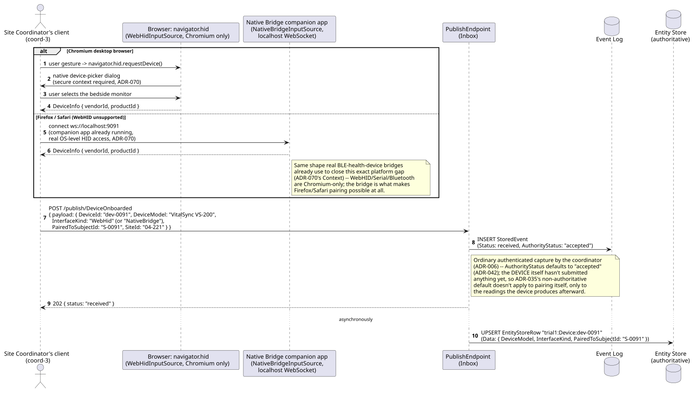

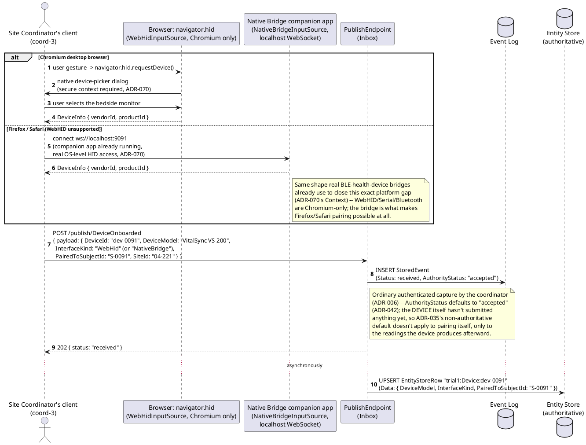

## Sequence diagram — channel provisioning, continuous ingestion, and detector escalation

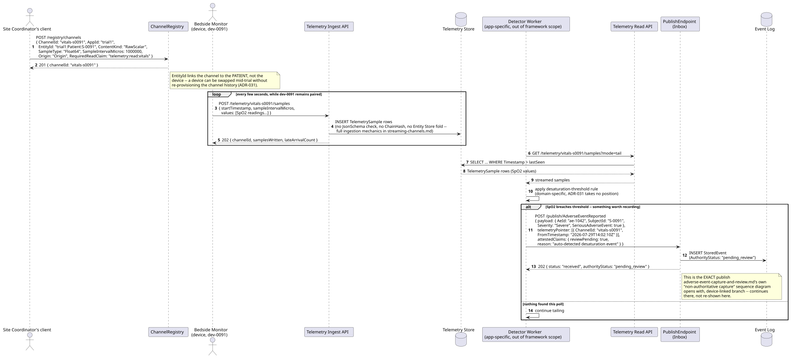

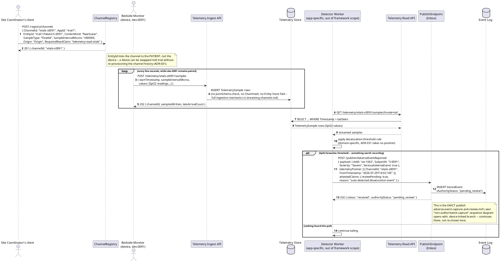

## Data model (ER diagram)

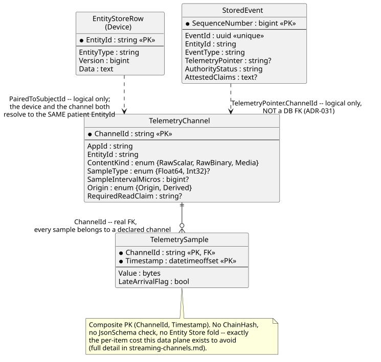

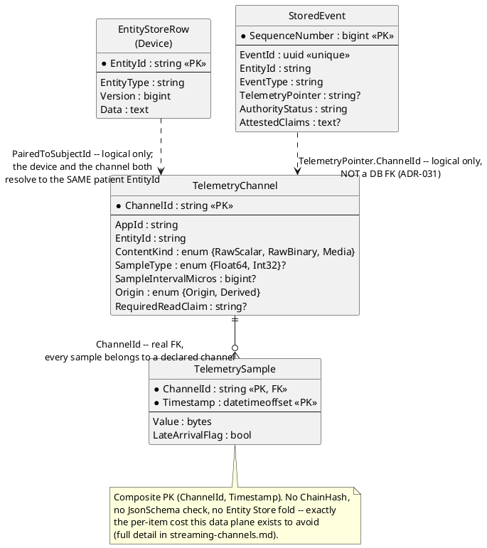

Full column lists are in
[`../../../data/entity-store.md`](../../../data/entity-store.md) and
[`../../../data/streaming-and-attachments.md`](../../../data/streaming-and-attachments.md)
— this diagram shows only what pairing, provisioning, and detector
escalation actually touch.

```csharp
// DeviceOnboarded payload -- EntityIdField "$.DeviceId" (ADR-021),
// ChangeKind Full, RejectionBehavior Annotate (default, ADR-035).
public class DeviceOnboardedPayload
{
    public string DeviceId { get; set; } = default!;         // "dev-0091"
    public string DeviceModel { get; set; } = default!;
    public string InterfaceKind { get; set; } = default!;     // WebUsb | WebHid | WebSerial | WebBluetooth | NativeBridge (ADR-070)
    public string PairedToSubjectId { get; set; } = default!; // "S-0091" -- the same SubjectId patient-enrollment-and-informed-consent.md enrolled
    public string SiteId { get; set; } = default!;
}

// ChannelRegistrationRequest -- NOT a StoredEvent; TelemetryChannel/
// TelemetrySample live in ADR-031's separate Telemetry Store, registered
// via the ChannelRegistry, not the ordinary publish pipeline. Shape
// mirrors streaming-channels.md's TelemetryChannel entity exactly.
public class ChannelRegistrationRequest
{
    public string ChannelId { get; set; } = default!;         // "vitals-s0091"
    public string AppId { get; set; } = default!;
    public string EntityId { get; set; } = default!;          // "trial1:Patient:S-0091" -- the patient, not the device
    public string ContentKind { get; set; } = default!;       // RawScalar
    public string SampleType { get; set; } = default!;        // Float64
    public long SampleIntervalMicros { get; set; }
    public string Origin { get; set; } = default!;            // Origin (this is a raw device feed, not derived)
    public string? RequiredReadClaim { get; set; }
}

// DeviceRecord -- the shape EntityStoreRow.Data holds once
// DeviceOnboarded events fold (../../../data/entity-store.md).
public class DeviceRecord
{
    public string DeviceId { get; set; } = default!;
    public string DeviceModel { get; set; } = default!;
    public string InterfaceKind { get; set; } = default!;
    public string PairedToSubjectId { get; set; } = default!;
    public string SiteId { get; set; } = default!;
}
```

## State machine — device and channel lifecycle

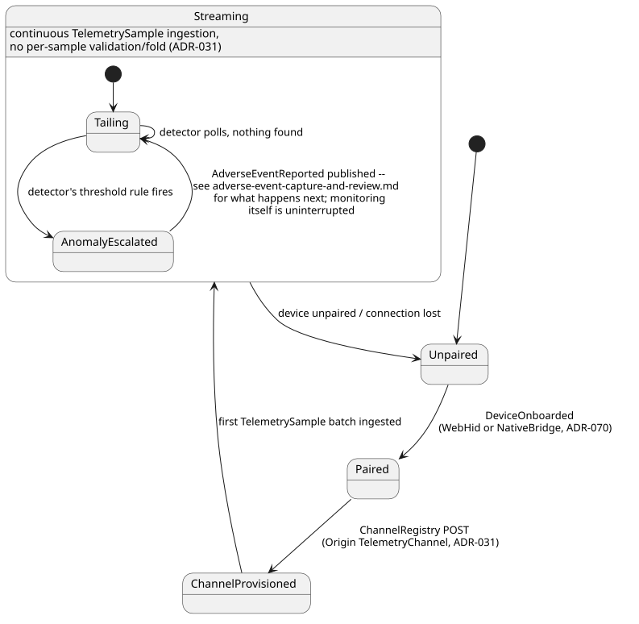

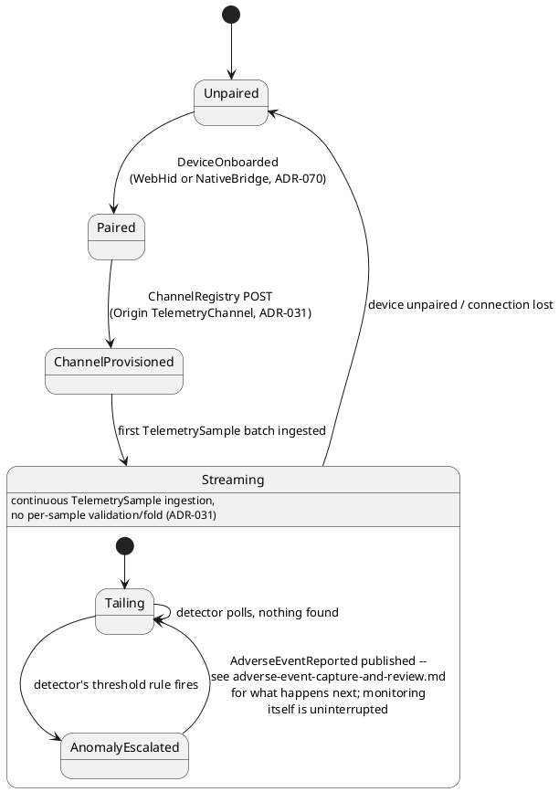

Monitoring continuing uninterrupted through `AnomalyEscalated` is
deliberate — filing an adverse event doesn't pause the vitals stream;
`adverse-event-capture-and-review.md`'s review process runs entirely
downstream of, and concurrently with, this loop.

## Salt (UI mockup) — pairing-to-escalation user flow, across coordinator and detector screens

### Screen 1: Device pairing screen (WebHID prompt / Native Bridge status)

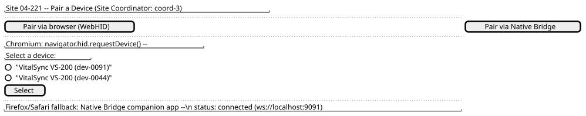

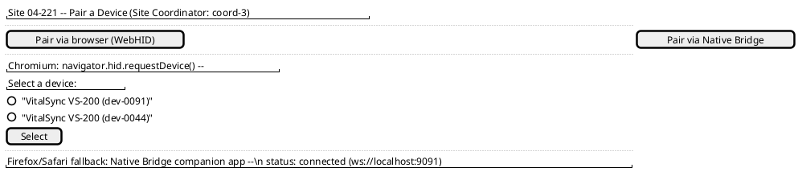

Clicking **Pair via browser (WebHID)** triggers the native device-picker
dialog (Chromium-only, secure-context-required, `ADR-070`); clicking
**Pair via Native Bridge** instead shows the companion app's connection
status for Firefox/Safari. Either path ends the same way — the coordinator
selects the bedside monitor and submits `DeviceOnboarded`, moving the flow
to Screen 2.

### Screen 2: Channel provisioning confirmation


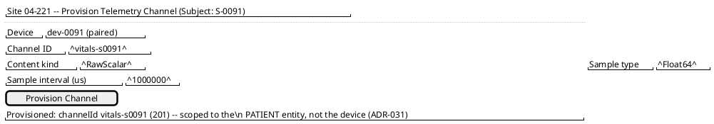

Clicking **Provision Channel** registers `vitals-s0091` against
`trial1:Patient:S-0091`; once provisioned, the coordinator's client
navigates to Screen 3 to watch the stream it just opened.

### Screen 3: Live vitals monitoring dashboard


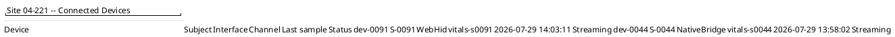

No per-sample validation or Entity Store fold happens behind this
dashboard (`ADR-031`) — it's a tail of `TelemetrySample` rows, refreshing
on its own. Nothing here changes on a coordinator action; it changes when
the Detector Worker's own polling loop escalates an anomaly, moving the
flow to Screen 4.

### Screen 4: Detector's escalation, handing off to adverse-event review

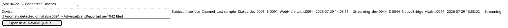

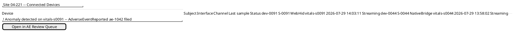

The desaturation-threshold rule firing is automatic, not a coordinator
action — the banner simply appears on the same dashboard the moment the
detector's `AdverseEventReported` publish for `ae-1042` lands
(`pending_review`). Clicking **Open in AE Review Queue** navigates to
`adverse-event-capture-and-review.md`'s own PI review-queue screen — this
doc's UI ends at the moment an anomaly is escalated; the review experience
itself belongs entirely to that doc, and monitoring itself continues
uninterrupted underneath it.

## Gherkin

```gherkin
Feature: Device Onboarding and Continuous Monitoring
  As a clinical trial site
  I want a connected bedside monitor paired to an enrolled patient, whether the coordinator's browser supports direct hardware access or not
  And its continuous vitals stream provisioned as a Streaming Channel
  And a detector to escalate a real anomaly into an ordinary, reviewable adverse-event publish
  So that connected-device telemetry becomes trial data without paying per-sample validation cost, while still bridging cleanly into this domain's clinical review process

  # AppId "trial1" throughout (ADR-030). "S-0091" is the same patient
  # enrolled in patient-enrollment-and-informed-consent.md; "vitals-s0091"
  # is the same ChannelId adverse-event-capture-and-review.md's
  # TelemetryPointer already references.

  Background:
    Given the entity "trial1:Patient:S-0091" exists with EnrollmentStatus "Enrolled" (ADR-021)
    And the event type "DeviceOnboarded" version 1 is registered with EntityIdField "$.DeviceId", ChangeKind "Full", RejectionBehavior "Annotate"
    And the event type "AdverseEventReported" version 1 is registered per adverse-event-capture-and-review.md's own Background

  Scenario: A coordinator pairs a bedside monitor via WebHID on a Chromium browser
    When "coord-3" completes a WebHID device-picker gesture selecting a "VitalSync VS-200" monitor
    And publishes "DeviceOnboarded" with body { "DeviceId": "dev-0091", "DeviceModel": "VitalSync VS-200", "InterfaceKind": "WebHid", "PairedToSubjectId": "S-0091", "SiteId": "04-221" }
    Then the response status should be 202 with authorityStatus "accepted"
    And the authoritative Entity Store for "trial1:Device:dev-0091" should reflect PairedToSubjectId "S-0091"

  Scenario: A coordinator pairs the same class of device via the native-bridge fallback on Firefox
    Given a Native Bridge companion app is already running and reachable at "ws://localhost:9091"
    When "coord-3" publishes "DeviceOnboarded" with body { "DeviceId": "dev-0044", "DeviceModel": "VitalSync VS-200", "InterfaceKind": "NativeBridge", "PairedToSubjectId": "S-0044", "SiteId": "04-221" }
    Then the response status should be 202
    # WebHID/Serial/Bluetooth ship in Chromium only (ADR-070's Context) --
    # this is the path that makes Firefox/Safari pairing possible at all.

  Scenario: An Origin TelemetryChannel is provisioned, scoped to the patient entity
    When "coord-3" registers channel "vitals-s0091" with EntityId "trial1:Patient:S-0091", ContentKind "RawScalar", SampleType "Float64", Origin "Origin"
    Then the response status should be 201
    And the channel's EntityId should be the PATIENT's, not the device's
    # A device can be swapped mid-trial without re-provisioning the
    # channel's own history (ADR-031).

  Scenario: Continuous samples are ingested without per-sample validation or an Entity Store fold
    Given channel "vitals-s0091" exists, per above
    When device "dev-0091" posts a batch of 60 SpO2 samples to "/telemetry/vitals-s0091/samples"
    Then the response status should be 202 with samplesWritten 60
    And no JsonSchema validation, ChainHash, or Entity Store fold should occur for these samples
    # Full ingestion mechanics (late-arrival flagging, lag detection) are
    # streaming-channels.md's own scope, not repeated here.

  Scenario: A detector escalates a desaturation anomaly into the exact adverse-event publish the downstream doc picks up
    Given channel "vitals-s0091" has ingested samples showing a sustained SpO2 drop below the configured threshold
    When the Detector Worker tails "vitals-s0091" and its desaturation rule fires
    Then it should publish "AdverseEventReported" for "ae-1042" with SubjectId "S-0091", Severity "Severe", SeriousAdverseEvent true, a TelemetryPointer to channel "vitals-s0091" at "2026-07-29T14:02:10Z", and AttestedClaims { "reviewPending": true, "reason": "auto-detected desaturation event" }
    And the response status should be 202 with authorityStatus "pending_review"
    # This is the SAME publish adverse-event-capture-and-review.md's
    # "non-authoritative capture" sequence diagram already documents as
    # its device-linked branch -- continues there, not repeated here.

  Scenario: The detector finds nothing on a poll and keeps tailing
    Given channel "vitals-s0091" has ingested only samples within normal SpO2 range
    When the Detector Worker tails "vitals-s0091"
    Then no event should be published
    And the detector should continue tailing on its next poll
```
