# Feature: Intraoperative Monitoring and Alert Response

Context: this doc exercises four ADRs together against one concrete,
surgical-setting workflow — a connected IONM (Intraoperative
Neurophysiological Monitoring) rig provisions a dual-channel stream for
the trial's continuity subject, a detector's real-time alert is tracked
for acknowledgment, and an attending neurologist's later, signed,
official interpretation is the authoritative record. `ADR-031`'s
dual-channel live-safety split (`../README.md`'s "Special concerns")
governs the fast/full channel provisioning; `ADR-035`/`ADR-042` govern
the alert's capture-then-review trust axis, identically to Workflow B's
adverse-event pattern; `ADR-094` governs the acknowledgment-tracking
loop — this is that mechanism's first real domain-level exercise, beyond
the illustrative worked example in
[`../../../features/expected-response-tracking.md`](../../../features/expected-response-tracking.md);
`ADR-066` governs the neurologist's signed interpretation, reusing
Workflow B's exact `authorityDecision` event type and step-up mechanism
unchanged. Envelope/entity shapes are defined in
[`../../../data/event-log.md`](../../../data/event-log.md)
(`StoredEvent`, `RespondsToEventId`),
[`../../../data/schema-registry.md`](../../../data/schema-registry.md)
(`EventTypeDefinition.ExpectedResponse`, `ExpectedResponseTracker`), and
[`../../../data/streaming-and-attachments.md`](../../../data/streaming-and-attachments.md)
(`TelemetryChannel`).

Continues the same continuity patient as Workflows A/B/C: `SubjectId`
`"S-0091"` (`trial1:Patient:S-0091`), now undergoing a trial-protocol
surgical procedure monitored via IONM — a plausible continuation of the
same patient's record, not a new, disconnected example.

This doc deliberately does **not** re-derive:
- **Device pairing and channel provisioning mechanics** (`ADR-070`,
  `ADR-031`) — see
  [`device-onboarding-and-continuous-monitoring.md`](device-onboarding-and-continuous-monitoring.md).
  This doc only shows the IONM-specific detail that *two* channels get
  provisioned for one monitoring session, not the pairing/provisioning
  API calls themselves.
- **Streaming-channel batch ingestion and tail/replay mechanics**
  (`ADR-031`) — see
  [`../../../features/streaming-channels.md`](../../../features/streaming-channels.md).
- **Non-authoritative capture, gated authoritative publish, and the
  signed, step-up-gated `authorityDecision` mechanism** (`ADR-035`,
  `ADR-042`, `ADR-066`) — see
  [`adverse-event-capture-and-review.md`](adverse-event-capture-and-review.md).
  This doc reuses that *exact same* `authorityDecision` event type
  (already registered for `AppId` `"trial1"`) unchanged, targeting this
  workflow's own alert event instead of an `AdverseEventReported` one —
  it does not re-explain `RejectionBehavior`, the step-up challenge
  mechanics, or the Entity Store catch-up fold.
- **`ExpectedResponseWatcher`'s own internal mechanics** (the tracker
  table, the sweep loop, leader election) — see
  [`../../../features/expected-response-tracking.md`](../../../features/expected-response-tracking.md).
  This doc shows only this domain's own `ExpectedResponse` configuration
  and the resulting alert/acknowledgment/escalation narrative.
- **Delegated secondary-opinion access** (`ADR-043`) — already fully
  shown in `adverse-event-capture-and-review.md`; not re-exercised a
  second time in the same domain.

Every event type below is registered under `AppId` `"trial1"`
(`ADR-030`); `EntityId` format is `{appId}:{entityType}:{uniqueId}`
(`ADR-021`) — scenarios use `trial1:IonmAlert:alert-77` throughout.

## Sequence diagram — dual-channel provisioning, continuous ingestion, and a detector's tracked alert

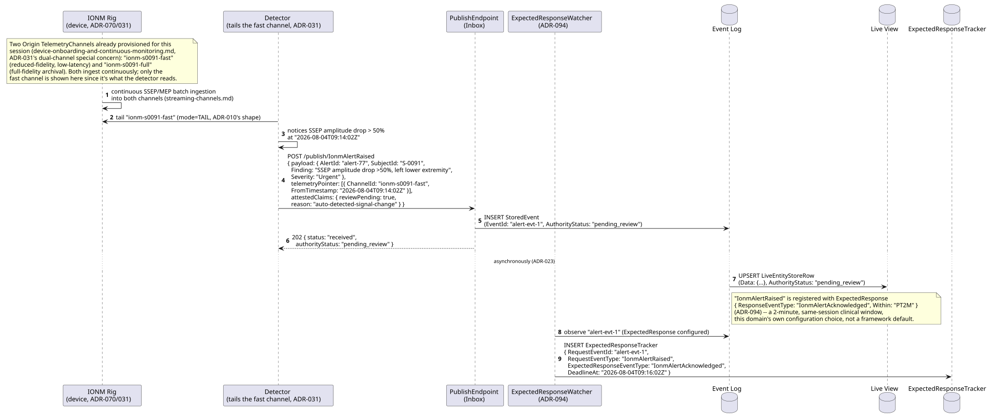

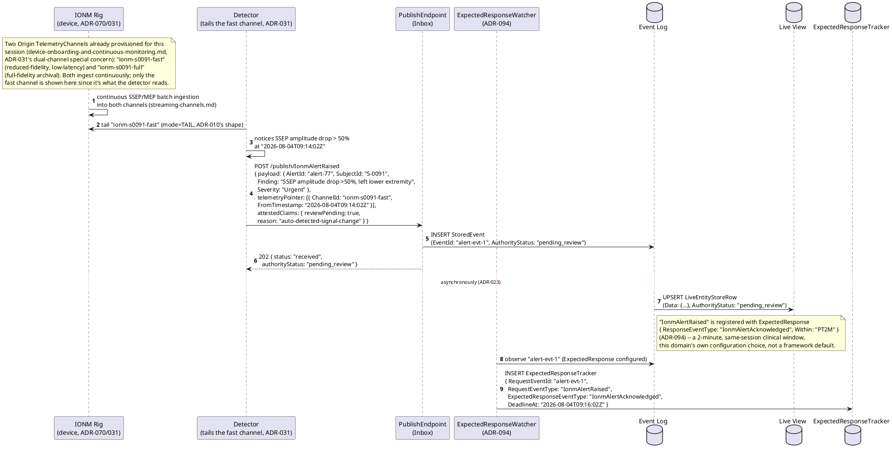

## Sequence diagram — acknowledgment or escalation, then the neurologist's authoritative interpretation

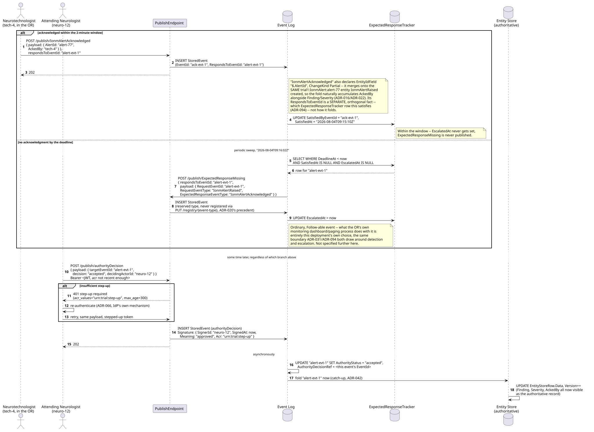

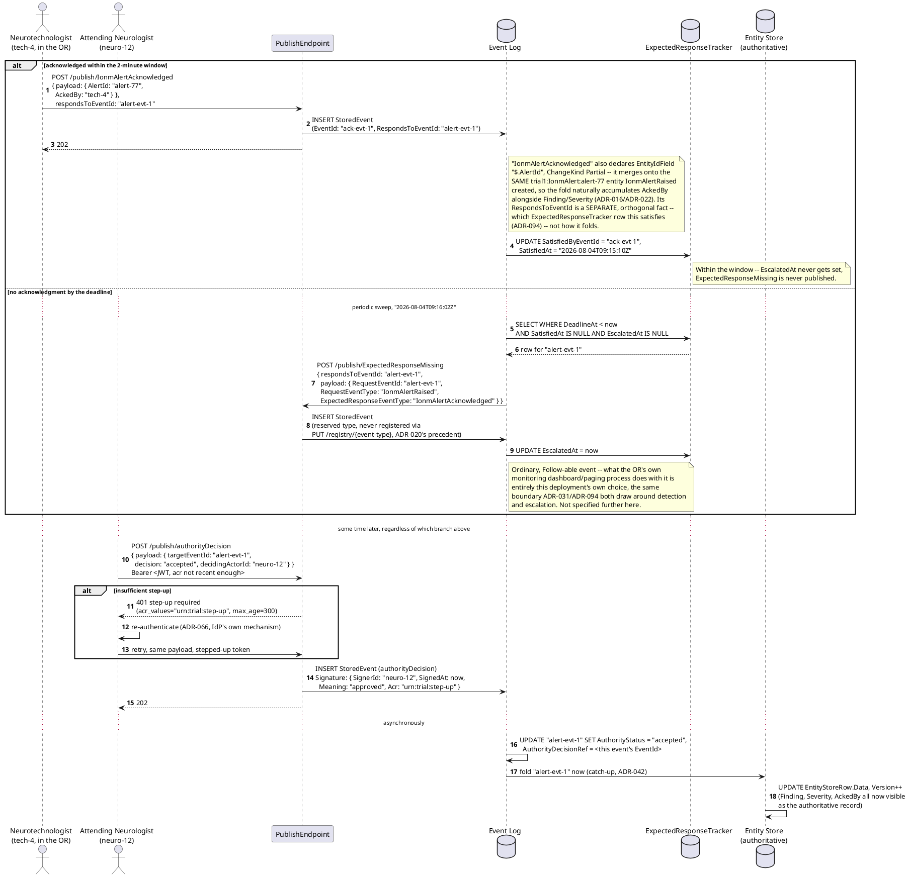

**The acknowledgment and the authoritative interpretation are two
genuinely different response events, never conflated.** `IonmAlertAcknowledged`
is the fast, `ADR-094`-tracked, same-session fact that a human saw the
alert in time — it never touches `AuthorityStatus`. `authorityDecision`
is the slower, signed, clinically authoritative confirmation — reusing
Workflow B's mechanism completely unchanged — and it alone moves
`AuthorityStatus` to `accepted` and triggers the Entity Store's catch-up
fold. A case can be acknowledged promptly by the tech and still take
minutes to hours to reach the neurologist's own signed interpretation;
both facts are real, independently useful, and never collapsed into one.

## Data model (ER diagram)

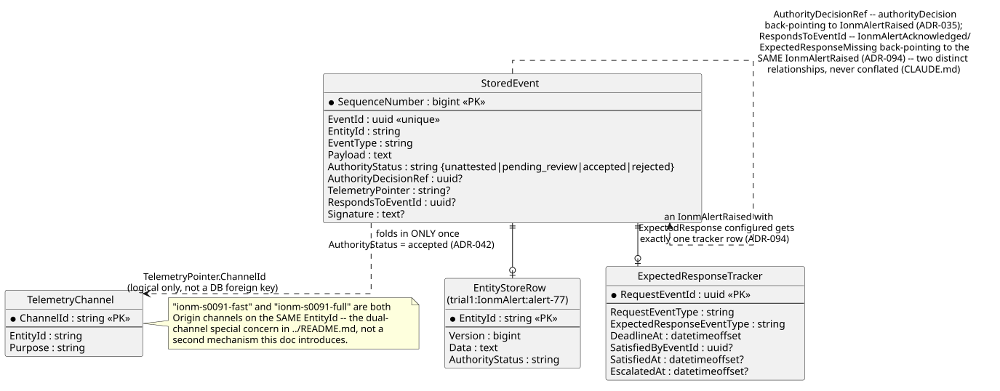

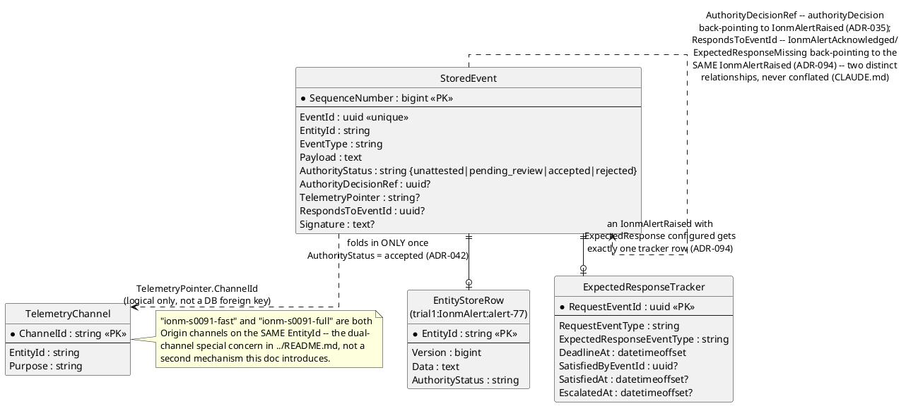

Full column lists are in `../../../data/event-log.md`,
`../../../data/schema-registry.md`, and
`../../../data/streaming-and-attachments.md` — this diagram shows only
what this workflow's own events read/write.

## State machine — `IonmAlert` lifecycle


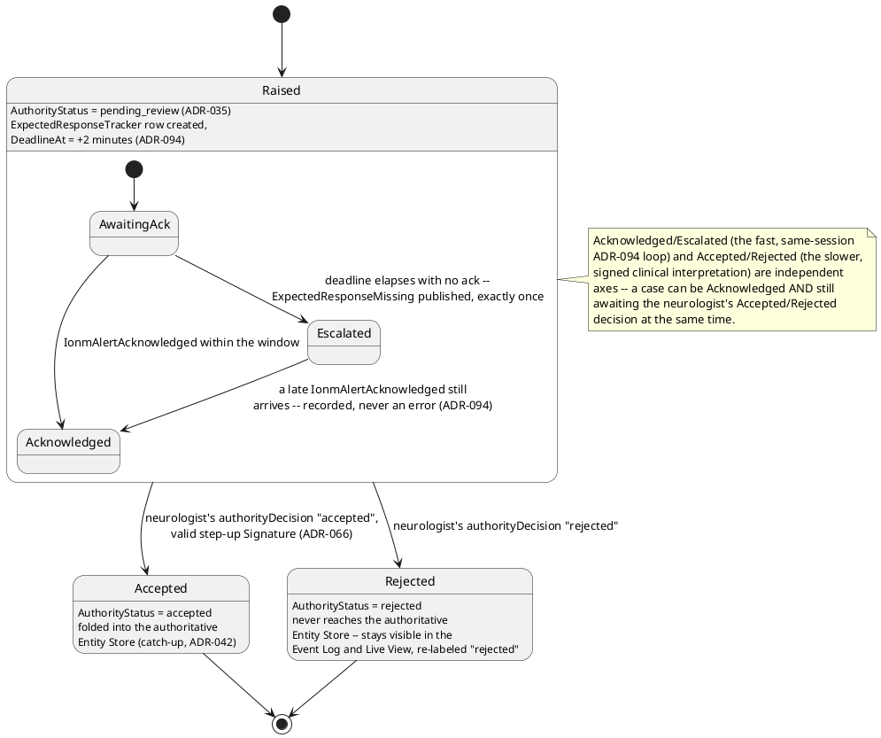

## Salt (UI mockup) — the OR's live view, the escalation surfacing, and the neurologist's sign-off

### Screen 1: OR live monitoring view

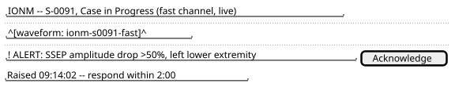

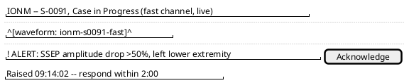

Clicking **Acknowledge** publishes `IonmAlertAcknowledged`
(`respondsToEventId` set to the alert's `EventId`) — Screen 1 stays the
active view for the rest of the case if acknowledged in time.

### Screen 2: Escalation surfaced (deadline elapsed, unacknowledged)

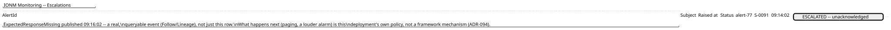

```plantuml
@startsalt
{
  { "IONM Monitoring -- Escalations" }
  ..
  | AlertId  | Subject | Raised at | Status                |
  | alert-77 | S-0091  | 09:14:02  | [ ESCALATED -- unacknowledged ] |
  ..
  "ExpectedResponseMissing published 09:16:02 -- a real,\nqueryable event (Follow/Lineage), not just this row.\nWhat happens next (paging, a louder alarm) is this\ndeployment's own policy, not a framework mechanism (ADR-094)."
}
@endsalt
```

### Screen 3: Neurologist's post-case review and sign-off

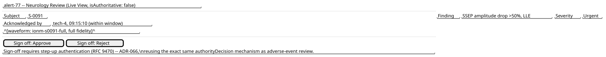

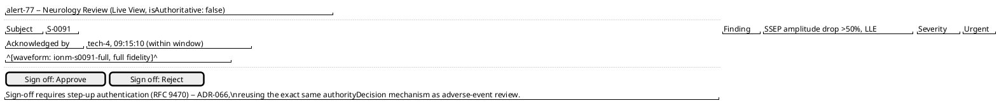

## Gherkin

```gherkin
Feature: Intraoperative Monitoring and Alert Response
  As a surgical team monitoring a trial subject via IONM
  I want a real-time signal alert to be tracked for acknowledgment, escalating if missed
  And an attending neurologist's later, signed interpretation to be the authoritative record
  So that an in-the-moment response and a considered clinical judgment are both captured, without conflating the two

  # AppId "trial1" throughout (ADR-030); EntityId format
  # {appId}:{entityType}:{uniqueId} (ADR-021). Every request carries an
  # ordinary Bearer token with events:publish/events:follow scopes
  # (auth.md) unless a scenario says otherwise.

  Background:
    Given two Origin TelemetryChannels are provisioned for "trial1:Patient:S-0091": "ionm-s0091-fast" (Purpose "fast") and "ionm-s0091-full" (Purpose "full")
    And the event type "IonmAlertRaised" version 1 is registered with EntityIdField "$.AlertId", ChangeKind "Full", RejectionBehavior "Annotate", and ExpectedResponse { "ResponseEventType": "IonmAlertAcknowledged", "Within": "PT2M" }
    And the event type "IonmAlertAcknowledged" version 1 is registered with EntityIdField "$.AlertId", ChangeKind "Partial"
    And the event type "authorityDecision" is already registered per adverse-event-capture-and-review.md, with EntityIdField "$.targetEventId" and RequiredSignature { "AcrValues": ["urn:trial:step-up"], "MaxAge": 300 }
    And "neuro-12" is an attending neurologist with sufficient privilege to sign a authorityDecision

  Scenario: A detector's alert is captured non-authoritatively, carrying a TelemetryPointer to the fast channel, and starts a tracked expectation
    When a "IonmAlertRaised" event "alert-77" is published with body { "AlertId": "alert-77", "SubjectId": "S-0091", "Finding": "SSEP amplitude drop >50%, left lower extremity", "Severity": "Urgent" }, a TelemetryPointer to channel "ionm-s0091-fast", and AttestedClaims { "reviewPending": true, "reason": "auto-detected-signal-change" }
    Then the response status should be 202 with authorityStatus "pending_review"
    And an ExpectedResponseTracker row should exist for that event, with DeadlineAt two minutes after publish
    And querying the Live View for "trial1:IonmAlert:alert-77" should return Finding "SSEP amplitude drop >50%, left lower extremity", wrapped "isAuthoritative": false

  Scenario: An acknowledgment within the window satisfies the tracker and merges onto the same entity
    Given "alert-77" was published as above, at "2026-08-04T09:14:02Z"
    When "tech-4" publishes "IonmAlertAcknowledged" with body { "AlertId": "alert-77", "AckedBy": "tech-4" } and respondsToEventId set to "alert-77"'s EventId, at "2026-08-04T09:15:10Z"
    Then the tracker row for "alert-77" should have SatisfiedAt "2026-08-04T09:15:10Z"
    And no "ExpectedResponseMissing" event should ever be published for it
    And querying the Live View for "trial1:IonmAlert:alert-77" should now also show AckedBy "tech-4"
    # Partial merge (ADR-016) -- Finding/Severity from the Full IonmAlertRaised
    # untouched, AckedBy added by the Partial IonmAlertAcknowledged.

  Scenario: No acknowledgment by the deadline escalates exactly once
    Given "alert-77" was published at "2026-08-04T09:14:02Z" with no acknowledgment since
    When the sweep runs at "2026-08-04T09:16:02Z"
    Then exactly one "ExpectedResponseMissing" event should be published, referencing "alert-77"
    And it should be queryable through the ordinary Follow/Lineage API
    # Same "make the failure an inspectable record" posture as
    # EventUpcastFailed/WebhookDeliveryFailed/ChannelLagDetected.

  Scenario: A late acknowledgment after escalation is still recorded, never rejected, and never triggers a second escalation
    Given "alert-77" already had "ExpectedResponseMissing" published for it
    When "tech-4" publishes a late "IonmAlertAcknowledged" with respondsToEventId "alert-77"
    Then the tracker row for "alert-77" should have SatisfiedByEventId set to that late event
    And no second "ExpectedResponseMissing" event should be published for "alert-77"

  Scenario: The acknowledgment and the neurologist's authoritative interpretation are independent facts
    Given "alert-77" was acknowledged by "tech-4" within the window, per above
    Then "alert-77"'s AuthorityStatus should still be "pending_review"
    # Being acknowledged in real time never by itself moves AuthorityStatus --
    # only a signed authorityDecision does (ADR-035/ADR-094 are orthogonal axes).

  Scenario: The neurologist's sign-off without sufficient step-up is challenged, not stored
    Given "alert-77" is still "pending_review"
    And "neuro-12"'s current token carries no "urn:trial:step-up" acr, or one older than 300 seconds
    When "neuro-12" attempts to POST "/publish/authorityDecision" with body { "targetEventId": "alert-77's event id", "decision": "accepted", "decidingActorId": "neuro-12" }
    Then the response should be an RFC 9470 step-up challenge naming acr_values "urn:trial:step-up" and max_age 300
    And no authorityDecision event should be persisted

  Scenario: The neurologist signs off "accepted" after stepping up, and the authoritative Entity Store catches up
    Given "neuro-12" has re-authenticated and now holds a token with acr "urn:trial:step-up", authenticated within the last 300 seconds
    When "neuro-12" POSTs "/publish/authorityDecision" with body { "targetEventId": "alert-77's event id", "decision": "accepted", "decidingActorId": "neuro-12" }
    Then the stored authorityDecision event should carry Signature { SignerId: "neuro-12", Meaning: "approved", Acr: "urn:trial:step-up" }
    And eventually "alert-77" should have AuthorityStatus "accepted"
    And eventually the authoritative Entity Store for "trial1:IonmAlert:alert-77" should reflect Finding, Severity, and AckedBy together

  Scenario: The neurologist signs off "rejected" instead, and the record never reaches the authoritative Entity Store
    Given "alert-77" is still "pending_review", acknowledged by "tech-4" per above
    And "neuro-12" holds a valid step-up token
    When "neuro-12" POSTs "/publish/authorityDecision" with body { "targetEventId": "alert-77's event id", "decision": "rejected", "decidingActorId": "neuro-12", "reason": "artifact, not a true signal change" }
    Then "alert-77" should have AuthorityStatus "rejected"
    And the authoritative Entity Store should never reflect "alert-77"'s data
    And "alert-77" should remain visible in the Live View, re-labeled "rejected", never deleted
    # RejectionBehavior "Annotate" (Background) -- nothing to compensate,
    # since a rejected event was never folded into the authoritative
    # store in the first place (ADR-042), identical to Workflow B.
```
