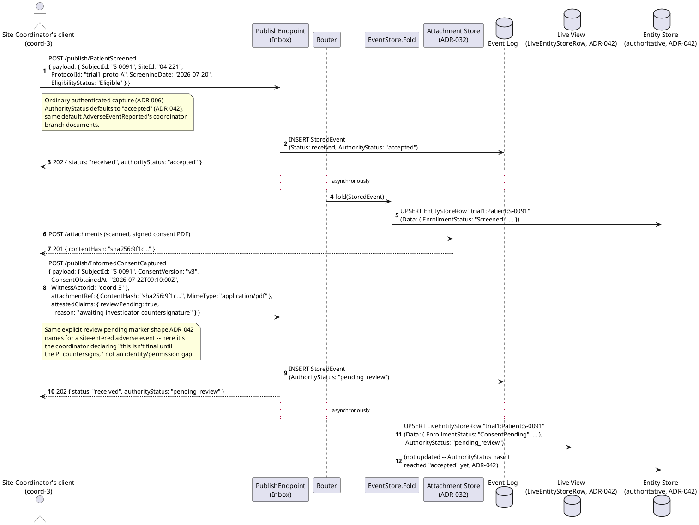
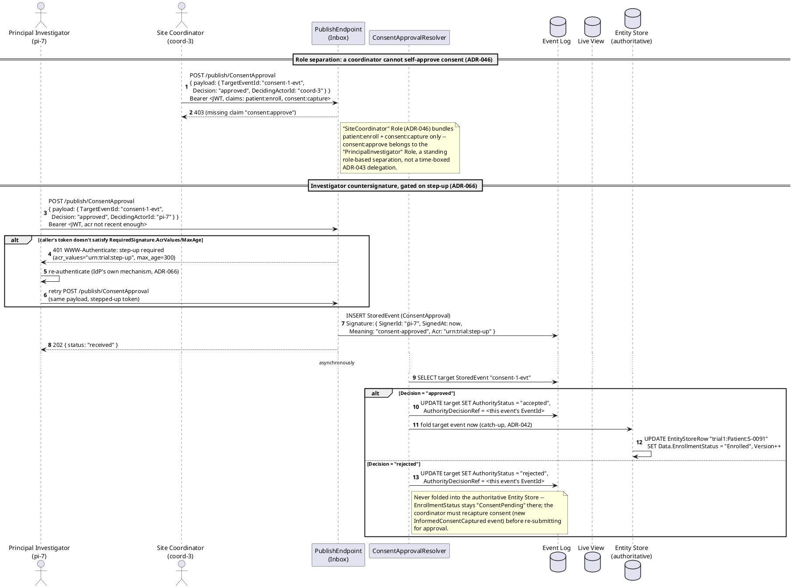
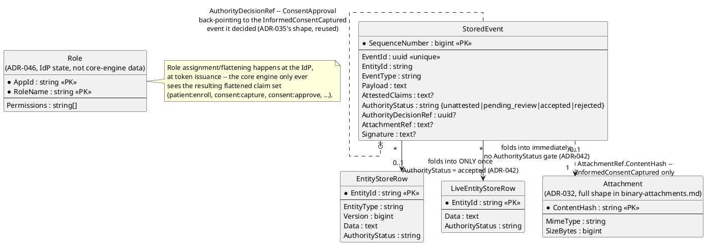
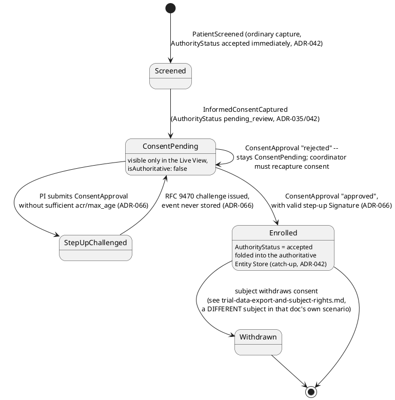
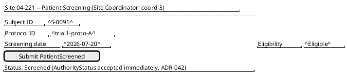
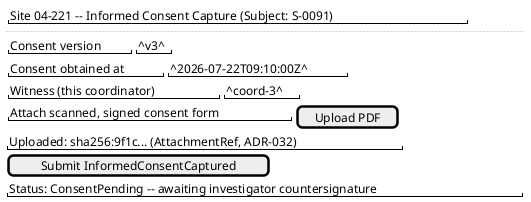
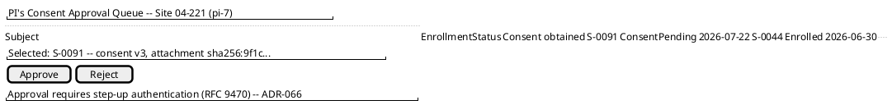
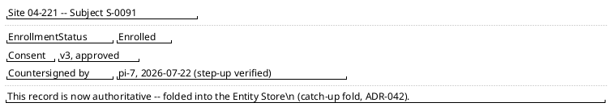

# Feature: Patient Enrollment and Informed Consent

Context: this is Workflow A's own doc — the first step of this domain's
three end-to-end workflows (see `../README.md`'s "Workflows" section) —
covering a patient being screened, walked through informed consent, and
becoming an active study participant. It exercises `ADR-021` (the
patient as an entity in its own right, not just a `SubjectId` string
buried in someone else's payload), `ADR-046`/`ADR-043` (a Site
Coordinator's role-based claims are deliberately narrower than a
Principal Investigator's — enrollment and consent *capture* vs. consent
*approval*), `ADR-066` (a consent form's investigator countersignature is
exactly this mechanism's target case — 21 CFR Part 11 §11.50's signer
identity/meaning/timestamp, satisfied the same way
`adverse-event-capture-and-review.md`'s CRF sign-off already is), and
`ADR-009` (PHI masking on the patient's identifying fields). It
deliberately **reuses** `ADR-035`/`ADR-042`'s capture-then-gated-decision
shape — already this domain's defining mechanism for adverse events —
applied here to informed consent instead: consent is captured
non-authoritatively pending the investigator's signed countersignature,
not treated as final the moment a coordinator collects it. Envelope/
entity shapes are defined in
[`../../../data/event-log.md`](../../../data/event-log.md)
(`StoredEvent`, `Signature`, `AttachmentRef`),
[`../../../data/entity-store.md`](../../../data/entity-store.md)
(`EntityStoreRow`, `LiveEntityStoreRow`), and
[`../../../data/schema-registry.md`](../../../data/schema-registry.md)
(`Role`, `EventTypeDefinition.RequiredSignature`).

**Continuity note**: this doc's patient, `S-0091`, is the *same* patient
who later has the severe, device-linked adverse event `ae-1042` in
[`adverse-event-capture-and-review.md`](adverse-event-capture-and-review.md)
and whose bedside monitor is paired/onboarded in
[`device-onboarding-and-continuous-monitoring.md`](device-onboarding-and-continuous-monitoring.md).
The `SubjectId` format (`S-####`) and `EntityId` format
(`{appId}:{entityType}:{uniqueId}` → `trial1:Patient:S-0091`, `ADR-021`)
are identical to the existing doc's own conventions, not merely similar.

This doc deliberately does **not** re-derive:
- **The `{value}`/`{masked}`/`{erased}` masking wrapper mechanics**
  (`ADR-009`/`ADR-057`) — see
  [`../../../features/masking.md`](../../../features/masking.md). This
  doc only notes *where* the patient's name/date-of-birth would carry
  `x-masking` in the payload, not the wrapper itself.
- **Binary attachment ingestion mechanics** (`ADR-032`) — see
  [`../../../features/binary-attachments.md`](../../../features/binary-attachments.md).
  This doc only shows an already-formed `AttachmentRef` pointing at a
  scanned, signed consent document; not how `POST /attachments` itself
  works.
- **RFC 9470 step-up mechanics themselves, or the general
  `RequiredClaims` check** (`ADR-066`/`ADR-008`/`ADR-050`)
  — both are shown here in the one place they matter (the investigator's
  countersignature), but their general mechanics are fully owned by
  [`adverse-event-capture-and-review.md`](adverse-event-capture-and-review.md)
  (step-up) and
  [`../../../features/event-security.md`](../../../features/event-security.md)/
  [`../../../features/auth.md`](../../../features/auth.md) (claims). This
  doc doesn't repeat that derivation.
- **`ADR-043`'s delegated, entity-scoped "secondary opinion" grants** —
  role separation here is the *simpler*, standing-role shape (`ADR-046`),
  not a time-boxed delegation; that mechanism is fully covered in
  `adverse-event-capture-and-review.md` and isn't repeated here.
- **What happens to this patient's record on withdrawal/erasure** — see
  [`trial-data-export-and-subject-rights.md`](trial-data-export-and-subject-rights.md)
  (Workflow C), which uses a *different* subject specifically so this
  domain's main continuity thread is never itself erased mid-narrative.

Every event type below is registered under `AppId` `"trial1"`
(`ADR-030`); `EntityId` format is `{appId}:{entityType}:{uniqueId}`
(`ADR-021`) — scenarios use `trial1:Patient:S-0091` throughout, at site
`"04-221"` (the same site as `adverse-event-capture-and-review.md`).

## Sequence diagram — screening and non-authoritative consent capture



## Sequence diagram — investigator countersignature, role separation, and catch-up fold

Mirrors `adverse-event-capture-and-review.md`'s review-decision shape
exactly, applied to consent: a `ConsentApproval` event, keyed by
`$.targetEventId` (the `InformedConsentCaptured` event's `EventId`) the
same way that doc's `authorityDecision` is keyed, resolved by a sibling
`ConsentApprovalResolver`, gated behind the same `ADR-066` step-up
challenge.



## Data model (ER diagram)



Full column lists are in
[`../../../data/event-log.md`](../../../data/event-log.md),
[`../../../data/entity-store.md`](../../../data/entity-store.md), and
[`../../../data/schema-registry.md`](../../../data/schema-registry.md)
(`Role`) — this diagram shows only what this workflow's own events
read/write.

```csharp
// PatientScreened payload -- EntityIdField "$.SubjectId" (ADR-021),
// ChangeKind Full, RejectionBehavior Annotate (default, ADR-035).
public class PatientScreenedPayload
{
    public string SubjectId { get; set; } = default!;       // "S-0091" -- becomes this Patient entity's EntityId suffix
    public string SiteId { get; set; } = default!;
    public string ProtocolId { get; set; } = default!;
    public string ScreeningDate { get; set; } = default!;
    public string EligibilityStatus { get; set; } = default!; // Eligible | Ineligible | Pending
}

// InformedConsentCaptured payload -- same EntityIdField "$.SubjectId";
// carries an AttachmentRef (envelope metadata, ADR-032) pointing at the
// scanned consent document, never inline in Payload itself.
public class InformedConsentCapturedPayload
{
    public string SubjectId { get; set; } = default!;
    public string ConsentVersion { get; set; } = default!;
    public string ConsentObtainedAt { get; set; } = default!;
    public string WitnessActorId { get; set; } = default!;  // coordinator's own ActorId (ADR-064), denormalized for readability
}

// ConsentApproval payload -- EntityIdField "$.TargetEventId", the SAME
// shape family as adverse-event-capture-and-review.md's
// AuthorityDecisionPayload; this AppId's registration adds
// RequiredSignature (ADR-066).
public class ConsentApprovalPayload
{
    public string TargetEventId { get; set; } = default!;   // the InformedConsentCaptured event's EventId
    public string Decision { get; set; } = default!;         // approved | rejected
    public string DecidingActorId { get; set; } = default!;  // the PI's ActorId (ADR-064)
    public string? Reason { get; set; }
}

// PatientRecord -- the shape EntityStoreRow.Data/LiveEntityStoreRow.Data
// actually holds once PatientScreened/InformedConsentCaptured/
// ConsentApproval events fold (../../../data/entity-store.md).
public class PatientRecord
{
    public string SubjectId { get; set; } = default!;
    public string SiteId { get; set; } = default!;
    public string ProtocolId { get; set; } = default!;
    public string EnrollmentStatus { get; set; } = default!; // Screened | ConsentPending | Enrolled | Withdrawn
    public string? LegalName { get; set; }                   // PHI -- x-masking-classified in the real schema (ADR-009), not shown here
    public string? DateOfBirth { get; set; }                 // PHI -- same as above
    public string? ConsentObtainedAt { get; set; }
}
```

## State machine — `PatientRecord` enrollment lifecycle



`StepUpChallenged` is not itself a persisted `AuthorityStatus` value —
the same pre-storage rejection shape `ADR-066` names in
`adverse-event-capture-and-review.md`'s own state machine, applied here
to the consent countersignature instead of the AE review decision.

## Salt (UI mockup) — enrollment-to-consent user flow, across coordinator and PI screens

### Screen 1: Site Coordinator's screening form



The coordinator clicks **Submit PatientScreened**; `202`/`accepted` comes
back immediately (ordinary authenticated capture, `ADR-006`), and the
coordinator continues on the same client to Screen 2 to capture consent
for the same subject.

### Screen 2: Coordinator's informed consent capture



The patient's actual signature lives on the paper/scanned document this
screen uploads, not typed into this UI — the coordinator is the one
submitting the resulting `AttachmentRef` and declaring
`reviewPending: true`. Clicking **Submit InformedConsentCaptured** returns
`202`/`pending_review`; the record now exists only in the Live View
(`EnrollmentStatus: ConsentPending`, `isAuthoritative: false`), and the
workflow hands off from the coordinator to the Principal Investigator.

### Screen 3: PI's countersignature queue, gated on step-up authentication



Every row here comes from the Live View, the same `isAuthoritative: false`
convention `adverse-event-capture-and-review.md`'s review queue already
uses — a coordinator's own screen never shows this queue at all, since it
lacks `consent:approve` (`ADR-046`). The PI clicks **Approve**; if the
current token doesn't already satisfy `RequiredSignature.AcrValues`/
`MaxAge`, the IdP's own step-up challenge runs before the signed
`ConsentApproval` event is actually submitted, and only then does the flow
move to Screen 4.

### Screen 4: Confirmation — subject is now an active participant



This is the same `trial1:Patient:S-0091` record, now read from the
authoritative Entity Store rather than the Live View — the first point in
this flow where `EnrollmentStatus` reads `"Enrolled"` for any caller,
regardless of claims.

## Gherkin

```gherkin
Feature: Patient Enrollment and Informed Consent
  As a clinical trial site
  I want a patient's screening and informed consent captured immediately but not authoritative until an investigator countersigns
  And a Site Coordinator to be structurally unable to approve their own consent capture
  So that enrollment is attributable, tamper-evident, and never silently finalized without a regulated sign-off

  # AppId "trial1" throughout (ADR-030); EntityId format
  # {appId}:{entityType}:{uniqueId} (ADR-021) -- "trial1:Patient:S-0091".
  # Every request carries an ordinary Bearer token with events:publish
  # scope (auth.md) unless a scenario says otherwise.

  Background:
    Given the event type "PatientScreened" version 1 is registered with EntityIdField "$.SubjectId", ChangeKind "Full", RejectionBehavior "Annotate" and schema:
      """
      {
        "type": "object",
        "properties": {
          "SubjectId": { "type": "string" },
          "SiteId": { "type": "string" },
          "ProtocolId": { "type": "string" },
          "ScreeningDate": { "type": "string" },
          "EligibilityStatus": { "type": "string" }
        },
        "required": ["SubjectId", "SiteId", "EligibilityStatus"]
      }
      """
    And the event type "InformedConsentCaptured" version 1 is registered with EntityIdField "$.SubjectId", ChangeKind "Full", RejectionBehavior "Annotate"
    And the event type "ConsentApproval" version 1 is registered with EntityIdField "$.TargetEventId" and RequiredSignature { "AcrValues": ["urn:trial:step-up"], "MaxAge": 300 }
    And Role "SiteCoordinator" for AppId "trial1" bundles permissions ["patient:enroll", "consent:capture"] (ADR-046)
    And Role "PrincipalInvestigator" for AppId "trial1" bundles permissions ["review:ae", "consent:approve"] (ADR-046)
    And "coord-3" holds Role "SiteCoordinator" at site "04-221"
    And "pi-7" holds Role "PrincipalInvestigator" at site "04-221"

  Scenario: A coordinator screens a new patient and the record is accepted immediately
    When "coord-3" publishes "PatientScreened" for "S-0091" with body { "SubjectId": "S-0091", "SiteId": "04-221", "ProtocolId": "trial1-proto-A", "ScreeningDate": "2026-07-20", "EligibilityStatus": "Eligible" }
    Then the response status should be 202 with authorityStatus "accepted"
    And the authoritative Entity Store for "trial1:Patient:S-0091" should reflect EnrollmentStatus "Screened"
    # Ordinary authenticated capture (ADR-006) -- no explicit review-pending
    # marker was supplied, so AuthorityStatus defaults to "accepted" (ADR-042).

  Scenario: A coordinator captures informed consent, which starts non-authoritative pending investigator countersignature
    When "coord-3" publishes "InformedConsentCaptured" for "S-0091" with body { "SubjectId": "S-0091", "ConsentVersion": "v3", "ConsentObtainedAt": "2026-07-22T09:10:00Z", "WitnessActorId": "coord-3" }, an AttachmentRef to the scanned consent PDF, and AttestedClaims { "reviewPending": true, "reason": "awaiting-investigator-countersignature" }
    Then the response status should be 202 with authorityStatus "pending_review"
    And querying the Live View for "trial1:Patient:S-0091" should return EnrollmentStatus "ConsentPending", wrapped "isAuthoritative": false
    And the authoritative Entity Store for "trial1:Patient:S-0091" should still reflect EnrollmentStatus "Screened", not yet "ConsentPending"

  Scenario: A coordinator cannot approve their own consent capture
    Given the informed consent for "S-0091" is still "pending_review"
    When "coord-3" attempts to POST "/publish/ConsentApproval" with body { "TargetEventId": "consent-1-evt", "Decision": "approved", "DecidingActorId": "coord-3" }
    Then the response should be 403 for a missing "consent:approve" claim
    And no ConsentApproval event should be persisted
    # "SiteCoordinator" bundles patient:enroll + consent:capture only
    # (ADR-046) -- a standing role separation, distinct from ADR-043's
    # time-boxed delegated grants used in adverse-event-capture-and-review.md.

  Scenario: The PI's countersignature without sufficient step-up authentication is challenged, not stored
    Given the informed consent for "S-0091" is still "pending_review"
    And "pi-7"'s current token carries no "urn:trial:step-up" acr, or one older than 300 seconds
    When "pi-7" attempts to POST "/publish/ConsentApproval" with body { "TargetEventId": "consent-1-evt", "Decision": "approved", "DecidingActorId": "pi-7" }
    Then the response should be an RFC 9470 step-up challenge naming acr_values "urn:trial:step-up" and max_age 300
    And no ConsentApproval event should be persisted

  Scenario: The PI countersigns "approved" after stepping up, and the authoritative Entity Store catches up
    Given "pi-7" has re-authenticated and now holds a token with acr "urn:trial:step-up", authenticated within the last 300 seconds
    When "pi-7" POSTs "/publish/ConsentApproval" with body { "TargetEventId": "consent-1-evt", "Decision": "approved", "DecidingActorId": "pi-7" }
    Then the response status should be 202
    And the stored ConsentApproval event should carry Signature { SignerId: "pi-7", Meaning: "consent-approved", Acr: "urn:trial:step-up" }
    And eventually the target event for "S-0091" should have AuthorityStatus "accepted"
    And eventually the authoritative Entity Store for "trial1:Patient:S-0091" should reflect EnrollmentStatus "Enrolled"
    # Same "apply once, on the triggering condition" catch-up shape
    # adverse-event-capture-and-review.md's authorityDecision already
    # uses (ADR-042) -- a sibling resolver, not a new fold mechanism.

  Scenario: The PI rejects the consent capture, and enrollment stays pending until it's recaptured
    Given a second informed consent capture for subject "S-0044" is "pending_review"
    And "pi-7" holds a valid step-up token, per above
    When "pi-7" POSTs "/publish/ConsentApproval" with body { "TargetEventId": "consent-2-evt", "Decision": "rejected", "DecidingActorId": "pi-7", "Reason": "witness signature illegible" }
    Then the response status should be 202
    And the target event for "S-0044" should have AuthorityStatus "rejected"
    And the authoritative Entity Store for "trial1:Patient:S-0044" should still reflect EnrollmentStatus "Screened", never "Enrolled"
    And the coordinator must publish a new "InformedConsentCaptured" event for "S-0044" before resubmitting for approval
```
