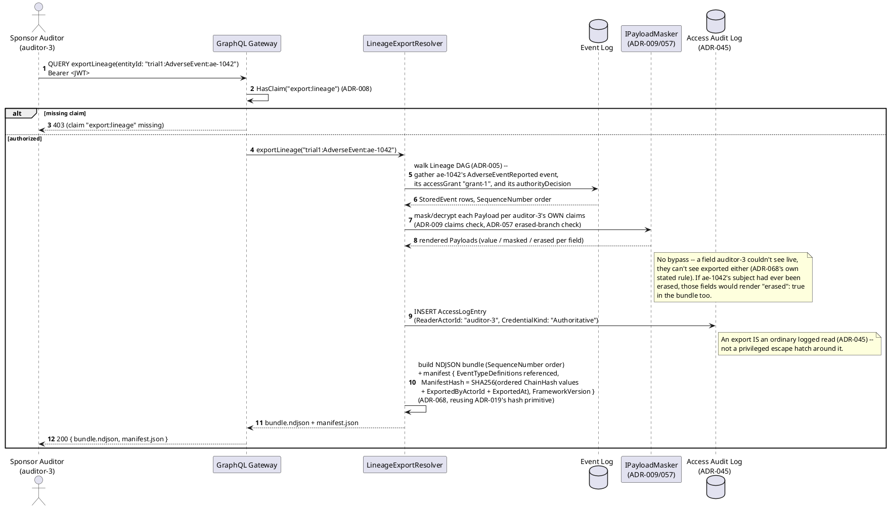
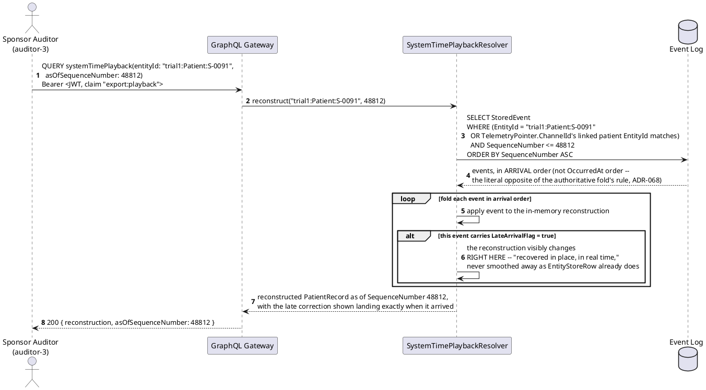
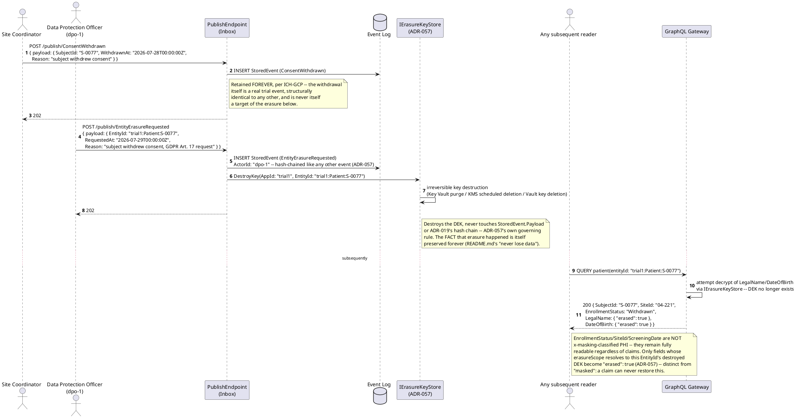
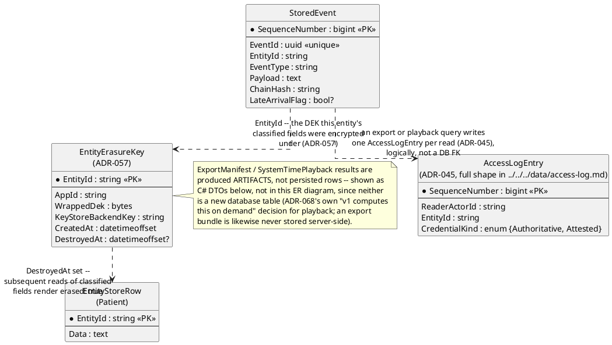
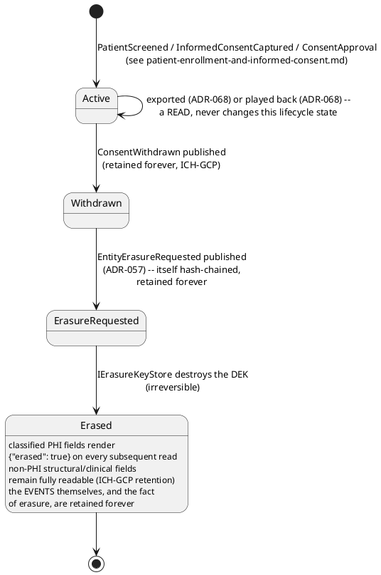
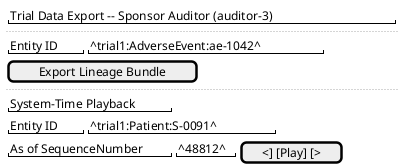
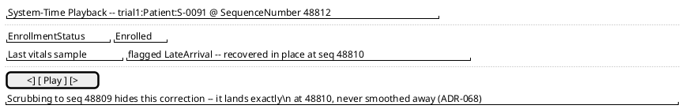
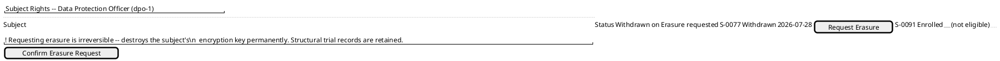
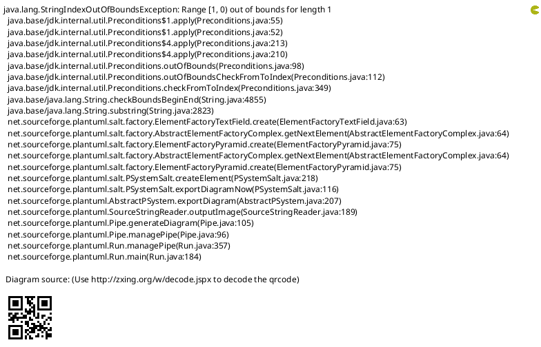

# Feature: Trial Data Export and Subject Rights

Context: this is Workflow C's own doc, covering two related but distinct
needs this domain's `../README.md` ("Special concerns") already names as
real, not hypothetical: a sponsor/regulator inspecting a patient's trial
record exactly as it stood at a point in time (`ADR-068`'s lineage export
+ bitemporal system-time playback — a routine trial-monitoring and
litigation-hold need), and a withdrawn subject's GDPR erasure request
(`ADR-057`'s crypto-shredding), directly stress-testing the
retention-vs-erasure tension ICH-GCP and GDPR create together. Both are
shown here, not split into two docs, because they're the same underlying
theme: data leaving the system properly, under the same read-path
enforcement and audit discipline as any other access.

**Continuity note, deliberate**: the export/playback scenario reuses
`S-0091` — the same patient enrolled in
[`patient-enrollment-and-informed-consent.md`](patient-enrollment-and-informed-consent.md)
and whose severe adverse event `ae-1042` is reviewed in
[`adverse-event-capture-and-review.md`](adverse-event-capture-and-review.md)
— since a regulator inspecting *that* record is exactly the scenario
`ADR-068` was built for. The **erasure** scenario deliberately introduces
a **different** subject, `S-0077`, specifically so this domain's main
continuity thread (`S-0091`) is never itself erased mid-narrative — a
reader following all four docs in order should be able to keep treating
`S-0091` as a live, intact record throughout.

This doc deliberately does **not** re-derive:
- **The `{value}`/`{masked}`/`{erased}` masking wrapper mechanics
  themselves** — see
  [`../../../features/masking.md`](../../../features/masking.md). This
  doc only shows the `erased` branch appearing on a read, not the wrapper
  or `IPayloadMasker`'s general mechanics.
- **`ADR-019`'s `ChainHash`/hash-chain derivation formula** — see
  [`../../../data/event-log.md`](../../../data/event-log.md)'s "Tamper
  evidence" section. This doc only shows the manifest hash's *inputs*
  (the ordered `ChainHash` values), not how a `ChainHash` itself is
  computed.
- **UCAN/DID delegation and Token Exchange mechanics** (`ADR-036`) — see
  [`../../../features/did-ucan-attestation.md`](../../../features/did-ucan-attestation.md).
- **`ADR-045`'s read access audit log mechanics in general** — this doc
  only notes that an export or playback query *is* an ordinary logged
  read, not how `AccessLogEntry`'s hash chain works.
- **How the device-linked adverse event or the enrollment record this
  doc exports were originally captured** — fully owned by
  `adverse-event-capture-and-review.md` and
  `patient-enrollment-and-informed-consent.md` respectively.

Every event type below is registered under `AppId` `"trial1"`
(`ADR-030`); `EntityId` format is `{appId}:{entityType}:{uniqueId}`
(`ADR-021`).

## Sequence diagram — sponsor/regulator lineage export with a chain-of-custody manifest



## Sequence diagram — bitemporal system-time playback, a correction recovered in place



`EntityStoreRow` (`ADR-021`/`ADR-029`) is unaffected by this query — it
stays a valid-time-corrected view of "what's true now." System-time
playback is a second, parallel way to view the *same* history, computed
on demand (`ADR-068` v1), never a replacement for the authoritative fold.

## Sequence diagram — GDPR erasure for a withdrawn subject



The retention-vs-erasure tension this domain's `../README.md` names is
resolved exactly as stated there: the record's *structure* (its
existence, its non-PHI clinical fields, the fact and timing of
withdrawal and erasure themselves) survives forever, satisfying
ICH-GCP's retention requirement; only the subject's *identifying* content
becomes permanently unrecoverable, satisfying GDPR Art. 17. If `S-0077`
had ever appeared as a `Signature.SignerId` on some event (a countersigned
CRF, say), that signature would remain fully attributable regardless —
`ADR-066`'s categorical exemption (GDPR Art. 17(3)(b)/(e)) — though this
particular scenario doesn't exercise that path, since `S-0077` here is
the consent *subject*, never a signer.

## Data model (ER diagram)



Full column lists are in
[`../../../data/event-log.md`](../../../data/event-log.md),
[`../../../data/entity-store.md`](../../../data/entity-store.md)
(`EntityErasureKey`), and
[`../../../data/access-log.md`](../../../data/access-log.md) — this
diagram shows only what export, playback, and erasure actually touch.

```csharp
// ConsentWithdrawn payload -- EntityIdField "$.SubjectId" (ADR-021).
// Retained forever (ICH-GCP) -- never itself a target of erasure.
public class ConsentWithdrawnPayload
{
    public string SubjectId { get; set; } = default!;
    public string WithdrawnAt { get; set; } = default!;
    public string Reason { get; set; } = default!;
}

// EntityErasureRequested payload -- a reserved event type (ADR-057,
// reusing ADR-020's reservation pattern). Publishing this destroys the
// target EntityId's DEK; it never touches StoredEvent.Payload or the
// hash chain of any event.
public class EntityErasureRequestedPayload
{
    public string EntityId { get; set; } = default!;   // "trial1:Patient:S-0077"
    public string RequestedAt { get; set; } = default!;
    public string Reason { get; set; } = default!;
}

// ExportManifest -- a produced ARTIFACT (ADR-068), never a persisted
// database row; accompanies the NDJSON bundle.
public class ExportManifest
{
    public string[] EntityIdsExported { get; set; } = default!;
    public string[] EventTypeDefinitionsReferenced { get; set; } = default!; // for upcast-correctness on import
    public string ManifestHash { get; set; } = default!;   // SHA-256 over ordered ChainHash values + export metadata (ADR-019/ADR-068)
    public string ExportedByActorId { get; set; } = default!;
    public string ExportedAt { get; set; } = default!;
    public string FrameworkVersion { get; set; } = default!; // ADR-062's SemVer -- "matched version reads its own bundles" (ADR-068 §4)
}

// SystemTimePlaybackResult -- a produced result (ADR-068), computed on
// demand, not stored.
public class SystemTimePlaybackResult
{
    public string EntityId { get; set; } = default!;
    public long AsOfSequenceNumber { get; set; }
    public string ReconstructedDataJson { get; set; } = default!;
    public bool LateArrivalCorrectionShown { get; set; }
}
```

## State machine — a subject's data-rights lifecycle



The `Active --> Active` self-loop is deliberate: export and playback are
reads, not state transitions — they never move a subject any closer to
withdrawal or erasure, and can happen at any point in this lifecycle,
including after `Erased` (an export of an erased subject's record would
simply render `erased: true` for the same fields an ordinary query
would).

## Salt (UI mockup) — export/playback flow and erasure flow, each its own short screen sequence

### Export flow — Screen 1: export/playback request form



Clicking **Export Lineage Bundle** returns the NDJSON bundle + manifest
directly on this screen (a produced artifact, never a second page).
Clicking **Play** on the System-Time Playback control instead navigates to
Screen 2, the reconstruction viewer for the chosen `asOfSequenceNumber`.

### Export flow — Screen 2: bitemporal playback viewer



This viewer shows "what we knew as of `SequenceNumber` 48812" — folding
events in arrival order, the literal opposite of the authoritative fold's
own valid-time-corrected rule — with the late-arriving correction visibly
landing in place rather than smoothed into the record's current shape.

### Erasure flow — Screen 1: subject-rights / erasure request



`S-0091` (this domain's main continuity thread) shows as *not eligible*
for erasure — only a `Withdrawn` subject like `S-0077` can be requested.
Clicking **Confirm Erasure Request** publishes `EntityErasureRequested`
for `trial1:Patient:S-0077` and irreversibly destroys its `DEK`
(`ADR-057`); Screen 2 shows the result on a subsequent read.

### Erasure flow — Screen 2: confirmation, record intact but identifying fields erased



The record's structure and non-PHI fields (`SubjectId`, `SiteId`,
`EnrollmentStatus`) remain fully readable forever, satisfying ICH-GCP's
retention requirement; only `LegalName`/`DateOfBirth` — the fields whose
`erasureScope` resolved to this now-destroyed `DEK` — render
`{"erased": true}`, distinct from `masked`: no claim, however privileged,
can ever restore this.

## Gherkin

```gherkin
Feature: Trial Data Export and Subject Rights
  As a sponsor auditor or regulator
  I want to export a patient's causal event chain with a verifiable chain-of-custody manifest
  And scrub through a patient's history exactly as it was known at any point in time, corrections included
  As a Data Protection Officer
  I want to permanently destroy a withdrawn subject's identifying data on request
  So that data can leave this system for litigation/regulatory review, or be erased for a withdrawn subject, without ever bypassing the same claims/masking/audit discipline every other read and write already follows

  # AppId "trial1" throughout (ADR-030). "S-0091" continues the same
  # patient enrolled in patient-enrollment-and-informed-consent.md and
  # reviewed in adverse-event-capture-and-review.md. "S-0077" is a
  # DIFFERENT, non-continuity subject, used only in this doc's erasure
  # scenarios, so S-0091's record is never itself erased.

  Background:
    Given the event type "ConsentWithdrawn" version 1 is registered with EntityIdField "$.SubjectId"
    And the event type "EntityErasureRequested" version 1 is a reserved event type (ADR-057) with EntityIdField "$.EntityId"
    And "auditor-3" holds claims ["export:lineage", "export:playback"]
    And "dpo-1" holds claim ["erasure:request"]
    And the adverse event "ae-1042" for subject "S-0091" is "accepted", per adverse-event-capture-and-review.md
    And subject "S-0077" is "Enrolled" at site "04-221", with classified fields LegalName and DateOfBirth encrypted under an EntityErasureKey (ADR-057)

  Scenario: An auditor without the export claim is denied
    When an authenticated caller lacking "export:lineage" queries "exportLineage(entityId: \"trial1:AdverseEvent:ae-1042\")"
    Then the response should be 403 for a missing "export:lineage" claim
    And no bundle should be produced

  Scenario: An auditor exports ae-1042's lineage bundle with a verifiable manifest
    When "auditor-3" queries "exportLineage(entityId: \"trial1:AdverseEvent:ae-1042\")"
    Then the response status should be 200 with an NDJSON bundle and a manifest.json
    And the manifest's ManifestHash should equal SHA-256 over the ordered ChainHash values of every exported event plus ExportedByActorId "auditor-3" and ExportedAt
    And an AccessLogEntry should be written recording "auditor-3"'s read (ADR-045)
    # No bypass: any field auditor-3 lacks the claim for would still
    # render "masked", any erased field would still render "erased":
    # true, inside the exported bundle (ADR-068's own no-bypass rule).

  Scenario: An auditor scrubs system-time playback and sees a late-arriving correction recovered in place
    Given a TelemetrySample-linked event for "trial1:Patient:S-0091" arrived out of order and was recorded with LateArrivalFlag true at SequenceNumber 48810
    When "auditor-3" queries "systemTimePlayback(entityId: \"trial1:Patient:S-0091\", asOfSequenceNumber: 48812)"
    Then the reconstruction should show the correction landing exactly at SequenceNumber 48810, not smoothed away
    And the same query with asOfSequenceNumber 48809 should NOT yet show that correction
    # The literal opposite of EntityStoreRow's valid-time-corrected fold
    # (ADR-021/029) -- this is what the system actually saw, in the
    # order it actually saw it (ADR-068).

  Scenario: A withdrawn subject's consent withdrawal is retained forever, never itself erased
    When a coordinator publishes "ConsentWithdrawn" for "S-0077" with body { "SubjectId": "S-0077", "WithdrawnAt": "2026-07-28T00:00:00Z", "Reason": "subject withdrew consent" }
    Then the response status should be 202
    And the ConsentWithdrawn event should remain fully readable and hash-chained forever, exactly like any other event
    # ICH-GCP's retention requirement applies to this event just as
    # much as to any clinical finding.

  Scenario: A Data Protection Officer requests erasure for the withdrawn subject, destroying the encryption key
    Given subject "S-0077" has withdrawn consent, per above
    When "dpo-1" publishes "EntityErasureRequested" with body { "EntityId": "trial1:Patient:S-0077", "RequestedAt": "2026-07-29T00:00:00Z", "Reason": "subject withdrew consent, GDPR Art. 17 request" }
    Then the response status should be 202
    And the EntityErasureRequested event itself should be retained and hash-chained forever
    And IErasureKeyStore should irreversibly destroy the DEK for ("trial1", "trial1:Patient:S-0077")

  Scenario: After erasure, PHI fields render erased while structural/clinical fields remain readable
    Given subject "S-0077"'s DEK has been destroyed, per above
    When any authenticated caller queries "patient(entityId: \"trial1:Patient:S-0077\")"
    Then LegalName and DateOfBirth should render { "erased": true }
    And EnrollmentStatus, SiteId, and WithdrawnAt should still render their real values
    # "erased" is distinct from "masked" (ADR-057) -- no claim, however
    # privileged, can ever restore an erased field; ICH-GCP's retention
    # requirement is satisfied by the record's surviving structure.

  Scenario: A caller without the erasure-request claim cannot destroy another subject's key
    When an authenticated caller lacking "erasure:request" attempts to publish "EntityErasureRequested" for "trial1:Patient:S-0091"
    Then the response should be 403 for a missing "erasure:request" claim
    And subject "S-0091"'s data-encryption key should remain intact
    # S-0091's own continuity is never put at risk by this scenario --
    # it exists specifically to show the claim gate holds, not to erase
    # the domain's main continuity thread.
```
