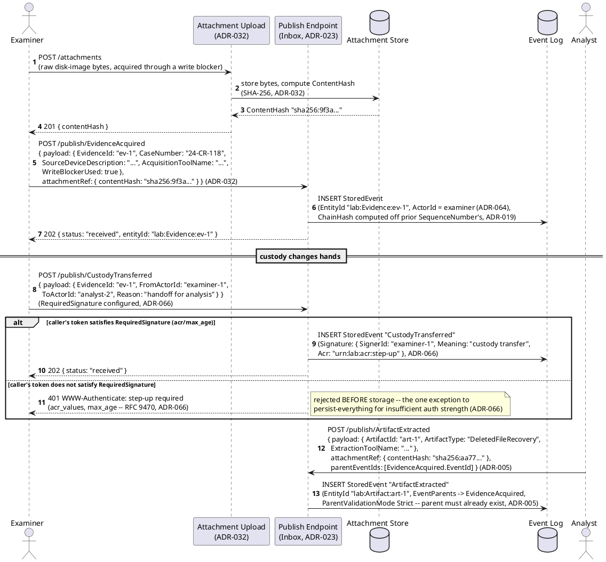
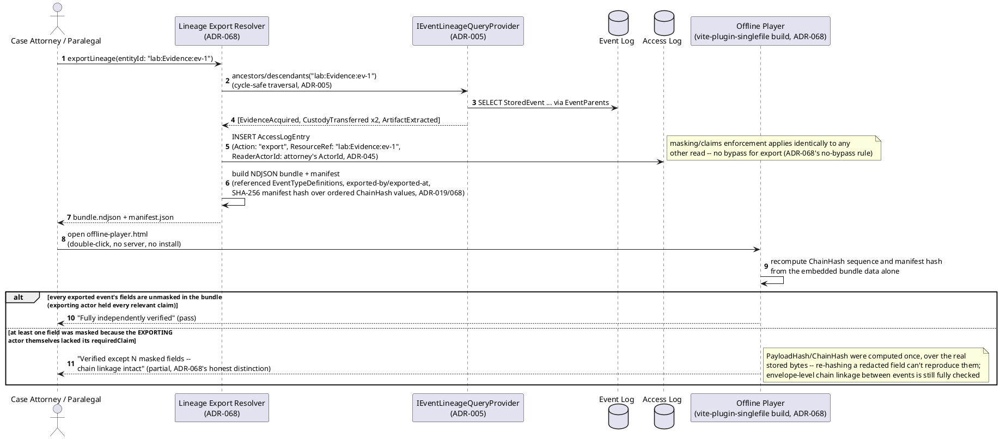
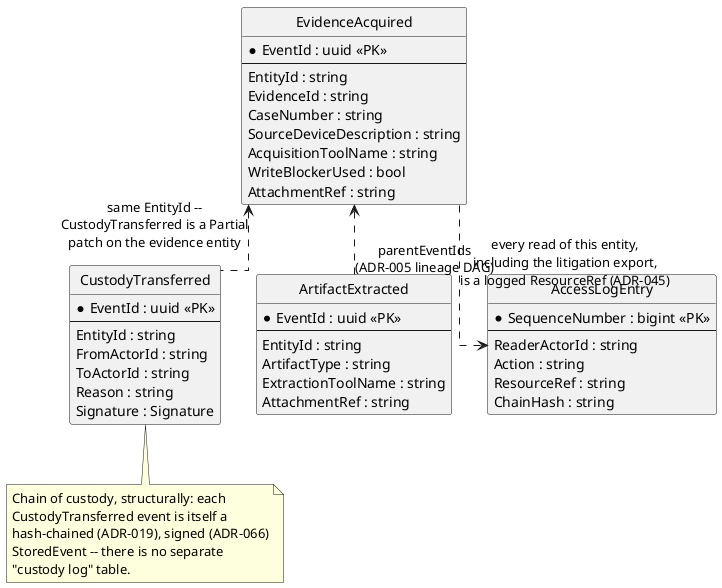
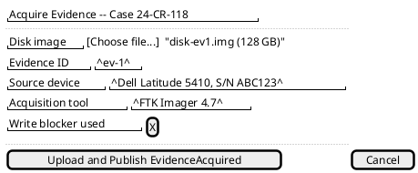
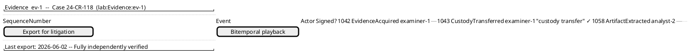
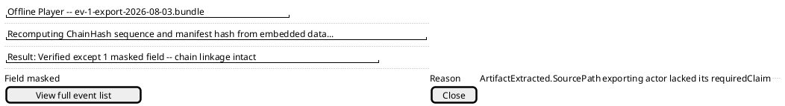

# Feature: Digital Evidence Acquisition and Chain-of-Custody Export

Context: this domain's own [`README.md`](../README.md#applicable-adrs)
calls out `ADR-019` and `ADR-068` as two of its strongest, most direct
fits, and this doc exercises both directly: `ADR-019`'s linear hash chain
(`ChainHash`) is what makes every acquisition and custody-transfer event
tamper-evident, and `ADR-068`'s three-part decision — lineage-scoped
export, bitemporal system-time playback, and the self-contained offline
player — is exercised end to end for a litigation-review handoff. Three
more `README.md`-listed ADRs round out the workflow: `ADR-032` (binary
attachments — the forensic image itself is attachment-shaped content,
this domain's highest-scoring fit of any candidate), `ADR-005` (event
lineage — a derived artifact traces causally to its source acquisition,
a literal DAG), and `ADR-045`/`ADR-066` (the read access audit log *is*
chain of custody; examiner sign-offs at each handoff are `ADR-066`'s
digital-sign-off target case). Envelope/data shapes referenced below
come from
[`../../../data/event-log.md`](../../../data/event-log.md)
(`StoredEvent`, `Signature`, `ChainHash`),
[`../../../data/streaming-and-attachments.md`](../../../data/streaming-and-attachments.md)
(`Attachment`, `AttachmentRef`), and
[`../../../data/access-log.md`](../../../data/access-log.md)
(`AccessLogEntry`).

This doc covers only what's specific to an evidence item's own
acquisition-through-litigation-export path. It deliberately does
**not** re-derive:
- Attachment upload/content-addressing/chunking mechanics in general
  (`POST /attachments`, `ContentHash` dedup, tiering) — that's
  `ADR-032`'s own decision record and
  [`../../../features/binary-attachments.md`](../../../features/binary-attachments.md).
  This doc only shows a disk image *as* an `AttachmentRef` on
  `EvidenceAcquired`, not the upload mechanism itself.
- Delegated, capped, entity-scoped access grants for opposing counsel or
  a secondary examiner (`ADR-043`/`ADR-044`) — a real secondary fit this
  domain's `README.md` names, but deliberately out of scope here to keep
  this doc's focus on acquisition/custody/export; see that ADR's own
  record for the grant mechanism itself.
- `RequiredSignature`/RFC 9470 step-up mechanics in general — this doc
  shows the one specific trigger (a custody-transfer handoff) that needs
  it, not the mechanism's full decision record (`ADR-066`).
- Masking/`x-masking` mechanics — a real but secondary fit here (evidence
  may contain PII/PHI needing redaction for discovery); the export
  mechanism below enforces it unchanged, but this doc doesn't re-explain
  the wrapper shape, covered by
  [`../../../features/masking.md`](../../../features/masking.md) and,
  for the domain that stress-tests it hardest, this domain's sibling
  government-case-management feature doc.

## Sequence diagram — acquisition, custody transfer, and derived-artifact lineage



## Sequence diagram — litigation export and offline-player self-verification



## Data model (ER diagram)



Full `StoredEvent`/`Signature`/`Attachment`/`AttachmentRef` columns are
in [`../../../data/event-log.md`](../../../data/event-log.md) and
[`../../../data/streaming-and-attachments.md`](../../../data/streaming-and-attachments.md);
full `AccessLogEntry` columns are in
[`../../../data/access-log.md`](../../../data/access-log.md).

```csharp
// Payload shape for event type "EvidenceAcquired" v1
// (ChangeKind: Full, EntityIdField: "$.EvidenceId")
public class EvidenceAcquiredPayload
{
    public string EvidenceId { get; set; } = default!;         // -> EntityId "lab:Evidence:{EvidenceId}" (ADR-021)
    public string CaseNumber { get; set; } = default!;
    public string SourceDeviceDescription { get; set; } = default!;
    public string AcquisitionToolName { get; set; } = default!;
    public bool WriteBlockerUsed { get; set; }
}
// Envelope: ActorId = examiner (ADR-064, always populated, blocking);
// AttachmentRef.ContentHash points at the uploaded disk image bytes (ADR-032) --
// the image itself never rides inside Payload, keeping SchemaValidationService's
// parse cost independent of image size (the same reasoning ADR-031 applies to telemetry).

// Payload shape for event type "CustodyTransferred" v1
// (ChangeKind: Partial, EntityIdField: "$.EvidenceId", RequiredSignature configured -- ADR-066)
public class CustodyTransferredPayload
{
    public string FromActorId { get; set; } = default!;
    public string ToActorId { get; set; } = default!;
    public string Reason { get; set; } = default!;
}
// Envelope: Signature required (RequiredSignature.AcrValues/MaxAge, ADR-066) -- SignerId denormalizes
// ActorId, Meaning is required ("custody transfer"), Acr records the authentication context actually used;
// tamper evidence is ADR-019's existing ChainHash, no separate signature-integrity mechanism.

// Payload shape for event type "ArtifactExtracted" v1
// (ChangeKind: Partial, EntityIdField: "$.ArtifactId", ParentValidationMode Strict)
public class ArtifactExtractedPayload
{
    public string ArtifactId { get; set; } = default!;          // -> EntityId "lab:Artifact:{ArtifactId}" -- its OWN entity, not a patch on EvidenceAcquired's
    public string ArtifactType { get; set; } = default!;         // e.g. "DeletedFileRecovery", "DecryptedVolume", "TimelineEntry"
    public string ExtractionToolName { get; set; } = default!;
}
// Envelope: parentEventIds = [EvidenceAcquired.EventId] (ADR-005) -- the causal "derived from" link;
// AttachmentRef points at the extracted artifact's own binary content, independently content-addressed (ADR-032).
```

## Salt (UI mockup) — acquisition intake, the custody timeline, and the offline player's verdict

### Screen 1: Examiner's acquisition intake form



**Upload and Publish EvidenceAcquired** first runs the `POST
/attachments` upload from the first sequence diagram, computing the disk
image's `ContentHash` (`ADR-032`), then publishes `EvidenceAcquired`
carrying that hash as its `AttachmentRef`. The new `ChainHash` extends
the Event Log's existing chain (`ADR-019`) immediately, without waiting
for any later custody handoff. Once acquired, the item shows up on
Screen 2, the chain-of-custody timeline.

### Screen 2: Chain-of-custody timeline for one evidence item



Each row is one hash-chained `StoredEvent` from the timeline the first
sequence diagram builds — the `CustodyTransferred` row's signed checkmark
is only ever set once `ADR-066`'s RFC 9470 step-up challenge is
satisfied, exactly as that diagram's `alt` branch requires before
storage. Clicking **Export for litigation** runs the second sequence
diagram's lineage export end to end and hands the resulting bundle to
Screen 3, the offline player.

### Screen 3: Offline player's verification result



This is the second sequence diagram's offline-player step, opened by
double-clicking `offline-player.html` with no server or install
(`ADR-068`) — no network round trip back to Screen 1 or 2 is involved.
The verdict shown here is the honest partial case: envelope-level chain
linkage is still fully re-verified, but one field's original
`PayloadHash`/`ChainHash` can't be re-derived because the exporting actor
themselves lacked that field's `requiredClaim` at export time, so the
bundle never carried the real bytes to re-hash.

## Gherkin

```gherkin
Feature: Digital Evidence Acquisition and Chain-of-Custody Export
  As a forensics lab
  I want acquisition, every custody handoff, and derived artifacts recorded as tamper-evident, signed events
  So that a litigation reviewer can export and independently re-verify the full chain of custody with no reliance on the lab's own testimony

  Background:
    Given the event type "EvidenceAcquired" version 1 is registered with ChangeKind "Full" and EntityIdField "$.EvidenceId"
    And the event type "CustodyTransferred" version 1 is registered with ChangeKind "Partial", EntityIdField "$.EvidenceId", and RequiredSignature { AcrValues: ["urn:lab:acr:step-up"], MaxAge: 300 }
    And the event type "ArtifactExtracted" version 1 is registered with ChangeKind "Partial", EntityIdField "$.ArtifactId", and ParentValidationMode "Strict"
    And "examiner-1" has acquired evidence "lab:Evidence:ev-1" with an uploaded disk image at ContentHash "sha256:9f3a..."

  Scenario: Acquiring evidence links the event to the uploaded disk image
    When "examiner-1" publishes "EvidenceAcquired" for EvidenceId "ev-1" with AttachmentRef ContentHash "sha256:9f3a..."
    Then the response status should be 202 with entityId "lab:Evidence:ev-1"
    And the stored event's AttachmentRef should resolve to the uploaded disk image
    And the stored event's ChainHash should extend the Event Log's existing chain (ADR-019)

  Scenario: A custody transfer with a sufficiently strong, recent authentication context is signed and stored
    Given "examiner-1"'s current token satisfies acr "urn:lab:acr:step-up" within the last 300 seconds
    When "examiner-1" publishes "CustodyTransferred" for EvidenceId "ev-1" handing off to "analyst-2"
    Then the response status should be 202
    And the stored event's Signature should have SignerId "examiner-1" and Meaning "custody transfer"

  Scenario: A custody transfer attempted with an insufficient authentication context is rejected before storage
    Given "examiner-1"'s current token does not satisfy acr "urn:lab:acr:step-up"
    When "examiner-1" attempts to publish "CustodyTransferred" for EvidenceId "ev-1" handing off to "analyst-2"
    Then the response should be 401 with a WWW-Authenticate step-up challenge naming "urn:lab:acr:step-up"
    And no "CustodyTransferred" event should be stored
    # The one publish outcome rejected before storage under ADR-023's otherwise persist-everything
    # posture -- insufficient authentication strength, not a content/schema problem (ADR-066).

  Scenario: Extracting an artifact links it to its source evidence, forming a lineage DAG
    When "analyst-2" publishes "ArtifactExtracted" for ArtifactId "art-1" with parentEventIds [ EvidenceAcquired.EventId for "ev-1" ]
    Then a new entity "lab:Artifact:art-1" should exist, distinct from "lab:Evidence:ev-1"
    And querying descendants of "lab:Evidence:ev-1" should include "lab:Artifact:art-1"

  Scenario: Exporting the evidence's lineage writes an access-log entry and a chain-derived manifest hash
    Given evidence "lab:Evidence:ev-1" has an EvidenceAcquired event, two CustodyTransferred events, and one ArtifactExtracted event in its lineage
    When "attorney-1" requests a lineage export for "lab:Evidence:ev-1"
    Then an AccessLogEntry should be written with Action "export" and ResourceRef "lab:Evidence:ev-1"
    And the export bundle's manifest hash should be a SHA-256 over the ordered ChainHash values of every exported event

  Scenario: The offline player fully verifies an export containing no masked fields
    Given every field in "lab:Evidence:ev-1"'s exported bundle was visible to the exporting actor
    When the offline player loads the bundle and recomputes its chain
    Then it should report "Fully independently verified"

  Scenario: The offline player reports partial verification when the exporting actor itself lacked a field's claim
    Given one field in "lab:Evidence:ev-1"'s exported bundle was masked because "attorney-1" lacked its requiredClaim
    When the offline player loads the bundle and recomputes its chain
    Then it should report "Verified except 1 masked field -- chain linkage intact"
    And it should not report a plain, undifferentiated pass
    # A masked field's original ChainHash/PayloadHash was computed over bytes the bundle no longer
    # carries -- the player can still confirm envelope-level chain linkage, just not re-derive that
    # one event's exact original hash from redacted content (ADR-068's stated, honest limitation).
```
