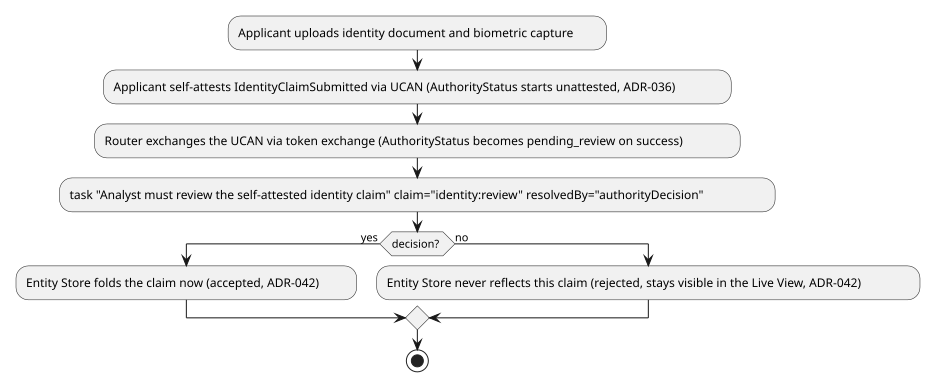
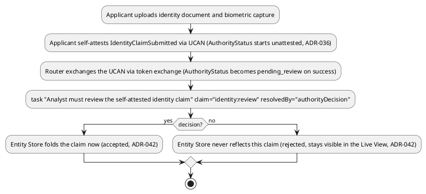
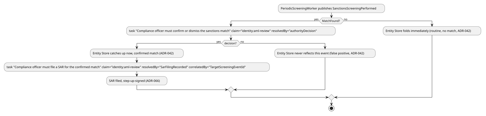
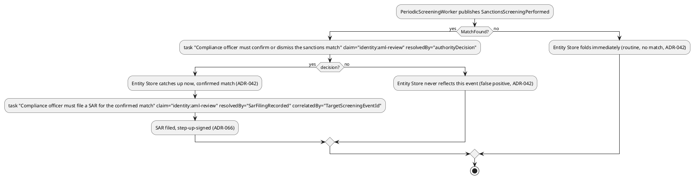

[← Domains index](../README.md)

# Domain: Digital Identity / KYC

**Status: Chosen proving-ground domain** (one of two — see
`docs/comparisons/proving-ground-domain.md` for the full comparison and
decision reasoning).

## Overview

An identity-verification/relying-party-onboarding platform (KYC —
Know Your Customer). Chosen specifically because it's the one domain
that makes `ADR-036`'s DID/UCAN adoption *central* rather than
secondary — self-attested identity claims, exchanged via Token Exchange
for a verifiable credential, are exactly what UCAN delegation was
designed for. Paired with clinical trials rather than built alone, both
for combined feature coverage and to avoid this framework reading as
built for one industry.

## Governing regulations/standards

| Framework | What it governs here |
|---|---|
| GDPR | EU subject data, right to erasure |
| eIDAS | EU cross-border electronic identification |
| BSA/FinCEN KYC rules | US anti-money-laundering identity-verification requirements |
| OFAC sanctions screening + BSA SAR filing | Screening verified identities against sanctions lists and filing Suspicious Activity Reports — resolved, `ADR-079`: an extensibility seam (`ISanctionsScreeningProvider`) scoped to this application's own composition root |
| SOC 2 | Relying-party trust/security expectations for an identity-verification service — a cross-cutting baseline for essentially any multi-tenant SaaS deployment of this framework, not unique to this domain |

## Applicable ADRs

**Primary fit (the domain's defining characteristics):**
- `ADR-036` — DID/UCAN self-attestation, exchanged via OAuth Token
  Exchange (RFC 8693) — the domain's central mechanism, not incidental.
- `ADR-035` — non-authoritative capture: a self-attested identity claim
  is captured immediately, verified/adjudicated later.
- `ADR-057` — GDPR erasure via crypto-shredding — real subject
  erasure requests are a routine KYC-platform occurrence.
- `ADR-060` — outbound webhooks: notifying relying parties of
  verification status changes.
- `ADR-058` — tenant rate limiting: many relying parties/API consumers
  calling the same verification service.
- `ADR-045` — read access audit log — compliance-driven access
  accountability.
- `ADR-047` — claims augmentation for federated IdPs, when a relying
  party's own IdP needs enrichment with this platform's
  verification-specific claims.
- `ADR-008` — event-type `RequiredClaims` — added, found missing by a
  Phase 2 domain-completeness audit despite being the base claim-gating
  mechanism every feature doc in this domain actually registers events
  against.
- `ADR-066` — step-up authentication (RFC 9470) — added; load-bearing
  for the entire SAR-filing flow (`periodic-screening-and-sar-
  escalation.md`), not incidental.
- `ADR-079` — sanctions/watchlist screening extensibility seam — added;
  this domain's own use case is what motivated the ADR, discussed at
  length in Special Concerns below but previously absent from this list.
- `ADR-096` — searchable blind-index encryption — added; every one of
  this domain's 4 feature docs has a dedicated section using it.

**Secondary fit:**
- `ADR-009`/`ADR-050`/`ADR-052` — PII masking/classification.
- `ADR-030` — multi-tenancy (multiple relying parties).
- `ADR-032` — binary attachments (ID document scans/photos).
- `ADR-033`/`ADR-034` — replication/sharding, moderate.
- `ADR-061` — data residency — many countries require identity data to
  stay in-country, a real driver for this mechanism.
- `ADR-043`/`ADR-044` — delegated access/application-defined
  permissions, moderate.
- `ADR-101` — PlantUML-native flow engine — added; backs this README's
  own Workflow A/C diagrams directly, an infrastructure fit rather than
  a domain-defining one.
- `ADR-072` — bulk ingestion & interchange-format adapters — added; this
  domain's own new vCard/jCard `VCardAdapter` (Workflow D) is a concrete
  instance of that ADR's extensibility seam, an infrastructure fit
  rather than a domain-defining one, same framing as `ADR-101` above.

**Weak/no fit:**
- `ADR-031` (streaming channels) — no natural telemetry story at all,
  the mirror image of clinical trials' weak spot (DID/UCAN).

## Workflows

Five feature docs, together tracing four real end-to-end workflows
through this domain — not five disconnected examples. Every entity below
resolves to the same running example, `kyc:ApplicantIdentity:applicant-1001`
(`ADR-021`'s `{appId}:{entityType}:{uniqueId}` format), so a reader can
follow one applicant's full lifecycle across all four docs.

- **Workflow A — Document/Biometric Capture → Verification.**
  1. [Document and Biometric Capture](features/document-and-biometric-capture.md)
     — the applicant uploads identity documents and completes a biometric
     liveness capture (`ADR-032` attachments, `ADR-009` masking, `ADR-042`'s
     automated-detector `AuthorityStatus` trigger).
  2. [Customer Onboarding and Identity Verification](features/customer-onboarding-and-identity-verification.md)
     — the applicant self-attests a DID/UCAN identity claim, which an
     analyst then reviews to an accepted, claims-bearing identity record
     (`ADR-036`, `ADR-035`/`ADR-042`, `ADR-046`).

`ADR-101`'s flow engine executes the analyst's review decision directly
— embedded verbatim as `Samples.Meridian.customer-onboarding-and-
identity-verification.puml`, the `meridian-workflow-a-identity-
verification` flow.

- **Workflow B — Relying-Party Access.**
  1. [Relying-Party Verification Request](features/relying-party-verification-request.md)
     — a relying party (a bank, a landlord) requests confirmation of the
     now-verified customer's identity via a delegated, entity-scoped,
     time-boxed UCAN credential (`ADR-043`'s "secondary opinion" grant
     mechanism applied to identity presentation), with the read logged
     (`ADR-045`) and the response claims-gated (`ADR-046`).
- **Workflow C — Ongoing Screening & SAR Escalation.**
  1. [Periodic Screening and SAR Escalation](features/periodic-screening-and-sar-escalation.md)
     — a periodic re-screening job flags a sanctions-list match as an
     unconfirmed detector output (`ADR-042`), a compliance officer
     decides it (`ADR-046`/`ADR-050`), and a confirmed hit escalates to a
     digitally signed SAR filing record (`ADR-066`). Deliberately
     demonstrates the manual-decision flow `ADR-079`'s
     `ISanctionsScreeningProvider` seam composes with, not replaces.

`ADR-101`'s flow engine executes both of this workflow's decision points
— embedded verbatim as `Samples.Meridian.periodic-screening-and-sar-
escalation.puml`, the `meridian-workflow-c-sanctions-screening-and-sar`
flow. Two sequential `task` nodes share one key via their own distinct
`correlatedBy` fields (`targetEventId` for the confirm/dismiss decision,
`TargetScreeningEventId` for the SAR filing) — confirmed against this
workflow's own Gherkin that `SarFilingRecorded` only ever follows an
already-accepted `authorityDecision`, never an alternative resolution,
so no engine change was needed to support it.

- **Workflow D — Contact/Profile Data Portability & Interchange.**
  1. [Contact/Profile and vCard Interchange](features/contact-profile-and-vcard-interchange.md)
     — a contact/profile record (address, phone, email, organization) is
     imported from a standard vCard/jCard representation (`ADR-072`'s
     new `VCardAdapter`), captured non-authoritatively pending analyst
     review (`ADR-035`/`ADR-042`, reusing the same `authorityDecision`
     resolver every other workflow in this domain already uses), then
     exported back out to a relying party in the same standard form.
     Not currently wired into `ADR-101`'s flow engine (no
     `Samples.Meridian` flow file exists for it) — purely a design-doc
     level workflow trace, unlike Workflows A and C above.

## Feature docs

All five docs the Workflows section above sequences:

- [Document and Biometric Capture](features/document-and-biometric-capture.md) — the upstream half of onboarding: attachment upload/linking and biometric liveness capture, feeding the identity claim below.
- [Customer Onboarding and Identity Verification](features/customer-onboarding-and-identity-verification.md) — an applicant's self-attested DID/UCAN identity claim (`ADR-036`) flows from non-authoritative capture (`ADR-035`/`ADR-042`) through analyst review to an accepted, claims-bearing identity record (`ADR-046`).
- [Relying-Party Verification Request](features/relying-party-verification-request.md) — a delegated, entity-scoped, time-boxed access grant (`ADR-043`) lets a relying party pull a claims-gated confirmation of verification status, logged (`ADR-045`).
- [Periodic Screening and SAR Escalation](features/periodic-screening-and-sar-escalation.md) — periodic re-screening, compliance review, and digitally signed SAR filing (`ADR-066`), demonstrating the manual-decision flow `ADR-079`'s sanctions-screening seam composes with.
- [Contact/Profile and vCard Interchange](features/contact-profile-and-vcard-interchange.md) — a Contact/Profile entity mapped onto vCard 4.0 (`ADR-072`'s new `VCardAdapter`, RFC 6350/7095), imported non-authoritatively and exported back out to relying parties in jCard form.

## Special concerns

- **No natural streaming-telemetry use** — if this domain is ever
  extended toward continuous biometric verification (e.g., liveness
  video), `ADR-031`/`ADR-070` become relevant; not needed for the
  baseline KYC verification workflow.
- **Erasure is routine here, not exceptional** — unlike clinical
  trials/brokerage, this domain has no strong retention-vs-erasure
  tension pulling the other way; a KYC platform should expect and
  handle erasure requests as ordinary traffic.
- **Data residency is a first-order concern, not an edge case**
  (`ADR-061`) — many jurisdictions legally require identity-verification
  data to stay within-country; this domain is a strong real-world
  driver for that mechanism, not a hypothetical one.
- **OFAC sanctions screening / BSA Suspicious Activity Report filing —
  resolved, `ADR-079` (see `docs/changes/2026-07-31.md`).** Verified
  identities routinely need screening against sanctions lists, and a
  match can trigger a mandatory SAR filing to FinCEN — `ADR-079` decided
  this is an extensibility seam (`ISanctionsScreeningProvider`, shaped
  like `ADR-057`'s `IErasureKeyStore`), scoped to this application's own
  composition root, not core Duplex. See [Periodic Screening and SAR
  Escalation](features/periodic-screening-and-sar-escalation.md) for the
  manual-decision flow the seam composes with.
- **Accessibility (`ADR-073`)** — relying-party-facing verification
  screens render through this framework's client the same as any other
  domain; WCAG 2.1 AA applies here too, not just the
  government-case-management candidate it was originally tagged under.
- **GDPR breach notification (Art. 33/34) — resolved, `ADR-045`'s
  addendum.** This domain already relies on GDPR for subject-erasure
  rights above; the 72-hour notification *workflow* itself is
  deliberately out of framework scope — an external legal/business
  process. `ADR-045`'s access audit log supplies the forensic inputs a
  compliance team's own process would use.

## Glossary

- **Anti-Money Laundering (AML)** — The body of law, regulation, and
  internal controls aimed at preventing the proceeds of crime from
  entering the legitimate financial system; KYC verification is the
  entry-point control this domain implements toward that goal.
- **Beneficial Owner** *(synonym: Ultimate Beneficial Owner (UBO) — the
  term FATF Recommendation 24 and the EU's AMLD registries use for the
  same concept, interchangeable with FinCEN's own rule language)* —
  Under FinCEN's Customer Due Diligence rule, an
  individual who directly or indirectly owns 25% or more of a legal
  entity customer's equity, or who otherwise exercises substantial
  control over it — the real person a KYC check on a corporate customer
  must ultimately identify, not just the entity itself.
- **Customer Due Diligence (CDD)** — The process of verifying a
  customer's identity and assessing the risk they pose, required before
  or during a business relationship under BSA/FinCEN rules.
- **Decentralized Identifier (DID)** — A W3C-standardized identifier a
  subject controls directly, rather than one issued and controlled by a
  central registry, and cryptographically verifiable without a
  third-party lookup — the identity primitive `ADR-036`'s self-
  attestation is built directly on.
- **eIDAS Level of Assurance** — The EU's three-tier scale (Low/
  Substantial/High) for how strongly a digital identity claim has been
  verified, which in turn determines which authentication/verification
  method is acceptable for a given transaction.
- **Know Your Customer (KYC)** — The general obligation, arising mostly
  from AML law, for a regulated entity to verify who its customer
  actually is before establishing a relationship — this domain's own
  name and defining workflow.
- **Politically Exposed Person (PEP)** — An individual who is or has
  been entrusted with a prominent public function (and, by extension,
  their family members and close associates), subject to enhanced due
  diligence under FATF's recommendations because of elevated corruption/
  bribery risk.
- **Relying Party** *(synonym: Service Provider (SP) — SAML's name for
  the identical role OIDC/OAuth call Relying Party)* — An organization
  that consumes another party's
  identity-verification result rather than performing verification
  itself — the KYC platform's own customer in this domain, and the
  recipient of `ADR-060`'s outbound webhooks and `ADR-047`'s claims
  augmentation.
- **Sanctions List** — A government-maintained list (e.g. OFAC's
  Specially Designated Nationals, or SDN, list) of individuals and
  entities a regulated entity is prohibited from transacting with;
  screening against it is a standing KYC obligation, not optional — the
  extensibility seam `ADR-079` resolves for this domain.
- **Suspicious Activity Report (SAR)** *(synonym: Suspicious Transaction
  Report (STR) — the term most non-US, FATF-aligned jurisdictions use
  for the same underlying filing obligation)* — A filing a US financial
  institution must submit to FinCEN when it knows, suspects, or has
  reason to suspect a transaction (generally $5,000 or more, or $2,000
  or more once a suspect has been identified) involves illicit activity
  — the other half of the same `ADR-079`-resolved concern.
- **Verifiable Credential (VC)** — A W3C-standardized, cryptographically
  signed digital credential (e.g. "this DID passed identity
  verification") that can be presented and checked without contacting
  the original issuer each time — the natural companion artifact to
  `ADR-036`'s DID/UCAN self-attestation.
