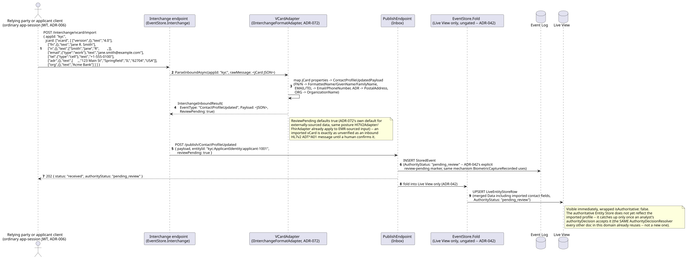
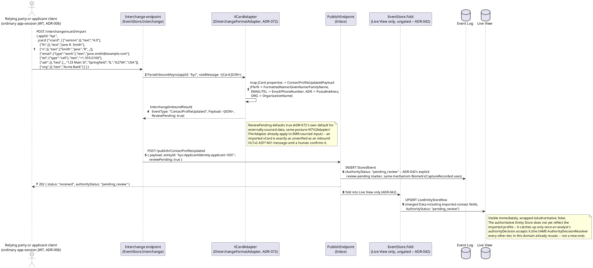
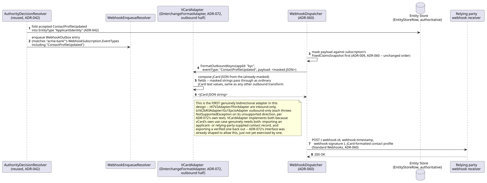
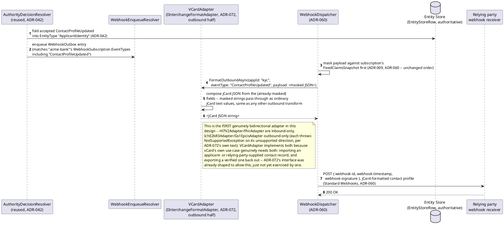
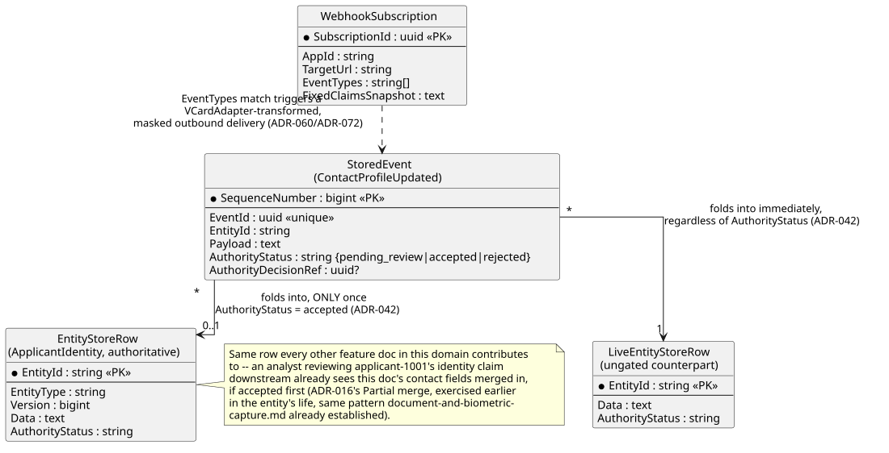
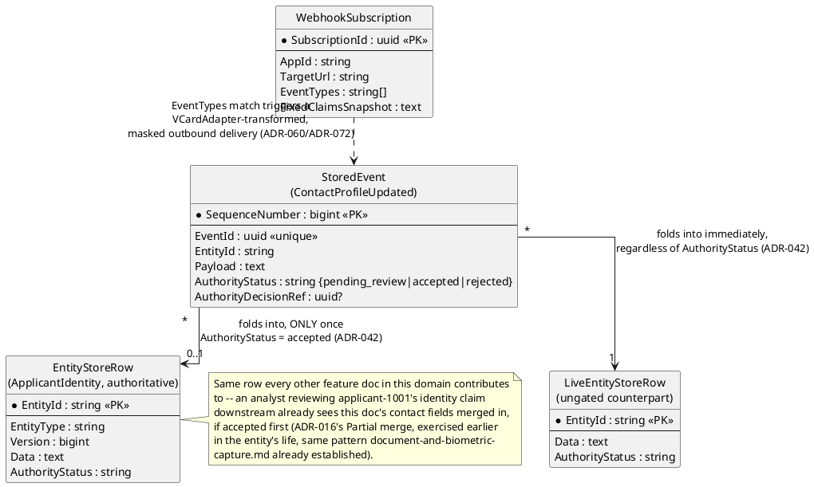
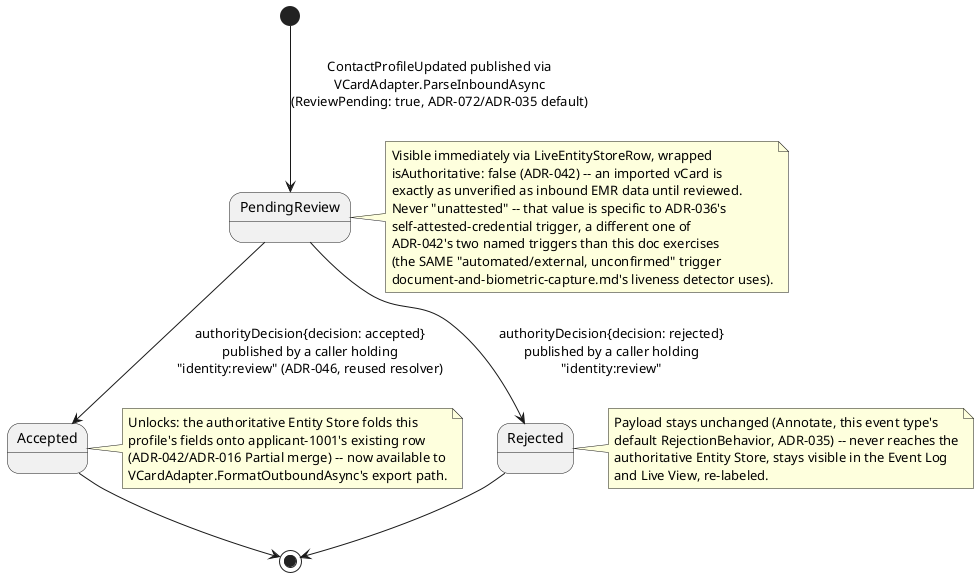
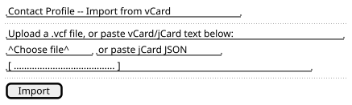
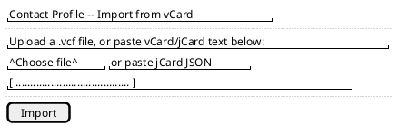

# Feature: Contact/Profile and vCard Interchange

Context: `TODO.md` flagged that no `Contact`/`Profile`-shaped entity exists
anywhere in `src/` (confirmed by search — no `FirstName`/`GivenName`/
`EmailAddress`/`PhoneNumber`/`Contact`/`Profile` field anywhere in this
domain or the broader codebase) even though vCard (RFC 6350) import/
export had already been added to
[`../../../references.md`](../../../references.md) as adopted in
principle. This doc closes that gap: it designs the entity vCard data
actually maps onto, then designs vCard import/export as a new
`IInterchangeFormatAdapter` implementation (`ADR-072`) against it — a
new *concrete instance* of that ADR's own extensibility seam, not a new
decision (`ADR-072`'s own adapter list ends in "...", explicitly
anticipating more without a new ADR each time).

Like [`document-and-biometric-capture.md`](document-and-biometric-capture.md),
this doc's event targets the *same* `EntityId` the other three feature
docs' events do — `kyc:ApplicantIdentity:applicant-1001` (`ADR-021`) —
via `EntityIdField "$.ApplicantId"`, merging via `ChangeKind.Partial`
(`ADR-016`/`ADR-022`) onto whatever the same `EntityStoreRow` already
carries. This is a genuinely new contribution to that row, not a
duplicate of an existing one: `IdentityClaimSubmitted`'s
`ClaimedLegalName`/`DateOfBirth` are the self-attested facts an
analyst adjudicates identity *against*; this doc's fields are the
richer *contact/profile* record (address, phone, email, organization)
a relying party needs to actually correspond with or onboard a
now-verified customer — a different, complementary purpose for the
same underlying applicant, not a second copy of the same fact. `BDAY`
is the one property RFC 6350 defines that this domain already captures
elsewhere (`DateOfBirth`) — deliberately **not** re-collected here to
avoid two independently-arriving representations of the same fact
racing to fold onto one row.

This build stage scopes RFC 6350's own property categories narrowly,
the same honestly-scoped-subset convention `FhirAdapter` ("Patient
resource only") and `IchE2bR3Adapter` ("case ID, patient identifier,
one drug, one reaction") already establish in
[`../../../adrs/adr-072-bulk-ingestion-and-interchange-format-adapters.md`](../../../adrs/adr-072-bulk-ingestion-and-interchange-format-adapters.md):
**Identification** (`FN`, `N`, `NICKNAME`), **Communications** (`EMAIL`,
`TEL`, `LANG`), **Delivery Addressing** (`ADR`, `TZ`), **Organizational**
(`TITLE`, `ORG`), and **Explanatory** (`CATEGORIES`) — `PHOTO`, `GENDER`,
`ANNIVERSARY`, `IMPP`, `RELATED`, `KEY`, and every Calendar property
(`FBURL`/`CALADRURI`/`CALURI`) are out of scope for this build stage,
same honest-subset framing, not silently dropped.

The wire format is **jCard (RFC 7095)**, not raw vCard text — this
framework's own JSON-first bias, the identical reasoning
[`../../../references.md`](../../../references.md) already gives for
preferring jCal over raw ICS for the (separately adopted-in-principle,
unbuilt) iCalendar stack.

This doc deliberately does **not** re-derive:
- General `IInterchangeFormatAdapter` mechanics (the keyed-DI seam
  itself, `InterchangeInboundResult`, the inbound-publishes-through-
  the-ordinary-Inbox-path/outbound-composes-ahead-of-webhook-delivery
  split) — that's `ADR-072` itself; this doc only shows this one new
  concrete adapter.
- The general `AuthorityStatus` lifecycle, `authorityDecision`
  mechanics, or the `Annotate`/`Compensate` fork — that's `ADR-035`/
  `ADR-042` and
  [`../../../features/non-authoritative-capture.md`](../../../features/non-authoritative-capture.md);
  this doc only shows that an *imported* contact profile is external,
  unverified data, defaulting to the identical review-pending posture
  `ADR-072` already gives HL7v2/FHIR-sourced EMR data, reusing the exact
  same `AuthorityDecisionResolver` [`customer-onboarding-and-identity-
  verification.md`](customer-onboarding-and-identity-verification.md)'s
  analyst review already exercises.
- The full `x-masking` wrapper mechanics — that's `ADR-009`/`ADR-050` and
  [`../../../features/masking.md`](../../../features/masking.md); this
  doc only shows which of *this* entity's fields get classified and why.
- Standard Webhooks signing/retry/dead-lettering mechanics or
  `FixedClaimsSnapshot` masking-at-registration-time — that's `ADR-060`
  itself, already exercised end-to-end in [`customer-onboarding-and-
  identity-verification.md`](customer-onboarding-and-identity-verification.md);
  this doc only shows the new pre-delivery jCard transform step
  `ADR-072` inserts ahead of it.
- **CardDAV (RFC 6352) as a built transport surface** — considered and
  declined for this build stage, for the *same* reason `ADR-032`
  declined WebDAV entirely for attachment browsing
  ([`../../../comparisons/webdav-library.md`](../../../comparisons/webdav-library.md)):
  CardDAV is itself a WebDAV extension (address-book collections over
  the same `PROPFIND`/`REPORT` machinery), and this domain's plain
  HTTP publish/query surface already serves both directions this doc
  needs — an address-book-collection-style calendar-client sync surface
  remains a real, named future possibility if a concrete client
  integration ever needs OS-native/calendar-app-native contact sync,
  not built here.
- **OFAC sanctions screening and BSA SAR filing** — this domain's own
  README names this as a genuine gap with no covering ADR
  (`docs/10-open-questions.md`); nothing below is a screening or
  AML-risk decision.

## Sequence diagram — importing a vCard (jCard) as a non-authoritative contact profile





## Sequence diagram — exporting an accepted contact profile as jCard to a relying party





Masking happens **before** the jCard transform, not after — the same
order `ADR-072` already establishes generically ("an adapter transforms
an outbound event into the external format *before* delivery") applied
concretely here: `VCardAdapter.FormatOutboundAsync` never sees an
unmasked field it isn't supposed to, since `WebhookDispatcher` already
masked the JSON payload against the subscription's `FixedClaimsSnapshot`
before handing it to the adapter at all.

**GDPR Article 20 (data portability) note, flagged not designed
further here**: this same `VCardAdapter.FormatOutboundAsync` transform
is the natural mechanism a future subject-initiated self-service export
endpoint would reuse to satisfy a portability request in jCard form —
this doc doesn't design that endpoint, since `ADR-072`'s own decided
outbound path is webhook-triggered, not on-demand; a self-service export
surface would need its own design pass if/when a real requirement
appears, the same "flagged, not built" honesty this domain already
applies elsewhere (OFAC/SAR before `ADR-079`, streaming telemetry).

## Data model (ER diagram)





```csharp
// Registered event type "ContactProfileUpdated" v1 (schema-registry.md);
// EntityIdField "$.ApplicantId" -> "kyc:ApplicantIdentity:{ApplicantId}" (ADR-021)
// ChangeKind: Partial (ADR-016) -- merges onto the same row every other
// event type in this domain already contributes to.
public class ContactProfileUpdatedPayload
{
    public string ApplicantId { get; set; } = default!;
    public string FormattedName { get; set; } = default!;   // vCard FN -- x-masking: PII, requiredClaim "identity:pii-read"
    public string GivenName { get; set; } = default!;        // vCard N (given) -- masked
    public string FamilyName { get; set; } = default!;       // vCard N (family) -- masked
    public string? NickName { get; set; }                    // vCard NICKNAME -- masked
    public string? Email { get; set; }                        // vCard EMAIL -- masked
    public string? PhoneNumber { get; set; }                  // vCard TEL -- masked
    public PostalAddress? PostalAddress { get; set; }         // vCard ADR -- masked
    public string? TimeZone { get; set; }                     // vCard TZ -- NOT masked (not personally identifying alone)
    public string? PreferredLanguage { get; set; }            // vCard LANG -- NOT masked
    public string? JobTitle { get; set; }                     // vCard TITLE -- NOT masked (business context)
    public string? OrganizationName { get; set; }             // vCard ORG -- NOT masked
    public string[]? Categories { get; set; }                 // vCard CATEGORIES -- NOT masked
    // UID is NOT a separate field -- ApplicantId already is this entity's
    // stable identifier; ADR-021's own EntityId already serves UID's purpose.
    // BDAY deliberately NOT collected here -- see this doc's context note.
}

public class PostalAddress
{
    public string? Street { get; set; }
    public string? Locality { get; set; }
    public string? Region { get; set; }
    public string? PostalCode { get; set; }
    public string? Country { get; set; }
}

// ADR-072's new concrete adapter -- the first genuinely bidirectional one.
public class VCardAdapter : IInterchangeFormatAdapter
{
    // Parses a jCard (RFC 7095) JSON array, maps FN/N/EMAIL/TEL/ADR/TZ/
    // LANG/TITLE/ORG/CATEGORIES onto ContactProfileUpdatedPayload, and
    // returns ReviewPending: true -- external/imported data defaults to
    // non-authoritative capture (ADR-035/072), same as Hl7V2Adapter/FhirAdapter.
    public Task<InterchangeInboundResult> ParseInboundAsync(string appId, string rawMessage, CancellationToken ct = default) { /* ... */ }

    // Composes an already-masked ContactProfileUpdated payload into jCard
    // JSON for WebhookDispatcher's pre-delivery transform step (ADR-072).
    public Task<string> FormatOutboundAsync(string appId, string eventType, JsonNode? payload, CancellationToken ct = default) { /* ... */ }
}
```

## Searchable encryption — duplicate contact-record detection (`ADR-096`)

The same real KYC fraud signal [`customer-onboarding-and-identity-
verification.md`](customer-onboarding-and-identity-verification.md)
already applies to `ClaimedLegalName`, applied here to `Email`: a
different applicant submitting a contact profile with an email address
already on file for another `ApplicantId` is a real flag worth an
analyst's attention. `Email` is genuinely high-cardinality (unlike
`DateOfBirth` elsewhere in this domain), so no `acknowledgeLeakageRisk`
override is needed, matching `ExtractedDocumentNumber`'s own precedent
in [`document-and-biometric-capture.md`](document-and-biometric-capture.md):

```json
"Email": {
  "type": "string",
  "x-masking": { "requiredClaim": "identity:pii-read", "strategy": "PartialReveal", "regulatoryClassification": "PII" },
  "x-masking-searchable": { "indexKind": "Equality", "keyScope": "Shared", "cardinality": "High" }
}
```

## State machine — an imported contact profile's `AuthorityStatus` lifecycle




## Salt (UI mockup) — importing and reviewing a contact profile

Two screens: an applicant/relying-party-facing import screen, and the
same analyst review queue [`customer-onboarding-and-identity-
verification.md`](customer-onboarding-and-identity-verification.md)
already introduces, extended with this doc's new event type.

**Screen 1 — vCard import** (corresponds to the first sequence
diagram's `POST /interchange/vcard/import` call). Transition: clicking
"Import" submits the parsed jCard and moves to a pending-review
confirmation.





**Screen 2 — analyst review queue, extended** (the same queue
`customer-onboarding-and-identity-verification.md`'s own Salt mockup
shows, now also listing contact-profile imports pending review).
Transition: identical to that doc's own — "Accept"/"Reject" resolves
via the same `authorityDecision` mechanism.

```plantuml
@startsalt
{
  { "Verification Analyst -- Review Queue   (role: IdentityVerificationAnalyst, claim: identity:review)" }
  ..
  | Applicant       | Item                          | Submitted   | Status                                       |
  | applicant-1001  | Identity claim                | 2026-07-28  | [ isAuthoritative: false ]  pending_review    |
  | applicant-1001  | Imported contact profile       | 2026-09-03  | [ isAuthoritative: false ]  pending_review    |
  ..
  { "Selected: applicant-1001 -- Imported contact profile" }
  | Field           | Imported value                       |
  | FormattedName   | "J*** R. S****"  ( masked, ADR-009 ) |
  | Email           | "j***@e***.com"  ( masked )           |
  | PhoneNumber     | "+1-555-****"    ( masked )           |
  | OrganizationName| "Acme Bank"      ( not masked )        |
  ..
  [ Accept ] | [ Reject ] | "Reason (required for reject):"
  { "____________________________________" }
}
@endsalt
```




## Gherkin

```gherkin
Feature: Contact/Profile and vCard Interchange
  As a KYC platform operator
  I want to import an applicant's or relying party's contact record from
  a standard vCard (jCard) representation, capture it as non-authoritative
  until an analyst reviews it, and export an accepted profile back out in
  the same standard form
  So that this domain interoperates with standard address-book data
  without inventing a bespoke contact schema or format

  # EntityId format is {appId}:{entityType}:{uniqueId} (ADR-021); scenarios
  # below use appId "kyc" and applicant "applicant-1001" throughout, the
  # same applicant every other feature doc in this domain uses. See
  # customer-onboarding-and-identity-verification.md for the shared
  # authorityDecision/identity:review Background this file's scenarios
  # below assume but don't re-derive.

  Background:
    Given the event type "ContactProfileUpdated" version 1 is registered
      with EntityIdField "$.ApplicantId" and schema:
      """
      {
        "type": "object",
        "properties": {
          "ApplicantId": { "type": "string" },
          "FormattedName": { "type": "string", "x-masking": { "requiredClaim": "identity:pii-read", "strategy": "PartialReveal" } },
          "Email": { "type": "string", "x-masking": { "requiredClaim": "identity:pii-read", "strategy": "PartialReveal" } },
          "PhoneNumber": { "type": "string", "x-masking": { "requiredClaim": "identity:pii-read", "strategy": "PartialReveal" } },
          "OrganizationName": { "type": "string" }
        },
        "required": ["ApplicantId", "FormattedName"]
      }
      """
    And user "analyst-1" holds claim "identity:review" (per customer-onboarding-and-identity-verification.md's Background)
    And relying party "acme-bank" has a WebhookSubscription for AppId "kyc" on EventTypes ["ContactProfileUpdated"] with FixedClaimsSnapshot lacking "identity:pii-read"

  Scenario: Importing a jCard vCard captures a non-authoritative ContactProfileUpdated event
    When I POST to "/interchange/vcard/import" with body:
      """
      {
        "appId": "kyc",
        "jcard": ["vcard", [
          ["version", {}, "text", "4.0"],
          ["fn", {}, "text", "Jane R. Smith"],
          ["n", {}, "text", ["Smith", "Jane", "R", "", ""]],
          ["email", {"type": "work"}, "text", "jane.smith@example.com"],
          ["tel", {"type": "cell"}, "text", "+1-555-0100"],
          ["org", {}, "text", "Acme Bank"]
        ]]
      }
      """
    Then VCardAdapter.ParseInboundAsync should map "fn"/"email"/"tel"/"org" onto FormattedName/Email/PhoneNumber/OrganizationName
    And the response status should be 202 with authorityStatus "pending_review"
    And querying the Live View for "kyc:ApplicantIdentity:applicant-1001" should return the imported fields, wrapped "isAuthoritative": false
    And querying the authoritative Entity Store for "kyc:ApplicantIdentity:applicant-1001" should not yet reflect the imported contact fields
    # ReviewPending defaults true for externally-sourced data (ADR-072/
    # ADR-035) -- identical posture to an inbound HL7v2/FHIR message.

  Scenario: A malformed jCard is rejected before it is ever published
    When I POST to "/interchange/vcard/import" with body:
      """
      { "appId": "kyc", "jcard": ["not-a-vcard", []] }
      """
    Then VCardAdapter.ParseInboundAsync should throw a FormatException
    And no StoredEvent should be persisted for this request
    # Malformed input never reaches the persist-everything path at all --
    # it fails before ADR-023's own guarantee ever applies, same as any
    # other adapter's schema-validation failure.

  Scenario: An analyst accepts an imported contact profile, and the authoritative Entity Store folds it
    Given a "ContactProfileUpdated" event "profile-1" for "applicant-1001" is "pending_review", per above
    When "analyst-1" POSTs to "/publish/authorityDecision" with body:
      """
      { "payload": { "targetEventId": "profile-1", "decision": "accepted", "decidingActorId": "analyst-1", "reason": "contact details confirmed against uploaded documents" } }
      """
    Then the response status should be 202
    And the stored event "profile-1"'s AuthorityStatus should become "accepted"
    And eventually the authoritative Entity Store for "kyc:ApplicantIdentity:applicant-1001" should reflect FormattedName "Jane R. Smith"
    # Reuses the exact same AuthorityDecisionResolver every other doc in
    # this domain already exercises -- not a second resolver.

  Scenario: An accepted contact profile is exported to a relying party as masked jCard
    Given "profile-1" was accepted for "applicant-1001", per above
    When the WebhookDispatcher processes the resulting notification for "acme-bank"'s subscription
    Then the payload should be masked against "acme-bank"'s FixedClaimsSnapshot first (ADR-009/ADR-060)
    And VCardAdapter.FormatOutboundAsync should then compose the masked fields into a jCard JSON document
    And a signed delivery should be sent to "acme-bank"'s TargetUrl carrying that jCard document (Standard Webhooks, ADR-060)
    And the delivered jCard's "email"/"tel" property values should be masked, not the real address/phone
    # Masking happens BEFORE the jCard transform (ADR-072's own ordering:
    # "transforms... before delivery") -- VCardAdapter never sees an
    # unmasked field it isn't supposed to.

  # ADR-096 -- duplicate-contact-record detection, per the "Searchable
  # encryption" section above. A separate Background here, registering
  # ContactProfileUpdated with regulatoryClassification and
  # x-masking-searchable actually present, which the shared Background
  # above deliberately leaves out.

  Scenario: A reused email address across two different applicants is detected without decrypting either to compare
    Given the event type "ContactProfileUpdated" version 1 is registered
      with EntityIdField "$.ApplicantId" and schema:
      """
      {
        "type": "object",
        "properties": {
          "ApplicantId": { "type": "string" },
          "FormattedName": { "type": "string" },
          "Email": {
            "type": "string",
            "x-masking": { "requiredClaim": "identity:pii-read", "strategy": "PartialReveal", "regulatoryClassification": "PII" },
            "x-masking-searchable": { "indexKind": "Equality", "keyScope": "Shared", "cardinality": "High" }
          }
        },
        "required": ["ApplicantId", "FormattedName"]
      }
      """
    And "applicant-1001" imported a contact profile with Email "jane.smith@example.com"
    When "applicant-5001" later imports a contact profile with the same Email "jane.smith@example.com"
    And an analyst queries `on_kyc_ContactProfileUpdated(where: [{ field: "Email", eq: "jane.smith@example.com" }])`
    Then the query should return both "applicant-1001" and "applicant-5001"
    And the generated query should never extract or compare `Payload` as plaintext for `Email`
```
