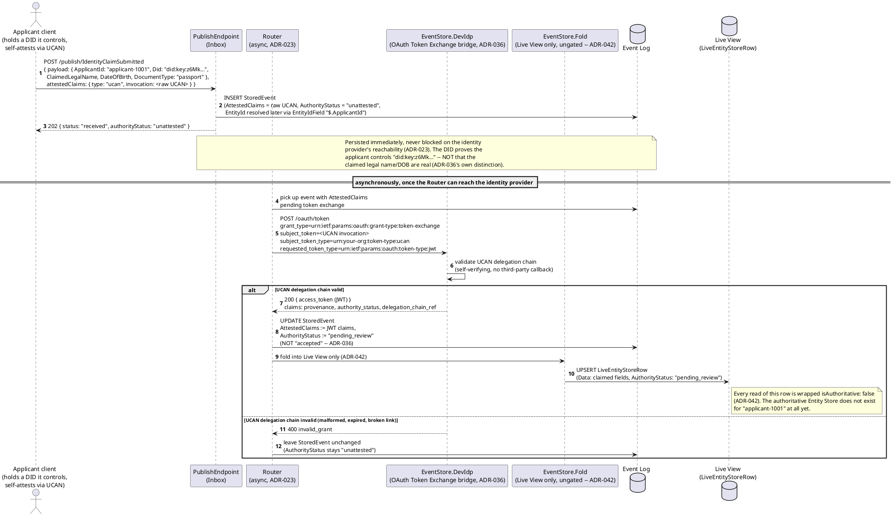
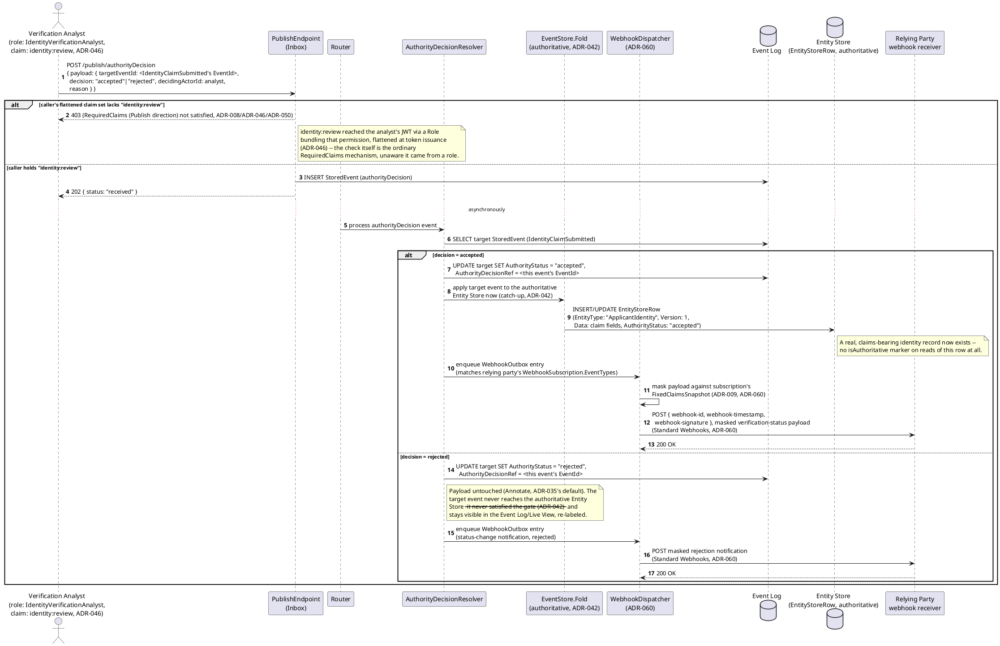
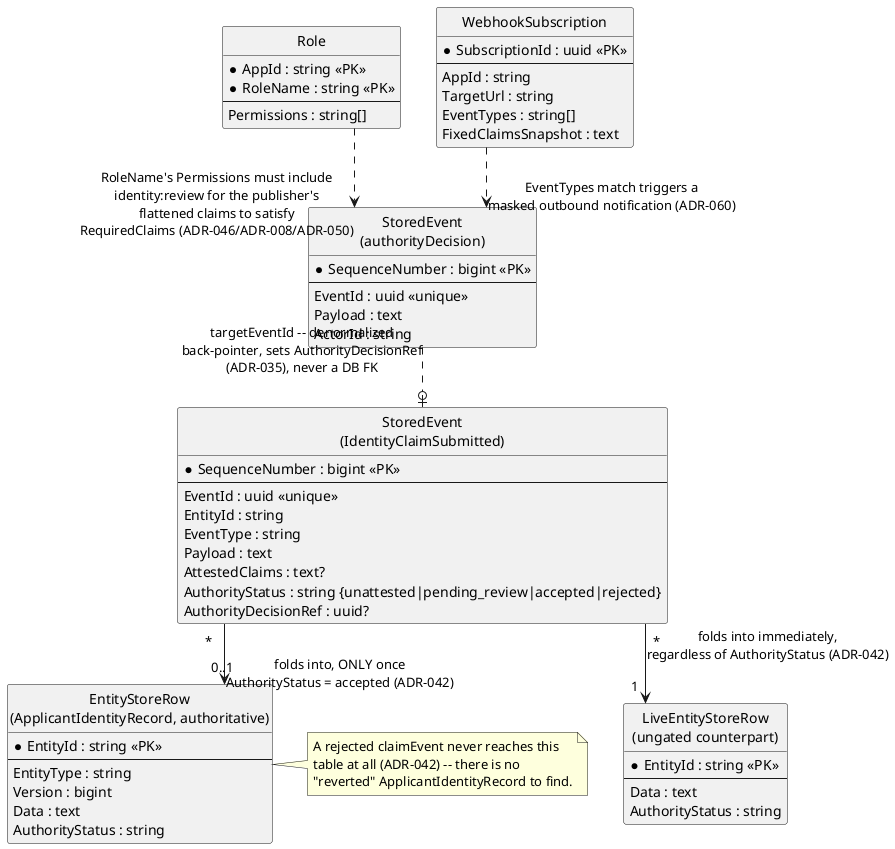
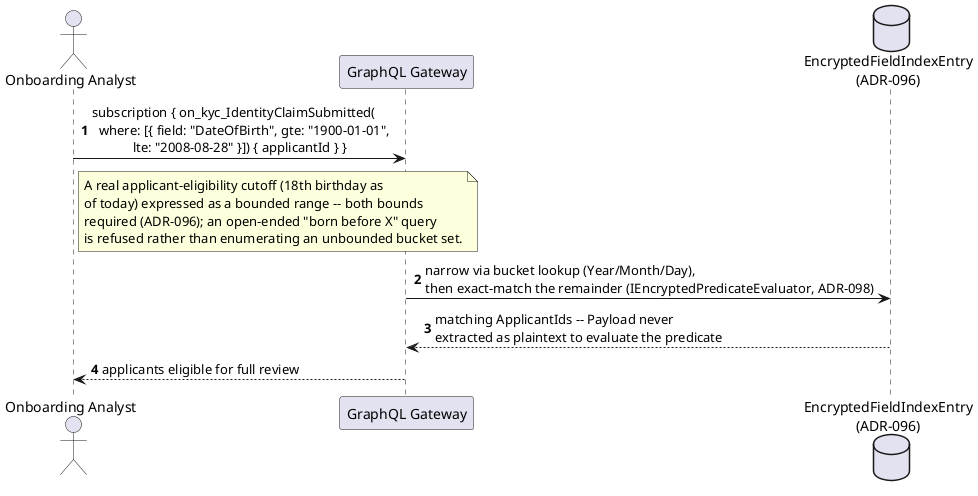
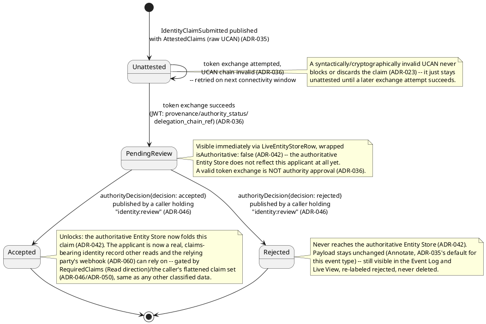

# Feature: Customer Onboarding and Identity Verification

Context: this domain's own [`README.md`](../README.md) lists `ADR-036`
(DID/UCAN self-attestation, exchanged via OAuth Token Exchange) as its
central, defining mechanism, `ADR-035` (non-authoritative capture) as
the primary fit that makes `ADR-036` meaningful, `ADR-060` (outbound
webhooks) and `ADR-047` (federated claims augmentation) as primary
fits, and `ADR-009`/`ADR-050` (masking/classification) as secondary
fits. `ADR-046` (RBAC) is a core-engine mechanism this doc exercises
directly even though the domain README doesn't list it by number — the
verification-analyst role it describes is the concrete, worked example
`ADR-046`'s own text anticipates ("'Attending Physician' or 'Records
Clerk' are job functions an application defines"). This doc walks one
applicant's identity claim end to end: self-attestation
(`ADR-036`) → non-authoritative capture (`ADR-035`) → the gated
authoritative fold (`ADR-042`) → an analyst's RBAC-gated decision
(`ADR-046`) → an accepted, claims-bearing identity record a relying
party can rely on.

Entity/event shapes referenced below come from
[`../../../data/event-log.md`](../../../data/event-log.md) (`StoredEvent`'s
`AttestedClaims`/`AuthorityStatus`/`AuthorityDecisionRef` fields),
[`../../../data/entity-store.md`](../../../data/entity-store.md)
(`EntityStoreRow`/`LiveEntityStoreRow`), and
[`../../../data/schema-registry.md`](../../../data/schema-registry.md)
(`EventTypeDefinition.RequiredClaims`, `Role`,
`WebhookSubscription`, `x-masking`).

This doc deliberately does **not** re-derive:
- The full RFC 8693 Token Exchange request/response shape, the raw-UCAN
  offline-capture case, or peer-local UCAN validation — those are
  `ADR-036` itself and
  [`../../../features/did-ucan-attestation.md`](../../../features/did-ucan-attestation.md),
  which this doc's first sequence diagram deliberately mirrors rather
  than re-explains, adapted to this domain's own event type.
- The general `AuthorityStatus` lifecycle, `authorityDecision` event
  registration mechanics, or the `Annotate`/`Compensate` rejection-behavior
  fork — those are `ADR-035`/`ADR-042` and
  [`../../../features/non-authoritative-capture.md`](../../../features/non-authoritative-capture.md).
- Ordinary bearer-JWT authentication, scope checks, or the `client_credentials`
  flow — that's `ADR-006` and
  [`../../../features/auth.md`](../../../features/auth.md).
- `ChainHash`/tamper-evidence mechanics (`ADR-019`) or the persist-everything
  `202` envelope shape (`ADR-023`) — those are
  [`../../../data/event-log.md`](../../../data/event-log.md) and
  [`../../../features/publish-event.md`](../../../features/publish-event.md).
- `ExpectedVersion`/`ConflictFlag` optimistic-concurrency mechanics —
  that's `ADR-024` and
  [`../../../features/entity-concept.md`](../../../features/entity-concept.md).
- The full `x-masking` wrapper mechanics (`value`/`masked`/`erased`
  three-way `oneOf`) — that's `ADR-009`/`ADR-050` and
  [`../../../features/masking.md`](../../../features/masking.md); this doc
  only shows *which* fields get classified and why.
- Standard Webhooks signing/retry/dead-lettering mechanics — that's
  `ADR-060` itself (no dedicated feature doc exists yet for the core
  webhook mechanism); this doc only shows the domain-specific trigger
  (a verification-status change) and payload-masking consequence.
- **OFAC sanctions screening and BSA SAR filing** — this domain's own
  README names this as a genuine gap with no covering ADR
  (`docs/10-open-questions.md`). This doc's analyst decision is purely
  an identity-verification/authenticity judgment ("does this claim check
  out"), never a sanctions-screening or AML-risk decision — no screening
  step is designed or implied anywhere below.

## Sequence diagram — self-attested claim, captured then exchanged



## Sequence diagram — analyst review, gated fold, and relying-party notification



## Data model (ER diagram)



C# payload/fold shapes, grounded in the envelope fields above plus
domain-specific fields (full column lists for `StoredEvent`/
`EntityStoreRow`/`LiveEntityStoreRow`/`Role`/`WebhookSubscription`
themselves live in `../../../data/event-log.md`,
`../../../data/entity-store.md`, and
`../../../data/schema-registry.md` — not repeated here):

```csharp
// Registered event type "IdentityClaimSubmitted" v1 (schema-registry.md);
// EntityIdField "$.ApplicantId" resolves EntityId "kyc:ApplicantIdentity:{ApplicantId}" (ADR-021)
public class IdentityClaimSubmittedPayload
{
    public string ApplicantId { get; set; } = default!;
    public string Did { get; set; } = default!;             // "did:key:z6Mk..." -- proves control of the identifier, not real-world identity (ADR-036)
    public string ClaimedLegalName { get; set; } = default!; // x-masking classified: PII, requiredClaim "identity:pii-read" (ADR-009/ADR-050)
    public string DateOfBirth { get; set; } = default!;      // x-masking classified: PII, same requiredClaim (ADR-009/ADR-050); ISO 8601 date
    public string DocumentType { get; set; } = default!;     // "passport" | "drivers_license" | "national_id"
    public string? DocumentAttachmentRef { get; set; }        // ContentHash (SHA-256) into ADR-032's content-addressed attachment store (scanned ID document image) -- not a Guid, corrected per a design review this session
}

// Registered event type "authorityDecision" v1 (already generic, ADR-035);
// RequiredClaims [{ Direction: "Publish", Claim: "identity:review" }] set on THIS AppId's registration (ADR-046/ADR-008/ADR-050)
public class AuthorityDecisionPayload
{
    public Guid TargetEventId { get; set; }        // the IdentityClaimSubmitted event's EventId
    public string Decision { get; set; } = default!; // "accepted" | "rejected"
    public string DecidingActorId { get; set; } = default!; // denormalized copy of ActorId -- the analyst (ADR-064)
    public string? Reason { get; set; }
}

// EntityStoreRow.Data for EntityType "ApplicantIdentity", folded ONLY once
// AuthorityStatus reaches "accepted" (ADR-042) -- the claims-bearing identity
// record a relying party's later reads/webhooks (ADR-060) can rely on.
public class ApplicantIdentityRecordData
{
    public string ApplicantId { get; set; } = default!;
    public string Did { get; set; } = default!;
    public string ClaimedLegalName { get; set; } = default!; // masked at query/delivery time per caller's claims (ADR-009)
    public string DateOfBirth { get; set; } = default!;      // masked
    public string DocumentType { get; set; } = default!;
    public string VerificationStatus { get; set; } = default!; // denormalized "accepted" -- true by construction, this row only exists post-gate
}
```

## Searchable encryption — age eligibility and duplicate-applicant detection (`ADR-096`)

Two independent, real KYC needs over the same two classified fields
already shown above:

- **Age-eligibility screening** — many relying-party use cases (opening a
  brokerage account, age-restricted services) require confirming an
  applicant is over a threshold age *before* full manual review, without
  decrypting every pending applicant's `DateOfBirth` to check. This is
  the canonical `Range`-kind use case `ADR-096`'s own guardrail was built
  around: `DateOfBirth` is a classic low-cardinality identifier.
- **Duplicate-applicant detection across DIDs** — an applicant rejected
  or blocked under one self-attested `Did` shouldn't be able to simply
  resubmit under a fresh one with the same claimed legal name. `Equality`
  over `ClaimedLegalName`, a high-cardinality field, is a safe match on
  its own here (unlike `DateOfBirth`, which this domain does **not**
  index for `Equality` in this example — see the compound-match
  discussion in Vitals' [`patient-enrollment-and-informed-consent.md`](../../clinical-trials-device-telemetry/features/patient-enrollment-and-informed-consent.md)
  for why a low-cardinality field like this is better paired with a
  high-cardinality one than indexed alone).

```json
"ClaimedLegalName": {
  "type": "string",
  "x-masking": { "requiredClaim": "identity:pii-read", "strategy": "PartialReveal", "regulatoryClassification": "PII" },
  "x-masking-searchable": { "indexKind": "Equality", "keyScope": "Shared", "cardinality": "High" }
},
"DateOfBirth": {
  "type": "string",
  "x-masking": { "requiredClaim": "identity:pii-read", "strategy": "PartialReveal", "regulatoryClassification": "PII" },
  "x-masking-searchable": { "indexKind": "Range", "keyScope": "Shared", "cardinality": "Low", "acknowledgeLeakageRisk": true, "bucketGranularities": ["Year", "Month", "Day"] }
}
```

`DateOfBirth` needs the explicit `acknowledgeLeakageRisk` override on
this `Range` index (the same guardrail Vitals' `DateOfBirth` example
needs on its own `Equality` index, since the underlying risk driver —
low cardinality — is identical regardless of which index kind exposes
it). An age-eligibility query supplies **both** bounds in one clause,
per `ADR-096`'s own bounded-range requirement — an open-ended query
would need to enumerate an unbounded number of buckets:



## State machine — an applicant identity record's `AuthorityStatus` lifecycle



## Salt (UI mockup) — verification analyst review queue

```plantuml
@startsalt
{
  { "Verification Analyst -- Review Queue   (role: IdentityVerificationAnalyst, claim: identity:review)" }
  ..
  | Applicant       | DID                  | Submitted   | Status                                       |
  | applicant-1001  | did:key:z6Mkf7...    | 2026-07-28  | [ isAuthoritative: false ]  pending_review    |
  | applicant-1002  | did:key:z6MkA2...    | 2026-07-29  | [ isAuthoritative: false ]  pending_review    |
  | applicant-0997  | did:key:z6MkQ9...    | 2026-07-27  | [ isAuthoritative: false ]  unattested         |
  ..
  { "Selected: applicant-1001" }
  | Field             | Claimed value                     |
  | ClaimedLegalName  | "J*** S****"  ( masked, ADR-009 ) |
  | DateOfBirth       | "****-**-01"  ( masked )          |
  | DocumentType      | "passport"                        |
  | Delegation chain  | [ View UCAN chain ]                |
  ..
  [ Accept ] | [ Reject ] | "Reason (required for reject):"
  { "____________________________________" }
}
@endsalt
```



Every row's `isAuthoritative: false` marker and `pending_review`/
`unattested` label come straight off `LiveEntityStoreRow` (`ADR-042`) —
an accepted applicant simply drops out of this queue, since its
`AuthorityStatus` moves to `accepted` and the authoritative Entity Store
takes over as the record of truth. `ClaimedLegalName`/`DateOfBirth`
render masked here the same way they would through any other read
surface (`ADR-009`) — an analyst's `identity:review` claim authorizes
*deciding*, not automatically an unmasked *view*; a separate
`identity:pii-read` claim (or lack of it) governs that independently.

## Gherkin

```gherkin
Feature: Customer Onboarding and Identity Verification
  As a KYC platform operator
  I want an applicant's self-attested identity claim to be captured immediately,
  reviewed by an authorized analyst, and only then relied upon as accepted
  So that unverifiable claims never block capture, but a relying party never
  sees an identity as trustworthy until an authorized human has said so

  # EntityId format is {appId}:{entityType}:{uniqueId} (ADR-021); scenarios
  # below use appId "kyc" throughout. See auth.md for ordinary bearer-JWT
  # authentication and did-ucan-attestation.md for the full RFC 8693
  # token-exchange mechanics this file's Background assumes but doesn't
  # re-derive.

  Background:
    Given the event type "IdentityClaimSubmitted" version 1 is registered
      with EntityIdField "$.ApplicantId" and schema:
      """
      {
        "type": "object",
        "properties": {
          "ApplicantId": { "type": "string" },
          "Did": { "type": "string" },
          "ClaimedLegalName": { "type": "string", "x-masking": { "requiredClaim": "identity:pii-read", "strategy": "PartialReveal" } },
          "DateOfBirth": { "type": "string", "x-masking": { "requiredClaim": "identity:pii-read", "strategy": "PartialReveal" } },
          "DocumentType": { "type": "string" }
        },
        "required": ["ApplicantId", "Did", "ClaimedLegalName", "DateOfBirth", "DocumentType"]
      }
      """
    And the event type "authorityDecision" version 1 is registered
      with EntityIdField "$.targetEventId" and RequiredClaims [{ "Direction": "Publish", "Claim": "identity:review" }]
    And role "IdentityVerificationAnalyst" is registered for AppId "kyc" with Permissions ["identity:review"]
    And user "analyst-1" is assigned role "IdentityVerificationAnalyst", so their issued JWT carries claim "identity:review"
    And user "clerk-1" holds no role or direct grant carrying "identity:review"
    And relying party "acme-bank" has a WebhookSubscription for AppId "kyc" on EventTypes ["authorityDecision"]

  Scenario: An applicant self-attests via UCAN and the claim lands unattested, persisted immediately
    Given applicant "applicant-1001" holds a UCAN invocation delegated from a DID it controls
    When I POST to "/publish/IdentityClaimSubmitted" with body:
      """
      {
        "payload": { "ApplicantId": "applicant-1001", "Did": "did:key:z6Mkf7...", "ClaimedLegalName": "Jane Smith", "DateOfBirth": "1990-03-01", "DocumentType": "passport" },
        "attestedClaims": { "type": "ucan", "invocation": "<raw UCAN invocation>" }
      }
      """
    Then the response status should be 202 with authorityStatus "unattested"
    And the event should be durably persisted before any token exchange is attempted
    # The DID proves applicant-1001 controls that key -- not that "Jane Smith"/
    # the claimed DOB are real (ADR-036's own distinction).

  Scenario: Token exchange succeeds and the claim is captured as pending_review, visible only via the Live View
    Given an "IdentityClaimSubmitted" event was published for "applicant-1001" as above, currently "unattested"
    When the Router exchanges its raw UCAN via "POST /oauth/token" with
      "grant_type=urn:ietf:params:oauth:grant-type:token-exchange" and the UCAN chain is valid
    Then the stored event's AuthorityStatus should become "pending_review", not "accepted"
    And the stored event's AttestedClaims should be updated with the JWT's provenance/authority_status/delegation_chain_ref claims
    And querying the Live View for "kyc:ApplicantIdentity:applicant-1001" should return the claimed fields, wrapped "isAuthoritative": false
    And querying the authoritative Entity Store for "kyc:ApplicantIdentity:applicant-1001" should return no record at all
    # A valid token exchange is not the same as authority approval (ADR-036) --
    # only an explicit authorityDecision event can move AuthorityStatus further.

  Scenario: An invalid UCAN chain leaves the claim unattested rather than advancing it
    Given an "IdentityClaimSubmitted" event was published for "applicant-0997" with a malformed UCAN invocation
    When the Router attempts token exchange for it
    Then EventStore.DevIdp should reject the exchange with "invalid_grant"
    And the stored event's AuthorityStatus should remain "unattested"
    And querying the authoritative Entity Store for "kyc:ApplicantIdentity:applicant-0997" should return no record at all

  Scenario: An analyst lacking the identity:review claim cannot publish an authorityDecision
    Given an "IdentityClaimSubmitted" event "claim-1002" for "applicant-1002" is "pending_review"
    When "clerk-1" attempts to POST to "/publish/authorityDecision" with body:
      """
      { "payload": { "targetEventId": "claim-1002", "decision": "accepted", "decidingActorId": "clerk-1" } }
      """
    Then the request should be rejected because the Publish-direction RequiredClaims entry "identity:review" is not satisfied
    And the stored event "claim-1002"'s AuthorityStatus should remain "pending_review"

  Scenario: An analyst holding identity:review accepts the claim, and the authoritative Entity Store now folds it
    Given an "IdentityClaimSubmitted" event "claim-1001" for "applicant-1001" is "pending_review"
    When "analyst-1" POSTs to "/publish/authorityDecision" with body:
      """
      { "payload": { "targetEventId": "claim-1001", "decision": "accepted", "decidingActorId": "analyst-1", "reason": "delegation chain and document scan verified" } }
      """
    Then the response status should be 202
    And the stored event "claim-1001"'s AuthorityStatus should become "accepted"
    And the stored event "claim-1001"'s AuthorityDecisionRef should point at the authorityDecision event
    And eventually the authoritative Entity Store for "kyc:ApplicantIdentity:applicant-1001" should exist at Version 1
    And a read of that row should carry no "isAuthoritative" marker at all
    # identity:review reached analyst-1's JWT via the IdentityVerificationAnalyst
    # role, flattened at token issuance (ADR-046) -- the publish check itself is
    # unaware whether the claim came from a role or a direct grant.

  Scenario: An analyst holding identity:review rejects the claim instead, and the Entity Store never reflects it
    Given an "IdentityClaimSubmitted" event "claim-1003" for "applicant-1003" is "pending_review"
    When "analyst-1" POSTs to "/publish/authorityDecision" with body:
      """
      { "payload": { "targetEventId": "claim-1003", "decision": "rejected", "decidingActorId": "analyst-1", "reason": "document scan does not match claimed legal name" } }
      """
    Then the response status should be 202
    And the stored event "claim-1003"'s AuthorityStatus should become "rejected"
    And the stored event "claim-1003"'s Payload should be unchanged
    And querying the authoritative Entity Store for "kyc:ApplicantIdentity:applicant-1003" should return no record at all
    And querying the Live View for "kyc:ApplicantIdentity:applicant-1003" should show AuthorityStatus "rejected", still wrapped "isAuthoritative": false
    # Annotate is this event type's default RejectionBehavior (ADR-035) --
    # there is nothing to compensate, since the claim never reached the
    # authoritative store in the first place (ADR-042).

  Scenario: An accepted decision fires a masked outbound webhook to the relying party
    Given "acme-bank"'s WebhookSubscription for AppId "kyc" has FixedClaimsSnapshot lacking "identity:pii-read"
    And an "authorityDecision" event accepted "applicant-1001"'s identity claim, per above
    When the WebhookDispatcher processes the resulting status-change notification
    Then a signed delivery should be sent to "acme-bank"'s TargetUrl with webhook-id/webhook-timestamp/webhook-signature headers (ADR-060)
    And the delivered payload's ClaimedLegalName and DateOfBirth should be masked, not the real values
    # The subscription's claim set is fixed at registration time (ADR-060,
    # reusing ADR-009's own precedent) -- never re-evaluated per delivery, so
    # a later grant of identity:pii-read to acme-bank would not retroactively
    # unmask this or any earlier delivery.

  # ADR-096 -- searchable encryption over the same two classified fields,
  # per the "Searchable encryption" section above. A separate Background
  # here, registering IdentityClaimSubmitted with regulatoryClassification
  # and x-masking-searchable actually present, which the shared Background
  # above deliberately leaves out.

  Scenario: An analyst's age-eligibility query matches applicants born within a bounded range, without ever decrypting DateOfBirth to compare
    Given the event type "IdentityClaimSubmitted" version 1 is registered
      with EntityIdField "$.ApplicantId" and schema:
      """
      {
        "type": "object",
        "properties": {
          "ApplicantId": { "type": "string" },
          "Did": { "type": "string" },
          "ClaimedLegalName": {
            "type": "string",
            "x-masking": { "requiredClaim": "identity:pii-read", "strategy": "PartialReveal", "regulatoryClassification": "PII" },
            "x-masking-searchable": { "indexKind": "Equality", "keyScope": "Shared", "cardinality": "High" }
          },
          "DateOfBirth": {
            "type": "string",
            "x-masking": { "requiredClaim": "identity:pii-read", "strategy": "PartialReveal", "regulatoryClassification": "PII" },
            "x-masking-searchable": { "indexKind": "Range", "keyScope": "Shared", "cardinality": "Low", "acknowledgeLeakageRisk": true, "bucketGranularities": ["Year", "Month", "Day"] }
          },
          "DocumentType": { "type": "string" }
        },
        "required": ["ApplicantId", "Did", "ClaimedLegalName", "DateOfBirth", "DocumentType"]
      }
      """
    And "applicant-2001" submitted an "IdentityClaimSubmitted" claim with DateOfBirth "1990-03-01"
    And "applicant-2002" submitted an "IdentityClaimSubmitted" claim with DateOfBirth "2015-06-10"
    When "analyst-1" queries `on_kyc_IdentityClaimSubmitted(where: [{ field: "DateOfBirth", gte: "1900-01-01", lte: "2008-08-28" }])`
    Then the query should match "applicant-2001" but not "applicant-2002"
    And the generated query should never extract or compare `Payload` as plaintext for `DateOfBirth`

  Scenario: A duplicate-applicant check on ClaimedLegalName matches an applicant who previously submitted under a different DID
    Given "applicant-1001" submitted an "IdentityClaimSubmitted" claim with ClaimedLegalName "Jane Smith" and Did "did:key:z6Mkf7..."
    And "applicant-3001" later submits a new "IdentityClaimSubmitted" claim with ClaimedLegalName "Jane Smith" and a different Did "did:key:z6MkNew..."
    When "analyst-1" queries `on_kyc_IdentityClaimSubmitted(where: [{ field: "ClaimedLegalName", eq: "Jane Smith" }])`
    Then the query should return both "applicant-1001" and "applicant-3001"
    # Equality alone is an acceptable match here specifically because
    # ClaimedLegalName is High cardinality (ADR-096's own guardrail) --
    # this is a real flag for an analyst to investigate, not an automatic
    # rejection; a shared common name alone doesn't prove fraud.
```
