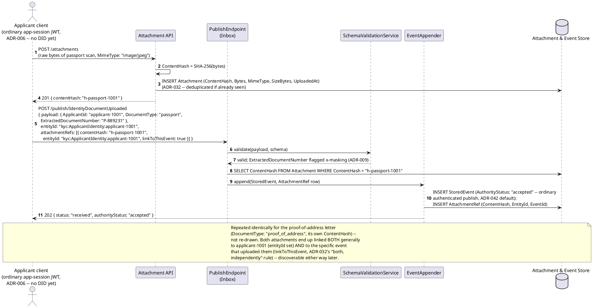
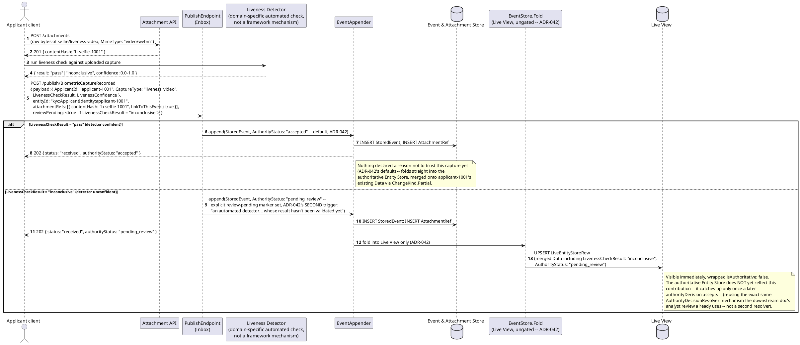
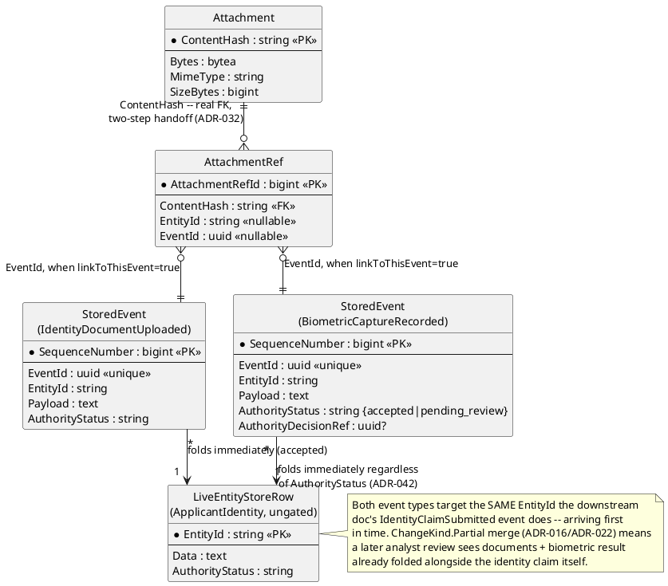
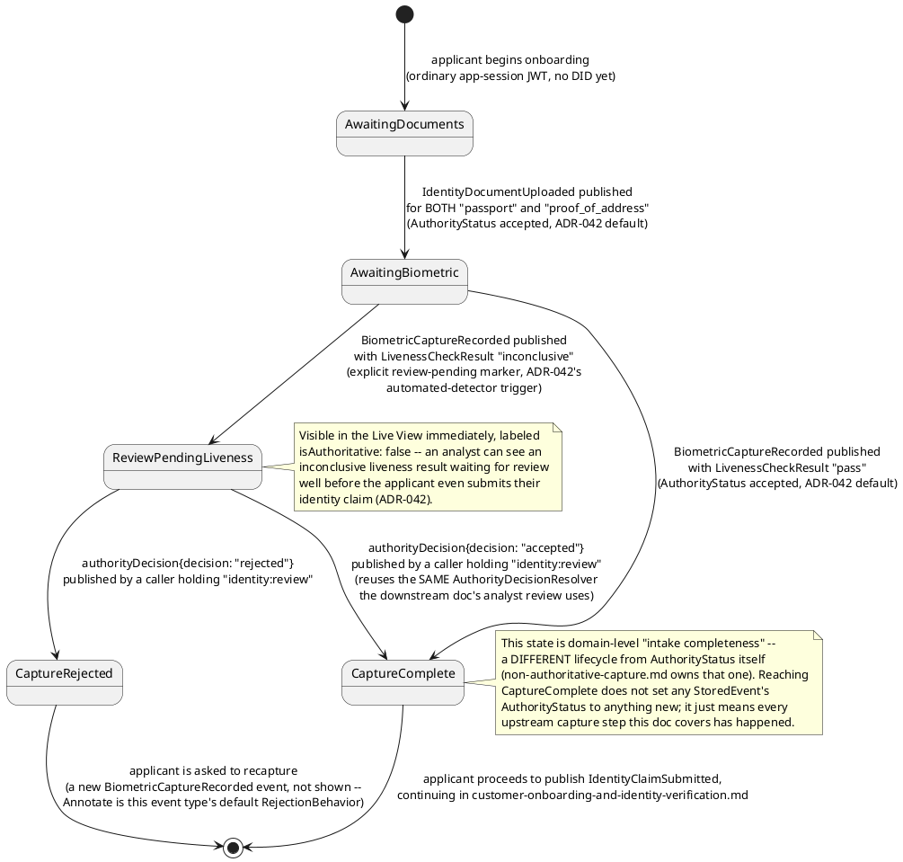
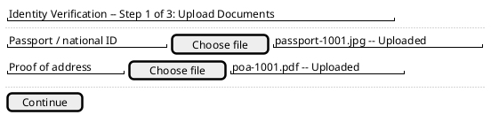
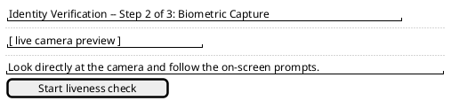
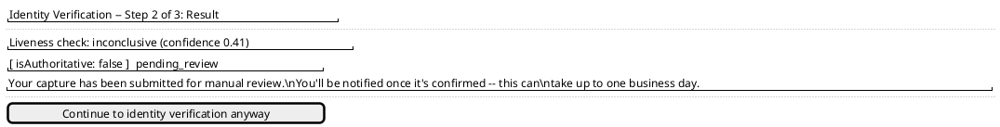
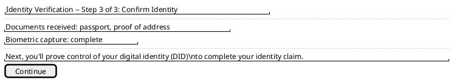

# Feature: Document and Biometric Capture

Context: this is the **upstream half** of the workflow
[`customer-onboarding-and-identity-verification.md`](customer-onboarding-and-identity-verification.md)
covers as its downstream half — that doc's `IdentityClaimSubmittedPayload`
already declares a `DocumentAttachmentRef` field ("pointer into `ADR-032`'s
content-addressed attachment store") without ever showing how a document
actually gets uploaded and linked in the first place. This doc closes that
gap: an applicant uploads identity documents (a passport scan, a
proof-of-address letter) and a biometric capture (a selfie/liveness check)
*before* self-attesting the DID/UCAN identity claim that doc's first
sequence diagram opens with. It exercises `ADR-032` (content-addressed
binary attachments, linked to the applicant entity and/or a specific
event) and `ADR-009` (masking sensitive extracted document fields), and —
for the biometric capture specifically — `ADR-042`'s *second* named
`AuthorityStatus` trigger: "an automated detector that thinks it has found
a pattern but whose result hasn't been validated yet," here an automated
liveness-detection score, not the identity/permission trigger
`ADR-035`/the other doc's DID exchange already exercises.

Both new event types below target the same `EntityId` the downstream doc's
`IdentityClaimSubmitted` event does — `kyc:ApplicantIdentity:applicant-1001`
(`ADR-021`) — via `EntityIdField "$.ApplicantId"`, arriving *before* that
event. This is a real, useful exercise of `ADR-016`'s `ChangeKind.Partial`
merge semantics already documented in `entity-concept.md`: by the time an
analyst reviews `applicant-1001`'s identity claim downstream, the same
`EntityStoreRow`/`LiveEntityStoreRow` already carries the document/biometric
fields this doc's events contributed, merged alongside whatever
`IdentityClaimSubmitted` adds later — not a new merge mechanism, the
existing one, just exercised earlier in an entity's life than the other
doc shows.

**Honest, named type-shape note, not fixed here**: the downstream doc's
`IdentityClaimSubmittedPayload.DocumentAttachmentRef` is typed `Guid?`,
but `ADR-032`'s real attachment address is `ContentHash` (a SHA-256 hex
*string*, per [`binary-attachments.md`](../../../features/binary-attachments.md)).
This doc's own `attachmentRefs` mechanics below use the real `ContentHash`
string shape throughout; the mismatch is flagged rather than silently
worked around, consistent with this project's "flagged, not fixed" pattern
for propagation debt in a file this doc isn't allowed to edit.

This doc deliberately does **not** re-derive:
- General attachment upload/dedup-by-`ContentHash`/GraphQL-browse/
  Range-`GET` retrieval mechanics — that's `ADR-032` and
  [`binary-attachments.md`](../../../features/binary-attachments.md), which
  this doc's first sequence diagram reuses exactly, just against this
  domain's own event types instead of `binary-attachments.md`'s generic
  `VisitRecorded` example.
- The full `x-masking` wrapper mechanics (`value`/`masked`/`erased`) —
  that's `ADR-009`/`ADR-050` and
  [`masking.md`](../../../features/masking.md); this doc only shows *which*
  extracted fields get classified and why.
- The general `AuthorityStatus` lifecycle, `authorityDecision` mechanics,
  or the `Annotate`/`Compensate` fork — that's `ADR-035`/`ADR-042` and
  [`non-authoritative-capture.md`](../../../features/non-authoritative-capture.md);
  this doc only shows the *specific* trigger (an automated liveness
  detector's unconfirmed score) that sets the explicit review-pending
  marker on one event type.
- The DID/UCAN self-attestation, OAuth Token Exchange, or the analyst's
  `authorityDecision` review of the identity claim itself — that's
  entirely [`customer-onboarding-and-identity-verification.md`](customer-onboarding-and-identity-verification.md)
  and [`did-ucan-attestation.md`](../../../features/did-ucan-attestation.md),
  which this doc feeds into but never re-derives.
- Ordinary bearer-JWT authentication or scope checks for the applicant's
  own upload session — that's `ADR-006` and
  [`auth.md`](../../../features/auth.md). This doc assumes the applicant's
  client already holds an ordinary application-session bearer JWT (scope
  `events:publish`), a *different* credential from the DID-based
  self-attestation the downstream doc's identity claim itself uses — how
  that pre-verification session gets issued is not designed further here.
- **OFAC sanctions screening and BSA SAR filing** — this domain's own
  README names this as a genuine gap with no covering ADR
  (`docs/10-open-questions.md`); nothing below is a screening or
  AML-risk decision.

## Sequence diagram — uploading and linking identity documents



## Sequence diagram — biometric capture with an automated liveness detector



Both diagrams above deliberately never touch `AuthorityStatus`'s
`unattested` value at all — that value is specific to `ADR-036`'s
self-attested-credential trigger (the downstream doc's DID exchange), the
*first* of `ADR-042`'s two named triggers. This doc exercises the
*second* one instead: an automated detector's own unconfirmed output,
using the identical `AuthorityStatus`/gated-fold machinery, no new field.

## Data model (ER diagram)



```csharp
// Registered event type "IdentityDocumentUploaded" v1 (schema-registry.md);
// EntityIdField "$.ApplicantId" -> "kyc:ApplicantIdentity:{ApplicantId}" (ADR-021)
// ChangeKind: Partial (ADR-016) -- merges onto whatever else this EntityId already has
public class IdentityDocumentUploadedPayload
{
    public string ApplicantId { get; set; } = default!;
    public string DocumentType { get; set; } = default!;       // "passport" | "proof_of_address"
    public string ExtractedDocumentNumber { get; set; } = default!; // x-masking classified: PII, requiredClaim "identity:pii-read" (ADR-009/ADR-050)
    // ContentHash itself travels as envelope-level attachmentRefs (ADR-032), not a Payload field --
    // opaque bytes never belong inside the JSON envelope SchemaValidationService parses.
}

// Registered event type "BiometricCaptureRecorded" v1 (schema-registry.md);
// EntityIdField "$.ApplicantId" -> same EntityId as above
public class BiometricCaptureRecordedPayload
{
    public string ApplicantId { get; set; } = default!;
    public string CaptureType { get; set; } = default!;         // "selfie" | "liveness_video"
    public string LivenessCheckResult { get; set; } = default!;  // "pass" | "inconclusive" -- the detector's own verdict
    public double LivenessConfidence { get; set; }               // 0.0-1.0 -- rides in Payload, not AttestedClaims,
                                                                   // since this isn't a self-attested credential (ADR-036);
                                                                   // it's an ordinary field the publish-time marker below reads
}
// Publish envelope also carries an explicit `reviewPending: true` marker when
// LivenessCheckResult = "inconclusive" -- ADR-042's own mechanism ("an explicit
// review-pending marker any caller can set on publish... the mechanism a
// detector service uses to declare its own output an unconfirmed pattern
// match"). No new schema field: the marker is envelope-level, like
// attestedClaims, not a Payload property.
```

## State machine — an applicant's document/biometric intake, upstream of `AuthorityStatus`



## Salt (UI mockup) — applicant capture flow, screen by screen

Four screens, each grounded in a real step from the sequence diagrams
above; a button click or automatic transition (never a page the applicant
navigates to manually) moves between them.

**Screen 1 — document upload** (corresponds to the first sequence
diagram's two `POST /attachments` + `POST /publish/IdentityDocumentUploaded`
calls). Transition: clicking "Continue" once both documents show
"Uploaded" moves to Screen 2.



**Screen 2 — biometric capture** (corresponds to the second sequence
diagram's selfie/liveness-video upload). Transition: clicking "Start
liveness check" uploads the capture and moves to Screen 3 once the
detector returns a result.



**Screen 3 — capture result** (corresponds to the second sequence
diagram's `alt` branch on `LivenessCheckResult`). Transition: on "pass,"
the applicant is taken straight to Screen 4; on "inconclusive," they see
a review-pending notice instead and Screen 4 is reached only later, once
an analyst's `authorityDecision` resolves it.



**Screen 4 — hand-off to identity claim submission** (the transition into
[`customer-onboarding-and-identity-verification.md`](customer-onboarding-and-identity-verification.md)'s
own first sequence diagram — not re-drawn here). Transition: clicking
"Continue" begins that doc's DID/UCAN self-attestation flow.



## Gherkin

```gherkin
Feature: Document and Biometric Capture
  As an applicant beginning KYC onboarding
  I want to upload identity documents and complete a biometric liveness capture
  So that my identity claim (submitted afterward) already carries linked,
  content-addressed supporting evidence, with an inconclusive liveness result
  routed to review before it's ever trusted

  # EntityId format is {appId}:{entityType}:{uniqueId} (ADR-021); scenarios
  # below use appId "kyc" and applicant "applicant-1001" throughout, the
  # same applicant customer-onboarding-and-identity-verification.md's
  # scenarios use downstream. See binary-attachments.md for the generic
  # upload/dedup/linking mechanics this file's Background assumes.

  Background:
    Given the event type "IdentityDocumentUploaded" version 1 is registered
      with EntityIdField "$.ApplicantId" and schema:
      """
      {
        "type": "object",
        "properties": {
          "ApplicantId": { "type": "string" },
          "DocumentType": { "type": "string" },
          "ExtractedDocumentNumber": { "type": "string", "x-masking": { "requiredClaim": "identity:pii-read", "strategy": "PartialReveal" } }
        },
        "required": ["ApplicantId", "DocumentType", "ExtractedDocumentNumber"]
      }
      """
    And the event type "BiometricCaptureRecorded" version 1 is registered
      with EntityIdField "$.ApplicantId" and schema:
      """
      {
        "type": "object",
        "properties": {
          "ApplicantId": { "type": "string" },
          "CaptureType": { "type": "string" },
          "LivenessCheckResult": { "type": "string" },
          "LivenessConfidence": { "type": "number" }
        },
        "required": ["ApplicantId", "CaptureType", "LivenessCheckResult", "LivenessConfidence"]
      }
      """
    And user "analyst-1" holds claim "identity:review" (per customer-onboarding-and-identity-verification.md's Background)

  Scenario: Uploading a passport scan and linking it to the applicant both generally and to this event
    When I POST to "/attachments" with the raw bytes of "passport-1001.jpg" (MimeType "image/jpeg")
    Then the response status should be 201 with a "contentHash"
    When I POST to "/publish/IdentityDocumentUploaded" with body:
      """
      {
        "payload": { "ApplicantId": "applicant-1001", "DocumentType": "passport", "ExtractedDocumentNumber": "P-889231" },
        "entityId": "kyc:ApplicantIdentity:applicant-1001",
        "attachmentRefs": [ { "contentHash": "<contentHash from above>", "entityId": "kyc:ApplicantIdentity:applicant-1001", "linkToThisEvent": true } ]
      }
      """
    Then the response status should be 202 with authorityStatus "accepted"
    And an AttachmentRef should exist with both entityId "kyc:ApplicantIdentity:applicant-1001" and this event's eventId set
    # Both link kinds set at once (ADR-032's "either, both, or neither" rule) --
    # discoverable via the applicant's general attachment list or via this
    # one specific event.

  Scenario: A proof-of-address letter is uploaded and linked the same way, as a second document type
    When I POST to "/attachments" with the raw bytes of "poa-1001.pdf" (MimeType "application/pdf")
    Then the response status should be 201 with a "contentHash"
    When I POST to "/publish/IdentityDocumentUploaded" with body:
      """
      {
        "payload": { "ApplicantId": "applicant-1001", "DocumentType": "proof_of_address", "ExtractedDocumentNumber": "N/A" },
        "entityId": "kyc:ApplicantIdentity:applicant-1001",
        "attachmentRefs": [ { "contentHash": "<contentHash from above>", "linkToThisEvent": true } ]
      }
      """
    Then the response status should be 202 with authorityStatus "accepted"

  Scenario: A confident liveness result is captured as accepted and folds immediately
    When I POST to "/attachments" with the raw bytes of a liveness-check video (MimeType "video/webm")
    And I POST to "/publish/BiometricCaptureRecorded" with body:
      """
      {
        "payload": { "ApplicantId": "applicant-1001", "CaptureType": "liveness_video", "LivenessCheckResult": "pass", "LivenessConfidence": 0.93 },
        "entityId": "kyc:ApplicantIdentity:applicant-1001",
        "attachmentRefs": [ { "contentHash": "<contentHash from above>", "linkToThisEvent": true } ]
      }
      """
    Then the response status should be 202 with authorityStatus "accepted"
    And eventually the authoritative Entity Store for "kyc:ApplicantIdentity:applicant-1001" should reflect LivenessCheckResult "pass"

  Scenario: An inconclusive liveness result is captured as pending_review via the explicit review-pending marker
    When I POST to "/publish/BiometricCaptureRecorded" with body:
      """
      {
        "payload": { "ApplicantId": "applicant-1001", "CaptureType": "liveness_video", "LivenessCheckResult": "inconclusive", "LivenessConfidence": 0.41 },
        "entityId": "kyc:ApplicantIdentity:applicant-1001",
        "reviewPending": true
      }
      """
    Then the response status should be 202 with authorityStatus "pending_review"
    And querying the Live View for "kyc:ApplicantIdentity:applicant-1001" should show LivenessCheckResult "inconclusive", wrapped "isAuthoritative": false
    And querying the authoritative Entity Store for "kyc:ApplicantIdentity:applicant-1001" should NOT yet reflect LivenessCheckResult "inconclusive"
    # This is ADR-042's SECOND named trigger (an automated detector's
    # unconfirmed output) -- a different trigger from ADR-036's DID/UCAN
    # self-attestation the downstream doc exercises, using the identical
    # AuthorityStatus/gated-fold machinery.

  Scenario: An analyst's authorityDecision resolves an inconclusive liveness capture, and the authoritative Entity Store catches up
    Given a "BiometricCaptureRecorded" event "bio-1" for "applicant-1001" is "pending_review", per above
    When "analyst-1" POSTs to "/publish/authorityDecision" with body:
      """
      { "payload": { "targetEventId": "bio-1", "decision": "accepted", "decidingActorId": "analyst-1", "reason": "manual liveness review confirmed match" } }
      """
    Then the response status should be 202
    And the stored event "bio-1"'s AuthorityStatus should become "accepted"
    And eventually the authoritative Entity Store for "kyc:ApplicantIdentity:applicant-1001" should reflect LivenessCheckResult "inconclusive"
    # Reuses the exact same AuthorityDecisionResolver mechanism
    # customer-onboarding-and-identity-verification.md's analyst-review
    # sequence already exercises -- not a second resolver.

  Scenario: Documents and biometric result are both visible to an analyst before the identity claim is even submitted
    Given "applicant-1001" has uploaded both documents and completed a "pass" biometric capture, per above
    When an analyst queries the Live View for "kyc:ApplicantIdentity:applicant-1001"
    Then the response should include DocumentType "passport", DocumentType "proof_of_address", and LivenessCheckResult "pass"
    And no "IdentityClaimSubmitted" event needs to exist yet for these fields to be visible
    # ChangeKind.Partial merge means this entity accumulates fields from
    # multiple event types over time (entity-concept.md) -- the identity
    # claim submitted downstream just adds more to the same EntityId.
```
