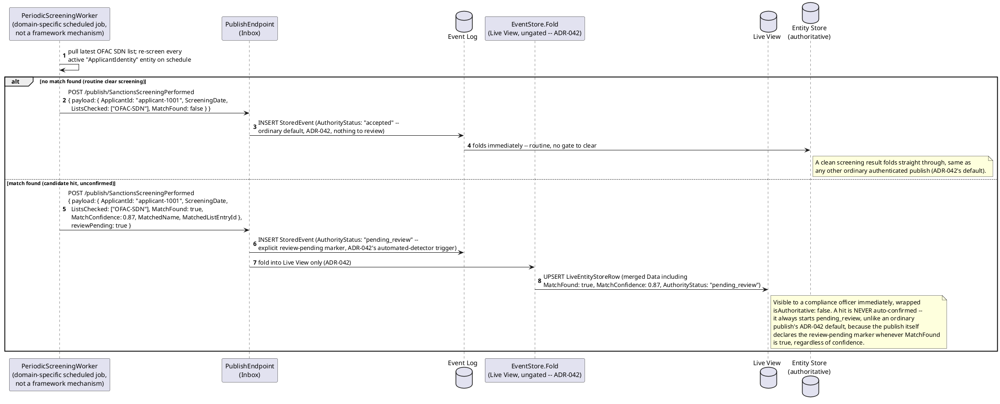
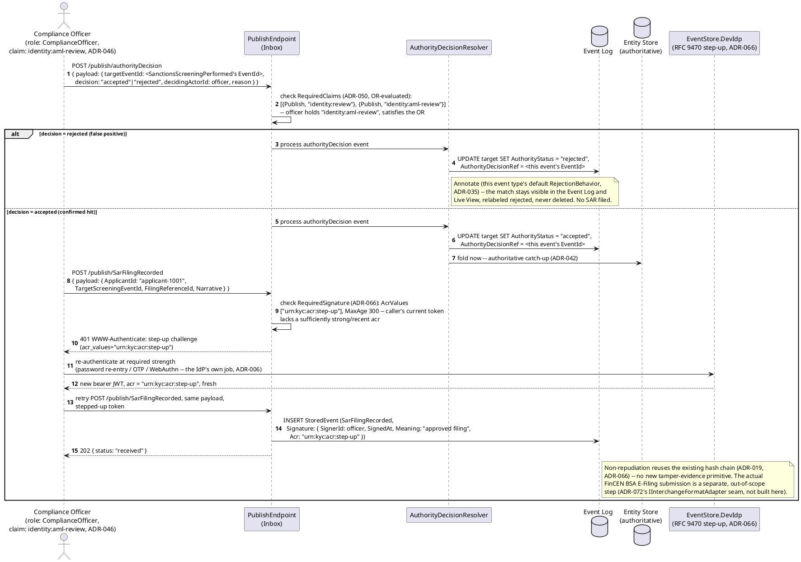
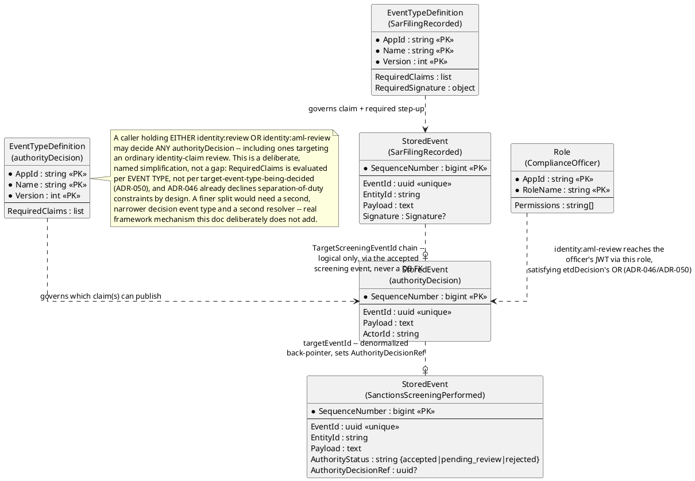
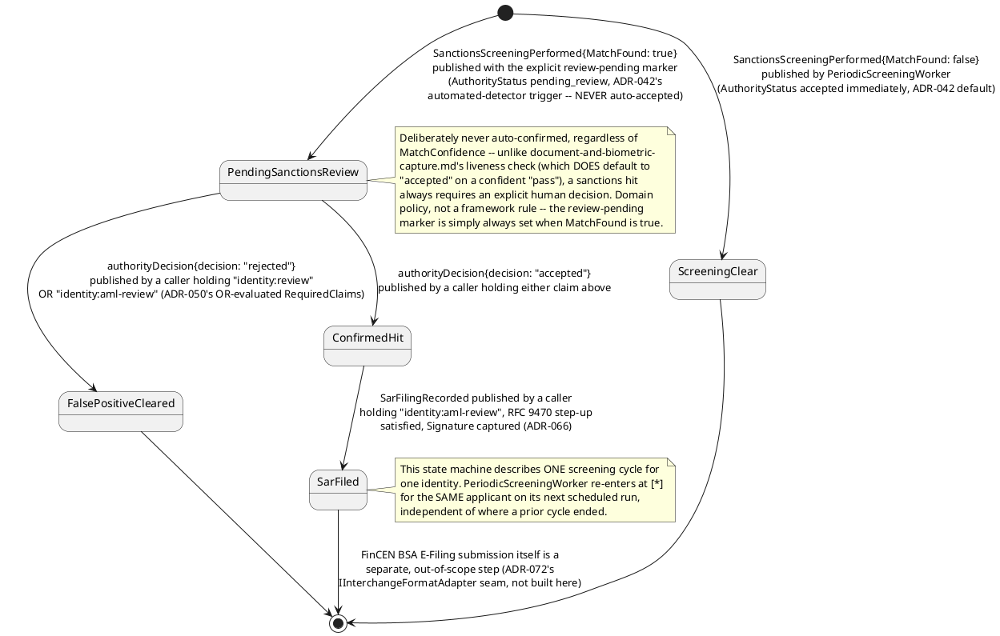
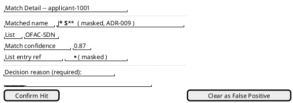
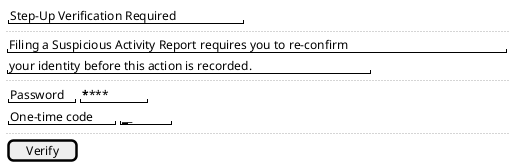
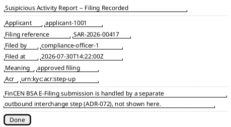

# Feature: Periodic Screening and SAR Escalation

Context: this domain's own README used to track a genuinely unresolved
fork — should OFAC sanctions screening and BSA Suspicious Activity
Report (SAR) filing be a **framework-level extensibility seam** (an
`ISanctionsScreeningProvider`-shaped interface, analogous to `ADR-057`'s
`IErasureKeyStore`) or **purely domain/application logic layered on top
of what already exists**? **Resolved, `ADR-079` (see `docs/
changes/2026-07-31.md`): yes, an extensibility seam — but scoped to this
application's own composition root, not core Duplex**, the first
domain-scoped (non-core) extension point in this design. **This doc
predates that resolution and deliberately built the pure-application-
logic version in full first** — using only mechanisms this design
already had, introducing no new interface — which turned out to be
exactly the right groundwork: `ADR-079`'s seam wraps an automated
screening *signal* around the identical manual-decision flow this doc
already demonstrates, rather than replacing it. Nothing here needs
rewriting as a result, and this composition is no longer only a future
pass: "Sanctions/Watchlist Screening Extensibility Seam" (`08-build-plan.md`
item 38) has already exercised it, in test code —
`tests/EventStore.IntegrationTests/
SanctionsScreeningExtensibilityHttpSqliteTests.cs` registers a keyed
`ISanctionsScreeningProvider` entirely inside its own `ConfigureServices`
block (standing in for this application's composition root, never a core
`EventStore.*` project) and drives a screening pipeline helper that
stands in for this doc's own `PeriodicScreeningWorker` — asserting a hit
always lands `pending_review` regardless of match confidence, and that
only a `ComplianceOfficer`-role holder's ordinary `authorityDecision`
publish (unchanged RBAC/non-authoritative-capture mechanics) resolves it.
`ISanctionsScreeningProvider` itself remains test-only scaffolding, not a
production `EventStore.Abstractions`/core-project interface — that
distinction is unaffected by this — but the composition point this doc
describes is now demonstrated, not merely designed.

The mechanisms this doc composes, all already Accepted: `ADR-035`/
`ADR-042` (a sanctions-list hit is captured as an **automated detector's
unconfirmed pattern match** — the identical second trigger
[`document-and-biometric-capture.md`](document-and-biometric-capture.md)
exercises for a liveness score, applied here to a screening match
instead); `ADR-050` (`RequiredClaims`, the list-shaped generalization of
`RequiredPublishClaim` — used here so the *same* generic `authorityDecision`
event type this domain already registers can be decided by either an
identity-verification analyst *or* a compliance officer, without a
second decision-event type or a second resolver); `ADR-046` (a new
`ComplianceOfficer` role bundling the AML-specific claim); and `ADR-066`
(RFC 9470 step-up authentication + the envelope `Signature` object,
required specifically for the SAR-filing decision itself — directly
foreshadowed in `ADR-066`'s own compliance note: "a compliance officer's
sign-off... on the digital-identity/KYC proving-ground domain, once that
domain's own OFAC/SAR screening logic... actually exists to trigger it").
No new framework mechanism is introduced anywhere below — every building
block already exists; this doc only wires domain-specific event types
and claim values on top of them.

The periodic re-screening trigger itself — a background job re-checking
every active identity against an updated sanctions list on some cadence
— is an ordinary domain-level scheduled worker, the same "internal
follower" shape `ADR-007`/`ADR-015`/`ADR-027`/`ADR-032`'s background
mover already use, not a new framework concept; this doc names it
`PeriodicScreeningWorker` and treats its scheduling policy (daily,
weekly, list-update-triggered) as a deployment detail, not designed
further here.

This doc deliberately does **not** re-derive:
- The general `AuthorityStatus` lifecycle, `authorityDecision` mechanics,
  or the `Annotate`/`Compensate` fork — that's `ADR-035`/`ADR-042` and
  [`non-authoritative-capture.md`](../../../features/non-authoritative-capture.md).
- RFC 9470's step-up challenge/response mechanics themselves, or the
  `Signature` envelope field's shape — that's `ADR-066`; this doc only
  shows *which* event type requires it and why.
- `Role`/`RequiredClaims` mechanics generally — that's `ADR-046`/`ADR-050`
  and `docs/data/schema-registry.md`; this doc only registers one new
  role and one new claim value.
- The full `x-masking` wrapper mechanics — that's `ADR-009`/`ADR-050` and
  [`masking.md`](../../../features/masking.md).
- **The actual FinCEN BSA E-Filing submission format** — deliberately not
  modeled here at all. A real SAR filing has its own external interchange
  shape FinCEN itself defines; mapping this domain's own `SarFilingRecorded`
  event onto it is exactly the kind of outbound target `ADR-072`'s
  `IInterchangeFormatAdapter` seam already exists for (the same seam
  `ADR-072` names for ICH E2B(R3)/GS1-EPCIS), composing ahead of `ADR-060`'s
  webhook delivery — not designed further in this doc. The verified,
  reused fact this doc *does* rely on is the domain README's own glossary
  entry: a SAR is generally required for a transaction of "$5,000 or more,
  or $2,000 or more once a suspect has been identified" — reused as-is,
  not re-derived.
- **No `ISanctionsScreeningProvider` or any other new framework-level
  interface is introduced anywhere below** — stated once here, applying
  throughout: every event type, role, and claim in this doc is ordinary
  registered domain data, exactly as buildable/registerable by any
  application using this framework today.

## Sequence diagram — periodic re-screening captures an unconfirmed sanctions-list match



## Sequence diagram — compliance review, confirmation, and a digitally signed SAR filing



## Data model (ER diagram)



```csharp
// Registered event type "SanctionsScreeningPerformed" v1 (schema-registry.md);
// EntityIdField "$.ApplicantId" -> same EntityId as the identity record (ADR-021)
public class SanctionsScreeningPerformedPayload
{
    public string ApplicantId { get; set; } = default!;
    public DateTimeOffset ScreeningDate { get; set; }
    public List<string> ListsChecked { get; set; } = new();   // e.g. ["OFAC-SDN"]
    public bool MatchFound { get; set; }
    public double? MatchConfidence { get; set; }               // set only when MatchFound
    public string? MatchedName { get; set; }                    // x-masking classified: PII, requiredClaim "identity:aml-review"
    public string? MatchedListEntryId { get; set; }              // x-masking classified: PII, same requiredClaim
}
// Publish envelope carries reviewPending: true whenever MatchFound = true --
// a hit is NEVER trusted by default, unlike ADR-042's ordinary "accepted"
// default for a routine authenticated publish with nothing else declared.

// Registered event type "SarFilingRecorded" v1 (schema-registry.md);
// EntityIdField "$.ApplicantId"; RequiredClaims: [{Publish, "identity:aml-review"}] (ADR-050);
// RequiredSignature: { AcrValues: ["urn:kyc:acr:step-up"], MaxAge: 300 } (ADR-066)
public class SarFilingRecordedPayload
{
    public string ApplicantId { get; set; } = default!;
    public Guid TargetScreeningEventId { get; set; }            // the accepted SanctionsScreeningPerformed event
    public string FilingReferenceId { get; set; } = default!;   // internal case number -- NOT a FinCEN BSA E-Filing identifier (out of scope here, ADR-072)
    public string Narrative { get; set; } = default!;            // x-masking classified: PII/SAR-sensitive, requiredClaim "identity:aml-review"
}
// The envelope Signature object (ADR-066) is populated by the framework once
// the publish clears its RFC 9470 step-up challenge -- not a Payload field.

// Role registered for AppId "kyc" (schema-registry.md, ADR-046)
// Role { AppId: "kyc", RoleName: "ComplianceOfficer", Permissions: ["identity:aml-review"] }
```

## State machine — one screening cycle's lifecycle



## Salt (UI mockup) — compliance officer flow, screen by screen

Four screens, each grounded in a real step from the sequence diagrams
above.

**Screen 1 — sanctions screening queue** (corresponds to the first
sequence diagram's `pending_review` branch, read off the Live View).
Transition: clicking "Review" on a queued match opens Screen 2.

```plantuml
@startsalt
{
  { "Compliance Officer -- Sanctions Screening Queue   (role: ComplianceOfficer, claim: identity:aml-review)" }
  ..
  | Applicant       | Match confidence | Screened     | Status                                    |
  | applicant-1001  | 0.87             | 2026-07-30   | [ isAuthoritative: false ]  pending_review |
  | applicant-2044  | 0.52             | 2026-07-29   | [ isAuthoritative: false ]  pending_review |
  ..
  [ Review ]
}
@endsalt
```



**Screen 2 — match detail and decision** (corresponds to the second
sequence diagram's `POST /publish/authorityDecision` step). Transition:
clicking "Confirm Hit" records an `accepted` decision and opens Screen 3
directly; clicking "Clear as False Positive" records a `rejected`
decision and ends this flow (no SAR filed) — not pictured further.



**Screen 3 — step-up authentication challenge** (corresponds to the
second sequence diagram's RFC 9470 `401 WWW-Authenticate` branch, reached
only after confirming a hit and attempting to file). Transition: entering
valid re-authentication and clicking "Verify" retries the filing
automatically and opens Screen 4.



**Screen 4 — SAR filing confirmation** (corresponds to the second
sequence diagram's final `SarFilingRecorded` publish, now carrying a
captured `Signature`). Terminal screen for this flow.



## Gherkin

```gherkin
Feature: Periodic Screening and SAR Escalation
  As a KYC platform operator
  I want a periodic sanctions screening hit captured as an unconfirmed,
  reviewable event, decided by an authorized compliance officer, and only
  then escalated to a digitally signed SAR filing record
  So that no automated match is ever trusted as a filed SAR without an
  explicit, non-repudiable human decision

  # This doc demonstrates the manual-decision flow ADR-079's
  # ISanctionsScreeningProvider seam (scoped to this application, not
  # core Duplex -- see docs/changes/2026-07-31.md) composes with, not
  # replaces. EntityId format is
  # {appId}:{entityType}:{uniqueId} (ADR-021); "applicant-1001" is the
  # same accepted identity record customer-onboarding-and-identity-
  # verification.md's scenarios establish.

  Background:
    Given the event type "SanctionsScreeningPerformed" version 1 is registered
      with EntityIdField "$.ApplicantId" and schema:
      """
      {
        "type": "object",
        "properties": {
          "ApplicantId": { "type": "string" },
          "ScreeningDate": { "type": "string" },
          "ListsChecked": { "type": "array", "items": { "type": "string" } },
          "MatchFound": { "type": "boolean" },
          "MatchConfidence": { "type": "number" },
          "MatchedName": { "type": "string", "x-masking": { "requiredClaim": "identity:aml-review", "strategy": "PartialReveal" } },
          "MatchedListEntryId": { "type": "string", "x-masking": { "requiredClaim": "identity:aml-review", "strategy": "FixedValue" } }
        },
        "required": ["ApplicantId", "ScreeningDate", "ListsChecked", "MatchFound"]
      }
      """
    And the event type "authorityDecision" version 1 has RequiredClaims
      [{ "Direction": "Publish", "Claim": "identity:review" }, { "Direction": "Publish", "Claim": "identity:aml-review" }]
      (ADR-050's OR-evaluated list, generalizing the single RequiredPublishClaim
      customer-onboarding-and-identity-verification.md's Background registers)
    And the event type "SarFilingRecorded" version 1 is registered
      with EntityIdField "$.ApplicantId", RequiredClaims [{ "Direction": "Publish", "Claim": "identity:aml-review" }],
      and RequiredSignature { "AcrValues": ["urn:kyc:acr:step-up"], "MaxAge": 300 }
    And role "ComplianceOfficer" is registered for AppId "kyc" with Permissions ["identity:aml-review"]
    And user "compliance-officer-1" is assigned role "ComplianceOfficer"
    And user "clerk-1" holds no role or direct grant carrying "identity:review" or "identity:aml-review"
    And "kyc:ApplicantIdentity:applicant-1001" is an accepted identity record

  Scenario: A routine periodic screening with no match is accepted and folds immediately
    When PeriodicScreeningWorker POSTs to "/publish/SanctionsScreeningPerformed" with body:
      """
      { "payload": { "ApplicantId": "applicant-1001", "ScreeningDate": "2026-07-30", "ListsChecked": ["OFAC-SDN"], "MatchFound": false } }
      """
    Then the response status should be 202 with authorityStatus "accepted"
    And eventually the authoritative Entity Store for "kyc:ApplicantIdentity:applicant-1001" should reflect this clean screening

  Scenario: A sanctions-list match is always captured as pending_review, regardless of confidence
    When PeriodicScreeningWorker POSTs to "/publish/SanctionsScreeningPerformed" with body:
      """
      {
        "payload": { "ApplicantId": "applicant-1001", "ScreeningDate": "2026-07-30", "ListsChecked": ["OFAC-SDN"],
          "MatchFound": true, "MatchConfidence": 0.87, "MatchedName": "Jane Smith", "MatchedListEntryId": "SDN-44291" },
        "reviewPending": true
      }
      """
    Then the response status should be 202 with authorityStatus "pending_review"
    And querying the Live View for "kyc:ApplicantIdentity:applicant-1001" should show MatchFound true, wrapped "isAuthoritative": false
    And querying the authoritative Entity Store for "kyc:ApplicantIdentity:applicant-1001" should NOT yet reflect this match
    # ADR-042's automated-detector trigger, applied to a sanctions hit --
    # never auto-accepted, unlike an ordinary publish's default.

  Scenario: A user holding neither identity:review nor identity:aml-review cannot decide a flagged match
    Given a "SanctionsScreeningPerformed" event "screen-1" for "applicant-1001" is "pending_review", per above
    When "clerk-1" attempts to POST to "/publish/authorityDecision" with body:
      """
      { "payload": { "targetEventId": "screen-1", "decision": "accepted", "decidingActorId": "clerk-1" } }
      """
    Then the request should be rejected because RequiredClaims (Publish) is not satisfied
    And the stored event "screen-1"'s AuthorityStatus should remain "pending_review"

  Scenario: A compliance officer holding identity:aml-review confirms the hit, and the Entity Store catches up
    Given a "SanctionsScreeningPerformed" event "screen-1" for "applicant-1001" is "pending_review", per above
    When "compliance-officer-1" POSTs to "/publish/authorityDecision" with body:
      """
      { "payload": { "targetEventId": "screen-1", "decision": "accepted", "decidingActorId": "compliance-officer-1", "reason": "confirmed match against SDN-44291" } }
      """
    Then the response status should be 202
    And the stored event "screen-1"'s AuthorityStatus should become "accepted"
    And eventually the authoritative Entity Store for "kyc:ApplicantIdentity:applicant-1001" should reflect the confirmed match
    # identity:aml-review satisfies authorityDecision's RequiredClaims OR-set
    # (ADR-050) -- the same generic event type onboarding's analyst review uses.

  Scenario: A compliance officer clears a flagged match as a false positive, and no SAR is filed
    Given a "SanctionsScreeningPerformed" event "screen-2" for "applicant-1001" is "pending_review"
    When "compliance-officer-1" POSTs to "/publish/authorityDecision" with body:
      """
      { "payload": { "targetEventId": "screen-2", "decision": "rejected", "decidingActorId": "compliance-officer-1", "reason": "different date of birth than SDN-44291 subject" } }
      """
    Then the response status should be 202
    And the stored event "screen-2"'s AuthorityStatus should become "rejected"
    And the stored event "screen-2"'s Payload should be unchanged
    And no "SarFilingRecorded" event should be published for "screen-2"

  Scenario: Filing a SAR without a sufficiently strong or recent authentication context fails with an RFC 9470 step-up challenge
    Given a "SanctionsScreeningPerformed" event "screen-1" for "applicant-1001" was confirmed accepted, per above
    And "compliance-officer-1"'s current bearer token carries no "acr" claim satisfying "urn:kyc:acr:step-up"
    When "compliance-officer-1" POSTs to "/publish/SarFilingRecorded" with body:
      """
      { "payload": { "ApplicantId": "applicant-1001", "TargetScreeningEventId": "screen-1", "FilingReferenceId": "SAR-2026-00417", "Narrative": "confirmed OFAC-SDN match, filed per BSA requirements" } }
      """
    Then the response status should be 401 with a WWW-Authenticate challenge naming acr_values "urn:kyc:acr:step-up"
    And no "SarFilingRecorded" event should be stored yet
    # The one case since ADR-023 where a publish is legitimately turned away
    # before storage -- insufficient authentication strength, not content (ADR-066).

  Scenario: After stepping up, the retried SAR filing succeeds and captures a Signature
    Given "compliance-officer-1" has just re-authenticated and holds a fresh bearer
      token whose "acr" claim satisfies "urn:kyc:acr:step-up", per the challenge above
    When "compliance-officer-1" retries POSTing to "/publish/SarFilingRecorded" with the same body as above
    Then the response status should be 202
    And the stored event's Signature should have SignerId "compliance-officer-1",
      Meaning "approved filing", and Acr "urn:kyc:acr:step-up"
    And the actual FinCEN BSA E-Filing submission is explicitly out of scope here (ADR-072)
    # Non-repudiation reuses the existing hash chain (ADR-019/ADR-066) --
    # no new tamper-evidence primitive for this filing record.
```
