# Feature: Relying-Party Verification Request

Context: a third-party relying party — the same "acme-bank" example
[`customer-onboarding-and-identity-verification.md`](customer-onboarding-and-identity-verification.md)
already registers a `WebhookSubscription` for — requests confirmation of
a customer's verified identity **on demand**, a *pull* complement to that
doc's `ADR-060` webhook *push*. The customer presents a delegated,
entity-scoped, time-boxed UCAN credential: **`ADR-043`'s "secondary
opinion" access-grant mechanism, applied here to identity presentation
rather than clinical secondary-opinion access — the same mechanism
applied to a new use case, not a new one**, exactly the way `ADR-043`
itself is already reused a second time as "peer-granted" break-glass
access. The relying party's read is logged (`ADR-045`), and its response
is claims-gated (`ADR-046`'s flattened-claim-set check, `ADR-008`'s
`RequiredClaims`/entity-scope extension).

The customer here is the same accepted identity record the other three
docs in this domain all converge on: `kyc:ApplicantIdentity:applicant-1001`
(`ADR-021`), post-acceptance (`AuthorityStatus: "accepted"`,
`customer-onboarding-and-identity-verification.md`'s second sequence
diagram). "Customer" below is just that same entity, referred to by its
post-verification role rather than "applicant" — no new `EntityType` or
`EntityId` scheme.

This doc assumes every verified customer already holds a baseline,
entity-scoped claim over their **own** record —
`identity:self-view`, `entityScope: "kyc:ApplicantIdentity:applicant-1001"`
— the natural, narrowest possible grant (a person can always see whether
*their own* identity was verified). **How that baseline self-view claim
gets provisioned at acceptance time is out of scope here** — this doc
only needs it to exist so the customer has something to delegate a
*subset* of, the same way `ADR-043`'s clinical example assumes the
delegating doctor already holds `clearance:phi` before delegating any of
it onward.

This doc deliberately does **not** re-derive:
- UCAN delegation mechanics, the self-verifying signature chain, or the
  `POST /oauth/token` Token Exchange request/response shape — that's
  `ADR-036` and
  [`did-ucan-attestation.md`](../../../features/did-ucan-attestation.md),
  reused exactly, against a delegated UCAN instead of a self-attested one.
- The general entity-scoped-claim check mechanics (`entityScope` on a
  claim, "does the caller have this claim *and* does it apply to this
  `EntityId`") — that's `ADR-043` itself and
  `docs/data/schema-registry.md`'s `RequiredClaims` note; this doc only
  shows one concrete grant/read/log sequence, not the general mechanism.
- The full `x-masking` wrapper mechanics — that's `ADR-009`/`ADR-050` and
  [`masking.md`](../../../features/masking.md); this doc only shows which
  fields the delegated claim does and doesn't unlock.
- `AccessLogEntry`'s hash-chain/retention mechanics — that's `ADR-045` and
  `docs/data/access-log.md`; this doc only shows *which* fields one entry
  gets, once, for this specific read.
- The `ADR-060` webhook *push* mechanics `customer-onboarding-and-
  identity-verification.md` already exercises fully — this doc's read is
  a different, *pull* access path onto the same underlying record, not a
  second description of the same webhook.
- RBAC role/permission-bundling mechanics generally — that's `ADR-046`;
  this doc only uses one already-established baseline claim, not a new
  role.

## Sequence diagram — customer delegates a time-boxed, entity-scoped grant to a relying party

**Illustrative narrative, not the built shape — cross-referenced here
per a Phase 2 domain-completeness audit**: the `accessGrant`/
`accessGrantRevoked` published-as-events mechanism and the generic
`QUERY { entity(id) {...} }` GraphQL field below have no real
counterpart — delegation is a client-signed `UcanDelegation` token,
never a `StoredEvent`, and the only real claims-gated, entity-scoped
read this framework built is `revealField` (masked-field reveal,
`ADR-009`/`043`). No live revocation-before-expiry mechanism exists
either — only expiry is tested (a deliberately-past `exp`, not a live
wait); see `docs/10-open-questions.md` row 2, which tracks this exact
gap as a genuine, still-open design fork. See `docs/domains/README.md`'s
sixth run-and-found divergence for the full explanation; the delegation/
authorization *logic* below (capped attenuation, entity scope, expiry)
is otherwise accurate to what's built.

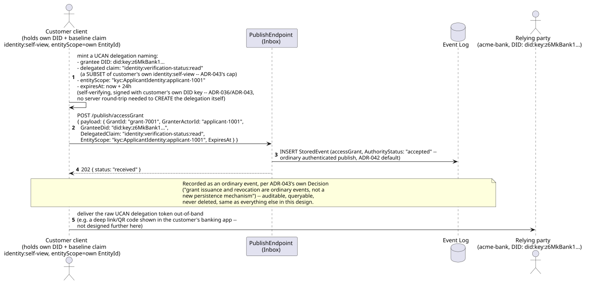

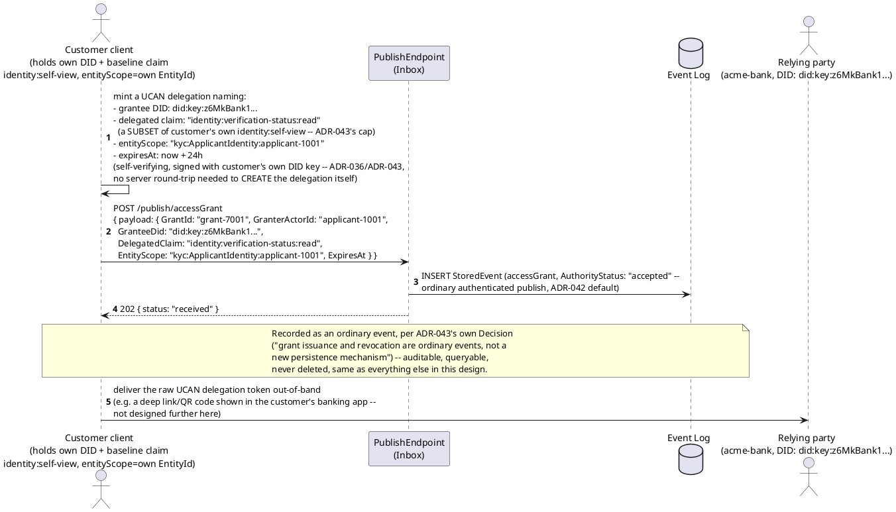

## Sequence diagram — relying party exchanges the grant, reads the claims-gated result, and the read is logged

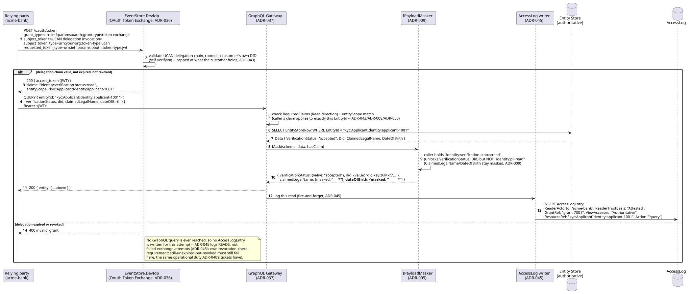

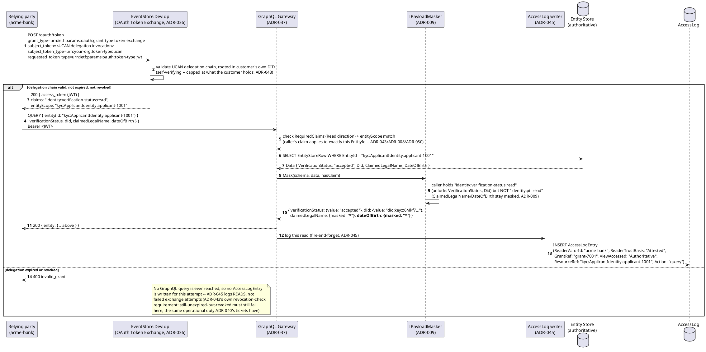

## Data model (ER diagram)

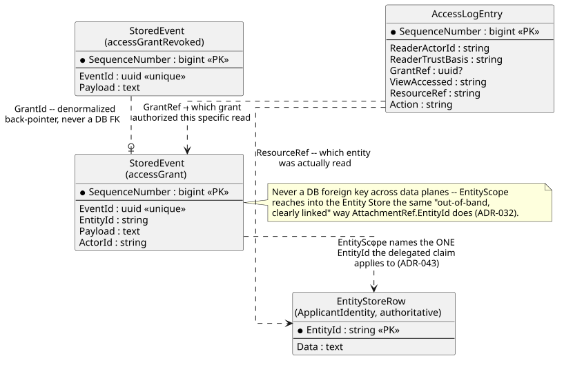

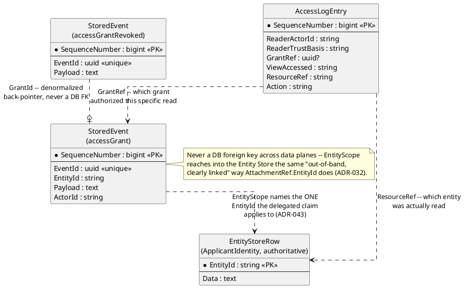

```csharp
// Registered event type "accessGrant" v1 (schema-registry.md), reusing
// ADR-043's own named shape ("an accessGrant/accessGrantRevoked event
// type, registered and folded like any other").
// EntityIdField "$.GrantId" -> EntityId "kyc:AccessGrant:{GrantId}" (ADR-021)
public class AccessGrantPayload
{
    public string GrantId { get; set; } = default!;
    public string GranterActorId { get; set; } = default!;   // "applicant-1001" -- the customer delegating access to their own record
    public string GranteeDid { get; set; } = default!;        // the relying party's own DID -- who the capability is delegated TO
    public string DelegatedClaim { get; set; } = default!;    // "identity:verification-status:read" -- a SUBSET of what the granter holds (ADR-043's cap)
    public string EntityScope { get; set; } = default!;       // "kyc:ApplicantIdentity:applicant-1001" -- ADR-043's entity-scope restriction, never blanket
    public DateTimeOffset ExpiresAt { get; set; }
}

// Registered event type "accessGrantRevoked" v1 (schema-registry.md)
public class AccessGrantRevokedPayload
{
    public string GrantId { get; set; } = default!;
    public string RevokedBy { get; set; } = default!;
    public string? Reason { get; set; }
}
```

## State machine — an access grant's lifecycle

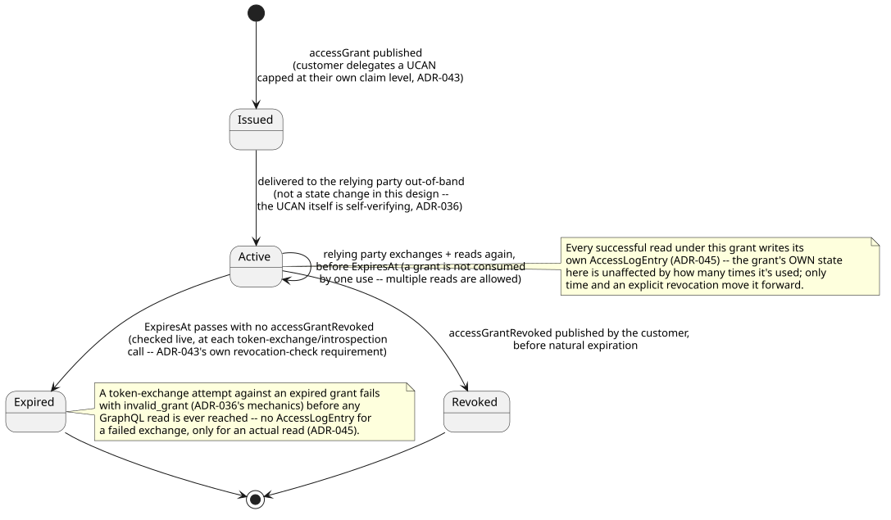

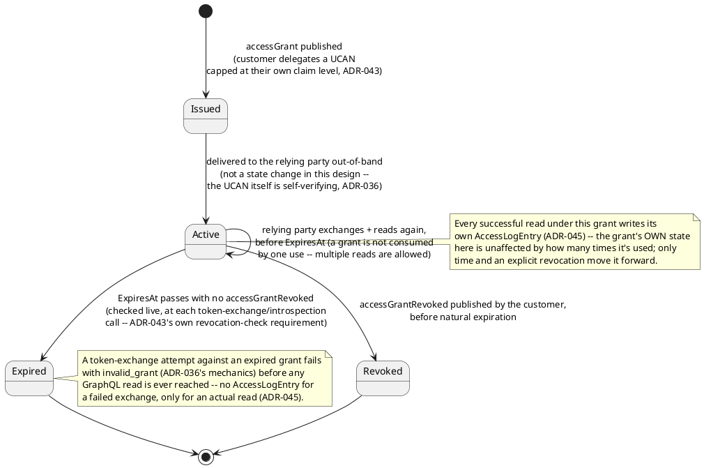

## Salt (UI mockup) — three screens, request through confirmation

**Screen 1 — relying party's request form** (acme-bank's own dashboard,
initiating the out-of-band request the first sequence diagram's final
step delivers to the customer). Transition: clicking "Send request"
generates a shareable link/QR code and notifies the customer.


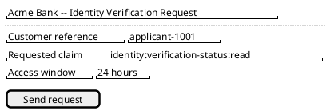

**Screen 2 — customer's consent/presentation screen** (in the customer's
own KYC-platform client — corresponds to the first sequence diagram's
UCAN-minting + `POST /publish/accessGrant` steps). Transition: clicking
"Approve" mints and signs the delegation, publishes the `accessGrant`
event, and hands the token back to acme-bank out-of-band; "Deny" ends the
flow with nothing published at all.

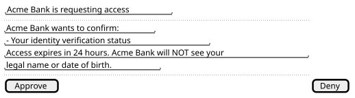

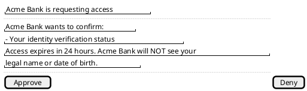

**Screen 3 — relying party's confirmation result** (acme-bank's own
dashboard, corresponds to the second sequence diagram's masked GraphQL
response). This is the terminal screen for this flow — no further
transition; the read has already been logged server-side (`ADR-045`) by
the time this renders.


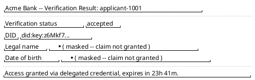

## Gherkin

```gherkin
Feature: Relying-Party Verification Request
  As a verified customer
  I want to delegate a capped, time-boxed, entity-scoped read grant to a relying party
  And as a relying party
  I want to exchange that grant for a bearer token and read only what it unlocks
  So that a third party can confirm my verified identity status without ever
  seeing more than I explicitly delegated, with every read logged

  # EntityId format is {appId}:{entityType}:{uniqueId} (ADR-021). "applicant-1001"
  # is the same accepted identity record customer-onboarding-and-identity-
  # verification.md's scenarios establish. See did-ucan-attestation.md for
  # the Token Exchange mechanics this file's Background assumes.

  Background:
    Given "kyc:ApplicantIdentity:applicant-1001" is an accepted identity record
      (VerificationStatus "accepted", per customer-onboarding-and-identity-verification.md)
    And applicant "applicant-1001" holds claim "identity:self-view"
      with entityScope "kyc:ApplicantIdentity:applicant-1001"
    And the event type "accessGrant" version 1 is registered with EntityIdField "$.GrantId"
    And the event type "accessGrantRevoked" version 1 is registered with EntityIdField "$.GrantId"
    And relying party "acme-bank" holds DID "did:key:z6MkBank1..."

  Scenario: A customer delegates a capped, entity-scoped, time-boxed grant to a relying party
    When "applicant-1001" POSTs to "/publish/accessGrant" with body:
      """
      {
        "payload": {
          "GrantId": "grant-7001", "GranterActorId": "applicant-1001", "GranteeDid": "did:key:z6MkBank1...",
          "DelegatedClaim": "identity:verification-status:read", "EntityScope": "kyc:ApplicantIdentity:applicant-1001",
          "ExpiresAt": "2026-07-31T00:00:00Z"
        }
      }
      """
    Then the response status should be 202
    And the stored event "grant-7001" should be queryable and never deleted
    # An ordinary event, not a new persistence mechanism (ADR-043's own Decision).

  Scenario: The relying party exchanges the delegated UCAN for a bearer JWT carrying the capped claim and entity scope
    Given grant "grant-7001" was issued as above, not yet expired or revoked
    When "acme-bank" POSTs to "/oauth/token" with
      "grant_type=urn:ietf:params:oauth:grant-type:token-exchange" and
      "subject_token" set to the UCAN delegation invocation for "grant-7001"
    Then EventStore.DevIdp should return a JWT whose claims include
      "identity:verification-status:read" scoped to entity "kyc:ApplicantIdentity:applicant-1001"
    # Capped at what applicant-1001 itself holds (identity:self-view) --
    # UCAN's own delegation-chain validation enforces this, nothing new (ADR-043).

  Scenario: The relying party's GraphQL read returns a claims-gated, masked response, and the read is logged
    Given "acme-bank" holds a bearer JWT for grant "grant-7001", per above
    When "acme-bank" QUERYs the GraphQL Gateway with:
      """
      { entity(id: "kyc:ApplicantIdentity:applicant-1001") { verificationStatus, did, claimedLegalName, dateOfBirth } }
      """
    Then the response status should be 200
    And "verificationStatus" and "did" should be unwrapped, real values
    And "claimedLegalName" and "dateOfBirth" should be wrapped "masked", not real values
    And an AccessLogEntry should be written with ReaderActorId "acme-bank",
      ReaderTrustBasis "Attested", GrantRef "grant-7001", Action "query"
    # identity:pii-read was never delegated -- only identity:verification-status:read
    # was, so ClaimedLegalName/DateOfBirth stay masked even though the query itself succeeds.

  Scenario: An expired grant fails token exchange, and no read (or AccessLogEntry) ever occurs
    Given grant "grant-7002" was issued with ExpiresAt in the past
    When "acme-bank" attempts to exchange the UCAN delegation for "grant-7002"
    Then EventStore.DevIdp should reject the exchange with "invalid_grant"
    And no GraphQL query should ever be attempted
    And no new AccessLogEntry should be written for this attempt
    # ADR-045 logs reads, not failed exchange attempts.

  Scenario: A revoked grant fails token exchange even before its natural expiration
    Given grant "grant-7003" was issued with ExpiresAt 24 hours in the future
    And "applicant-1001" POSTed to "/publish/accessGrantRevoked" with body:
      """
      { "payload": { "GrantId": "grant-7003", "RevokedBy": "applicant-1001", "Reason": "requested in error" } }
      """
    When "acme-bank" attempts to exchange the UCAN delegation for "grant-7003"
    Then EventStore.DevIdp should reject the exchange with "invalid_grant"
    # Revocation is checked live at exchange/introspection time, not just the
    # UCAN's own exp claim -- the same operational duty ADR-040's tickets already have.

  Scenario: A grant can be used for more than one read before it expires
    Given "acme-bank" holds a valid, unexpired bearer JWT for grant "grant-7001"
    When "acme-bank" QUERYs the GraphQL Gateway for "kyc:ApplicantIdentity:applicant-1001" a second time, an hour later
    Then the response status should be 200
    And a second, independent AccessLogEntry should be written for this second read
    # A grant is not consumed by one use -- only time or explicit revocation ends it.
```
