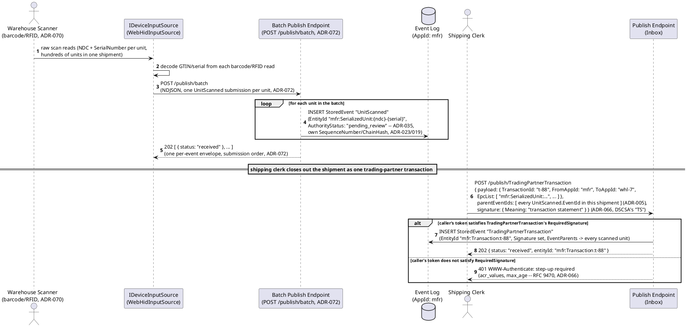
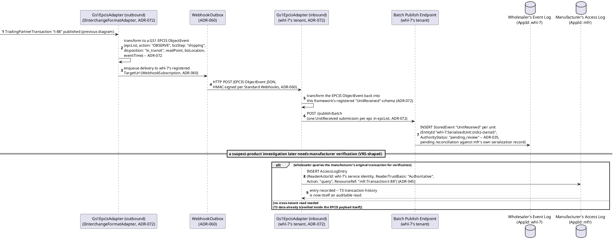
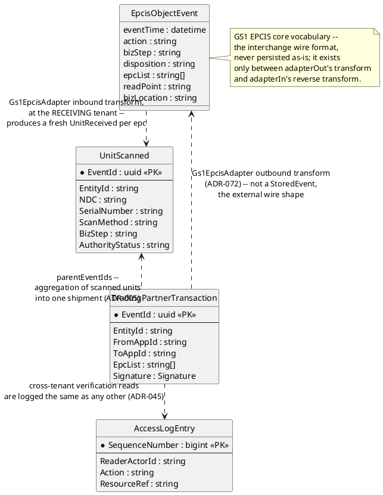
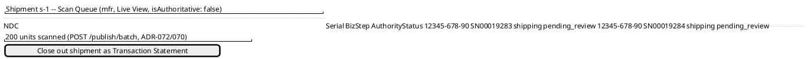
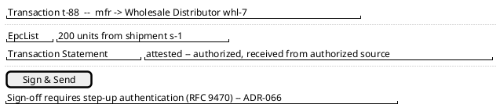
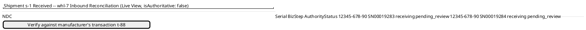

# Feature: Product Serialization and Trading Partner Transaction

Context: this domain's own [`README.md`](../README.md#applicable-adrs)
names `ADR-072` (bulk ingestion + external interchange-format adapters)
as **directly load-bearing** here — a concrete `Gs1EpcisAdapter`
implementation of `IInterchangeFormatAdapter` for outbound GS1/EPCIS
trading-partner exchange, plus `POST /publish/batch` for the
thousands-of-units-per-shipment volume this domain actually has. This
doc exercises that directly, alongside four more ADRs the same
`README.md` lists: `ADR-005` (event lineage — aggregation of serialized
units into a shipment/transaction is a literal DAG), `ADR-070` (device
input integration — barcode/RFID scanning is this domain's routine
capture mechanism, not a special case), `ADR-060` (outbound webhooks —
the transaction notification `Gs1EpcisAdapter` composes ahead of), and
`ADR-045` (read access audit log — DSCSA's transaction-history
requirement is itself a provenance record). Two secondary-fit ADRs from
the same list appear naturally in the flow rather than being built out
separately: `ADR-035` (non-authoritative capture — a freshly scanned
unit is pending reconciliation against the manufacturer's own
serialization record) and `ADR-066` (digital sign-off — a trading
partner's Transaction Statement, one of DSCSA's three required "T3"
elements, is exactly an attestation). Envelope/data shapes referenced
below come from
[`../../../data/event-log.md`](../../../data/event-log.md)
(`StoredEvent`, `Signature`) and
[`../../../data/schema-registry.md`](../../../data/schema-registry.md)
(`WebhookSubscription`).

**One deliberate extension, stated rather than silently assumed**:
`ADR-072`'s own Decision describes `IInterchangeFormatAdapter` as
bidirectional in general (an inbound direction for HL7v2/FHIR, an
outbound direction for ICH E2B(R3)/GS1-EPCIS), even though this domain's
`README.md` only names `Gs1EpcisAdapter`'s *outbound* direction by name.
This doc uses the same, already-decided, general adapter shape inbound
too — at the *receiving* trading partner, translating an arrived EPCIS
`ObjectEvent` back into this framework's own registered schema — since a
real DSCSA hand-off is symmetric (one partner's outbound transaction is
the next partner's inbound receipt) and `ADR-072` already built the seam
to do exactly this; nothing new is being invented here, only applied on
both sides of one already-decided mechanism.

This doc covers only what's specific to serialized-unit capture and a
trading-partner transaction's own path. It deliberately does **not**
re-derive:
- Batch-endpoint transport mechanics in general (`POST /publish/batch`'s
  NDJSON/JSON-array shape, per-event status envelope) — that's
  `ADR-072`'s own decision record; this doc only shows it applied to
  unit scans and inbound receipts.
- Device input source selection (`IDeviceInputSource`,
  `WebHidInputSource` vs. `WebUsbInputSource` vs. `NativeBridgeInputSource`)
  — `ADR-070`'s own decision record; this doc treats "a scan arrives"
  as a given, not which browser API produced it.
- Webhook signing/retry/delivery-cursor mechanics in general (Standard
  Webhooks, `WebhookDeliveryCursor`) — `ADR-060`'s own decision record;
  this doc only shows a `Gs1EpcisAdapter` transform riding ahead of an
  existing delivery.
- Masking/`x-masking` — explicitly a **weak fit** per this domain's own
  `README.md` (DSCSA data is overwhelmingly product/lot/transaction
  data, not personal data), so this doc has nothing to mask and doesn't
  attempt to manufacture a PII scenario this domain doesn't naturally
  have.

## Sequence diagram — batch scan capture and a signed trading-partner transaction



## Sequence diagram — outbound EPCIS delivery, inbound receipt, and cross-tenant verification



## Data model (ER diagram)



Full `StoredEvent`/`Signature` columns are in
[`../../../data/event-log.md`](../../../data/event-log.md); full
`WebhookSubscription` columns are in
[`../../../data/schema-registry.md`](../../../data/schema-registry.md).

```csharp
// Payload shape for event type "UnitScanned" v1
// (ChangeKind: Partial, EntityIdField: "$.SerializedUnitId")
public class UnitScannedPayload
{
    public string SerializedUnitId { get; set; } = default!;    // "{NDC}-{SerialNumber}" -> EntityId "mfr:SerializedUnit:{SerializedUnitId}" (ADR-021)
    public string NDC { get; set; } = default!;
    public string SerialNumber { get; set; } = default!;
    public string ScanMethod { get; set; } = default!;            // "Barcode" | "RFID" (ADR-070's capture mechanism)
    public string BizStep { get; set; } = default!;               // GS1 CBV term, e.g. "shipping" | "receiving"
}
// Envelope: AuthorityStatus explicitly declares a review-pending marker at publish time (ADR-035/ADR-042) --
// a scanned unit is non-authoritative until reconciled against the manufacturer's own serialization record;
// ActorId = the scanning device's/warehouse worker's verified identity (ADR-064).

// Payload shape for event type "TradingPartnerTransaction" v1
// (ChangeKind: Full, EntityIdField: "$.TransactionId", RequiredSignature configured -- ADR-066)
public class TradingPartnerTransactionPayload
{
    public string TransactionId { get; set; } = default!;        // -> EntityId "mfr:Transaction:{TransactionId}"
    public string FromAppId { get; set; } = default!;              // ADR-030 -- each trading partner its own tenant
    public string ToAppId { get; set; } = default!;
    public List<string> EpcList { get; set; } = new();             // the EntityIds of every serialized unit in this shipment
}
// Envelope: Signature required, Meaning "transaction statement" -- DSCSA's "TS" (ADR-066);
// parentEventIds = every constituent UnitScanned.EventId (ADR-005) -- the aggregation DAG this domain's
// README names directly; SignerId denormalizes the shipping clerk's ActorId (ADR-064).

// The GS1 EPCIS wire shape Gs1EpcisAdapter transforms to/from -- never a StoredEvent, exists only
// in flight between the outbound transform and the receiving tenant's inbound transform (ADR-072).
public class EpcisObjectEventWireShape
{
    public DateTimeOffset EventTime { get; set; }
    public string Action { get; set; } = default!;                 // "ADD" | "OBSERVE" | "DELETE" (GS1 EPCIS core vocabulary)
    public string BizStep { get; set; } = default!;                 // e.g. "shipping" | "receiving"
    public string Disposition { get; set; } = default!;             // e.g. "in_transit" | "in_progress"
    public List<string> EpcList { get; set; } = new();
    public string ReadPoint { get; set; } = default!;
    public string BizLocation { get; set; } = default!;
}
```

## Salt (UI mockup) — scan-to-shipment-to-receipt user flow, across the manufacturer's scan queue, sign-off screen, and the receiving partner's inbound reconciliation screen

### Screen 1: Manufacturer's shipment scan queue (Live View, pending reconciliation)



This is the first sequence diagram's batch-scan loop rendered as a
screen: every row is a `UnitScanned` event, still `pending_review`
(`ADR-035`) because none of them has been reconciled against the
manufacturer's own serialization record yet. Clicking **Close out
shipment as Transaction Statement** is the shipping clerk's action that
opens Screen 2, the sign-off screen for the aggregating
`TradingPartnerTransaction`.

### Screen 2: Manufacturer's transaction statement sign-off screen



**Sign & Send** dispatches `POST /publish/TradingPartnerTransaction`
with `parentEventIds` naming all 200 `UnitScanned` events (`ADR-005`)
and a `Signature` whose `Meaning` is DSCSA's "transaction statement"
(`ADR-066`) — a token that doesn't yet satisfy `RequiredSignature`
gets turned away with a step-up challenge before storage, exactly as
the first sequence diagram's `alt` branch shows, and the clerk retries
from this same screen once stepped up. Once stored, `Gs1EpcisAdapter`'s
outbound transform and webhook delivery (`ADR-072`/`ADR-060`) carry the
transaction to the receiving partner with no further screen on the
manufacturer's side — Screen 3 belongs to a different tenant entirely.

### Screen 3: Receiving partner's inbound reconciliation screen (whl-7, Live View)



Each row is a `UnitReceived` event the inbound `Gs1EpcisAdapter`
transform produced from the EPCIS `ObjectEvent` the manufacturer's
Screen 2 triggered — still `pending_review` at whl-7 pending its own
reconciliation (`ADR-035`), the same non-authoritative posture the
manufacturer's own Screen 1 started from. **Verify against
manufacturer's transaction t-88** is the suspect-product/VRS-shaped
cross-tenant read the second sequence diagram shows, writing an
`AccessLogEntry` at the manufacturer's own tenant (`ADR-045`) — DSCSA's
transaction-history requirement made auditable as an ordinary read,
not a new mechanism.

## Gherkin

```gherkin
Feature: Product Serialization and Trading Partner Transaction
  As a DSCSA-regulated trading partner
  I want scanned serialized units aggregated into a signed transaction and exchanged with the next trading partner via GS1/EPCIS
  So that DSCSA's package-level transaction-information/history/statement (T3) requirement is met without a bespoke interchange mechanism

  Background:
    Given the event type "UnitScanned" version 1 is registered with ChangeKind "Partial" and EntityIdField "$.SerializedUnitId"
    And the event type "TradingPartnerTransaction" version 1 is registered with ChangeKind "Full", EntityIdField "$.TransactionId", and RequiredSignature { AcrValues: ["urn:mfr:acr:step-up"], MaxAge: 3600 }
    And the event type "UnitReceived" version 1 is registered with ChangeKind "Partial" and EntityIdField "$.SerializedUnitId" under AppId "whl-7"
    And a WebhookSubscription is registered for AppId "mfr" targeting whl-7's inbound EPCIS endpoint with EventTypes [ "TradingPartnerTransaction" ]
    And "Gs1EpcisAdapter" is registered as the IInterchangeFormatAdapter for outbound TradingPartnerTransaction events and for inbound EPCIS ObjectEvents at whl-7

  Scenario: Batch-scanning a shipment publishes one independently persisted event per unit
    When the warehouse scanner submits a batch of 200 unit scans for shipment "s-1"
    Then the response should be an array of 200 per-event status envelopes, in submission order
    And 200 "UnitScanned" events should exist, each with its own SequenceNumber and ChainHash
    # ADR-072's batch endpoint is a transport optimization, not a new persistence guarantee --
    # each event is exactly as independently persist-everything as if sent alone (ADR-023).

  Scenario: A freshly scanned unit starts pending reconciliation, not authoritative
    When "UnitScanned" is published for NDC "12345-678-90" serial "SN00019283"
    Then the stored event's AuthorityStatus should be "pending_review"
    And EntityStoreRow "mfr:SerializedUnit:12345-678-90-SN00019283" should not yet be folded into the authoritative view
    # A scanned unit is pending reconciliation against the manufacturer's own serialization
    # record (ADR-035) -- the same posture this domain's README names for suspect-product handling.

  Scenario: Closing out a shipment publishes a signed transaction parented to every scanned unit
    Given 200 "UnitScanned" events exist for shipment "s-1"
    And the shipping clerk's token satisfies "urn:mfr:acr:step-up"
    When the clerk publishes "TradingPartnerTransaction" "t-88" with EpcList naming all 200 units and parentEventIds listing all 200 UnitScanned events
    Then the response status should be 202 with entityId "mfr:Transaction:t-88"
    And the stored event's Signature should have Meaning "transaction statement"
    And querying ancestors of "mfr:Transaction:t-88" should return all 200 "UnitScanned" events

  Scenario: A transaction publish without a sufficiently strong authentication context is rejected before storage
    Given the shipping clerk's token does not satisfy "urn:mfr:acr:step-up"
    When the clerk attempts to publish "TradingPartnerTransaction" "t-88"
    Then the response should be 401 with a WWW-Authenticate step-up challenge naming "urn:mfr:acr:step-up"
    And no "TradingPartnerTransaction" event should be stored

  Scenario: The outbound adapter transforms the transaction into a GS1 EPCIS ObjectEvent and delivers it via webhook
    Given "TradingPartnerTransaction" "t-88" has been published and signed
    When Gs1EpcisAdapter runs its outbound transform
    Then the delivered payload should be a GS1 EPCIS ObjectEvent with action "OBSERVE", bizStep "shipping", and an epcList naming all 200 units
    And the delivery should be HMAC-signed per the Standard Webhooks convention (ADR-060)

  Scenario: The receiving trading partner's inbound adapter re-publishes one UnitReceived event per unit via batch
    Given whl-7 has received the EPCIS ObjectEvent for transaction "t-88"
    When Gs1EpcisAdapter's inbound transform runs at whl-7
    Then whl-7 should publish a batch of 200 "UnitReceived" events, one per epc in the epcList
    And each should have AuthorityStatus "pending_review" pending whl-7's own reconciliation

  Scenario: A cross-tenant verification query against the manufacturer's transaction writes an access-log entry
    Given transaction "mfr:Transaction:t-88" exists and whl-7 needs to verify a suspect unit against it
    When whl-7's service identity queries "mfr:Transaction:t-88" directly
    Then an AccessLogEntry should be written at AppId "mfr" with ReaderActorId identifying whl-7's service identity and Action "query"
    # DSCSA's transaction-history requirement is itself a provenance record (ADR-045) --
    # this is the VRS-shaped reconciliation round trip this domain's glossary names.
```
