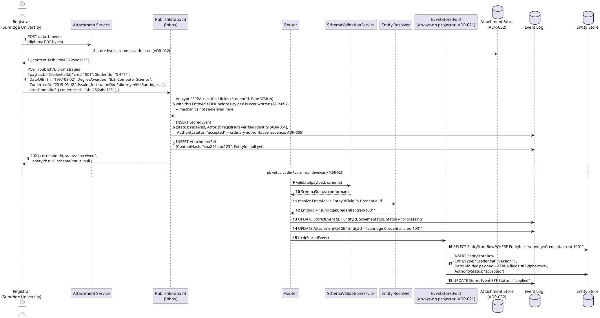
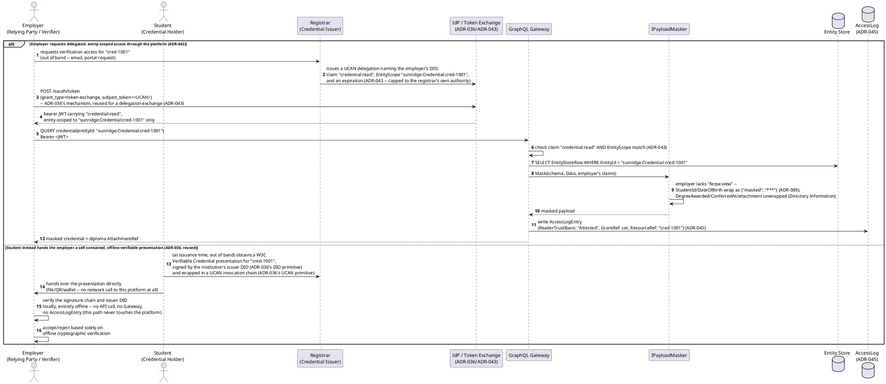
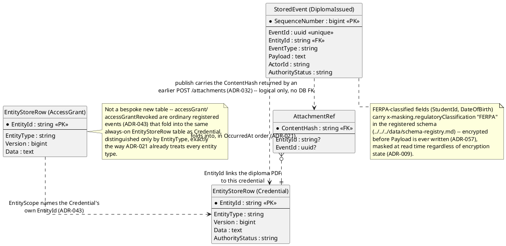
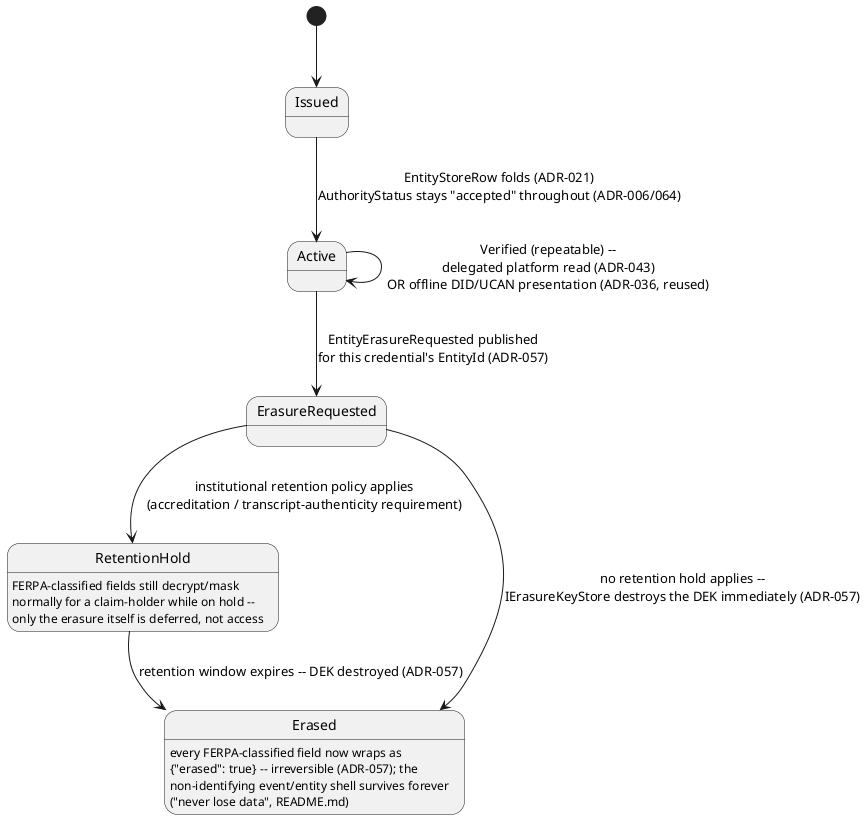
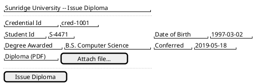

[← Education / Credentials domain](../README.md)

# Feature: Credential Issuance and Verification

Context: exercises this domain's primary-fit mechanisms per
[`../README.md`](../README.md)'s "Applicable ADRs" section: `ADR-032`
(binary attachments — the diploma/transcript PDF itself), `ADR-030`
(multi-tenancy — each institution is its own `AppId`-scoped application),
`ADR-046`/`ADR-043` (RBAC + row-level, entity-scoped access — registrar,
student, and employer/relying-party each need different access to the
same credential record), `ADR-009`/`ADR-050`/`ADR-052` (masking +
regulatory classification — FERPA-classified fields), and `ADR-057`
(GDPR/CCPA erasure via crypto-shredding — this domain's genuine
retention-vs-erasure tension, footnoted H* in the comparison). `StoredEvent`'s
envelope shape is defined in
[`../../../data/event-log.md`](../../../data/event-log.md);
`EventTypeDefinition`'s `x-masking` extension shape (including
`erasureScope`) is defined in
[`../../../data/schema-registry.md`](../../../data/schema-registry.md);
`Attachment`/`AttachmentRef`'s content-addressed shape is defined in
[`../../../data/streaming-and-attachments.md`](../../../data/streaming-and-attachments.md).
This doc cites all three, never redefines them.

**A disambiguated, partial reuse of `ADR-036`** (scored secondary/M fit
by the domain README, not primary): `ADR-036` was originally designed
for `ADR-035`'s non-authoritative-capture trigger — an offline field
actor whose authority can't be verified until connectivity returns. This
doc reuses the same DID+UCAN *mechanism* (a DID proves cryptographic
control of an identifier; a UCAN proves an offline-verifiable delegated-
capability chain) for a **different actor role**: issuer → holder →
verifier credential presentation, not field-capture attestation. An
accredited institution issuing a diploma is already an ordinary,
authoritative publish (`ADR-006`'s verified caller identity) — every
`DiplomaIssued` event's `AuthorityStatus` stays `"accepted"` throughout
this doc; nothing here sets it to `unattested`/`pending_review` or
routes it through `ADR-035`'s `authorityDecision`/`AttestedClaims`
gating. What the institution issuer *does* reuse from `ADR-036` is the
DID/UCAN artifact shape itself, applied to a **W3C Verifiable
Credentials Data Model v2.0** presentation (W3C Recommendation, 15 May
2025 — verified directly against the spec before citing it, not
recalled) that the student later hands to an employer.

Out of scope, deliberately not re-derived here:
- The entity-scoped claim check mechanics (`ADR-043`'s "does the caller
  have this claim, *and* does it apply to this `EntityId`") and RBAC
  role/permission-union mechanics (`ADR-046`) — see those ADRs directly.
- `ADR-032`'s content-addressing, deduplication, and access-path
  mechanics for attachments — see that ADR; this doc only shows a
  `DiplomaIssued` event linked to an `AttachmentRef`.
- `ADR-057`'s crypto-shredding/`IErasureKeyStore`/DEK-wrapping mechanics
  — see that ADR and [`../../../data/entity-store.md`](../../../data/entity-store.md)'s
  `EntityErasureKey`; this doc only shows the state-machine branch
  (retention hold vs. erased) the retention-vs-erasure tension produces.
- UCAN delegation-chain validation/Token Exchange mechanics themselves —
  see `ADR-036`/`ADR-043`; this doc only shows *where* each of the two
  verification branches occurs (through the platform vs. fully offline).

## Sequence diagram — institution issues a diploma with an attached PDF



`AttachmentRef` links the uploaded diploma PDF to the credential entity
exactly as `ADR-032` already specifies — the two-step handoff (`POST
/attachments` first, the domain event carrying only the resulting
`ContentHash` second) is what keeps the large binary out of
`SchemaValidationService`'s parse path, not something specific to this
domain. `ActorId` is always the registrar's own verified identity
(`ADR-064`), never the student's — the institution is the publisher of
record for its own issuance, regardless of who the credential is about.

## Sequence diagram — a relying party verifies a credential, two branches



The two branches are deliberately asymmetric, not two ways of reaching
the same outcome: the platform-mediated branch still enforces `ADR-009`
masking and writes `ADR-045`'s audit trail, exactly like every other
read; the offline branch bypasses the platform entirely — no masking
check and no access-log entry occur, because the presentation only ever
carries whatever the issuer chose to disclose into it at issuance time,
not a live re-query of the record.

## Data model (ER diagram)



The registered `x-masking` annotation for `StudentId`
(`docs/data/schema-registry.md`'s shape, verified against the real
regulation before citing — FERPA's implementing regulation is 34 CFR
Part 99, issued under 20 U.S.C. §1232g):

```json
"StudentId": {
  "type": "string",
  "x-masking": {
    "requiredClaim": "ferpa:view",
    "strategy": "FixedValue",
    "maskedValue": "***",
    "regulatoryClassification": "FERPA",
    "governanceBody": "US ED",
    "regulationReference": "FERPA, 20 U.S.C. §1232g; 34 CFR Part 99"
  }
}
```

`DateOfBirth` carries the identical `x-masking` block. `DegreeAwarded`
and `ConferredAt` carry **no** `x-masking` at all — both fall inside
FERPA's narrow **Directory Information** carve-out (34 CFR §99.37: a
school may disclose directory information without consent, having given
public notice and an opt-out window), the one category of education-
record field this domain's own glossary calls out as the boundary
FERPA-classified fields need to encode correctly.

Matching C# sketch (payload shapes, not envelope fields — see
`event-log.md` for those):

```csharp
// DiplomaIssued payload (StoredEvent.Payload, ADR-023) -- EntityIdField "$.CredentialId" (ADR-021)
public class DiplomaIssuedPayload
{
    public string CredentialId { get; set; } = default!;          // {appId}:Credential:{uniqueId}
    public string StudentId { get; set; } = default!;              // x-masking requiredClaim "ferpa:view" (ADR-009/050) -- encrypted at rest (ADR-057)
    public string DateOfBirth { get; set; } = default!;            // same x-masking treatment -- NOT Directory Information (34 CFR §99.37)
    public string DegreeAwarded { get; set; } = default!;           // Directory Information -- no x-masking (34 CFR §99.37)
    public DateTimeOffset ConferredAt { get; set; }
    public string IssuingInstitutionDid { get; set; } = default!;   // institution's own DID -- signs the later W3C VC presentation (ADR-036, reused for issuer role)
}

// AccessGrant payload (an ordinary registered event type, ADR-043) -- EntityIdField "$.GrantId"
public class AccessGrantPayload
{
    public string GrantId { get; set; } = default!;        // {appId}:AccessGrant:{uniqueId}
    public string GranteeDid { get; set; } = default!;       // employer's DID
    public string DelegatedClaim { get; set; } = default!;   // e.g. "credential:read"
    public string EntityScope { get; set; } = default!;      // the Credential's own EntityId this grant is capped to (ADR-043)
    public DateTimeOffset ExpiresAt { get; set; }
}
```

## State diagram — credential lifecycle



`RetentionHold` is the real branch this domain's genuine
retention-vs-erasure tension produces: an institution's own retention
policy (accreditation body requirements, transcript-authenticity needs)
can outrank an erasure request that would otherwise proceed immediately
— a deployment-level policy decision `ADR-057` leaves to the operator,
not a framework default that always erases on request. Once no
retention hold applies (or a hold's window expires), the outcome is
identical either way: the entity's Data-Encryption Key is destroyed via
the configured `IErasureKeyStore`, never `Payload`/`ChainHash`
themselves (`ADR-057`, `ADR-019`).

## Salt (UI mockup) — issuance-to-verification user flow, across the registrar's issuance form, the employer's initial view, and the delegated-access result screen

### Screen 1: Registrar's diploma issuance form



**Issue Diploma** first uploads the PDF via `POST /attachments`
(`ADR-032`), then dispatches `POST /publish/DiplomaIssued` carrying the
resulting `ContentHash`, exactly as the issuance sequence diagram's own
steps show. `FERPA`-classified fields are encrypted before `Payload` is
ever written (`ADR-057`) and `AuthorityStatus` is `"accepted"`
immediately — this is an ordinary authoritative institutional issuance
(`ADR-006`), never routed through review-pending gating. This screen
belongs to the registrar; the employer's own verification screens
(Screens 2–3) are opened later, out of band, by a different actor
entirely.

### Screen 2: Employer/relying-party's initial verification view

```plantuml
@startsalt
{
  { "Credential Verification -- cred-1001 (Sunridge University)" }
  ..
  | Field           | Value                                     |
  | Institution      | "Sunridge University"                     |
  | Degree Awarded   | "B.S. Computer Science"                    |
  | Conferred        | "2019-05-18"                                |
  | Student ID       | "***"  ( FERPA -- masked, no claim held )  |
  | Date of Birth    | "***"  ( FERPA -- masked, no claim held )  |
  | Diploma (PDF)    | [ View attachment ]                        |
  ..
  { "Access basis:" | "none yet -- request required" }
  ..
  [ Request verification access ] | [ Verify offline presentation instead ]
}
@endsalt
```



The two buttons map directly onto the verification sequence diagram's
two branches. **Verify offline presentation instead** opens a local
file/QR import for a student-supplied W3C VC presentation, verified
entirely client-side with no request ever leaving the employer's
device — that branch has no further platform screen at all, per the
sequence diagram's own `else` arm. **Request verification access**
instead starts the `ADR-043` delegated-grant/Token-Exchange flow and
leads to Screen 3 once the registrar issues the grant and the employer
exchanges it for a bearer JWT.

### Screen 3: Employer's delegated-access result screen

```plantuml
@startsalt
{
  { "Credential Verification -- cred-1001 (Sunridge University)" }
  ..
  | Field           | Value                                     |
  | Institution      | "Sunridge University"                     |
  | Degree Awarded   | "B.S. Computer Science"                    |
  | Conferred        | "2019-05-18"                                |
  | Student ID       | "***"  ( FERPA -- masked, no "ferpa:view" ) |
  | Date of Birth    | "***"  ( FERPA -- masked, no "ferpa:view" ) |
  | Diploma (PDF)    | [ View attachment ]                        |
  ..
  { "Access basis:" | "delegated grant, entity-scoped to cred-1001, expires 2026-08-04" }
}
@endsalt
```



This is the same `sunridge:Credential:cred-1001` record, now readable
because the employer's bearer JWT carries the registrar's `ADR-043`
delegation (`credential:read`, entity-scoped, capped to an expiration) —
the verification sequence diagram's platform-mediated branch completing.
`StudentId`/`DateOfBirth` still render masked: the grant delegates
`credential:read`, not `ferpa:view`, and holding one never implies the
other (`ADR-009`/`ADR-043`). Reaching this screen also writes an
`AccessLogEntry` with `ReaderTrustBasis: "Attested"` and the grant
referenced (`ADR-045`) — unlike Screen 2's offline branch, which never
touches the platform at all.

## Gherkin

```gherkin
Feature: Credential Issuance and Verification
  As an accredited institution, a graduate, and an employer/relying party
  I want a diploma issued as an event with an attached PDF, its FERPA-classified
  fields masked by default, and verifiable either through the platform or fully offline
  So that issuance stays authoritative, sensitive fields stay protected, and
  retention/accreditation requirements are honored even against an erasure request

  Background:
    Given institution "Sunridge University" publishes as AppId "sunridge" (ADR-030)
    And the event type "DiplomaIssued" version 1 is registered with ChangeKind "Full", EntityIdField "$.CredentialId", RequiredClaims [{ "Direction": "Read", "Claim": "credential:read" }], and schema:
      """
      {
        "type": "object",
        "properties": {
          "CredentialId": { "type": "string" },
          "StudentId": { "type": "string", "x-masking": { "requiredClaim": "ferpa:view", "strategy": "FixedValue", "maskedValue": "***", "regulatoryClassification": "FERPA", "governanceBody": "US ED", "regulationReference": "FERPA, 20 U.S.C. §1232g; 34 CFR Part 99" } },
          "DateOfBirth": { "type": "string", "x-masking": { "requiredClaim": "ferpa:view", "strategy": "FixedValue", "maskedValue": "***", "regulatoryClassification": "FERPA", "governanceBody": "US ED", "regulationReference": "FERPA, 20 U.S.C. §1232g; 34 CFR Part 99" } },
          "DegreeAwarded": { "type": "string" },
          "ConferredAt": { "type": "string" },
          "IssuingInstitutionDid": { "type": "string" }
        },
        "required": ["CredentialId", "StudentId", "DateOfBirth", "DegreeAwarded", "ConferredAt"]
      }
      """
      # DegreeAwarded/ConferredAt carry no x-masking at all -- FERPA Directory
      # Information, disclosable without consent per 34 CFR §99.37.
    And the event type "AccessGrant" version 1 is registered with ChangeKind "Full", EntityIdField "$.GrantId", and schema:
      """
      {
        "type": "object",
        "properties": {
          "GrantId": { "type": "string" },
          "GranteeDid": { "type": "string" },
          "DelegatedClaim": { "type": "string" },
          "EntityScope": { "type": "string" },
          "ExpiresAt": { "type": "string" }
        },
        "required": ["GrantId", "GranteeDid", "DelegatedClaim", "EntityScope", "ExpiresAt"]
      }
      """
      # EntityErasureRequested is a reserved, platform-level event type
      # (ADR-057), the same reservation pattern as EventUpcastFailed
      # (ADR-020) -- never registered via /registry, so it has no
      # Background entry of its own.

  Scenario: Issuing a diploma with an attached PDF folds into the Entity Store, already authoritative
    Given the registrar uploads the diploma PDF via "POST /attachments" and receives ContentHash "sha256:abc123"
    When the registrar publishes to "/publish/DiplomaIssued" with body:
      """
      { "payload": { "CredentialId": "cred-1001", "StudentId": "S-4471", "DateOfBirth": "1997-03-02", "DegreeAwarded": "B.S. Computer Science", "ConferredAt": "2019-05-18T00:00:00Z", "IssuingInstitutionDid": "did:key:z6MkSunridge..." }, "attachmentRef": { "contentHash": "sha256:abc123" } }
      """
    Then the response status should be 202 with status "received"
    And the stored event's ActorId should be the registrar's own verified identity (ADR-064), never the student's
    And the stored event's AuthorityStatus should be "accepted"
    # An ordinary institutional issuance never starts unattested/pending_review --
    # that only happens for ADR-035's DIFFERENT trigger case (an offline field
    # actor whose authority can't yet be verified), not reused here.
    And eventually an EntityStoreRow for "sunridge:Credential:cred-1001" should exist at Version 1
    And an AttachmentRef linking ContentHash "sha256:abc123" to EntityId "sunridge:Credential:cred-1001" should exist

  Scenario: A FERPA-classified field stays masked for a caller who lacks ferpa:view, even with credential:read
    Given the DiplomaIssued event above has been published and folded for "cred-1001"
    And the registrar holds claims "credential:read" and "ferpa:view"
    When the registrar queries credential(entityId: "sunridge:Credential:cred-1001")
    Then StudentId and DateOfBirth should both equal {"value": ...} -- unmasked
    Given an employer holds claim "credential:read" only, with no "ferpa:view"
    When the employer queries the same credential
    Then StudentId and DateOfBirth should both equal {"masked": "***"}
    And DegreeAwarded and ConferredAt should remain unwrapped plain values
    # credential:read (RBAC/RLS, ADR-046/043) governs whether the record is
    # visible at all; ferpa:view (ADR-009) is a separate, field-level gate --
    # holding one claim never implies the other.

  Scenario: An employer's delegated access grant lets them read one specific credential, still FERPA-masked
    Given the employer holds no "credential:read" claim of any kind
    When the employer queries credential(entityId: "sunridge:Credential:cred-1001") with no grant
    Then the query should be rejected for lacking "credential:read"
    Given the registrar issues a UCAN delegation naming the employer's DID, claim "credential:read", EntityScope "sunridge:Credential:cred-1001", and an expiration (ADR-043)
    And the employer exchanges that UCAN for a bearer JWT via "POST /oauth/token" (ADR-036's mechanism, reused for a delegated-grant exchange per ADR-043)
    When the employer queries credential(entityId: "sunridge:Credential:cred-1001") with that JWT
    Then the response should succeed
    And StudentId and DateOfBirth should still equal {"masked": "***"}
    # The grant delegates credential:read, not ferpa:view -- an entity-scoped
    # RLS claim and a property-level masking claim are orthogonal.
    And an AccessLogEntry should be written with ReaderTrustBasis "Attested" and GrantRef set (ADR-045)
    When the employer queries a different credential, "sunridge:Credential:cred-9999", with the same JWT
    Then the query should be rejected -- the grant's EntityScope covers only "cred-1001"

  Scenario: The student instead hands the employer a self-contained offline presentation -- no API call at all
    Given the student holds a W3C Verifiable Credential (Data Model v2.0) presentation for "cred-1001", signed by the institution's issuer DID and wrapped in a UCAN invocation chain
    # This is the disambiguated ADR-036 reuse -- the same DID/UCAN mechanism as
    # ADR-035's offline field-capture case, applied to a DIFFERENT actor role
    # (issuer -> holder -> verifier), and it never touches AuthorityStatus/
    # AttestedClaims gating: the diploma event itself was already authoritative
    # at issuance (ADR-006), not unattested.
    When the student hands that presentation directly to the employer, outside this platform entirely
    And the employer verifies the signature chain and issuer DID locally
    Then the verification should succeed with no request ever reaching the platform
    And no AccessLogEntry should be written for this verification

  Scenario: An erasure request lands in a retention hold, not immediate erasure, while accreditation retention applies
    Given "cred-1001" is still within Sunridge University's accreditation-mandated transcript retention period
    When a graduate publishes the reserved "EntityErasureRequested" event for "sunridge:Credential:cred-1001"
    Then the credential's lifecycle state should become "RetentionHold", not "Erased"
    And StudentId and DateOfBirth should still decrypt normally for a caller holding "ferpa:view"
    And the entity's Data-Encryption Key should not yet be destroyed
    # The real retention-vs-erasure tension this domain scores ADR-057 H* for:
    # institutional retention/accreditation requirements outrank an immediate
    # erasure here -- a deployment-level policy decision, not a framework default.

  Scenario: An erasure request with no retention hold destroys the key immediately
    Given a different credential "sunridge:Credential:cred-2002" has no active retention hold
    When a graduate publishes the reserved "EntityErasureRequested" event for "sunridge:Credential:cred-2002"
    Then the credential's lifecycle state should become "Erased"
    And StudentId and DateOfBirth should both equal {"erased": true} for every caller, including one holding "ferpa:view"
    And the "EntityErasureRequested" event itself should remain permanently in the Event Log, hash-chained like any other event
    # Erasure destroys the DEK, never Payload/ChainHash -- the fact that
    # erasure happened is preserved forever (ADR-057, README.md).
```
