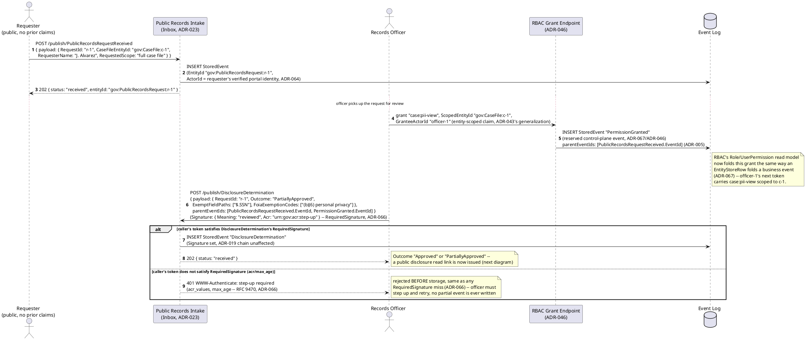
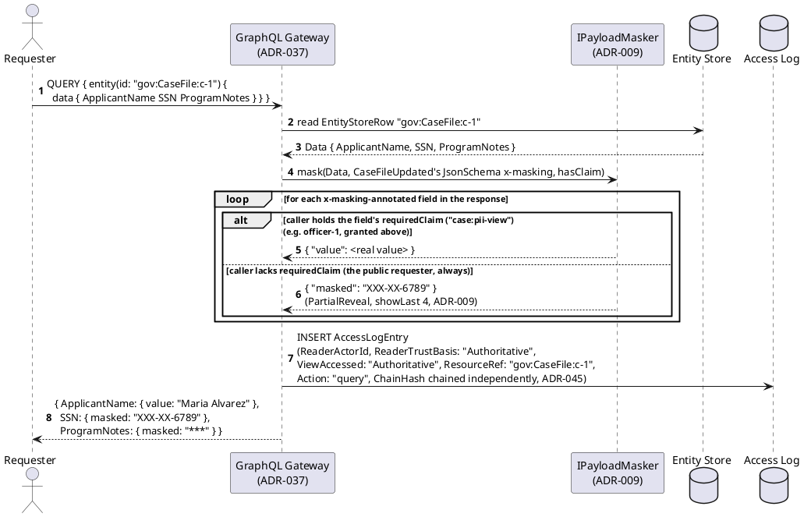
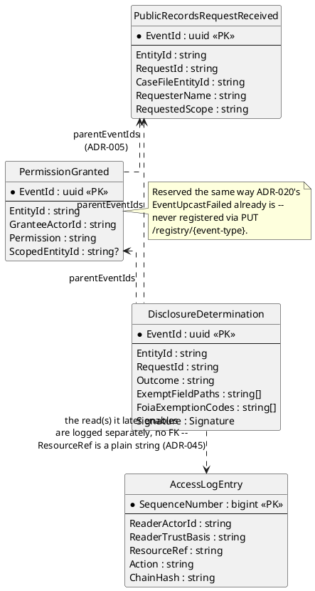
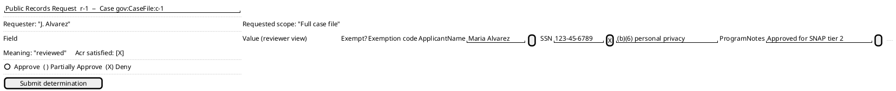

# Feature: Case File Access Request and Redacted Disclosure

Context: a public-records (FOIA-shaped) request against a case file
exercises three ADRs from this domain's own
[`README.md`](../README.md#applicable-adrs) directly: `ADR-009`
(property-level masking — the FOIA-exempt fields a requester must never
see), `ADR-045` (read access audit log — every read of the case file, by
reviewer or requester, is logged against who read it and under what
trust basis), and `ADR-067` (control-plane actions as reserved events —
granting the reviewing officer the elevated claim needed to see the
*unredacted* file before deciding what to redact is itself a reserved,
hash-chained `PermissionGranted` event in the same Event Log, not a
side-channel administrative table). It also draws on two more ADRs this
domain's `README.md` already lists: `ADR-066` (digital sign-off — the
officer's disclosure determination is a signed, attestable decision,
21 CFR Part 11 §11.50-shaped) and `ADR-005` (event lineage — the
`PermissionGranted` event and the disclosure determination both parent
off the request that caused them, a real, if modest, DAG). Envelope/data
shapes referenced below come from
[`../../../data/event-log.md`](../../../data/event-log.md) (`StoredEvent`,
`Signature`), [`../../../data/access-log.md`](../../../data/access-log.md)
(`AccessLogEntry`), and
[`../../../data/schema-registry.md`](../../../data/schema-registry.md)
(`x-masking`, `RequiredSignature`).

This doc covers only what's specific to a disclosure request's own
workflow. It deliberately does **not** re-derive:
- The `x-masking` wrapper's shape, its three strategies
  (`FixedValue`/`PartialReveal`/`Hash`), or the `RequiredReadClaim`
  ordering rule — those are `ADR-009`/`ADR-008` and are already walked
  through end-to-end in
  [`../../../features/masking.md`](../../../features/masking.md) and
  [`../../../features/event-security.md`](../../../features/event-security.md).
  This doc only shows *which* case-file fields get masked and to whom,
  not the mechanism itself.
- RBAC role/permission-grant mechanics in general (who may call the
  grant endpoint, how a granted permission flattens into a caller's
  token claims) — that's `ADR-046`/`ADR-044`'s own decision records.
  This doc only shows the one specific grant this workflow needs
  (`case:pii-view`, scoped to one case) landing as a reserved event.
- Non-authoritative capture of the underlying case submissions
  themselves (`ADR-035`) — this doc assumes case
  `gov:CaseFile:c-1` already exists and is `accepted`; intake is
  [`../../../features/non-authoritative-capture.md`](../../../features/non-authoritative-capture.md)'s
  own scenario set.
- **A deliberate design choice, stated rather than silently assumed**:
  `DisclosureDetermination.ExemptFieldPaths` below *documents*, for the
  audit record, which fields the officer identified as FOIA-exempt —
  it does not introduce a second, per-request masking mechanism.
  Enforcement of what a requester actually sees continues to be
  `ADR-009`'s existing static, schema-level `x-masking` configuration
  (a field is either always masked-to-non-claim-holders or it isn't);
  this doc does not invent per-request dynamic masking, since `ADR-009`
  doesn't have one and nothing here needs one.

## Sequence diagram — request intake through disclosure determination



`Outcome: "Denied"` is the third real outcome (not drawn as its own
`alt` arm above, since it changes no branch of this diagram — a denial
still publishes an ordinary signed `DisclosureDetermination`, it simply
never causes a disclosure read link to be issued at all). See the
Gherkin below for it.

## Sequence diagram — the public disclosure read



`ApplicantName` carries no `x-masking` at all in this example — it's
public record — so it never enters the wrapper's `masked` branch for
anyone; `SSN`/`ProgramNotes` do, and stay masked for this requester
regardless of `DisclosureDetermination.Outcome`, per the out-of-scope
note above.

## Data model (ER diagram)



Full `StoredEvent`/`Signature` columns are in
[`../../../data/event-log.md`](../../../data/event-log.md); full
`AccessLogEntry` columns are in
[`../../../data/access-log.md`](../../../data/access-log.md) — this
diagram shows only what this doc's scenarios touch.

```csharp
// Payload shape for event type "PublicRecordsRequestReceived" v1
// (ChangeKind: Full, EntityIdField: "$.RequestId")
public class PublicRecordsRequestPayload
{
    public string RequestId { get; set; } = default!;        // -> EntityId "gov:PublicRecordsRequest:{RequestId}" (ADR-021)
    public string CaseFileEntityId { get; set; } = default!;  // the case file this request targets, "gov:CaseFile:{caseId}"
    public string RequesterName { get; set; } = default!;
    public string RequestedScope { get; set; } = default!;    // free text, e.g. "full case file" | "determination letter only"
}
// Envelope (event-log.md): ActorId = the requester's verified portal identity (ADR-064, always populated);
// AuthorityStatus defaults "accepted" -- an ordinary authenticated public-portal submission (ADR-035/ADR-042).

// Reserved control-plane event type "PermissionGranted" (ADR-046, folded into RBAC's
// Role/UserPermission read models the same way a business event folds into EntityStoreRow, ADR-067)
public class PermissionGrantedPayload
{
    public string GranteeActorId { get; set; } = default!;
    public string Permission { get; set; } = default!;         // "case:pii-view"
    public string? ScopedEntityId { get; set; }                 // ADR-043's entity-scoped claim -- this case only, not blanket
}
// Envelope: ActorId = the granting supervisor/admin (ADR-064); parentEventIds = [PublicRecordsRequestReceived.EventId] (ADR-005) --
// the causal reason this grant exists, distinct from the AppId-scoped EntityId convention ADR-067 already reuses unchanged.

// Payload shape for event type "DisclosureDetermination" v1
// (ChangeKind: Partial, EntityIdField: "$.RequestId", RequiredSignature configured -- ADR-066)
public class DisclosureDeterminationPayload
{
    public string RequestId { get; set; } = default!;
    public string Outcome { get; set; } = default!;             // "Approved" | "PartiallyApproved" | "Denied"
    public List<string> ExemptFieldPaths { get; set; } = new();  // JSON Pointers, audit documentation only -- see out-of-scope note above
    public List<string> FoiaExemptionCodes { get; set; } = new(); // e.g. "(b)(6) personal privacy"
}
// Envelope: Signature required (RequiredSignature.AcrValues/MaxAge on this EventTypeDefinition, ADR-066) --
// the officer's own sign-off, Meaning "reviewed"; ActorId = officer (ADR-064);
// parentEventIds = [PublicRecordsRequestReceived.EventId, PermissionGranted.EventId] (ADR-005).
```

## Salt (UI mockup) — records officer's redaction review screen



Every field the officer sees here is unmasked (`{"value": ...}`) because
`officer-1` now holds `case:pii-view` scoped to `gov:CaseFile:c-1`, from
the `PermissionGranted` event above — this is the reviewer-side
counterpart to the public requester's masked view in the second sequence
diagram, the same `x-masking` mechanism, two different callers.

## Gherkin

```gherkin
Feature: Case File Access Request and Redacted Disclosure
  As a government casework agency
  I want a public-records request to go through review before disclosure, with FOIA-exempt fields always masked to the public
  So that citizens' privacy-exempt data is never disclosed while everything else on the record is, with an auditable trail of who read what

  Background:
    Given case "gov:CaseFile:c-1" exists and is accepted, with Data:
      | ApplicantName | SSN         | ProgramNotes                 |
      | Maria Alvarez | 123-45-6789 | Approved for SNAP tier 2      |
    And the event type "CaseFileUpdated" registered "SSN" with x-masking strategy "PartialReveal" (showLast 4) requiring claim "case:pii-view"
    And the event type "CaseFileUpdated" registered "ProgramNotes" with x-masking strategy "FixedValue" requiring claim "case:pii-view"
    And "ApplicantName" carries no x-masking at all
    And the event type "PublicRecordsRequestReceived" version 1 is registered with ChangeKind "Full" and EntityIdField "$.RequestId"
    And the event type "DisclosureDetermination" version 1 is registered with ChangeKind "Partial", EntityIdField "$.RequestId", and RequiredSignature { AcrValues: ["urn:gov:acr:step-up"], MaxAge: 300 }
    And "officer-1" does not yet hold the claim "case:pii-view" scoped to "gov:CaseFile:c-1"

  Scenario: Submitting a public records request publishes an origin event with no parents
    When "J. Alvarez" submits a public records request for "gov:CaseFile:c-1" with RequestId "r-1"
    Then the response status should be 202
    And a "PublicRecordsRequestReceived" event should exist for "gov:PublicRecordsRequest:r-1" with no parentEventIds

  Scenario: Granting the reviewing officer entity-scoped access publishes a reserved control-plane event linked to the request
    Given a "PublicRecordsRequestReceived" event "e-1" exists for "gov:PublicRecordsRequest:r-1"
    When a supervisor grants "officer-1" the claim "case:pii-view" scoped to "gov:CaseFile:c-1"
    Then a reserved "PermissionGranted" event should be stored with parentEventIds [ "e-1" ]
    And that event should never have been registrable via PUT /registry/PermissionGranted
    # PermissionGranted is reserved the same way ADR-020's EventUpcastFailed already is (ADR-067) --
    # an operator never defines this event type's schema themselves.

  Scenario: An officer without a sufficient authentication context cannot publish a disclosure determination
    Given "officer-1" now holds "case:pii-view" scoped to "gov:CaseFile:c-1"
    And "officer-1"'s current token carries no acr claim satisfying "urn:gov:acr:step-up"
    When "officer-1" attempts to publish a "DisclosureDetermination" for RequestId "r-1" with Outcome "Approved"
    Then the response should be 401 with a WWW-Authenticate step-up challenge naming "urn:gov:acr:step-up"
    And no "DisclosureDetermination" event should be stored
    # RFC 9470's step-up challenge (ADR-066) -- the one publish outcome that's rejected before
    # storage, unlike an ordinary schema-invalid payload under ADR-023's persist-everything posture.

  Scenario: Approving with partial exemptions records the determination, parented to the request and the grant
    Given "officer-1" has stepped up and now satisfies "urn:gov:acr:step-up"
    When "officer-1" publishes a "DisclosureDetermination" for RequestId "r-1" with Outcome "PartiallyApproved", ExemptFieldPaths [ "$.SSN" ], FoiaExemptionCodes [ "(b)(6) personal privacy" ]
    Then a "DisclosureDetermination" event should be stored with a Signature { Meaning: "reviewed" }
    And its parentEventIds should include the "PublicRecordsRequestReceived" and "PermissionGranted" events

  Scenario: Denying the request records the determination and no disclosure read is ever issued
    Given "officer-1" has stepped up
    When "officer-1" publishes a "DisclosureDetermination" for RequestId "r-1" with Outcome "Denied"
    Then a "DisclosureDetermination" event should be stored with Outcome "Denied"
    And no public disclosure read link should ever be produced for this request
    # A denial is not a technical access-control gate -- it's simply that nothing downstream
    # ever hands the requester a link to query the case file at all.

  Scenario: The public requester's read masks FOIA-exempt fields and shows everything else in plain view
    Given the "DisclosureDetermination" for RequestId "r-1" has Outcome "PartiallyApproved"
    When the public requester queries entity "gov:CaseFile:c-1" for ApplicantName, SSN, and ProgramNotes
    Then the response should show ApplicantName as { "value": "Maria Alvarez" }
    And SSN should be shown as { "masked": "XXX-XX-6789" }
    And ProgramNotes should be shown as { "masked": "***" }
    # SSN/ProgramNotes stay masked regardless of the determination's own Outcome or ExemptFieldPaths --
    # enforcement is ADR-009's existing static, per-schema x-masking config, not a new per-request mechanism.

  Scenario: The same query, made by the reviewing officer, reveals the previously masked fields
    Given "officer-1" holds "case:pii-view" scoped to "gov:CaseFile:c-1"
    When "officer-1" queries entity "gov:CaseFile:c-1" for ApplicantName, SSN, and ProgramNotes
    Then SSN should be shown as { "value": "123-45-6789" }
    And ProgramNotes should be shown as { "value": "Approved for SNAP tier 2" }

  Scenario: Every read of the case file writes a hash-chained AccessLogEntry, whoever the reader is
    When the public requester queries entity "gov:CaseFile:c-1"
    And "officer-1" separately queries entity "gov:CaseFile:c-1"
    Then two AccessLogEntry rows should exist for ResourceRef "gov:CaseFile:c-1"
    And each entry's ChainHash should validate against the AccessLog's own independent chain
    And the two entries' ReaderActorId values should differ
```
