# Feature: Sensor-Driven Maintenance Alert

Context: this doc walks continuous equipment telemetry (vibration,
temperature, pressure) through a detector process that publishes an
ordinary domain event pointing back into the raw signal — the concrete,
end-to-end use case this domain's own
[`README.md`](../README.md#applicable-adrs) names `ADR-031` and `ADR-005`
against. It exercises:

- **`ADR-031`** (streaming channels) — the raw sensor readings live in a
  `TelemetryChannel`/`TelemetrySample` fast path, batch-ingested, never
  JSON-Schema-validated or hash-chained per sample, tailed/replayed by a
  detector process that is explicitly named an *application* concern, not
  a core-engine one. Full mechanism detail (batch wire format,
  `mode=tail`/`mode=replay`, `ChannelLagDetected`, redaction) lives in
  [`../../../features/streaming-channels.md`](../../../features/streaming-channels.md)
  — not re-derived here.
- **`ADR-005`** (event lineage/`parentEventIds`) — the maintenance alert
  the detector publishes may optionally declare `parentEventIds` pointing
  at a genuinely causal prior event (e.g. an earlier related alert, or a
  maintenance-ticket event this alert follow up on) — a different axis
  from `TelemetryPointer` below, and never conflated with it (`CLAUDE.md`'s
  "a repeated relationship gets its own envelope field" convention). Full
  DAG/`ParentValidationMode` mechanics are in
  [`../../../features/event-chains.md`](../../../features/event-chains.md)
  — not re-derived here.
- **`ADR-035`**/**`ADR-042`** (non-authoritative capture, gated
  authoritative publish) — a detector publishing an alert it isn't fully
  confident in sets an explicit review-pending marker on publish
  (`ADR-042`'s own framing: "an automated detector that thinks it has
  found a pattern but whose result hasn't been validated yet" is one of
  the two named triggers for starting below `accepted`). Full
  `AuthorityStatus` lifecycle/Live-View mechanics are in
  [`../../../features/non-authoritative-capture.md`](../../../features/non-authoritative-capture.md)
  — not re-derived here.
- **`ADR-060`** (outbound webhooks) — an accepted alert notifies a
  downstream CMMS/ERP system via a registered `WebhookSubscription`, the
  domain's own primary-fit use for that ADR. Signing/retry/dead-letter
  mechanics are in `ADR-060` itself — not re-derived here.

**What this doc is explicitly *not*.** This domain's `README.md` names
`ADR-007` (derived/materialized event types — cross-stream join +
projection, a server-side process auto-registered against source
schemas) as **still Deferred, never built**, and scores this domain as
the single best-fit candidate *if* it's ever built. The maintenance-alert-
from-raw-telemetry use case has exactly the shape `ADR-007` describes —
which is precisely why it's tempting to design this doc as if `ADR-007`
existed. It doesn't. Every mechanism this doc actually uses is one that
exists today: the detector below is an ordinary, hand-written
application process (not a registered `DerivationDefinition`), and the
`MaintenanceAlertRaised` event it publishes is an **ordinary event
published through the completely normal publish path**
(`ADR-020`/`ADR-023`), carrying `TelemetryPointer` as `ADR-031` already
defines it — a real, working *bridge* mechanism, not a derived/
materialized event in `ADR-007`'s still-deferred sense. Anywhere this doc
says "the detector computes/decides," read that as this domain's own
application logic, entirely outside the core engine's scope
(`ADR-031`'s own "detection is explicitly out of framework scope"
framing) — never a framework-provided join/projection.

**Out of scope, covered elsewhere:**
- `ADR-019`'s hash-chain mechanics (`ChainHash`/`PayloadHash`) — see
  [`../../../docs/data/event-log.md`](../../../data/event-log.md).
- `ADR-031`'s full batch-ingestion wire format, `mode=tail`/
  `mode=replay` shape, and `RedactedRange` — see
  [`../../../features/streaming-channels.md`](../../../features/streaming-channels.md).
- `ADR-029`'s late-arrival high-water-mark mechanics (`LateArrivalFlag`,
  `LastAppliedLogicalTime`) — the same mechanism, applied per-channel,
  is described in `ADR-031` and `streaming-channels.md`; this doc reuses
  it in one scenario without re-deriving it.
- `ADR-042`'s Live View / authoritative Entity Store gating mechanics in
  full — see
  [`../../../features/non-authoritative-capture.md`](../../../features/non-authoritative-capture.md).
- Auth scopes/claims (`telemetry:ingest`, `telemetry:read`,
  `events:publish`) — see [`../../../features/auth.md`](../../../features/auth.md).

Entity/event shapes used below are grounded in
[`../../../data/event-log.md`](../../../data/event-log.md) (`StoredEvent`
envelope fields) and [`../../../data/entity-store.md`](../../../data/entity-store.md)
(`EntityStoreRow`); `TelemetryChannel`/`TelemetrySample` have no existing
class sketch under `docs/data/` (`ADR-031` describes their fields in prose
only) — the ER section below sketches them illustratively, grounded in
that prose, not copied from an existing file.

## Sequence diagram — confident alert vs. low-confidence alert pending review

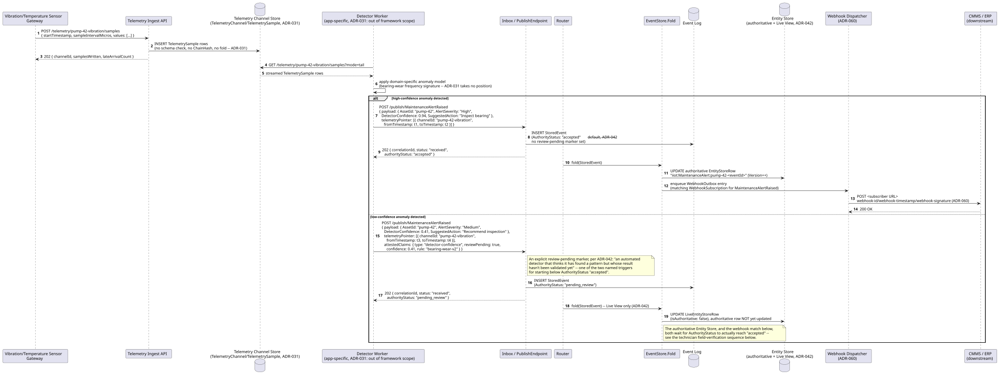

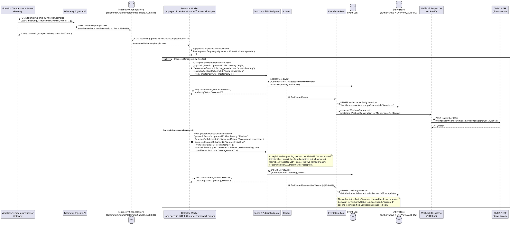

## Sequence diagram — technician field-verification and channel-lag detection

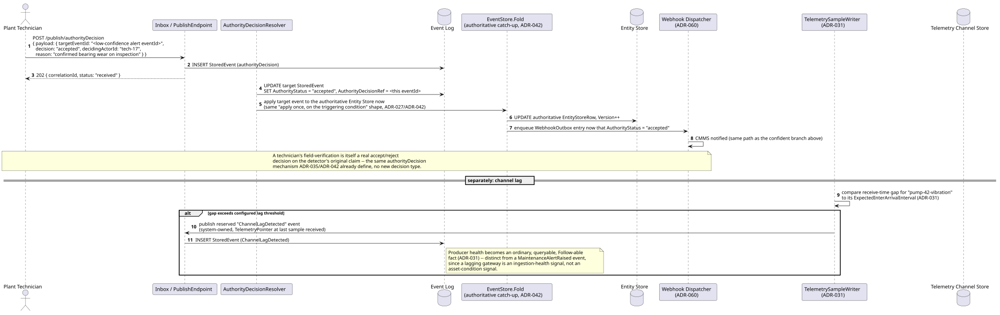

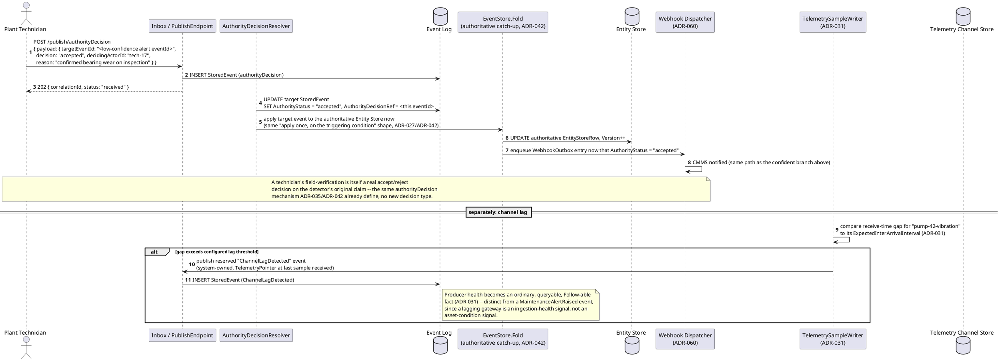

## Data model (ER diagram)

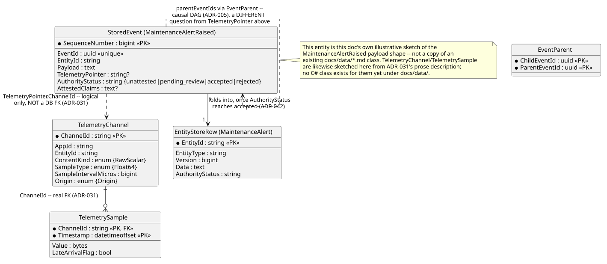

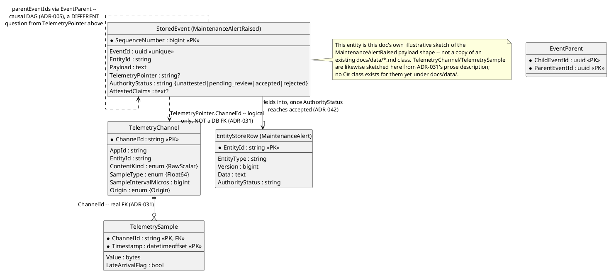

```csharp
// This doc's own illustrative sketch -- ADR-031 describes TelemetryChannel/
// TelemetrySample fields in prose only; no docs/data/*.md class exists yet
// for the streaming-channel entities, unlike StoredEvent/EntityStoreRow below.
public class TelemetryChannel
{
    public string ChannelId { get; set; } = default!;   // PK
    public string AppId { get; set; } = default!;         // ADR-030
    public string EntityId { get; set; } = default!;      // {appId}:{entityType}:{uniqueId} -- ADR-021, ADR-031
    public string ContentKind { get; set; } = "RawScalar"; // RawScalar for vibration/temperature/pressure (ADR-031)
    public string SampleType { get; set; } = "Float64";
    public long SampleIntervalMicros { get; set; }         // fixed-rate channel (ADR-031)
    public string Origin { get; set; } = "Origin";         // Origin | Derived (ADR-031) -- always Origin in this doc
}

public class TelemetrySample
{
    public string ChannelId { get; set; } = default!;     // PK, FK -> TelemetryChannel
    public DateTimeOffset Timestamp { get; set; }           // PK
    public double Value { get; set; }                       // raw scalar reading
    public bool LateArrivalFlag { get; set; }                // ADR-029's high-water-mark check, reused per-channel (ADR-031)
}

// MaintenanceAlertRaised's Payload shape -- domain-specific fields inside the
// StoredEvent envelope already defined in ../../../data/event-log.md; only
// the payload-specific properties are sketched here.
public class MaintenanceAlertRaisedPayload
{
    public string AssetId { get; set; } = default!;        // resolves EntityId via EntityIdField "$.AssetId" (ADR-021)
    public string AlertSeverity { get; set; } = default!;   // e.g. "Low" | "Medium" | "High"
    public double DetectorConfidence { get; set; }          // detector's own confidence score -- app-specific, not a framework field
    public string SuggestedAction { get; set; } = default!;
}
```

Full envelope column lists (`TelemetryPointer`, `AuthorityStatus`,
`AttestedClaims`, `EventParent`) are in
[`../../../data/event-log.md`](../../../data/event-log.md); the
authoritative/`LiveEntityStoreRow` split is in
[`../../../data/entity-store.md`](../../../data/entity-store.md) — this
diagram shows only what this doc's own scenarios touch.

## State machine — `MaintenanceAlertRaised` lifecycle


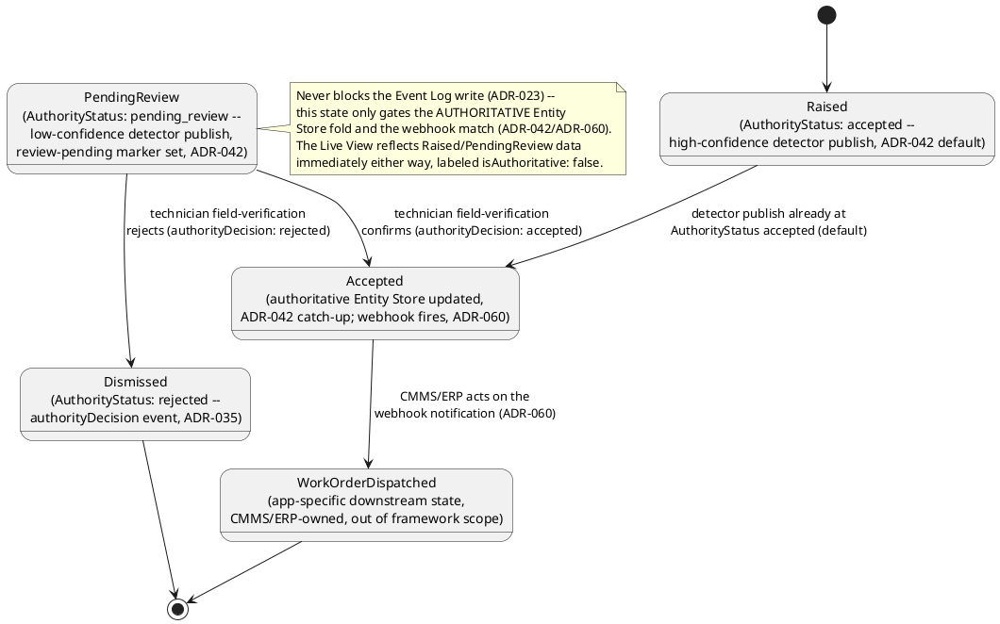

`WorkOrderDispatched` is deliberately drawn as an application-owned state,
not a framework one — this design has no work-order/CMMS entity of its
own; a real deployment's CMMS integration would publish its own event
type (e.g. `WorkOrderCreated`, optionally `parentEventIds`-linked back to
this alert, `ADR-005`) once it acts on the webhook, but that event type
isn't designed here.

## Salt (UI mockup) — detection-to-dispatch flow, across the operator's queue, technician's field-verification, and confirmed-record screens

### Screen 1: Plant operator dashboard — maintenance-alert queue across assets

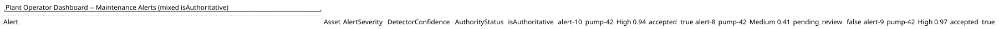

```plantuml
@startsalt
{
  { "Plant Operator Dashboard -- Maintenance Alerts  (mixed isAuthoritative)" }
  ..
  | Alert    | Asset   | AlertSeverity | DetectorConfidence | AuthorityStatus | isAuthoritative |
  | alert-10 | pump-42 | High          | 0.94               | accepted        | true            |
  | alert-8  | pump-42 | Medium        | 0.41               | pending_review  | false           |
  | alert-9  | pump-42 | High          | 0.97               | accepted        | true            |
}
@endsalt
```

`alert-10`/`alert-9` are high-confidence detector publishes, already
`accepted` by `ADR-042`'s default and read here from the authoritative
`EntityStoreRow`. `alert-8` is the low-confidence branch from the first
sequence diagram above — visible only via `LiveEntityStoreRow`, wrapped
`isAuthoritative: false`, and would not appear at all if this screen
only read the authoritative store. Clicking `alert-8` opens Screen 2,
the technician's field-verification screen for that one pending alert;
clicking an already-`accepted` row like `alert-10` instead skips
straight to Screen 3, since no decision is outstanding.

### Screen 2: Technician's field-verification screen

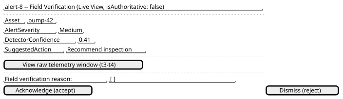

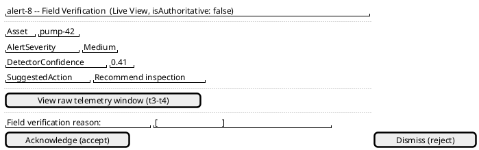

"View raw telemetry window" resolves the alert's own `TelemetryPointer`
(`{ ChannelId: "pump-42-vibration", FromTimestamp: t3, ToTimestamp: t4
}`) — the same deep-link mechanism `ADR-031` defines, applied to this
`RawScalar` channel's tail/replay read path (`streaming-channels.md`).
Clicking **Acknowledge** publishes the technician's own
`authorityDecision` with `decision: "accepted"` (e.g. "confirmed bearing
wear on inspection") and moves the flow to Screen 3. **Dismiss**
publishes `decision: "rejected"` instead — the alert never reaches
Screen 3 at all, staying visible only on Screen 1, re-labeled
`Dismissed`, never deleted.

### Screen 3: Confirmed record, notified downstream

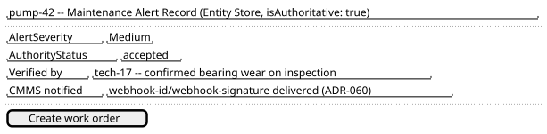

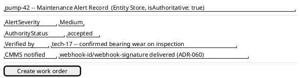

Reached either directly from Screen 1 (a high-confidence alert, already
`accepted` at publish) or from Screen 2's **Acknowledge** — either path
folds into the authoritative `EntityStoreRow` and enqueues a
`WebhookOutbox` entry once `AuthorityStatus` reaches `accepted`
(`ADR-060`), notifying the downstream CMMS. **Create work order** is the
application-specific action `WorkOrderDispatched`'s state-machine note
names: a real CMMS integration would publish its own `WorkOrderCreated`
event here, optionally `parentEventIds`-linked back to this alert
(`ADR-005`) — that event type isn't designed in this doc.

## Gherkin

```gherkin
Feature: Sensor-Driven Maintenance Alert
  As a plant operator relying on continuous equipment telemetry
  I want a detector process to raise a maintenance alert that points back
  into the exact raw signal window that triggered it
  So that a high-confidence alert acts immediately, a low-confidence one
  waits for a technician's field-verification before becoming authoritative,
  and a downstream CMMS/ERP system is notified once it is

  # Every request in this file carries a Bearer token with sufficient scope
  # (telemetry:ingest for sample ingestion, telemetry:read for tail/replay,
  # events:publish for the detector's/technician's published events) unless
  # a scenario says otherwise. See ../../../features/auth.md for
  # authentication/authorization behavior itself. This doc's detector is an
  # application process, not a framework mechanism (ADR-031) -- and NOT an
  # ADR-007 derived-event-type registration, which does not exist as a real
  # mechanism (ADR-007 is Deferred).

  Background:
    Given the entity "iiot:Asset:pump-42" exists (ADR-021)
    And a "RawScalar" TelemetryChannel "pump-42-vibration" is registered for entity "iiot:Asset:pump-42"
      with SampleType "Float64", SampleIntervalMicros 2000, Origin "Origin"
    And the event type "MaintenanceAlertRaised" version 1 is registered with schema:
      """
      {
        "type": "object",
        "properties": {
          "AssetId": { "type": "string" },
          "AlertSeverity": { "type": "string" },
          "DetectorConfidence": { "type": "number" },
          "SuggestedAction": { "type": "string" }
        },
        "required": ["AssetId", "AlertSeverity", "DetectorConfidence"]
      }
      """
      with EntityIdField "$.AssetId"
    And the event type "authorityDecision" version 1 is registered with EntityIdField "$.targetEventId"
    And a "WebhookSubscription" is registered for AppId "iiot" on event type "MaintenanceAlertRaised" targeting the plant's CMMS endpoint

  Scenario: A high-confidence detector publish lands accepted immediately
    Given channel "pump-42-vibration" has samples spanning "2026-07-30T09:00:00Z" to "2026-07-30T09:00:05Z"
    And a detector tailing channel "pump-42-vibration" (mode=tail) detects a bearing-wear signature with confidence 0.94
    When the detector POSTs to "/publish/MaintenanceAlertRaised" with body:
      """
      { "payload": { "AssetId": "pump-42", "AlertSeverity": "High", "DetectorConfidence": 0.94, "SuggestedAction": "Inspect bearing" },
        "telemetryPointer": [{ "channelId": "pump-42-vibration", "fromTimestamp": "2026-07-30T09:00:00Z", "toTimestamp": "2026-07-30T09:00:05Z" }] }
      """
    Then the response status should be 202
    And the response body should include "authorityStatus": "accepted"
    And the stored event's TelemetryPointer should reference channel "pump-42-vibration" from "2026-07-30T09:00:00Z" to "2026-07-30T09:00:05Z"
    And eventually the authoritative EntityStoreRow for the resulting MaintenanceAlert entity should reflect AlertSeverity "High"
    # No review-pending marker was set -- AuthorityStatus defaults to "accepted" for an
    # ordinary already-authenticated publish (ADR-042); nothing here is an ADR-007
    # derived event, it is an ordinary publish carrying TelemetryPointer (ADR-031).

  Scenario: A low-confidence detector publish starts pending_review and does not yet reach the authoritative Entity Store
    Given channel "pump-42-vibration" has samples spanning "2026-07-30T10:00:00Z" to "2026-07-30T10:00:03Z"
    And a detector tailing channel "pump-42-vibration" detects a weak, uncertain signature with confidence 0.41
    When the detector POSTs to "/publish/MaintenanceAlertRaised" with body:
      """
      { "payload": { "AssetId": "pump-42", "AlertSeverity": "Medium", "DetectorConfidence": 0.41, "SuggestedAction": "Recommend inspection" },
        "telemetryPointer": [{ "channelId": "pump-42-vibration", "fromTimestamp": "2026-07-30T10:00:00Z", "toTimestamp": "2026-07-30T10:00:03Z" }],
        "attestedClaims": { "type": "detector-confidence", "reviewPending": true, "confidence": 0.41, "rule": "bearing-wear-v2" } }
      """
    Then the response status should be 202
    And the response body should include "authorityStatus": "pending_review"
    And querying the Live View for the resulting MaintenanceAlert entity should return AlertSeverity "Medium", wrapped with "isAuthoritative": false
    And querying the authoritative Entity Store for that entity should NOT yet reflect AlertSeverity "Medium"
    # The explicit review-pending marker (ADR-042's second named trigger: "an automated
    # detector that thinks it has found a pattern but whose result hasn't been
    # validated") is what starts this below "accepted" -- not the mere fact of being a detector.

  Scenario: A technician's field-verification accepts a pending alert, and the authoritative Entity Store catches up
    Given a "MaintenanceAlertRaised" event "alert-7" was published for "pump-42" with AlertSeverity "Medium" and AuthorityStatus "pending_review"
    When the technician POSTs to "/publish/authorityDecision" with body:
      """
      { "payload": { "targetEventId": "alert-7", "decision": "accepted", "decidingActorId": "tech-17", "reason": "confirmed bearing wear on inspection" } }
      """
    Then the response status should be 202
    And the stored event "alert-7" should have AuthorityStatus "accepted"
    And eventually the authoritative EntityStoreRow for "pump-42"'s alert should reflect AlertSeverity "Medium"
    # Same authorityDecision mechanism ADR-035/ADR-042 already define for any
    # detector-originated pending event -- no new decision type for this domain.

  Scenario: A technician's field-verification dismisses a pending alert, and it never reaches the authoritative Entity Store
    Given a "MaintenanceAlertRaised" event "alert-8" was published for "pump-42" with AlertSeverity "Medium" and AuthorityStatus "pending_review"
    When the technician POSTs to "/publish/authorityDecision" with body:
      """
      { "payload": { "targetEventId": "alert-8", "decision": "rejected", "decidingActorId": "tech-17", "reason": "false positive -- routine startup vibration" } }
      """
    Then the response status should be 202
    And the stored event "alert-8" should have AuthorityStatus "rejected"
    And the authoritative Entity Store row for "pump-42"'s alert should never reflect "alert-8"'s AlertSeverity
    And "alert-8" should remain visible in the Event Log and the Live View, labeled "rejected" -- never deleted

  Scenario: An accepted alert declares parentEventIds pointing at a prior related alert, distinct from its TelemetryPointer
    Given a "MaintenanceAlertRaised" event "alert-9" was previously accepted for "pump-42"
    And channel "pump-42-vibration" has samples spanning "2026-07-30T11:00:00Z" to "2026-07-30T11:00:02Z"
    When a detector POSTs to "/publish/MaintenanceAlertRaised" with body:
      """
      { "payload": { "AssetId": "pump-42", "AlertSeverity": "High", "DetectorConfidence": 0.97, "SuggestedAction": "Escalate to replacement" },
        "telemetryPointer": [{ "channelId": "pump-42-vibration", "fromTimestamp": "2026-07-30T11:00:00Z", "toTimestamp": "2026-07-30T11:00:02Z" }],
        "parentEventIds": ["alert-9"] }
      """
    Then the response status should be 202
    And the new event's EventParents should record "alert-9" as a parent
    And the new event's TelemetryPointer should independently reference channel "pump-42-vibration"
    # parentEventIds answers "what is this causally derived from" (ADR-005);
    # TelemetryPointer answers "where in the signal did this come from" (ADR-031) --
    # two distinct envelope fields, both present on the same event, never conflated.

  Scenario: A slow-uploading gateway triggers a system-owned ChannelLagDetected event, distinct from any MaintenanceAlertRaised
    Given channel "pump-42-vibration" has an ExpectedInterArrivalInterval matching its SampleIntervalMicros
    And the gap since channel "pump-42-vibration"'s last received batch already exceeds the configured lag threshold
    When the next batch for channel "pump-42-vibration" is finally received
    Then a system-owned "ChannelLagDetected" event should be published
    And that event's TelemetryPointer should reference the last sample actually received before the gap
    And no "MaintenanceAlertRaised" event should be published as a result of the lag itself
    # Producer/ingestion health (ChannelLagDetected, ADR-031) is a different
    # signal from asset condition (MaintenanceAlertRaised) -- the detector never
    # conflates a quiet gateway with a healthy asset.

  Scenario: An accepted alert notifies the downstream CMMS via a signed webhook delivery
    Given a "WebhookSubscription" is registered for event type "MaintenanceAlertRaised" targeting the plant's CMMS endpoint
    And a "MaintenanceAlertRaised" event "alert-10" reaches AuthorityStatus "accepted" for "pump-42"
    Then a WebhookOutbox entry should be enqueued for "alert-10" against that subscription
    And the delivered payload should carry "webhook-id", "webhook-timestamp", and "webhook-signature" headers (ADR-060)
    And the payload should be masked against the subscription's fixed claim set before delivery
    # At-least-once delivery, retried with backoff (ADR-060) -- the CMMS is
    # responsible for idempotent handling keyed on webhook-id, same as any
    # other Standard Webhooks consumer.
```
