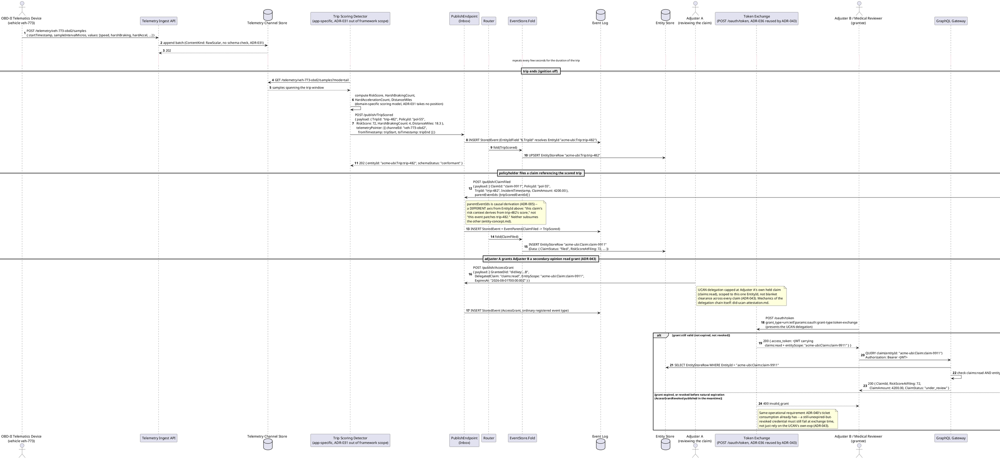
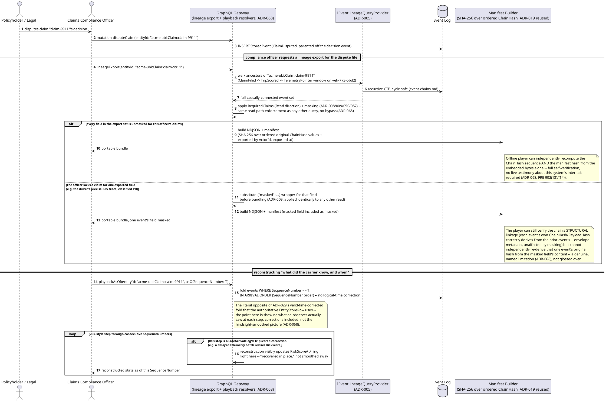
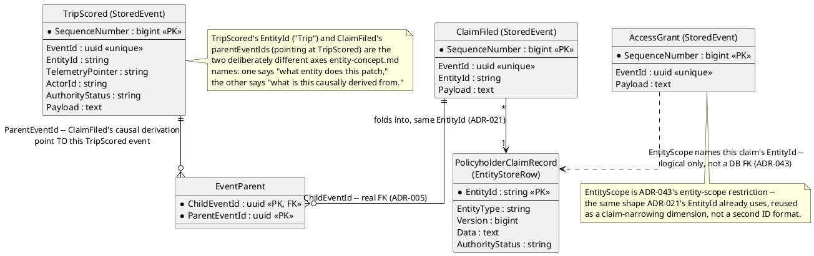
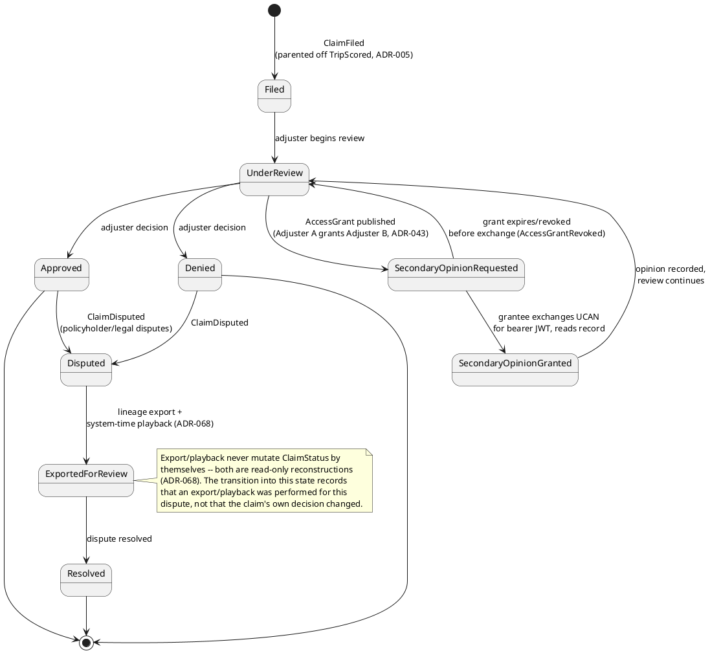
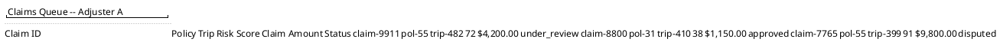
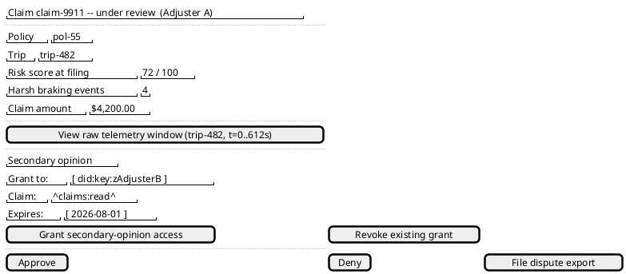
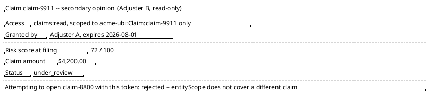
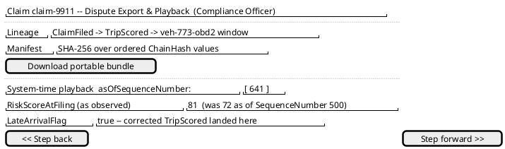

# Feature: Usage-Based Insurance Trip Scoring and Claim

Context: this domain's own [`README.md`](../README.md) ("Applicable ADRs")
lists `ADR-031` (streaming channels), `ADR-043`/`ADR-044` (delegated
"secondary opinion" access), `ADR-068` (bitemporal export/playback),
`ADR-005` (event lineage), and `ADR-035` (non-authoritative capture) as
applicable to exactly this kind of workflow — this doc works one concrete
use case through all five end to end: a vehicle's telematics device
streams driving-behavior samples (`ADR-031`), an application-level
detector scores a trip and publishes an ordinary domain event pointing at
the raw window it scored, a policyholder's claim causally derives from
that scored trip (`ADR-005`), a second adjuster gets capped, time-boxed
read access to weigh in (`ADR-043`), and a disputed claim is reconstructed
via lineage export and system-time playback (`ADR-068`) — the "what did
the carrier know, and when" mechanism this domain's `README.md` names
directly. Envelope field shapes referenced below (`TelemetryPointer`,
`parentEventIds`/`EventParent`, `ActorId`, `AttestedClaims`,
`AuthorityStatus`) are defined in
[`../../../data/event-log.md`](../../../data/event-log.md); the folded
projection shape (`EntityStoreRow`) is in
[`../../../data/entity-store.md`](../../../data/entity-store.md).

This doc deliberately does **not** re-derive:
- Telemetry batch ingestion, `mode=tail`/`mode=replay`, or the
  `ChannelLagDetected`/late-arrival-flagging mechanics for a channel
  itself — those are `ADR-031`, worked through end-to-end in
  [`../../../features/streaming-channels.md`](../../../features/streaming-channels.md).
  This doc only adds a domain-specific detector on top (the Trip Scoring
  detector) and the `TripScored` event it publishes.
- `parentEventIds`/lineage traversal mechanics (cycle safety,
  `ParentValidationMode`, the recursive-CTE query shape) — those are
  `ADR-005`, in
  [`../../../features/event-chains.md`](../../../features/event-chains.md).
  This doc only names which events are parented off which.
- UCAN/DID token-exchange mechanics themselves (how a DID is verified, how
  a delegation chain is validated, the `POST /oauth/token` grant-type
  shape) — those are `ADR-036`, in
  [`../../../features/did-ucan-attestation.md`](../../../features/did-ucan-attestation.md).
  This doc only shows `ADR-043`'s reuse of that mechanism for a
  peer-granted, entity-scoped, capped read grant.
- `ADR-019`'s hash-chain mechanics (`ChainHash`/`PayloadHash` derivation)
  or `ADR-029`'s fold-ordering/late-arrival rule themselves — both are
  covered in [`../../../data/event-log.md`](../../../data/event-log.md)
  and [`../../../data/entity-store.md`](../../../data/entity-store.md).
  This doc only exercises the *consequence* of both: a system-time
  playback that shows a `LateArrivalFlag`'d correction landing in place,
  the opposite of the Entity Store's valid-time-corrected fold.
- `AuthorityStatus`'s general non-authoritative-capture review workflow —
  that's `ADR-035`, in
  [`../../../features/non-authoritative-capture.md`](../../../features/non-authoritative-capture.md).
  This doc only shows one instance of it: a self-reported driving incident
  starting `pending_review` rather than `accepted`.
- Entity Store fold/`ExpectedVersion`/`ChangeKind` merge mechanics
  themselves — those are `ADR-021`/`ADR-022`/`ADR-024`, in
  [`../../../features/entity-concept.md`](../../../features/entity-concept.md).

All examples below use `AppId` `"acme-ubi"` (a hypothetical carrier's
usage-based-insurance application) throughout.

## Sequence diagram — trip telemetry to a scored trip to a filed claim, with a delegated secondary-opinion grant



## Sequence diagram — claims dispute: lineage export and bitemporal system-time playback



## Data model (ER diagram)



Full `StoredEvent`/`EntityStoreRow` column lists are in
[`../../../data/event-log.md`](../../../data/event-log.md) and
[`../../../data/entity-store.md`](../../../data/entity-store.md); this
diagram shows only the domain-specific payload shape and the two lineage
relationships (`EntityId` fold target vs. `parentEventIds` causal
derivation) this doc's scenarios actually exercise.

Matching C# sketch (payload/`Data` shapes only — the envelope fields
around them are `StoredEvent`/`EntityStoreRow` themselves, unchanged):

```csharp
public class TripScoredPayload
{
    public string TripId { get; set; } = default!;       // EntityIdField "$.TripId" resolves EntityId "acme-ubi:Trip:{TripId}" (ADR-021)
    public string PolicyId { get; set; } = default!;
    public string VehicleId { get; set; } = default!;
    public double RiskScore { get; set; }                 // detector-computed, application logic (ADR-031 -- out of framework scope)
    public int HarshBrakingCount { get; set; }
    public int HardAccelerationCount { get; set; }
    public double DistanceMiles { get; set; }
    // TelemetryPointer { ChannelId, FromTimestamp, ToTimestamp } travels as
    // envelope metadata on StoredEvent, NOT as a payload field (ADR-031) --
    // spans the whole trip window this score was computed from.
}

public class ClaimFiledPayload
{
    public string ClaimId { get; set; } = default!;       // EntityIdField "$.ClaimId" resolves EntityId "acme-ubi:Claim:{ClaimId}"
    public string PolicyId { get; set; } = default!;
    public string TripId { get; set; } = default!;         // denormalized reference for query convenience -- the REAL causal
                                                             // link is parentEventIds -> the TripScored EventId (ADR-005),
                                                             // not this string field
    public DateTimeOffset IncidentTimestamp { get; set; }
    public decimal ClaimAmount { get; set; }
    public string? Description { get; set; }
}

public class PolicyholderClaimRecordData
{
    // EntityStoreRow.Data shape for EntityId "acme-ubi:Claim:{ClaimId}" (ADR-021)
    public string ClaimId { get; set; } = default!;
    public string PolicyId { get; set; } = default!;
    public string TripId { get; set; } = default!;
    public double RiskScoreAtFiling { get; set; }          // copied in at fold time from the parented TripScored event
    public decimal ClaimAmount { get; set; }
    public string ClaimStatus { get; set; } = default!;    // filed | under_review | secondary_opinion_requested |
                                                             // secondary_opinion_granted | approved | denied |
                                                             // disputed | exported_for_review | resolved
}

public class AccessGrantPayload
{
    public string GranteeDid { get; set; } = default!;     // the grantee's DID (ADR-036), NOT a local user id
    public string DelegatedClaim { get; set; } = default!; // e.g. "claims:read" -- capped at what the granter (ActorId) already holds
    public string EntityScope { get; set; } = default!;    // one specific EntityId, e.g. "acme-ubi:Claim:claim-9911" (ADR-043)
    public DateTimeOffset ExpiresAt { get; set; }
    public string? Reason { get; set; }                     // e.g. "secondary opinion -- medical reviewer"
}

public class AccessGrantRevokedPayload
{
    public Guid GrantEventId { get; set; }                  // the AccessGrant EventId being revoked
    public string? RevokedReason { get; set; }
}
```

## State machine — claim lifecycle



## Salt (UI mockup) — trip-to-claim review flow, across the adjuster's queue, decision, delegated-read, and dispute-playback screens

### Screen 1: Adjuster A's claim queue



Every row is `PolicyholderClaimRecord` data folded from a `ClaimFiled`
event; `RiskScoreAtFiling` was copied in at fold time from the parented
`TripScored` event (`ADR-005`), not joined live against telemetry by
this screen. Clicking the `claim-9911` row opens Screen 2, the same
claim Adjuster A is reviewing in the first sequence diagram above.

### Screen 2: Adjuster A's claim review and decision screen



"View raw telemetry window" resolves to the `TripScored` event's
`TelemetryPointer` — the same `{ChannelId, FromTimestamp, ToTimestamp}`
window `streaming-channels.md`'s deep-linking/Media-Fragments-URI
mechanism already serves (`ADR-031`); this screen doesn't reimplement
that lookup, it just links to it. "Grant secondary-opinion access"
publishes the `AccessGrant` event from the first sequence diagram,
entity-scoped to exactly `acme-ubi:Claim:claim-9911` — it doesn't itself
change `ClaimStatus`, but it's what makes Screen 3 reachable, by a
different actor, once that actor exchanges the grant. "File dispute
export" is the entry point into Screen 4.

### Screen 3: Adjuster B's delegated, entity-scoped secondary-opinion read



Reached only after Adjuster B exchanges the UCAN delegation for a bearer
JWT via token-exchange (`ADR-036`, reused by `ADR-043`) — this screen is
literally what the gateway's entity-scope check in the first sequence
diagram returns, nothing more. Unlike Screen 2, there is no
approve/deny/grant control here: the grant is `claims:read` only. The
claim's `SecondaryOpinionGranted → UnderReview` transition (state
machine above) happens off-screen once the opinion is communicated back
to Adjuster A — this doc doesn't define a separate "record opinion"
event — and review continues back on Screen 2.

### Screen 4: Compliance officer's dispute export and system-time playback



Reached from Screen 2's "File dispute export," this dramatizes the
second sequence diagram directly: "Download portable bundle" builds the
NDJSON export with the self-verifying manifest hash (masking substituted
for any field the officer lacks a claim for, per `ADR-009`, same as any
other read); the playback slider steps through `SequenceNumber`s in
arrival order rather than the valid-time-corrected view, so stepping
from `501` to `641` visibly shows the `LateArrivalFlag`'d correction
landing in place — the one view where the earlier, since-corrected
`RiskScore` of `72` is ever shown at all (`ADR-068`).

## Gherkin

```gherkin
Feature: Usage-Based Insurance Trip Scoring and Claim
  As an insurance carrier running a usage-based-insurance program
  I want driving-behavior telemetry to accumulate into a scored trip,
  a claim to reference that scored history, a second reviewer to weigh in
  under a capped delegated grant, and a disputed claim to be reconstructable
  exactly as the carrier saw it at the time
  So that pricing/claims decisions are auditable end to end and a dispute
  can be answered with "what did we know, and when" rather than guesswork

  # Every request in this file carries a Bearer token with sufficient scope
  # (telemetry:ingest/telemetry:read, events:publish, claims:read) unless a
  # scenario says otherwise. See auth.md and did-ucan-attestation.md for
  # authentication/authorization mechanics themselves. AppId "acme-ubi"
  # throughout.

  Background:
    Given the event type "TripScored" version 1 is registered with EntityIdField "$.TripId" and schema:
      """
      {
        "type": "object",
        "properties": {
          "TripId": { "type": "string" }, "PolicyId": { "type": "string" },
          "VehicleId": { "type": "string" }, "RiskScore": { "type": "number" },
          "HarshBrakingCount": { "type": "integer" }, "DistanceMiles": { "type": "number" }
        },
        "required": ["TripId", "PolicyId", "RiskScore"]
      }
      """
    And the event type "ClaimFiled" version 1 is registered with EntityIdField "$.ClaimId" and ParentValidationMode "Strict" and schema:
      """
      {
        "type": "object",
        "properties": {
          "ClaimId": { "type": "string" }, "PolicyId": { "type": "string" },
          "TripId": { "type": "string" }, "IncidentTimestamp": { "type": "string" },
          "ClaimAmount": { "type": "number" }
        },
        "required": ["ClaimId", "PolicyId", "TripId", "ClaimAmount"]
      }
      """
    And the event type "AccessGrant" version 1 is registered with schema:
      """
      {
        "type": "object",
        "properties": {
          "GranteeDid": { "type": "string" }, "DelegatedClaim": { "type": "string" },
          "EntityScope": { "type": "string" }, "ExpiresAt": { "type": "string" }
        },
        "required": ["GranteeDid", "DelegatedClaim", "EntityScope", "ExpiresAt"]
      }
      """
    And a "RawScalar" TelemetryChannel "veh-773-obd2" is registered for entity "acme-ubi:Vehicle:veh-773"

  Scenario: Driving-behavior telemetry accumulates and a trip is scored
    Given channel "veh-773-obd2" has ingested samples spanning "2026-07-29T08:00:00Z" to "2026-07-29T08:10:12Z"
    When the Trip Scoring Detector tails channel "veh-773-obd2" and computes a score for that window
    And it POSTs to "/publish/TripScored" with body:
      """
      { "payload": { "TripId": "trip-482", "PolicyId": "pol-55", "VehicleId": "veh-773",
          "RiskScore": 72, "HarshBrakingCount": 4, "DistanceMiles": 18.3 },
        "telemetryPointer": [{ "channelId": "veh-773-obd2",
          "fromTimestamp": "2026-07-29T08:00:00Z", "toTimestamp": "2026-07-29T08:10:12Z" }] }
      """
    Then the response status should be 202
    And an EntityStoreRow for "acme-ubi:Trip:trip-482" should exist with RiskScore 72
    And the stored event's TelemetryPointer should span the full trip window

  Scenario: A claim is filed referencing the scored trip via causal lineage, not just a denormalized field
    Given a "TripScored" event "trip-scored-1" was published and folded for trip "trip-482" with RiskScore 72
    When I POST to "/publish/ClaimFiled" with body:
      """
      { "payload": { "ClaimId": "claim-9911", "PolicyId": "pol-55", "TripId": "trip-482",
          "IncidentTimestamp": "2026-07-29T08:07:00Z", "ClaimAmount": 4200.00 },
        "parentEventIds": ["trip-scored-1"] }
      """
    Then the response status should be 202
    And an EntityStoreRow for "acme-ubi:Claim:claim-9911" should exist with RiskScoreAtFiling 72 and ClaimStatus "filed"
    And the stored event's parents should be exactly ["trip-scored-1"]
    # EntityId ("Claim:claim-9911") and parentEventIds (pointing at trip-scored-1) are
    # deliberately different axes -- ADR-021's fold target vs. ADR-005's causal derivation.

  Scenario: A self-reported driving incident is captured non-authoritatively pending review
    Given claim "claim-9911" exists at ClaimStatus "under_review"
    When the policyholder self-reports an additional incident detail via a self-attested submission
    Then the resulting event's AuthorityStatus should be "pending_review", not "accepted"
    And it should not yet affect claim "claim-9911"'s authoritative EntityStoreRow
    # Contrast with the telemetry-derived TripScored event above, whose AuthorityStatus
    # defaults to "accepted" -- an ordinary authenticated publish already verified by ADR-006
    # (non-authoritative-capture.md covers the general review workflow this instantiates).

  Scenario: An adjuster grants a colleague delegated, entity-scoped secondary-opinion access
    Given Adjuster A holds the claim "claims:read"
    And claim "claim-9911" is at ClaimStatus "under_review"
    When Adjuster A POSTs to "/publish/AccessGrant" with body:
      """
      { "payload": { "GranteeDid": "did:key:zAdjusterB", "DelegatedClaim": "claims:read",
          "EntityScope": "acme-ubi:Claim:claim-9911", "ExpiresAt": "2026-08-01T00:00:00Z" } }
      """
    Then the response status should be 202
    And the grant should be capped at exactly what Adjuster A already holds (ADR-043's UCAN invariant)
    And the grant should be restricted to EntityScope "acme-ubi:Claim:claim-9911" only, not every claim

  Scenario: The grantee exchanges the delegated grant for a bearer JWT and reads the claim record
    Given a valid, unexpired AccessGrant exists naming grantee DID "did:key:zAdjusterB", claim "claims:read", and EntityScope "acme-ubi:Claim:claim-9911"
    When Adjuster B POSTs to "/oauth/token" with grant_type "urn:ietf:params:oauth:grant-type:token-exchange" presenting that grant
    Then the response status should be 200 with an access token carrying "claims:read" and entityScope "acme-ubi:Claim:claim-9911"
    When Adjuster B queries claim(entityId: "acme-ubi:Claim:claim-9911") with that token
    Then the response status should be 200 with the claim's RiskScoreAtFiling and ClaimAmount
    When Adjuster B queries claim(entityId: "acme-ubi:Claim:claim-8800") with that same token
    Then the response should be rejected -- the token's entityScope does not cover a different claim

  Scenario: An expired or revoked grant fails token exchange, even before its stated expiration
    Given an AccessGrant naming grantee DID "did:key:zAdjusterB" was published for claim "claim-9911"
    And an "AccessGrantRevoked" event was published for that grant before Adjuster B exchanged it
    When Adjuster B POSTs to "/oauth/token" presenting that (now-revoked) grant
    Then the response status should be 400 with error "invalid_grant"
    # Same operational requirement ADR-040's ticket consumption already has -- revocation
    # must be checked at exchange time, not just the UCAN's own unexpired `exp` claim.

  Scenario: A disputed claim triggers a lineage export with a self-verifying manifest hash
    Given claim "claim-9911" was Approved and is now Disputed
    When the compliance officer requests a lineageExport for entityId "acme-ubi:Claim:claim-9911"
    Then the export should include the full causally-connected chain: "ClaimFiled" -> "TripScored" -> the referenced TelemetryPointer window on "veh-773-obd2"
    And the export bundle should include a manifest with a SHA-256 hash over the ordered ChainHash values
    And the export should carry no privilege beyond what the officer could already read live (ADR-068's no-bypass rule)

  Scenario: A masked field in the export limits independent re-verification to structural chain linkage only
    Given claim "claim-9911"'s lineage includes a field the compliance officer lacks a claim for
    When the compliance officer requests a lineageExport for entityId "acme-ubi:Claim:claim-9911"
    Then that field should be substituted with a masked wrapper in the exported bundle, same as any other read
    And the offline player loading that bundle should report full chain-linkage verification
    But it should NOT report an exact re-derivation of that one event's original hash from the masked content
    # A genuine, named limitation (ADR-068) -- ChainHash/PayloadHash were computed once,
    # at original publish time, over the real bytes; the masked wrapper isn't those bytes.

  Scenario: System-time playback shows a late-arriving telemetry correction landing in place
    Given "TripScored" for trip "trip-482" originally folded with RiskScore 72 at SequenceNumber 500
    And a delayed telemetry batch later causes a corrected "TripScored" event at SequenceNumber 640, flagged LateArrivalFlag true, revising RiskScore to 81
    When the compliance officer requests playbackAsOf for claim "claim-9911" asOfSequenceNumber 501
    Then the reconstruction at that point should show RiskScore 72, exactly as originally shown
    When the compliance officer advances playback to asOfSequenceNumber 641
    Then the reconstruction should show RiskScore 81, with the correction visibly landing at that exact step
    And the authoritative EntityStoreRow (valid-time-corrected, ADR-029) should have shown RiskScore 81 all along,
      never 72 -- system-time playback is the only view that ever shows the earlier, since-corrected value
```
