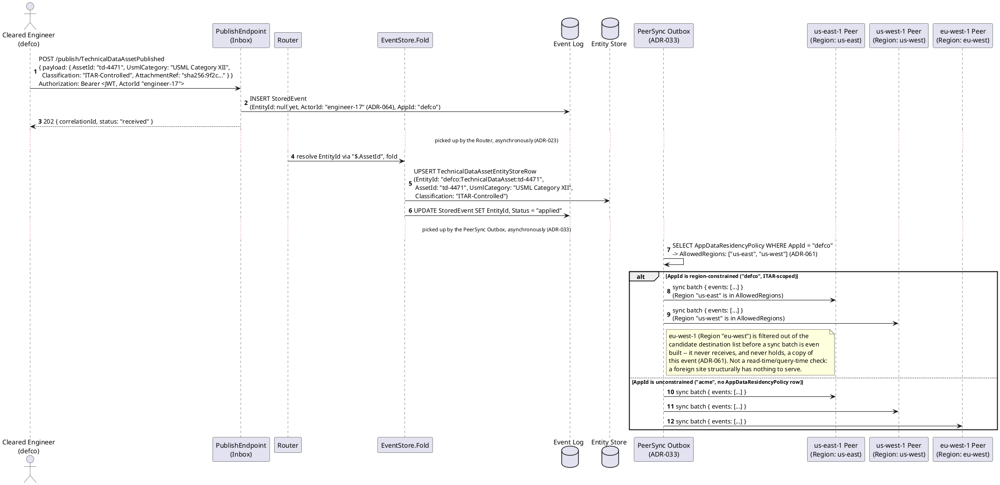
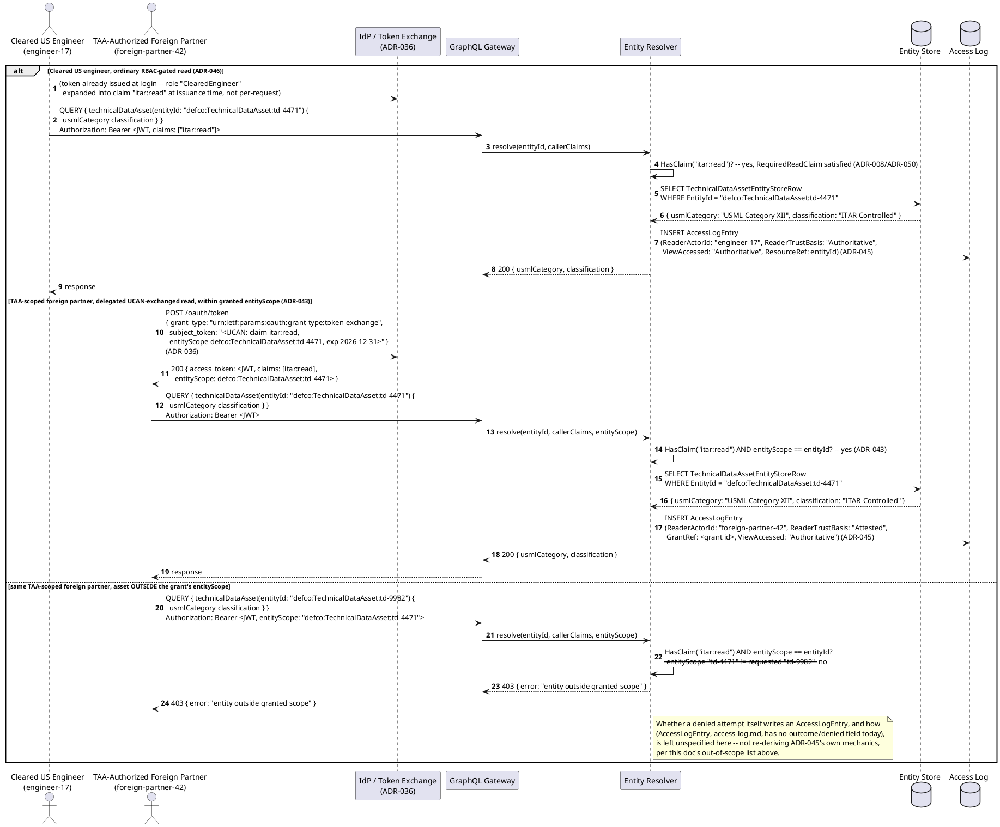
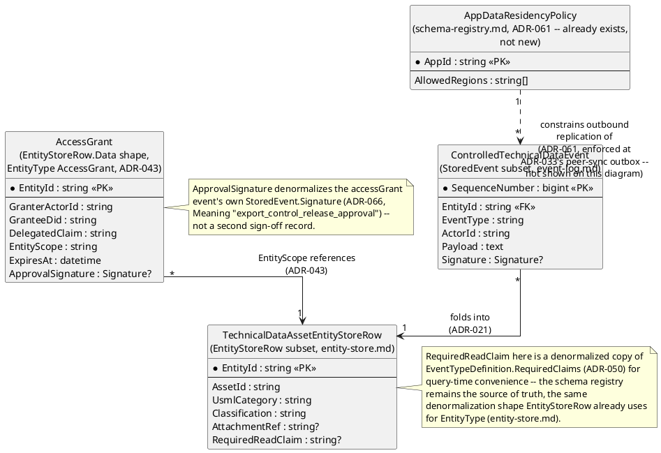
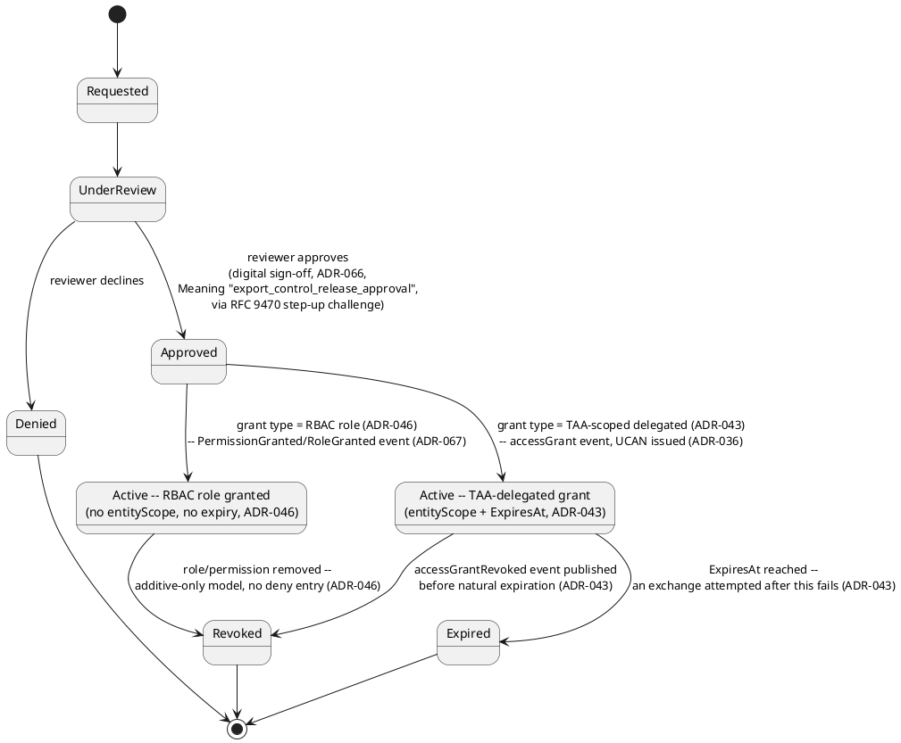
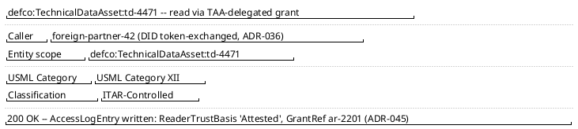

# Feature: Controlled Technical Data Access Request

Context: exercises `ADR-061` (data residency/region-pinning — this
domain's *defining* mechanism per [`../README.md`](../README.md)'s
Applicable ADRs section), `ADR-046` (RBAC — role-to-permission
expansion at token issuance), `ADR-043` (delegated, capped, entity-
scoped UCAN grants — the Technical Assistance Agreement exception),
`ADR-045` (read access audit log), `ADR-066` (digital sign-off / RFC
9470 step-up, for the export-control release approval that issues a
delegated grant), `ADR-032` (binary attachments — the technical data
itself is largely attachment-shaped content, per this domain's
Overview), and `ADR-005` (event lineage — a derived/redacted
technical-data artifact traces causally to its controlled source).
Entity/event shapes referenced below are defined in
[`../../../data/event-log.md`](../../../data/event-log.md)
(`StoredEvent`, `Signature`),
[`../../../data/entity-store.md`](../../../data/entity-store.md)
(`EntityStoreRow`),
[`../../../data/schema-registry.md`](../../../data/schema-registry.md)
(`AppDataResidencyPolicy`, `Role`), and
[`../../../data/access-log.md`](../../../data/access-log.md)
(`AccessLogEntry`) — this doc shows only the columns its own scenarios
touch, not full column lists.

This doc deliberately does **not** re-derive:
- `ADR-061`'s region-pinning mechanics in general (peer `Region`
  tagging, `ADR-051`'s `SeedPeers`, the outbox filtering rule itself as
  a general mechanism) — see `ADR-061` directly. This doc only shows
  that already-decided mechanism applying to one ITAR-scoped `AppId`.
- UCAN/DID token-exchange mechanics in general (`ADR-036`) — see that
  ADR and `did-ucan-attestation.md`. This doc only shows the
  TAA-authorized foreign-partner exchange as one more use of an
  already-adopted mechanism, exactly the framing `ADR-043` itself uses.
- **Non-authoritative capture (`ADR-035`) — explicitly out of scope,
  not merely unused.** This domain's own `README.md` lists `ADR-035`
  as a **weak/no fit**: controlled technical data entering this system
  is typically already vetted through an export-control review process
  before ingestion, not organically pending the way a self-attested
  identity claim is. Every event in this doc's scenarios defaults to
  `AuthorityStatus: accepted` (`ADR-042`); no `pending_review`/Live-View
  mechanics appear anywhere below.
- `ADR-045`'s `AccessLogEntry` mechanics in general (its own hash
  chain, retention, which surfaces write to it) — see
  [`access-log.md`](../../../data/access-log.md). This doc only shows
  that every read here, ordinary or delegated, writes one.
- `ADR-009`/`ADR-050`'s masking-strategy machinery in general —
  `RequiredReadClaim` is used below exactly as those ADRs already
  define it, not redesigned.

## Sequence diagram — publishing a controlled technical-data asset and its region-pinned replication

Publish itself is unchanged in shape from
[`../../../features/entity-concept.md`](../../../features/entity-concept.md)'s
`202` response (`ADR-023`); what's new here is what happens once
`ADR-033`'s peer-sync outbox picks the event up for outbound gossip
replication. `AppId "defco"` (a fictional cleared defense contractor
tenant) is ITAR-scoped via an `AppDataResidencyPolicy` row restricting
it to `["us-east", "us-west"]`; `AppId "acme"` has no such row and
stays unconstrained, shown as the contrasting `else` branch.



## Sequence diagram — access request (RBAC read, TAA-delegated read, and a denied out-of-scope read)

Three genuinely different branches of the same GraphQL query
(`ADR-037`), reading the same `TechnicalDataAssetEntityStoreRow`: an
ordinary claim check for a cleared US engineer (`ADR-046`), a
delegated-grant claim-plus-entity-scope check for a TAA-authorized
foreign partner (`ADR-043`), and the same delegated grant failing when
the requested asset falls outside its `entityScope`.



## Data model (ER diagram)



Full column lists live in
[`../../../data/event-log.md`](../../../data/event-log.md),
[`../../../data/entity-store.md`](../../../data/entity-store.md), and
[`../../../data/schema-registry.md`](../../../data/schema-registry.md)
— this diagram shows only what this doc's scenarios touch.

## State machine — access request lifecycle

This models the *request* underlying an `AccessGrant` (`ADR-043`) —
the workflow a TAA-authorized foreign partner (or, equally, an internal
requester asking for a new RBAC role) goes through before an
`AccessGrant`/role assignment exists — not the technical-data asset's
own entity lifecycle, which is the ordinary Entity Store fold already
covered by
[`../../../features/entity-concept.md`](../../../features/entity-concept.md).



## Salt (UI mockup) — request-to-read user flow, across the approver's queue, decision, and delegated-read screens

### Screen 1: Access Request Queue — AppId defco

```plantuml
@startsalt
{
  { "Access Request Queue -- AppId: defco" }
  ..
  | Request ID | Asset ID | Requester             | Grant Type    | Status      |
  | ar-2201    | td-4471  | "foreign-partner-42"  | TAA-delegated | UnderReview |
  | ar-2198    | td-4471  | "engineer-22"          | RBAC role     | Approved    |
  | ar-2190    | td-9982  | "foreign-partner-42"  | TAA-delegated | Denied      |
}
@endsalt
```



Each row is one position in the *Access Request Lifecycle* state machine
above (`Requested`/`UnderReview`/`Approved`/`Denied`) — this queue is what
a cleared engineer holding `itar:read` (`ADR-046`) works from, not a
read of `TechnicalDataAssetEntityStoreRow` itself. Clicking `ar-2201`
opens Screen 2, the pending TAA-delegated request's own approval detail.

### Screen 2: Approver's review and sign-off screen

```plantuml
@startsalt
{
  { "Access Request  ar-2201  --  defco:TechnicalDataAsset:td-4471" }
  ..
  | Field            | Value                                    |
  | Asset ID         | "td-4471"                                 |
  | USML Category    | "USML Category XII"                       |
  | Classification   | "ITAR-Controlled"                          |
  | Requester        | "M. Dubois  (foreign-partner-42)"          |
  | Asserted region  | "France"   ( not a US Person )             |
  | Grant type       | () RBAC role   (X) TAA-delegated           |
  | TAA reference    | "TAA-2026-0417"                            |
  | Delegated claim  | "itar:read"                                |
  | Entity scope     | "defco:TechnicalDataAsset:td-4471"         |
  | Expires          | "2026-12-31"                               |
  ..
  { "Digital sign-off required (ADR-066, RFC 9470 step-up)" | [Re-authenticate & Approve] }
  ..
  [Approve] | [Deny]
}
@endsalt
```



Every field above is a read of `TechnicalDataAssetEntityStoreRow` plus
the pending request/grant fields (`AssetId`/`UsmlCategory`/
`Classification` from the asset row, `GranteeDid`/`DelegatedClaim`/
`EntityScope`/`ExpiresAt` from the request-in-progress) — no new storage
for the screen itself. `Approve` triggers the `ADR-066` step-up challenge
inline, per the state machine above, then publishes the `accessGrant`
event that moves this request to `ActiveTaa`; UCAN issuance and exchange
happen next, out of frame, before Screen 3. `Deny` transitions straight
to `Denied` with no sign-off required, since a denial grants no new
access, and never reaches Screen 3.

### Screen 3: Foreign partner's delegated read, within granted scope



This is the second sequence diagram's TAA-scoped branch, dramatized: once
`foreign-partner-42` exchanges the UCAN issued by Screen 2's approval for
a bearer JWT, the same `GraphQL Gateway`/`Entity Resolver` path a cleared
US engineer uses returns this asset's data because `HasClaim("itar:read")
AND entityScope == entityId` holds (`ADR-043`). The same query against
`td-9982` — outside `ar-2201`'s `entityScope` — never reaches this screen
at all; it returns `403` instead, exactly as this doc's second sequence
diagram's third branch shows.

## Gherkin

```gherkin
Feature: Controlled Technical Data Access Request
  As the platform hosting export-controlled defense technical data
  I want technical-data-asset events to stay region-pinned to US-tagged peers, and every read gated by RBAC or a TAA-scoped delegated grant
  So that ITAR/EAR's US-persons/US-soil restriction (22 CFR 120-130 / 15 CFR 730-774) is enforced structurally, not just by policy

  Background:
    Given the event type "TechnicalDataAssetPublished" version 1 is registered with ChangeKind "Full", EntityIdField "$.AssetId", and RequiredClaims [{ "Direction": "Read", "Claim": "itar:read" }] (denormalized as RequiredReadClaim on the folded entity, see the ER diagram note below):
      """
      {
        "type": "object",
        "properties": {
          "AssetId": { "type": "string" },
          "UsmlCategory": { "type": "string" },
          "Classification": { "type": "string" },
          "AttachmentRef": { "type": "string" }
        },
        "required": ["AssetId", "UsmlCategory", "Classification"]
      }
      """
    And AppId "defco" has an AppDataResidencyPolicy with AllowedRegions ["us-east", "us-west"] (ADR-061)
    And AppId "acme" has no AppDataResidencyPolicy row (unconstrained, today's default behavior)
    And peer "us-east-1" is tagged Region "us-east"
    And peer "us-west-1" is tagged Region "us-west"
    And peer "eu-west-1" is tagged Region "eu-west"
    And "engineer-17" holds role "ClearedEngineer", which bundles claim "itar:read" (ADR-046)
    And "engineer-22" holds no ITAR-related claim
    And "foreign-partner-42" holds DID "did:key:z6Mk...partner42" (ADR-036)

  Scenario: Publishing an ITAR-scoped asset queues sync only to US-tagged peers
    When "engineer-17" POSTs to "/publish/TechnicalDataAssetPublished" for AppId "defco" with body:
      """
      { "payload": { "AssetId": "td-4471", "UsmlCategory": "USML Category XII", "Classification": "ITAR-Controlled" } }
      """
    Then the response status should be 202
    And eventually the PeerSync outbox should queue the resulting event to "us-east-1" and "us-west-1"
    And the PeerSync outbox should never queue it to "eu-west-1"
    # Filtered before a sync batch is even built (ADR-061) -- eu-west-1 never
    # holds a copy to serve, not merely blocked from serving one on request.

  Scenario: Publishing an equivalent event under an unconstrained AppId replicates to every peer
    When "engineer-17" POSTs to "/publish/TechnicalDataAssetPublished" for AppId "acme" with body:
      """
      { "payload": { "AssetId": "td-9001", "UsmlCategory": "USML Category XII", "Classification": "Unclassified" } }
      """
    Then the response status should be 202
    And eventually the PeerSync outbox should queue the resulting event to "us-east-1", "us-west-1", and "eu-west-1"
    # No AppDataResidencyPolicy row for "acme" -- unconstrained is still the
    # default (ADR-061), contrasted directly against the scenario above.

  Scenario: A cleared US engineer with itar:read reads the asset and an AccessLogEntry is written
    Given "engineer-17"'s token carries claim "itar:read" (via role "ClearedEngineer", ADR-046)
    When "engineer-17" QUERYs technicalDataAsset(entityId: "defco:TechnicalDataAsset:td-4471")
    Then the response status should be 200 with UsmlCategory "USML Category XII" and Classification "ITAR-Controlled"
    And an AccessLogEntry should be written with ReaderActorId "engineer-17" and ReaderTrustBasis "Authoritative" (ADR-045)

  Scenario: An engineer lacking itar:read is denied
    Given "engineer-22"'s token carries no claim "itar:read"
    When "engineer-22" QUERYs technicalDataAsset(entityId: "defco:TechnicalDataAsset:td-4471")
    Then the response status should be 403
    # RequiredReadClaim gates this event type (ADR-008/ADR-050); role
    # membership is additive-only (ADR-046) -- there is no deny-entry path
    # that could grant "engineer-22" access some other way.

  Scenario: A TAA-scoped delegated grant is issued with a digital sign-off and used within its entityScope and expiration
    Given "engineer-17" (holding itar:read) approves an access request for "foreign-partner-42" scoped to entityScope "defco:TechnicalDataAsset:td-4471", claim "itar:read", expiring "2026-12-31"
    And the approval captures a Signature with Meaning "export_control_release_approval" via an RFC 9470 step-up challenge (ADR-066)
    And "foreign-partner-42" exchanges the resulting UCAN for a bearer JWT via POST /oauth/token (ADR-036/ADR-043)
    When "foreign-partner-42" QUERYs technicalDataAsset(entityId: "defco:TechnicalDataAsset:td-4471") before "2026-12-31"
    Then the response status should be 200 with UsmlCategory "USML Category XII" and Classification "ITAR-Controlled"
    And an AccessLogEntry should be written with ReaderTrustBasis "Attested" and a GrantRef

  Scenario: The same TAA-scoped grant is denied for an asset outside its entityScope
    Given "foreign-partner-42" holds a bearer JWT with claim "itar:read" and entityScope "defco:TechnicalDataAsset:td-4471"
    When "foreign-partner-42" QUERYs technicalDataAsset(entityId: "defco:TechnicalDataAsset:td-9982")
    Then the response status should be 403
    # The claim exists but its entityScope doesn't cover td-9982 -- ADR-043's
    # check is "HasClaim AND entityScope == this EntityId," not a bare HasClaim.

  Scenario: An expired TAA-scoped grant is denied at token exchange
    Given "foreign-partner-42"'s TAA-scoped grant expired "2026-12-31"
    When "foreign-partner-42" attempts to exchange the UCAN for a bearer JWT via POST /oauth/token after "2026-12-31"
    Then the token exchange should be rejected
    # Expiration is enforced at exchange/introspection time, not by scanning
    # events at query time (ADR-043) -- the same operational shape ADR-040's
    # ticket consumption already relies on.
```
