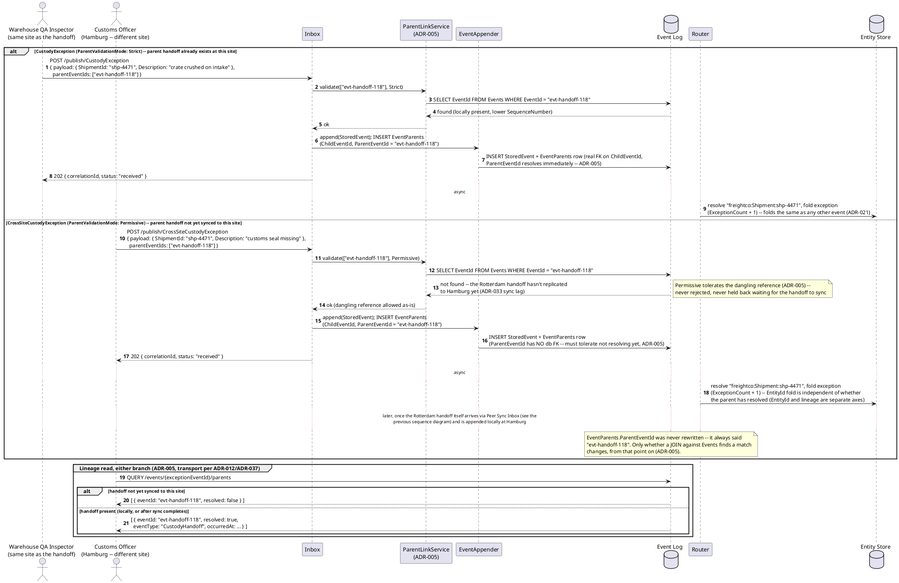
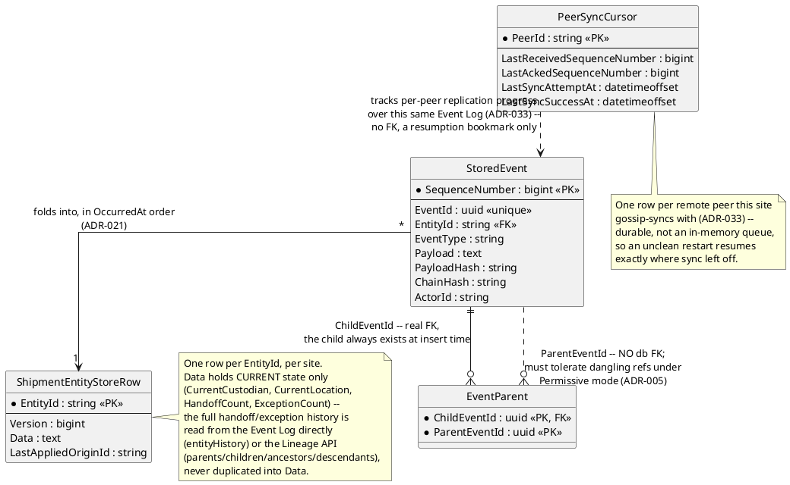
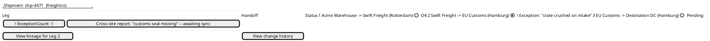

# Feature: Shipment Custody Transfer and Exception Handling

Context: this domain's `README.md` ("Applicable ADRs") lists `ADR-005`
(event lineage/DAG) as the cleanest, most natural fit found across every
proving-ground candidate reviewed — a shipment's custody chain literally
*is* a DAG of handoffs, not a mechanism bolted on to justify using it.
This doc exercises that fit end to end: a shipment's custody passes
through a sequence of real handoffs (origin warehouse → carrier →
customs → destination), each one a `CustodyHandoff` event; a discovered
exception (goods damaged, a seal missing) causally references the
*specific* prior handoff it concerns via `parentEventIds`
(`ADR-005`, `docs/adrs/adr-005-event-parenting-dag.md`). Every handoff
and exception is also hash-chained for tamper evidence (`ADR-019`,
`docs/adrs/adr-019-hash-chained-tamper-evidence.md`) and replicated
across geographically distributed sites via gossip peer-sync (`ADR-033`,
`docs/adrs/adr-033-multi-origin-replication.md`) — both also listed as
primary fit in this domain's `README.md`. The envelope shape every
`StoredEvent` carries (`SequenceNumber`, `EntityId`, `Payload`,
`PayloadHash`, `ChainHash`, `Status`, `ActorId`, ...) is defined in
[`../../../data/event-log.md`](../../../data/event-log.md); this doc
cites only the fields its scenarios actually touch. `EntityId` follows
`{appId}:{entityType}:{uniqueId}` (`ADR-021`); scenarios below use
`appId` `"freightco"` throughout.

Lightly touched, per this domain's secondary/primary fit list, without
being re-derived in depth: a damage photo captured at an exception is a
natural `AttachmentRef` (`ADR-032`) linked to the `CustodyException`
event's `EventId` — this doc mentions it once, in the data model
section, and does not re-derive the upload handoff (`POST /attachments`
returning a `ContentHash`, then publishing carrying it) or the WebDAV
browsing surface; both are `docs/adrs/adr-032-binary-attachments.md`'s
own territory. `AppId` scoping (`ADR-030`) is assumed throughout (every
`EntityId` is `appId`-prefixed) but not exercised as its own mechanism —
this doc has one tenant, `"freightco"`, and never shows a
cross-tenant boundary.

This doc deliberately does **not** re-derive:
- `ConflictFlag`'s general concurrent-write/fold-ordering mechanics, or
  how it composes with cross-server divergence specifically — both are
  already covered in
  [`../../../features/entity-concept.md`](../../../features/entity-concept.md)
  (`ADR-024`) and
  [`../../../patterns/interactions/fold-ordering-and-conflict.md`](../../../patterns/interactions/fold-ordering-and-conflict.md)
  (`ADR-024`/`ADR-029`). This doc's own scenarios have no conflicting
  concurrent writes to the same `EntityId` — every handoff/exception in
  every scenario here folds cleanly.
- Masking, claims-based access control, or row-level security — this
  domain's `README.md` scores `ADR-009`/`ADR-050`/`ADR-052` and
  `ADR-043` as weak/no fit (custody-chain metadata isn't primarily
  personal data), so no scenario here checks a claim or masks a field.
- `ADR-032`'s attachment upload mechanics, `AttachmentRef` resolution, or
  WebDAV browsing, beyond the one-line mention above.
- The Lineage API's general traversal mechanics (direct join vs.
  recursive-CTE ancestors/descendants, cycle-safety) —
  [`../../../features/event-chains.md`](../../../features/event-chains.md)
  already covers those against a generic example; this doc reuses the
  same API against a domain-real shipment DAG rather than re-explaining
  how the traversal itself works.

## Sequence diagram — a normal handoff, published at the origin site and replicated to a destination-site peer

Publish itself is the ordinary `202`-accepted, status-envelope shape
(`ADR-023`) — nothing new there. What this diagram shows is what happens
*after*: the same `CustodyHandoff` event is appended once at the
origin site (with its own `ChainHash`, chained onto that site's own
prior `ChainHash`), then carried across `ADR-033`'s durable Peer Sync
Outbox/Inbox to a destination-site peer, where it is appended a
*second* time — at that site's own next `SequenceNumber`, chained onto
*that* site's own prior `ChainHash`. `SequenceNumber`/`ChainHash` are
strictly local, per-store artifacts (`ADR-019`, `ADR-029`); nothing
about replication changes that — `OriginId`/`LogicalClock` (`ADR-033`'s
Decision) are what let the two sites agree on the same logical event
despite each keeping its own independent chain. (`OriginId`/`LogicalClock`
are decided in `ADR-033` but not yet reflected as columns in
[`../../../data/event-log.md`](../../../data/event-log.md)'s
`StoredEvent` class — a known propagation gap tracked in `CLAUDE.md`'s
Propagation status, not something invented for this doc; shown below as
metadata that travels with the event regardless.)

```plantuml
@startuml ShipmentCustody_Handoff_Replication_Sequence
autonumber
actor "Warehouse Scanner\n(Rotterdam site)" as publisher
participant "Inbox\n(Origin site: Rotterdam)" as originInbox
participant "EventAppender\n(Origin site)" as originAppender
database "Event Log\n(Origin site)" as originLog
participant "Router\n(Origin site)" as originRouter
database "Entity Store\n(Origin site)" as originEntityStore
participant "Peer Sync Outbox\n(Origin site, ADR-033)" as outbox
participant "Peer Sync Inbox\n(Destination site: Hamburg, ADR-033)" as destInbox
participant "EventAppender\n(Destination site)" as destAppender
database "Event Log\n(Destination site)" as destLog
participant "Router\n(Destination site)" as destRouter
database "Entity Store\n(Destination site)" as destEntityStore

publisher -> originInbox: POST /publish/CustodyHandoff\n{ payload: { ShipmentId: "shp-4471", HandoffType: "OriginWarehouseToCarrier",\n  FromParty: "Acme Warehouse", ToParty: "Swift Freight", Location: "Rotterdam" } }
originInbox -> originAppender: append(StoredEvent)
originAppender -> originLog: INSERT StoredEvent\n(SequenceNumber = 118, PayloadHash = H, ChainHash = SHA256(ChainHash[117] || H || 118)) (ADR-019)
note right of originAppender: OriginId = "site-rotterdam", LogicalClock = hlc(...)\ntravel with the event (ADR-033) -- not yet a StoredEvent column,\nsee this doc's Context paragraph
originInbox --> publisher: 202 { correlationId, status: "received", entityId: null }
...picked up by the origin site's own Router, asynchronously (ADR-023)...
originRouter -> originEntityStore: resolve EntityId "freightco:Shipment:shp-4471"\nfold: CurrentCustodian = "Swift Freight", HandoffCount + 1
originRouter -> originLog: UPDATE StoredEvent SET Status = "applied", EntityId = "freightco:Shipment:shp-4471"
...independently, the origin site's outbox drains on its own schedule...
outbox -> originLog: poll for events not yet acked by peer "site-hamburg"\n(per-peer PeerSyncCursor.LastAckedSequenceNumber, ADR-033)
outbox -> destInbox: push StoredEvent (full envelope: Payload, PayloadHash, OriginId, LogicalClock, ActorId, ...)
destInbox -> destAppender: append(StoredEvent) -- lands exactly as if it arrived\nfrom this site's own client Inbox (ADR-033)
destAppender -> destLog: INSERT StoredEvent\n(Destination's OWN SequenceNumber = 57, ChainHash = SHA256(destChainHash[56] || H || 57))
note right of destAppender: PayloadHash (H) is unchanged -- content-based (ADR-011).\nSequenceNumber/ChainHash are each site's OWN local chain (ADR-019) --\nnever copied from the origin's chain, never require it to match.
outbox -> originLog: UPDATE PeerSyncCursor SET LastAckedSequenceNumber = 118,\nLastSyncSuccessAt = now() (row keyed by PeerId "site-hamburg")
...picked up by the destination site's own Router, asynchronously -- no routing\nor schema-validation logic runs during sync itself (ADR-033)...
destRouter -> destEntityStore: resolve the SAME EntityId "freightco:Shipment:shp-4471"\nfold: CurrentCustodian = "Swift Freight", LastAppliedOriginId = "site-rotterdam"
destRouter -> destLog: UPDATE StoredEvent SET Status = "applied"
@enduml
```



No conflict arises in this diagram — both sites fold the identical
event, in order, onto an `EntityId` neither has a concurrent competing
write for. See this doc's Context paragraph for where the conflicting
case is already covered instead.

## Sequence diagram — an exception event parented off a specific prior handoff

A `CustodyException` reports a problem discovered *about* one specific
handoff — the crate was crushed on the truck between Rotterdam and
Hamburg, a customs seal is missing — not about the shipment in general.
`parentEventIds` (`ADR-005`) is exactly the mechanism for that: the
exception is folded into the same `EntityId` as every handoff (so the
shipment's current state reflects it), *and* separately parented off
the one handoff `EventId` it concerns, so the DAG records precisely
which leg of the journey the problem traces to. Two event types are
registered with different `ParentValidationMode`s (`ADR-005`), for a
real domain reason: `CustodyException` is filed by the *same* site that
already holds the handoff it concerns (a warehouse QA inspector,
right after their own intake scan) — `Strict` is safe because the
parent is always already local. `CrossSiteCustodyException` is filed by
a *different* site (a customs officer at Hamburg reporting on a handoff
that happened at Rotterdam) — the referenced handoff may not have
replicated over yet via `ADR-033`'s gossip sync, so `Permissive` is the
only mode that doesn't reject a legitimate, timely report.



## Data model (ER diagram)



```csharp
// A CustodyHandoff/CustodyException-shaped StoredEvent -- only the columns
// this doc's scenarios touch; the full StoredEvent class is in
// ../../../data/event-log.md.
public class StoredEvent
{
    public long SequenceNumber { get; set; }    // per-site arrival order -- NOT shared across sites (ADR-029)
    public Guid EventId { get; set; }           // e.g. "evt-handoff-118" -- what a CustodyException's parentEventIds references (ADR-005)
    public string EntityId { get; set; } = default!;  // "freightco:Shipment:shp-4471" -- same across every site (ADR-021)
    public string EventType { get; set; } = default!; // "CustodyHandoff" | "CustodyException" | "CrossSiteCustodyException"
    public string Payload { get; set; } = default!;   // JSON: { ShipmentId, HandoffType, FromParty, ToParty, Location } or { ShipmentId, Description }
    public string PayloadHash { get; set; } = default!; // hash of {EventType, Payload, sorted parentEventIds} -- ADR-011; unchanged by replication
    public string ChainHash { get; set; } = default!;   // SHA-256(prior ChainHash || PayloadHash || SequenceNumber), THIS site's own chain (ADR-019)
    public string ActorId { get; set; } = default!;     // verified caller identity -- the inspector/officer/scanning system, always populated (ADR-064)
}

// The parent link a CustodyException/CrossSiteCustodyException declares
// against the specific handoff it concerns -- a separate table, never a
// Payload field (ADR-005).
public class EventParent
{
    public Guid ChildEventId { get; set; }   // the exception's own EventId -- always resolves, inserted in the same transaction
    public Guid ParentEventId { get; set; }  // the handoff's EventId -- may NOT resolve yet if the child's event type is Permissive (ADR-005)
}

// Current-state fold target for one shipment, one row per site (ADR-021).
public class ShipmentEntityStoreRow
{
    public string EntityId { get; set; } = default!;    // "freightco:Shipment:shp-4471"
    public long Version { get; set; }                    // bumps on every fold that changes Data (ADR-024)
    public string Data { get; set; } = default!;         // JSON: { CurrentCustodian, CurrentLocation, HandoffCount, ExceptionCount }
    public string? LastAppliedOriginId { get; set; }     // which site's write most recently won this row's fold (ADR-033)
}

// Durable, per-peer replication bookmark -- survives an unclean restart
// because it's a table, never only in memory (ADR-033).
public class PeerSyncCursor
{
    public string PeerId { get; set; } = default!;       // "site-hamburg", "site-rotterdam", ...
    public long LastReceivedSequenceNumber { get; set; }  // furthest SequenceNumber accepted FROM this peer
    public long LastAckedSequenceNumber { get; set; }     // furthest SequenceNumber this peer has acked receiving FROM us
    public DateTimeOffset LastSyncAttemptAt { get; set; }
    public DateTimeOffset LastSyncSuccessAt { get; set; }
}
```

A proof-of-damage photo captured alongside a `CustodyException` is a
natural fit for `ADR-032`'s content-addressed binary attachments,
linked via an `AttachmentRef` keyed to the exception's own `EventId` —
mentioned here for completeness only; the upload handoff and
`AttachmentRef` shape themselves are
[`../../../data/streaming-and-attachments.md`](../../../data/streaming-and-attachments.md)'s
territory, not repeated in this diagram.

## Salt (UI mockup)

A dispatcher/compliance officer's shipment custody timeline: the handoff
chain in order, with an exception rendered against the specific leg it
concerns rather than floating unattached.



The exception row under Leg 2 is rendered directly against that leg
because the client resolved `parentEventIds` via the Lineage API
(`ADR-005`, transport per `ADR-012`/`ADR-037`) — not because the UI
infers it from ordering or timing. The second flagged line shows a
`CrossSiteCustodyException` whose parent hasn't resolved locally yet
(`resolved: false`, `Permissive` mode, `ADR-005`/`ADR-033`) — rendered as
"awaiting sync" rather than hidden, matching this design's general
preference for visible-but-labeled over silently dropped.

## Gherkin

```gherkin
Feature: Shipment Custody Transfer and Exception Handling
  As a logistics platform operator
  I want each custody handoff recorded as its own event, replicated across sites,
  and exceptions causally linked to the specific handoff they concern
  So that a shipment's full chain of custody is tamper-evident, cross-site durable,
  and any discovered problem traces to the exact leg of the journey it happened on

  # Every request in this file carries a Bearer token with the events:publish
  # scope unless a scenario says otherwise (auth.md covers that mechanism, not
  # repeated here). EntityId format is {appId}:{entityType}:{uniqueId} (ADR-021);
  # scenarios use appId "freightco" throughout. Publish responses are 202 with
  # a status envelope (ADR-023), not 201/400 -- this doc was written against
  # the current convention, unlike features/event-chains.md's stale scenarios.

  Background:
    Given the event type "CustodyHandoff" version 1 is registered with EntityIdField "$.ShipmentId" and ParentValidationMode "Strict" and schema:
      """
      {
        "type": "object",
        "properties": {
          "ShipmentId": { "type": "string" },
          "HandoffType": { "type": "string" },
          "FromParty": { "type": "string" },
          "ToParty": { "type": "string" },
          "Location": { "type": "string" }
        },
        "required": ["ShipmentId", "HandoffType", "FromParty", "ToParty"]
      }
      """
    And the event type "CustodyException" version 1 is registered with EntityIdField "$.ShipmentId" and ParentValidationMode "Strict" and schema:
      """
      { "type": "object", "properties": { "ShipmentId": { "type": "string" }, "Description": { "type": "string" } }, "required": ["ShipmentId", "Description"] }
      """
    # Strict is safe for CustodyException specifically because it's always filed
    # by the same site that already holds the handoff it concerns (ADR-005).
    And the event type "CrossSiteCustodyException" version 1 is registered with EntityIdField "$.ShipmentId" and ParentValidationMode "Permissive" and schema:
      """
      { "type": "object", "properties": { "ShipmentId": { "type": "string" }, "Description": { "type": "string" } }, "required": ["ShipmentId", "Description"] }
      """
    # Permissive specifically because this type is filed by a DIFFERENT site than
    # the one holding the referenced handoff -- ADR-033's gossip sync may not have
    # delivered it yet, and a legitimate, timely report must not be rejected over that (ADR-005).
    And two sites, "site-rotterdam" and "site-hamburg", replicate each other via gossip peer-sync with replication factor 2 (ADR-033)

  Scenario: A handoff published at the origin site replicates to a destination-site peer and folds identically at both
    When I POST to "/publish/CustodyHandoff" at "site-rotterdam" with body:
      """
      { "payload": { "ShipmentId": "shp-4471", "HandoffType": "OriginWarehouseToCarrier", "FromParty": "Acme Warehouse", "ToParty": "Swift Freight", "Location": "Rotterdam" } }
      """
    Then the response status should be 202 with status "received"
    And eventually the stored event's status should become "applied" with EntityId "freightco:Shipment:shp-4471" at "site-rotterdam"
    And eventually the same event should appear in "site-hamburg"'s Event Log with its OWN SequenceNumber and ChainHash
    # ChainHash at site-hamburg chains onto site-hamburg's OWN prior ChainHash, not site-rotterdam's --
    # the two sites' chains are independent even though PayloadHash matches (ADR-019).
    And eventually the EntityStoreRow "freightco:Shipment:shp-4471" at "site-hamburg" should show CurrentCustodian "Swift Freight"
    And "site-rotterdam"'s PeerSyncCursor for peer "site-hamburg" should show LastAckedSequenceNumber advanced past this event

  Scenario: A Strict-mode exception parented off an already-present handoff resolves immediately
    Given a "CustodyHandoff" event "evt-handoff-118" was published and folded for "shp-4471" at "site-rotterdam"
    When I POST to "/publish/CustodyException" at "site-rotterdam" with body:
      """
      { "payload": { "ShipmentId": "shp-4471", "Description": "crate crushed on intake" }, "parentEventIds": ["evt-handoff-118"] }
      """
    Then the response status should be 202 with status "received"
    And the stored event's parents should be exactly ["evt-handoff-118"]
    And QUERY "/events/{exceptionEventId}/parents" should list "evt-handoff-118" as "resolved": true
    And eventually the EntityStoreRow "freightco:Shipment:shp-4471" should show ExceptionCount 1

  Scenario: A Permissive-mode cross-site exception parented off a not-yet-synced handoff is accepted, not rejected
    Given a "CustodyHandoff" event "evt-handoff-118" was published at "site-rotterdam" and has NOT yet replicated to "site-hamburg"
    When I POST to "/publish/CrossSiteCustodyException" at "site-hamburg" with body:
      """
      { "payload": { "ShipmentId": "shp-4471", "Description": "customs seal missing" }, "parentEventIds": ["evt-handoff-118"] }
      """
    Then the response status should be 202 with status "received"
    # Under Strict this reference would be rejected as unresolvable; Permissive is
    # what makes a legitimate, timely cross-site report possible at all (ADR-005).
    And the stored event's parents should be exactly ["evt-handoff-118"]
    And QUERY "/events/{exceptionEventId}/parents" at "site-hamburg" should list "evt-handoff-118" as "resolved": false
    And eventually the EntityStoreRow "freightco:Shipment:shp-4471" at "site-hamburg" should show ExceptionCount 1
    # The exception still folds into the Entity Store immediately -- EntityId fold and
    # lineage resolution are separate axes; one never blocks the other (ADR-021).

  Scenario: Once the referenced handoff itself syncs, the same exception's parent link resolves without being rewritten
    Given a "CrossSiteCustodyException" event "evt-exc-9" was published at "site-hamburg" parented off not-yet-synced "evt-handoff-118"
    And QUERY "/events/evt-exc-9/parents" at "site-hamburg" currently lists "evt-handoff-118" as "resolved": false
    When the "CustodyHandoff" event "evt-handoff-118" itself replicates from "site-rotterdam" to "site-hamburg" and is appended locally
    Then QUERY "/events/evt-exc-9/parents" at "site-hamburg" should now list "evt-handoff-118" as "resolved": true
    # EventParents.ParentEventId was never updated -- it always said "evt-handoff-118".
    # Only whether a join against the local Events table finds a match changed (ADR-005).

  Scenario: A Strict-mode publish referencing a parent that turns out not to exist at all is flagged, not silently treated as a normal resolvable reference
    When I POST to "/publish/CustodyException" at "site-hamburg" with body:
      """
      { "payload": { "ShipmentId": "shp-4471", "Description": "damage noted, wrong handoff cited" }, "parentEventIds": ["00000000-0000-0000-0000-000000000000"] }
      """
    Then the response status should be 202 with SchemaStatus "invalid"
    # Persist-everything (ADR-023) applies here too: a Strict-mode event whose declared
    # parent can't be found is persisted and flagged rather than blocking the whole
    # publish -- matching how features/event-chains.md's own banner already describes
    # this exact case. It is NOT treated the same as CrossSiteCustodyException's tolerated,
    # will-resolve-later dangling reference above -- SchemaStatus "invalid" signals "this
    # event type expected an already-real parent and didn't get one," a different meaning
    # from Permissive's ordinary, expected-to-resolve-eventually gap.
    And QUERY "/events/{exceptionEventId}/parents" should list the referenced parent as "resolved": false indefinitely
```
