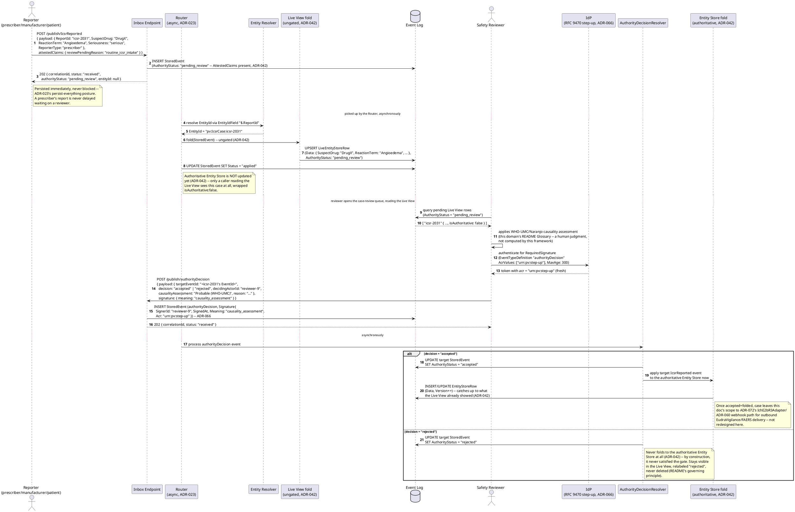
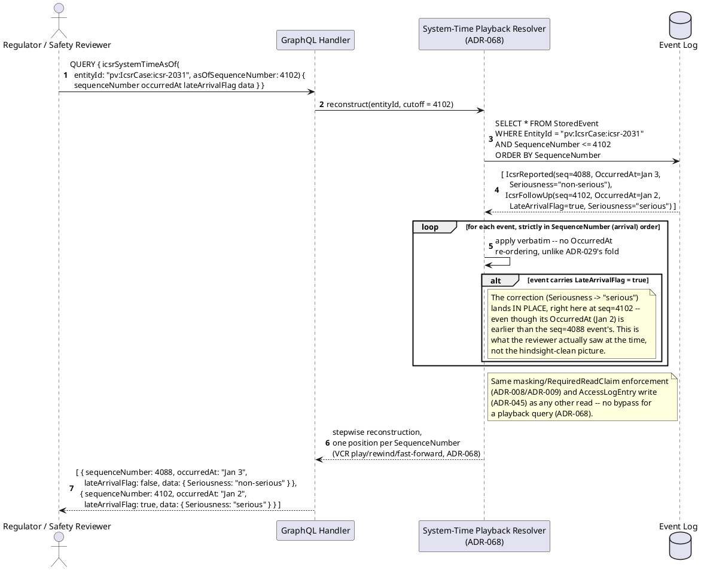
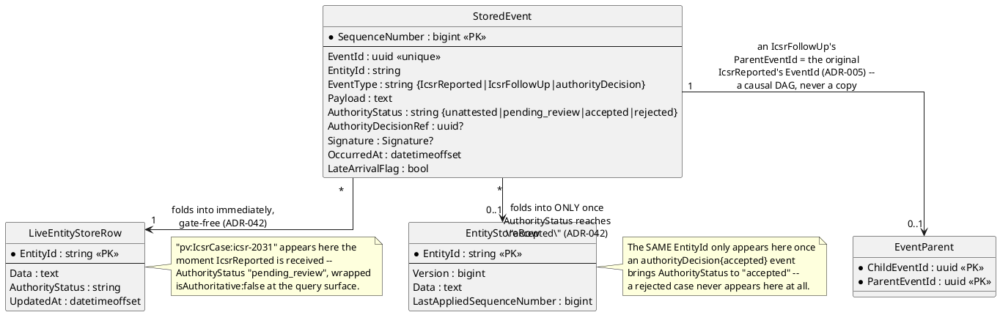
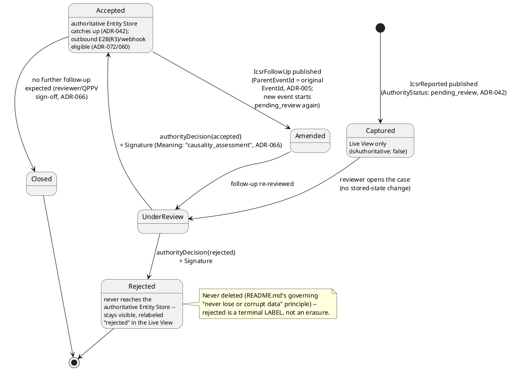

# Feature: Individual Case Safety Report Intake and Signal Review

Context: this domain's own [`README.md`](../README.md) (`Applicable ADRs`)
names the mechanisms this doc exercises: `ADR-035` (non-authoritative
capture — an incoming ICSR is captured immediately but not accepted until
a safety reviewer works the case), `ADR-042` (which revises `ADR-035` —
the gated-fold/Live View split), `ADR-066` (digital sign-off — a
reviewer's causality assessment), `ADR-068` (bitemporal system-time
playback — "what did we know about this drug's safety profile as of
date T"), `ADR-072` (the `IchE2bR3Adapter` outbound transform to
EudraVigilance/FAERS), `ADR-005` (event lineage — a case's follow-up
amendments), `ADR-023` (persist-everything ingestion), and `ADR-021`
(`EntityId`, the always-on Entity Store). Full `StoredEvent`/
`EventParent` column lists are in
[`../../../data/event-log.md`](../../../data/event-log.md);
`EntityStoreRow`/`LiveEntityStoreRow` are in
[`../../../data/entity-store.md`](../../../data/entity-store.md).

This doc deliberately does **not** re-derive:
- `AuthorityStatus`'s general trust-axis mechanics, the `unattested`/
  `pending_review`/`accepted`/`rejected` lifecycle, or the Live View's
  `isAuthoritative: false` wrapper in general — those are
  [`non-authoritative-capture.md`](../../../features/non-authoritative-capture.md).
  This doc shows the *same* mechanism landing on one concrete case type
  (an ICSR) rather than re-explaining the gate itself.
- RFC 9470 step-up authentication's general challenge/response shape —
  that's `ADR-066` and
  [`../../../patterns/step-up-authentication.md`](../../../patterns/step-up-authentication.md).
  This doc only shows *which* action (a causality-assessment sign-off)
  triggers it here.
- `ADR-007`'s automated signal-detection mechanism — **still deferred,
  not yet built**, per `CLAUDE.md` and this domain's own `README.md`.
  "Signal review" below is modeled honestly as a human analyst running
  `ADR-068`'s bitemporal playback query by hand across cases already in
  the store, not as an automated pattern-detection pipeline. Don't read
  anything in this doc as a design for `ADR-007` — it isn't one.
- `ADR-072`'s `IchE2bR3Adapter`/`ADR-060` webhook-delivery transform
  mechanics — outbound regulatory reporting is mentioned below only as
  "what happens once a case is accepted," never redesigned here.
- Masking/claims enforcement on patient-identifying fields
  (`ADR-009`/`ADR-050`/`ADR-052`) and the read-access audit log
  (`ADR-045`) — both apply to every read in this doc unchanged, exactly
  as they apply to any other entity; not repeated here.

## Sequence diagram — ICSR intake through causality-assessment sign-off



## Sequence diagram — bitemporal system-time playback of a case

A regulator or safety reviewer asking "what did we know about this case,
and this drug's safety profile, as of a past date" is this domain's
routine analytical method (`README.md`'s Special concerns), not a
forensic exception — `ADR-068`'s system-time query mode, which replays
events in **arrival** (`SequenceNumber`) order with no logical-time
correction, the deliberate opposite of the authoritative Entity Store's
valid-time-corrected fold (`ADR-029`). This example shows a follow-up
report that arrived late (`LateArrivalFlag`) — a corrected `Seriousness`
— landing exactly where it was actually learned, not smoothed backward
into the timeline it logically describes.



## Data model (ER diagram)



The `Payload`/`Data` JSON shape both `event` and `live`/`auth` above
actually carry, once folded, is domain-specific and not part of the
generic envelope column lists in
[`../../../data/event-log.md`](../../../data/event-log.md)/
[`../../../data/entity-store.md`](../../../data/entity-store.md) — sketched
here as the C# shape this doc's scenarios exercise:

```csharp
// The shape of StoredEvent.Payload for "IcsrReported"/"IcsrFollowUp",
// and of EntityStoreRow.Data/LiveEntityStoreRow.Data once folded --
// not a separate table, ADR-021's Data column carries it as JSON.
public class IcsrCaseSnapshot
{
    public string ReportId { get; set; } = default!;       // EntityIdField "$.ReportId" -- resolves EntityId "pv:IcsrCase:{ReportId}" (ADR-021)
    public string SuspectDrug { get; set; } = default!;
    public string ReactionTerm { get; set; } = default!;     // free-text as reported; MedDraCode below is the coded form (README Glossary: MedDRA)
    public string? MedDraCode { get; set; }                  // MedDRA SOC->LLT hierarchy code, once mapped
    public string Seriousness { get; set; } = default!;       // ICH E2A tier, e.g. "serious-hospitalization" (README Glossary: Serious Adverse Event)
    public string ReporterType { get; set; } = default!;      // "patient" | "prescriber" | "manufacturer"
    public string? CausalityAssessment { get; set; }           // WHO-UMC/Naranjo verdict -- set by the reviewer's authorityDecision, not the original report
}

// The payload shape of "authorityDecision" events targeting an IcsrReported/
// IcsrFollowUp event -- same event type non-authoritative-capture.md already
// establishes, registered fresh per AppId ("pv" here), now with RequiredSignature.
public class IcsrAuthorityDecisionPayload
{
    public Guid TargetEventId { get; set; }                   // the IcsrReported/IcsrFollowUp EventId being adjudicated
    public string Decision { get; set; } = default!;           // "accepted" | "rejected"
    public string DecidingActorId { get; set; } = default!;
    public string? CausalityAssessment { get; set; }            // WHO-UMC/Naranjo verdict, carried into the decision payload
    public string? Reason { get; set; }
}
```

Full generic column lists remain in
[`../../../data/event-log.md`](../../../data/event-log.md) and
[`../../../data/entity-store.md`](../../../data/entity-store.md); this diagram
and sketch show only the ICSR-specific shape riding inside those generic
envelopes.

## State diagram — one ICSR case's lifecycle

`UnderReview` below is **observational, not a persisted field** — it
describes a case a reviewer has opened, before they've published a
decision; the only durable state this design actually stores is each
contributing event's `AuthorityStatus` (rolled up as
`LiveEntityStoreRow.AuthorityStatus`, "the most recent contributing
event's status," per `../../data/entity-store.md`). `Amended`/`Closed`
are likewise this domain's own vocabulary for recognizable points along
that same underlying `AuthorityStatus` timeline, not new schema.



## Salt (UI mockup)

```plantuml
@startsalt
{
  { "ICSR Case Review Queue -- Live View (isAuthoritative: false)" }
  ..
  | ReportId    | SuspectDrug | ReactionTerm  | Seriousness   | AuthorityStatus      |
  | "icsr-2031" | "DrugX"     | "Angioedema"  | "serious"     | ( ) pending_review   |
  | "icsr-2044" | "DrugY"     | "Rash"        | "non-serious" | ( ) pending_review   |
  | "icsr-1998" | "DrugX"     | "Anaphylaxis" | "serious"     | (X) rejected         |
  ..
  { "Selected case: icsr-2031  --  isAuthoritative: false" }
  ..
  | Field                 | Value                                    |
  | ReporterType          | "prescriber"                             |
  | MedDraCode            | "10002424 (Angioedema, PT)"               |
  | Causality Assessment  | [ "Probable (WHO-UMC)"                  ] |
  | Signature Meaning     | "causality_assessment"                    |
  ..
  { [Step-up & Sign: Accept] | [Step-up & Sign: Reject] | [View lineage] | [System-time playback] }
}
@endsalt
```



`AuthorityStatus`'s badge and the `isAuthoritative: false` banner reuse
the exact same flag-rendering convention `mvvm-client.md`'s generic
fallback view already shows for `ConflictFlag`/`LateArrivalFlag` — this
screen is one concrete `ViewDefinition` an ICSR case's `EntityType` would
bind to, not a new rendering mechanism; the "Step-up & Sign" actions are
what triggers `ADR-066`'s RFC 9470 challenge shown in this doc's first
sequence diagram, not a bespoke re-auth flow. "System-time playback"
opens the second sequence diagram's query as its own view, out of scope
to mock up further here.

## Gherkin

```gherkin
Feature: Individual Case Safety Report Intake and Signal Review
  As a pharmacovigilance platform
  I want an incoming adverse-event report to persist immediately but only
    reach the authoritative case record once a safety reviewer signs off
  And a reviewer or regulator to reconstruct what a case looked like as of
    a past date, corrections landing exactly when they were learned
  So that intake is never blocked on review, unreviewed data stays visibly
    labeled rather than silently trusted, and "what did we know, and when"
    is answerable without smoothing history

  # Every request carries a Bearer token with the events:publish scope
  # unless noted otherwise (auth.md). AppId "pv" throughout; EntityId format
  # is "pv:IcsrCase:{ReportId}" (ADR-021). Publish responses use the 202
  # envelope from ADR-023: { correlationId, status, entityId, authorityStatus }.

  Background:
    Given the event type "IcsrReported" version 1 is registered with ChangeKind "Full" and EntityIdField "$.ReportId" and schema:
      """
      {
        "type": "object",
        "properties": {
          "ReportId": { "type": "string" },
          "SuspectDrug": { "type": "string" },
          "ReactionTerm": { "type": "string" },
          "Seriousness": { "type": "string" },
          "ReporterType": { "type": "string" }
        },
        "required": ["ReportId", "SuspectDrug", "ReactionTerm", "Seriousness", "ReporterType"]
      }
      """
    And the event type "IcsrFollowUp" version 1 is registered with ChangeKind "Partial" and EntityIdField "$.ReportId" and schema:
      """
      {
        "type": "object",
        "properties": { "ReportId": { "type": "string" }, "Seriousness": { "type": "string" } },
        "required": ["ReportId"]
      }
      """
    And the event type "authorityDecision" version 1 is registered with EntityIdField "$.targetEventId" and RequiredSignature { "AcrValues": ["urn:pv:step-up"], "MaxAge": 300 } and schema:
      """
      {
        "type": "object",
        "properties": {
          "targetEventId": { "type": "string" },
          "decision": { "type": "string" },
          "decidingActorId": { "type": "string" },
          "causalityAssessment": { "type": "string" },
          "reason": { "type": "string" }
        },
        "required": ["targetEventId", "decision", "decidingActorId"]
      }
      """

  Scenario: A newly captured ICSR persists immediately and appears only in the Live View, not yet the authoritative Entity Store
    When I POST to "/publish/IcsrReported" with body:
      """
      {
        "payload": { "ReportId": "icsr-2031", "SuspectDrug": "DrugX", "ReactionTerm": "Angioedema", "Seriousness": "serious", "ReporterType": "prescriber" },
        "attestedClaims": { "reviewPendingReason": "routine_icsr_intake" }
      }
      """
    Then the response status should be 202
    And the response body should include "authorityStatus": "pending_review"
    # AttestedClaims present -> AuthorityStatus starts at pending_review rather
    # than the ordinary default "accepted" (ADR-042). An ordinary authenticated
    # publish with no AttestedClaims would default to "accepted" instead --
    # ICSR intake always sets this marker deliberately, since every incoming
    # case genuinely needs review before being treated as authoritative.
    And querying the Live View for "pv:IcsrCase:icsr-2031" should return the case data, wrapped "isAuthoritative": false
    And querying the authoritative Entity Store for "pv:IcsrCase:icsr-2031" should NOT yet reflect this case

  Scenario: A reviewer's accepted causality assessment, signed off, catches up the authoritative Entity Store
    Given an "IcsrReported" event "e-2031" was published for "icsr-2031" with body { "ReportId": "icsr-2031", "SuspectDrug": "DrugX", "ReactionTerm": "Angioedema", "Seriousness": "serious", "ReporterType": "prescriber" } and AttestedClaims present
    And the Live View for "pv:IcsrCase:icsr-2031" already shows this case, wrapped isAuthoritative:false
    And reviewer "reviewer-9" has stepped up to acr "urn:pv:step-up" (RFC 9470, ADR-066)
    When I POST to "/publish/authorityDecision" with body:
      """
      {
        "payload": { "targetEventId": "e-2031", "decision": "accepted", "decidingActorId": "reviewer-9", "causalityAssessment": "Probable (WHO-UMC)" },
        "signature": { "meaning": "causality_assessment" }
      }
      """
    Then the response status should be 202
    And the stored event "e-2031" should have AuthorityStatus "accepted"
    And eventually the authoritative Entity Store for "pv:IcsrCase:icsr-2031" should show ReactionTerm "Angioedema"
    And the authorityDecision event's Signature should have SignerId "reviewer-9", Meaning "causality_assessment", and Acr "urn:pv:step-up"

  Scenario: A rejected case never reaches the authoritative Entity Store, and stays visible, relabeled, in the Live View
    Given an "IcsrReported" event "e-1998" was published for "icsr-1998" with body { "ReportId": "icsr-1998", "SuspectDrug": "DrugX", "ReactionTerm": "Anaphylaxis", "Seriousness": "serious", "ReporterType": "patient" } and AttestedClaims present
    And reviewer "reviewer-9" has stepped up to acr "urn:pv:step-up"
    When I POST to "/publish/authorityDecision" with body:
      """
      {
        "payload": { "targetEventId": "e-1998", "decision": "rejected", "decidingActorId": "reviewer-9", "reason": "duplicate of icsr-1990, same patient/drug/date" },
        "signature": { "meaning": "causality_assessment" }
      }
      """
    Then the response status should be 202
    And the stored event "e-1998" should have AuthorityStatus "rejected"
    And the authoritative Entity Store should NOT contain a row for "pv:IcsrCase:icsr-1998"
    And the Live View for "pv:IcsrCase:icsr-1998" should still return the case, now relabeled AuthorityStatus "rejected"
    # Never deleted (README.md's governing principle) -- rejected is a
    # terminal label a caller must check, not a silently withheld record.

  Scenario: A follow-up amendment links back to the original report via parentEventIds and re-opens review
    Given an "IcsrReported" event "e-2031" was published and accepted for "icsr-2031", folded into the authoritative Entity Store with Seriousness "serious"
    When I POST to "/publish/IcsrFollowUp" with body:
      """
      {
        "payload": { "ReportId": "icsr-2031", "Seriousness": "life-threatening" },
        "parentEventIds": ["e-2031"],
        "attestedClaims": { "reviewPendingReason": "follow_up_amendment" }
      }
      """
    Then the response status should be 202
    And the response body should include "authorityStatus": "pending_review"
    And the new event's EventParent should record ParentEventId "e-2031" (ADR-005 -- a causal link, not a copy/materialization)
    And the Live View for "pv:IcsrCase:icsr-2031" should show Seriousness "life-threatening", wrapped isAuthoritative:false
    And the authoritative Entity Store for "pv:IcsrCase:icsr-2031" should still show Seriousness "serious" until this follow-up is itself reviewed and accepted

  Scenario: Bitemporal system-time playback shows a late-arriving correction landing in place, not smoothed backward
    Given an "IcsrReported" event "e-3050" was published and accepted for "icsr-3050" on OccurredAt "2026-01-03", showing Seriousness "non-serious", at SequenceNumber 4088
    And an "IcsrFollowUp" event "e-3051" for "icsr-3050" arrived and was accepted at SequenceNumber 4102, declaring OccurredAt "2026-01-02" and Seriousness "serious", setting LateArrivalFlag true
    When I query icsrSystemTimeAsOf(entityId: "pv:IcsrCase:icsr-3050", asOfSequenceNumber: 4102)
    Then the reconstruction at SequenceNumber 4088 should show Seriousness "non-serious"
    And the reconstruction at SequenceNumber 4102 should show Seriousness "serious", with lateArrivalFlag true
    # The correction lands exactly at the SequenceNumber it actually arrived
    # (4102) even though its OccurredAt (Jan 2) is earlier than the seq=4088
    # event's -- ADR-068's system-time query deliberately does NOT apply
    # ADR-029's valid-time correction; the authoritative Entity Store (which
    # DOES apply that correction) would instead show Seriousness "serious"
    # as of Jan 2 onward, the opposite ordering, and is a different query
    # entirely -- not exercised by this scenario.

  Scenario: A causality-assessment sign-off without a sufficiently fresh step-up is challenged, not silently accepted
    Given an "IcsrReported" event "e-4010" was published for "icsr-4010" and AttestedClaims present
    And reviewer "reviewer-9" holds a token with no "acr" claim satisfying "urn:pv:step-up"
    When I POST to "/publish/authorityDecision" with body:
      """
      { "payload": { "targetEventId": "e-4010", "decision": "accepted", "decidingActorId": "reviewer-9" }, "signature": { "meaning": "causality_assessment" } }
      """
    Then the response status should be 401, carrying a WWW-Authenticate challenge naming acr_values "urn:pv:step-up" (RFC 9470)
    And no authorityDecision event should be persisted
    # The one case where a publish is legitimately turned away before
    # storage (ADR-066's Consequences) -- insufficient authentication
    # strength for a RequiredSignature-configured event type, distinct from
    # ADR-023's persist-everything posture for the event's own data/content.
```
