# Feature: Reportable Condition Case Investigation

Context: this doc exercises the mechanisms `../README.md`'s "Applicable
ADRs" section already names as this domain's primary fits: `ADR-035`
(non-authoritative capture — a clinician/lab case report is captured
immediately but isn't confirmed until a public-health investigator
reviews it) as revised by `ADR-042` (the gated-fold/Live-View split);
`ADR-061` (data residency/region-pinning — jurisdictional case data
often may not leave its originating region before aggregation upward);
`ADR-072` (external interchange-format adapters — outbound HL7v2/FHIR
reporting to state/national systems) composing with `ADR-060` (outbound
webhooks); `ADR-045` (read access audit log — every case-record read,
by clinician, lab, or investigator, writes an `AccessLogEntry`);
`ADR-009`/`ADR-050`/`ADR-052` (masking and regulatory classification of
patient-identifying fields — HIPAA's public-health exception permits
collection but not relaxed classification discipline, per the domain
README's own Special concerns); `ADR-030` (multi-tenancy — each
jurisdiction/health department is its own `AppId`, the same scoping key
`ADR-061`'s `AllowedRegions` and `ADR-060`'s `WebhookSubscription` are
both keyed on); and `ADR-033`/`ADR-034` (replication/sharding — the
local-to-state-to-national data flow this domain's Special concerns
section calls its defining shape). `EntityId` resolution and
persist-everything ingestion are `ADR-021`/`ADR-023`; the envelope
fields used below (`EntityId`, `ActorId`, `AuthorityStatus`,
`AuthorityDecisionRef`, `parentEventIds`) are defined in
[`../../../data/event-log.md`](../../../data/event-log.md); the
authoritative/Live-View row split is
[`../../../data/entity-store.md`](../../../data/entity-store.md). Case
reporting here runs through authenticated clinicians/labs (`ADR-006`,
`ActorId` always populated per `ADR-064`) rather than self-attested
submitters — the review-pending state below is reached via `ADR-042`'s
**explicit review-pending marker**, not self-attestation; `AttestedActorId`/
`AttestedClaims` are never populated in this domain's scenarios, matching
the domain README's own note that `ADR-036` is a weak fit here.

This doc deliberately does **not** re-derive:
- The general `AuthorityStatus`/Live-View gated-fold mechanics
  (why an `unattested`/`pending_review` event folds into
  `LiveEntityStoreRow` immediately but the authoritative `EntityStoreRow`
  only catches up once accepted, or the `Annotate`/`Compensate`
  rejection-behavior fork) — those are `ADR-035`/`ADR-042`, covered
  end-to-end in
  [`../../../features/non-authoritative-capture.md`](../../../features/non-authoritative-capture.md).
  This doc shows that same mechanism landing on a real case-classification
  workflow, not a second trust-axis mechanism.
- The general region-pinning enforcement mechanics (`AppDataResidencyPolicy`,
  the peer-sync outbox's filtering rule itself) — those are `ADR-061`,
  documented in
  [`../../../data/schema-registry.md`](../../../data/schema-registry.md)'s
  "Data residency" section and applied generally in
  [`../../../features/replication-and-sharding.md`](../../../features/replication-and-sharding.md).
  This doc shows the filter applying concretely to one jurisdiction's
  `AppId`, not a second enforcement point — it is enforced at the
  **peer-sync outbox, at the moment an event is queued for outbound
  gossip replication**, never as a read-time/query-time access check.
- `ADR-072`'s `IInterchangeFormatAdapter` seam and `ADR-060`'s webhook
  signing/retry mechanics themselves — this doc only shows an
  `Hl7V2Adapter`/`FhirAdapter` composing ahead of webhook delivery for
  this domain's upward reporting obligation, not a redesign of either
  mechanism.
- HIPAA minimum-necessary masking rules in depth (the `x-masking`
  annotation shape, the `value`/`masked` wrapper) — those are `ADR-009`,
  covered end-to-end in
  [`../../../features/masking.md`](../../../features/masking.md). This
  doc only notes *that* `PatientIdentifier` is classified, not how
  masking itself works.
- The general `parentEventIds`/lineage DAG traversal mechanics — those are
  `ADR-005`, covered in
  [`../../../features/event-chains.md`](../../../features/event-chains.md).
  Contact tracing is a real but, per the domain README's own
  classification, **secondary** fit here — this doc's `ContactTracingLink`
  scenario stays lightweight, one index-case/contact-case edge, not a
  full outbreak-cluster DAG.

## Sequence diagram — case intake through investigator classification

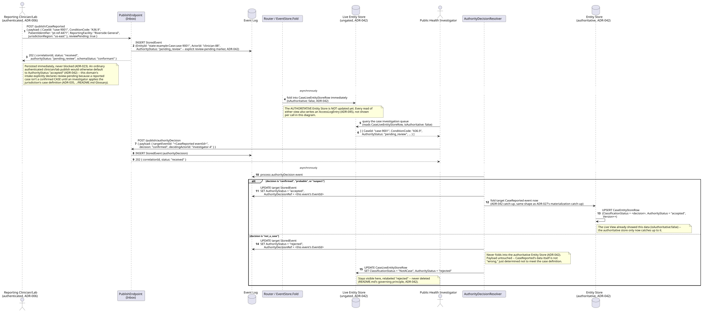

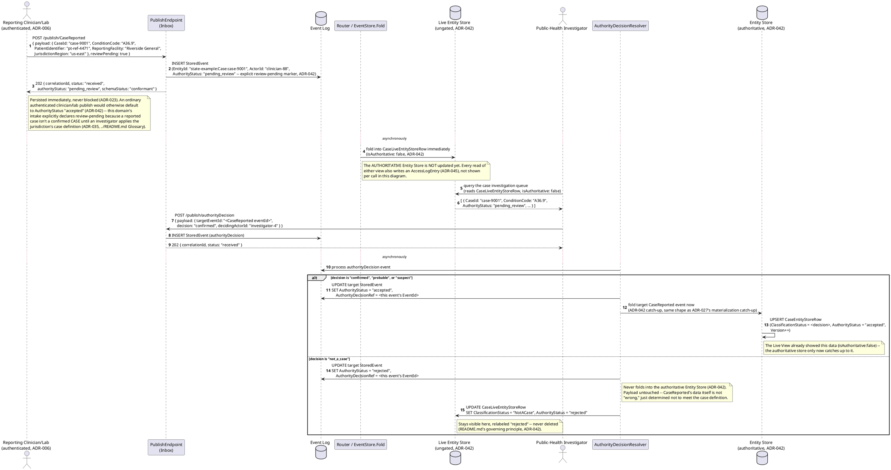

## Sequence diagram — an accepted case's outbound path: region-pinned replication and upstream regulatory reporting

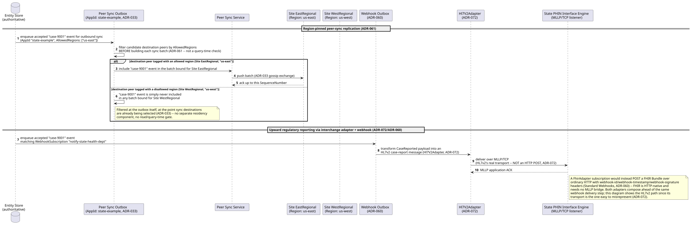

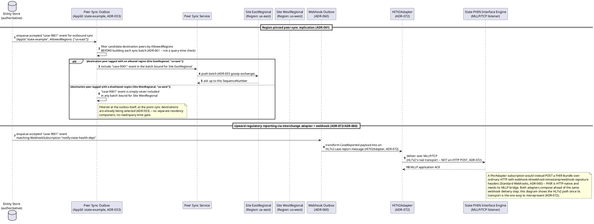

## Data model (ER diagram)

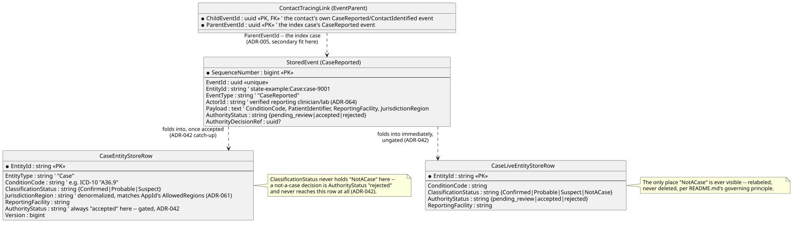

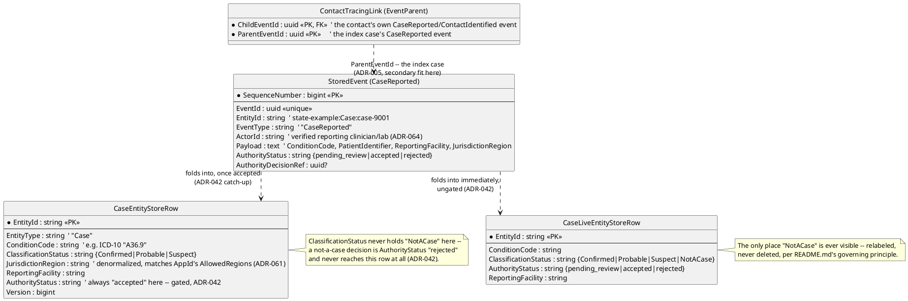

Full column lists live in
[`../../../data/event-log.md`](../../../data/event-log.md) and
[`../../../data/entity-store.md`](../../../data/entity-store.md) — this
diagram shows only what this doc's scenarios actually touch.

```csharp
// Illustrative only -- CaseReported and authorityDecision are ordinary
// registered event types, not new StoredEvent subclasses; shown here as
// the resolved shape of Payload plus the envelope fields these scenarios
// exercise (../../../data/event-log.md defines StoredEvent itself).

public class CaseReportedPayload
{
    public string CaseId { get; set; } = default!;           // resolves EntityId via EntityIdField "$.CaseId"
    public string ConditionCode { get; set; } = default!;    // e.g. ICD-10 "A36.9" -- the reportable condition
    public string PatientIdentifier { get; set; } = default!; // x-masking classified, requiredClaim "phi:view" (ADR-009) -- mechanics in masking.md, not repeated here
    public string ReportingFacility { get; set; } = default!;
    public string JurisdictionRegion { get; set; } = default!; // denormalized convenience copy -- the AppId's own AllowedRegions (ADR-061) is the real enforcement point, this field never substitutes for it
}

public class CaseEntityStoreRow
{
    public string EntityId { get; set; } = default!;          // state-example:Case:{caseId}, PK
    public string EntityType { get; set; } = default!;        // "Case"
    public string ConditionCode { get; set; } = default!;
    public string ClassificationStatus { get; set; } = default!; // "Confirmed" | "Probable" | "Suspect" -- set by the authorityDecision catch-up fold (ADR-042)
    public string JurisdictionRegion { get; set; } = default!;
    public string ReportingFacility { get; set; } = default!;
    public string AuthorityStatus { get; set; } = "accepted";   // always "accepted" -- gated rows only ever reach this table once accepted (ADR-042)
    public long Version { get; set; }
}

public class CaseLiveEntityStoreRow
{
    public string EntityId { get; set; } = default!;           // same key as CaseEntityStoreRow, PK
    public string ConditionCode { get; set; } = default!;
    public string ClassificationStatus { get; set; } = default!; // includes "NotACase" -- the one status value never seen in the authoritative row
    public string AuthorityStatus { get; set; } = default!;      // pending_review | accepted | rejected, most recent contributing event (ADR-042)
    public string ReportingFacility { get; set; } = default!;
}

public class ContactTracingLink
{
    // Modeled directly on EventParent (../../../data/event-log.md) -- no new
    // table. A contact's own reported/identified event declares the index
    // case's CaseReported EventId as a parent via parentEventIds (ADR-005).
    public Guid ChildEventId { get; set; }   // the contact's own event
    public Guid ParentEventId { get; set; }  // the index case's CaseReported event
}
```

## State machine — one case's lifecycle

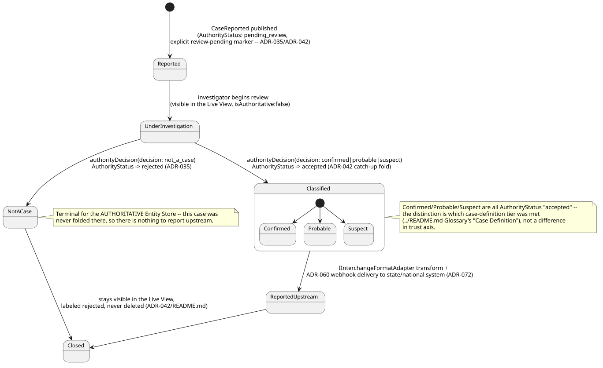

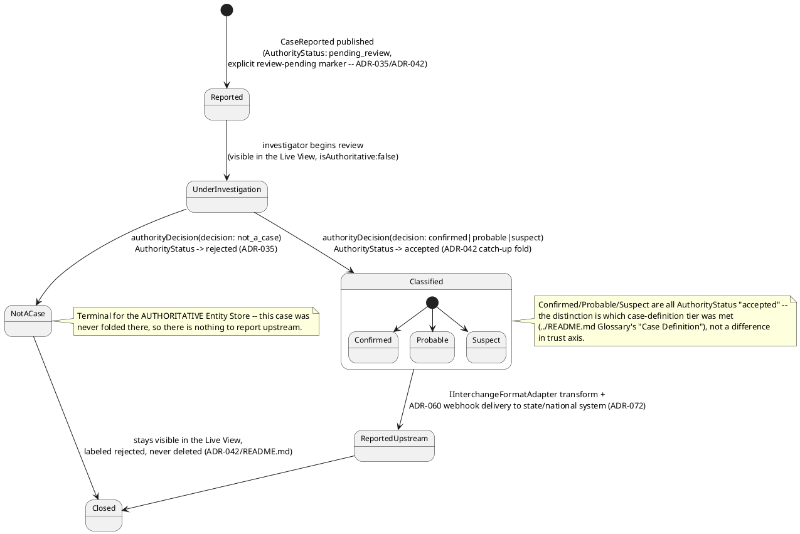

## Salt (UI mockup) — intake-to-report user flow, across the investigator's queue, decision, and post-fold record screens

### Screen 1: Case Investigation Queue — Live View, ungated


```plantuml
@startsalt
{
  { "Case Investigation Queue -- Jurisdiction: state-example (us-east)  (Live View, isAuthoritative: false)" }
  ..
  | Case ID   | Condition Code          | Reporting Facility  | AuthorityStatus  |
  | case-9001 | "A36.9 (Diphtheria)"    | "Riverside General" | pending_review   |
  | case-9002 | "A36.9 (Diphtheria)"    | "Lakeview Clinic"    | pending_review   |
  | case-8994 | "A15.0 (TB, pulmonary)" | "Riverside General" | accepted         |
}
@endsalt
```

Every row is a `CaseLiveEntityStoreRow`, not `CaseEntityStoreRow` — `case-
9001`/`case-9002` are still `pending_review` and, per `ADR-042`'s gate,
would not appear at all if this screen only read the authoritative Entity
Store. The `isAuthoritative: false` marker is shown once, at the
whole-view level, reusing `non-authoritative-capture.md`'s convention
directly. Clicking the `case-9001` row opens Screen 2, the investigator's
own classification decision for that one case.

### Screen 2: Investigator's classification decision screen

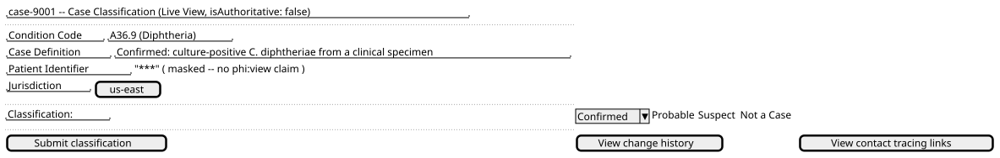

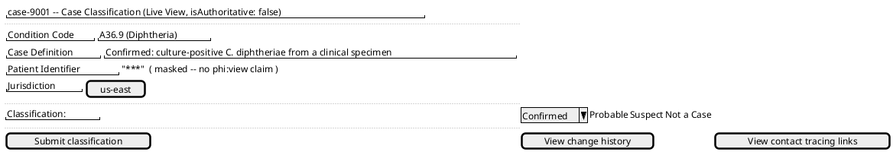

The masked `Patient Identifier` reads off `ADR-009` applied to a caller
without `phi:view`, per `masking.md` — not re-derived here. **Submit
classification** publishes the `authorityDecision` this doc's first
sequence diagram shows: `Confirmed`/`Probable`/`Suspect` all resolve to
`decision: "confirmed"`-shaped acceptance and move the flow to Screen 3;
`Not a Case` resolves to `decision: "not_a_case"` and the record instead
stays on Screen 1, relabeled `rejected`, never reaching Screen 3 at all
(`ADR-042`).

### Screen 3: Confirmed case record — authoritative, after region-pinned replication and upstream reporting

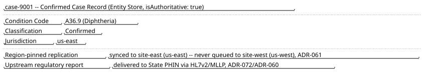

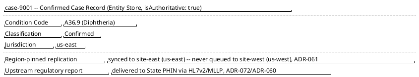

This is the same `state-example:Case:case-9001` record, now read from the
authoritative Entity Store rather than the Live View, folded there by this
doc's own `ADR-042` catch-up mechanism the moment classification is
accepted — and carried through this doc's second sequence diagram's own
region-pinning filter and `Hl7V2Adapter` delivery, exactly as shown there.
Which UI architecture actually renders any of these three screens
(`ADR-039`'s MVVM, or a named fallback) is out of scope here — see
[`../../../features/mvvm-client.md`](../../../features/mvvm-client.md).

## Gherkin

```gherkin
Feature: Reportable Condition Case Investigation
  As a public-health surveillance system
  I want a clinician/lab case report to be captured immediately but only
  folded into the authoritative record once an investigator classifies it,
  I want an accepted case to replicate only to peers in an allowed region,
  and I want an accepted case reportable upstream in the format the
  receiving system actually requires
  So that no report is ever blocked at intake, no case counts as confirmed
  before real investigation, jurisdictional residency rules are honored,
  and upward regulatory reporting obligations are met

  # Every request in this file carries a Bearer token with the events:publish
  # scope (reporting clinicians/labs, ADR-006) or a case-investigation claim
  # (public-health investigators) unless a scenario says otherwise -- see
  # ../../../features/auth.md for authentication/authorization itself, and
  # ../../../features/non-authoritative-capture.md for the general
  # AuthorityStatus/Live-View mechanics this feature applies concretely.
  # Every case query, by any actor, also writes an AccessLogEntry (ADR-045),
  # not asserted per-scenario below since the mechanism itself is unchanged
  # from access-log.md.

  Background:
    Given the event type "CaseReported" version 1 is registered with EntityIdField "$.CaseId" and schema:
      """
      {
        "type": "object",
        "properties": {
          "CaseId": { "type": "string" },
          "ConditionCode": { "type": "string" },
          "PatientIdentifier": { "type": "string" },
          "ReportingFacility": { "type": "string" },
          "JurisdictionRegion": { "type": "string" }
        },
        "required": ["CaseId", "ConditionCode", "PatientIdentifier", "ReportingFacility"]
      }
      """
    And "PatientIdentifier" on "CaseReported" is x-masking classified with requiredClaim "phi:view" (ADR-009)
    And the event type "authorityDecision" version 1 is registered with EntityIdField "$.targetEventId" and schema:
      """
      {
        "type": "object",
        "properties": {
          "targetEventId": { "type": "string" },
          "decision": { "type": "string" },
          "decidingActorId": { "type": "string" },
          "reason": { "type": "string" }
        },
        "required": ["targetEventId", "decision", "decidingActorId"]
      }
      """
    And the AppId "state-example" has AppDataResidencyPolicy AllowedRegions ["us-east"] (ADR-061)
    And peer "site-east" is tagged Region "us-east" and peer "site-west" is tagged Region "us-west" (ADR-051/ADR-061)
    And a WebhookSubscription "notify-state-health-dept" exists for AppId "state-example", EventTypes ["CaseReported"], using the "Hl7V2Adapter" interchange adapter (ADR-072/ADR-060)

  Scenario: A clinician-reported case is captured immediately and appears only in the Live View
    When "clinician-88" POSTs to "/publish/CaseReported" with body:
      """
      { "payload": { "CaseId": "case-9001", "ConditionCode": "A36.9", "PatientIdentifier": "pt-ref-4471", "ReportingFacility": "Riverside General", "JurisdictionRegion": "us-east" }, "reviewPending": true }
      """
    Then the response status should be 202 with authorityStatus "pending_review"
    And querying the Live View for "state-example:Case:case-9001" should return ConditionCode "A36.9", wrapped with "isAuthoritative": false
    And querying the authoritative Entity Store for "state-example:Case:case-9001" should NOT yet return a row
    # An ordinary authenticated publish defaults to AuthorityStatus "accepted" (ADR-042) --
    # this scenario's "reviewPending: true" is the explicit marker that starts it lower,
    # because a reported case isn't a confirmed CASE until investigated (ADR-035).

  Scenario: An investigator classifies a case as confirmed, and the authoritative Entity Store catches up
    Given a "CaseReported" event "evt-case-9001" was published for "case-9001" with ConditionCode "A36.9" and AuthorityStatus "pending_review"
    When "investigator-4" POSTs to "/publish/authorityDecision" with body:
      """
      { "payload": { "targetEventId": "evt-case-9001", "decision": "confirmed", "decidingActorId": "investigator-4" } }
      """
    Then the response status should be 202
    And the stored event "evt-case-9001" should have AuthorityStatus "accepted"
    And eventually the authoritative Entity Store for "state-example:Case:case-9001" should show ClassificationStatus "Confirmed"
    # "probable" and "suspect" decisions fold the exact same way -- all three are
    # AuthorityStatus "accepted", differing only in which case-definition tier was met.

  Scenario: An investigator determines a reported case is not a case, and it never reaches the authoritative Entity Store
    Given a "CaseReported" event "evt-case-9002" was published for "case-9002" with ConditionCode "A36.9" and AuthorityStatus "pending_review"
    When "investigator-4" POSTs to "/publish/authorityDecision" with body:
      """
      { "payload": { "targetEventId": "evt-case-9002", "decision": "not_a_case", "decidingActorId": "investigator-4", "reason": "culture negative, does not meet case definition" } }
      """
    Then the response status should be 202
    And the stored event "evt-case-9002" should have AuthorityStatus "rejected"
    And the authoritative Entity Store should NOT contain a row for "state-example:Case:case-9002"
    And the Live View for "state-example:Case:case-9002" should show ClassificationStatus "NotACase", still visible, never deleted
    # Payload is untouched -- the case data itself isn't "wrong," it just didn't meet
    # the jurisdiction's case definition (ADR-042's Annotate-shaped, non-destructive rejection).

  Scenario: An accepted case for a region-constrained AppId only syncs to peers tagged with an allowed region
    Given the authoritative Entity Store holds "state-example:Case:case-9001" with AuthorityStatus "accepted"
    And AppId "state-example" has AllowedRegions ["us-east"], peer "site-east" tagged "us-east", peer "site-west" tagged "us-west"
    When the peer-sync outbox builds its next outbound batches
    Then the batch bound for "site-east" should include the "case-9001" event
    And the batch bound for "site-west" should NOT include the "case-9001" event
    # Filtered at the outbox itself, at the point sync destinations are selected (ADR-061) --
    # not a query-time/read-time access check, and no change to ADR-034's EntityType shard key.

  Scenario: An accepted case is delivered upstream to a state system via an HL7v2 interchange adapter, over MLLP not HTTP
    Given the authoritative Entity Store holds "state-example:Case:case-9001" with AuthorityStatus "accepted"
    And WebhookSubscription "notify-state-health-dept" matches "CaseReported" events for AppId "state-example" via "Hl7V2Adapter"
    When the accepted "case-9001" event is picked up by the Webhook Outbox
    Then "Hl7V2Adapter" should transform the CaseReported payload into an HL7v2 case-report message
    And that message should be delivered to the state PHIN interface engine over MLLP/TCP, not an HTTP POST
    And a successful MLLP application ACK should mark the WebhookDeliveryCursor advanced past this event
    # HL7v2's real transport is MLLP/TCP (ADR-072, verified against how production hospital/
    # public-health interfaces actually work) -- a FhirAdapter subscription would instead
    # POST a signed FHIR Bundle over ordinary HTTP (ADR-060), not shown as a separate
    # scenario here since the composition point (adapter ahead of webhook delivery) is identical.

  Scenario: A contact identified during investigation links back to the index case via parentEventIds
    Given a "CaseReported" event "evt-case-9001" was published for index case "case-9001"
    When "investigator-4" publishes a "CaseReported" event for contact case "case-9010" with parentEventIds ["evt-case-9001"]
    Then the stored event for "case-9010" should have exactly one parent, "evt-case-9001"
    And querying lineage for "state-example:Case:case-9010" should list "state-example:Case:case-9001" as an ancestor
    # A real but secondary use of ADR-005's lineage DAG here (../README.md's own
    # classification) -- one index-case/contact edge, not a full outbreak-cluster
    # aggregation, which remains ADR-007's still-deferred derived-event mechanism.
```
