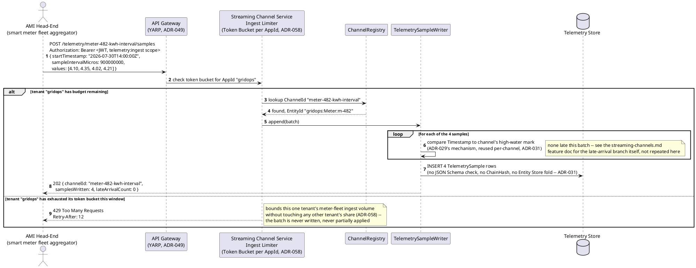
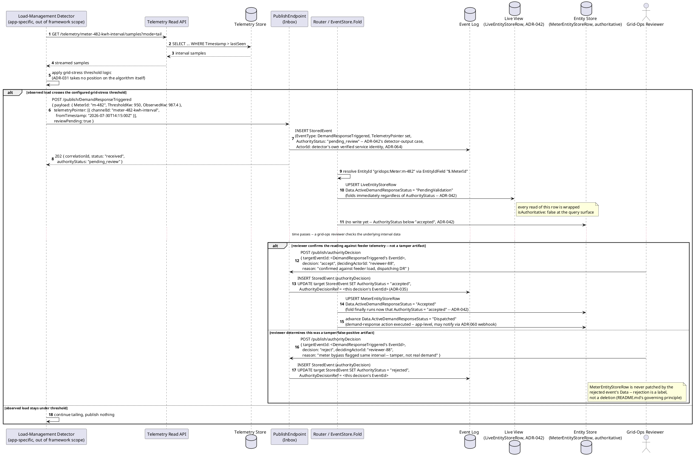
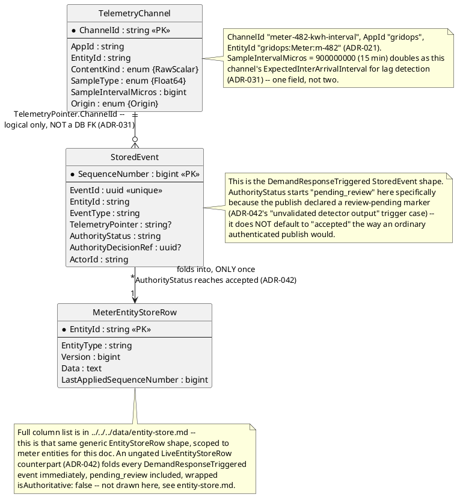
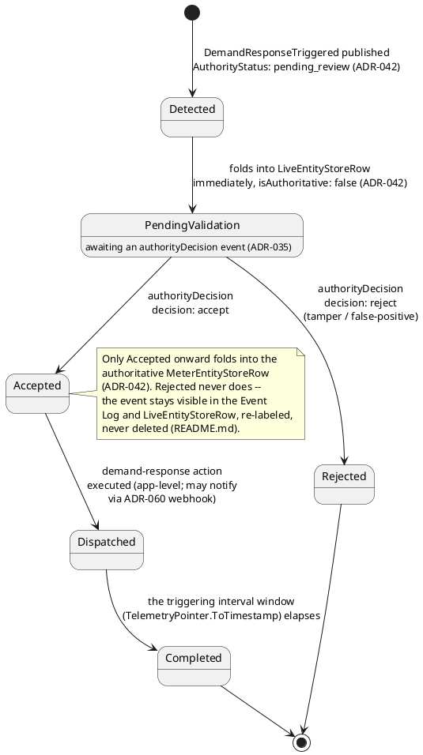
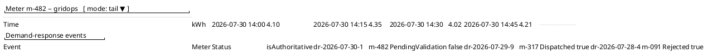
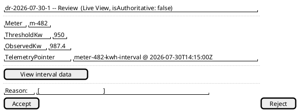
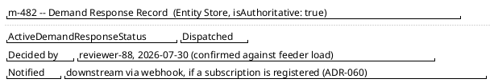

[← Utilities / Smart Metering](../README.md)

# Feature: Smart Meter Interval Data and Demand Response Event

Context: continuous smart-meter interval telemetry (readings every 15
minutes, the domain's own **Interval Data** term — see this domain's
`README.md#glossary`) ingested as a `TelemetryChannel`
(`ADR-031`, [`../../../data/streaming-and-attachments.md`](../../../data/streaming-and-attachments.md))
feeding a load-management detector that, on crossing a grid-stress
threshold, publishes an ordinary domain event captured as
non-authoritative until reviewed (`ADR-035`), rate-limited per utility
tenant at ingest (`ADR-058`). The envelope shape every `StoredEvent`
carries — `TelemetryPointer`, `AuthorityStatus`, `AuthorityDecisionRef`,
`ActorId` — is defined in
[`../../../data/event-log.md`](../../../data/event-log.md) and is not
redefined here. `AppId` here is the tenant-scoping key `ADR-030`
established, revised by `ADR-075` to the silo deployment model: this doc
assumes one utility operator's own deployment (`AppId` "gridops" scopes
applications *within* that operator's deployment — e.g. grid-ops vs.
billing — not multiple utility companies sharing one deployment). The
smart meter's own AMI head-end is modeled here as an ordinary server-to-
server `Telemetry Producer` (`ADR-031`'s own term) POSTing batches over
HTTP; `ADR-070`'s `IDeviceInputSource` seam is a *browser client*-side
mechanism (WebUSB/WebHID/Web Serial/Web Bluetooth/native-bridge feeding
the MVVM client's local outbox) and would only apply here if a grid
operator's own field technician used a browser-based tool to read a
meter directly — not the primary AMI ingestion path this doc models, so
it's named only for completeness, not built out.

This doc deliberately does **not** re-derive:
- `TelemetryChannel`'s general batch-ingestion, tail/replay, or
  derivation (`Origin`/`Derived`, resampling/aggregation) mechanics
  beyond this one use case — those are `ADR-031` itself and
  [`../../../features/streaming-channels.md`](../../../features/streaming-channels.md),
  which this doc's first sequence diagram deliberately parallels rather
  than repeats.
- `ADR-024`'s `ExpectedVersion`/`ConflictFlag` optimistic-concurrency
  fold mechanics — the `authorityDecision` events below patch the meter
  entity like any other event; nothing about them needs a fresh
  conflict-detection design.
- `ADR-007`'s still-**deferred** derived/materialized-events mechanism.
  A load forecast computed from this same interval data (this domain's
  own glossary entry for **Load Forecast**) is a natural future consumer
  of it, but `ADR-007` has no accepted design yet — named here only in
  passing, not designed.
- Masking, delegated access, DID/UCAN self-attestation, or erasure
  (`ADR-009`/`043`/`036`/`057`) — this domain's `README.md` scores all
  four weak/no-fit for smart-metering specifically (despite the
  README's own noted tension: GDPR/CCPA appears in the regulatory table
  for consumption data, but the technical-fit score doesn't reflect it
  strongly). This doc doesn't manufacture a masking/erasure scenario to
  compensate — that tension is tracked at the domain-README level, not
  resolved per-feature.

## Sequence diagram — continuous interval-data batch ingestion

Ingestion reuses `ADR-031`'s batch-first, fixed-rate shape directly — a
15-minute-interval channel omits a per-sample timestamp, sending
`StartTimestamp` + `SampleIntervalMicros` + a flat values array. What's
specific to this domain is the **tenant ingest limiter**: `ADR-058`
allows a service behind the Gateway to layer its own additional limiter
"bounding ingest throughput independently of request count" when it has
a resource-specific reason to — the Streaming Channel Service's own
Token Bucket, partitioned by `AppId`, is exactly that reason here,
bounding one utility tenant's entire meter fleet without starving
another tenant sharing the same deployment (or, post-`ADR-075`, without
one `AppId`'s applications starving another within the same silo).



## Sequence diagram — a demand-response trigger, validated or rejected

The **Load-Management Detector** is an application-specific consumer,
out of framework scope the same way `ADR-031` states for every detector
(no built-in grid-stress algorithm) — it tails the channel via the
ordinary `mode=tail` read path and, on crossing a configured threshold,
publishes an ordinary `DemandResponseTriggered` event carrying a
`TelemetryPointer` back to the interval window that triggered it. This
is exactly the "unvalidated detector output" trigger case `ADR-042`
names as a reason `AuthorityStatus` starts below `accepted` — the
detector's own review-pending marker, not a self-attestation. Validation
happens later, asynchronously, via an `authorityDecision` event
(`ADR-035`): only once it reaches `accepted` does the meter's
authoritative `EntityStoreRow` fold the demand-response state at all
(`ADR-042`) — until then it's visible only in the ungated
`LiveEntityStoreRow`, labeled `isAuthoritative: false`.



## Data model (ER diagram)



## State diagram



## Salt (UI mockup) — triage-to-dispatch flow, across the grid-ops queue, reviewer's decision, and dispatched-record screens

### Screen 1: Grid-operations dashboard — interval data and demand-response triage queue

Recent interval readings for one meter, and a triage list of
demand-response events by `AuthorityStatus`/lifecycle state. Pending
rows are a `LiveEntityStoreRow`-backed view (`isAuthoritative: false`,
`ADR-042`); the others are read from the authoritative
`MeterEntityStoreRow`/Event Log — the same generic flag-rendering
convention `ADR-024`/`ADR-035` already established
(`entity-concept.md`), not a bespoke indicator per concern.



`dr-2026-07-30-1` is the `DemandResponseTriggered` event from the second
sequence diagram, still `pending_review`; it would not appear at all if
this screen only read the authoritative `MeterEntityStoreRow`. Clicking
that row opens Screen 2, the reviewer's decision screen for that one
event.

### Screen 2: Grid-ops reviewer's decision screen



"View interval data" resolves the event's own `TelemetryPointer` back to
the channel window that triggered it, the same channel Screen 1 already
tails. Clicking **Accept** publishes an `authorityDecision` with
`decision: "accept"` (e.g. "confirmed against feeder load, dispatching
DR"); **Reject** publishes `decision: "reject"` (e.g. a meter-bypass
tamper finding). Either click dispatches the publish and moves the flow
to Screen 3 — the record's fate diverges there, not before.

### Screen 3: Meter record after the authoritative fold



This screen is only reached on an **Accept** decision: the
`MeterEntityStoreRow` now folds `ActiveDemandResponseStatus`, which
advances `Accepted → Dispatched` per the state diagram above. A
**Reject** decision instead never reaches this screen at all — the
event stays visible only on Screen 1/2, re-labeled `Rejected`, never
deleted (this domain's `README.md`'s governing principle).

## Gherkin

```gherkin
Feature: Smart Meter Interval Data and Demand Response Event
  As a utility grid operator
  I want continuous meter interval telemetry ingested on a fast path,
  a load-management detector to publish a demand-response trigger when
  grid stress is observed, and that trigger to stay non-authoritative
  until reviewed
  So that high-frequency meter data never pays for schema/hash-chain/fold
  cost it doesn't need, one tenant's meter fleet can't starve another's
  ingest budget, and a tamper/false-positive reading never silently
  drives a real dispatch action

  # Every request in this file carries a Bearer token with sufficient
  # scope (telemetry:ingest / telemetry:read / events:publish, ADR-031's
  # pattern) unless a scenario says otherwise. See auth.md for
  # authentication/authorization behavior itself. AppId "gridops" is one
  # utility operator's own silo deployment (ADR-075); EntityId format is
  # {appId}:{entityType}:{uniqueId} (ADR-021).

  Background:
    Given a "RawScalar" TelemetryChannel "meter-482-kwh-interval" is registered
      for entity "gridops:Meter:m-482" with SampleType "Float64",
      SampleIntervalMicros 900000000, Origin "Origin"
    And the event type "DemandResponseTriggered" version 1 is registered
      with ChangeKind "Partial" and EntityIdField "$.MeterId" and schema:
      """
      {
        "type": "object",
        "properties": { "MeterId": { "type": "string" }, "ThresholdKw": { "type": "number" }, "ObservedKw": { "type": "number" } },
        "required": ["MeterId", "ThresholdKw", "ObservedKw"]
      }
      """
    And AppId "gridops" has a Streaming Channel Service ingest Token Bucket
      limiter with PermitLimit 100 batches per minute (ADR-058)

  Scenario: A fixed-rate 15-minute interval batch ingests successfully within budget
    When AppId "gridops" POSTs to "/telemetry/meter-482-kwh-interval/samples" with body:
      """
      { "startTimestamp": "2026-07-30T14:00:00Z", "sampleIntervalMicros": 900000000,
        "values": [4.10, 4.35, 4.02, 4.21] }
      """
    Then the response status should be 202
    And 4 TelemetrySample rows should be written to channel "meter-482-kwh-interval"
    And none of those samples should have been JSON-Schema validated, hash-chained, or folded into the Entity Store
    # Interval data pays none of the event-log's per-item cost -- exactly
    # what ADR-031's separate fast path exists for.

  Scenario: A utility tenant exceeding its ingest token bucket gets 429
    Given AppId "gridops" has already exhausted its Token Bucket budget for this window
    When AppId "gridops" POSTs another batch to "/telemetry/meter-482-kwh-interval/samples"
    Then the response status should be 429
    And the response should include a "Retry-After" header
    And no TelemetrySample rows should be written for this request
    # Bounds this one tenant's whole meter fleet without affecting any
    # other tenant sharing the deployment (ADR-058) -- enforced at the
    # Streaming Channel Service specifically, not just the Gateway's
    # general-purpose limiter.

  Scenario: A load-management detector publishes a demand-response trigger as pending_review
    Given interval samples on channel "meter-482-kwh-interval" show 987.4 kW observed at "2026-07-30T14:15:00Z"
    When the detector POSTs to "/publish/DemandResponseTriggered" with body:
      """
      { "payload": { "MeterId": "m-482", "ThresholdKw": 950, "ObservedKw": 987.4 },
        "telemetryPointer": [{ "channelId": "meter-482-kwh-interval", "fromTimestamp": "2026-07-30T14:15:00Z" }],
        "reviewPending": true }
      """
    Then the response status should be 202
    And the stored event's AuthorityStatus should be "pending_review"
    And the stored event's TelemetryPointer should reference channel "meter-482-kwh-interval" at "2026-07-30T14:15:00Z"
    And the LiveEntityStoreRow for "gridops:Meter:m-482" should show ActiveDemandResponseStatus "PendingValidation" with isAuthoritative false
    And the authoritative MeterEntityStoreRow for "gridops:Meter:m-482" should NOT yet reflect this event
    # A detector's own unvalidated output is exactly the "explicit
    # review-pending marker" trigger case ADR-042 names -- it does not
    # default to "accepted" the way an ordinary authenticated publish would.

  Scenario: A validated demand-response event reaches accepted and is dispatched
    Given a "DemandResponseTriggered" event "e-1" is pending_review for "gridops:Meter:m-482"
    When a grid-ops reviewer POSTs to "/publish/authorityDecision" with body:
      """
      { "targetEventId": "e-1", "decision": "accept", "decidingActorId": "reviewer-88",
        "reason": "confirmed against feeder load, dispatching DR" }
      """
    Then event "e-1"'s AuthorityStatus should become "accepted"
    And event "e-1"'s AuthorityDecisionRef should reference the authorityDecision event
    And the authoritative MeterEntityStoreRow for "gridops:Meter:m-482" should now fold ActiveDemandResponseStatus "Accepted"
    And ActiveDemandResponseStatus should subsequently advance to "Dispatched"
    # Only "accept" makes the Entity Store fold at all (ADR-042) -- the
    # patch was sitting only in the ungated LiveEntityStoreRow until now.

  Scenario: A demand-response trigger is rejected as a tamper/false-positive artifact
    Given a "DemandResponseTriggered" event "e-2" is pending_review for "gridops:Meter:m-482"
    When a grid-ops reviewer POSTs to "/publish/authorityDecision" with body:
      """
      { "targetEventId": "e-2", "decision": "reject", "decidingActorId": "reviewer-88",
        "reason": "meter bypass flagged the same interval -- tamper, not real demand" }
      """
    Then event "e-2"'s AuthorityStatus should become "rejected"
    And the authoritative MeterEntityStoreRow for "gridops:Meter:m-482" should never be patched by event "e-2"'s Data
    And event "e-2" should remain visible in the Event Log and the LiveEntityStoreRow, re-labeled "rejected", never deleted
    # Rejection is a label on an otherwise-persisted event, never a
    # deletion (README.md's "never lose or corrupt data" principle) --
    # the same posture ADR-035 already established generally.
```
