# Feature: Telematics-Triggered Work Order and Fuel-Log Reconciliation

Context: this doc walks continuous vehicle/equipment telematics (engine
hours, fault codes, fuel level) through a fault-detection process that
publishes a VMRS-coded maintenance work order pointing back into the raw
signal, alongside a driver's daily inspection sign-off and a
telematics-vs-receipt fuel-log reconciliation for IFTA reporting — the
concrete, end-to-end use case this domain's own
[`README.md`](../README.md#applicable-adrs) names `ADR-031`, `ADR-005`,
`ADR-035`, `ADR-066`, and `ADR-070` against. It exercises:

- **`ADR-031`** (streaming channels) — telematics data (engine hours,
  fault codes, fuel level) lives in a `TelemetryChannel`/`TelemetrySample`
  fast path, structured per ISO 15143-3/AEMP 2.0's own data model,
  batch-ingested from an ELD/telematics gateway (`ADR-070`), tailed by a
  fault-detection process that is explicitly an *application* concern,
  not a core-engine one. Full mechanism detail (batch wire format,
  `mode=tail`/`mode=replay`, `ChannelLagDetected`, redaction) lives in
  [`../../../features/streaming-channels.md`](../../../features/streaming-channels.md)
  — not re-derived here.
- **`ADR-005`** (event lineage/`parentEventIds`) — the VMRS-coded work
  order the detector publishes may declare `parentEventIds` pointing at a
  genuinely causal prior event (e.g. an earlier work order on the same
  component) — a different axis from `TelemetryPointer` below, never
  conflated with it (`CLAUDE.md`'s "a repeated relationship gets its own
  envelope field" convention). Full DAG mechanics are in
  [`../../../features/event-chains.md`](../../../features/event-chains.md)
  — not re-derived here.
- **`ADR-035`**/**`ADR-042`** (non-authoritative capture, gated
  authoritative publish) — a fault-detection process publishing a work
  order it isn't fully confident in sets an explicit review-pending
  marker on publish (`ADR-042`'s own framing: "an automated detector that
  thinks it has found a pattern but whose result hasn't been validated
  yet"). Full `AuthorityStatus` lifecycle/Live-View mechanics are in
  [`../../../features/non-authoritative-capture.md`](../../../features/non-authoritative-capture.md)
  — not re-derived here.
- **`ADR-066`** (digital sign-off) — a Driver Vehicle Inspection Report
  (`49 CFR 396.11`/`396.13`) requires the driver's own dated signature,
  and a mechanic's own distinct certification signature once a reported
  defect is repaired — two real, legally-required sign-offs on related
  records, not one. Full signature-capture mechanics (`Signature` field,
  `RequiredSignature` schema extension) are in `ADR-066` itself — not
  re-derived here.
- **`ADR-060`** (outbound webhooks) — a reconciled fuel log notifies a
  downstream fuel-tax reporting vendor via a registered
  `WebhookSubscription`, the same primary-fit use industrial IoT's own
  feature doc makes for a maintenance alert.

**What this doc is explicitly *not*.** This domain's `README.md` notes
that `ADR-007` (derived/materialized event types) is still Deferred and
scores industrial IoT, not this domain, as the strongest candidate for
it. The fault-detection process below is an ordinary, hand-written
application process (not a registered `DerivationDefinition`), and every
event it publishes goes through the completely normal publish path
(`ADR-020`/`ADR-023`) — a real, working *bridge* mechanism, the identical
shape industrial IoT's own `sensor-driven-maintenance-alert.md` already
established for this framework, applied here to VMRS-coded work orders
and IFTA fuel-log reconciliation instead of a generic maintenance alert.

**Out of scope, covered elsewhere:**
- `ADR-019`'s hash-chain mechanics (`ChainHash`/`PayloadHash`) — see
  [`../../../data/event-log.md`](../../../data/event-log.md).
- `ADR-031`'s full batch-ingestion wire format, `mode=tail`/`mode=replay`
  shape, and `RedactedRange` — see
  [`../../../features/streaming-channels.md`](../../../features/streaming-channels.md).
- `ADR-042`'s Live View / authoritative Entity Store gating mechanics in
  full — see
  [`../../../features/non-authoritative-capture.md`](../../../features/non-authoritative-capture.md).
- `ADR-066`'s signature-capture mechanics (`Signature` envelope field,
  step-up requirement) in full — see `docs/adrs/adr-066-digital-signoff.md`.
- `ADR-032`'s binary-attachment mechanics (used here for the fuel
  receipt image) — see
  [`../../../features/attachments.md`](../../../features/attachments.md).
- Auth scopes/claims (`telemetry:ingest`, `telemetry:read`,
  `events:publish`) — see [`../../../features/auth.md`](../../../features/auth.md).

Entity/event shapes used below are grounded in
[`../../../data/event-log.md`](../../../data/event-log.md) (`StoredEvent`
envelope fields) and [`../../../data/entity-store.md`](../../../data/entity-store.md)
(`EntityStoreRow`); `TelemetryChannel`/`TelemetrySample` have no existing
class sketch under `docs/data/` (`ADR-031` describes their fields in
prose only) — the ER section below sketches them illustratively, grounded
in that prose and in industrial IoT's own identical sketch, not copied
from an existing file.

## Sequence diagram — telematics-triggered work order (confident vs. low-confidence detection)

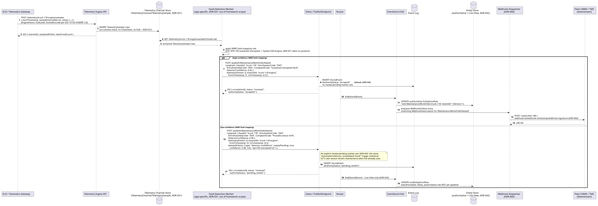

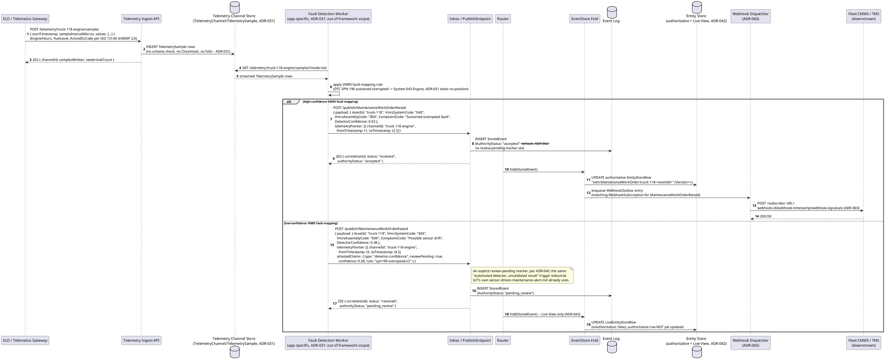

## Sequence diagram — driver DVIR sign-off, mechanic repair certification, and fuel-log reconciliation

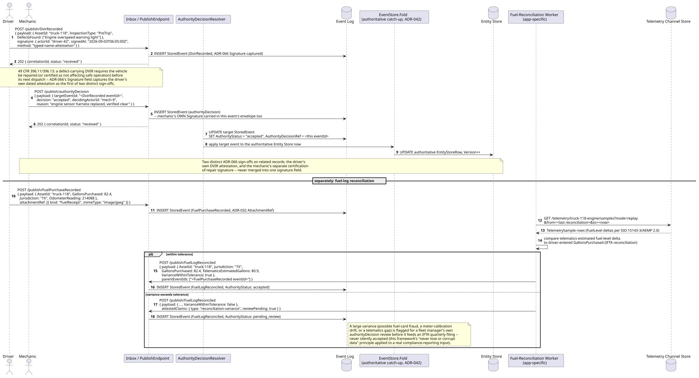

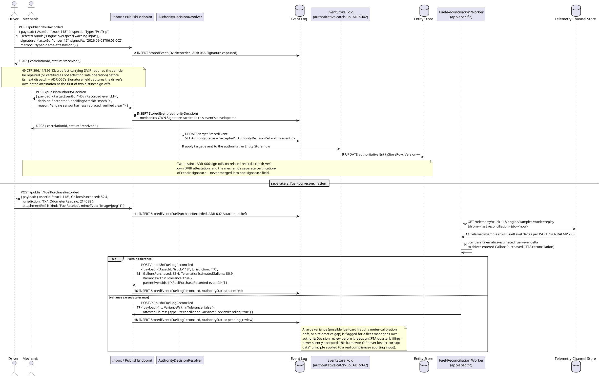

## Data model (ER diagram)

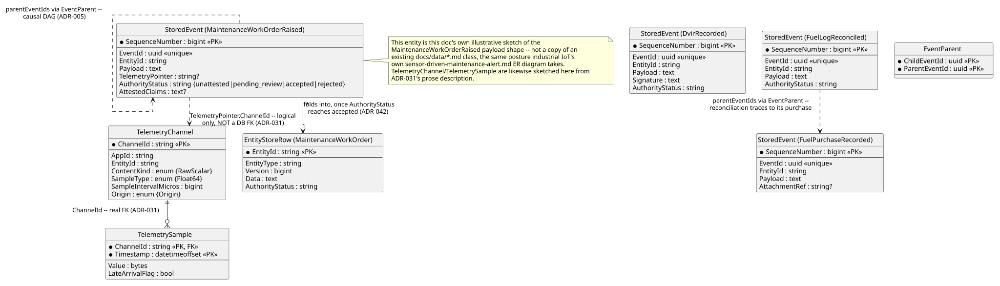

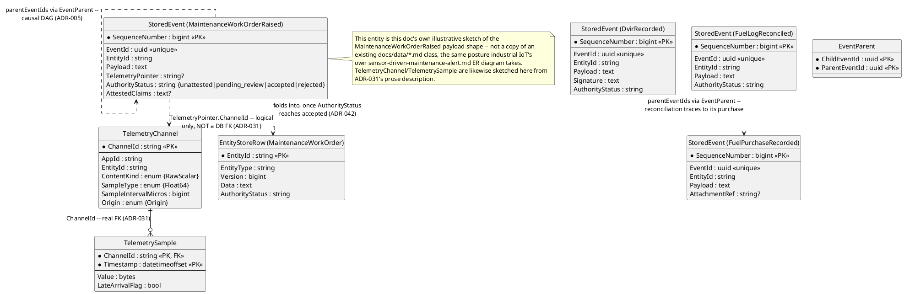

```csharp
// This doc's own illustrative sketch -- ADR-031 describes TelemetryChannel/
// TelemetrySample fields in prose only; no docs/data/*.md class exists yet
// for the streaming-channel entities, same posture as industrial IoT's own doc.
public class TelemetryChannel
{
    public string ChannelId { get; set; } = default!;   // PK
    public string AppId { get; set; } = default!;         // ADR-030
    public string EntityId { get; set; } = default!;      // {appId}:{entityType}:{uniqueId} -- ADR-021, ADR-031
    public string ContentKind { get; set; } = "RawScalar"; // RawScalar for engine hours/fuel level/DTC flags (ADR-031)
    public string SampleType { get; set; } = "Float64";
    public long SampleIntervalMicros { get; set; }         // fixed-rate channel (ADR-031)
    public string Origin { get; set; } = "Origin";         // Origin | Derived (ADR-031) -- always Origin in this doc
}

public class TelemetrySample
{
    public string ChannelId { get; set; } = default!;     // PK, FK -> TelemetryChannel
    public DateTimeOffset Timestamp { get; set; }           // PK
    public double Value { get; set; }                       // raw scalar reading (EngineHours | FuelLevel | ActiveDtcCode)
    public bool LateArrivalFlag { get; set; }                // ADR-029's high-water-mark check, reused per-channel (ADR-031)
}

// MaintenanceWorkOrderRaised's Payload shape -- domain-specific fields inside the
// StoredEvent envelope already defined in ../../../data/event-log.md.
public class MaintenanceWorkOrderRaisedPayload
{
    public string AssetId { get; set; } = default!;         // resolves EntityId via EntityIdField "$.AssetId" (ADR-021)
    public string VmrsSystemCode { get; set; } = default!;  // VMRS System code, e.g. "043" (Engine)
    public string VmrsAssemblyCode { get; set; } = default!; // VMRS Assembly code, e.g. "004"
    public string ComplaintCode { get; set; } = default!;   // VMRS complaint/cause free-text or coded reason
    public double DetectorConfidence { get; set; }           // detector's own confidence score -- app-specific, not a framework field
}

// DvirRecorded's Payload shape.
public class DvirRecordedPayload
{
    public string AssetId { get; set; } = default!;
    public string InspectionType { get; set; } = default!;  // "PreTrip" | "PostTrip"
    public List<string> DefectsFound { get; set; } = new();  // 49 CFR 396.11 -- empty list is a defect-free DVIR
}

// FuelPurchaseRecorded / FuelLogReconciled Payload shapes.
public class FuelPurchaseRecordedPayload
{
    public string AssetId { get; set; } = default!;
    public double GallonsPurchased { get; set; }
    public string Jurisdiction { get; set; } = default!;      // IFTA member jurisdiction, e.g. "TX"
    public long OdometerReading { get; set; }
}

public class FuelLogReconciledPayload
{
    public string AssetId { get; set; } = default!;
    public string Jurisdiction { get; set; } = default!;
    public double GallonsPurchased { get; set; }
    public double TelematicsEstimatedGallons { get; set; }    // derived from ISO 15143-3/AEMP 2.0 FuelLevel deltas
    public bool VarianceWithinTolerance { get; set; }
}
```

Full envelope column lists (`TelemetryPointer`, `AuthorityStatus`,
`AttestedClaims`, `Signature`, `AttachmentRef`, `EventParent`) are in
[`../../../data/event-log.md`](../../../data/event-log.md); the
authoritative/`LiveEntityStoreRow` split is in
[`../../../data/entity-store.md`](../../../data/entity-store.md) — this
diagram shows only what this doc's own scenarios touch.

## State machine — `MaintenanceWorkOrderRaised` lifecycle


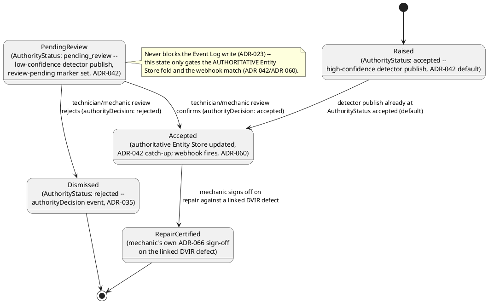

## Salt (UI mockup) — detection to fleet-manager review, DVIR sign-off, and fuel-log reconciliation

### Screen 1: Fleet manager dashboard — work-order queue across assets


```plantuml
@startsalt
{
  { "Fleet Manager Dashboard -- Work Orders  (mixed isAuthoritative)" }
  ..
  | Work Order | Asset     | VmrsSystem | DetectorConfidence | AuthorityStatus | isAuthoritative |
  | wo-21      | truck-118 | 043 Engine | 0.92               | accepted        | true            |
  | wo-19      | truck-118 | 043 Engine | 0.38               | pending_review  | false           |
  | wo-20      | truck-206 | 018 Brakes | 0.95               | accepted        | true            |
}
@endsalt
```

`wo-21`/`wo-20` are high-confidence detector publishes, already
`accepted` by `ADR-042`'s default and read from the authoritative
`EntityStoreRow`. `wo-19` is the low-confidence branch from the first
sequence diagram above — visible only via `LiveEntityStoreRow`, wrapped
`isAuthoritative: false`. Clicking `wo-19` opens Screen 2, the review
screen for that one pending work order.

### Screen 2: Mechanic's review and DVIR repair-certification screen

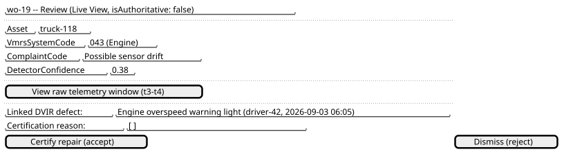

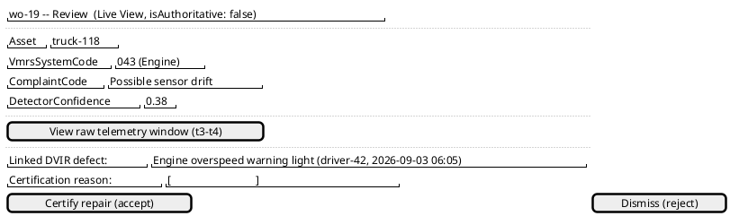

"View raw telemetry window" resolves the work order's own
`TelemetryPointer` — the same deep-link mechanism `ADR-031` defines,
applied to this `RawScalar` channel's tail/replay read path
(`streaming-channels.md`). Clicking **Certify repair** publishes the
mechanic's own `authorityDecision` with `decision: "accepted"`, carrying
the mechanic's own `Signature` (`ADR-066`) — a second, distinct sign-off
from the driver's own DVIR attestation already on file — and moves the
flow to Screen 3. **Dismiss** publishes `decision: "rejected"` instead.

### Screen 3: Fuel-log reconciliation review

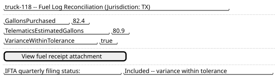

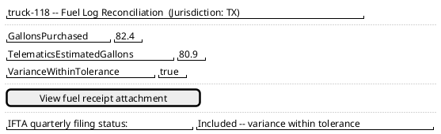

Reached from the reconciler's own automated `FuelLogReconciled` publish
in the second sequence diagram above. "View fuel receipt attachment"
resolves the purchase event's own `AttachmentRef` (`ADR-032`). A
variance exceeding tolerance would instead show `VarianceWithinTolerance:
false` and a pending fleet-manager `authorityDecision` review, exactly
mirroring Screen 2's own review pattern, before the filing status line
would ever read "Included."

## Gherkin

```gherkin
Feature: Telematics-Triggered Work Order and Fuel-Log Reconciliation
  As a fleet manager relying on continuous vehicle telematics
  I want a fault-detection process to raise a VMRS-coded work order that
  points back into the exact raw signal window that triggered it
  So that a high-confidence work order acts immediately, a low-confidence
  one waits for a mechanic's own review before becoming authoritative, a
  driver's DVIR and a mechanic's repair certification are both captured
  as real dated sign-offs, and a fuel purchase is reconciled against
  telematics data before it feeds an IFTA quarterly filing

  # Every request in this file carries a Bearer token with sufficient scope
  # (telemetry:ingest for sample ingestion, telemetry:read for tail/replay,
  # events:publish for the detector's/driver's/mechanic's published events)
  # unless a scenario says otherwise. See ../../../features/auth.md for
  # authentication/authorization behavior itself. This doc's detector and
  # reconciler are application processes, not framework mechanisms
  # (ADR-031) -- and NOT an ADR-007 derived-event-type registration, which
  # does not exist as a real mechanism (ADR-007 is Deferred).

  Background:
    Given the entity "vem:Asset:truck-118" exists (ADR-021)
    And a "RawScalar" TelemetryChannel "truck-118-engine" is registered for entity "vem:Asset:truck-118"
      with SampleType "Float64", SampleIntervalMicros 500000, Origin "Origin"
    And the event type "MaintenanceWorkOrderRaised" version 1 is registered with schema:
      """
      {
        "type": "object",
        "properties": {
          "AssetId": { "type": "string" },
          "VmrsSystemCode": { "type": "string" },
          "VmrsAssemblyCode": { "type": "string" },
          "ComplaintCode": { "type": "string" },
          "DetectorConfidence": { "type": "number" }
        },
        "required": ["AssetId", "VmrsSystemCode", "ComplaintCode"]
      }
      """
      with EntityIdField "$.AssetId"
    And the event type "DvirRecorded" version 1 is registered with EntityIdField "$.AssetId"
      requiring a Signature on publish (ADR-066)
    And the event type "FuelPurchaseRecorded" version 1 is registered with EntityIdField "$.AssetId"
    And the event type "FuelLogReconciled" version 1 is registered with EntityIdField "$.AssetId"
    And the event type "authorityDecision" version 1 is registered with EntityIdField "$.targetEventId"
    And a "WebhookSubscription" is registered for AppId "vem" on event type "MaintenanceWorkOrderRaised" targeting the fleet's CMMS endpoint

  Scenario: A high-confidence detector publish lands accepted immediately
    Given channel "truck-118-engine" has samples spanning "2026-09-03T08:00:00Z" to "2026-09-03T08:00:10Z"
    And a detector tailing channel "truck-118-engine" (mode=tail) maps a sustained SPN 190 overspeed fault to VMRS System "043" with confidence 0.92
    When the detector POSTs to "/publish/MaintenanceWorkOrderRaised" with body:
      """
      { "payload": { "AssetId": "truck-118", "VmrsSystemCode": "043", "VmrsAssemblyCode": "004", "ComplaintCode": "Sustained overspeed fault", "DetectorConfidence": 0.92 },
        "telemetryPointer": [{ "channelId": "truck-118-engine", "fromTimestamp": "2026-09-03T08:00:00Z", "toTimestamp": "2026-09-03T08:00:10Z" }] }
      """
    Then the response status should be 202
    And the response body should include "authorityStatus": "accepted"
    And the stored event's TelemetryPointer should reference channel "truck-118-engine" from "2026-09-03T08:00:00Z" to "2026-09-03T08:00:10Z"
    And eventually the authoritative EntityStoreRow for the resulting MaintenanceWorkOrder entity should reflect VmrsSystemCode "043"
    # No review-pending marker was set -- AuthorityStatus defaults to "accepted" for an
    # ordinary already-authenticated publish (ADR-042); this is an ordinary publish
    # carrying TelemetryPointer (ADR-031), not an ADR-007 derived event.

  Scenario: A low-confidence detector publish starts pending_review and does not yet reach the authoritative Entity Store
    Given channel "truck-118-engine" has samples spanning "2026-09-03T09:00:00Z" to "2026-09-03T09:00:04Z"
    And a detector tailing channel "truck-118-engine" detects a weak, uncertain SPN 190 pattern with confidence 0.38
    When the detector POSTs to "/publish/MaintenanceWorkOrderRaised" with body:
      """
      { "payload": { "AssetId": "truck-118", "VmrsSystemCode": "043", "VmrsAssemblyCode": "004", "ComplaintCode": "Possible sensor drift", "DetectorConfidence": 0.38 },
        "telemetryPointer": [{ "channelId": "truck-118-engine", "fromTimestamp": "2026-09-03T09:00:00Z", "toTimestamp": "2026-09-03T09:00:04Z" }],
        "attestedClaims": { "type": "detector-confidence", "reviewPending": true, "confidence": 0.38, "rule": "spn190-overspeed-v2" } }
      """
    Then the response status should be 202
    And the response body should include "authorityStatus": "pending_review"
    And querying the Live View for the resulting MaintenanceWorkOrder entity should return ComplaintCode "Possible sensor drift", wrapped with "isAuthoritative": false
    And querying the authoritative Entity Store for that entity should NOT yet reflect that work order

  Scenario: A driver's DVIR is recorded with a signed defect, then a mechanic certifies the repair with a distinct sign-off
    Given the driver "driver-42" begins a pre-trip inspection of "truck-118"
    When the driver POSTs to "/publish/DvirRecorded" with body:
      """
      { "payload": { "AssetId": "truck-118", "InspectionType": "PreTrip", "DefectsFound": ["Engine overspeed warning light"] },
        "signature": { "actorId": "driver-42", "signedAt": "2026-09-03T06:05:00Z", "method": "typed-name-attestation" } }
      """
    Then the response status should be 202
    And the stored "DvirRecorded" event should carry a Signature for actor "driver-42"
    When the mechanic "mech-9" POSTs to "/publish/authorityDecision" with body:
      """
      { "payload": { "targetEventId": "<the DvirRecorded eventId>", "decision": "accepted", "decidingActorId": "mech-9", "reason": "engine sensor harness replaced, verified clear" },
        "signature": { "actorId": "mech-9", "signedAt": "2026-09-03T14:30:00Z", "method": "typed-name-attestation" } }
      """
    Then the response status should be 202
    And the "DvirRecorded" event should have AuthorityStatus "accepted"
    And the authorityDecision event should carry its own Signature for actor "mech-9", distinct from the driver's own Signature
    # 49 CFR 396.11/396.13: two real, dated, legally-required sign-offs on
    # related records -- the driver's own inspection attestation and the
    # mechanic's own separate certification-of-repair signature (ADR-066),
    # never merged into a single signature field.

  Scenario: A fuel purchase reconciles within tolerance against telematics-estimated consumption
    Given a "FuelPurchaseRecorded" event "fuel-55" was published for "truck-118" with GallonsPurchased 82.4 in Jurisdiction "TX"
    And channel "truck-118-engine" FuelLevel samples over the matching window estimate 80.9 gallons consumed
    When the fuel-reconciliation worker computes the variance between 82.4 and 80.9
    And publishes "/publish/FuelLogReconciled" with body:
      """
      { "payload": { "AssetId": "truck-118", "Jurisdiction": "TX", "GallonsPurchased": 82.4, "TelematicsEstimatedGallons": 80.9, "VarianceWithinTolerance": true },
        "parentEventIds": ["fuel-55"] }
      """
    Then the response status should be 202
    And the response body should include "authorityStatus": "accepted"
    And the new event's EventParents should record "fuel-55" as a parent
    # parentEventIds links the reconciliation back to the specific purchase it
    # reconciles (ADR-005) -- a different question from TelemetryPointer, which
    # this event does not itself carry (the pointer already lives on the raw
    # telemetry samples the reconciler read, not on the reconciliation event).

  Scenario: A fuel purchase reconciliation exceeding tolerance is flagged for fleet-manager review before an IFTA filing
    Given a "FuelPurchaseRecorded" event "fuel-56" was published for "truck-118" with GallonsPurchased 140.0 in Jurisdiction "TX"
    And channel "truck-118-engine" FuelLevel samples over the matching window estimate only 61.0 gallons consumed
    When the fuel-reconciliation worker computes the variance between 140.0 and 61.0
    And publishes "/publish/FuelLogReconciled" with body:
      """
      { "payload": { "AssetId": "truck-118", "Jurisdiction": "TX", "GallonsPurchased": 140.0, "TelematicsEstimatedGallons": 61.0, "VarianceWithinTolerance": false },
        "parentEventIds": ["fuel-56"],
        "attestedClaims": { "type": "reconciliation-variance", "reviewPending": true } }
      """
    Then the response status should be 202
    And the response body should include "authorityStatus": "pending_review"
    And this reconciliation should NOT be included in an IFTA quarterly filing export until a fleet manager's authorityDecision resolves it
    # A large, unexplained variance (possible fuel-card fraud, a meter-
    # calibration drift, or a telematics gap) is never silently accepted into
    # a real compliance-reporting input (this framework's "never lose or
    # corrupt data" principle, applied here as "never silently misreport data").

  Scenario: A fleet manager rejects a low-confidence work order, and it never reaches the authoritative Entity Store
    Given a "MaintenanceWorkOrderRaised" event "wo-19" was published for "truck-118" with ComplaintCode "Possible sensor drift" and AuthorityStatus "pending_review"
    When the fleet manager POSTs to "/publish/authorityDecision" with body:
      """
      { "payload": { "targetEventId": "wo-19", "decision": "rejected", "decidingActorId": "fleet-mgr-3", "reason": "confirmed sensor recalibration, no repair needed" } }
      """
    Then the response status should be 202
    And the stored event "wo-19" should have AuthorityStatus "rejected"
    And the authoritative Entity Store row for "truck-118"'s work orders should never reflect "wo-19"'s ComplaintCode
    And "wo-19" should remain visible in the Event Log and the Live View, labeled "rejected" -- never deleted

  Scenario: An accepted work order notifies the downstream CMMS via a signed webhook delivery
    Given a "WebhookSubscription" is registered for event type "MaintenanceWorkOrderRaised" targeting the fleet's CMMS endpoint
    And a "MaintenanceWorkOrderRaised" event "wo-21" reaches AuthorityStatus "accepted" for "truck-118"
    Then a WebhookOutbox entry should be enqueued for "wo-21" against that subscription
    And the delivered payload should carry "webhook-id", "webhook-timestamp", and "webhook-signature" headers (ADR-060)
    # At-least-once delivery, retried with backoff (ADR-060) -- the CMMS is
    # responsible for idempotent handling keyed on webhook-id, same as any
    # other Standard Webhooks consumer.
```
