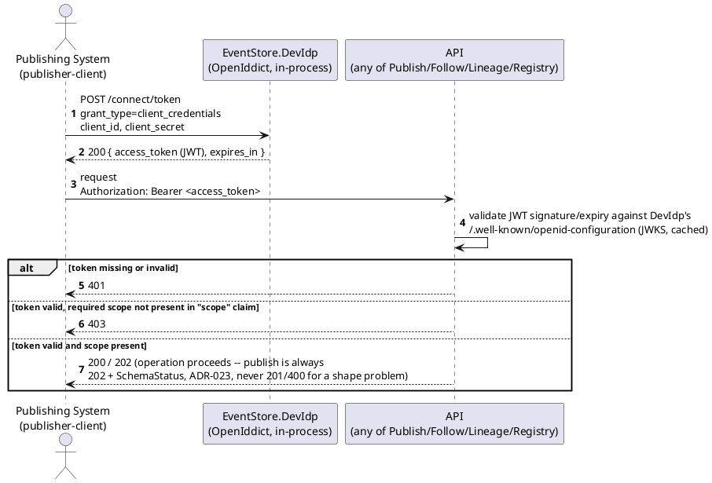
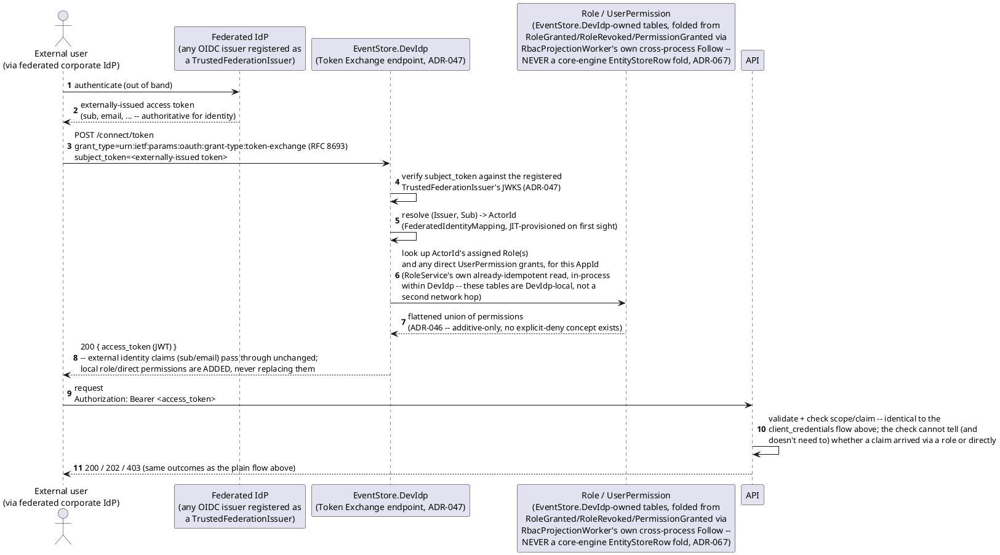
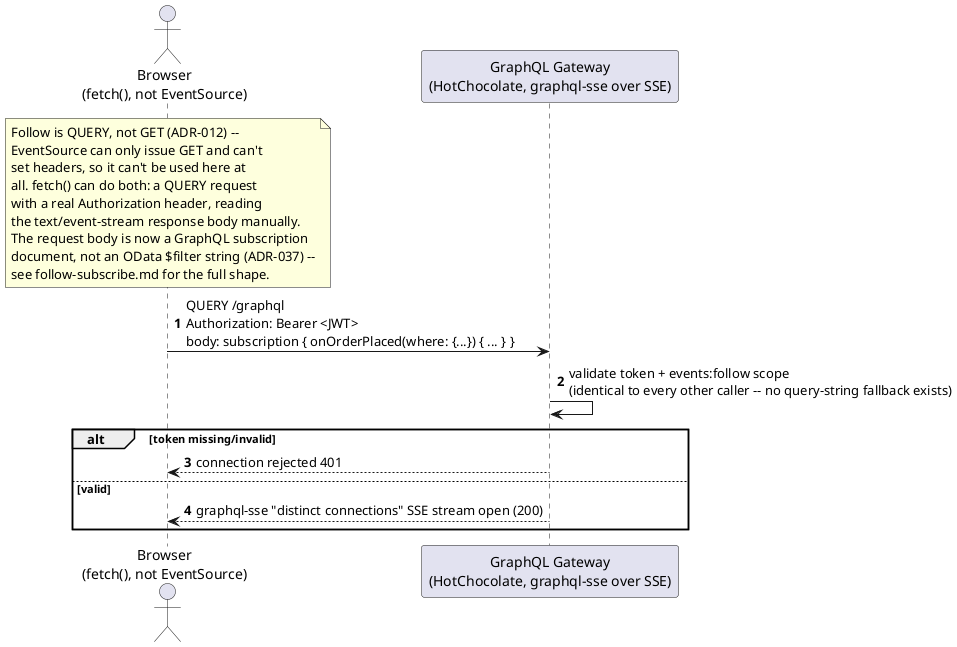
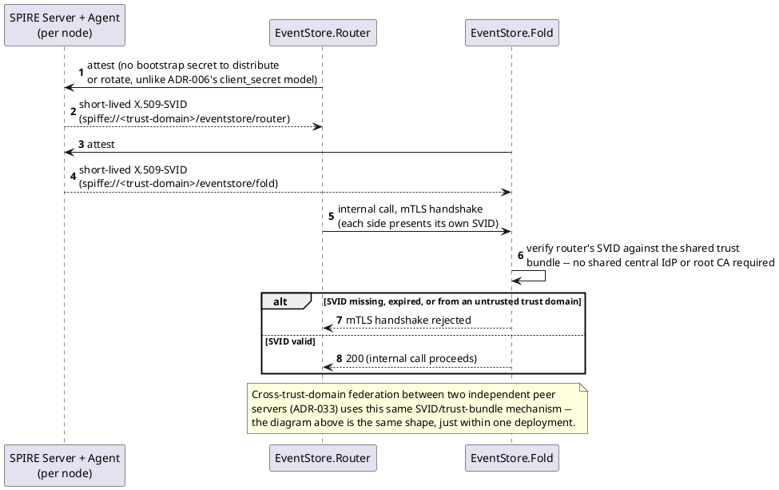
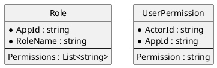

# Feature: OAuth2/OIDC bearer-token authentication and scope-based authorization

> **Partially superseded.** Every token now also carries a DPoP proof
> (`ADR-017`) not shown below. `EventStore.DevIdp` also performs OAuth
> Token Exchange for self-attested UCANs (`ADR-036`) and for
> header-incapable-client tickets (`ADR-040` — streaming playback /
> attachment retrieval URLs, resolved via an RFC 7662-shaped
> introspection call, not shown below). **Resolved this pass**: `ADR-046`
> (RBAC, as revised by `ADR-067` — see the new RBAC/claims-augmentation
> sequence diagram and ER sketch below), `ADR-047` (claims augmentation
> for a federated external IdP), `ADR-048` (SPIFFE/SPIRE internal workload
> identity, its own new section below, distinguished from the external
> caller identity this file otherwise covers), `ADR-064` (`ActorId`
> captured on every event, its own new section below, distinguished from
> the separate `AttestedActorId` field), the stale publish-success
> `201` (→ `202` + `SchemaStatus`, `ADR-023`), and the Follow-specific
> browser-SSE framing (now a GraphQL Subscription document, `ADR-037`,
> matching `follow-subscribe.md`'s own shape) are now integrated. Still
> tracked as outstanding propagation work (`CLAUDE.md`): DPoP and
> UCAN/ticket Token Exchange, neither shown in a diagram in this file.

Context: scopes-to-endpoints table, the OpenAPI security scheme, and
GraphQL's field-level authorization (same bearer token, enforced via
HotChocolate's own directives) in `../03-api-contracts.md`; dev-mode
OpenIddict (`EventStore.DevIdp`) + orchestration decision in `ADR-006`
(`../07-adrs.md`); DI wiring in `../06-solution-structure.md`. Follow moved
from `GET` to the HTTP `QUERY` method in `ADR-012`, which is why the
browser story below is `fetch()`, not `EventSource` — and why there's no
`access_token` query parameter to test here anymore. RBAC's `Role`/
`UserPermission` entities are defined in `../data/schema-registry.md`
(`ADR-046`, folded from reserved control-plane events per `ADR-067`) —
out of scope here beyond the columns the new diagram below touches.
**`Role`/`UserPermission` are `EventStore.DevIdp`-owned tables, never a
core-engine `EntityStoreRow` fold** — see that doc's own "Corrected here"
note; the diagrams below reflect the real, cross-process shape
(`EventStore.Rbac`'s Host-side write path + `EventStore.DevIdp`'s own
`RbacProjectionWorker`), not an in-process `EntityStoreRow` fold.

## Sequence diagram — token acquisition and an authorized call



## `ActorId` captured on every event (ADR-064)

The "operation proceeds" step at the end of the token-flow diagram above
is where `ADR-064` adds its one piece of behavior for a publish: the
verified token subject (`sub`, or the composite `iss`+`sub` mapping
`ADR-047` establishes for a federated identity) is captured onto the
resulting `StoredEvent` as `ActorId` — for *every* event, regardless of
path, not just self-attested ones. This is populated from a value the
auth check above (validate JWT, check scope) has already established
before the request reaches the publish handler at all, so it's blocking,
not advisory — there's no "unresolved `ActorId`" state the way there is
for the separate, self-attested `AttestedActorId` field (`ADR-035`).

The two fields are kept deliberately separate, never conflated:
`ActorId` answers "who did the platform's own auth layer verify,"
`AttestedActorId` answers "who does the submitter *claim* to be" —
advisory, unverified until `AuthorityStatus` resolves. A self-attested
publish (`ADR-035`) still gets an `ActorId`, set to whatever identity
the verifying flow actually resolved (which may be the same value as
`AttestedActorId`, if no stronger identity is available) — but the two
columns on `StoredEvent` ([`../data/event-log.md`](../data/event-log.md))
are never merged into one. Conflating them would silently upgrade an
unverified claim into a verified fact.

## Sequence diagram — RBAC role expansion and federated-IdP claims augmentation (ADR-046, ADR-047)



Role-to-permission expansion happens **once, at token issuance, not on
every request** (`ADR-046`) — nothing downstream of the token (including
the "validate JWT" step in the very first diagram above) changes at all;
it is unaware whether a claim in the token's `scope`/claims arrived via a
direct grant or a role. The externally-issued token's own identity claims
are never removed or overridden by this exchange (`ADR-047`) — only
augmented, the same integrity guarantee NIST SP 800-63C's Federation
Assurance Level requires of a relying party.

## Sequence diagram — browser SSE via fetch() (ADR-012/ADR-037)



## External caller identity vs. internal workload identity (ADR-048)

Every diagram above answers "which external user/client is calling" —
`ADR-006`'s OAuth2/OIDC bearer JWT (plus `ADR-017`'s DPoP proof, not
shown), now optionally arriving via `ADR-047`'s federation exchange and
carrying `ADR-046`'s role-flattened permissions. **`ADR-048` answers a
different question: which internal *workload* is calling**, once a
request has already passed the checks above and moves between this
framework's own services (`EventStore.Router`, `.Fold`, `.GraphQL`,
`.Sharding`, `.PeerSync`, `.Streaming`, `.Attachments`) or between two
independent peer servers (`ADR-033`). `ADR-006`'s OAuth2/OIDC is
completely unaffected by this — the two mechanisms answer different
questions on different axes and neither substitutes for the other.



## Data model (ER diagram)

Token/session state (OpenIddict clients, scopes) is still not persisted
anywhere in `EventStoreContext` — that much of "not applicable" is
unchanged from before; it lives entirely inside `EventStore.DevIdp`'s
OpenIddict **InMemory** store, not even persisted across that process's
own restarts, let alone shared with the event store's database (`ADR-006`).
SPIFFE/SPIRE (`ADR-048`) adds no persisted entity here either — SVIDs are
short-lived and reissued by SPIRE, never stored in `EventStoreContext`.

What *has* changed: `ADR-046`'s RBAC layer, but not in the direction an
earlier version of this doc claimed. `Role` and `UserPermission` remain
`EventStore.DevIdp`-owned tables (identity-provider state, `ADR-046`'s
original position) — **never core-engine `EntityStoreRow`-folded
entities**. What `ADR-067` actually added is that the role-*assignment*/
direct-*grant* halves are now folded from reserved
`RoleGranted`/`RoleRevoked`/`PermissionGranted` events published into the
same core-engine Event Log every business event uses, via a genuinely
cross-process path: a Host-side, scope-gated Minimal API
(`EventStore.Rbac`'s `RbacEndpoints.cs`) publishes the reserved event, and
`EventStore.DevIdp`'s own `RbacProjectionWorker` (a `BackgroundService`)
follows it back via the core engine's Follow API, folding into these SAME
DevIdp-local tables via `RoleService`'s own already-idempotent
`AssignRoleAsync`/`RevokeRoleAsync`/`GrantDirectPermissionAsync`. There is
no core-engine `EntityStoreRow` involved anywhere in this fold — see
`../data/schema-registry.md`'s own "Corrected here" note on this exact
point, and `src/EventStore.DevIdp/RbacProjectionWorker.cs` for the fold
itself. Shown here only as far as the diagram above touches them; the
full shape (including the reserved event payloads themselves) is
`../data/schema-registry.md`'s to define.



## Sequence diagram — RBAC/trust-root grants as reserved events (ADR-046, ADR-044, ADR-067)

The ER diagram above shows what `Role`/`UserPermission` fold *into*; this
diagram shows the write path that produces the fold input — the same
"reserved event, same `StoredEvent` shape, same hash chain" mechanism
`schema-registry.md`'s own `SchemaRegistered` sequence diagram already
shows for a different reserved event type, applied here to RBAC grants
and `AppTrustRoot` registration instead.

```plantuml
@startuml Auth_RbacTrustRootReservedEvents_Sequence
autonumber
actor "Platform/App operator" as operator
participant "API\n(EventStore.Rbac's RbacEndpoints.cs,\nHost-side, role/permission/trust-root admin)" as api
participant "Auth\n(JWT Bearer + scope policy)" as auth
database "Event Log\n(core engine)" as eventLog
participant "EventStore.DevIdp's\nRbacProjectionWorker\n(BackgroundService, follows the\nEvent Log cross-process)" as worker
participant "Role / UserPermission / AppTrustRoot\n(DevIdp-LOCAL tables, never a\ncore-engine EntityStoreRow, ADR-067)" as rbac

operator -> api: grant/revoke a role, grant a direct permission,\nor register an AppTrustRoot
api -> auth: validate token + registry:admin (RBAC grants) or\nregistry:trust-admin (AppTrustRoot, ADR-044 -- a\ndeliberately separate scope, not implied by registry:admin)
alt missing/invalid token or scope
  auth --> operator: 401 / 403
else authorized
  api -> eventLog: append reserved "RoleGranted" / "RoleRevoked" /\n"PermissionGranted" (ADR-046) or\n"AppTrustRootRegistered" (ADR-044) event\n-- ActorId = operator's verified identity (ADR-064);\nsame StoredEvent shape, same hash chain (ADR-019/067)
  api --> operator: 201 (or 200 for a revoke)
  eventLog ->> worker: TailAsync (core engine's own Follow API) --\nasynchronous, cross-process, not part of the\nrequest above at all
  worker -> rbac: fold via RoleService/TrustRootService's own\nalready-idempotent methods, entirely inside\nEventStore.DevIdp -- no EntityStoreRow anywhere\nin this path
end
note over eventLog, worker, rbac
  None of these four event types is ever registered via
  PUT /registry/{event-type} -- reserved the same way
  ADR-020's EventUpcastFailed already is (ADR-067). Each
  is traceable through the ordinary Lineage API and
  linkable via parentEventIds (ADR-005) wherever a genuine
  causal relationship to a business event exists. The fold
  into Role/UserPermission/AppTrustRoot happens one process
  over, inside EventStore.DevIdp -- confirmed against
  RbacProjectionWorker.cs -- not synchronously in this
  request, and not via the core engine's generic
  EntityStoreRow fold mechanism.
end note
@enduml
```

A role/permission grant or an `AppTrustRoot` registration is therefore
never a plain CRUD write against `Role`/`UserPermission`/`AppTrustRoot` —
each first lands as its own reserved event in the same core-engine Event
Log every business event uses, and the DevIdp-local table is only ever
the *folded result*, applied one process over by `RbacProjectionWorker`,
never written to directly and never a core-engine `EntityStoreRow`
(`ADR-067`).

## Seeded clients (dev)

Seeded in code by `EventStore.DevIdp`'s `DevIdpSeeder.SeedAsync` at
startup — no realm-export file, no admin console. Now 14 clients (one
per build-plan item that needed a new caller identity, each named in
`DevIdpSeeder.cs`'s own comments), not the original 4 — every client also
gets its own generated DPoP key pair (`ADR-017`), and two are additionally
granted the Token Exchange grant type (`TokenExchangeClients`, `ADR-040`/
`ADR-043`):

| Client ID | Grant type(s) | Scope(s) | Extra claims |
|---|---|---|---|
| `publisher-client` | `client_credentials` | `events:publish` | — |
| `follower-client` | `client_credentials` | `events:follow`, `events:lineage:read` | `pii:view` (`revealField`, "GraphQL-Only Query Layer") |
| `operator-client` | `client_credentials` | `registry:admin`, `registry:trust-admin` | — |
| `projections-client` | `client_credentials` | `events:follow` | — ("CQRS Read-Model Projections" — ProjectionHost is a Follow caller like any other) |
| `tenant-a-operator-client` | `client_credentials` | `registry:admin:tenant-a` | — ("Multi-Tenancy" — scoped to exactly one `AppId`) |
| `telemetry-client` | `client_credentials` | `telemetry:ingest`, `telemetry:read` | — ("Streaming Channels" — producer + detector in one caller) |
| `attachments-client` | `client_credentials` | `attachments:ingest`, `attachments:read` | — ("Binary Attachments") |
| `peer-sync-client` | `client_credentials` | `peer:sync`, `events:publish`, `registry:admin` | — ("Sharding & Replication" — shared by every site in this dev/POC environment) |
| `clinician-spa-client` | `client_credentials` + Token Exchange | `telemetry:read`, `attachments:read` | `clearance:phi` ("Delegated Grants" — the granter role; also "Ticket Exchange"'s header-capable caller) |
| `colleague-client` | `client_credentials` + Token Exchange | *(none)* | — ("Delegated Grants" — the grantee; holds nothing of its own, everything comes from what `clinician-spa-client` delegates) |
| `devidp-rbac-follower-client` | `client_credentials` | `events:follow` | — (`RbacProjectionWorker`'s own identity when tailing `RoleGranted`/`RoleRevoked`/`PermissionGranted`/`AppTrustRootRegistered`) |
| `composer-client` | `client_credentials` | `events:publish`, `registry:admin` | — ("Proving-Ground Application UX" — `client-web`'s generic Event Composer tab; **found missing from this table by the "Domain Decision Queues" pass below, added retroactively**) |
| `vitals-pi-client` | `client_credentials` | `events:publish` | `review:ae`, `review:ionm`, `consent:approve` ("Domain Decision Queues" — a Vitals Principal Investigator's decision-claim bundle, distinct from `composer-client`'s own generic identity) |
| `meridian-analyst-client` | `client_credentials` | `events:publish` | `identity:aml-review` ("Domain Decision Queues" — a Meridian KYC analyst) |

That's 14 distinct scopes across the 14 clients (`colleague-client` holds
none directly), each named for the build-plan item that introduced the
need for a new caller identity — see `DevIdpSeeder.cs`'s own header
comment and per-entry comments for the full reasoning behind each.

**Corrected, 2026-08-11**: `ADR-094`'s own Decision text implied a 12th
row here, `expected-response-watcher-client`, on the assumption that
`ExpectedResponseWatcher` would be a genuine Follow-over-HTTP caller like
`devidp-rbac-follower-client` above. The actual build placed it directly
inside the same `EventStore.Host.<Provider>` process as `Router`/
`Derivation`/`Webhooks` instead — reading `EventStoreContext` directly,
crossing no real process boundary, needing no OAuth2 client credential at
all, the same reason none of those three other same-process reactors has
a row here either. `devidp-rbac-follower-client` still needs one
precisely because `EventStore.DevIdp` genuinely is a separate deployable
from the Host it tails.

## Salt (UI mockup)

Not applicable — `EventStore.DevIdp` (OpenIddict) has no admin console or
other UI. Verify the seed by requesting a token from `/connect/token` or
inspecting `/.well-known/openid-configuration`, not by looking at a screen.
SPIRE (`ADR-048`) likewise has no UI surface relevant here — attestation
and SVID issuance are verified via the SPIRE Agent/Server CLI, not a
screen either.

## Gherkin

```gherkin
Feature: OAuth2/OIDC bearer-token authentication and scope-based authorization
  As the event store
  I want every request authenticated via a Bearer token and authorized by scope
  So that only permitted services can publish, follow, query lineage, or administer schemas

  Background:
    Given the identity provider is EventStore.DevIdp (OpenIddict, in-process, dev-only)
    And client "publisher-client" has scope "events:publish"
    And client "follower-client" has scopes "events:follow" and "events:lineage:read"
    And client "operator-client" has scope "registry:admin"
    And app "demo" has role "SchemaAdmin" granting permission "registry:admin" (ADR-046)
    And app "demo" trusts federation issuer "https://login.example-corp.com" as a TrustedFederationIssuer (ADR-047)
    And the event type "OrderPlaced" version 1 is registered with schema:
      """
      { "type": "object", "properties": { "Amount": { "type": "number" } }, "required": ["Amount"] }
      """

  Scenario: Request without a Bearer token is rejected
    When I POST to "/publish/OrderPlaced" without an Authorization header
    Then the response status should be 401

  Scenario: Request with an expired or invalid Bearer token is rejected
    Given I have an expired Bearer token for client "publisher-client"
    When I POST to "/publish/OrderPlaced" with body:
      """
      { "payload": { "Amount": 150.00 } }
      """
    Then the response status should be 401

  Scenario: Request with a token lacking the required scope is rejected
    Given I have a Bearer token for client "follower-client"
    When I POST to "/publish/OrderPlaced" with body:
      """
      { "payload": { "Amount": 150.00 } }
      """
    Then the response status should be 403

  Scenario: Request with a token carrying the required scope succeeds
    Given I have a Bearer token for client "publisher-client"
    When I POST to "/publish/OrderPlaced" with body:
      """
      { "payload": { "Amount": 150.00 } }
      """
    Then the response status should be 202
    # Publish is always 202 + SchemaStatus, never 201/400 for a shape
    # problem (ADR-023) -- registration (PUT /registry/...) below is a
    # genuinely different, synchronously-validated endpoint and legitimately
    # keeps 201/400.

  Scenario: Schema registration requires the registry:admin scope
    Given I have a Bearer token for client "follower-client"
    When I PUT "/registry/OrderPlaced" with body:
      """
      { "jsonSchema": { "type": "object", "properties": { "Amount": { "type": "number" } }, "required": ["Amount"] }, "filterableFields": [] }
      """
    Then the response status should be 403

  Scenario: OpenAPI and the GraphQL schema remain publicly readable
    When I GET "/openapi.json" without an Authorization header
    Then the response status should be 200
    When I send a GraphQL introspection query without an Authorization header
    Then the response status should be 200
    # There is no /asyncapi.json anymore (ADR-037) -- HotChocolate serves
    # the GraphQL SDL itself via its own built-in introspection endpoint;
    # see spec-generation.md.

  Scenario: A role's permissions are flattened into the issued token, not re-resolved per request (ADR-046)
    Given user "u-1" is assigned role "SchemaAdmin" for app "demo"
    And user "u-1" holds no other, directly-assigned permission for app "demo"
    When user "u-1" requests a token
    Then the issued token's claims should include "registry:admin"
    When I PUT "/registry/OrderPlaced" as user "u-1" with body:
      """
      { "jsonSchema": { "type": "object", "properties": { "Amount": { "type": "number" } }, "required": ["Amount"] }, "filterableFields": [] }
      """
    Then the response status should be 201

  Scenario: Direct grants and role grants are additive -- there is no deny (ADR-046)
    Given user "u-2" is assigned no role for app "demo"
    But user "u-2" has been directly granted permission "events:publish" for app "demo"
    When user "u-2" requests a token
    Then the issued token's claims should include "events:publish"
    # No explicit-deny concept exists anywhere in this model -- a
    # permission present via ANY source (direct grant or role) is granted.

  Scenario: Granting a role publishes a traceable, hash-chained RoleGranted reserved event (ADR-046, ADR-067)
    When operator "operator-1" grants user "u-3" role "SchemaAdmin" for app "demo"
    Then a reserved "RoleGranted" event for "demo:role:SchemaAdmin" naming grantee "u-3" should exist in the Event Log
    And that event's ActorId should be "operator-1"
    And that event should be hash-chained into the same Event Log as ordinary business events
    And that event should never have been registrable via PUT /registry/RoleGranted
    And the Lineage API should be able to trace that reserved event like any other
    # Same mechanism schema-registry.md's SchemaRegistered scenario already
    # exercises for a different reserved event type -- ADR-067 reuses one
    # publish path for every control-plane mutation, not a bespoke one per type.

  Scenario: Revoking a role publishes a traceable RoleRevoked reserved event, enforced at next token issuance, not retroactively (ADR-046, ADR-067)
    Given user "u-3" was granted role "SchemaAdmin" for app "demo"
    When operator "operator-1" revokes role "SchemaAdmin" from user "u-3" for app "demo"
    Then a reserved "RoleRevoked" event for "demo:role:SchemaAdmin" naming grantee "u-3" should exist in the Event Log
    And that event's ActorId should be "operator-1"
    And that event should be hash-chained into the same Event Log as ordinary business events
    When user "u-3" requests a new token
    Then the issued token's claims should not include "registry:admin"
    # Enforcement is "don't flatten the permission into a newly-issued
    # token" (ADR-046's issuance-time-only expansion) -- a token already
    # issued before the revocation keeps whatever lifetime it was given,
    # the same non-retroactive posture ADR-044 states for AppTrustRoot
    # de-registration.

  Scenario: A direct permission grant publishes a traceable, hash-chained PermissionGranted reserved event (ADR-046, ADR-067)
    When operator "operator-1" directly grants user "u-2" permission "events:publish" for app "demo"
    Then a reserved "PermissionGranted" event naming ActorId "u-2" and permission "events:publish" for app "demo" should exist in the Event Log
    And that event's ActorId (the granting operator's own identity) should be "operator-1"
    And that event should be hash-chained into the same Event Log as ordinary business events
    And that event should never have been registrable via PUT /registry/PermissionGranted
    And the Lineage API should be able to trace that reserved event like any other

  Scenario: Registering an AppTrustRoot publishes a traceable, hash-chained AppTrustRootRegistered reserved event, gated by its own registry:trust-admin scope (ADR-044, ADR-067)
    Given user "trust-admin-1" has been directly granted permission "registry:trust-admin" for app "demo"
    But user "trust-admin-1" holds no "registry:admin" permission for app "demo"
    When user "trust-admin-1" registers DID "did:key:z6MkhaXgBZDvotDkL5257faiztiGiC2QtKLGpbnnEGta2doK" as a trust root for app "demo"
    Then the response status should be 201
    And a reserved "AppTrustRootRegistered" event naming IssuerDid "did:key:z6MkhaXgBZDvotDkL5257faiztiGiC2QtKLGpbnnEGta2doK" for app "demo" should exist in the Event Log
    And that event's ActorId should be "trust-admin-1"
    And that event should never have been registrable via PUT /registry/AppTrustRootRegistered
    And the Lineage API should be able to trace that reserved event like any other
    # registry:trust-admin is deliberately its own scope, never implied by
    # registry:admin (ADR-044's Consequences,
    # ../comparisons/trust-root-registration-gate.md) -- holding registry:admin
    # alone is insufficient here, the mirror image of the next scenario.

  Scenario: Registering an AppTrustRoot is rejected without registry:trust-admin, even for a registry:admin holder (ADR-044)
    Given user "u-1" is assigned role "SchemaAdmin" for app "demo"
    And user "u-1" holds no "registry:trust-admin" permission for app "demo"
    When user "u-1" attempts to register DID "did:key:zNotTrustAdmin" as a trust root for app "demo"
    Then the response status should be 403
    And no "AppTrustRootRegistered" event should be appended to the Event Log

  Scenario: Role and UserPermission state rebuilds identically from a full replay of the reserved events, not just from a live grant (ADR-067)
    Given a "RoleGranted" event assigned role "SchemaAdmin" to user "u-4" for app "demo" at SequenceNumber 501
    And a "PermissionGranted" event directly granted "events:publish" to user "u-5" for app "demo" at SequenceNumber 502
    And a "RoleRevoked" event later removed role "SchemaAdmin" from user "u-3" for app "demo" at SequenceNumber 503
    When the Role and UserPermission read models are dropped and rebuilt by replaying the Event Log from SequenceNumber 0, with none of the pre-rebuild live state available to the rebuild
    Then the rebuilt state should show user "u-4" holding role "SchemaAdmin" for app "demo"
    And the rebuilt state should show user "u-5" holding directly-granted permission "events:publish" for app "demo"
    And the rebuilt state should show user "u-3" no longer holding role "SchemaAdmin" for app "demo"
    And a token subsequently issued to "u-4" should carry claim "registry:admin", identical to what it would have carried before the rebuild
    # Role/UserPermission fold from these reserved events the exact same
    # way EntityStoreRow folds business events (ADR-021, restated for
    # control-plane data by ADR-067) -- a full replay is not a special
    # case for RBAC state. This scenario is the concrete replay-rebuild
    # coverage 08-build-plan.md's "Control-Plane Actions as Reserved
    # Events" entry previously flagged as missing.

  Scenario: An authenticated publish records the caller's verified identity as ActorId, distinct from AttestedActorId (ADR-064)
    Given I have a Bearer token for client "publisher-client" whose verified subject is "sub-publisher-1"
    When I POST to "/publish/OrderPlaced" with body:
      """
      { "payload": { "Amount": 150.00 } }
      """
    Then the response status should be 202
    And the resulting StoredEvent's ActorId should be "sub-publisher-1"
    And the resulting StoredEvent's AttestedActorId should not be set to "sub-publisher-1" as a verified fact
    # ActorId is always populated from the platform's own verified token
    # subject (ADR-064); AttestedActorId is a wholly separate, self-attested
    # field (ADR-035) that this ordinary authenticated publish never touches.

  Scenario: A federated user's externally-issued token is augmented, never replaced (ADR-047)
    Given issuer "https://login.example-corp.com" asserts sub "sub-42" for a first-time caller
    And "sub-42" is JIT-provisioned to a new ActorId on first exchange
    And that ActorId is directly granted permission "events:publish" for app "demo"
    When "sub-42" exchanges its externally-issued token via
      """
      POST /connect/token
      grant_type=urn:ietf:params:oauth:grant-type:token-exchange
      subject_token=<externally-issued token>
      """
    Then the response status should be 200
    And the returned token should carry the original "sub" and "email" claims unchanged
    And the returned token should additionally carry the claim "events:publish"

  Scenario: A caller from an unregistered federation issuer is rejected (ADR-047)
    When a caller presents a subject_token issued by "https://not-a-trusted-issuer.example.com" for app "demo"
    Then the token exchange should be rejected with 401
    # No TrustedFederationIssuer is registered for that issuer/AppId pair --
    # nothing to verify the subject_token's signature against.

  Scenario: An internal service call without a valid SPIFFE SVID is rejected (ADR-048)
    Given EventStore.Router has not completed SPIRE attestation
    When EventStore.Router calls EventStore.Fold directly (internal, not via a public endpoint)
    Then the mTLS handshake should be rejected
    # This is workload identity, a different axis from every Bearer-JWT
    # scenario above -- no Authorization header is involved at all.

  Scenario: An internal service call with a valid SPIFFE SVID succeeds (ADR-048)
    Given EventStore.Router and EventStore.Fold have both completed SPIRE attestation
    When EventStore.Router calls EventStore.Fold directly (internal, not via a public endpoint)
    Then the mTLS handshake should succeed
    # ADR-006's OAuth2/OIDC caller auth is unaffected -- this checks which
    # *workload* is calling, not which external user/client it's calling on
    # behalf of.

  Scenario: A browser fetch()-based SSE client authenticates with a real header, like everyone else
    Given I have a Bearer token for client "follower-client"
    When I open a GraphQL Subscription connection with document "subscription { onOrderPlaced { amount } }" and that token in the Authorization header
    Then the connection should be accepted

  Scenario: A GraphQL Subscription connection without an Authorization header is rejected
    When I open a GraphQL Subscription connection with document "subscription { onOrderPlaced { amount } }" without an Authorization header
    Then the connection should be rejected with 401
    # No access_token query-string fallback exists (ADR-012) -- there is
    # exactly one way to authenticate Follow, the same as every other endpoint.
```
