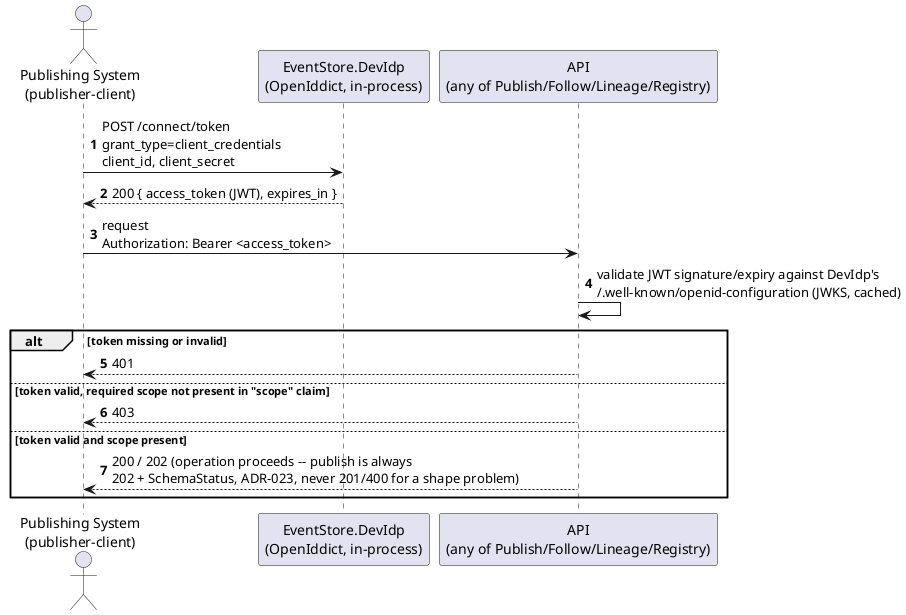
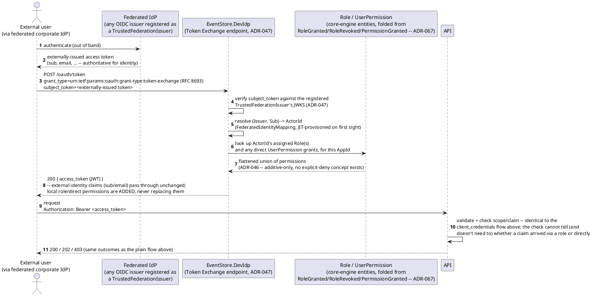
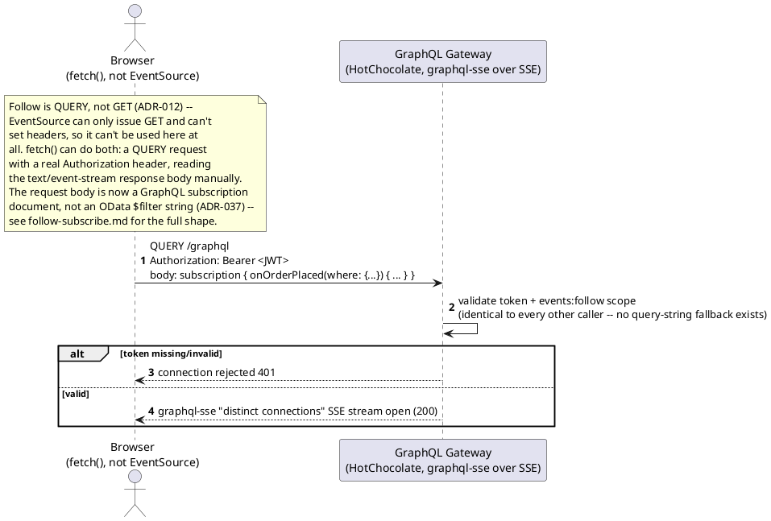
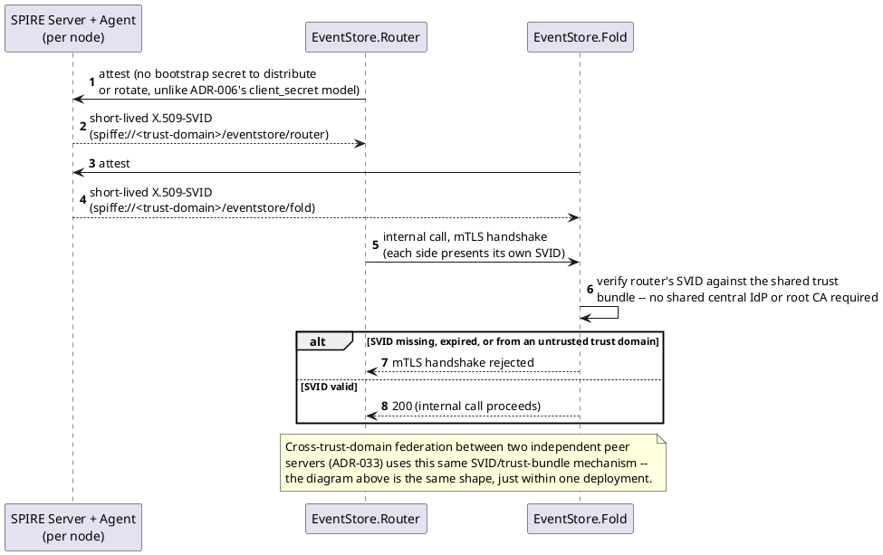
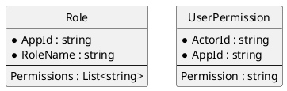

# Feature: OAuth2/OIDC bearer-token authentication and scope-based authorization

> **Partially superseded.** Every token now also carries a DPoP proof
> (`ADR-017`) not shown below. `EventStore.DevIdp` also performs OAuth
> Token Exchange for self-attested UCANs (`ADR-036`) and for
> header-incapable-client tickets (`ADR-040` — streaming playback /
> attachment retrieval URLs, resolved via an RFC 7662-shaped
> introspection call, not shown below). **Resolved this pass**: `ADR-046`
> (RBAC, as revised by `ADR-067` — see the new RBAC/claims-augmentation
> sequence diagram and ER sketch below), `ADR-047` (claims augmentation
> for a federated external IdP), `ADR-048` (SPIFFE/SPIRE internal workload
> identity, its own new section below, distinguished from the external
> caller identity this file otherwise covers), the stale publish-success
> `201` (→ `202` + `SchemaStatus`, `ADR-023`), and the Follow-specific
> browser-SSE framing (now a GraphQL Subscription document, `ADR-037`,
> matching `follow-subscribe.md`'s own shape) are now integrated. Still
> tracked as outstanding propagation work (`CLAUDE.md`): DPoP and
> UCAN/ticket Token Exchange, neither shown in a diagram in this file.

Context: scopes-to-endpoints table, the OpenAPI security scheme, and
GraphQL's field-level authorization (same bearer token, enforced via
HotChocolate's own directives) in `../03-api-contracts.md`; dev-mode
OpenIddict (`EventStore.DevIdp`) + orchestration decision in `ADR-006`
(`../07-adrs.md`); DI wiring in `../06-solution-structure.md`. Follow moved
from `GET` to the HTTP `QUERY` method in `ADR-012`, which is why the
browser story below is `fetch()`, not `EventSource` — and why there's no
`access_token` query parameter to test here anymore. RBAC's `Role`/
`UserPermission` entities are defined in `../data/schema-registry.md`
(`ADR-046`, folded from reserved control-plane events per `ADR-067`) —
out of scope here beyond the columns the new diagram below touches.

## Sequence diagram — token acquisition and an authorized call



## Sequence diagram — RBAC role expansion and federated-IdP claims augmentation (ADR-046, ADR-047)



Role-to-permission expansion happens **once, at token issuance, not on
every request** (`ADR-046`) — nothing downstream of the token (including
the "validate JWT" step in the very first diagram above) changes at all;
it is unaware whether a claim in the token's `scope`/claims arrived via a
direct grant or a role. The externally-issued token's own identity claims
are never removed or overridden by this exchange (`ADR-047`) — only
augmented, the same integrity guarantee NIST SP 800-63C's Federation
Assurance Level requires of a relying party.

## Sequence diagram — browser SSE via fetch() (ADR-012/ADR-037)



## External caller identity vs. internal workload identity (ADR-048)

Every diagram above answers "which external user/client is calling" —
`ADR-006`'s OAuth2/OIDC bearer JWT (plus `ADR-017`'s DPoP proof, not
shown), now optionally arriving via `ADR-047`'s federation exchange and
carrying `ADR-046`'s role-flattened permissions. **`ADR-048` answers a
different question: which internal *workload* is calling**, once a
request has already passed the checks above and moves between this
framework's own services (`EventStore.Router`, `.Fold`, `.GraphQL`,
`.Sharding`, `.PeerSync`, `.Streaming`, `.Attachments`) or between two
independent peer servers (`ADR-033`). `ADR-006`'s OAuth2/OIDC is
completely unaffected by this — the two mechanisms answer different
questions on different axes and neither substitutes for the other.



## Data model (ER diagram)

Token/session state (OpenIddict clients, scopes) is still not persisted
anywhere in `EventStoreContext` — that much of "not applicable" is
unchanged from before; it lives entirely inside `EventStore.DevIdp`'s
OpenIddict **InMemory** store, not even persisted across that process's
own restarts, let alone shared with the event store's database (`ADR-006`).
SPIFFE/SPIRE (`ADR-048`) adds no persisted entity here either — SVIDs are
short-lived and reissued by SPIRE, never stored in `EventStoreContext`.

What *has* changed: `ADR-046`'s RBAC layer. `Role` and `UserPermission`
are now core-engine entities, not identity-provider state — folded from
reserved `RoleGranted`/`RoleRevoked`/`PermissionGranted` events in the
same Event Log every business event uses (`ADR-067`, which superseded
`ADR-046`'s original position that this was IdP-only state). Shown here
only as far as the diagram above touches them; the full shape (including
the reserved event payloads themselves) is `../data/schema-registry.md`'s
to define.



## Seeded clients (dev)

Seeded in code by `EventStore.DevIdp`'s `DevIdpSeeder` at startup — no
realm-export file, no admin console:

| Client ID | Grant type | Scope(s) |
|---|---|---|
| `publisher-client` | `client_credentials` | `events:publish` |
| `follower-client` | `client_credentials` | `events:follow events:lineage:read` |
| `operator-client` | `client_credentials` | `registry:admin` |

## Salt (UI mockup)

Not applicable — `EventStore.DevIdp` (OpenIddict) has no admin console or
other UI. Verify the seed by requesting a token from `/connect/token` or
inspecting `/.well-known/openid-configuration`, not by looking at a screen.
SPIRE (`ADR-048`) likewise has no UI surface relevant here — attestation
and SVID issuance are verified via the SPIRE Agent/Server CLI, not a
screen either.

## Gherkin

```gherkin
Feature: OAuth2/OIDC bearer-token authentication and scope-based authorization
  As the event store
  I want every request authenticated via a Bearer token and authorized by scope
  So that only permitted services can publish, follow, query lineage, or administer schemas

  Background:
    Given the identity provider is EventStore.DevIdp (OpenIddict, in-process, dev-only)
    And client "publisher-client" has scope "events:publish"
    And client "follower-client" has scopes "events:follow" and "events:lineage:read"
    And client "operator-client" has scope "registry:admin"
    And app "demo" has role "SchemaAdmin" granting permission "registry:admin" (ADR-046)
    And app "demo" trusts federation issuer "https://login.example-corp.com" as a TrustedFederationIssuer (ADR-047)
    And the event type "OrderPlaced" version 1 is registered with schema:
      """
      { "type": "object", "properties": { "Amount": { "type": "number" } }, "required": ["Amount"] }
      """

  Scenario: Request without a Bearer token is rejected
    When I POST to "/publish/OrderPlaced" without an Authorization header
    Then the response status should be 401

  Scenario: Request with an expired or invalid Bearer token is rejected
    Given I have an expired Bearer token for client "publisher-client"
    When I POST to "/publish/OrderPlaced" with body:
      """
      { "payload": { "Amount": 150.00 } }
      """
    Then the response status should be 401

  Scenario: Request with a token lacking the required scope is rejected
    Given I have a Bearer token for client "follower-client"
    When I POST to "/publish/OrderPlaced" with body:
      """
      { "payload": { "Amount": 150.00 } }
      """
    Then the response status should be 403

  Scenario: Request with a token carrying the required scope succeeds
    Given I have a Bearer token for client "publisher-client"
    When I POST to "/publish/OrderPlaced" with body:
      """
      { "payload": { "Amount": 150.00 } }
      """
    Then the response status should be 202
    # Publish is always 202 + SchemaStatus, never 201/400 for a shape
    # problem (ADR-023) -- registration (PUT /registry/...) below is a
    # genuinely different, synchronously-validated endpoint and legitimately
    # keeps 201/400.

  Scenario: Schema registration requires the registry:admin scope
    Given I have a Bearer token for client "follower-client"
    When I PUT "/registry/OrderPlaced" with body:
      """
      { "jsonSchema": { "type": "object", "properties": { "Amount": { "type": "number" } }, "required": ["Amount"] }, "filterableFields": [] }
      """
    Then the response status should be 403

  Scenario: OpenAPI and the GraphQL schema remain publicly readable
    When I GET "/openapi.json" without an Authorization header
    Then the response status should be 200
    When I send a GraphQL introspection query without an Authorization header
    Then the response status should be 200
    # There is no /asyncapi.json anymore (ADR-037) -- HotChocolate serves
    # the GraphQL SDL itself via its own built-in introspection endpoint;
    # see spec-generation.md.

  Scenario: A role's permissions are flattened into the issued token, not re-resolved per request (ADR-046)
    Given user "u-1" is assigned role "SchemaAdmin" for app "demo"
    And user "u-1" holds no other, directly-assigned permission for app "demo"
    When user "u-1" requests a token
    Then the issued token's claims should include "registry:admin"
    When I PUT "/registry/OrderPlaced" as user "u-1" with body:
      """
      { "jsonSchema": { "type": "object", "properties": { "Amount": { "type": "number" } }, "required": ["Amount"] }, "filterableFields": [] }
      """
    Then the response status should be 201

  Scenario: Direct grants and role grants are additive -- there is no deny (ADR-046)
    Given user "u-2" is assigned no role for app "demo"
    But user "u-2" has been directly granted permission "events:publish" for app "demo"
    When user "u-2" requests a token
    Then the issued token's claims should include "events:publish"
    # No explicit-deny concept exists anywhere in this model -- a
    # permission present via ANY source (direct grant or role) is granted.

  Scenario: A federated user's externally-issued token is augmented, never replaced (ADR-047)
    Given issuer "https://login.example-corp.com" asserts sub "sub-42" for a first-time caller
    And "sub-42" is JIT-provisioned to a new ActorId on first exchange
    And that ActorId is directly granted permission "events:publish" for app "demo"
    When "sub-42" exchanges its externally-issued token via
      """
      POST /oauth/token
      grant_type=urn:ietf:params:oauth:grant-type:token-exchange
      subject_token=<externally-issued token>
      """
    Then the response status should be 200
    And the returned token should carry the original "sub" and "email" claims unchanged
    And the returned token should additionally carry the claim "events:publish"

  Scenario: A caller from an unregistered federation issuer is rejected (ADR-047)
    When a caller presents a subject_token issued by "https://not-a-trusted-issuer.example.com" for app "demo"
    Then the token exchange should be rejected with 401
    # No TrustedFederationIssuer is registered for that issuer/AppId pair --
    # nothing to verify the subject_token's signature against.

  Scenario: An internal service call without a valid SPIFFE SVID is rejected (ADR-048)
    Given EventStore.Router has not completed SPIRE attestation
    When EventStore.Router calls EventStore.Fold directly (internal, not via a public endpoint)
    Then the mTLS handshake should be rejected
    # This is workload identity, a different axis from every Bearer-JWT
    # scenario above -- no Authorization header is involved at all.

  Scenario: An internal service call with a valid SPIFFE SVID succeeds (ADR-048)
    Given EventStore.Router and EventStore.Fold have both completed SPIRE attestation
    When EventStore.Router calls EventStore.Fold directly (internal, not via a public endpoint)
    Then the mTLS handshake should succeed
    # ADR-006's OAuth2/OIDC caller auth is unaffected -- this checks which
    # *workload* is calling, not which external user/client it's calling on
    # behalf of.

  Scenario: A browser fetch()-based SSE client authenticates with a real header, like everyone else
    Given I have a Bearer token for client "follower-client"
    When I open a GraphQL Subscription connection with document "subscription { onOrderPlaced { amount } }" and that token in the Authorization header
    Then the connection should be accepted

  Scenario: A GraphQL Subscription connection without an Authorization header is rejected
    When I open a GraphQL Subscription connection with document "subscription { onOrderPlaced { amount } }" without an Authorization header
    Then the connection should be rejected with 401
    # No access_token query-string fallback exists (ADR-012) -- there is
    # exactly one way to authenticate Follow, the same as every other endpoint.
```
