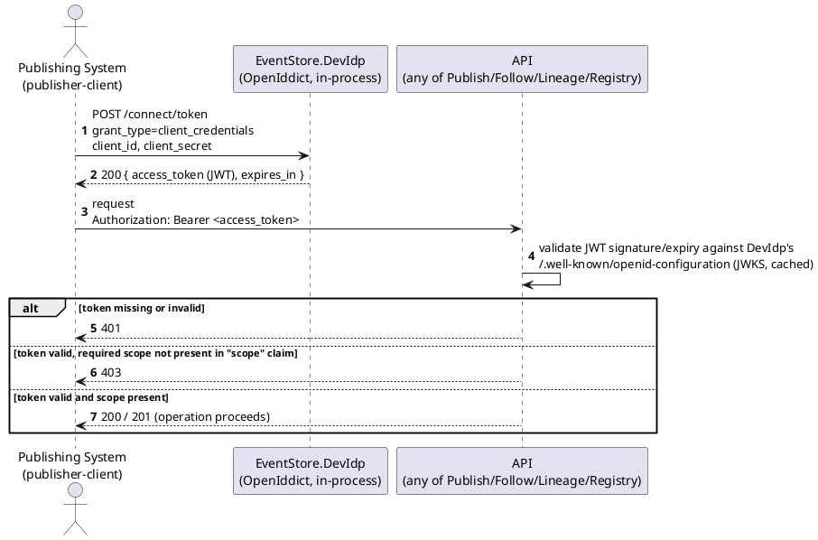
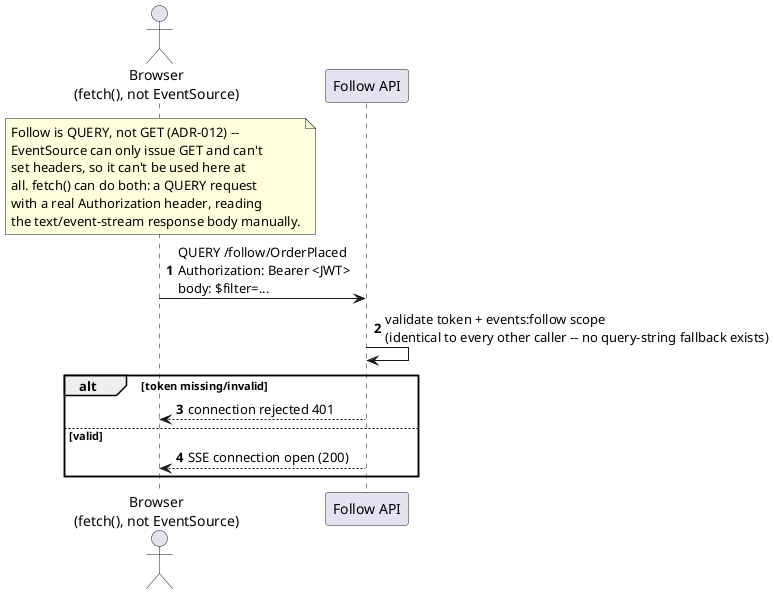

# Feature: OAuth2/OIDC bearer-token authentication and scope-based authorization

> **Partially superseded.** Every token now also carries a DPoP proof
> (`ADR-017`) not shown below. `EventStore.DevIdp` also performs OAuth
> Token Exchange for self-attested UCANs (`ADR-036`) and for
> header-incapable-client tickets (`ADR-040` — streaming/WebDAV playback
> URLs, resolved via an RFC 7662-shaped introspection call, not shown
> below). The Follow-specific `QUERY` framing below is accurate for the
> method itself but predates its GraphQL Subscription wrapping
> (`ADR-037` — see `follow-subscribe.md`'s banner). Tracked as
> outstanding propagation work (`CLAUDE.md`), not done in this pass.

Context: scopes-to-endpoints table and OpenAPI/AsyncAPI security schemes in
`../03-api-contracts.md`; dev-mode OpenIddict (`EventStore.DevIdp`) +
orchestration decision in `ADR-006` (`../07-adrs.md`); DI wiring in
`../06-solution-structure.md`. Follow moved from `GET` to the HTTP `QUERY`
method in `ADR-012`, which is why the browser story below is `fetch()`,
not `EventSource` — and why there's no `access_token` query parameter to
test here anymore.

## Sequence diagram — token acquisition and an authorized call



## Sequence diagram — browser SSE via fetch() (ADR-012)



## Data model (ER diagram)

Not applicable — this feature has no persistent entities of its own in
`EventStoreContext`. Identity/token state (clients, scopes) lives entirely
inside `EventStore.DevIdp`'s OpenIddict **InMemory** store — not even
persisted across that process's own restarts, let alone shared with the
event store's database; see `ADR-006`.

## Seeded clients (dev)

Seeded in code by `EventStore.DevIdp`'s `DevIdpSeeder` at startup — no
realm-export file, no admin console:

| Client ID | Grant type | Scope(s) |
|---|---|---|
| `publisher-client` | `client_credentials` | `events:publish` |
| `follower-client` | `client_credentials` | `events:follow events:lineage:read` |
| `operator-client` | `client_credentials` | `registry:admin` |

## Salt (UI mockup)

Not applicable — `EventStore.DevIdp` (OpenIddict) has no admin console or
other UI. Verify the seed by requesting a token from `/connect/token` or
inspecting `/.well-known/openid-configuration`, not by looking at a screen.

## Gherkin

```gherkin
Feature: OAuth2/OIDC bearer-token authentication and scope-based authorization
  As the event store
  I want every request authenticated via a Bearer token and authorized by scope
  So that only permitted services can publish, follow, query lineage, or administer schemas

  Background:
    Given the identity provider is EventStore.DevIdp (OpenIddict, in-process, dev-only)
    And client "publisher-client" has scope "events:publish"
    And client "follower-client" has scopes "events:follow" and "events:lineage:read"
    And client "operator-client" has scope "registry:admin"
    And the event type "OrderPlaced" version 1 is registered with schema:
      """
      { "type": "object", "properties": { "Amount": { "type": "number" } }, "required": ["Amount"] }
      """

  Scenario: Request without a Bearer token is rejected
    When I POST to "/publish/OrderPlaced" without an Authorization header
    Then the response status should be 401

  Scenario: Request with an expired or invalid Bearer token is rejected
    Given I have an expired Bearer token for client "publisher-client"
    When I POST to "/publish/OrderPlaced" with body:
      """
      { "payload": { "Amount": 150.00 } }
      """
    Then the response status should be 401

  Scenario: Request with a token lacking the required scope is rejected
    Given I have a Bearer token for client "follower-client"
    When I POST to "/publish/OrderPlaced" with body:
      """
      { "payload": { "Amount": 150.00 } }
      """
    Then the response status should be 403

  Scenario: Request with a token carrying the required scope succeeds
    Given I have a Bearer token for client "publisher-client"
    When I POST to "/publish/OrderPlaced" with body:
      """
      { "payload": { "Amount": 150.00 } }
      """
    Then the response status should be 201

  Scenario: Schema registration requires the registry:admin scope
    Given I have a Bearer token for client "follower-client"
    When I PUT "/registry/OrderPlaced" with body:
      """
      { "jsonSchema": { "type": "object", "properties": { "Amount": { "type": "number" } }, "required": ["Amount"] }, "filterableFields": [] }
      """
    Then the response status should be 403

  Scenario: OpenAPI and AsyncAPI documents remain publicly readable
    When I GET "/openapi.json" without an Authorization header
    Then the response status should be 200
    When I GET "/asyncapi.json" without an Authorization header
    Then the response status should be 200

  Scenario: A browser fetch()-based SSE client authenticates with a real header, like everyone else
    Given I have a Bearer token for client "follower-client"
    When I open a QUERY-based SSE connection to "/follow/OrderPlaced" with that token in the Authorization header
    Then the connection should be accepted

  Scenario: A QUERY-based SSE connection without an Authorization header is rejected
    When I open a QUERY-based SSE connection to "/follow/OrderPlaced" without an Authorization header
    Then the connection should be rejected with 401
    # No access_token query-string fallback exists (ADR-012) -- there is
    # exactly one way to authenticate Follow, the same as every other endpoint.
```
