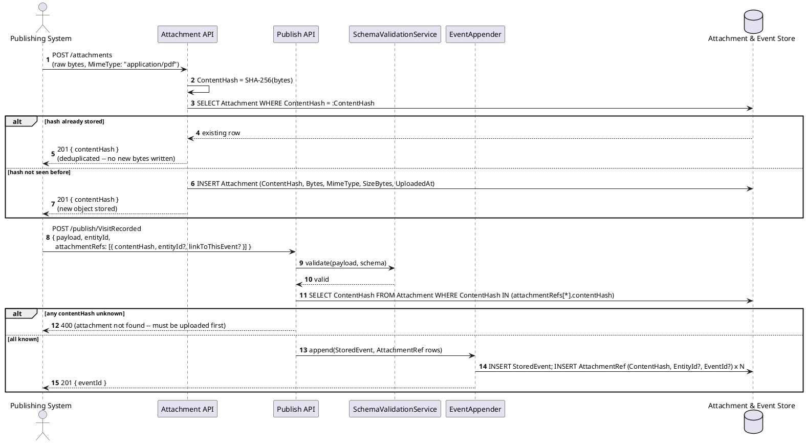
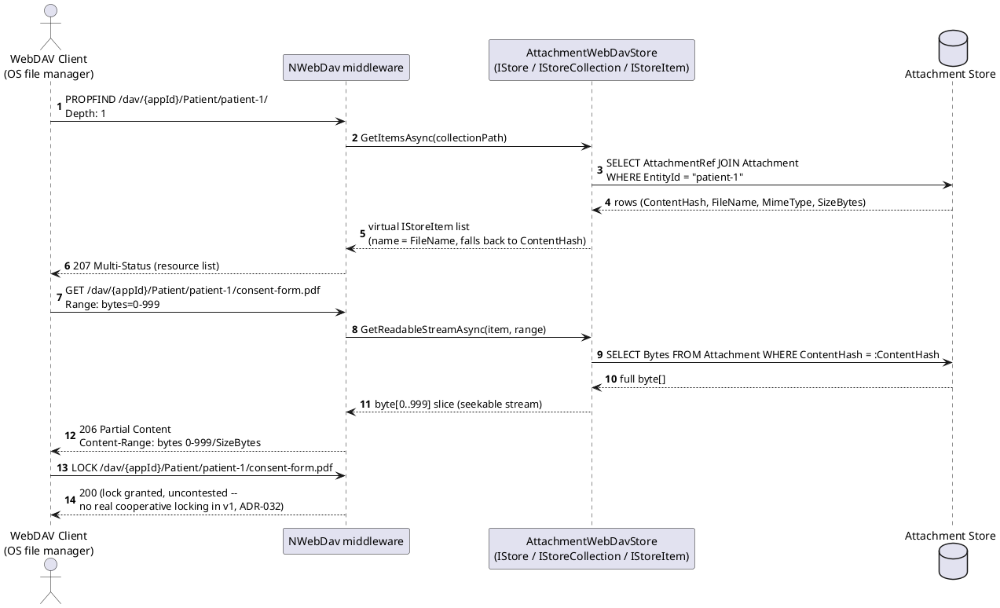
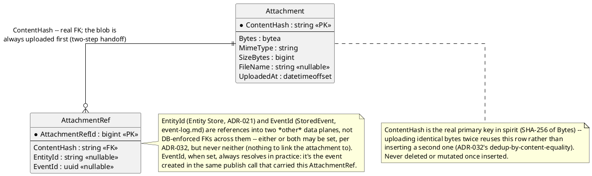

# Feature: Binary attachments (content-addressed, linked to an entity or event, browsable via WebDAV)

Context: data model in [`../data/streaming-and-attachments.md`](../data/streaming-and-attachments.md)
(`Attachment`/`AttachmentRef`); decision record `ADR-032` in
[`../adrs/adr-032-binary-attachments.md`](../adrs/adr-032-binary-attachments.md);
concrete library choice in
[`../libraries/dotnet/nwebdav.md`](../libraries/dotnet/nwebdav.md); pattern
write-ups (not yet standalone docs) in `../patterns/README.md`'s
"Content-addressable storage" and "Browsable access via a real filesystem
protocol" catalog entries. The `Attachment Service` container and
`Attachment Store` database appear in `../01-c4-architecture.md`; build
sequencing is Phase 15 in `../08-build-plan.md`. This is the first feature
doc for `ADR-032` — there is no prior version to supersede, so unlike
several other `features/*.md` files this one carries no stale-scenario
banner.

Upload/link travels over the ordinary Publish API (`ADR-012`'s `QUERY`
convention doesn't apply here — `POST /attachments` and `POST /publish/...`
are genuine state-changing writes, not queries) and is unaffected by
`ADR-037`'s GraphQL swap, which only replaced the OData-era read surface.
Browsing/retrieval is a second, deliberately separate surface: **WebDAV**
(RFC 4918), consumed by an OS file manager, not by the GraphQL Gateway —
`GET`'s byte-range support reuses `ADR-031`'s Range-request reasoning
(seekable retrieval), the same mechanism, not a second implementation.

## Sequence diagram — uploading and linking an attachment



The two-step handoff is deliberate (`ADR-032`'s Decision): bytes never
travel inside the JSON envelope `SchemaValidationService` parses on every
publish. `entityId` and `linkToThisEvent` on an `attachmentRefs` entry are
independent flags — either, both, or (for a second entry) different
combinations may be set in the same publish call, each producing one
`AttachmentRef` row.

## Sequence diagram — browsing and retrieving via WebDAV



The virtual hierarchy is projected, not real: `/dav/{appId}/{entityType}/
{entityId}/` has no backing folder row anywhere — `AttachmentWebDavStore`
computes it on every request from `AttachmentRef.EntityId` joins, the same
content-addressed rows `ADR-032` already defined for the upload path
above.

## Data model (ER diagram)



Unlike `EventParent`'s asymmetric FKs (`event-chains.md`), the asymmetry
here is between *data planes*, not between two rows of the same kind: the
one real FK is `AttachmentRef.ContentHash → Attachment.ContentHash` — a
row can't reference bytes that were never uploaded. `EntityId`/`EventId`
reach outside this data plane entirely, the same "out-of-band, clearly
linked, not stretching one table to fit everything" posture `ADR-032`'s
Consequences already state.

## Salt (UI mockup)

Not applicable — this ADR deliberately has no designed UI surface. WebDAV
is consumed by general-purpose OS file managers (Windows Explorer, macOS
Finder) that already know how to render a mounted WebDAV URL; there's
nothing bespoke to mock up. A true OS-level virtual filesystem (on-demand
hydration, offline sync, `<video>`-style placeholder files) is explicitly
out of scope for the core engine (`ADR-032`'s closing note) — if built at
all, it's a client-side consumer under `ADR-039`'s MVVM client, and would
get its own Salt mockup there, not here.

## Gherkin

```gherkin
Feature: Binary attachments (content-addressed, linked to an entity or event, browsable via WebDAV)
  As a publishing system
  I want to upload a binary attachment once and link it to an entity and/or a specific event
  And as a WebDAV client
  I want to browse and retrieve those attachments through a familiar file-manager UX
  So that supporting documents are stored once, deduplicated by content, and never require a bespoke browse API

  # Every request carries a Bearer token with sufficient scope
  # (attachments:ingest for POST /attachments and attachmentRefs on a publish,
  # attachments:read for PROPFIND/GET/LOCK, events:publish for the publish call
  # itself) unless a scenario says otherwise. See auth.md for authentication/
  # authorization behavior itself.

  Background:
    Given the entity type "Patient" is registered (ADR-021)
    And a "Patient" entity "patient-1" exists
    And the event type "VisitRecorded" version 1 is registered with schema:
      """
      { "type": "object", "properties": { "Notes": { "type": "string" } }, "required": ["Notes"] }
      """

  Scenario: Uploading a new binary attachment returns its ContentHash
    When I POST to "/attachments" with raw bytes of a scanned consent form (MimeType "application/pdf")
    Then the response status should be 201
    And the response should include a "contentHash" equal to the SHA-256 of the uploaded bytes
    And exactly one Attachment row should exist with that ContentHash

  Scenario: Uploading identical bytes twice deduplicates instead of storing a second copy
    Given the bytes of "consent-form.pdf" were already uploaded, yielding ContentHash "9f86d081884c7d659a2feaa0c55ad015a3bf4f1b2b0b822cd15d6c15b0f00a08"
    When I POST to "/attachments" again with the exact same bytes
    Then the response status should be 201
    And the response "contentHash" should equal "9f86d081884c7d659a2feaa0c55ad015a3bf4f1b2b0b822cd15d6c15b0f00a08"
    And exactly one Attachment row should still exist for that ContentHash

  Scenario: Linking an uploaded attachment to an entity generally
    Given the bytes of "history.pdf" were uploaded, yielding ContentHash "h-history-1"
    When I POST to "/publish/VisitRecorded" with body:
      """
      {
        "payload": { "Notes": "Annual checkup" },
        "entityId": "patient-1",
        "attachmentRefs": [ { "contentHash": "h-history-1", "entityId": "patient-1" } ]
      }
      """
    Then the response status should be 201
    And an AttachmentRef should exist with contentHash "h-history-1", entityId "patient-1", and no eventId

  Scenario: Linking an uploaded attachment to one specific event
    Given the bytes of "referral.pdf" were uploaded, yielding ContentHash "h-referral-1"
    When I POST to "/publish/VisitRecorded" with body:
      """
      {
        "payload": { "Notes": "Referred to specialist" },
        "entityId": "patient-1",
        "attachmentRefs": [ { "contentHash": "h-referral-1", "linkToThisEvent": true } ]
      }
      """
    Then the response status should be 201 with the created eventId as "visit-1"
    And an AttachmentRef should exist with contentHash "h-referral-1", eventId "visit-1", and no entityId

  Scenario: Browsing an entity's attachments lists them under its virtual WebDAV folder
    Given attachment "h-history-1" (named "history.pdf") is linked to entity "patient-1"
    And attachment "h-referral-1" (named "referral.pdf") is linked to entity "patient-1"
    When I PROPFIND "/dav/app-1/Patient/patient-1/" with Depth 1
    Then the response status should be 207
    And the resource list should include "history.pdf" and "referral.pdf"

  Scenario: Retrieving an attachment via a byte-range GET returns partial content
    Given attachment "h-history-1" (named "history.pdf", 10000 bytes) is linked to entity "patient-1"
    When I GET "/dav/app-1/Patient/patient-1/history.pdf" with header "Range: bytes=0-999"
    Then the response status should be 206
    And the response header "Content-Range" should be "bytes 0-999/10000"
    And the response body should be exactly the first 1000 bytes of "history.pdf"

  Scenario: Deleting an uploaded attachment is rejected -- it is never mutated once uploaded
    Given attachment "h-history-1" (named "history.pdf") is linked to entity "patient-1"
    When I DELETE "/dav/app-1/Patient/patient-1/history.pdf"
    Then the response status should be 403
    And the Attachment row for ContentHash "h-history-1" should still exist with its original bytes
    And the AttachmentRef linking it to "patient-1" should be unchanged

  Scenario: A LOCK request against an attachment is granted uncontested, not real cooperative locking
    Given attachment "h-history-1" (named "history.pdf") is linked to entity "patient-1"
    When I LOCK "/dav/app-1/Patient/patient-1/history.pdf"
    Then the response status should be 200
    And a second, concurrent LOCK request against the same resource should also succeed
    And no lock token issued this way blocks any other client's GET or PROPFIND
```
