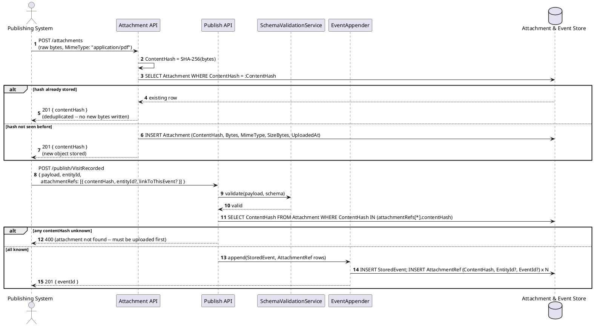
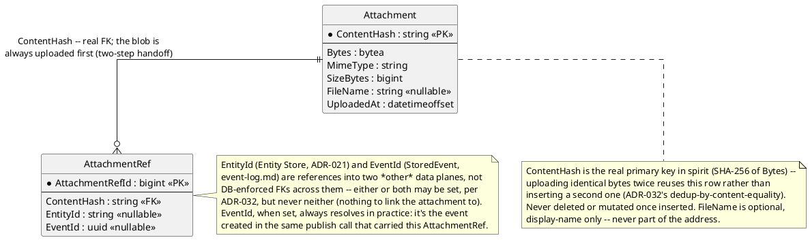

# Feature: Binary attachments (content-addressed, linked to an entity or event, browsable via GraphQL, retrieved via plain HTTP)

Context: data model in [`../data/streaming-and-attachments.md`](../data/streaming-and-attachments.md)
(`Attachment`/`AttachmentRef`); decision record `ADR-032` in
[`../adrs/adr-032-binary-attachments.md`](../adrs/adr-032-binary-attachments.md);
pattern write-ups (not yet standalone docs) in `../patterns/README.md`'s
"Content-addressable storage" catalog entry. The `Attachment Service`
container and `Attachment Store` database appear in
`../01-c4-architecture.md`; build sequencing is `../08-build-plan.md`'s
"Binary Attachments" item. This is the first feature doc for `ADR-032` —
there is no prior version to supersede, so unlike several other
`features/*.md` files this one carries no stale-scenario banner.

**WebDAV (OS-native file-manager mounting) was considered and explicitly
declined** — see `ADR-032`'s Decision and
[the WebDAV library comparison](../comparisons/webdav-library.md): every
other real access path (upload, fetch+range, browse/list) was already
served by mechanisms this design had adopted for unrelated reasons, so
WebDAV's one unique value (mounting a share as a network drive) wasn't
worth its trade-offs. The three real access paths this doc covers below
are the ones actually built.

Upload/link travels over the ordinary Publish API (`ADR-012`'s `QUERY`
convention doesn't apply here — `POST /attachments` and `POST /publish/...`
are genuine state-changing writes, not queries) and is unaffected by
`ADR-037`'s GraphQL swap, which only replaced the OData-era read surface.
Retrieval is a plain `GET` against a content-addressed URL, whose
byte-range support reuses `ADR-031`'s Range-request reasoning (seekable
retrieval), the same mechanism, not a second implementation.

**Browsing an entity's attachments via GraphQL is designed, not yet
built.** `ADR-032`'s Decision names it as a nested field off the owning
entity (`entity(id) { attachments { contentHash, filename, mimeType,
sizeBytes } } }`), but `08-build-plan.md`'s "GraphQL-Only Query Layer"
item is explicit that no such field exists in the real schema: there is
"no generic 'get current entity' query field, and no `extensions: JSON`
field anywhere" — none of the real GraphQL surfaces this design actually
built (Follow, Lineage, Registry listing) ever query current Entity Store
state directly, so there is currently no GraphQL type an `attachments`
field could attach to. The sequence diagram and Gherkin scenario below
still show the query this ADR specifies, marked as the confirmed gap it
is rather than as something callable today.

## Sequence diagram — uploading and linking an attachment



The two-step handoff is deliberate (`ADR-032`'s Decision): bytes never
travel inside the JSON envelope `SchemaValidationService` parses on every
publish. `entityId` and `linkToThisEvent` on an `attachmentRefs` entry are
independent flags — either, both, or (for a second entry) different
combinations may be set in the same publish call, each producing one
`AttachmentRef` row.

## Sequence diagram — browsing via GraphQL (designed, not yet built) and retrieving via a Range GET (built)

```plantuml
@startuml BinaryAttachments_Browse_Sequence
autonumber
actor "Consuming System" as follower
participant "GraphQL Gateway\n(NOT YET BUILT for this query --\nno entity(id) field exists, see prose above)" as graphql #line.dashed
participant "Attachment API" as attachApi
database "Attachment & Entity Store" as db

follower -> graphql: QUERY { entity(id: "patient-1") {\n  attachments { contentHash, filename, mimeType, sizeBytes } } }
graphql -> db: SELECT AttachmentRef JOIN Attachment\nWHERE EntityId = "patient-1"
db --> graphql: rows (ContentHash, FileName, MimeType, SizeBytes)
graphql --> follower: 200 { entity: { attachments: [ {contentHash, filename, ...}, ... ] } }
note right of graphql
  This half is ADR-032's Decision, not the live schema --
  08-build-plan.md's "GraphQL-Only Query Layer" item states
  explicitly that no generic "get current entity" query field
  (and so no attachments field) exists anywhere in the real
  GraphQL surface. Confirmed against src/EventStore.GraphQL/
  Query.cs (an empty root) -- a known, confirmed gap, not an
  oversight in this doc.
end note

follower -> attachApi: GET /attachments/{contentHash}\nRange: bytes=0-999
attachApi -> db: SELECT Bytes FROM Attachment WHERE ContentHash = :ContentHash
db --> attachApi: full byte[]
attachApi --> follower: 206 Partial Content\nContent-Range: bytes 0-999/SizeBytes
@enduml
```

There is no virtual folder/file hierarchy of any kind — attachments are
addressed directly by `ContentHash` (the Decision above), meant to be
discovered by querying the entity they're linked to, exactly the access
shape `ADR-032` specifies, once the GraphQL-browse half above actually
exists. `GET`'s byte-range support is the same `ADR-031` Range-request
mechanism, not a second implementation, and is fully built today.

## Data model (ER diagram)



Unlike `EventParent`'s asymmetric FKs (`event-chains.md`), the asymmetry
here is between *data planes*, not between two rows of the same kind: the
one real FK is `AttachmentRef.ContentHash → Attachment.ContentHash` — a
row can't reference bytes that were never uploaded. `EntityId`/`EventId`
reach outside this data plane entirely, the same "out-of-band, clearly
linked, not stretching one table to fit everything" posture `ADR-032`'s
Consequences already state.

## Salt (UI mockup)

Not applicable — this ADR deliberately has no designed UI surface.
Attachments are consumed the same way any other GraphQL-queried/
HTTP-fetched resource in this design is: through whatever client
(`ADR-039`'s MVVM client, a script, a browser tab) already knows how to
run a GraphQL query and issue a `GET`. There's nothing bespoke to mock
up. A true OS-level virtual filesystem (on-demand hydration, offline
sync, mounting attachments as a drive) was considered as a possible
future client-side extension but is now explicitly dropped, not just
deferred, since the WebDAV surface it would have built on top of was
never built — see `ADR-032`'s closing note and `ADR-039`'s own
Consequences.

## Gherkin

```gherkin
Feature: Binary attachments (content-addressed, linked to an entity or event, browsable via GraphQL, retrieved via plain HTTP)
  As a publishing system
  I want to upload a binary attachment once and link it to an entity and/or a specific event
  And as a consuming system
  I want to browse an entity's attachments via GraphQL and retrieve them via plain HTTP
  So that supporting documents are stored once, deduplicated by content, and never require a bespoke browse API

  # Every request carries a Bearer token with sufficient scope
  # (attachments:ingest for POST /attachments and attachmentRefs on a publish,
  # attachments:read for the GraphQL browse query and the retrieval GET,
  # events:publish for the publish call itself) unless a scenario says
  # otherwise. See auth.md for authentication/authorization behavior itself.

  Background:
    Given the entity type "Patient" is registered (ADR-021)
    And a "Patient" entity "patient-1" exists
    And the event type "VisitRecorded" version 1 is registered with schema:
      """
      { "type": "object", "properties": { "Notes": { "type": "string" } }, "required": ["Notes"] }
      """

  Scenario: Uploading a new binary attachment returns its ContentHash
    When I POST to "/attachments" with raw bytes of a scanned consent form (MimeType "application/pdf")
    Then the response status should be 201
    And the response should include a "contentHash" equal to the SHA-256 of the uploaded bytes
    And exactly one Attachment row should exist with that ContentHash

  Scenario: Uploading identical bytes twice deduplicates instead of storing a second copy
    Given the bytes of "consent-form.pdf" were already uploaded, yielding ContentHash "9f86d081884c7d659a2feaa0c55ad015a3bf4f1b2b0b822cd15d6c15b0f00a08"
    When I POST to "/attachments" again with the exact same bytes
    Then the response status should be 201
    And the response "contentHash" should equal "9f86d081884c7d659a2feaa0c55ad015a3bf4f1b2b0b822cd15d6c15b0f00a08"
    And exactly one Attachment row should still exist for that ContentHash

  Scenario: Linking an uploaded attachment to an entity generally
    Given the bytes of "history.pdf" were uploaded, yielding ContentHash "h-history-1"
    When I POST to "/publish/VisitRecorded" with body:
      """
      {
        "payload": { "Notes": "Annual checkup" },
        "entityId": "patient-1",
        "attachmentRefs": [ { "contentHash": "h-history-1", "entityId": "patient-1" } ]
      }
      """
    Then the response status should be 201
    And an AttachmentRef should exist with contentHash "h-history-1", entityId "patient-1", and no eventId

  Scenario: Linking an uploaded attachment to one specific event
    Given the bytes of "referral.pdf" were uploaded, yielding ContentHash "h-referral-1"
    When I POST to "/publish/VisitRecorded" with body:
      """
      {
        "payload": { "Notes": "Referred to specialist" },
        "entityId": "patient-1",
        "attachmentRefs": [ { "contentHash": "h-referral-1", "linkToThisEvent": true } ]
      }
      """
    Then the response status should be 201 with the created eventId as "visit-1"
    And an AttachmentRef should exist with contentHash "h-referral-1", eventId "visit-1", and no entityId

  Scenario: Browsing an entity's attachments via GraphQL lists them
    # NOT YET BUILT -- ADR-032's Decision names this query shape, but
    # 08-build-plan.md's "GraphQL-Only Query Layer" item confirms no
    # generic entity(id) field (and so no attachments field) exists in
    # the real GraphQL schema (src/EventStore.GraphQL/Query.cs is an
    # empty root). Kept here as the designed scenario, marked as a known,
    # confirmed gap rather than something callable today.
    Given attachment "h-history-1" (named "history.pdf") is linked to entity "patient-1"
    And attachment "h-referral-1" (named "referral.pdf") is linked to entity "patient-1"
    When I QUERY the GraphQL Gateway with:
      """
      { entity(id: "patient-1") { attachments { contentHash, filename, mimeType, sizeBytes } } }
      """
    Then the response status should be 200
    And the "attachments" list should include entries with filename "history.pdf" and filename "referral.pdf"

  Scenario: Retrieving an attachment via a byte-range GET returns partial content
    Given attachment "h-history-1" (named "history.pdf", 10000 bytes) is linked to entity "patient-1"
    When I GET "/attachments/h-history-1" with header "Range: bytes=0-999"
    Then the response status should be 206
    And the response header "Content-Range" should be "bytes 0-999/10000"
    And the response body should be exactly the first 1000 bytes of "history.pdf"

  Scenario: Retrieving an attachment with no Range header returns the whole object
    Given attachment "h-history-1" (named "history.pdf", 10000 bytes) is linked to entity "patient-1"
    When I GET "/attachments/h-history-1" without a "Range" header
    Then the response status should be 200
    And the response body should be exactly the 10000 bytes of "history.pdf"

  Scenario: An attachment is never mutated once uploaded
    Given attachment "h-history-1" (named "history.pdf") is linked to entity "patient-1"
    When the same bytes are uploaded again via "/attachments"
    Then the Attachment row for ContentHash "h-history-1" is reused, not replaced
    And no endpoint in this design accepts a request to modify or delete an existing Attachment row
```
