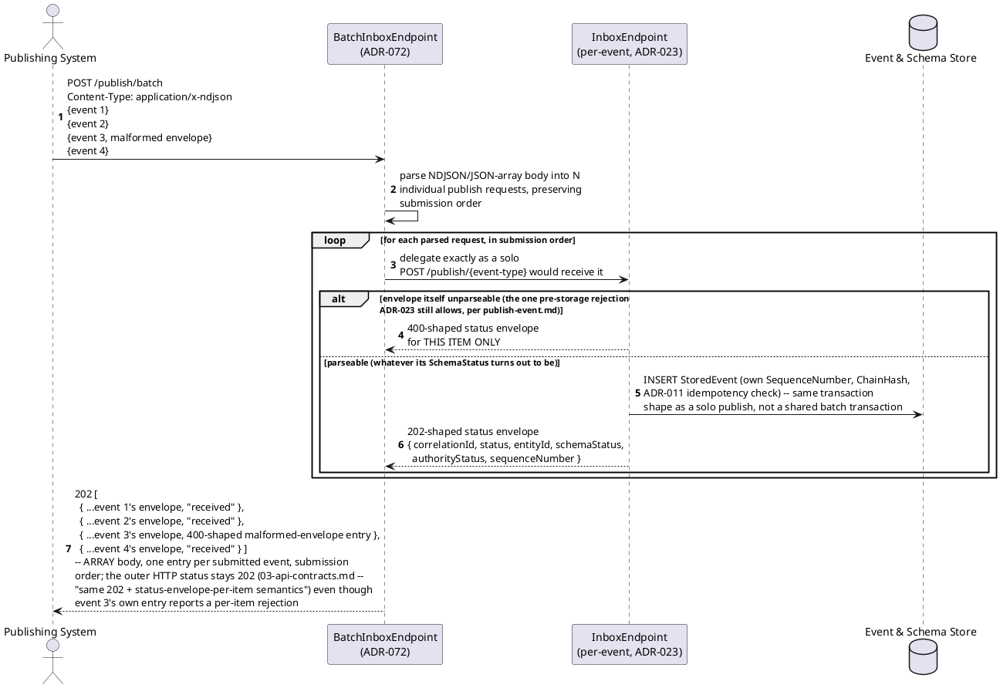
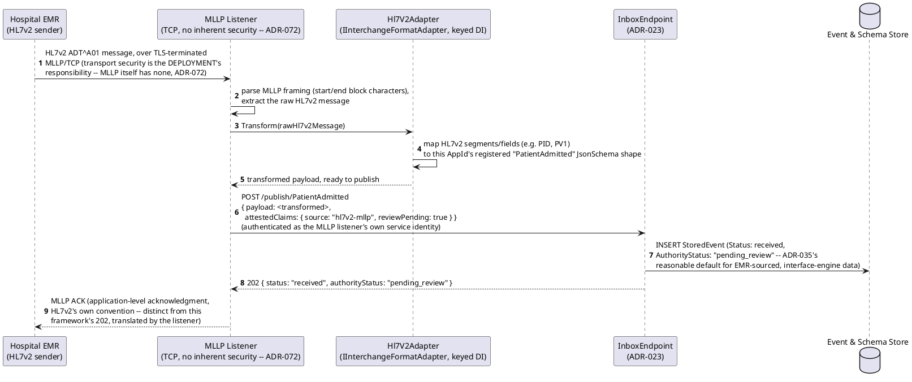
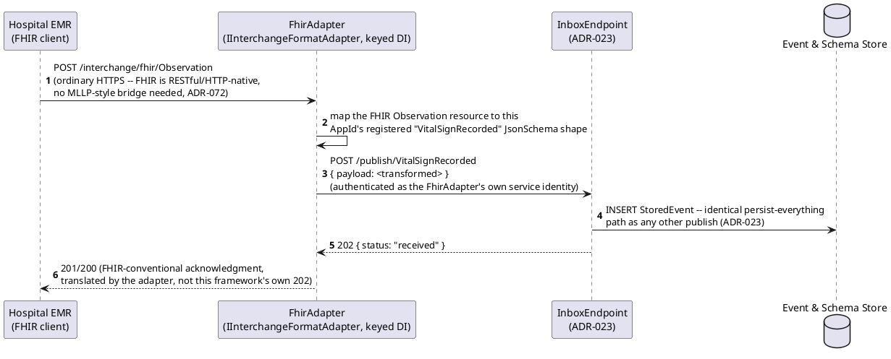
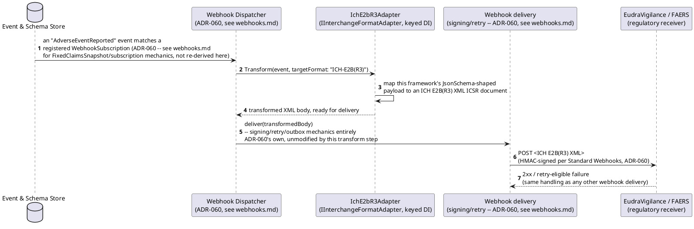
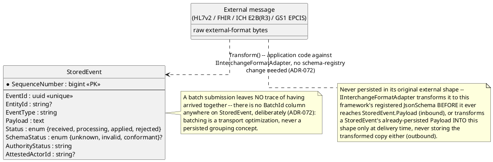

# Feature: Bulk/batch ingestion and external interchange-format adapters

Context: decision record `ADR-072` in
[`../adrs/adr-072-bulk-ingestion-and-interchange-format-adapters.md`](../adrs/adr-072-bulk-ingestion-and-interchange-format-adapters.md);
contract in `../03-api-contracts.md` ("Bulk ingestion and external
interchange adapters"); the new `IInterchangeFormatAdapter` seam is
catalogued in [`../extensibility-points.md`](../extensibility-points.md).
Two related but distinct capabilities, covered together because both
exist to get event data across this framework's own boundary — one
across an HTTP transport-efficiency boundary, the other across a
format boundary with an external standard:

1. **`POST /publish/batch`** — an NDJSON or JSON-array body carrying
   multiple event submissions in one HTTP request. **Not a new
   persistence model.** Each event inside the batch goes through the
   *exact same* persist-everything path `ADR-023` already defines for a
   solo publish — its own `SequenceNumber`, `ChainHash` (`ADR-019`), and
   `ADR-011` idempotency check — batching only collapses N HTTP round
   trips and N DB transactions into one of each. A batch never fails or
   succeeds as a unit: the response is an array of the same per-event
   status envelope a solo publish returns, one entry per submitted
   event, in submission order, and one malformed event inside a batch
   never blocks any other event in that same batch.
2. **`IInterchangeFormatAdapter`** — a new keyed-DI extensibility seam
   (`ADR-059`'s registration model, catalogued in
   `extensibility-points.md`), one implementation per external
   interchange standard (`Hl7V2Adapter`, `FhirAdapter`,
   `IchE2bR3Adapter`, `Gs1EpcisAdapter`), several active simultaneously
   in one deployment. **Inbound**, an adapter transforms an externally-
   formatted message into this framework's own registered `JsonSchema`
   shape and publishes it through the *ordinary* publish path (solo or
   batch) — inheriting persist-everything and `ADR-035`'s
   non-authoritative capture automatically, no special-casing anywhere
   downstream. **Outbound**, an adapter transforms an event into the
   external format as an extra step immediately *before* webhook
   delivery. HL7v2 specifically needs a dedicated MLLP-listener
   component (TCP-based; HL7v2 is not carried over HTTP in real
   deployments) ahead of its adapter — verified against
   [Google Cloud's own MLLP adapter](https://github.com/GoogleCloudPlatform/mllp/),
   the real, concrete precedent `ADR-072` follows rather than inventing
   a bespoke bridge. FHIR needs no such bridge; its inbound adapter is
   an ordinary HTTP resource consumer.

This doc deliberately does **not** re-derive:
- **The ordinary single-event publish path itself** — schema
  validation, `EntityId` resolution, `SchemaStatus`/`Status`
  advisory-vs-blocking semantics, the Inbox/Router split. See
  [`publish-event.md`](publish-event.md); every event inside a batch,
  and every event an adapter produces, goes through exactly that path,
  unmodified.
- **`parentEventIds`/Lineage DAG mechanics** — see
  [`event-chains.md`](event-chains.md). An adapter-produced or
  batch-submitted event can carry `parentEventIds` exactly like any
  other publish; this doc doesn't re-derive `ParentValidationMode` or
  traversal.
- **Publish idempotency** (`ADR-011`) — see `event-log.md`'s "Publish
  idempotency" section and `publish-event.md`'s idempotent-replay
  scenarios. Each event inside a batch is independently subject to the
  same `eventId`/`PayloadHash` check as a solo publish.
- **Non-authoritative capture's `AuthorityStatus` mechanics in
  general** — see [`non-authoritative-capture.md`](non-authoritative-capture.md).
  This doc only notes that an adapter-sourced event is a reasonable
  default candidate for starting below `accepted` (`ADR-035`'s own
  text), not how the review/acceptance workflow itself works.
- **Webhook signing/retry/delivery mechanics** — covered end to end in
  `webhooks.md` (`ADR-060`). This doc only shows *where* an outbound
  interchange-format transform composes as an extra step ahead of that
  existing delivery pipeline, never re-deriving signing, retry, or the
  outbox itself.
- **Ordinary claims/auth checks** (`ADR-006`/`ADR-008`) — see
  [`auth.md`](auth.md) and [`event-security.md`](event-security.md).
  Every request in this doc's scenarios carries whatever token an
  ordinary `POST /publish/{event-type}` call would need; adapters
  publish as an authenticated caller in their own right, not as a
  bypass of this check.
- **Schema upcasting/versioning** (`ADR-018`/`ADR-020`) — an adapter's
  transform target is simply "this framework's registered `JsonSchema`
  shape, some active version of it," unchanged from any other publish;
  no new upcast/versioning mechanism is introduced for interchange
  formats.

## Sequence diagram — `POST /publish/batch`, one malformed event not blocking the rest



Event 3's rejection in the diagram above is deliberately the *narrowest*
case `ADR-023` still allows to fail before storage — an unparseable
envelope, never a schema-invalid payload or an unknown `schemaVersion`
(those persist with an advisory `SchemaStatus`, exactly as
`publish-event.md` already shows for a solo publish). The point the
diagram makes is structural, not about which failures exist: the batch
endpoint is a thin fan-out over N independent calls to the same
per-event path, never a single all-or-nothing transaction.

## Sequence diagram — inbound HL7v2 adapter via a dedicated MLLP listener



## Sequence diagram — inbound FHIR adapter, ordinary HTTP, no bridge



The contrast between this diagram and the HL7v2 one above is the point
`ADR-072` makes explicitly: FHIR's own transport is already HTTP, so
its adapter is an ordinary HTTP resource consumer sitting in front of
`POST /publish/{event-type}` — no dedicated listener component, no
transport-security caveat beyond what any other HTTPS endpoint already
carries.

## Sequence diagram — outbound interchange adapter composing with webhook delivery



The adapter's transform step is inserted *before* delivery and nowhere
else — it never touches `StoredEvent.Payload`, `ChainHash`, or
`ADR-060`'s own signing/retry state machine. Swapping
`IchE2bR3Adapter` for `Gs1EpcisAdapter` (DSCSA trading-partner exchange)
is the identical composition point with a different transform target,
not a second mechanism.

## Data model (ER diagram)



Full `StoredEvent` column list is in
[`../data/event-log.md`](../data/event-log.md) — this diagram shows
only what batch ingestion and interchange adapters actually touch.

## Salt (UI mockup)

Not applicable — both capabilities in this doc are machine-to-machine
integrations with no UI surface in scope. `POST /publish/batch` is an
ordinary HTTP endpoint for a publishing system, the identical "no UI"
reasoning [`publish-event.md`](publish-event.md) already states for
the single-event case. `IInterchangeFormatAdapter` implementations are
registered in a deployment's own composition root
(`ADR-059`/`ADR-072`) — a code-level registration, not an admin
console; `ADR-072` names no operator-facing configuration screen, and
this doc doesn't invent one the ADR doesn't support.

## Gherkin

```gherkin
Feature: Bulk/batch ingestion and external interchange-format adapters
  As a publishing system
  I want to submit many events in one HTTP request, each as independently
  persist-everything as it would be sent alone
  As a hospital EMR or a regulatory trading partner
  I want this framework to speak my system's own interchange format,
  inbound and outbound, without me adopting its JSON Schema shape myself
  So that high-volume and cross-standard integration never requires a
  bespoke ingestion path per source

  # Every request in this file carries a Bearer token with the
  # events:publish scope (auth.md) unless a scenario says otherwise.
  # AppId "clinic1" throughout (ADR-030).

  Background:
    Given the event type "VitalSignRecorded" version 1 is registered with EntityIdField "$.PatientId" and schema:
      """
      {
        "type": "object",
        "properties": {
          "PatientId": { "type": "string" },
          "Value": { "type": "number" },
          "Unit": { "type": "string" }
        },
        "required": ["PatientId", "Value", "Unit"]
      }
      """
    And the event type "PatientAdmitted" version 1 is registered with EntityIdField "$.PatientId"
    And the "Hl7V2Adapter" is registered for AppId "clinic1", mapping HL7v2 ADT^A01 to "PatientAdmitted"
    And the "FhirAdapter" is registered for AppId "clinic1", mapping FHIR Observation to "VitalSignRecorded"
    And a WebhookSubscription for "AdverseEventReported" is registered with the "IchE2bR3Adapter" as its outbound transform

  Scenario: A batch of otherwise-valid events is submitted and persisted in submission order
    When I POST to "/publish/batch" with an NDJSON body of 3 valid "VitalSignRecorded" events
    Then the response status should be 202
    And the response body should be an array of exactly 3 status envelopes, in the same order as submitted
    And all 3 events should be persisted with distinct, increasing SequenceNumbers

  Scenario: One malformed event inside a batch does not block the others
    When I POST to "/publish/batch" with an NDJSON body where the 2nd of 4 lines is not valid JSON
    Then the response status should be 202
    And the response body should be an array of 4 status envelopes, in submission order
    And the 2nd envelope should report a 400-shaped malformed-envelope rejection
    And the 1st, 3rd, and 4th events should be persisted normally
    # ADR-072's own rule: a batch never fails or succeeds as a unit -- the
    # OUTER response stays 202 even though one item's own envelope reports
    # a rejection; this is the one pre-storage rejection ADR-023 already
    # allows (an unparseable envelope), applied per-item, not a new case.

  Scenario: A schema-invalid event inside a batch still persists with an advisory SchemaStatus, not rejected
    When I POST to "/publish/batch" with an NDJSON body where one "VitalSignRecorded" event is missing the required "Unit" field
    Then the response status should be 202
    And that event's status envelope should report status "received"
    And that event should eventually have SchemaStatus "invalid"
    And the event should be appended to the store, not discarded
    # Unchanged from a solo publish (ADR-023) -- batching never introduces
    # a new validation path, see publish-event.md.

  Scenario: An inbound HL7v2 message arrives over MLLP and is transformed and published
    Given an HL7v2 ADT^A01 message for patient "P-4471" is sent to the MLLP listener over TLS
    When the Hl7V2Adapter transforms it to "PatientAdmitted"
    Then a "PatientAdmitted" event should be published for EntityId "clinic1:Patient:P-4471"
    And the stored event's AuthorityStatus should start below "accepted"
    # EMR-sourced, interface-engine data is a reasonable default candidate
    # for non-authoritative capture (ADR-035) -- not itself re-derived here.

  Scenario: An inbound FHIR resource is transformed and published over ordinary HTTP, with no MLLP bridge
    Given a FHIR Observation resource for patient "P-4471" is POSTed to the FhirAdapter's HTTP endpoint
    When the FhirAdapter transforms it to "VitalSignRecorded"
    Then a "VitalSignRecorded" event should be published for EntityId "clinic1:Patient:P-4471"
    And no MLLP or TCP listener should have been involved in receiving it
    # The explicit contrast ADR-072 draws: FHIR needs no transport bridge,
    # unlike HL7v2.

  Scenario: An outbound event is transformed to ICH E2B(R3) before webhook delivery, not instead of it
    Given an "AdverseEventReported" event matching the registered WebhookSubscription is published
    When the Webhook Dispatcher processes the matching subscription
    Then the IchE2bR3Adapter should transform the event into an ICH E2B(R3) XML document
    And that transformed document should be delivered using the subscription's ordinary signing/retry mechanics
    # Signing/retry/outbox mechanics are ADR-060's own, entirely unmodified
    # by this transform step -- see webhooks.md, not re-derived here.

  Scenario: The MLLP listener itself provides no security beyond what the deployment configures
    Given an MLLP listener is deployed with no TLS termination or network isolation configured
    Then that configuration is a deployment risk this framework does not mitigate
    # A named, honest operational requirement (ADR-072's own consequence),
    # not glossed over -- MLLP has no inherent security of its own.
```
