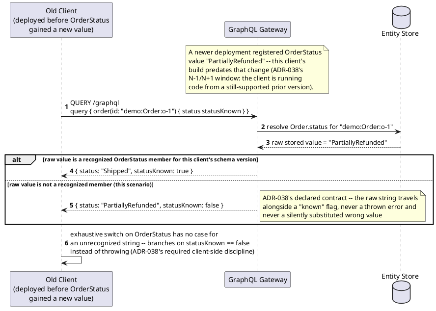
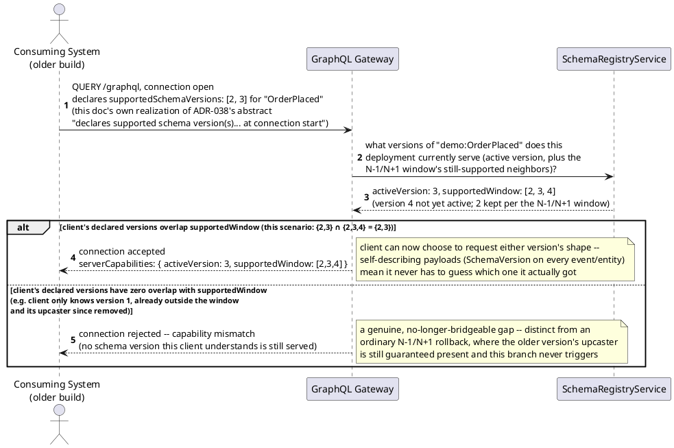
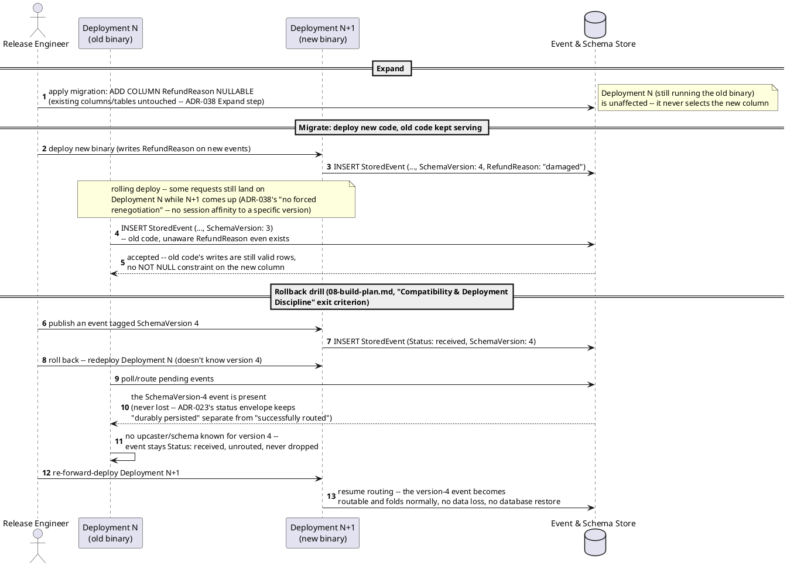
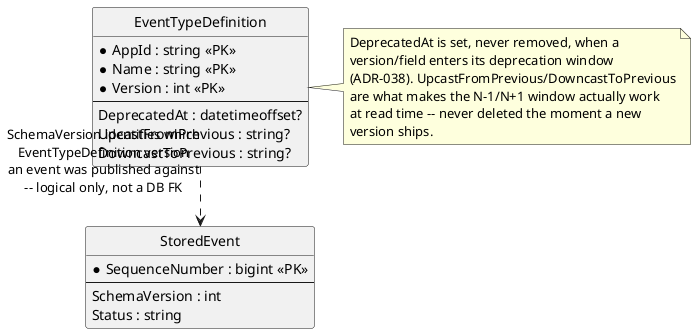

# Feature: Compatibility & versioning discipline (enum fallback, capability negotiation, Expand/Contract, N-1/N+1 rollback)

Context: `ADR-038` decides four distinct mechanisms that this doc gives
one coherent home to, since none had a feature-doc scenario before now
(`08-build-plan.md`, "Compatibility & Deployment Discipline" item, own
"Note" call-out): **(1)** an explicit unknown-value fallback contract for
every enum-like field, **(2)** a version-discovery capability-negotiation
handshake at connection start, **(3)** Expand/Contract (Parallel Change)
database migrations, and **(4)** the N-1/N+1 compatibility window that
makes a deployment rollback safe. `EventTypeDefinition.DeprecatedAt` and
`StoredEvent.SchemaVersion` — the two persisted fields these mechanisms
rest on — are defined in [`../data/schema-registry.md`](../data/schema-registry.md)
and [`../data/event-log.md`](../data/event-log.md) respectively; this doc
introduces no new column on either entity. The general pattern these
mechanisms specialize (Tolerant Reader, Postel's Law, upcasting) is
explained once in
[`../patterns/tolerant-reader-and-schema-evolution.md`](../patterns/tolerant-reader-and-schema-evolution.md)
and not re-derived here — this doc is about the *deployment-time*
guarantees `ADR-038` builds on top of that pattern.

This doc deliberately does **not** re-derive:
- The upcast/downcast transform mechanism itself (`ADR-018`/`ADR-028`,
  registration in [`schema-registry.md`](schema-registry.md)) — this doc
  assumes an `UpcastChain` already exists and focuses on the deployment
  discipline around *not deleting* an upcaster too early.
- `ADR-023`'s full status envelope (`received` / `processing` / `applied`
  / `rejected`, `SchemaStatus: unknown | invalid | conformant`) — defined
  in [`../data/event-log.md`](../data/event-log.md) and exercised end to
  end in [`entity-concept.md`](entity-concept.md); this doc only uses the
  `received` state as the safe landing point for an event a rolled-back
  deployment can't yet route.
- The GraphQL Gateway's own connection/transport mechanics (`ADR-037`,
  [`follow-subscribe.md`](follow-subscribe.md)) — this doc's capability-
  negotiation diagram reuses that same `QUERY /graphql` connection-open
  step rather than inventing a second transport.
- Feature flags as a mechanism in their own right (`ADR-077`,
  `FeatureFlagState` in [`../data/schema-registry.md`](../data/schema-registry.md))
  — `ADR-038` names feature flags only as "a faster lever than binary
  rollback," complementary to the mechanisms below, not a fifth
  mechanism this doc needs its own scenario for.
- The rollback drill's own exit criterion, already stated in
  [`../08-build-plan.md`](../08-build-plan.md), "Compatibility &
  Deployment Discipline" — the Gherkin scenario below restates it as a
  test scenario in this doc's own vocabulary, it does not redefine it.

**A wire-shape caveat, stated explicitly rather than glossed over**:
`ADR-038` gives one concrete example of the enum-fallback contract
(`status: "newValue", statusKnown: false`) and names one alternative
strategy (default to a designated `Unknown` enum member) as a **per-field
choice made at registration**, without mandating one over the other or
specifying a field-naming convention for the boolean sibling beyond that
one example. The sequence diagram below shows the example `ADR-038`
itself gives, verbatim. Likewise, `ADR-038` describes capability
negotiation only in the abstract ("a lightweight capability-negotiation
handshake... at connection start... plus self-describing payloads") and
never pins down a concrete endpoint, message, or field shape for it. The
diagram below is **one concrete, consistent realization** built on the
connection-open step `ADR-037`/`follow-subscribe.md` already establish
for Follow — it is this doc's own structural choice, not a shape `ADR-038`
states, and is flagged as such rather than cited as if verified.

## Sequence diagram — enum unknown-value fallback



The alternative strategy `ADR-038` names — defaulting deserialization to
a designated `Unknown` enum member instead of carrying a raw string — is
the same contract expressed as a closed GraphQL enum with an explicit
`UNKNOWN` value baked in at registration time; it isn't diagrammed
separately because the two strategies differ only in *which* schema-
registration-time choice a field's author makes (raw-string-plus-flag
vs. closed-enum-plus-catch-all-member), not in the deployment-safety
property either one delivers.

## Sequence diagram — version-discovery capability negotiation



The "rejected" branch is this doc's own extrapolation for the case where
overlap is truly empty (a client stuck on a version old enough that even
its upcaster has since been removed) — `ADR-038` states the N-1/N+1
window as the *minimum* guarantee, not a hard cutoff, and never says what
happens beyond it; this diagram treats "no shared version at all" as the
only case where a hard rejection is warranted, everything inside the
window as an accepted connection.

## Sequence diagram — Expand/Contract migration and the N-1/N+1 rollback window



## Data model (ER diagram)

No new column or table — both fields these mechanisms rest on are
already established elsewhere; this diagram shows only the two that this
doc's own scenarios touch, full column lists remain in
[`../data/schema-registry.md`](../data/schema-registry.md) and
[`../data/event-log.md`](../data/event-log.md).



## Salt (UI mockup)

Not applicable — this doc covers wire-protocol and deployment-time
discipline with no UI surface of its own, the same reasoning
[`entity-concept.md`](entity-concept.md) applies to the Entity Store fold;
see `ADR-039`/[`mvvm-client.md`](mvvm-client.md) for where a UI eventually
renders an entity carrying a `statusKnown: false` field (the generic
property-list/flag-rendering fallback that doc's own exit criteria
already cover, not re-derived here).

## Gherkin

```gherkin
Feature: Compatibility & versioning discipline
  As a platform operator running a mixed-version deployment
  I want unknown enum values, mismatched client capabilities, database
    migrations, and rolled-back deployments to all fail safe
  So that no event is ever lost or silently misinterpreted across a
    rolling upgrade or rollback

  # ADR-038 throughout. AppId "demo" unless a scenario says otherwise.

  Background:
    Given the event type "OrderPlaced" version 3 is registered with EntityIdField "$.OrderId"
    And "OrderPlaced" version 3's schema declares "status" as an enum-like field
      with the fallback contract "raw string alongside statusKnown"

  Scenario: An old client receives an event carrying an enum value it doesn't recognize
    Given a "demo:Order:o-1" entity was last patched by an event carrying
      status "PartiallyRefunded", a value added after this client's own build
    When the client queries { order(id: "demo:Order:o-1") { status statusKnown } }
    Then the response should equal { "status": "PartiallyRefunded", "statusKnown": false }
    And the client should not throw or crash on the unrecognized value
    # ADR-038's declared contract -- the raw string travels alongside a
    # "known" flag rather than the server substituting a wrong value or
    # the client's exhaustive switch throwing.

  Scenario: A client declaring a schema version inside the N-1/N+1 window negotiates successfully
    Given the deployment's active version for "OrderPlaced" is 3, with versions 2 and 4 also still supported
    When a client opens a connection declaring supportedSchemaVersions [2, 3]
    Then the connection should be accepted
    And the server should report serverCapabilities activeVersion 3, supportedWindow [2, 3, 4]

  Scenario: A client declaring only a version outside the supported window fails negotiation
    Given the deployment's active version for "OrderPlaced" is 3, with versions 2 and 4 also still supported
    And version 1's upcaster was removed after multiple deployment cycles
    When a client opens a connection declaring supportedSchemaVersions [1]
    Then the connection should be rejected with a capability-mismatch error
    # Distinct from an ordinary N-1/N+1 gap -- ADR-038's window guarantees
    # the immediately-prior/next version always work; this scenario is the
    # genuinely-unbridgeable case, once an upcaster far enough back is gone.

  Scenario: An Expand/Contract migration adds a nullable column without breaking the still-running old binary
    Given Deployment N is running against the current database shape
    When the release engineer applies a migration adding nullable column "RefundReason" to the Orders table
    Then Deployment N should continue inserting events successfully with no RefundReason value
    And Deployment N+1, once deployed, should write RefundReason on new events
    And no existing column or table should be altered or dropped by the migration
    # ADR-038's Expand step -- Contract (dropping the old shape) is optional
    # and, given this design's "never lose data" principle, may never happen.

  Scenario: A rolled-back deployment doesn't lose an event tagged with a schema version it doesn't know
    # Restates 08-build-plan.md's "Compatibility & Deployment Discipline"
    # exit criterion in this doc's own Gherkin vocabulary -- not a
    # redefinition of it.
    Given "OrderPlaced" version 4 has been deployed and is active
    When an event tagged SchemaVersion 4 is published and persists with status "received"
    And the deployment is rolled back to a version that does not know SchemaVersion 4
    Then that event should still sit with status "received", never lost
    When the deployment is re-forward-deployed to a version that knows SchemaVersion 4 again
    Then that event should become routable with no data loss and no database restore
```
