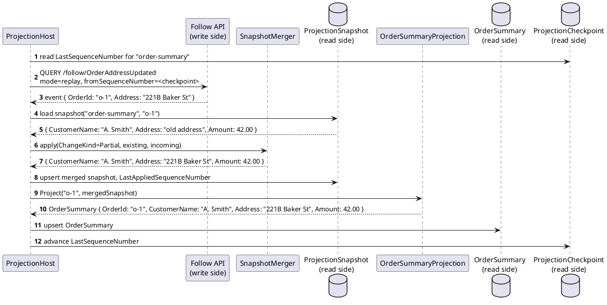
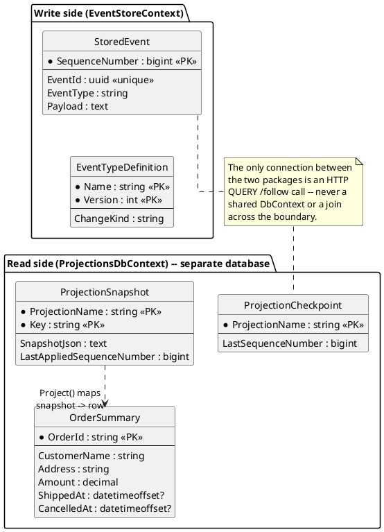

# Feature: CQRS read-model projections (worked example — Orders)

Context: design in `../09-cqrs-read-models.md`; decision records `ADR-015`
(projections as Follow consumers) and `ADR-016` (`ChangeKind`, centralized
merge) in `../07-adrs.md`. Builds on
[`follow-subscribe.md`](follow-subscribe.md) — a `ProjectionHost` is just
another Follow caller. Per `ADR-012`, `QUERY` is the real method for
Follow; this doc writes `GET`/`?param=value` shorthand throughout for
readability, same convention as the other feature docs — read it as
`QUERY`-with-body.

## The example domain

Four event types, chosen specifically to show both `ChangeKind` values and
the read model they build:

| Event type | `ChangeKind` | Carries |
|---|---|---|
| `OrderPlaced` | `Full` | Everything known about a new order: `OrderId`, `CustomerName`, `Address`, `Amount` |
| `OrderAddressUpdated` | `Partial` | Just `OrderId` and the new `Address` |
| `OrderShipped` | `Partial` | Just `OrderId` and `ShippedAt` |
| `OrderCancelled` | `Partial` | Just `OrderId` and `CancelledAt` |

One projection, `OrderSummaryProjection`, keys all four by `OrderId` and
maintains one read-model row per order:

```csharp
public class OrderSummaryProjection : IProjection<OrderSummary>
{
    public string Name => "order-summary";
    public IReadOnlyCollection<string> EventTypes { get; } =
        ["OrderPlaced", "OrderAddressUpdated", "OrderShipped", "OrderCancelled"];

    public string GetKey(string eventType, JsonNode payload) => payload["OrderId"]!.GetValue<string>();

    public OrderSummary Project(string key, JsonNode mergedState) => new()
    {
        OrderId = key,
        CustomerName = mergedState["CustomerName"]?.GetValue<string>(),
        Address = mergedState["Address"]?.GetValue<string>(),
        Amount = mergedState["Amount"]?.GetValue<decimal>(),
        ShippedAt = mergedState["ShippedAt"]?.GetValue<DateTimeOffset?>(),
        CancelledAt = mergedState["CancelledAt"]?.GetValue<DateTimeOffset?>(),
    };
}
```

Note what `Project` does *not* do: no merge logic, no `ChangeKind` branch,
no knowledge of which event just arrived — by the time `ProjectionHost`
calls it, `mergedState` already reflects every field any prior event for
this `OrderId` contributed, per `ADR-016`.

## Sequence diagram — one event's trip from Follow to the read model



`Amount`, untouched by `OrderAddressUpdated`'s payload, survives the merge
unchanged — that's `ADR-016`'s merge-patch rule, shown concretely rather
than just described.

## Data model (ER diagram) — the write/read boundary



## Salt (UI mockup)

Not applicable — the read model is queried directly (a plain SQL `SELECT`
against `OrderSummary`, or a thin read-only API over it, out of scope
here); there is no UI surface in this design.

## Gherkin

```gherkin
Feature: CQRS read-model projections (Orders example)
  As a system building query-optimized read models from the event stream
  I want a projection to correctly apply Full and Partial events
  So that a read model reflects the current state of an order without ever querying the write side directly

  # ProjectionHost authenticates as its own client (e.g. "projections-client",
  # scope events:follow) -- see auth.md's seeded-clients table.

  Background:
    Given the event type "OrderPlaced" version 1 is registered with ChangeKind "Full"
    And the event type "OrderAddressUpdated" version 1 is registered with ChangeKind "Partial"
    And the event type "OrderShipped" version 1 is registered with ChangeKind "Partial"
    And the event type "OrderCancelled" version 1 is registered with ChangeKind "Partial"
    And the "order-summary" projection is running, subscribed to all four event types

  Scenario: A Full event establishes the read model row from scratch
    When an "OrderPlaced" event is published with body:
      """
      { "OrderId": "o-1", "CustomerName": "A. Smith", "Address": "10 Downing St", "Amount": 42.00 }
      """
    Then eventually the "OrderSummary" row for "o-1" should equal:
      """
      { "OrderId": "o-1", "CustomerName": "A. Smith", "Address": "10 Downing St", "Amount": 42.00, "ShippedAt": null, "CancelledAt": null }
      """

  Scenario: A Partial event merges onto existing state, leaving untouched fields alone
    Given an "OrderPlaced" event was published for "o-1" with body { "OrderId": "o-1", "CustomerName": "A. Smith", "Address": "10 Downing St", "Amount": 42.00 }
    When an "OrderAddressUpdated" event is published with body:
      """
      { "OrderId": "o-1", "Address": "221B Baker St" }
      """
    Then eventually the "OrderSummary" row for "o-1" should have Address "221B Baker St"
    And the "OrderSummary" row for "o-1" should still have CustomerName "A. Smith" and Amount 42.00

  Scenario: Multiple independent Partial events each merge without clobbering the others' fields
    Given an "OrderPlaced" event was published for "o-1" with body { "OrderId": "o-1", "CustomerName": "A. Smith", "Address": "10 Downing St", "Amount": 42.00 }
    When an "OrderShipped" event is published with body { "OrderId": "o-1", "ShippedAt": "2026-01-05T10:00:00Z" }
    And an "OrderCancelled" event is published with body { "OrderId": "o-1", "CancelledAt": "2026-01-06T10:00:00Z" }
    Then eventually the "OrderSummary" row for "o-1" should have both ShippedAt "2026-01-05T10:00:00Z" and CancelledAt "2026-01-06T10:00:00Z"
    And Address should still be "10 Downing St"

  Scenario: A masked/absent field in a Partial event's payload is ignored on merge, not overlaid as a placeholder
    Given "OrderAddressUpdated" is registered with RequiredReadClaim "clearance:secret"
    And the "order-summary" projection's client lacks the "clearance:secret" claim
    And an "OrderPlaced" event was published for "o-1" with body { "OrderId": "o-1", "CustomerName": "A. Smith", "Address": "10 Downing St", "Amount": 42.00 }
    When an "OrderAddressUpdated" event is published with body { "OrderId": "o-1", "Address": "221B Baker St" }
    Then the projection cannot see that event at all (RequiredReadClaim gates connect time)
    And the "OrderSummary" row for "o-1" should still have Address "10 Downing St", unchanged

  Scenario: Registering an event type without ChangeKind is rejected
    When I PUT to "/registry/OrderRefunded" with a body that omits "changeKind"
    Then the response status should be 400

  Scenario: Full rebuild from scratch reproduces the same end state as incremental application
    Given an "OrderPlaced" event was published for "o-1" with body { "OrderId": "o-1", "CustomerName": "A. Smith", "Address": "10 Downing St", "Amount": 42.00 }
    And an "OrderAddressUpdated" event was published for "o-1" with body { "OrderId": "o-1", "Address": "221B Baker St" }
    And an "OrderShipped" event was published for "o-1" with body { "OrderId": "o-1", "ShippedAt": "2026-01-05T10:00:00Z" }
    And the "order-summary" projection has incrementally applied all three events
    When the "order-summary" projection's read-model table and snapshots are truncated, its checkpoint reset to 0, and it is restarted
    Then eventually the "OrderSummary" row for "o-1" should exactly match the state before the rebuild

  Scenario: Incremental resume after downtime delivers no gap and no duplicate
    Given an "OrderPlaced" event was published for "o-1" and the "order-summary" projection processed it, advancing its checkpoint
    And the "order-summary" projection is then stopped
    And an "OrderShipped" event is published for "o-1" while the projection is stopped
    When the "order-summary" projection is restarted
    Then it resumes with mode=replay&fromSequenceNumber=<its last checkpoint>
    And the "OrderShipped" event is applied exactly once
    And no event already reflected in the OrderSummary row is re-applied in a way that would be observable (idempotent upsert)
```
